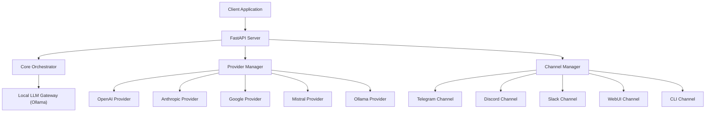
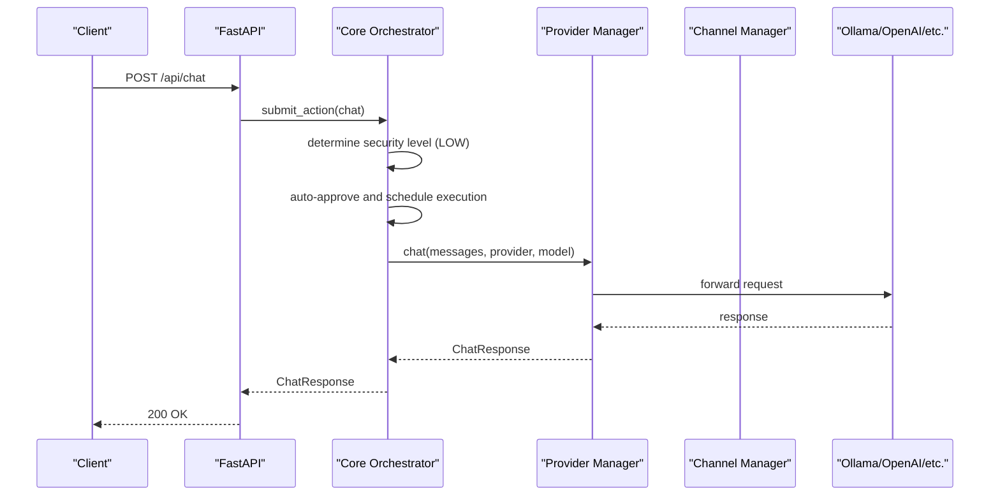
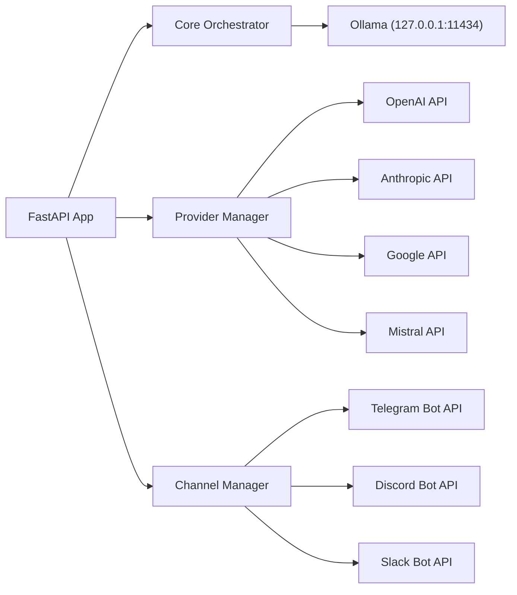

# API Reference

<cite>
**Referenced Files in This Document**
- [backend/app/main.py](file://backend/app/main.py)
- [backend/app/core/orchestrator.py](file://backend/app/core/orchestrator.py)
- [backend/app/core/providers.py](file://backend/app/core/providers.py)
- [backend/app/core/channels.py](file://backend/app/core/channels.py)
- [backend/app/core/security.py](file://backend/app/core/security.py)
- [backend/requirements.txt](file://backend/requirements.txt)
- [README.md](file://README.md)
- [frontend/package.json](file://frontend/package.json)
</cite>

## Table of Contents
1. [Introduction](#introduction)
2. [Project Structure](#project-structure)
3. [Core Components](#core-components)
4. [Architecture Overview](#architecture-overview)
5. [Detailed Component Analysis](#detailed-component-analysis)
6. [Dependency Analysis](#dependency-analysis)
7. [Performance Considerations](#performance-considerations)
8. [Troubleshooting Guide](#troubleshooting-guide)
9. [Conclusion](#conclusion)
10. [Appendices](#appendices)

## Introduction
This document provides comprehensive API documentation for ClosedPaw’s RESTful endpoints. It covers:
- Chat API for AI assistant interactions
- Action management endpoints for security workflows
- System status monitoring
- Audit logging endpoints
- Provider management APIs for provider registration, model listing, health checking, and configuration management
- Channel management APIs for channel registration, user binding, message sending, and status monitoring
- Protocol-specific examples, error handling strategies, security considerations, rate limiting, and versioning information
- Common use cases, client implementation guidelines, and performance optimization tips
- Debugging tools and monitoring approaches for API endpoints

The API follows a zero-trust security model, integrates Human-in-the-Loop (HITL) approvals for high-risk actions, and enforces strict input validation and audit logging.

## Project Structure
The API server is implemented using FastAPI and exposes endpoints grouped by functionality:
- Root and status endpoints
- Chat endpoints (single-provider and multi-provider)
- Action management (submit, approve/reject, status)
- Audit logs
- Skills management
- Provider management (registration, default provider, health, model listing)
- Channel management (registration, user binding, start/stop, status)
- Model management (list and switch)

**Diagram sources**
- [backend/app/main.py](file://backend/app/main.py#L90-L557)
- [backend/app/core/orchestrator.py](file://backend/app/core/orchestrator.py#L87-L486)
- [backend/app/core/providers.py](file://backend/app/core/providers.py#L418-L545)
- [backend/app/core/channels.py](file://backend/app/core/channels.py#L405-L524)

**Section sources**
- [backend/app/main.py](file://backend/app/main.py#L72-L87)
- [README.md](file://README.md#L75-L96)

## Core Components
- FastAPI application with CORS configured for localhost origins only
- Core Orchestrator manages actions, security levels, HITL approvals, and audit logs
- Provider Manager supports multiple LLM providers (Ollama, OpenAI, Anthropic, Google, Mistral)
- Channel Manager supports multiple channels (Telegram, Discord, Slack, WebUI, CLI)
- Security module provides prompt injection defense, rate limiting, and encrypted data vault

Key runtime behaviors:
- Actions are categorized by security level; low/medium actions auto-execute; high/critical require HITL approval
- Audit logs capture all actions for forensic analysis
- Rate limiting and input validation are enforced

**Section sources**
- [backend/app/main.py](file://backend/app/main.py#L72-L87)
- [backend/app/core/orchestrator.py](file://backend/app/core/orchestrator.py#L87-L130)
- [backend/app/core/security.py](file://backend/app/core/security.py#L35-L181)

## Architecture Overview
The API is organized around a central orchestrator that validates inputs, determines security levels, and routes actions to providers or channels. Providers encapsulate external LLM APIs; channels handle multi-protocol messaging.

**Diagram sources**
- [backend/app/main.py](file://backend/app/main.py#L130-L182)
- [backend/app/core/orchestrator.py](file://backend/app/core/orchestrator.py#L169-L224)
- [backend/app/core/providers.py](file://backend/app/core/providers.py#L470-L483)

## Detailed Component Analysis

### Authentication and Authorization
- No explicit authentication or authorization middleware is configured in the FastAPI app.
- CORS is restricted to localhost origins only.
- Security relies on zero-trust design, HITL approvals, and audit logging.

Recommendations:
- Add API key or JWT-based authentication for production deployments
- Enforce HTTPS and secure headers
- Implement RBAC for admin/moderator roles

**Section sources**
- [backend/app/main.py](file://backend/app/main.py#L80-L87)

### Versioning and Base URL
- API base path: /api
- Version: 1.0.0
- Root endpoint returns service metadata

**Section sources**
- [backend/app/main.py](file://backend/app/main.py#L73-L78)
- [backend/app/main.py](file://backend/app/main.py#L90-L98)

### Chat API

#### GET /api/status
- Description: Get system status including Ollama connectivity, available models, and pending actions
- Response: SystemStatus

Example response:
- status: running or initializing
- ollama_connected: boolean
- available_models: array of strings
- pending_actions: integer

**Section sources**
- [backend/app/main.py](file://backend/app/main.py#L101-L128)

#### POST /api/chat
- Description: Submit a chat message to the AI assistant
- Request body: ChatRequest
  - message: string
  - model: string (default llama3.2:3b)
  - use_cloud: boolean (default false)
- Response: ChatResponse
  - response: string
  - model: string
  - action_id: string
  - status: string (completed, failed, rejected, or pending)

Behavior:
- Low-security chat actions execute immediately
- High-security actions require HITL approval
- Returns immediately with status if still processing; otherwise returns result

**Section sources**
- [backend/app/main.py](file://backend/app/main.py#L130-L182)

#### POST /api/chat/multi
- Description: Chat using a specific provider
- Path parameters: none
- Query parameters:
  - message: string
  - provider: optional string
  - model: optional string
- Response: ChatResponse-like object with provider, tokens, latency

**Section sources**
- [backend/app/main.py](file://backend/app/main.py#L532-L554)

#### GET /api/models
- Description: List available LLM models
- Response: Array of ModelInfo
  - name: string
  - description: string
  - size: string
  - parameters: string

**Section sources**
- [backend/app/main.py](file://backend/app/main.py#L183-L210)

#### POST /api/models/switch
- Description: Switch to a different model
- Request body: model (string)
- Response: success object or error

Notes:
- Medium-security action requiring approval
- Returns success or raises HTTP 400/500 on failure

**Section sources**
- [backend/app/main.py](file://backend/app/main.py#L212-L238)

### Action Management

#### POST /api/actions
- Description: Submit a generic action
- Request body: ActionRequest
  - action_type: string (must be a valid ActionType)
  - parameters: dict
  - skill_id: optional string
- Response: action metadata
  - action_id: string
  - status: string
  - security_level: string
  - requires_approval: boolean

Security levels:
- LOW: no approval needed
- MEDIUM: log only
- HIGH: requires HITL approval
- CRITICAL: requires HITL + additional verification

**Section sources**
- [backend/app/main.py](file://backend/app/main.py#L240-L262)
- [backend/app/core/orchestrator.py](file://backend/app/core/orchestrator.py#L31-L57)

#### GET /api/actions/pending
- Description: Get all pending actions requiring approval
- Response: Array of action summaries

**Section sources**
- [backend/app/main.py](file://backend/app/main.py#L264-L281)

#### POST /api/actions/{action_id}/approve
- Description: Approve or reject a pending action
- Path parameters:
  - action_id: string
- Request body: ActionApprovalRequest
  - approved: boolean
  - user_id: string (default admin)
- Response: Approval result

**Section sources**
- [backend/app/main.py](file://backend/app/main.py#L283-L298)
- [backend/app/core/orchestrator.py](file://backend/app/core/orchestrator.py#L376-L427)

#### GET /api/actions/{action_id}
- Description: Get status of a specific action
- Path parameters:
  - action_id: string
- Response: Action details including result/error timestamps

**Section sources**
- [backend/app/main.py](file://backend/app/main.py#L300-L319)

### Audit Logging
#### GET /api/audit-logs
- Description: Get security audit logs
- Query parameters:
  - limit: integer (default 100)
- Response: Array of audit log entries

**Section sources**
- [backend/app/main.py](file://backend/app/main.py#L321-L339)
- [backend/app/core/orchestrator.py](file://backend/app/core/orchestrator.py#L458-L461)

### Skills Management
#### GET /api/skills
- Description: Get available skills
- Response: Array of skills with id, name, enabled flag

**Section sources**
- [backend/app/main.py](file://backend/app/main.py#L341-L354)

#### POST /api/skills/{skill_id}/enable
- Description: Enable a skill
- Path parameters:
  - skill_id: string
- Response: Enable status

**Section sources**
- [backend/app/main.py](file://backend/app/main.py#L356-L366)

#### POST /api/skills/{skill_id}/disable
- Description: Disable a skill
- Path parameters:
  - skill_id: string
- Response: Disable status

**Section sources**
- [backend/app/main.py](file://backend/app/main.py#L368-L378)

### Provider Management

#### GET /api/providers
- Description: Get all registered providers and status
- Response: Provider status object

**Section sources**
- [backend/app/main.py](file://backend/app/main.py#L382-L387)
- [backend/app/core/providers.py](file://backend/app/core/providers.py#L504-L518)

#### GET /api/providers/{provider_name}/models
- Description: Get models available from a provider
- Path parameters:
  - provider_name: string
- Response: Models list

**Section sources**
- [backend/app/main.py](file://backend/app/main.py#L389-L400)
- [backend/app/core/providers.py](file://backend/app/core/providers.py#L470-L483)

#### POST /api/providers/register
- Description: Register a new provider
- Query parameters:
  - provider_type: string (valid ProviderType)
  - name: string
  - api_key: optional string
  - base_url: optional string
  - default_model: optional string
- Response: Registration result

**Section sources**
- [backend/app/main.py](file://backend/app/main.py#L402-L434)
- [backend/app/core/providers.py](file://backend/app/core/providers.py#L418-L456)

#### POST /api/providers/{provider_name}/default
- Description: Set default provider
- Path parameters:
  - provider_name: string
- Response: Default provider change result

**Section sources**
- [backend/app/main.py](file://backend/app/main.py#L436-L445)

#### GET /api/providers/health
- Description: Health check all providers
- Response: Map of provider name to health status

**Section sources**
- [backend/app/main.py](file://backend/app/main.py#L447-L453)
- [backend/app/core/providers.py](file://backend/app/core/providers.py#L494-L503)

#### GET /api/providers/models
- Description: List models from all providers
- Response: Map of provider name to model lists

**Section sources**
- [backend/app/main.py](file://backend/app/main.py#L455-L461)
- [backend/app/core/providers.py](file://backend/app/core/providers.py#L484-L493)

### Channel Management

#### GET /api/channels
- Description: Get all registered channels and status
- Response: Channels status object

**Section sources**
- [backend/app/main.py](file://backend/app/main.py#L465-L470)
- [backend/app/core/channels.py](file://backend/app/core/channels.py#L491-L502)

#### POST /api/channels/register
- Description: Register a new channel
- Query parameters:
  - channel_type: string (valid ChannelType)
  - name: string
  - bot_token: optional string
  - allowed_users: array of strings
  - enabled: boolean (default true)
- Response: Registration result

**Section sources**
- [backend/app/main.py](file://backend/app/main.py#L472-L504)
- [backend/app/core/channels.py](file://backend/app/core/channels.py#L416-L443)

#### POST /api/channels/{channel_name}/bind-user
- Description: Bind user to channel allowlist
- Path parameters:
  - channel_name: string
- Query parameters:
  - user_id: string
  - username: optional string
- Response: Binding result

**Section sources**
- [backend/app/main.py](file://backend/app/main.py#L506-L512)
- [backend/app/core/channels.py](file://backend/app/core/channels.py#L484-L490)

#### POST /api/channels/start
- Description: Start all channels
- Response: Start status

**Section sources**
- [backend/app/main.py](file://backend/app/main.py#L514-L520)

#### POST /api/channels/stop
- Description: Stop all channels
- Response: Stop status

**Section sources**
- [backend/app/main.py](file://backend/app/main.py#L521-L528)

### Protocol-Specific Examples

- Ollama (local): default base URL http://127.0.0.1:11434
- OpenAI: base URL https://api.openai.com/v1
- Anthropic: base URL https://api.anthropic.com/v1
- Google: base URL https://generativelanguage.googleapis.com/v1beta
- Mistral: base URL https://api.mistral.ai/v1

Notes:
- Provider registration supports custom base URLs and API keys
- Health checks validate provider availability

**Section sources**
- [backend/app/core/providers.py](file://backend/app/core/providers.py#L102-L161)
- [backend/app/core/providers.py](file://backend/app/core/providers.py#L163-L222)
- [backend/app/core/providers.py](file://backend/app/core/providers.py#L224-L294)
- [backend/app/core/providers.py](file://backend/app/core/providers.py#L296-L354)
- [backend/app/core/providers.py](file://backend/app/core/providers.py#L356-L416)

### Error Handling Strategies
- HTTP exceptions are raised for invalid inputs, not found resources, and action failures
- Chat endpoints return immediate status if still processing; otherwise return result or error
- Provider and channel endpoints return descriptive errors on failure

Common status codes:
- 200 OK
- 400 Bad Request (invalid action type, model switch failure)
- 403 Forbidden (action rejected)
- 404 Not Found (action/provider/channel not found)
- 500 Internal Server Error (provider communication failure)

**Section sources**
- [backend/app/main.py](file://backend/app/main.py#L170-L181)
- [backend/app/main.py](file://backend/app/main.py#L247-L249)
- [backend/app/main.py](file://backend/app/main.py#L291-L292)
- [backend/app/main.py](file://backend/app/main.py#L362-L363)
- [backend/app/main.py](file://backend/app/main.py#L431-L432)

### Security Considerations
- Zero-trust architecture: implicit trust is not granted; all actions are vetted
- Prompt injection defense: input validation and sanitization
- Rate limiting: built-in rate limiter for security
- Audit logging: comprehensive logs for all actions
- Encrypted data vault: secure storage for API keys and secrets
- Local-only operation: binds to 127.0.0.1 by default

Recommendations:
- Add API key/JWT authentication
- Enforce HTTPS and secure headers
- Implement RBAC for admin/moderator roles
- Consider adding request throttling at the gateway level

**Section sources**
- [backend/app/core/security.py](file://backend/app/core/security.py#L35-L181)
- [backend/app/core/security.py](file://backend/app/core/security.py#L290-L318)
- [backend/app/core/security.py](file://backend/app/core/security.py#L325-L435)
- [README.md](file://README.md#L65-L74)

### Rate Limiting
- Built-in rate limiter tracks requests per key within a sliding window
- Used by the security module to detect potential attacks
- Action submission and chat endpoints rely on orchestrator timeouts rather than explicit API-level rate limits

**Section sources**
- [backend/app/core/security.py](file://backend/app/core/security.py#L290-L318)
- [backend/app/core/orchestrator.py](file://backend/app/core/orchestrator.py#L106-L108)

### Versioning Information
- API version: 1.0.0
- Backend framework: FastAPI 0.115.0
- Frontend: Next.js 15.1.0

**Section sources**
- [backend/app/main.py](file://backend/app/main.py#L73-L78)
- [backend/requirements.txt](file://backend/requirements.txt#L5-L6)
- [frontend/package.json](file://frontend/package.json#L12-L13)

### Common Use Cases and Client Implementation Guidelines
- Chat with local Ollama: POST /api/chat with message and model
- Multi-provider chat: POST /api/chat/multi with provider and model
- Model switching: POST /api/models/switch with model name
- Action approval workflow: submit action, poll /api/actions/{id}, approve via /api/actions/{id}/approve
- Provider management: register provider, set default, health check, list models
- Channel management: register channel, bind users, start/stop channels

Client implementation tips:
- Use axios/fetch to call /api endpoints
- Implement retry/backoff for transient failures
- Cache model lists and provider status
- Store API keys securely (encrypted vault)

**Section sources**
- [backend/app/main.py](file://backend/app/main.py#L130-L182)
- [backend/app/main.py](file://backend/app/main.py#L212-L238)
- [backend/app/main.py](file://backend/app/main.py#L240-L298)
- [backend/app/main.py](file://backend/app/main.py#L382-L461)
- [backend/app/main.py](file://backend/app/main.py#L464-L528)

### Performance Optimization Tips
- Prefer local Ollama for low-latency chat
- Cache model lists and provider health checks
- Batch action approvals when possible
- Use streaming responses for long-running tasks (future enhancement)
- Monitor pending actions and adjust timeouts accordingly

**Section sources**
- [backend/app/main.py](file://backend/app/main.py#L106-L128)
- [backend/app/core/orchestrator.py](file://backend/app/core/orchestrator.py#L106-L108)

### Debugging Tools and Monitoring Approaches
- System status endpoint: GET /api/status
- Audit logs: GET /api/audit-logs
- Pending actions: GET /api/actions/pending
- Provider health: GET /api/providers/health
- Channel status: GET /api/channels

Monitoring recommendations:
- Log API requests/responses at INFO level
- Track action completion times
- Alert on high rejection rates or audit events
- Monitor Ollama connectivity and model availability

**Section sources**
- [backend/app/main.py](file://backend/app/main.py#L101-L128)
- [backend/app/main.py](file://backend/app/main.py#L321-L339)
- [backend/app/main.py](file://backend/app/main.py#L264-L281)
- [backend/app/main.py](file://backend/app/main.py#L447-L453)
- [backend/app/main.py](file://backend/app/main.py#L465-L470)

## Dependency Analysis

**Diagram sources**
- [backend/app/main.py](file://backend/app/main.py#L14-L16)
- [backend/app/core/providers.py](file://backend/app/core/providers.py#L418-L545)
- [backend/app/core/channels.py](file://backend/app/core/channels.py#L405-L524)

**Section sources**
- [backend/requirements.txt](file://backend/requirements.txt#L5-L33)

## Performance Considerations
- Chat endpoints wait up to a configurable timeout; consider adjusting based on workload
- Provider health checks and model listings are asynchronous; cache results to reduce latency
- Rate limiting prevents abuse but may throttle legitimate users—tune thresholds appropriately
- Local Ollama reduces network latency; cloud providers introduce latency and cost

[No sources needed since this section provides general guidance]

## Troubleshooting Guide
- If chat returns “Processing...”, the action is still executing; poll /api/actions/{id} until completion
- If model switching fails, verify model availability via /api/models or /api/providers/models
- If actions are pending, approve via /api/actions/{id}/approve
- If providers are unhealthy, check base URLs and API keys
- If channels fail to send messages, verify tokens and user allowlists

**Section sources**
- [backend/app/main.py](file://backend/app/main.py#L154-L181)
- [backend/app/main.py](file://backend/app/main.py#L212-L238)
- [backend/app/main.py](file://backend/app/main.py#L283-L298)
- [backend/app/main.py](file://backend/app/main.py#L447-L461)
- [backend/app/main.py](file://backend/app/main.py#L506-L528)

## Conclusion
ClosedPaw’s API provides a secure, extensible foundation for AI-assisted workflows with robust security controls, multi-provider LLM support, and multi-channel messaging. Production deployments should add authentication, enforce HTTPS, and implement comprehensive monitoring and alerting.

[No sources needed since this section summarizes without analyzing specific files]

## Appendices

### API Definitions Summary

- Base URL: /api
- Version: 1.0.0
- CORS: localhost only

Endpoints:
- GET /api/status
- POST /api/chat
- POST /api/chat/multi
- GET /api/models
- POST /api/models/switch
- POST /api/actions
- GET /api/actions/pending
- POST /api/actions/{action_id}/approve
- GET /api/actions/{action_id}
- GET /api/audit-logs
- GET /api/skills
- POST /api/skills/{skill_id}/enable
- POST /api/skills/{skill_id}/disable
- GET /api/providers
- GET /api/providers/{provider_name}/models
- POST /api/providers/register
- POST /api/providers/{provider_name}/default
- GET /api/providers/health
- GET /api/providers/models
- GET /api/channels
- POST /api/channels/register
- POST /api/channels/{channel_name}/bind-user
- POST /api/channels/start
- POST /api/channels/stop

**Section sources**
- [backend/app/main.py](file://backend/app/main.py#L90-L557)