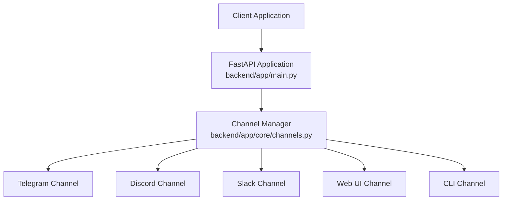
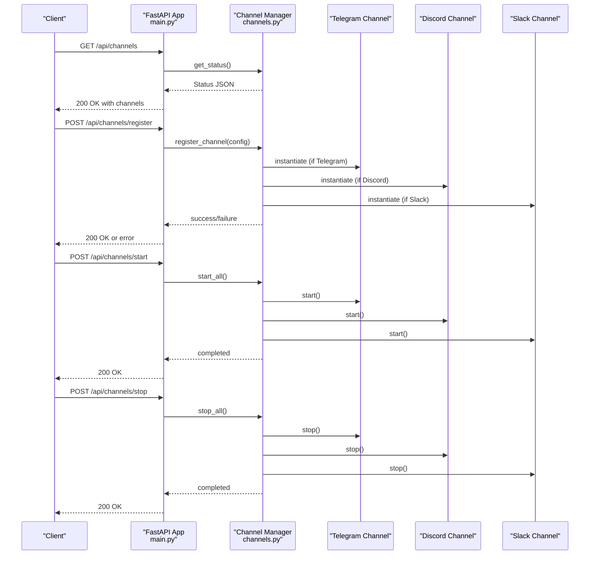
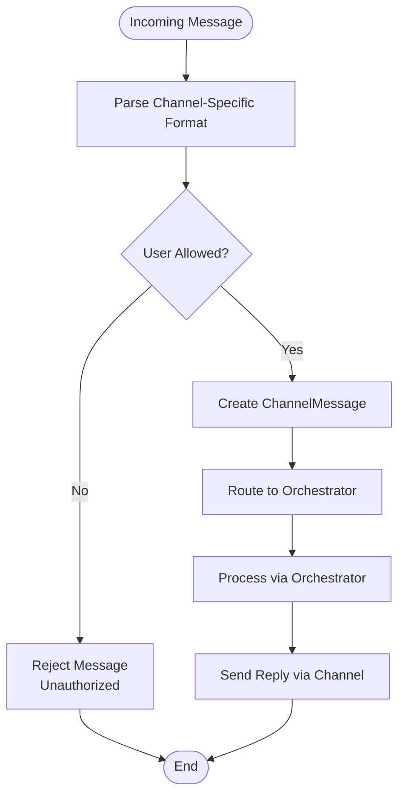
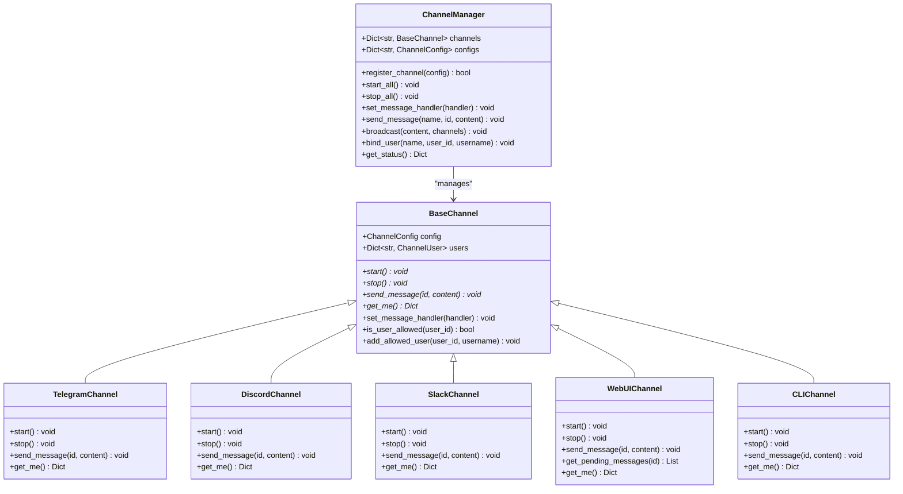

# Channel Management API

<cite>
**Referenced Files in This Document**
- [main.py](file://backend/app/main.py)
- [channels.py](file://backend/app/core/channels.py)
- [orchestrator.py](file://backend/app/core/orchestrator.py)
- [security.py](file://backend/app/core/security.py)
- [README.md](file://README.md)
</cite>

## Table of Contents
1. [Introduction](#introduction)
2. [Project Structure](#project-structure)
3. [Core Components](#core-components)
4. [Architecture Overview](#architecture-overview)
5. [Detailed Component Analysis](#detailed-component-analysis)
6. [Dependency Analysis](#dependency-analysis)
7. [Performance Considerations](#performance-considerations)
8. [Troubleshooting Guide](#troubleshooting-guide)
9. [Conclusion](#conclusion)

## Introduction
This document provides comprehensive API documentation for channel management endpoints that enable registration, configuration, and lifecycle control of communication channels (Telegram, Discord, Slack, Web UI, CLI). It covers HTTP methods, URL patterns, request/response schemas, and operational guidance for managing bots and user bindings. It also explains channel-specific authentication, user permission management, message routing, and troubleshooting connectivity issues.

## Project Structure
The channel management functionality is implemented in the backend FastAPI application and the core channel management module. The primary endpoints are exposed in the main application file and backed by the channel manager.

**Diagram sources**
- [main.py](file://backend/app/main.py#L464-L529)
- [channels.py](file://backend/app/core/channels.py#L405-L524)

**Section sources**
- [main.py](file://backend/app/main.py#L464-L529)
- [channels.py](file://backend/app/core/channels.py#L405-L524)

## Core Components
- Channel Manager: Central component responsible for registering channels, starting/stopping channel instances, broadcasting messages, and maintaining channel configurations.
- Channel Types: Support for Telegram, Discord, Slack, Web UI, and CLI channels.
- Channel Configuration: Defines channel-specific settings including tokens, allowed users, rate limits, and security options.
- Channel Users: Tracks user identities, permissions, and pairing status per channel.

Key responsibilities:
- Registration of channels with type-specific configuration
- Starting and stopping channel services
- Binding users to channel allowlists
- Retrieving channel status
- Routing messages to appropriate channels

**Section sources**
- [channels.py](file://backend/app/core/channels.py#L18-L65)
- [channels.py](file://backend/app/core/channels.py#L405-L524)

## Architecture Overview
The channel management API integrates with the FastAPI application and delegates operations to the Channel Manager. The Channel Manager instantiates channel-specific implementations and manages message routing and security policies.

**Diagram sources**
- [main.py](file://backend/app/main.py#L466-L528)
- [channels.py](file://backend/app/core/channels.py#L445-L454)

## Detailed Component Analysis

### Channel Registration Endpoint
Registers a new communication channel with the system.

- Method: POST
- URL: /api/channels/register
- Query parameters:
  - channel_type: string (required) - Supported values: webui, telegram, discord, slack, cli
  - name: string (required) - Unique channel identifier
  - bot_token: string (optional) - Channel-specific authentication token (e.g., Telegram bot token)
  - allowed_users: array of strings (optional) - Initial allowlist of user IDs
  - enabled: boolean (optional, default true) - Whether the channel starts enabled
- Response: JSON object with status and channel name

Behavior:
- Validates channel_type against supported types
- Creates ChannelConfig with provided parameters
- Instantiates the appropriate channel class (Telegram, Discord, Slack, Web UI, CLI)
- Registers the channel with the Channel Manager
- Returns success or raises HTTP 500 on failure

Example usage:
- Register a Telegram bot with a bot token and initial user allowlist
- Register a Discord bot with a bot token
- Register a Web UI channel (no token required)

**Section sources**
- [main.py](file://backend/app/main.py#L473-L504)
- [channels.py](file://backend/app/core/channels.py#L416-L443)

### User Binding Endpoint
Adds a user to a channel's allowlist, enabling message routing and command access.

- Method: POST
- URL: /api/channels/{channel_name}/bind-user
- Path parameters:
  - channel_name: string (required) - Registered channel identifier
- Query parameters:
  - user_id: string (required) - User identifier to bind
  - username: string (optional) - User's display name
- Response: JSON object with status, channel name, and user_id

Behavior:
- Retrieves the channel by name
- Adds user to the channel's allowlist
- Records user pairing metadata
- Returns success confirmation

Example usage:
- Bind a user to a Telegram channel after successful authentication
- Bind multiple users to a Web UI channel for administrative access

**Section sources**
- [main.py](file://backend/app/main.py#L507-L512)
- [channels.py](file://backend/app/core/channels.py#L484-L490)

### Channel Lifecycle Management Endpoints
Controls the runtime state of all channels.

- Start all channels:
  - Method: POST
  - URL: /api/channels/start
  - Response: JSON object with status "started"

- Stop all channels:
  - Method: POST
  - URL: /api/channels/stop
  - Response: JSON object with status "stopped"

Behavior:
- Start: Iterates through registered channels and invokes start() on enabled channels
- Stop: Iterates through registered channels and invokes stop()

Example usage:
- Start channels after system initialization
- Stop channels during maintenance or shutdown

**Section sources**
- [main.py](file://backend/app/main.py#L515-L528)
- [channels.py](file://backend/app/core/channels.py#L445-L454)

### Channel Status Monitoring Endpoint
Retrieves the current status of all registered channels.

- Method: GET
- URL: /api/channels
- Response: JSON object containing:
  - channels: object keyed by channel name with:
    - type: string - Channel type (e.g., telegram, discord, slack, webui, cli)
    - enabled: boolean - Whether the channel is enabled
    - allowed_users: integer - Count of users in allowlist

Behavior:
- Calls ChannelManager.get_status()
- Aggregates channel configurations and counts

Example usage:
- Monitor channel health and configuration
- Verify allowlist sizes and enabled status

**Section sources**
- [main.py](file://backend/app/main.py#L466-L470)
- [channels.py](file://backend/app/core/channels.py#L491-L502)

### Channel-Specific Authentication and Permissions

#### Telegram Channel Authentication
- Uses bot_token for API authentication
- Polls updates via Telegram Bot API
- Requires bot_token for start() to function
- Enforces user allowlist checks before processing messages

#### Discord Channel Authentication
- Uses bot_token for Authorization header
- Requires bot_token for API calls
- Fetches bot information via Discord API

#### Slack Channel Authentication
- Uses bot_token for Bearer token in Authorization header
- Requires bot_token for API calls
- Uses Slack chat.postMessage endpoint

#### Web UI and CLI Channels
- Web UI: Internal channel without external authentication
- CLI: Terminal-based channel without external authentication

#### User Permission Management
- Channel-level allowlists controlled via allowed_users
- Users must be explicitly bound to a channel to receive messages
- BaseChannel.is_user_allowed() enforces allowlist checks
- ChannelManager.bind_user() adds users to allowlist

**Section sources**
- [channels.py](file://backend/app/core/channels.py#L177-L286)
- [channels.py](file://backend/app/core/channels.py#L288-L382)
- [channels.py](file://backend/app/core/channels.py#L336-L382)
- [channels.py](file://backend/app/core/channels.py#L117-L134)

### Message Routing and Processing
- Incoming messages are parsed and validated by channel implementations
- ChannelMessage objects encapsulate message metadata
- ChannelManager.set_message_handler() routes messages to the orchestrator
- BaseChannel.add_allowed_user() maintains user permissions
- Broadcast capability supports sending messages to multiple channels

**Diagram sources**
- [channels.py](file://backend/app/core/channels.py#L225-L257)
- [channels.py](file://backend/app/core/channels.py#L117-L134)

**Section sources**
- [channels.py](file://backend/app/core/channels.py#L29-L40)
- [channels.py](file://backend/app/core/channels.py#L112-L116)
- [channels.py](file://backend/app/core/channels.py#L456-L460)

## Dependency Analysis
The channel management API depends on the Channel Manager and channel implementations. The Channel Manager maintains channel instances and configurations, while individual channel classes handle protocol-specific operations.

**Diagram sources**
- [channels.py](file://backend/app/core/channels.py#L405-L524)
- [channels.py](file://backend/app/core/channels.py#L79-L136)
- [channels.py](file://backend/app/core/channels.py#L177-L286)
- [channels.py](file://backend/app/core/channels.py#L288-L382)
- [channels.py](file://backend/app/core/channels.py#L336-L382)
- [channels.py](file://backend/app/core/channels.py#L137-L175)
- [channels.py](file://backend/app/core/channels.py#L384-L403)

**Section sources**
- [channels.py](file://backend/app/core/channels.py#L405-L524)

## Performance Considerations
- Asynchronous operations: Channel implementations use async HTTP clients for external APIs to avoid blocking
- Rate limiting: ChannelConfig includes rate_limit_per_user and rate_limit_global fields for controlling message throughput
- Polling intervals: Telegram polling uses timeouts to balance responsiveness and resource usage
- Graceful shutdown: ChannelManager.stop_all() ensures channels are stopped cleanly

Recommendations:
- Monitor channel status endpoints to detect connectivity issues early
- Adjust rate limits based on channel capacity and usage patterns
- Use start/stop endpoints to conserve resources during idle periods

**Section sources**
- [channels.py](file://backend/app/core/channels.py#L56-L58)
- [channels.py](file://backend/app/core/channels.py#L202-L224)

## Troubleshooting Guide

Common issues and resolutions:
- Channel not starting:
  - Verify bot_token is configured for Telegram/Discord/Slack channels
  - Check network connectivity to respective API endpoints
  - Confirm channel is enabled in configuration

- Unauthorized user errors:
  - Ensure user is bound to channel allowlist via /api/channels/{channel_name}/bind-user
  - Verify user_id matches the platform's user identifier

- Messages not received:
  - Confirm channel is started and running
  - Check rate limits and global throttling
  - Validate channel-specific authentication tokens

- Health monitoring:
  - Use /api/channels to inspect enabled status and allowlist counts
  - Check application logs for channel-specific error messages

Security considerations:
- All channels operate on localhost-only binding for security
- Prompt injection defense is applied to user inputs processed by the system
- Audit logs track security-relevant events

**Section sources**
- [main.py](file://backend/app/main.py#L466-L528)
- [security.py](file://backend/app/core/security.py#L116-L180)
- [README.md](file://README.md#L65-L74)

## Conclusion
The channel management API provides a robust foundation for integrating multiple communication channels with strong security controls, user permission management, and operational visibility. By leveraging the documented endpoints and following the troubleshooting guidance, administrators can reliably deploy and maintain secure channel integrations for Telegram, Discord, Slack, Web UI, and CLI environments.