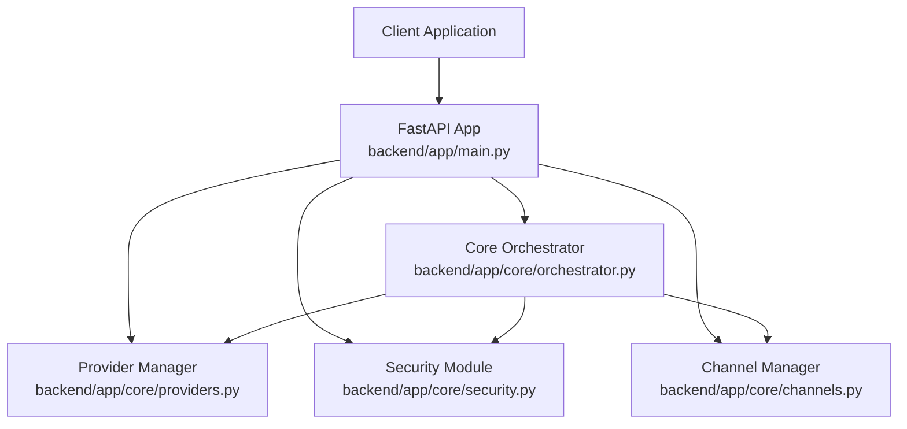
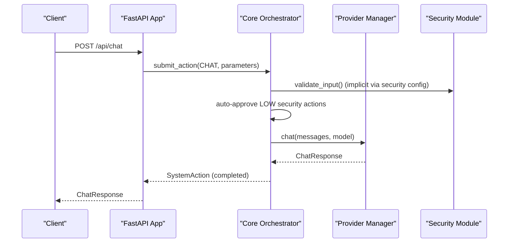
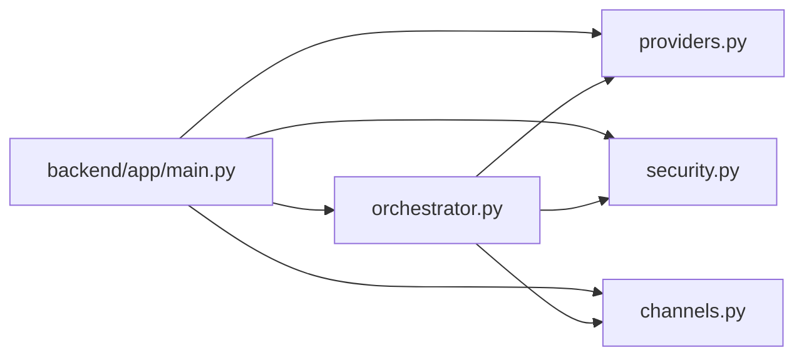

# Core API Endpoints

<cite>
**Referenced Files in This Document**
- [main.py](file://backend/app/main.py)
- [orchestrator.py](file://backend/app/core/orchestrator.py)
- [providers.py](file://backend/app/core/providers.py)
- [security.py](file://backend/app/core/security.py)
- [channels.py](file://backend/app/core/channels.py)
- [requirements.txt](file://backend/requirements.txt)
- [README.md](file://README.md)
</cite>

## Table of Contents
1. [Introduction](#introduction)
2. [Project Structure](#project-structure)
3. [Core Components](#core-components)
4. [Architecture Overview](#architecture-overview)
5. [Detailed Component Analysis](#detailed-component-analysis)
6. [Dependency Analysis](#dependency-analysis)
7. [Performance Considerations](#performance-considerations)
8. [Troubleshooting Guide](#troubleshooting-guide)
9. [Conclusion](#conclusion)

## Introduction
This document provides comprehensive API documentation for the ClosedPaw core endpoints. It covers:
- Chat API for conversational AI assistance
- Action management endpoints for submitting, approving, and querying actions
- System status monitoring endpoint
- Audit logging endpoint

It explains HTTP methods, URL patterns, request/response schemas, authentication methods, security implications, rate limiting, error handling strategies, integration patterns, and client implementation guidelines with performance optimization tips.

## Project Structure
The backend is implemented with FastAPI and organized around a central orchestrator that manages actions, security, and integrations with providers and channels. The main application wires endpoints and delegates to the orchestrator and supporting managers.

**Diagram sources**
- [main.py](file://backend/app/main.py#L72-L557)
- [orchestrator.py](file://backend/app/core/orchestrator.py#L87-L486)
- [providers.py](file://backend/app/core/providers.py#L418-L545)
- [security.py](file://backend/app/core/security.py#L35-L455)
- [channels.py](file://backend/app/core/channels.py#L405-L524)

**Section sources**
- [main.py](file://backend/app/main.py#L72-L129)
- [README.md](file://README.md#L134-L155)

## Core Components
- FastAPI application with CORS restricted to localhost origins
- Core Orchestrator: action lifecycle, HITL approvals, audit logging, security level determination
- Provider Manager: multi-provider LLM gateway (Ollama, OpenAI, Anthropic, Google, Mistral)
- Security Module: prompt injection defense, rate limiting, encrypted data vault
- Channel Manager: multi-channel gateway (Web UI, Telegram, Discord, Slack, CLI)

Key runtime behaviors:
- System status endpoint checks local LLM availability and counts pending actions
- Chat endpoint submits chat actions and waits up to a timeout for completion
- Action endpoints support submission, approval/rejection, and status queries
- Audit logs capture all actions for forensics

**Section sources**
- [main.py](file://backend/app/main.py#L80-L87)
- [orchestrator.py](file://backend/app/core/orchestrator.py#L87-L130)
- [providers.py](file://backend/app/core/providers.py#L418-L483)
- [security.py](file://backend/app/core/security.py#L290-L318)

## Architecture Overview
The API layer delegates to the orchestrator, which enforces security levels and logs audit events. Providers handle LLM interactions, and channels manage multi-protocol messaging.

**Diagram sources**
- [main.py](file://backend/app/main.py#L131-L182)
- [orchestrator.py](file://backend/app/core/orchestrator.py#L169-L224)
- [providers.py](file://backend/app/core/providers.py#L470-L483)
- [security.py](file://backend/app/core/security.py#L116-L181)

## Detailed Component Analysis

### Chat API (/api/chat)
- Method: POST
- URL: /api/chat
- Request body schema:
  - message: string (required)
  - model: string (optional, default value present)
  - use_cloud: boolean (optional, default value present)
- Response schema:
  - response: string
  - model: string
  - action_id: string
  - status: string (completed, failed, rejected, or pending/processing)
- Behavior:
  - Submits a chat action with LOW security
  - Waits up to a fixed timeout for completion
  - Returns completion result or a processing indicator if still pending
- Error handling:
  - HTTP 500 for failed actions
  - HTTP 403 for rejected actions
  - Timeout returns a processing status with action_id

Example usage:
- Submit a message to the local LLM
- Optionally request cloud LLM usage
- Receive immediate or delayed response depending on completion

Security and rate limiting:
- Input validation and sanitization occur via security module configuration
- Rate limiting is enforced centrally

**Section sources**
- [main.py](file://backend/app/main.py#L131-L182)
- [orchestrator.py](file://backend/app/core/orchestrator.py#L169-L224)
- [security.py](file://backend/app/core/security.py#L116-L181)

### Action Management Endpoints
- POST /api/actions
  - Body: action_type (enum), parameters (dict), skill_id (optional)
  - Response: action_id, status, security_level, requires_approval
  - Behavior: Submits a generic action; determines security level automatically
- GET /api/actions/pending
  - Response: list of pending actions with metadata
- POST /api/actions/{action_id}/approve
  - Body: approved (boolean), user_id (string, default admin)
  - Behavior: Approve or reject a pending action; triggers execution if approved
- GET /api/actions/{action_id}
  - Response: detailed action status, result, error, timestamps

Security levels and HITL:
- LOW: auto-approved and executed
- MEDIUM: logged
- HIGH/CRITICAL: require Human-in-the-Loop approval
- Approval flow integrates with web UI for HITL

Audit logging:
- All action submissions, approvals, completions, and failures are recorded

**Section sources**
- [main.py](file://backend/app/main.py#L241-L319)
- [orchestrator.py](file://backend/app/core/orchestrator.py#L376-L428)
- [orchestrator.py](file://backend/app/core/orchestrator.py#L451-L462)

### System Status Monitoring (/api/status)
- Method: GET
- URL: /api/status
- Response schema:
  - status: string ("running" or "initializing")
  - ollama_connected: boolean
  - available_models: array of strings
  - pending_actions: integer
- Behavior:
  - Checks local LLM service connectivity
  - Lists available models
  - Counts pending actions awaiting approval

Operational notes:
- Health check against local LLM endpoint
- Graceful handling when LLM is unavailable

**Section sources**
- [main.py](file://backend/app/main.py#L101-L129)
- [orchestrator.py](file://backend/app/core/orchestrator.py#L112-L129)

### Audit Logging (/api/audit-logs)
- Method: GET
- URL: /api/audit-logs?limit=N
- Response: list of audit log entries
  - timestamp: ISO datetime
  - action_id: string
  - action_type: enum
  - skill_id: optional string
  - status: enum
  - outcome: optional string
  - details: object

Storage:
- Logs are maintained in-memory and persisted to a temporary file for auditability

**Section sources**
- [main.py](file://backend/app/main.py#L322-L339)
- [orchestrator.py](file://backend/app/core/orchestrator.py#L459-L462)

### Authentication and Authorization
- CORS is configured to allow only localhost origins for security
- No explicit API key or JWT authentication is implemented in the documented endpoints
- HITL approval requires a user identifier; default is a constant value in the endpoint

Recommendations:
- Deploy behind a reverse proxy that enforces TLS and optional auth
- Restrict network exposure to loopback interfaces only
- Consider adding API keys or session-based auth for production deployments

**Section sources**
- [main.py](file://backend/app/main.py#L80-L87)
- [main.py](file://backend/app/main.py#L284-L298)

### Provider and Channel Integration
- Provider Manager supports multiple LLM providers and health checks
- Channel Manager supports multiple communication channels with allowlists and rate limits

These integrations are leveraged by the orchestrator for execution and delivery.

**Section sources**
- [providers.py](file://backend/app/core/providers.py#L418-L524)
- [channels.py](file://backend/app/core/channels.py#L405-L524)

## Dependency Analysis
The API depends on the orchestrator, which in turn coordinates providers and channels. Security policies are embedded in the orchestrator’s configuration.

**Diagram sources**
- [main.py](file://backend/app/main.py#L14-L16)
- [orchestrator.py](file://backend/app/core/orchestrator.py#L87-L130)

**Section sources**
- [requirements.txt](file://backend/requirements.txt#L4-L36)

## Performance Considerations
- Chat endpoint uses a bounded wait loop; tune timeouts based on workload
- Provider calls are asynchronous; ensure provider endpoints are responsive
- Audit logs are stored in-memory and written to disk; consider log rotation for long-running deployments
- Rate limiting is enforced in the security module; adjust thresholds as needed

[No sources needed since this section provides general guidance]

## Troubleshooting Guide
Common issues and resolutions:
- Local LLM not available:
  - Verify local LLM service is running and reachable
  - Status endpoint will reflect connection state
- Action stuck in pending:
  - Check for HITL approvals
  - Use action status endpoint to inspect details
- Provider errors:
  - Health check providers endpoint to diagnose connectivity
  - Confirm credentials and model availability
- Security alerts:
  - Review security module validation outcomes
  - Adjust rate limits or input patterns

**Section sources**
- [main.py](file://backend/app/main.py#L101-L129)
- [orchestrator.py](file://backend/app/core/orchestrator.py#L459-L462)
- [security.py](file://backend/app/core/security.py#L290-L318)

## Conclusion
The ClosedPaw core API provides a secure, auditable foundation for chat, action management, and system monitoring. By leveraging the orchestrator’s security levels, audit logging, and multi-provider architecture, clients can integrate AI capabilities with strong safeguards. For production, deploy behind trusted infrastructure with appropriate authentication and exposure controls.