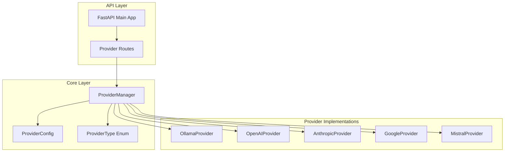
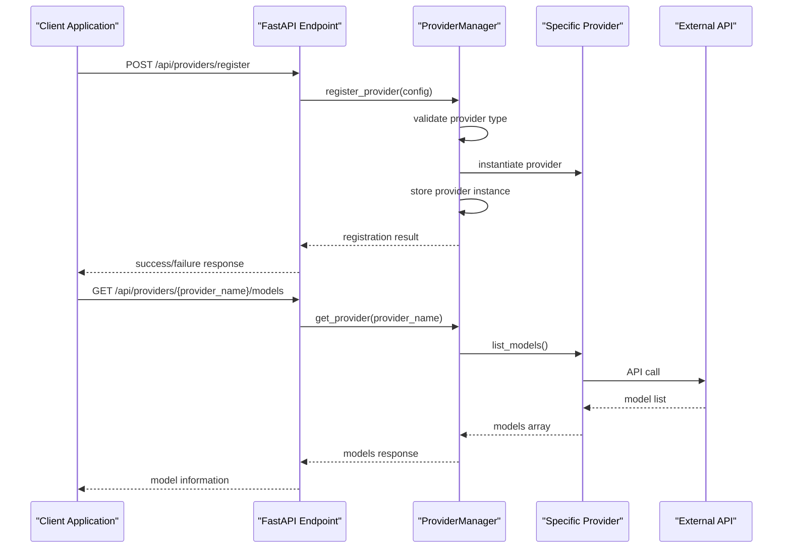
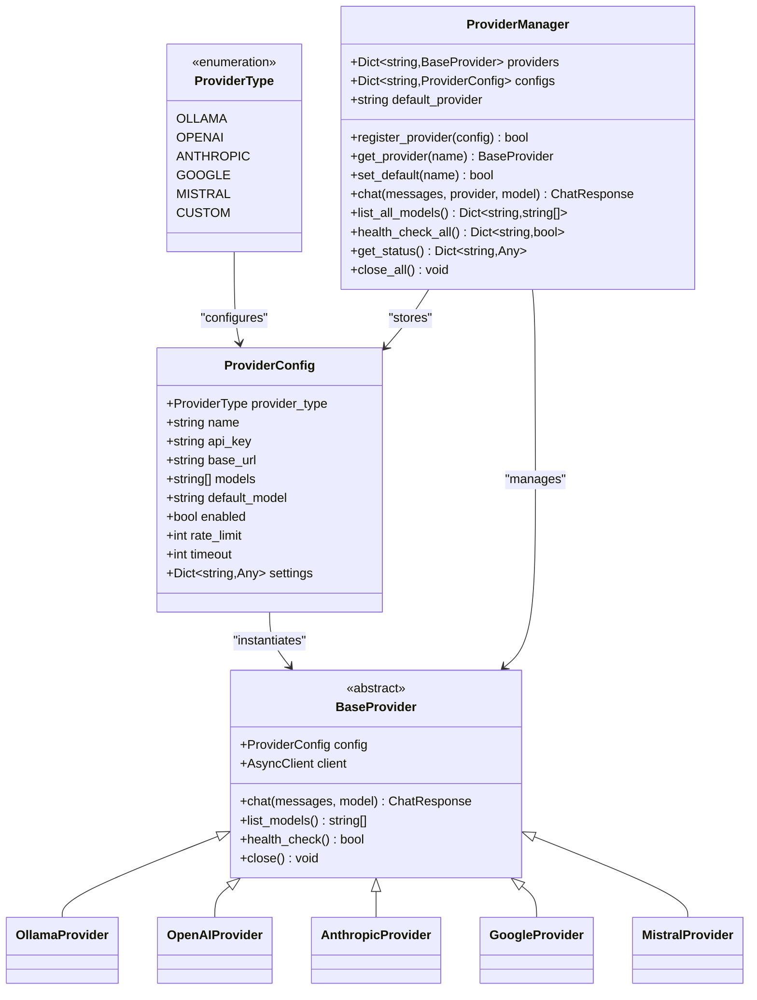

# Provider Management API

<cite>
**Referenced Files in This Document**
- [main.py](file://backend/app/main.py)
- [providers.py](file://backend/app/core/providers.py)
- [README.md](file://README.md)
- [requirements.txt](file://backend/requirements.txt)
</cite>

## Table of Contents
1. [Introduction](#introduction)
2. [Project Structure](#project-structure)
3. [Core Components](#core-components)
4. [Architecture Overview](#architecture-overview)
5. [Detailed Component Analysis](#detailed-component-analysis)
6. [Dependency Analysis](#dependency-analysis)
7. [Performance Considerations](#performance-considerations)
8. [Troubleshooting Guide](#troubleshooting-guide)
9. [Conclusion](#conclusion)

## Introduction
This document provides comprehensive API documentation for the provider management endpoints in the ClosedPaw system. It covers cloud provider registration, configuration, model management, and health monitoring capabilities. The system supports multiple LLM providers including OpenAI, Anthropic, Google, and Mistral, with a focus on zero-trust security and local-first operation.

## Project Structure
The provider management functionality is implemented within the FastAPI backend application, specifically in the main application file and the core providers module. The system follows a modular architecture with clear separation between API endpoints, provider implementations, and configuration management.



**Diagram sources**
- [main.py](file://backend/app/main.py#L381-L462)
- [providers.py](file://backend/app/core/providers.py#L418-L544)

**Section sources**
- [main.py](file://backend/app/main.py#L1-L567)
- [providers.py](file://backend/app/core/providers.py#L1-L545)

## Core Components
The provider management system consists of several key components:

### Provider Types
The system supports five primary provider types:
- **Ollama**: Local LLM deployment
- **OpenAI**: GPT series models
- **Anthropic**: Claude models
- **Google**: Gemini models
- **Mistral**: Mistral AI models

### Provider Configuration
Each provider is configured through a structured configuration object that includes:
- Provider type identification
- Unique provider name
- API key authentication
- Base URL customization
- Default model specification
- Enable/disable status
- Rate limiting and timeout settings

### Provider Manager
The central manager handles provider lifecycle management, including registration, selection, and health monitoring across all supported providers.

**Section sources**
- [providers.py](file://backend/app/core/providers.py#L20-L45)
- [providers.py](file://backend/app/core/providers.py#L418-L544)

## Architecture Overview
The provider management architecture follows a layered approach with clear separation of concerns:



**Diagram sources**
- [main.py](file://backend/app/main.py#L403-L434)
- [main.py](file://backend/app/main.py#L390-L401)
- [providers.py](file://backend/app/core/providers.py#L418-L493)

## Detailed Component Analysis

### Provider Registration Endpoint
The provider registration endpoint enables dynamic addition of cloud LLM providers to the system.

**Endpoint**: `POST /api/providers/register`

**Request Parameters**:
- `provider_type` (string, required): Type of provider to register
- `name` (string, required): Unique identifier for the provider
- `api_key` (string, optional): Authentication key for the provider
- `base_url` (string, optional): Custom base URL for the provider API
- `default_model` (string, optional): Default model to use when unspecified

**Validation Rules**:
- `provider_type` must be one of: `ollama`, `openai`, `anthropic`, `google`, `mistral`
- `name` must be unique within the system
- `api_key` is required for cloud providers (OpenAI, Anthropic, Google, Mistral)
- `base_url` defaults to provider-specific endpoints when not provided

**Response Schema**:
```json
{
  "status": "success",
  "provider": "string"
}
```

**Error Responses**:
- `400 Bad Request`: Invalid provider type specified
- `500 Internal Server Error`: Failed to register provider

**Section sources**
- [main.py](file://backend/app/main.py#L403-L434)
- [providers.py](file://backend/app/core/providers.py#L429-L456)

### Provider Configuration Endpoint
The provider configuration endpoint allows setting a specific provider as the default for system operations.

**Endpoint**: `POST /api/providers/{provider_name}/default`

**Path Parameters**:
- `provider_name` (string, required): Name of provider to set as default

**Response Schema**:
```json
{
  "status": "success",
  "default_provider": "string"
}
```

**Error Responses**:
- `404 Not Found`: Provider with specified name does not exist

**Section sources**
- [main.py](file://backend/app/main.py#L437-L445)

### Model Management Endpoint
The model management endpoint retrieves available models from a specific provider.

**Endpoint**: `GET /api/providers/{provider_name}/models`

**Path Parameters**:
- `provider_name` (string, required): Name of provider to query

**Response Schema**:
```json
{
  "provider": "string",
  "models": ["string"]
}
```

**Error Responses**:
- `404 Not Found`: Provider with specified name does not exist

**Section sources**
- [main.py](file://backend/app/main.py#L390-L401)

### Health Monitoring Endpoint
The health monitoring endpoint checks the operational status of all registered providers.

**Endpoint**: `GET /api/providers/health`

**Response Schema**:
```json
{
  "provider_name": boolean
}
```

Example response:
```json
{
  "openai": true,
  "anthropic": false,
  "google": true,
  "mistral": true
}
```

**Section sources**
- [main.py](file://backend/app/main.py#L448-L453)

### Additional Provider Management Endpoints

**List All Models Endpoint**:
- **Endpoint**: `GET /api/providers/models`
- **Purpose**: Retrieve models from all registered providers
- **Response**: Object mapping provider names to their model lists

**List Providers Endpoint**:
- **Endpoint**: `GET /api/providers`
- **Purpose**: Get status and configuration of all registered providers
- **Response**: Includes default provider and provider configurations

**Multi-Provider Chat Endpoint**:
- **Endpoint**: `POST /api/chat/multi`
- **Purpose**: Chat using a specific provider with optional model specification
- **Response**: Contains response content, model used, provider, and usage metrics

**Section sources**
- [main.py](file://backend/app/main.py#L455-L461)
- [main.py](file://backend/app/main.py#L383-L387)
- [main.py](file://backend/app/main.py#L532-L554)

## Dependency Analysis



**Diagram sources**
- [providers.py](file://backend/app/core/providers.py#L20-L45)
- [providers.py](file://backend/app/core/providers.py#L68-L100)
- [providers.py](file://backend/app/core/providers.py#L418-L544)

The provider management system demonstrates strong dependency management with clear interfaces between components. The ProviderManager acts as a central coordinator, while individual provider implementations encapsulate their specific API interactions.

**Section sources**
- [providers.py](file://backend/app/core/providers.py#L418-L544)

## Performance Considerations
The provider management system incorporates several performance optimization strategies:

### Asynchronous Operations
All provider interactions utilize asynchronous HTTP client operations to prevent blocking during network calls. This ensures responsive API responses even when external provider APIs are slow or unresponsive.

### Connection Pooling
Each provider maintains its own HTTP client instance with connection pooling enabled, reducing overhead from repeated connection establishment.

### Health Checking
The system implements efficient health checks that minimize resource usage while providing reliable status information about provider availability.

### Caching Strategies
Provider model lists and configuration data are cached in memory to reduce repeated API calls to external services.

## Troubleshooting Guide

### Common Provider Registration Issues
**Issue**: "Invalid provider type: {type}"
- **Cause**: Provider type not in supported enumeration
- **Solution**: Use one of: `ollama`, `openai`, `anthropic`, `google`, `mistral`

**Issue**: "Failed to register provider"
- **Cause**: Provider instantiation or configuration failure
- **Solution**: Verify provider type support and configuration parameters

### Authentication Problems
**Issue**: Provider health check returns false
- **Cause**: Missing or invalid API key for cloud providers
- **Solution**: Ensure API key is properly configured during registration

**Issue**: "API key not configured" errors
- **Cause**: Cloud provider without required authentication
- **Solution**: Include valid API key in provider registration

### Connectivity Issues
**Issue**: Provider models endpoint returns empty list
- **Cause**: Network connectivity problems or API service unavailability
- **Solution**: Check network connectivity and provider service status

**Issue**: Health check timeouts
- **Cause**: Slow external API responses or network latency
- **Solution**: Adjust timeout settings or check external service availability

### Provider Switching Issues
**Issue**: "Provider not found" when setting default
- **Cause**: Non-existent provider name specified
- **Solution**: Verify provider exists in system before setting as default

**Section sources**
- [main.py](file://backend/app/main.py#L414-L417)
- [main.py](file://backend/app/main.py#L442-L443)
- [providers.py](file://backend/app/core/providers.py#L220-L221)
- [providers.py](file://backend/app/core/providers.py#L292-L293)
- [providers.py](file://backend/app/core/providers.py#L414-L415)

## Conclusion
The ClosedPaw provider management API provides a robust, secure, and flexible foundation for integrating multiple LLM providers into a unified system. The architecture emphasizes security through zero-trust principles, with comprehensive error handling and health monitoring capabilities. The modular design allows for easy extension to additional providers while maintaining consistent interfaces and behavior across all supported services.

Key strengths of the implementation include:
- Comprehensive security measures with input validation and sanitization
- Flexible provider configuration supporting multiple cloud services
- Efficient asynchronous operations for optimal performance
- Clear error handling and diagnostic capabilities
- Extensible architecture for future provider additions

The API design balances developer usability with security requirements, making it suitable for production deployments where both functionality and safety are paramount considerations.