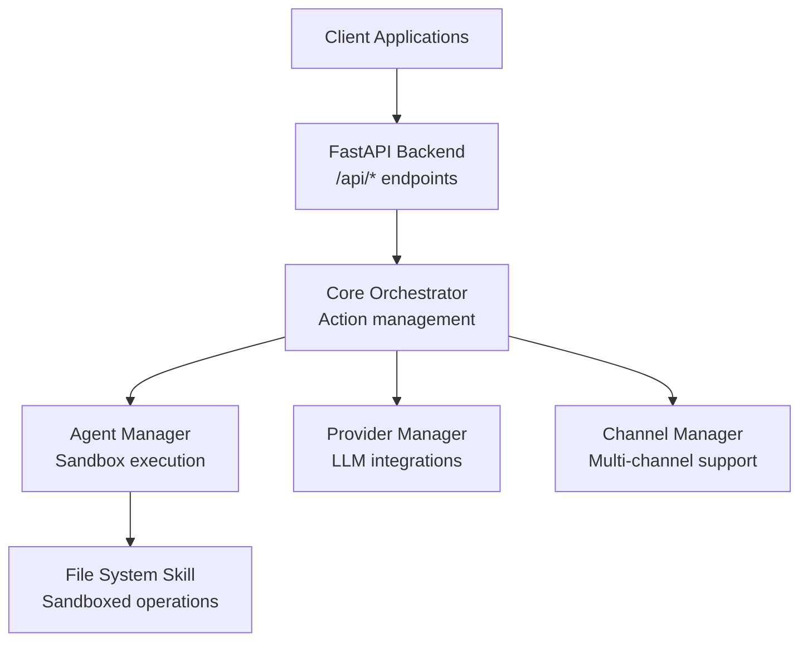
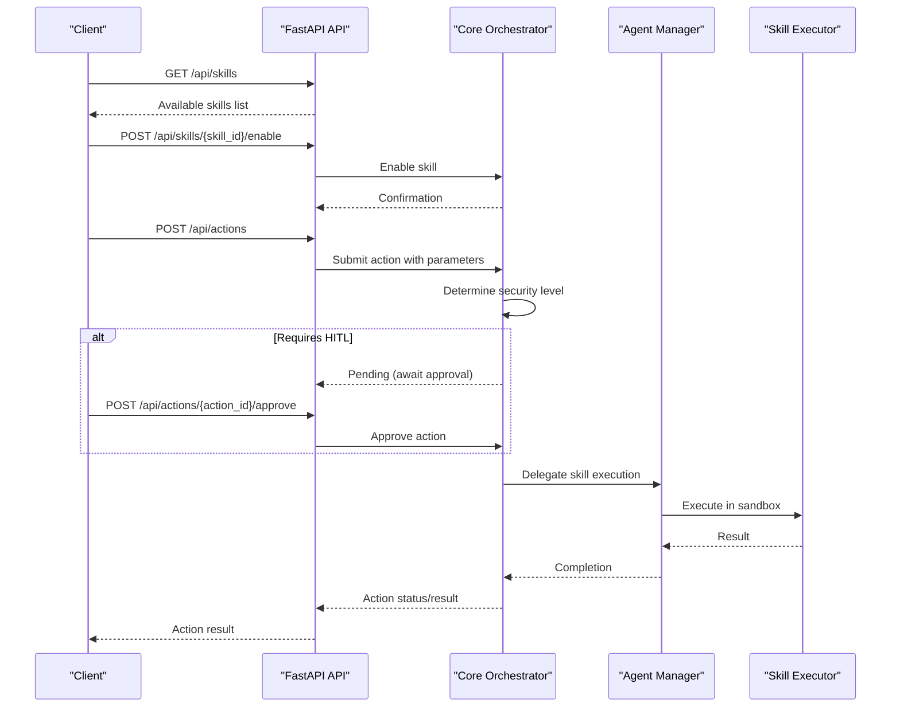
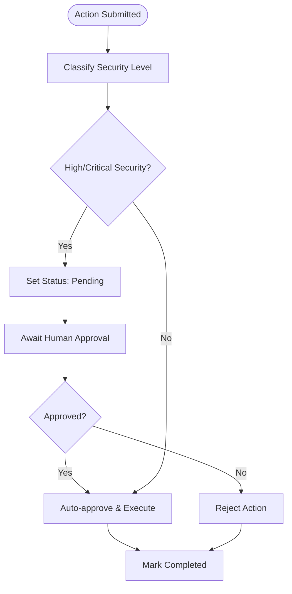
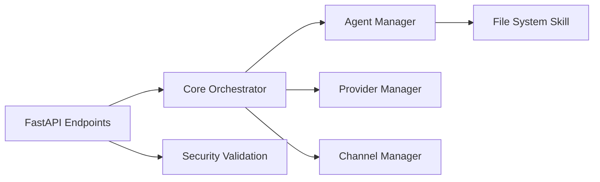

# Skill Management API

<cite>
**Referenced Files in This Document**
- [main.py](file://backend/app/main.py)
- [orchestrator.py](file://backend/app/core/orchestrator.py)
- [agent_manager.py](file://backend/app/core/agent_manager.py)
- [skill.py](file://skills/filesystem/skill.py)
- [README.md](file://README.md)
</cite>

## Table of Contents
1. [Introduction](#introduction)
2. [Project Structure](#project-structure)
3. [Core Components](#core-components)
4. [Architecture Overview](#architecture-overview)
5. [Detailed Component Analysis](#detailed-component-analysis)
6. [Dependency Analysis](#dependency-analysis)
7. [Performance Considerations](#performance-considerations)
8. [Troubleshooting Guide](#troubleshooting-guide)
9. [Conclusion](#conclusion)

## Introduction
This document provides comprehensive API documentation for the skill management system in ClosedPaw. It covers endpoints for discovering available skills, enabling/disabling skills, and executing skills through actions. The documentation includes HTTP method and URL patterns, request/response schemas, examples, security boundaries, sandbox integration, parameter validation, error handling, and guidelines for developing custom skills.

## Project Structure
The skill management system spans three primary areas:
- Backend API server exposing REST endpoints
- Core orchestrator coordinating actions and skill execution
- Agent manager handling sandboxed execution of skills
- Built-in skills (e.g., filesystem) implementing secure operations

**Diagram sources**
- [main.py](file://backend/app/main.py#L342-L378)
- [orchestrator.py](file://backend/app/core/orchestrator.py#L87-L167)
- [agent_manager.py](file://backend/app/core/agent_manager.py#L65-L98)
- [skill.py](file://skills/filesystem/skill.py#L35-L76)

**Section sources**
- [main.py](file://backend/app/main.py#L342-L378)
- [orchestrator.py](file://backend/app/core/orchestrator.py#L87-L167)
- [agent_manager.py](file://backend/app/core/agent_manager.py#L65-L98)
- [skill.py](file://skills/filesystem/skill.py#L35-L76)

## Core Components
This section outlines the key components involved in skill management and execution.

- FastAPI endpoints for skill discovery and lifecycle management
- Core orchestrator for action submission, approval, and delegation
- Agent manager for sandboxed execution using gVisor or Kata Containers
- File system skill implementing secure operations with sandbox boundaries

Key responsibilities:
- Expose REST endpoints for skill management
- Validate and classify action security levels
- Enforce Human-in-the-Loop (HITL) for high-risk actions
- Delegate skill execution to sandboxed agents
- Enforce sandbox restrictions and audit logging

**Section sources**
- [main.py](file://backend/app/main.py#L342-L378)
- [orchestrator.py](file://backend/app/core/orchestrator.py#L87-L167)
- [agent_manager.py](file://backend/app/core/agent_manager.py#L65-L98)
- [skill.py](file://skills/filesystem/skill.py#L35-L76)

## Architecture Overview
The skill management architecture follows a zero-trust model with layered security:
- API layer validates inputs and routes actions
- Orchestrator determines security levels and approval requirements
- Agent manager creates isolated sandboxes for skill execution
- Skills operate within restricted environments with audit logging

**Diagram sources**
- [main.py](file://backend/app/main.py#L342-L378)
- [orchestrator.py](file://backend/app/core/orchestrator.py#L169-L223)
- [agent_manager.py](file://backend/app/core/agent_manager.py#L149-L192)

## Detailed Component Analysis

### Skill Discovery Endpoint
- Method: GET
- URL: /api/skills
- Purpose: Retrieve the list of available skills with their current enablement status
- Response: Array of skill objects containing id, name, and enabled flag

Example response structure:
- id: Unique skill identifier
- name: Human-readable skill name
- enabled: Boolean indicating if the skill is currently enabled

Security considerations:
- No authentication required for discovery
- Response only reveals metadata, not operational parameters

**Section sources**
- [main.py](file://backend/app/main.py#L342-L354)

### Enable/Disable Skill Endpoints
- Enable endpoint:
  - Method: POST
  - URL: /api/skills/{skill_id}/enable
  - Purpose: Enable a previously disabled skill
  - Response: Confirmation with skill_id and enabled=true

- Disable endpoint:
  - Method: POST
  - URL: /api/skills/{skill_id}/disable
  - Purpose: Disable an enabled skill
  - Response: Confirmation with skill_id and enabled=false

Behavior:
- Both endpoints validate skill existence
- Update in-memory skill registry
- Return immediate confirmation

Security considerations:
- No HITL required for enable/disable operations
- Changes take effect immediately in the current process

**Section sources**
- [main.py](file://backend/app/main.py#L357-L378)

### Skill Execution Through Actions
Skills are executed indirectly through the generic action submission endpoint:
- Method: POST
- URL: /api/actions
- Request body:
  - action_type: skill_execution
  - parameters: Skill-specific parameters (e.g., operation, path)
  - skill_id: Target skill identifier (e.g., filesystem)

Security classification:
- File operations classified as high security (requires HITL)
- Other skills classified as medium security (auto-approved)

Approval workflow:
- High-security actions enter pending state
- Await human approval via /api/actions/{action_id}/approve
- Medium-security actions auto-execute

Result retrieval:
- Poll /api/actions/{action_id} for completion status
- Successful actions return skill execution results
- Failed actions include error details

**Section sources**
- [main.py](file://backend/app/main.py#L241-L262)
- [orchestrator.py](file://backend/app/core/orchestrator.py#L225-L249)
- [orchestrator.py](file://backend/app/core/orchestrator.py#L333-L350)

### File System Skill (Built-in Example)
The filesystem skill demonstrates secure operations within sandbox boundaries:

Supported operations:
- read: Read file contents with size limits and type restrictions
- list: List directory contents with path validation
- write: Write content to files with size limits and type restrictions
- delete: Delete files with path validation
- create_dir: Create directories with path validation

Security features:
- Path traversal prevention using sandbox directory restrictions
- Whitelisted file extensions
- Maximum file size and read size limits
- Comprehensive audit logging
- Isolated execution environment

Sandbox integration:
- Executes within gVisor/Kata Containers
- Minimal privileges and capability drops
- Resource limits (CPU, memory, disk)
- Network isolation

**Section sources**
- [skill.py](file://skills/filesystem/skill.py#L17-L24)
- [skill.py](file://skills/filesystem/skill.py#L35-L76)
- [skill.py](file://skills/filesystem/skill.py#L133-L208)
- [skill.py](file://skills/filesystem/skill.py#L210-L272)
- [skill.py](file://skills/filesystem/skill.py#L274-L335)
- [skill.py](file://skills/filesystem/skill.py#L337-L392)
- [skill.py](file://skills/filesystem/skill.py#L394-L440)
- [agent_manager.py](file://backend/app/core/agent_manager.py#L65-L98)

### Action Approval Workflow
High-security actions require human-in-the-loop approval:

**Diagram sources**
- [orchestrator.py](file://backend/app/core/orchestrator.py#L210-L223)
- [orchestrator.py](file://backend/app/core/orchestrator.py#L376-L427)

## Dependency Analysis
The skill management system exhibits clear separation of concerns:

Key dependencies:
- API depends on orchestrator for action management
- Orchestrator depends on agent manager for sandbox execution
- Agent manager depends on skill implementations
- Security validation occurs at API boundary and within skills

**Diagram sources**
- [main.py](file://backend/app/main.py#L342-L378)
- [orchestrator.py](file://backend/app/core/orchestrator.py#L87-L167)
- [agent_manager.py](file://backend/app/core/agent_manager.py#L65-L98)

**Section sources**
- [main.py](file://backend/app/main.py#L342-L378)
- [orchestrator.py](file://backend/app/core/orchestrator.py#L87-L167)
- [agent_manager.py](file://backend/app/core/agent_manager.py#L65-L98)

## Performance Considerations
- Action queuing and asynchronous execution prevent blocking
- Sandbox creation overhead amortized across skill lifecycles
- Resource limits prevent resource exhaustion during skill execution
- Audit logging writes to temporary files to minimize I/O impact
- Model switching operations cache available models to reduce network calls

## Troubleshooting Guide
Common issues and resolutions:

Action approval failures:
- Verify action exists and is in pending state
- Confirm user_id matches expected approver identity
- Check orchestrator logs for approval processing errors

Skill execution failures:
- Validate skill_id exists and is enabled
- Review sandbox availability (gVisor/Kata installation)
- Check resource limits and agent capacity
- Inspect skill-specific error messages in action results

Security violations:
- Review prompt injection defense logs
- Verify input validation passes before action submission
- Check rate limiting thresholds exceeded

Audit and monitoring:
- Use /api/audit-logs endpoint for security event investigation
- Monitor orchestrator logs for action lifecycle events
- Track pending actions via /api/actions/pending

**Section sources**
- [orchestrator.py](file://backend/app/core/orchestrator.py#L451-L461)
- [agent_manager.py](file://backend/app/core/agent_manager.py#L149-L192)

## Conclusion
The skill management API provides a secure, extensible framework for managing and executing capabilities within ClosedPaw. By combining RESTful endpoints, zero-trust security principles, and sandboxed execution, the system enables powerful functionality while maintaining strong security boundaries. The modular design allows for easy integration of custom skills following established patterns and security guidelines.