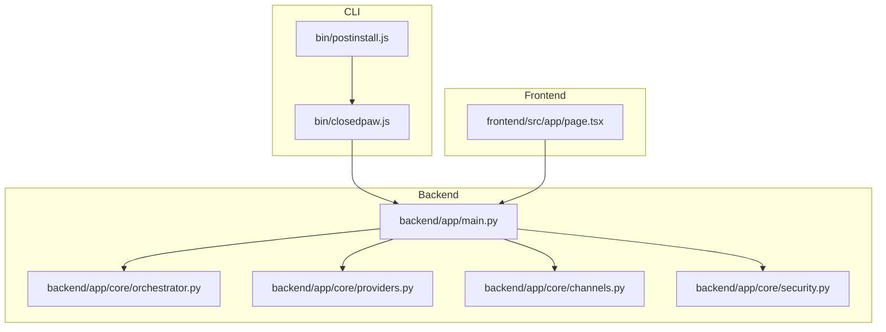
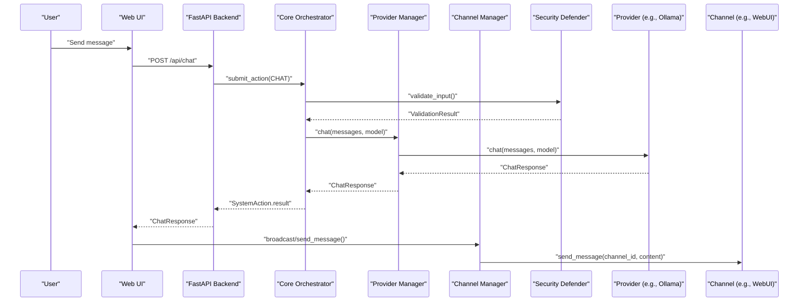
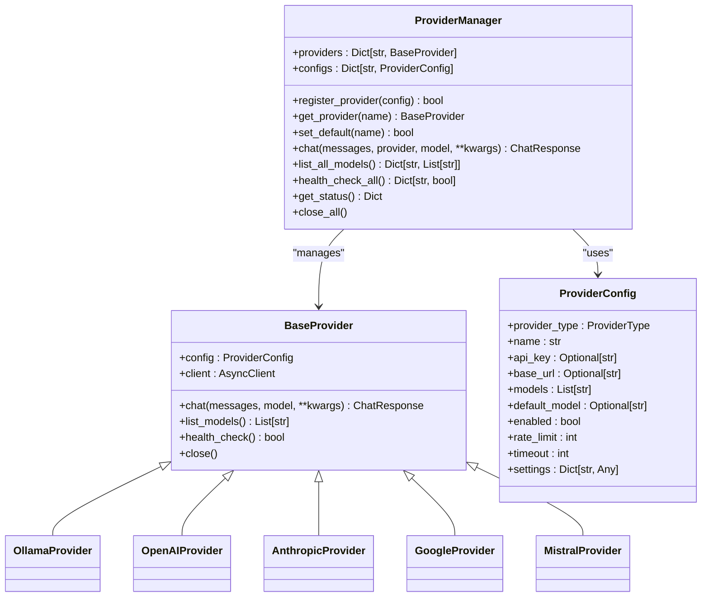
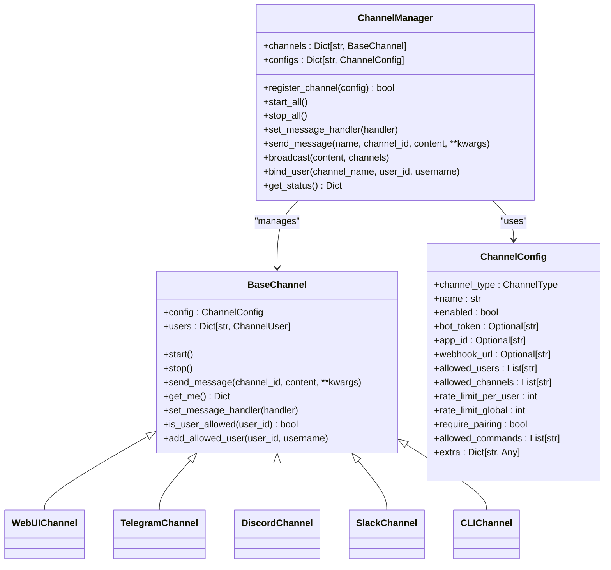
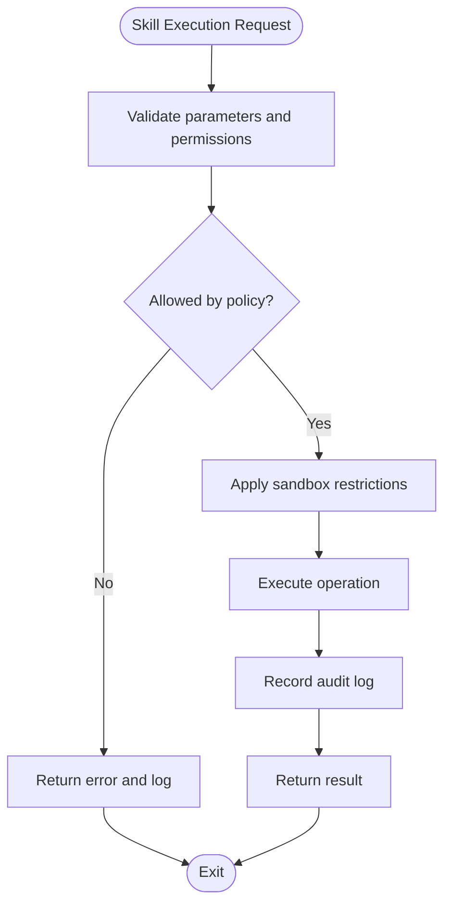
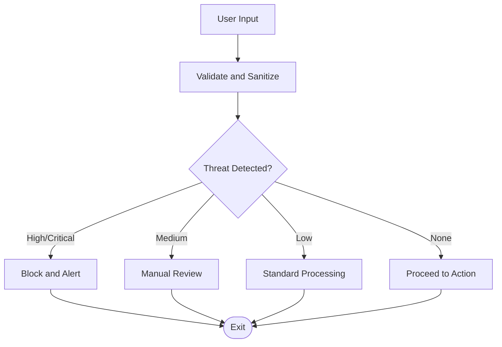
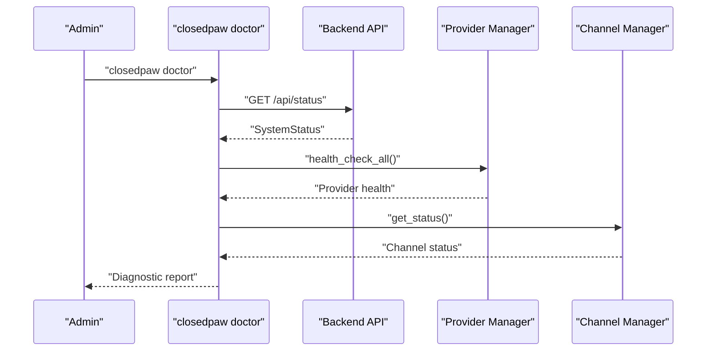
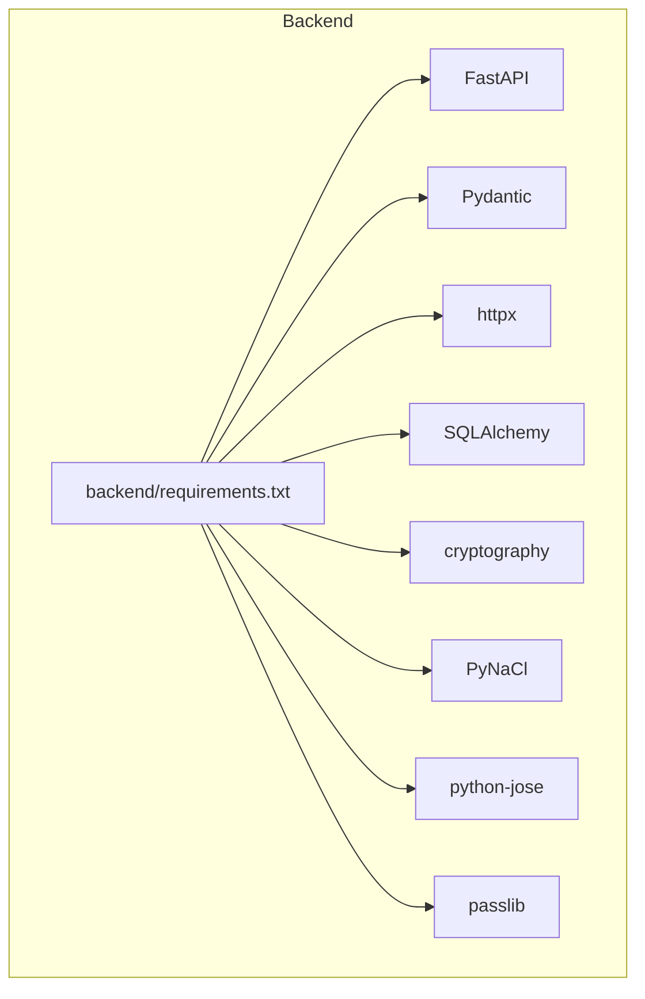

# Advanced Topics

<cite>
**Referenced Files in This Document**
- [backend/app/core/providers.py](file://backend/app/core/providers.py)
- [backend/app/core/channels.py](file://backend/app/core/channels.py)
- [backend/app/core/security.py](file://backend/app/core/security.py)
- [backend/app/core/orchestrator.py](file://backend/app/core/orchestrator.py)
- [backend/app/main.py](file://backend/app/main.py)
- [skills/filesystem/skill.py](file://skills/filesystem/skill.py)
- [bin/closedpaw.js](file://bin/closedpaw.js)
- [bin/postinstall.js](file://bin/postinstall.js)
- [frontend/src/app/page.tsx](file://frontend/src/app/page.tsx)
- [backend/requirements.txt](file://backend/requirements.txt)
- [package.json](file://package.json)
- [README.md](file://README.md)
- [CONTRIBUTING.md](file://CONTRIBUTING.md)
</cite>

## Table of Contents
1. [Introduction](#introduction)
2. [Project Structure](#project-structure)
3. [Core Components](#core-components)
4. [Architecture Overview](#architecture-overview)
5. [Detailed Component Analysis](#detailed-component-analysis)
6. [Dependency Analysis](#dependency-analysis)
7. [Performance Considerations](#performance-considerations)
8. [Troubleshooting Guide](#troubleshooting-guide)
9. [Conclusion](#conclusion)
10. [Appendices](#appendices)

## Introduction
This document provides advanced topics for ClosedPaw, focusing on extensible provider development, plugin architecture, security hardening, and performance optimization. It explains how to integrate new LLM backends via the provider framework, extend communication channels through the channel adapter system, and implement custom skills. It also documents advanced security configurations, threat mitigation strategies, compliance considerations, performance tuning, diagnostics, monitoring, and enterprise deployment patterns.

## Project Structure
ClosedPaw is organized into a modular backend (FastAPI), a frontend (Next.js), a CLI installer, and a skills subsystem. The backend exposes a REST API and manages orchestration, providers, channels, and security. The CLI handles installation, updates, and runtime lifecycle. The frontend provides a zero-trust web UI with HITL controls.

**Diagram sources**
- [backend/app/main.py](file://backend/app/main.py#L1-L567)
- [backend/app/core/orchestrator.py](file://backend/app/core/orchestrator.py#L1-L486)
- [backend/app/core/providers.py](file://backend/app/core/providers.py#L1-L545)
- [backend/app/core/channels.py](file://backend/app/core/channels.py#L1-L524)
- [backend/app/core/security.py](file://backend/app/core/security.py#L1-L455)
- [bin/closedpaw.js](file://bin/closedpaw.js#L1-L911)
- [bin/postinstall.js](file://bin/postinstall.js#L1-L19)
- [frontend/src/app/page.tsx](file://frontend/src/app/page.tsx#L1-L603)

**Section sources**
- [backend/app/main.py](file://backend/app/main.py#L1-L567)
- [backend/app/core/providers.py](file://backend/app/core/providers.py#L1-L545)
- [backend/app/core/channels.py](file://backend/app/core/channels.py#L1-L524)
- [backend/app/core/security.py](file://backend/app/core/security.py#L1-L455)
- [backend/app/core/orchestrator.py](file://backend/app/core/orchestrator.py#L1-L486)
- [bin/closedpaw.js](file://bin/closedpaw.js#L1-L911)
- [bin/postinstall.js](file://bin/postinstall.js#L1-L19)
- [frontend/src/app/page.tsx](file://frontend/src/app/page.tsx#L1-L603)

## Core Components
- Provider framework: Abstract provider base class and concrete providers (Ollama, OpenAI, Anthropic, Google, Mistral). Central provider manager registers, selects, and routes chat requests.
- Channel framework: Abstract channel base class and concrete channels (WebUI, Telegram, Discord, Slack, CLI). Central channel manager registers, starts/stops, and routes messages.
- Security module: Prompt injection defender, rate limiter, data vault, and threat levels.
- Orchestrator: Zero-trust action lifecycle, HITL approvals, audit logging, and skill delegation.
- CLI and installer: Automated installation, updates, diagnostics, and configuration helpers.
- Frontend: Web UI with live status, model selection, pending actions, and configuration modal.

**Section sources**
- [backend/app/core/providers.py](file://backend/app/core/providers.py#L68-L545)
- [backend/app/core/channels.py](file://backend/app/core/channels.py#L79-L524)
- [backend/app/core/security.py](file://backend/app/core/security.py#L35-L455)
- [backend/app/core/orchestrator.py](file://backend/app/core/orchestrator.py#L87-L486)
- [bin/closedpaw.js](file://bin/closedpaw.js#L679-L911)
- [frontend/src/app/page.tsx](file://frontend/src/app/page.tsx#L55-L603)

## Architecture Overview
ClosedPaw follows a zero-trust architecture with explicit approvals for high-risk actions, sandboxed skills, and encrypted storage. The backend exposes REST endpoints for chat, model management, provider/channel registration, and audit logs. The frontend integrates with the backend to provide a secure, local-only experience.

**Diagram sources**
- [backend/app/main.py](file://backend/app/main.py#L131-L182)
- [backend/app/core/orchestrator.py](file://backend/app/core/orchestrator.py#L169-L302)
- [backend/app/core/providers.py](file://backend/app/core/providers.py#L418-L483)
- [backend/app/core/security.py](file://backend/app/core/security.py#L116-L181)
- [backend/app/core/channels.py](file://backend/app/core/channels.py#L405-L483)

## Detailed Component Analysis

### Extensible Provider Architecture
- Design: Abstract base class defines the contract for chat, list_models, health_check, and close. Concrete providers encapsulate API specifics and error handling.
- Registration: ProviderManager maps ProviderType to provider classes, validates configs, and maintains default provider selection.
- Routing: ProviderManager.chat delegates to the selected provider, enabling multi-provider chat via API endpoints.
- Extensibility: Add a new provider by subclassing BaseProvider, registering it in ProviderManager, and exposing endpoints.

**Diagram sources**
- [backend/app/core/providers.py](file://backend/app/core/providers.py#L68-L545)

**Section sources**
- [backend/app/core/providers.py](file://backend/app/core/providers.py#L68-L545)
- [backend/app/main.py](file://backend/app/main.py#L403-L462)

### Channel Adapter Framework
- Design: Abstract BaseChannel defines start, stop, send_message, get_me, and user allowlisting. Concrete channels implement platform-specific APIs.
- Registration: ChannelManager maps ChannelType to channel classes, sets message handlers, and manages lifecycle.
- Routing: ChannelManager broadcasts and sends messages to specific channels; WebUI queues messages for polling.
- Extensibility: Add a new channel by subclassing BaseChannel, registering it in ChannelManager, and exposing endpoints.

**Diagram sources**
- [backend/app/core/channels.py](file://backend/app/core/channels.py#L79-L524)

**Section sources**
- [backend/app/core/channels.py](file://backend/app/core/channels.py#L79-L524)
- [backend/app/main.py](file://backend/app/main.py#L464-L530)

### Skill System and Plugin Architecture
- Design: Skills are isolated executors with sandboxing, whitelists, and audit logging. The orchestrator delegates high-risk actions to skills with HITL approval.
- Example: FileSystem skill enforces sandbox directory, path traversal prevention, extension whitelists, size limits, and audit trails.
- Extensibility: Implement a new skill by creating a class with operation methods, metadata, and a factory function. Integrate with orchestrator skill registry and expose endpoints.

**Diagram sources**
- [skills/filesystem/skill.py](file://skills/filesystem/skill.py#L35-L483)
- [backend/app/core/orchestrator.py](file://backend/app/core/orchestrator.py#L333-L350)

**Section sources**
- [skills/filesystem/skill.py](file://skills/filesystem/skill.py#L35-L483)
- [backend/app/core/orchestrator.py](file://backend/app/core/orchestrator.py#L333-L350)

### Security Hardening and Threat Mitigation
- Prompt injection defense: Comprehensive pattern detection, sanitization, and threat scoring. Creates secure prompts with clear separation between system instructions and user input.
- Rate limiting: Per-key request tracking with configurable windows.
- Data vault: Encrypted storage for secrets using symmetric encryption with access-level controls.
- Zero-trust actions: Security levels (LOW, MEDIUM, HIGH, CRITICAL) and HITL approvals for risky operations.
- Audit logging: Structured audit logs for all actions with timestamps, outcomes, and details.
- Local-only binding: Backend and frontend bind to localhost by default; CLI enforces secure defaults.

**Diagram sources**
- [backend/app/core/security.py](file://backend/app/core/security.py#L116-L181)

**Section sources**
- [backend/app/core/security.py](file://backend/app/core/security.py#L35-L455)
- [backend/app/core/orchestrator.py](file://backend/app/core/orchestrator.py#L225-L250)

### Performance Optimization
- Memory management: Provider and channel clients use async contexts; orchestrator tracks pending actions and waits during shutdown.
- Resource utilization: Health checks for providers and channels; rate limiting for input validation and channel operations.
- Scaling strategies: Multi-provider chat via ProviderManager; channel broadcasting; configurable timeouts and rate limits.
- I/O optimization: Async HTTP client usage; batched health checks; minimal serialization overhead in API responses.

**Section sources**
- [backend/app/core/providers.py](file://backend/app/core/providers.py#L97-L99)
- [backend/app/core/channels.py](file://backend/app/core/channels.py#L445-L454)
- [backend/app/core/orchestrator.py](file://backend/app/core/orchestrator.py#L463-L475)

### Advanced Troubleshooting and Diagnostics
- CLI diagnostics: Installation checks, dependency verification, API status, and automated fixes.
- Runtime diagnostics: System status endpoint, pending actions, audit logs, and provider/channel health checks.
- Frontend diagnostics: Live status indicators, model lists, and pending action approvals.

**Diagram sources**
- [bin/closedpaw.js](file://bin/closedpaw.js#L357-L480)
- [backend/app/main.py](file://backend/app/main.py#L101-L129)
- [backend/app/core/providers.py](file://backend/app/core/providers.py#L495-L504)
- [backend/app/core/channels.py](file://backend/app/core/channels.py#L491-L503)

**Section sources**
- [bin/closedpaw.js](file://bin/closedpaw.js#L357-L480)
- [backend/app/main.py](file://backend/app/main.py#L101-L129)

### Enterprise Deployment Scenarios
- Local-only operation: Backend binds to localhost; Web UI binds to localhost; no external exposure.
- Encrypted storage: Data vault for secrets; configuration files for providers and channels.
- Compliance: Audit logs, input validation, and HITL approvals support governance requirements.
- Multi-provider: Register cloud providers alongside local Ollama for hybrid deployments.
- Monitoring: Expose audit logs and system status for dashboards; integrate with SIEM via logs.

**Section sources**
- [backend/app/main.py](file://backend/app/main.py#L72-L88)
- [backend/app/core/security.py](file://backend/app/core/security.py#L325-L435)
- [backend/app/core/orchestrator.py](file://backend/app/core/orchestrator.py#L429-L462)

## Dependency Analysis
- Backend dependencies include FastAPI, Pydantic, httpx, SQLAlchemy, cryptography, and testing libraries.
- CLI dependencies include commander, execa, chalk, ora, inquirer, and boxen.
- Frontend dependencies include Next.js, React, Radix UI, Tailwind, and Axios.

**Diagram sources**
- [backend/requirements.txt](file://backend/requirements.txt#L1-L36)

**Section sources**
- [backend/requirements.txt](file://backend/requirements.txt#L1-L36)
- [package.json](file://package.json#L42-L53)
- [frontend/package.json](file://frontend/package.json#L12-L38)

## Performance Considerations
- Asynchronous I/O: Use async HTTP clients and tasks to minimize blocking.
- Provider caching: Reuse clients and manage timeouts per provider.
- Channel batching: Broadcast messages efficiently; queue WebUI messages for polling.
- Audit logging: Enable selective logging to reduce I/O overhead.
- Model switching: Validate availability before switching to avoid retries.

[No sources needed since this section provides general guidance]

## Troubleshooting Guide
- Installation failures: Use CLI doctor to diagnose missing dependencies and suggest fixes.
- API connectivity: Verify localhost binding and firewall rules; check Ollama availability.
- Provider registration: Confirm provider type, base URL, and API keys; use health checks.
- Channel configuration: Validate tokens and allowlists; ensure platform-specific permissions.
- Audit logs: Review structured logs for action outcomes and errors.

**Section sources**
- [bin/closedpaw.js](file://bin/closedpaw.js#L357-L480)
- [backend/app/main.py](file://backend/app/main.py#L101-L129)
- [backend/app/core/providers.py](file://backend/app/core/providers.py#L495-L504)
- [backend/app/core/channels.py](file://backend/app/core/channels.py#L491-L503)

## Conclusion
ClosedPaw’s architecture emphasizes security-first design with a robust provider framework, channel adapters, sandboxed skills, and zero-trust action management. The CLI and frontend streamline installation, configuration, and diagnostics. By leveraging the documented patterns and best practices, organizations can extend ClosedPaw with custom providers, channels, and skills while maintaining strong security and compliance.

[No sources needed since this section summarizes without analyzing specific files]

## Appendices

### Advanced Integration Examples
- Custom provider: Implement a new provider by subclassing BaseProvider and registering it in ProviderManager. Expose endpoints for model listing and chat.
- Custom channel: Implement a new channel by subclassing BaseChannel and registering it in ChannelManager. Expose endpoints for sending and receiving messages.
- Custom skill: Implement a new skill with sandboxing, whitelists, and audit logging. Integrate with orchestrator skill registry.

**Section sources**
- [backend/app/core/providers.py](file://backend/app/core/providers.py#L68-L545)
- [backend/app/core/channels.py](file://backend/app/core/channels.py#L79-L524)
- [skills/filesystem/skill.py](file://skills/filesystem/skill.py#L35-L483)

### Best Practices for Plugin Extensions
- Security-first defaults: Enforce sandboxing, input validation, and encryption.
- Minimal privilege: Limit file system and network access.
- Audit everything: Log all security-relevant operations.
- Graceful degradation: Handle provider/channel failures and timeouts.
- Configuration management: Use encrypted storage for secrets and structured configs.

**Section sources**
- [CONTRIBUTING.md](file://CONTRIBUTING.md#L99-L238)
- [backend/app/core/security.py](file://backend/app/core/security.py#L325-L435)
- [skills/filesystem/skill.py](file://skills/filesystem/skill.py#L469-L483)