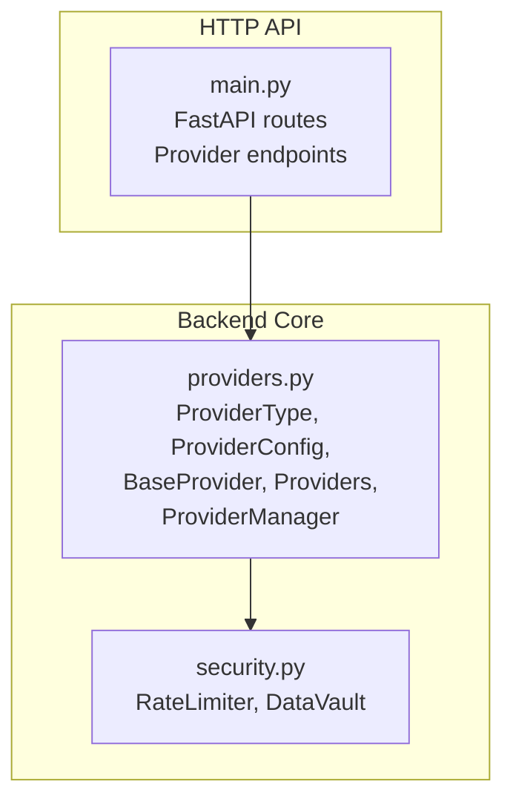
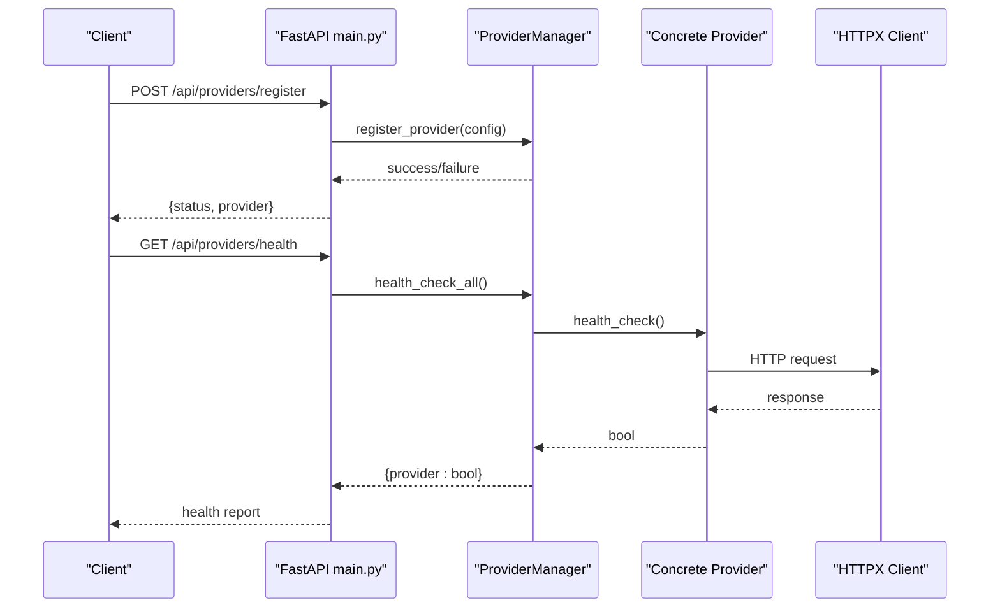
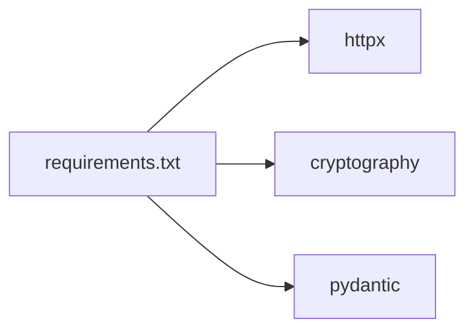

# Custom Provider Development

<cite>
**Referenced Files in This Document**
- [providers.py](file://backend/app/core/providers.py)
- [main.py](file://backend/app/main.py)
- [security.py](file://backend/app/core/security.py)
- [requirements.txt](file://backend/requirements.txt)
- [README.md](file://README.md)
</cite>

## Table of Contents
1. [Introduction](#introduction)
2. [Project Structure](#project-structure)
3. [Core Components](#core-components)
4. [Architecture Overview](#architecture-overview)
5. [Detailed Component Analysis](#detailed-component-analysis)
6. [Dependency Analysis](#dependency-analysis)
7. [Performance Considerations](#performance-considerations)
8. [Troubleshooting Guide](#troubleshooting-guide)
9. [Conclusion](#conclusion)
10. [Appendices](#appendices)

## Introduction
This document explains how to develop custom Large Language Model (LLM) provider integrations for ClosedPaw. It covers the BaseProvider abstract class architecture, the ProviderConfig dataclass, the ProviderType enumeration, and the standardized interface methods (chat, list_models, health_check). It also documents the provider registration process through ProviderManager, configuration requirements, and integration patterns. Step-by-step examples show how to implement authentication handling, request formatting, response parsing, and error management. Best practices for rate limiting, timeout handling, and health monitoring are included, along with reference examples from the existing providers (Ollama, OpenAI, Anthropic, Google, Mistral).

## Project Structure
The provider framework lives in the backend core and exposes HTTP endpoints for provider management and health checks. The main application integrates provider orchestration with the broader system.

**Diagram sources**
- [providers.py](file://backend/app/core/providers.py#L20-L544)
- [main.py](file://backend/app/main.py#L381-L461)
- [security.py](file://backend/app/core/security.py#L290-L455)

**Section sources**
- [providers.py](file://backend/app/core/providers.py#L1-L544)
- [main.py](file://backend/app/main.py#L381-L461)
- [README.md](file://README.md#L134-L155)

## Core Components
- ProviderType: Enumeration of supported provider types including Ollama, OpenAI, Anthropic, Google, Mistral, and a placeholder for custom providers.
- ProviderConfig: Dataclass holding provider configuration such as provider_type, name, api_key, base_url, models, default_model, enabled flag, rate_limit, timeout, and provider-specific settings.
- BaseProvider: Abstract base class defining the standardized interface for all providers: chat, list_models, health_check, and close.
- ProviderManager: Central manager for registering, selecting, and managing providers, including health checks and status reporting.
- Existing providers: OllamaProvider, OpenAIProvider, AnthropicProvider, GoogleProvider, MistralProvider demonstrate the implementation patterns.

Key responsibilities:
- ProviderType and ProviderConfig define the contract and configuration surface for providers.
- BaseProvider enforces a consistent interface and provides shared infrastructure (HTTP client, timeouts).
- ProviderManager handles lifecycle, routing, and operational visibility.

**Section sources**
- [providers.py](file://backend/app/core/providers.py#L20-L45)
- [providers.py](file://backend/app/core/providers.py#L68-L99)
- [providers.py](file://backend/app/core/providers.py#L418-L524)

## Architecture Overview
The provider architecture follows a layered design:
- Application layer: FastAPI routes expose provider registration, default selection, health checks, and model listings.
- Core layer: ProviderManager orchestrates provider instances and delegates operations.
- Provider layer: BaseProvider defines the interface; concrete providers implement provider-specific logic.
- Security layer: RateLimiter and DataVault provide security primitives.

**Diagram sources**
- [main.py](file://backend/app/main.py#L403-L453)
- [providers.py](file://backend/app/core/providers.py#L418-L503)

**Section sources**
- [main.py](file://backend/app/main.py#L381-L461)
- [providers.py](file://backend/app/core/providers.py#L418-L524)

## Detailed Component Analysis

### BaseProvider Abstract Class
BaseProvider defines the standardized interface and shared behavior:
- chat(messages, model, **kwargs) -> ChatResponse: Sends a chat completion request and returns structured results.
- list_models() -> List[str]: Lists available models for the provider.
- health_check() -> bool: Checks provider health.
- close(): Closes the HTTP client.

It initializes an httpx.AsyncClient with a configurable timeout and tracks request timing.

Implementation patterns to follow:
- Validate configuration (e.g., api_key presence) before making requests.
- Build provider-specific request payloads from ChatMessage objects.
- Parse provider-specific response formats into ChatResponse.
- Handle non-200 responses by raising exceptions with meaningful messages.
- Implement health_check using lightweight endpoints.

**Section sources**
- [providers.py](file://backend/app/core/providers.py#L68-L99)

### ProviderConfig Dataclass
ProviderConfig encapsulates provider configuration:
- provider_type: ProviderType enum value.
- name: Unique provider identifier.
- api_key: Optional API key for cloud providers.
- base_url: Optional base URL for the provider’s API.
- models: Static list of supported models (optional).
- default_model: Default model to use if not specified.
- enabled: Whether the provider is enabled.
- rate_limit: Requests per minute (used conceptually; see RateLimiter).
- timeout: Request timeout in seconds.
- settings: Provider-specific settings dictionary.

Best practices:
- Set sensible defaults (e.g., base_url for cloud providers).
- Keep api_key out of logs and errors.
- Use default_model to simplify client usage.

**Section sources**
- [providers.py](file://backend/app/core/providers.py#L30-L45)

### ProviderType Enumeration
ProviderType enumerates supported provider families:
- OLLAMA, OPENAI, ANTHROPIC, GOOGLE, MISTRAL, CUSTOM.

CUSTOM is available for integrating bespoke endpoints that do not match the built-in families.

**Section sources**
- [providers.py](file://backend/app/core/providers.py#L20-L28)

### ProviderManager
ProviderManager centralizes provider lifecycle:
- register_provider(config) -> bool: Creates provider instances based on ProviderType and stores them.
- get_provider(name) -> BaseProvider: Retrieves a provider by name or default.
- set_default(name) -> bool: Sets the default provider.
- chat(messages, provider, model, **kwargs) -> ChatResponse: Delegates chat to the selected provider.
- list_all_models() -> Dict[str, List[str]]: Aggregates model lists from all providers.
- health_check_all() -> Dict[str, bool]: Health status for all providers.
- get_status() -> Dict[str, Any]: Operational status of providers.
- close_all(): Closes all provider HTTP clients.

Registration mapping:
- Maps ProviderType to concrete provider classes (OllamaProvider, OpenAIProvider, AnthropicProvider, GoogleProvider, MistralProvider).

Default provider:
- On first access, a default Ollama provider is registered with sensible defaults.

**Section sources**
- [providers.py](file://backend/app/core/providers.py#L418-L524)

### ChatMessage and ChatResponse
- ChatMessage: Role and content abstraction with to_dict conversion for payload construction.
- ChatResponse: Standardized response fields including content, model, provider, tokens_used, finish_reason, and latency_ms.

These types ensure consistent data flow across providers.

**Section sources**
- [providers.py](file://backend/app/core/providers.py#L47-L66)

### Reference Provider Implementations
Each provider demonstrates a consistent pattern:
- Constructor sets provider-specific base_url defaults if not provided.
- chat builds provider-specific request payloads, sends HTTP requests, parses responses, and constructs ChatResponse.
- list_models returns static model lists or queries provider endpoints.
- health_check performs lightweight connectivity checks.

Examples:
- OllamaProvider: Uses local endpoint, formats messages as a single prompt, reads eval_count and response.
- OpenAIProvider: Requires api_key, sends Authorization header, parses choices and usage.
- AnthropicProvider: Separates system messages, uses x-api-key and anthropic-version headers.
- GoogleProvider: Converts roles to Gemini format, passes API key via query param.
- MistralProvider: Similar to OpenAI with Authorization header.

**Section sources**
- [providers.py](file://backend/app/core/providers.py#L102-L161)
- [providers.py](file://backend/app/core/providers.py#L163-L222)
- [providers.py](file://backend/app/core/providers.py#L224-L294)
- [providers.py](file://backend/app/core/providers.py#L296-L354)
- [providers.py](file://backend/app/core/providers.py#L356-L416)

### HTTP API Integration
The FastAPI application exposes provider management endpoints:
- GET /api/providers: Status of all providers.
- GET /api/providers/{provider_name}/models: Models from a specific provider.
- POST /api/providers/register: Register a new provider with ProviderConfig.
- POST /api/providers/{provider_name}/default: Set default provider.
- GET /api/providers/health: Health check for all providers.
- GET /api/providers/models: Aggregate models from all providers.

These endpoints delegate to ProviderManager for operations.

**Section sources**
- [main.py](file://backend/app/main.py#L383-L461)

### Step-by-Step: Implementing a Custom Provider
Follow these steps to add a new provider:

1. Define a subclass of BaseProvider
   - Choose ProviderType.CUSTOM or extend ProviderType if adding a new family.
   - Implement constructor to set provider-specific defaults (e.g., base_url).
   - Initialize httpx.AsyncClient with timeout from config.

2. Implement chat
   - Validate configuration (e.g., api_key presence).
   - Convert ChatMessage list to provider-specific payload format.
   - Send HTTP request to provider endpoint.
   - Handle non-200 responses by raising exceptions with clear messages.
   - Parse response body into ChatResponse fields (content, model, provider, tokens_used, finish_reason, latency_ms).

3. Implement list_models
   - Return a static list if known, or query provider endpoint for dynamic discovery.
   - Wrap in try/except and log failures.

4. Implement health_check
   - Perform a lightweight connectivity check (e.g., GET tags/models endpoint with short timeout).
   - Return True on success, False otherwise.

5. Register the provider
   - Create ProviderConfig with provider_type, name, api_key, base_url, default_model.
   - Call get_provider_manager().register_provider(config).
   - Optionally set default provider via set_default(name).

6. Integrate with HTTP API
   - Use POST /api/providers/register to dynamically add providers at runtime.
   - Use GET /api/providers/health to monitor health.

7. Error handling and logging
   - Log errors with context (provider name/type).
   - Raise exceptions with actionable messages for upstream handlers.

8. Performance and reliability
   - Respect timeouts configured in ProviderConfig.
   - Consider rate limiting using the RateLimiter utility if needed.
   - Close HTTP clients in close() to free resources.

Example references:
- Constructor and chat flow: [OpenAIProvider.chat](file://backend/app/core/providers.py#L175-L215)
- Model listing: [OpenAIProvider.list_models](file://backend/app/core/providers.py#L217-L218)
- Health check: [OpenAIProvider.health_check](file://backend/app/core/providers.py#L220-L221)
- Registration: [main.py register_provider](file://backend/app/main.py#L403-L434)

**Section sources**
- [providers.py](file://backend/app/core/providers.py#L68-L99)
- [providers.py](file://backend/app/core/providers.py#L163-L222)
- [main.py](file://backend/app/main.py#L403-L434)

### Authentication Handling
- Cloud providers typically require api_key in ProviderConfig.
- OpenAI, Anthropic, Mistral, and Google providers demonstrate different authentication mechanisms:
  - OpenAI: Authorization header with Bearer token.
  - Anthropic: x-api-key header and version header.
  - Google: API key passed as query parameter.
  - Mistral: Authorization header with Bearer token.
- Ollama is local and does not require an API key.

Best practices:
- Validate api_key presence before sending requests.
- Avoid logging secrets; mask or redact sensitive fields.
- Use environment variables or secure storage for api_key.

**Section sources**
- [providers.py](file://backend/app/core/providers.py#L180-L202)
- [providers.py](file://backend/app/core/providers.py#L243-L275)
- [providers.py](file://backend/app/core/providers.py#L311-L335)
- [providers.py](file://backend/app/core/providers.py#L375-L396)

### Request Formatting and Response Parsing
- Request formatting:
  - Convert ChatMessage to provider-specific payload (role/content mapping).
  - Add headers (Authorization, Content-Type, provider-specific headers).
  - Include query parameters (e.g., Google API key).
- Response parsing:
  - Extract content, model, tokens_used, finish_reason, latency_ms.
  - Handle provider-specific response shapes (choices, content arrays, usage fields).

Reference implementations:
- OpenAI: [OpenAIProvider.chat](file://backend/app/core/providers.py#L175-L215)
- Anthropic: [AnthropicProvider.chat](file://backend/app/core/providers.py#L237-L287)
- Google: [GoogleProvider.chat](file://backend/app/core/providers.py#L305-L347)
- Mistral: [MistralProvider.chat](file://backend/app/core/providers.py#L369-L409)

**Section sources**
- [providers.py](file://backend/app/core/providers.py#L175-L215)
- [providers.py](file://backend/app/core/providers.py#L237-L287)
- [providers.py](file://backend/app/core/providers.py#L305-L347)
- [providers.py](file://backend/app/core/providers.py#L369-L409)

### Error Management
- Non-200 responses: Parse error messages from provider responses and raise exceptions with clear context.
- Exceptions: Use descriptive messages that include provider name/type and error details.
- Logging: Log errors with context; avoid exposing secrets.

References:
- OpenAI error handling: [OpenAIProvider.chat](file://backend/app/core/providers.py#L199-L202)
- Anthropic error handling: [AnthropicProvider.chat](file://backend/app/core/providers.py#L273-L275)
- Google error handling: [GoogleProvider.chat](file://backend/app/core/providers.py#L333-L335)
- Mistral error handling: [MistralProvider.chat](file://backend/app/core/providers.py#L394-L396)

**Section sources**
- [providers.py](file://backend/app/core/providers.py#L199-L202)
- [providers.py](file://backend/app/core/providers.py#L273-L275)
- [providers.py](file://backend/app/core/providers.py#L333-L335)
- [providers.py](file://backend/app/core/providers.py#L394-L396)

### Provider Registration Process
- Programmatic registration:
  - Create ProviderConfig with provider_type, name, api_key, base_url, default_model.
  - Call get_provider_manager().register_provider(config).
- HTTP registration:
  - POST /api/providers/register with provider_type, name, api_key, base_url, default_model.
  - The route validates provider_type and delegates to ProviderManager.
- Set default provider:
  - POST /api/providers/{provider_name}/default to set default provider.

References:
- Programmatic: [providers.py ProviderManager.register_provider](file://backend/app/core/providers.py#L429-L456)
- HTTP route: [main.py register_provider](file://backend/app/main.py#L403-L434)
- Set default: [main.py set_default_provider](file://backend/app/main.py#L437-L445)

**Section sources**
- [providers.py](file://backend/app/core/providers.py#L429-L456)
- [main.py](file://backend/app/main.py#L403-L445)

### Integration Patterns
- Multi-provider orchestration:
  - Use ProviderManager.chat to send messages to a specific provider or default.
  - Aggregate models and health across providers.
- Frontend integration:
  - Use GET /api/providers to discover providers and their default models.
  - Use GET /api/providers/{provider_name}/models to populate model selection UI.
- Dynamic configuration:
  - Use POST /api/providers/register to add new providers without restarting the service.

References:
- Orchestration: [providers.py ProviderManager.chat](file://backend/app/core/providers.py#L470-L482)
- Discovery: [main.py get_providers](file://backend/app/main.py#L383-L387), [main.py get_provider_models](file://backend/app/main.py#L390-L400)
- Dynamic config: [main.py register_provider](file://backend/app/main.py#L403-L434)

**Section sources**
- [providers.py](file://backend/app/core/providers.py#L470-L482)
- [main.py](file://backend/app/main.py#L383-L400)
- [main.py](file://backend/app/main.py#L403-L434)

## Dependency Analysis
External dependencies relevant to provider development:
- httpx: Async HTTP client used by BaseProvider and providers.
- cryptography: Used by DataVault for encrypted storage.
- pydantic: Data validation for API models.

**Diagram sources**
- [requirements.txt](file://backend/requirements.txt#L14-L25)

**Section sources**
- [requirements.txt](file://backend/requirements.txt#L1-L36)

## Performance Considerations
- Timeouts: BaseProvider initializes httpx.AsyncClient with timeout from ProviderConfig.timeout. Respect this setting in provider implementations.
- Latency measurement: Compute latency_ms by measuring request duration and store in ChatResponse.
- Health checks: Use short timeouts in health_check to avoid blocking the system.
- Rate limiting: While ProviderConfig includes rate_limit, implement a practical rate limiter using RateLimiter if needed. This helps prevent provider throttling and improves stability.

References:
- Timeout initialization: [BaseProvider.__init__](file://backend/app/core/providers.py#L71-L75)
- Latency calculation: [OpenAIProvider.chat](file://backend/app/core/providers.py#L199-L205)
- RateLimiter: [security.py RateLimiter](file://backend/app/core/security.py#L290-L317)

**Section sources**
- [providers.py](file://backend/app/core/providers.py#L71-L75)
- [providers.py](file://backend/app/core/providers.py#L199-L205)
- [security.py](file://backend/app/core/security.py#L290-L317)

## Troubleshooting Guide
Common issues and resolutions:
- Provider not found:
  - Ensure provider is registered via ProviderManager.register_provider or POST /api/providers/register.
  - Verify provider name matches exactly.
- Invalid provider type:
  - Confirm provider_type is one of ProviderType values.
- Authentication failures:
  - Verify api_key is present and correct for cloud providers.
  - Check provider-specific headers and query parameters.
- Connectivity issues:
  - Confirm base_url is reachable and correct.
  - Use health_check endpoints to diagnose provider health.
- Timeout errors:
  - Increase ProviderConfig.timeout if requests are slow.
  - Ensure provider endpoints are responsive.

References:
- Registration and validation: [main.py register_provider](file://backend/app/main.py#L414-L417)
- Health checks: [main.py check_providers_health](file://backend/app/main.py#L448-L453), [providers.py ProviderManager.health_check_all](file://backend/app/core/providers.py#L495-L503)

**Section sources**
- [main.py](file://backend/app/main.py#L414-L417)
- [main.py](file://backend/app/main.py#L448-L453)
- [providers.py](file://backend/app/core/providers.py#L495-L503)

## Conclusion
ClosedPaw provides a robust, extensible framework for integrating LLM providers. By adhering to the BaseProvider interface, using ProviderConfig for configuration, and leveraging ProviderManager for lifecycle and orchestration, developers can add custom providers quickly and safely. The existing providers serve as reliable reference implementations for authentication, request formatting, response parsing, and error handling. Follow the best practices outlined here to ensure reliability, performance, and security.

## Appendices

### API Endpoints for Provider Management
- GET /api/providers: Get status of all providers.
- GET /api/providers/{provider_name}/models: Get models from a specific provider.
- POST /api/providers/register: Register a new provider.
- POST /api/providers/{provider_name}/default: Set default provider.
- GET /api/providers/health: Health check for all providers.
- GET /api/providers/models: List models from all providers.

**Section sources**
- [main.py](file://backend/app/main.py#L383-L461)

### Security Utilities for Providers
- RateLimiter: Simple sliding-window rate limiter for security controls.
- DataVault: Encrypted storage for secrets like API keys.

**Section sources**
- [security.py](file://backend/app/core/security.py#L290-L455)