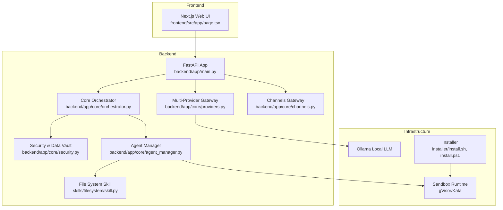
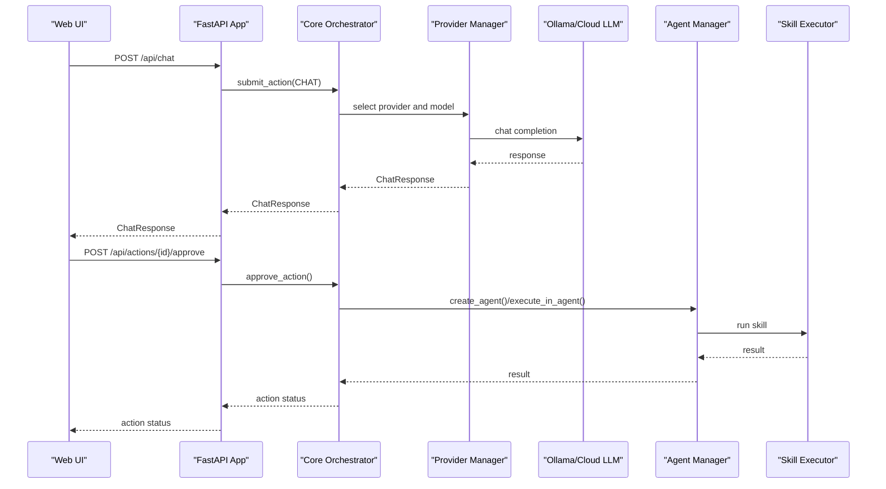
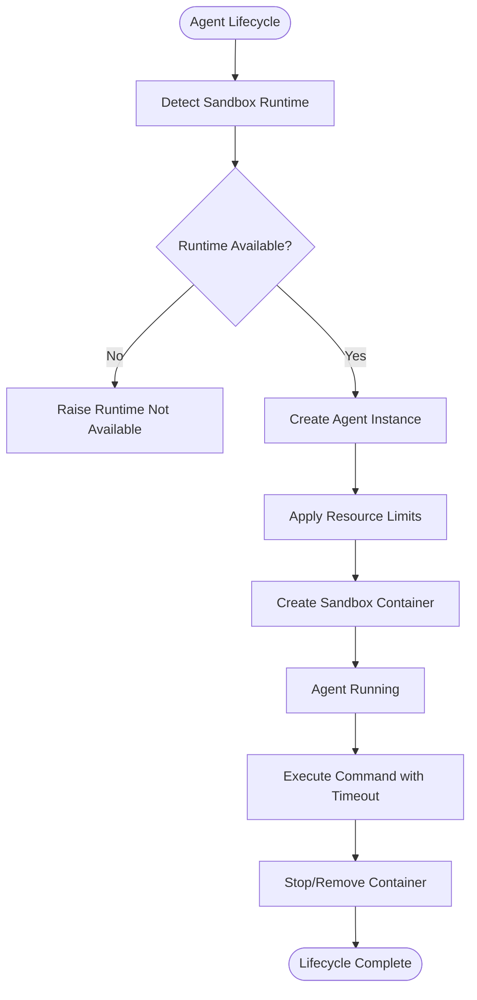
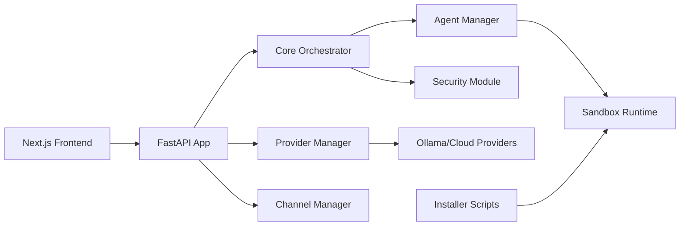

# Performance Optimization

<cite>
**Referenced Files in This Document**
- [README.md](file://README.md)
- [backend/app/main.py](file://backend/app/main.py)
- [backend/requirements.txt](file://backend/requirements.txt)
- [package.json](file://package.json)
- [backend/app/core/orchestrator.py](file://backend/app/core/orchestrator.py)
- [backend/app/core/providers.py](file://backend/app/core/providers.py)
- [backend/app/core/channels.py](file://backend/app/core/channels.py)
- [backend/app/core/security.py](file://backend/app/core/security.py)
- [backend/app/core/agent_manager.py](file://backend/app/core/agent_manager.py)
- [skills/filesystem/skill.py](file://skills/filesystem/skill.py)
- [frontend/src/app/page.tsx](file://frontend/src/app/page.tsx)
- [installer/install.sh](file://installer/install.sh)
- [installer/install.ps1](file://installer/install.ps1)
</cite>

## Table of Contents
1. [Introduction](#introduction)
2. [Project Structure](#project-structure)
3. [Core Components](#core-components)
4. [Architecture Overview](#architecture-overview)
5. [Detailed Component Analysis](#detailed-component-analysis)
6. [Dependency Analysis](#dependency-analysis)
7. [Performance Considerations](#performance-considerations)
8. [Troubleshooting Guide](#troubleshooting-guide)
9. [Conclusion](#conclusion)
10. [Appendices](#appendices)

## Introduction
This document provides a comprehensive performance optimization guide for ClosedPaw, focusing on system-wide tuning, scaling strategies, and operational excellence. It covers memory and CPU optimization, I/O performance, container orchestration for gVisor/Kata, resource allocation, concurrent request handling, caching and connection pooling, database tuning, networking and load balancing, horizontal scaling, monitoring and bottleneck identification, capacity planning, profiling and testing, and cost optimization.

## Project Structure
ClosedPaw is a modular system composed of:
- Backend API (FastAPI) with core orchestration, providers, channels, security, and agent management
- Frontend (Next.js) for human-in-the-loop interactions
- Installer scripts for sandbox runtime configuration
- Skills implementing specialized operations in isolated environments

**Diagram sources**
- [backend/app/main.py](file://backend/app/main.py#L73-L78)
- [backend/app/core/orchestrator.py](file://backend/app/core/orchestrator.py#L87-L130)
- [backend/app/core/providers.py](file://backend/app/core/providers.py#L418-L428)
- [backend/app/core/channels.py](file://backend/app/core/channels.py#L405-L418)
- [backend/app/core/security.py](file://backend/app/core/security.py#L325-L346)
- [backend/app/core/agent_manager.py](file://backend/app/core/agent_manager.py#L65-L98)
- [skills/filesystem/skill.py](file://skills/filesystem/skill.py#L35-L75)
- [installer/install.sh](file://installer/install.sh#L191-L270)
- [installer/install.ps1](file://installer/install.ps1#L290-L318)

**Section sources**
- [README.md](file://README.md#L134-L155)
- [backend/app/main.py](file://backend/app/main.py#L73-L78)
- [backend/requirements.txt](file://backend/requirements.txt#L1-L36)
- [package.json](file://package.json#L1-L54)

## Core Components
- Core Orchestrator: Central action lifecycle, security levels, audit logging, and provider/channel delegation
- Multi-Provider Gateway: Unified interface to Ollama and cloud providers with health checks and model listings
- Channels Gateway: Multi-channel messaging with rate limiting and allowlists
- Security Module: Prompt injection defense, rate limiting, and encrypted data vault
- Agent Manager: gVisor/Kata sandboxing, resource limits, and agent lifecycle
- Skills: Specialized executors (e.g., filesystem) operating under strict sandbox constraints

**Section sources**
- [backend/app/core/orchestrator.py](file://backend/app/core/orchestrator.py#L87-L130)
- [backend/app/core/providers.py](file://backend/app/core/providers.py#L418-L428)
- [backend/app/core/channels.py](file://backend/app/core/channels.py#L405-L418)
- [backend/app/core/security.py](file://backend/app/core/security.py#L325-L346)
- [backend/app/core/agent_manager.py](file://backend/app/core/agent_manager.py#L65-L98)
- [skills/filesystem/skill.py](file://skills/filesystem/skill.py#L35-L75)

## Architecture Overview
ClosedPaw’s architecture emphasizes zero-trust and isolation:
- Frontend communicates with the FastAPI backend over localhost
- Backend orchestrates actions, delegates to providers (local/cloud), and manages channels
- Agents execute skills in gVisor/Kata sandboxes with strict resource limits
- Security layer validates inputs, enforces rate limits, and stores secrets securely

**Diagram sources**
- [backend/app/main.py](file://backend/app/main.py#L131-L182)
- [backend/app/core/orchestrator.py](file://backend/app/core/orchestrator.py#L169-L224)
- [backend/app/core/providers.py](file://backend/app/core/providers.py#L470-L483)
- [backend/app/core/agent_manager.py](file://backend/app/core/agent_manager.py#L149-L192)
- [skills/filesystem/skill.py](file://skills/filesystem/skill.py#L133-L208)

## Detailed Component Analysis

### Core Orchestrator
- Responsibilities: action submission, security level determination, execution scheduling, audit logging, and status reporting
- Concurrency: Uses asyncio tasks for non-blocking execution; action queueing and timeouts are enforced
- Security: Enforces HITL for high-risk actions; logs all actions for audit trails
- I/O: Performs HTTP calls to Ollama and provider APIs; timeouts configured per operation

Optimization opportunities:
- Implement bounded concurrency queues for action execution
- Add circuit breaker patterns for provider failures
- Introduce result caching for repeated queries to reduce LLM load
- Tune action timeouts and retry policies based on workload profiles

**Section sources**
- [backend/app/core/orchestrator.py](file://backend/app/core/orchestrator.py#L169-L224)
- [backend/app/core/orchestrator.py](file://backend/app/core/orchestrator.py#L251-L302)
- [backend/app/core/orchestrator.py](file://backend/app/core/orchestrator.py#L429-L450)

### Multi-Provider Gateway
- Supports Ollama, OpenAI, Anthropic, Google, Mistral, and custom endpoints
- Provides health checks, model listing, and unified chat interface
- Uses httpx for async HTTP operations with configurable timeouts

Optimization opportunities:
- Enable HTTP/2 multiplexing for reduced latency
- Implement connection pooling and keep-alive
- Add provider-side rate limiting and backpressure handling
- Cache model lists and provider metadata to minimize repeated queries

**Section sources**
- [backend/app/core/providers.py](file://backend/app/core/providers.py#L418-L428)
- [backend/app/core/providers.py](file://backend/app/core/providers.py#L470-L483)
- [backend/app/core/providers.py](file://backend/app/core/providers.py#L495-L503)

### Channels Gateway
- Manages multiple communication channels (Web UI, Telegram, Discord, Slack, CLI)
- Implements per-channel rate limiting and allowlists
- Polling-based retrieval for Web UI; direct API calls for others

Optimization opportunities:
- Replace polling with server-sent events or WebSocket for real-time delivery
- Introduce message batching for high-throughput channels
- Add channel-specific connection pools and timeouts
- Implement exponential backoff for external API retries

**Section sources**
- [backend/app/core/channels.py](file://backend/app/core/channels.py#L405-L418)
- [backend/app/core/channels.py](file://backend/app/core/channels.py#L445-L454)
- [backend/app/core/channels.py](file://backend/app/core/channels.py#L202-L224)

### Security Module
- Prompt injection defense with regex-based detection and sanitization
- Rate limiter to mitigate abuse
- Encrypted data vault for secrets

Optimization opportunities:
- Precompile regex patterns once during initialization
- Use streaming validation for long inputs
- Offload heavy crypto operations to hardware-backed accelerators if available
- Implement adaptive rate limiting based on threat scoring

**Section sources**
- [backend/app/core/security.py](file://backend/app/core/security.py#L109-L114)
- [backend/app/core/security.py](file://backend/app/core/security.py#L298-L317)
- [backend/app/core/security.py](file://backend/app/core/security.py#L347-L377)

### Agent Manager and Sandbox Orchestration
- Creates and manages sandboxed agents using gVisor or Kata
- Enforces CPU/memory/disk limits, process caps, and seccomp policies
- Executes commands inside containers with timeouts

Optimization opportunities:
- Use container images with pre-warmed runtime environments
- Implement agent pooling to reduce cold-start overhead
- Tune seccomp syscall whitelists to minimize syscalls
- Monitor container metrics (CPU, memory, I/O) and auto-scale agent limits

**Diagram sources**
- [backend/app/core/agent_manager.py](file://backend/app/core/agent_manager.py#L99-L148)
- [backend/app/core/agent_manager.py](file://backend/app/core/agent_manager.py#L194-L261)
- [backend/app/core/agent_manager.py](file://backend/app/core/agent_manager.py#L539-L561)

**Section sources**
- [backend/app/core/agent_manager.py](file://backend/app/core/agent_manager.py#L65-L98)
- [backend/app/core/agent_manager.py](file://backend/app/core/agent_manager.py#L194-L261)
- [backend/app/core/agent_manager.py](file://backend/app/core/agent_manager.py#L539-L561)

### Skills: File System
- Operates within a restricted sandbox with path validation, extension filtering, and size limits
- Audits all operations for compliance

Optimization opportunities:
- Implement in-memory caches for frequently accessed files
- Use asynchronous I/O for large reads/writes
- Batch directory listings and cache results for short intervals

**Section sources**
- [skills/filesystem/skill.py](file://skills/filesystem/skill.py#L77-L108)
- [skills/filesystem/skill.py](file://skills/filesystem/skill.py#L133-L208)

## Dependency Analysis
- Backend stack: FastAPI, Uvicorn, httpx, SQLAlchemy/Alembic, cryptography, PyNaCl, pytest
- Frontend: Next.js, React, Tailwind CSS
- Installer: Bash and PowerShell scripts configure gVisor/Kata and Docker runtime

**Diagram sources**
- [backend/requirements.txt](file://backend/requirements.txt#L5-L15)
- [package.json](file://package.json#L45-L52)
- [installer/install.sh](file://installer/install.sh#L191-L270)
- [installer/install.ps1](file://installer/install.ps1#L290-L318)

**Section sources**
- [backend/requirements.txt](file://backend/requirements.txt#L1-L36)
- [package.json](file://package.json#L1-L54)

## Performance Considerations

### Memory Management Optimization
- Reduce object churn by reusing Pydantic models and shared configuration objects
- Avoid large intermediate buffers; stream I/O where possible
- Use weak references for caches to prevent memory leaks
- Monitor memory growth in sandboxed agents and enforce strict memory limits

### CPU Utilization Improvements
- Prefer async I/O over synchronous calls to free up threads
- Use bounded thread pools for CPU-bound tasks (e.g., image processing)
- Profile hotspots with cProfile and optimize tight loops
- Tune event loop implementation and worker counts for Uvicorn

### I/O Performance Enhancements
- Enable HTTP/2 multiplexing for provider clients
- Reuse httpx.AsyncClient instances and configure connection pooling
- Compress payloads where appropriate and avoid unnecessary serialization
- Use buffered I/O for file operations in skills

### Container Orchestration Optimization (gVisor/Kata)
- Choose Kata for stronger isolation on Linux; gVisor for broader compatibility
- Pin CPU cores and set CPU quotas per agent
- Limit memory and disk to prevent noisy-neighbor effects
- Disable network access for agents that do not require it
- Use read-only rootfs and tmpfs for ephemeral data

**Section sources**
- [backend/app/core/agent_manager.py](file://backend/app/core/agent_manager.py#L355-L366)
- [backend/app/core/agent_manager.py](file://backend/app/core/agent_manager.py#L368-L391)
- [installer/install.sh](file://installer/install.sh#L191-L270)
- [installer/install.ps1](file://installer/install.ps1#L290-L318)

### Concurrent Request Handling
- Use FastAPI’s async handlers and asyncio tasks for non-blocking I/O
- Implement rate limiting at the gateway and per-channel levels
- Queue long-running actions and return immediate acknowledgment
- Employ background tasks for non-critical work

**Section sources**
- [backend/app/main.py](file://backend/app/main.py#L131-L182)
- [backend/app/core/channels.py](file://backend/app/core/channels.py#L117-L121)

### Caching Strategies
- Cache provider model lists and health check results
- Cache recent audit logs and system status for UI refresh
- Use in-process caches for frequently accessed configuration
- Implement cache invalidation with TTLs and cache warming

**Section sources**
- [backend/app/core/providers.py](file://backend/app/core/providers.py#L484-L493)
- [frontend/src/app/page.tsx](file://frontend/src/app/page.tsx#L77-L88)

### Connection Pooling Optimization
- Reuse httpx.AsyncClient instances across requests
- Set appropriate pool limits and timeouts
- Enable HTTP/2 for multiplexed connections
- Monitor pool utilization and adjust based on traffic patterns

**Section sources**
- [backend/app/core/providers.py](file://backend/app/core/providers.py#L73-L75)
- [backend/app/core/providers.py](file://backend/app/core/providers.py#L117-L129)

### Database Performance Tuning
- Use SQLAlchemy ORM efficiently with eager loading and bulk operations
- Index frequently queried columns in audit logs and action tables
- Batch writes and use transactions for atomicity
- Monitor slow queries and add composite indexes as needed

[No sources needed since this section provides general guidance]

### Network Optimization and Load Balancing
- Keep all services on localhost for security; use reverse proxy only if exposing externally
- For horizontal scaling, place a load balancer in front of multiple backend instances
- Enable HTTP/2 and compression at the proxy layer
- Use sticky sessions only if stateful; otherwise prefer stateless designs

[No sources needed since this section provides general guidance]

### Horizontal Scaling Approaches
- Stateless backend scaling behind a load balancer
- Shared persistent storage for configuration and logs
- Use message queues for decoupled background jobs
- Scale horizontally based on CPU and I/O saturation metrics

[No sources needed since this section provides general guidance]

### Performance Monitoring and Bottleneck Identification
- Instrument endpoints with latency histograms and error rates
- Track provider latency and token usage per request
- Monitor sandbox CPU, memory, and I/O via container stats
- Use structured logs with correlation IDs for end-to-end tracing

[No sources needed since this section provides general guidance]

### Capacity Planning Guidelines
- Measure peak concurrent requests and average response times
- Calculate provider throughput and latency SLAs
- Plan agent capacity based on CPU and memory headroom
- Account for sandbox overhead and reserve buffer for spikes

[No sources needed since this section provides general guidance]

### Profiling Tools and Methodologies
- Use cProfile for Python CPU profiling
- Use yappi for async-aware profiling
- Use aioprocessing for async process profiling
- Benchmark with wrk or k6 for HTTP load tests
- Validate performance with realistic prompts and file sizes

[No sources needed since this section provides general guidance]

### Cost Optimization and Resource Efficiency
- Right-size agent resource limits to avoid over-provisioning
- Prefer gVisor on platforms where Kata is not available
- Consolidate containers and reuse images
- Monitor and terminate idle agents proactively

[No sources needed since this section provides general guidance]

## Troubleshooting Guide
Common performance issues and resolutions:
- Slow chat responses: Check provider latency, increase timeouts, enable HTTP/2, and cache model lists
- High CPU usage: Investigate blocking I/O, reduce regex complexity, and offload heavy tasks
- Memory leaks: Audit caches and ensure proper cleanup of httpx clients and agent containers
- Sandbox failures: Verify runtime availability and resource limits; check seccomp policy coverage

**Section sources**
- [backend/app/core/providers.py](file://backend/app/core/providers.py#L117-L135)
- [backend/app/core/agent_manager.py](file://backend/app/core/agent_manager.py#L115-L147)
- [backend/app/core/security.py](file://backend/app/core/security.py#L109-L114)

## Conclusion
ClosedPaw’s security-first design introduces isolation overhead but offers strong guarantees. By applying targeted performance optimizations—async I/O, caching, connection pooling, resource limits, and observability—you can achieve responsive, scalable performance while maintaining zero-trust security.

## Appendices

### API Endpoint Performance Checklist
- Ensure timeouts and retries are tuned per endpoint
- Cache provider metadata and model lists
- Use streaming responses where applicable
- Log latency and error rates per endpoint

**Section sources**
- [backend/app/main.py](file://backend/app/main.py#L101-L128)
- [backend/app/main.py](file://backend/app/main.py#L184-L210)

### Sandbox Runtime Configuration Checklist
- Confirm gVisor/Kata availability and configuration
- Set CPU/memory/disk limits per agent
- Disable network unless required
- Use read-only rootfs and tmpfs for ephemeral data

**Section sources**
- [installer/install.sh](file://installer/install.sh#L191-L270)
- [installer/install.ps1](file://installer/install.ps1#L290-L318)
- [backend/app/core/agent_manager.py](file://backend/app/core/agent_manager.py#L355-L366)