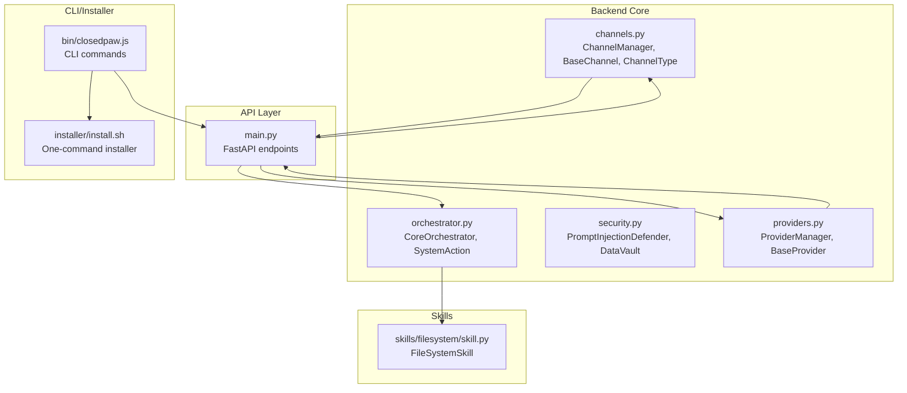
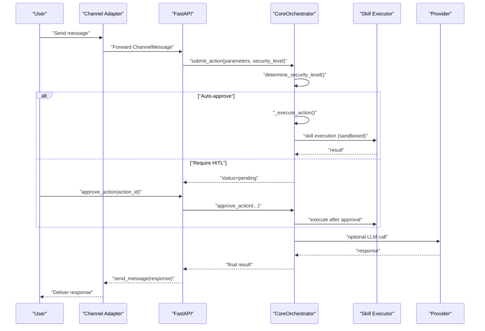
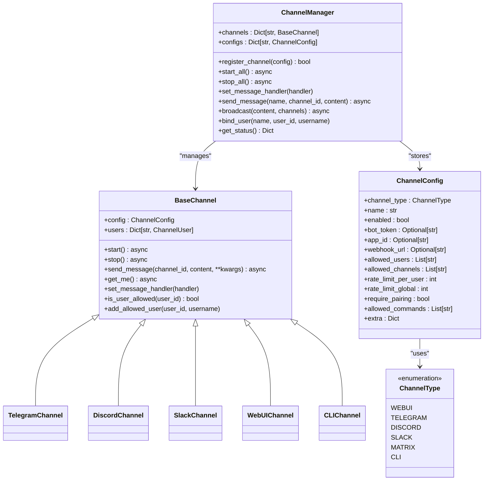
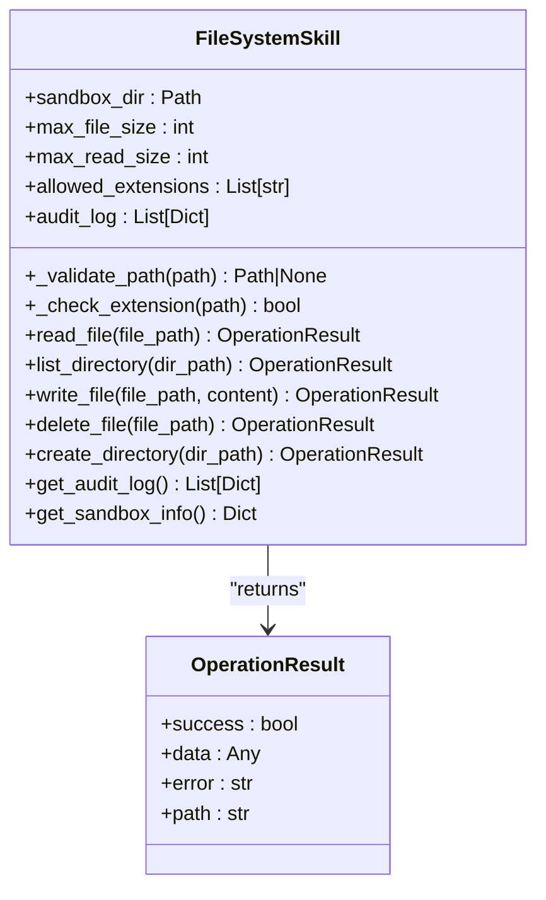
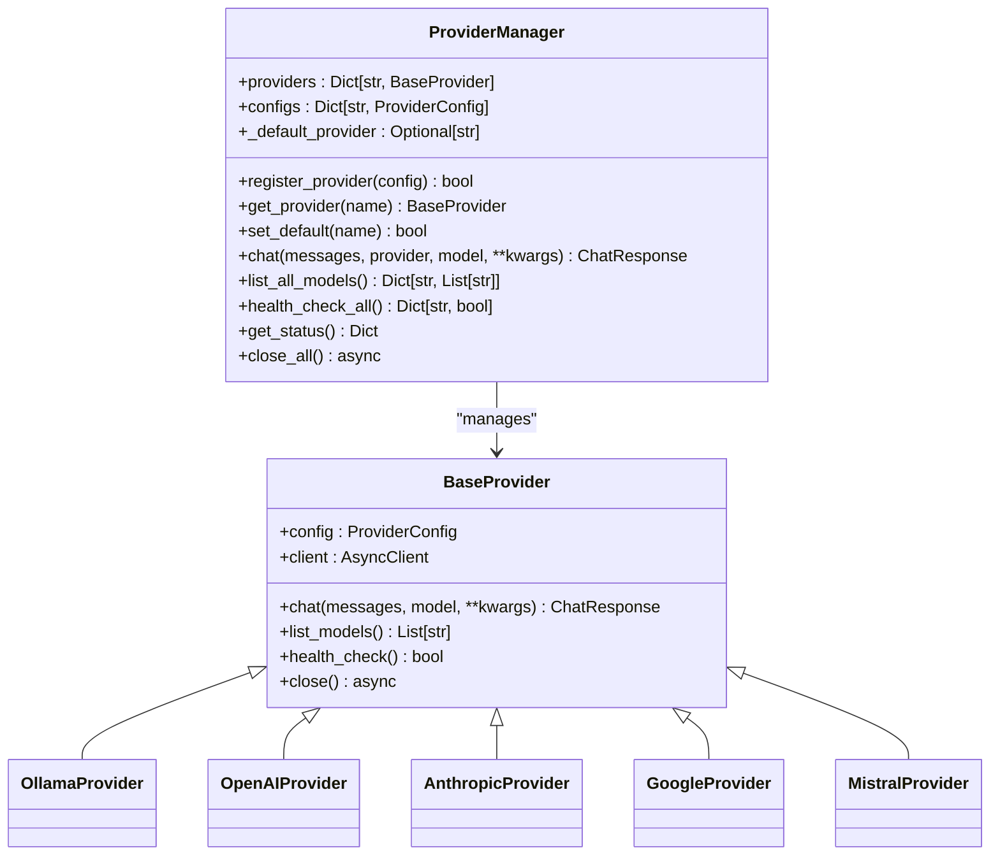
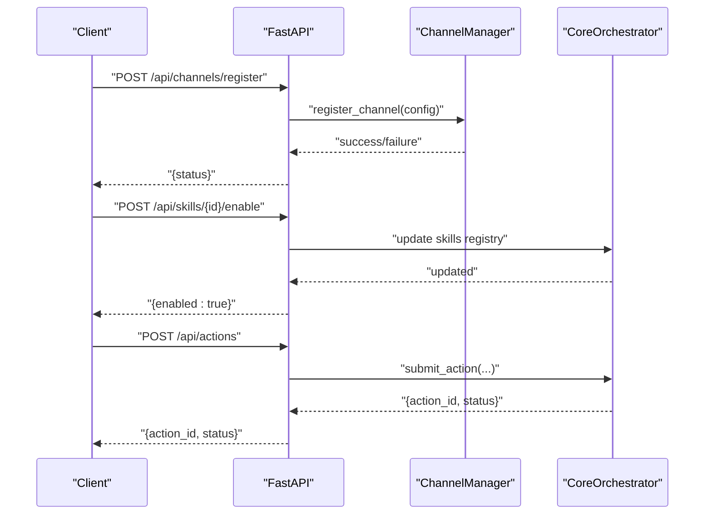
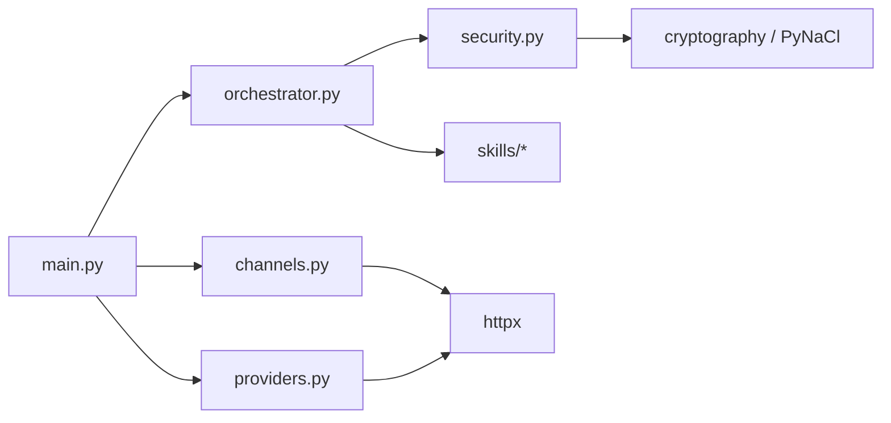

# Plugin Architecture

<cite>
**Referenced Files in This Document**
- [channels.py](file://backend/app/core/channels.py)
- [orchestrator.py](file://backend/app/core/orchestrator.py)
- [security.py](file://backend/app/core/security.py)
- [providers.py](file://backend/app/core/providers.py)
- [main.py](file://backend/app/main.py)
- [skill.py](file://skills/filesystem/skill.py)
- [README.md](file://README.md)
- [CONTRIBUTING.md](file://CONTRIBUTING.md)
- [package.json](file://package.json)
- [requirements.txt](file://backend/requirements.txt)
- [closedpaw.js](file://bin/closedpaw.js)
- [install.sh](file://installer/install.sh)
</cite>

## Table of Contents
1. [Introduction](#introduction)
2. [Project Structure](#project-structure)
3. [Core Components](#core-components)
4. [Architecture Overview](#architecture-overview)
5. [Detailed Component Analysis](#detailed-component-analysis)
6. [Dependency Analysis](#dependency-analysis)
7. [Performance Considerations](#performance-considerations)
8. [Troubleshooting Guide](#troubleshooting-guide)
9. [Conclusion](#conclusion)
10. [Appendices](#appendices)

## Introduction
This document explains ClosedPaw’s plugin architecture with a focus on:
- Channel adapters: a framework for integrating new communication platforms beyond Telegram and Discord
- Skill systems: custom operations, execution framework, sandbox integration, and security boundaries
- Plugin registration mechanisms, interface requirements, and lifecycle management
- Discovery, configuration, and dynamic loading
- Examples, best practices, testing strategies, and performance optimization

ClosedPaw follows a Zero-Trust model, with explicit security controls, audit logging, and human-in-the-loop approvals for high-risk actions.

## Project Structure
The plugin architecture spans backend core modules, API entry points, and skill implementations:
- Channel adapters live in the core channels module and are managed centrally
- Skills are discovered and executed by the orchestrator with security gating
- Providers offer multi-backend LLM integration
- The FastAPI application exposes endpoints for channel and skill management
- CLI and installer scripts support deployment and configuration

**Diagram sources**
- [channels.py](file://backend/app/core/channels.py#L405-L524)
- [orchestrator.py](file://backend/app/core/orchestrator.py#L87-L486)
- [security.py](file://backend/app/core/security.py#L35-L455)
- [providers.py](file://backend/app/core/providers.py#L418-L545)
- [main.py](file://backend/app/main.py#L1-L567)
- [skill.py](file://skills/filesystem/skill.py#L35-L483)
- [closedpaw.js](file://bin/closedpaw.js#L1-L911)
- [install.sh](file://installer/install.sh#L1-L823)

**Section sources**
- [README.md](file://README.md#L134-L156)
- [package.json](file://package.json#L1-L54)
- [requirements.txt](file://backend/requirements.txt#L1-L36)

## Core Components
- Channel adapters: BaseChannel defines the interface; ChannelManager registers and manages channels; ChannelType enumerates supported types; ChannelConfig holds per-channel settings
- Orchestrator: CoreOrchestrator coordinates actions, applies security levels, and delegates skill execution
- Security: PromptInjectionDefender validates inputs and sanitizes threats; DataVault stores secrets encrypted at rest
- Providers: ProviderManager registers and routes to multiple LLM backends (Ollama, OpenAI, Anthropic, Google, Mistral)
- API: FastAPI endpoints expose channel registration, skill enablement, provider management, and action lifecycle

Key responsibilities:
- Channel adapters handle transport-specific logic (authentication, message parsing, sending)
- Skills encapsulate operations with sandboxed execution and audit logging
- Security enforces validation, rate limiting, and audit trails
- Providers abstract LLM backends behind a unified interface

**Section sources**
- [channels.py](file://backend/app/core/channels.py#L79-L136)
- [channels.py](file://backend/app/core/channels.py#L405-L524)
- [orchestrator.py](file://backend/app/core/orchestrator.py#L87-L130)
- [security.py](file://backend/app/core/security.py#L35-L107)
- [providers.py](file://backend/app/core/providers.py#L418-L457)
- [main.py](file://backend/app/main.py#L464-L530)

## Architecture Overview
The system integrates channels, orchestrator, skills, and providers into a cohesive Zero-Trust pipeline:
- Incoming messages arrive via channel adapters and are routed to the orchestrator
- The orchestrator determines security level and either auto-executes or requests human-in-the-loop approval
- Approved actions trigger skill execution with sandboxing and auditing
- Providers supply LLM responses when needed

**Diagram sources**
- [main.py](file://backend/app/main.py#L131-L182)
- [orchestrator.py](file://backend/app/core/orchestrator.py#L169-L224)
- [orchestrator.py](file://backend/app/core/orchestrator.py#L251-L302)
- [providers.py](file://backend/app/core/providers.py#L470-L483)
- [channels.py](file://backend/app/core/channels.py#L462-L469)

## Detailed Component Analysis

### Channel Adapter Framework
Channel adapters implement a common interface to integrate new communication platforms:
- BaseChannel defines lifecycle methods (start, stop, send_message, get_me) and shared utilities (message handler, user allowlist)
- ChannelManager centralizes registration, lifecycle, and broadcasting
- ChannelType enumerates supported channel types; ChannelConfig holds transport-specific settings and security parameters

Implementation highlights:
- Extensibility: Add a new channel by subclassing BaseChannel and registering via ChannelManager
- Security: Built-in allowlists, rate limits, and pairing requirements
- Transport abstraction: Each channel adapts platform APIs to the unified ChannelMessage format

**Diagram sources**
- [channels.py](file://backend/app/core/channels.py#L79-L136)
- [channels.py](file://backend/app/core/channels.py#L405-L524)
- [channels.py](file://backend/app/core/channels.py#L18-L65)

Plugin development checklist:
- Implement BaseChannel subclass with platform-specific logic
- Define ChannelConfig fields for required credentials and settings
- Integrate with ChannelManager.register_channel during startup
- Enforce user allowlists and rate limits
- Provide get_me() for identity verification
- Handle errors and log appropriately

**Section sources**
- [channels.py](file://backend/app/core/channels.py#L79-L136)
- [channels.py](file://backend/app/core/channels.py#L405-L524)
- [channels.py](file://backend/app/core/channels.py#L18-L65)

### Skill System Architecture
Skills encapsulate custom operations with sandboxing and audit logging:
- FileSystemSkill demonstrates a sandboxed file system executor with path validation, extension whitelisting, and size limits
- SKILL_METADATA describes capability, security posture, and whether sandboxing is enabled
- Orchestrator delegates skill execution after approval and records audit events

**Diagram sources**
- [skill.py](file://skills/filesystem/skill.py#L35-L483)

Execution and security:
- Security gating: Orchestrator determines security level and may require HITL for high-risk operations
- Audit logging: Every action is recorded with timestamps, outcomes, and details
- Sandbox boundaries: Skills operate within restricted directories and validated paths

**Section sources**
- [skill.py](file://skills/filesystem/skill.py#L35-L483)
- [orchestrator.py](file://backend/app/core/orchestrator.py#L169-L250)
- [security.py](file://backend/app/core/security.py#L59-L70)

### Provider Management
ProviderManager abstracts multiple LLM backends behind a single interface:
- BaseProvider defines chat, list_models, and health_check
- ProviderManager registers providers, selects defaults, and routes requests
- Supported providers include Ollama, OpenAI, Anthropic, Google, and Mistral

**Diagram sources**
- [providers.py](file://backend/app/core/providers.py#L68-L100)
- [providers.py](file://backend/app/core/providers.py#L418-L524)

**Section sources**
- [providers.py](file://backend/app/core/providers.py#L418-L524)

### API and Lifecycle Management
FastAPI endpoints expose:
- Channel management: register, start/stop, bind users, broadcast
- Skill management: list, enable/disable
- Provider management: register, set default, health check, list models
- Action lifecycle: submit, approve/reject, status, audit logs

**Diagram sources**
- [main.py](file://backend/app/main.py#L473-L504)
- [main.py](file://backend/app/main.py#L357-L379)
- [main.py](file://backend/app/main.py#L241-L262)

**Section sources**
- [main.py](file://backend/app/main.py#L464-L530)

## Dependency Analysis
Internal dependencies:
- main.py depends on orchestrator, providers, and channels
- orchestrator depends on skills registry and security logging
- channels depend on httpx for external APIs
- providers depend on httpx for backend calls
- security module depends on cryptography for encryption

External dependencies (selected):
- FastAPI, Uvicorn, Pydantic for API and validation
- httpx for asynchronous HTTP clients
- cryptography and PyNaCl for encryption
- SQLAlchemy and Alembic for database operations

**Diagram sources**
- [main.py](file://backend/app/main.py#L14-L16)
- [requirements.txt](file://backend/requirements.txt#L4-L36)

**Section sources**
- [requirements.txt](file://backend/requirements.txt#L1-L36)

## Performance Considerations
- Asynchronous I/O: Channels and providers use async HTTP clients to minimize blocking
- Rate limiting: ChannelConfig supports per-user and global rate limits; security module includes a simple rate limiter
- Model switching: Orchestrator validates model availability before switching
- Sandboxing: Skills operate within constrained directories to reduce overhead and risk
- Caching and reuse: Provider clients are reused per provider instance

[No sources needed since this section provides general guidance]

## Troubleshooting Guide
Common issues and resolutions:
- Channel not starting: Verify credentials (bot tokens) and network connectivity; check logs for error messages
- Action stuck pending: Confirm HITL approval; use GET endpoints to inspect pending actions and audit logs
- Provider health: Use health check endpoints to verify provider availability
- Security alerts: Review audit logs and input validation results; adjust thresholds or patterns as needed
- Sandbox failures: Ensure sandbox runtime is installed and configured; verify file permissions and paths

**Section sources**
- [main.py](file://backend/app/main.py#L265-L282)
- [main.py](file://backend/app/main.py#L322-L339)
- [security.py](file://backend/app/core/security.py#L116-L181)
- [channels.py](file://backend/app/core/channels.py#L185-L201)

## Conclusion
ClosedPaw’s plugin architecture enables secure, extensible integration of communication channels and custom skills. By enforcing Zero-Trust principles—explicit validation, sandboxing, audit logging, and human-in-the-loop approvals—the system balances flexibility with strong security guarantees. Developers can extend the platform by adding new channel adapters and skills while adhering to established interfaces and security practices.

[No sources needed since this section summarizes without analyzing specific files]

## Appendices

### Implementing a Custom Channel Adapter
Steps:
- Create a subclass of BaseChannel with platform-specific logic
- Implement start, stop, send_message, and get_me
- Register the channel via ChannelManager.register_channel
- Configure ChannelConfig with required settings (tokens, allowlists)
- Test user allowlists and rate limiting

References:
- [channels.py](file://backend/app/core/channels.py#L79-L136)
- [channels.py](file://backend/app/core/channels.py#L416-L444)

### Implementing a Custom Skill
Steps:
- Define a skill class with a factory function and metadata
- Enforce sandbox boundaries and input validation
- Log operations to audit trails
- Register with the orchestrator and enable via API

References:
- [skill.py](file://skills/filesystem/skill.py#L35-L483)
- [orchestrator.py](file://backend/app/core/orchestrator.py#L158-L168)

### Plugin Discovery and Dynamic Loading
- Channels: Registered via ChannelManager.register_channel
- Skills: Loaded by orchestrator; enable/disable via API
- Providers: Registered via ProviderManager.register_provider

References:
- [channels.py](file://backend/app/core/channels.py#L416-L444)
- [orchestrator.py](file://backend/app/core/orchestrator.py#L158-L168)
- [providers.py](file://backend/app/core/providers.py#L429-L457)

### Best Practices
- Security-first defaults: bind to localhost, encrypt secrets, sanitize inputs
- Minimal privilege: restrict file system access and enforce path validation
- Audit everything: log actions, inputs, and outcomes
- Defensive programming: validate inputs, handle errors gracefully, and avoid exposing sensitive details

References:
- [CONTRIBUTING.md](file://CONTRIBUTING.md#L99-L122)
- [security.py](file://backend/app/core/security.py#L253-L288)

### Testing Strategies
- Unit tests for channel adapters and skills
- Integration tests for provider backends
- End-to-end tests for action lifecycles and approvals
- Security tests for input validation and sandbox boundaries

References:
- [CONTRIBUTING.md](file://CONTRIBUTING.md#L87-L98)

### Deployment and Configuration
- CLI commands for installation, start, stop, and diagnostics
- One-command installer script for Linux/macOS
- Configuration files for channels and providers

References:
- [closedpaw.js](file://bin/closedpaw.js#L680-L796)
- [install.sh](file://installer/install.sh#L792-L823)
- [README.md](file://README.md#L26-L64)