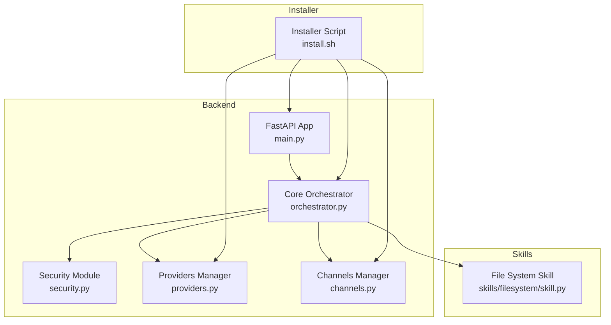
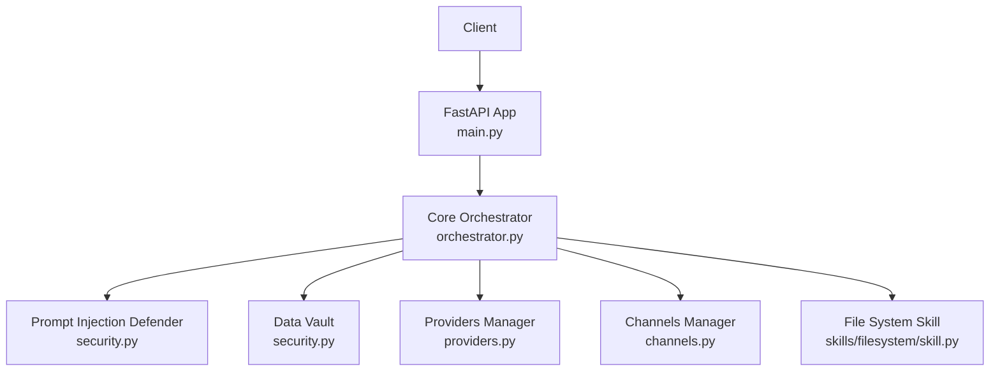
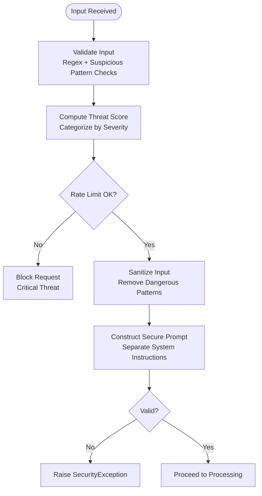
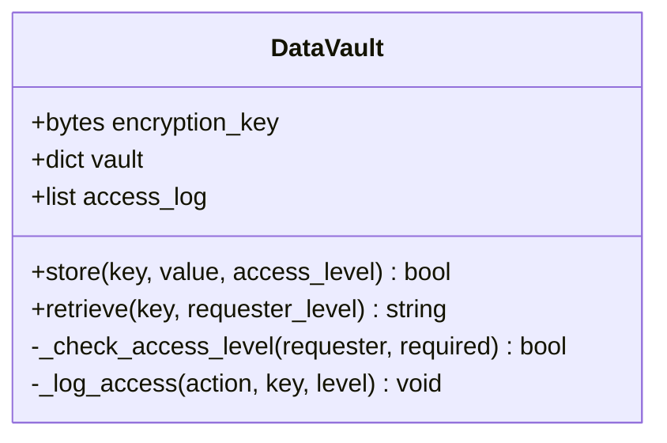
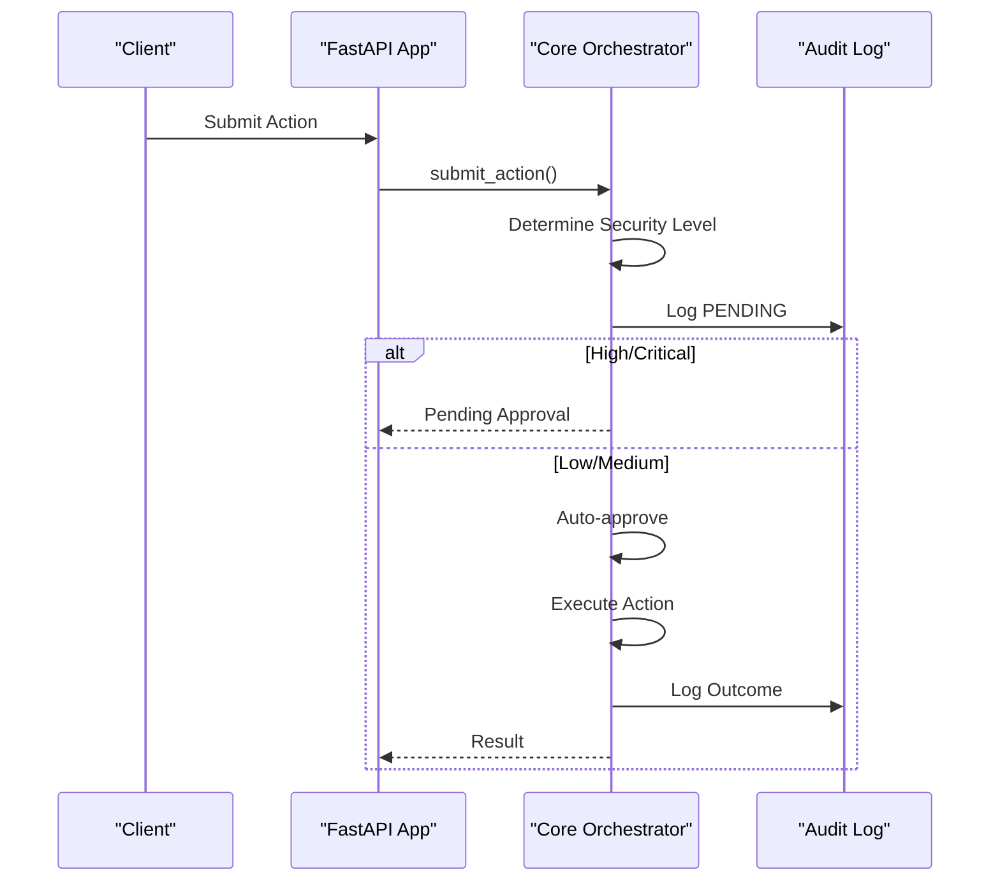
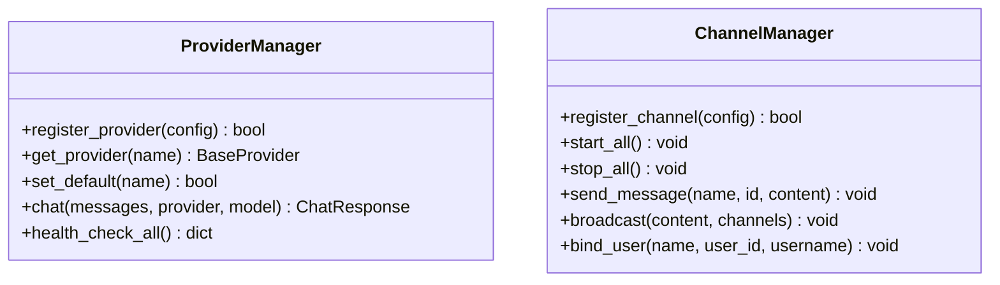
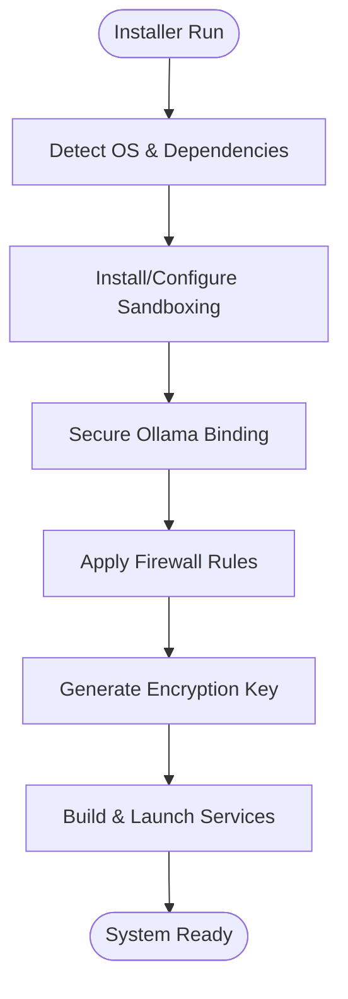
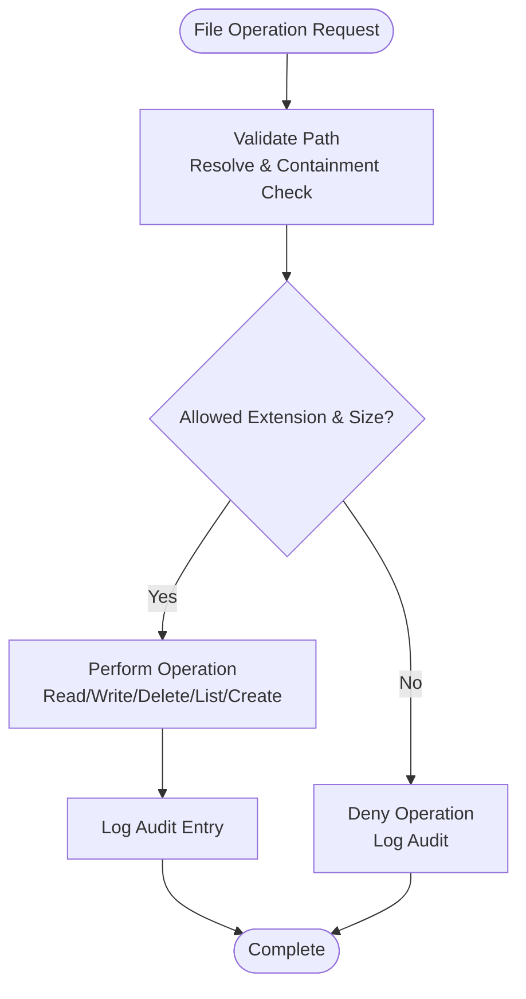
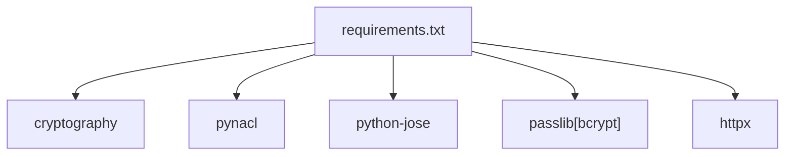

# Security Hardening

<cite>
**Referenced Files in This Document**
- [security.py](file://backend/app/core/security.py)
- [main.py](file://backend/app/main.py)
- [orchestrator.py](file://backend/app/core/orchestrator.py)
- [providers.py](file://backend/app/core/providers.py)
- [channels.py](file://backend/app/core/channels.py)
- [requirements.txt](file://backend/requirements.txt)
- [install.sh](file://installer/install.sh)
- [README.md](file://README.md)
- [CONTRIBUTING.md](file://CONTRIBUTING.md)
- [skill.py](file://skills/filesystem/skill.py)
</cite>

## Table of Contents
1. [Introduction](#introduction)
2. [Project Structure](#project-structure)
3. [Core Components](#core-components)
4. [Architecture Overview](#architecture-overview)
5. [Detailed Component Analysis](#detailed-component-analysis)
6. [Dependency Analysis](#dependency-analysis)
7. [Performance Considerations](#performance-considerations)
8. [Troubleshooting Guide](#troubleshooting-guide)
9. [Conclusion](#conclusion)
10. [Appendices](#appendices)

## Introduction
This document provides advanced security hardening guidance for ClosedPaw focused on production deployment. It consolidates existing security controls implemented in the codebase and augments them with enterprise-grade practices for threat mitigation, secure configuration, compliance, audit optimization, intrusion detection integration, encryption and key management, monitoring and alerting, incident response, vulnerability assessment, hardened deployments, network security, access control, security testing, and regulatory compliance.

## Project Structure
ClosedPaw’s security posture is implemented across:
- Core security module for prompt injection defense and encrypted data vault
- Application entrypoint enforcing zero-trust boundaries and CORS restrictions
- Orchestrator implementing audit logging, HITL gating, and security levels
- Provider and channel managers enabling multi-provider LLM access and multi-channel messaging with allowlists and rate limits
- Installer configuring local-only LLM access, sandboxing, and firewall rules
- Frontend storing encrypted secrets and exposing configuration surfaces

**Diagram sources**
- [security.py](file://backend/app/core/security.py#L1-L455)
- [main.py](file://backend/app/main.py#L1-L567)
- [orchestrator.py](file://backend/app/core/orchestrator.py#L1-L486)
- [providers.py](file://backend/app/core/providers.py#L1-L545)
- [channels.py](file://backend/app/core/channels.py#L1-L524)
- [install.sh](file://installer/install.sh#L1-L823)
- [skill.py](file://skills/filesystem/skill.py#L1-L483)

**Section sources**
- [README.md](file://README.md#L1-L192)
- [main.py](file://backend/app/main.py#L72-L88)
- [install.sh](file://installer/install.sh#L407-L453)

## Core Components
- Prompt Injection Defender: Implements layered detection of injection patterns, suspicious character sets, anomaly scoring, rate limiting, input sanitization, and secure prompt construction with explicit separation of system instructions and user input.
- Data Vault: Provides encrypted storage for secrets using symmetric encryption with access-level checks and audit logging.
- Core Orchestrator: Enforces security levels, logs audit events, gates critical actions via Human-in-the-Loop (HITL), and maintains action lifecycle with approvals and outcomes.
- Providers Manager: Supports multiple LLM providers with health checks, timeouts, and per-provider rate limits.
- Channels Manager: Enables multi-channel messaging with allowlists, rate limits, and user binding.
- Installer: Hardens local-only LLM access, applies firewall rules, generates encryption keys, and configures sandboxing.

**Section sources**
- [security.py](file://backend/app/core/security.py#L35-L287)
- [security.py](file://backend/app/core/security.py#L325-L435)
- [orchestrator.py](file://backend/app/core/orchestrator.py#L87-L486)
- [providers.py](file://backend/app/core/providers.py#L418-L545)
- [channels.py](file://backend/app/core/channels.py#L405-L524)
- [install.sh](file://installer/install.sh#L407-L453)

## Architecture Overview
The system follows a zero-trust model:
- All inbound traffic is restricted to localhost
- Input validation and sanitization occur before any processing
- Actions are categorized by security level; high-risk actions require HITL approval
- Audit logs capture all security-relevant events
- Secrets are encrypted at rest and access-controlled
- Sandboxed execution environments isolate potentially risky operations

**Diagram sources**
- [main.py](file://backend/app/main.py#L131-L182)
- [orchestrator.py](file://backend/app/core/orchestrator.py#L169-L224)
- [security.py](file://backend/app/core/security.py#L35-L181)
- [providers.py](file://backend/app/core/providers.py#L470-L483)
- [channels.py](file://backend/app/core/channels.py#L462-L483)
- [skill.py](file://skills/filesystem/skill.py#L35-L76)

## Detailed Component Analysis

### Prompt Injection Defense and Secure Prompt Construction
- Detection: Regex-based patterns targeting instruction overrides, role manipulation, delimiter manipulation, encoding obfuscation, context manipulation, persistence attempts, and tool hijacking.
- Anomaly detection: Control characters, bidirectional text, repetitive patterns, excessive special characters, and long inputs.
- Scoring and thresholds: Categorize threats and escalate accordingly; apply rate limiting to mitigate brute-force attempts.
- Sanitization: Removes null bytes, normalizes whitespace, strips control and bidirectional characters, escapes markdown markers.
- Secure prompt construction: Enforces strict separation between system instructions and user input, rejects unvalidated input, and raises exceptions on critical threats.

**Diagram sources**
- [security.py](file://backend/app/core/security.py#L116-L181)
- [security.py](file://backend/app/core/security.py#L207-L227)
- [security.py](file://backend/app/core/security.py#L253-L287)

**Section sources**
- [security.py](file://backend/app/core/security.py#L35-L287)

### Data Vault and Secret Management
- Encryption: Symmetric encryption using a generated key; stores encrypted values with access-level metadata.
- Access control: Hierarchical access levels enforced during retrieval; logs all access attempts.
- Audit: Maintains an access log for traceability; integrates with system logging.

**Diagram sources**
- [security.py](file://backend/app/core/security.py#L325-L435)

**Section sources**
- [security.py](file://backend/app/core/security.py#L325-L435)
- [install.sh](file://installer/install.sh#L597-L608)

### Core Orchestrator and Audit Logging
- Security levels: LOW, MEDIUM, HIGH, CRITICAL; determines whether HITL approval is required.
- Audit logging: Captures action lifecycle, outcomes, and details; writes to a dedicated audit log file.
- HITL gating: High and critical actions are placed in pending state until human approval.
- Action execution: Executes approved actions asynchronously with error handling and audit trails.

**Diagram sources**
- [main.py](file://backend/app/main.py#L241-L262)
- [orchestrator.py](file://backend/app/core/orchestrator.py#L169-L224)
- [orchestrator.py](file://backend/app/core/orchestrator.py#L429-L450)

**Section sources**
- [orchestrator.py](file://backend/app/core/orchestrator.py#L51-L57)
- [orchestrator.py](file://backend/app/core/orchestrator.py#L429-L462)

### Providers and Channels Security Controls
- Providers: Per-provider timeouts, health checks, and rate limits; supports multiple providers with standardized interfaces.
- Channels: Allowlists, rate limits, and user binding; supports multiple communication channels with consistent security posture.

**Diagram sources**
- [providers.py](file://backend/app/core/providers.py#L418-L545)
- [channels.py](file://backend/app/core/channels.py#L405-L524)

**Section sources**
- [providers.py](file://backend/app/core/providers.py#L418-L545)
- [channels.py](file://backend/app/core/channels.py#L405-L524)

### Installer Hardening and Production Deployment
- Local-only LLM binding: Ensures Ollama listens on loopback interfaces only.
- Firewall configuration: Restricts access to UI and API ports from localhost.
- Encryption key generation: Creates a secure key for encrypting secrets at rest.
- Sandboxing: Installs and configures gVisor/Kata for containerized isolation.

**Diagram sources**
- [install.sh](file://installer/install.sh#L407-L453)
- [install.sh](file://installer/install.sh#L670-L681)
- [install.sh](file://installer/install.sh#L597-L608)
- [install.sh](file://installer/install.sh#L792-L823)

**Section sources**
- [install.sh](file://installer/install.sh#L407-L453)
- [install.sh](file://installer/install.sh#L670-L681)
- [install.sh](file://installer/install.sh#L597-L608)

### File System Skill Security
- Sandboxed operations: Restricts file system access to a designated sandbox directory.
- Path traversal prevention: Validates and resolves paths to ensure containment.
- Whitelisted extensions and size limits: Prevents execution of arbitrary binaries and limits resource consumption.
- Audit logging: Records all operations for forensic analysis.

**Diagram sources**
- [skill.py](file://skills/filesystem/skill.py#L77-L132)
- [skill.py](file://skills/filesystem/skill.py#L133-L208)
- [skill.py](file://skills/filesystem/skill.py#L274-L335)

**Section sources**
- [skill.py](file://skills/filesystem/skill.py#L35-L76)
- [skill.py](file://skills/filesystem/skill.py#L77-L132)
- [skill.py](file://skills/filesystem/skill.py#L133-L208)
- [skill.py](file://skills/filesystem/skill.py#L274-L335)

## Dependency Analysis
Security-related dependencies include cryptographic libraries, HTTP clients, and sandboxing runtimes. The backend requirements specify cryptography, PyNaCl, JWT handling, bcrypt hashing, and HTTPX for provider connectivity.

**Diagram sources**
- [requirements.txt](file://backend/requirements.txt#L21-L25)

**Section sources**
- [requirements.txt](file://backend/requirements.txt#L1-L36)

## Performance Considerations
- Input validation and sanitization add CPU overhead; tune regex complexity and consider caching compiled patterns.
- Rate limiting should be tuned per deployment to balance security and user experience.
- Audit logging to file can become large; implement log rotation and retention policies.
- Provider timeouts and retries should be configured to avoid blocking the orchestrator.

[No sources needed since this section provides general guidance]

## Troubleshooting Guide
- Prompt injection blocks: Review detected patterns and adjust recommendations; ensure rate limits are not overly aggressive.
- Audit log availability: Verify file path and permissions; confirm logging configuration.
- Provider connectivity: Check health checks and timeouts; validate API keys and base URLs.
- Channel allowlists: Confirm user bindings and rate limits; verify token configuration.
- Installer failures: Validate OS detection, dependency presence, and sandbox runtime availability.

**Section sources**
- [security.py](file://backend/app/core/security.py#L176-L180)
- [orchestrator.py](file://backend/app/core/orchestrator.py#L18-L28)
- [providers.py](file://backend/app/core/providers.py#L495-L503)
- [channels.py](file://backend/app/core/channels.py#L484-L490)
- [install.sh](file://installer/install.sh#L273-L288)

## Conclusion
ClosedPaw implements a robust zero-trust security model with defense-in-depth layers spanning input validation, sandboxing, human oversight, audit logging, and encrypted secret storage. Production hardening should emphasize secure configuration, continuous monitoring, strict access control, and adherence to compliance requirements. The included installer and core components provide a strong baseline for enterprise-grade deployments.

[No sources needed since this section summarizes without analyzing specific files]

## Appendices

### Advanced Security Hardening Checklist
- Network Security
  - Enforce loopback-only LLM binding and restrict inbound ports to localhost
  - Apply firewall rules to permit only trusted internal networks
  - Enable TLS termination at reverse proxy with strong cipher suites
- Access Control Hardening
  - Enforce multi-factor authentication for administrative endpoints
  - Implement role-based access control (RBAC) for HITL approvals
  - Use short-lived API tokens with automatic rotation
- Audit Trail Optimization
  - Centralize audit logs to SIEM with structured JSON format
  - Implement log retention and archival policies
  - Add correlation rules for suspicious activity patterns
- Intrusion Detection Integration
  - Feed audit logs into IDS/IPS systems
  - Monitor for repeated rate-limit triggers and injection attempts
- Advanced Encryption and Key Management
  - Use hardware security modules (HSM) for encryption keys
  - Implement key derivation functions with salt and iteration counts
  - Rotate keys periodically and maintain key derivation history
- Certificate Handling
  - Manage certificates with automated renewal and revocation
  - Enforce certificate pinning for outbound provider communications
- Monitoring and Alerting
  - Define SLOs for latency and throughput with SLAs
  - Configure alerts for elevated threat levels and audit anomalies
- Incident Response Procedures
  - Establish playbooks for prompt injection, provider compromise, and insider threats
  - Automate isolation of compromised channels and providers
- Vulnerability Assessment Framework
  - Conduct quarterly dependency scans and container image audits
  - Perform monthly static analysis and dynamic testing
- Security Testing Methodologies
  - Penetration testing with sandboxed environments
  - Fuzzing of input validation and prompt injection defenses
  - Red team exercises simulating insider and supply chain attacks
- Compliance Requirements and Certifications
  - Align with ISO 27001, SOC 2, GDPR, HIPAA, PCI-DSS as applicable
  - Maintain evidence of security controls and remediation
  - Document risk assessments and third-party attestations

[No sources needed since this section provides general guidance]