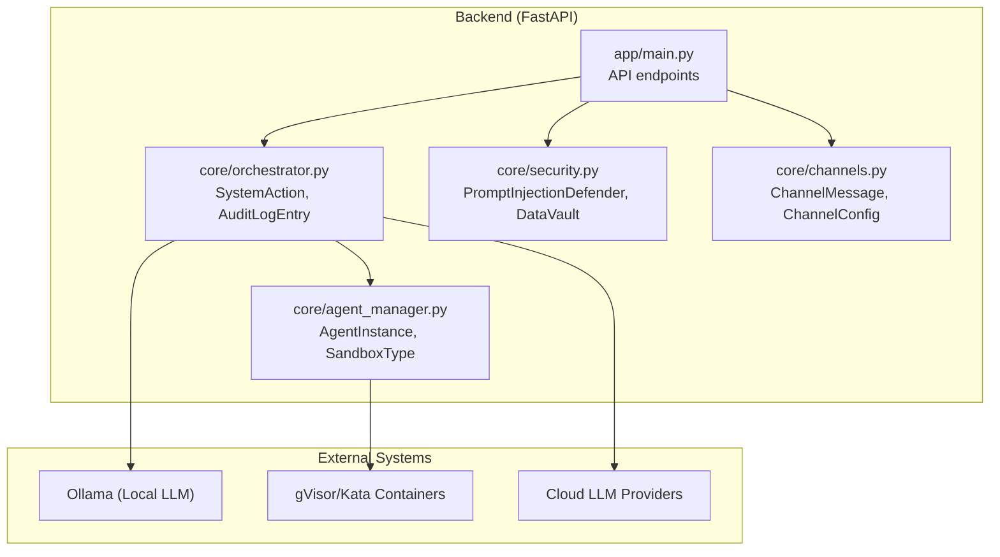
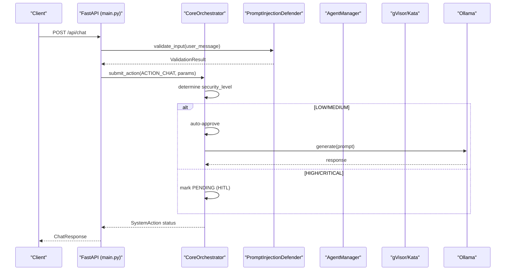
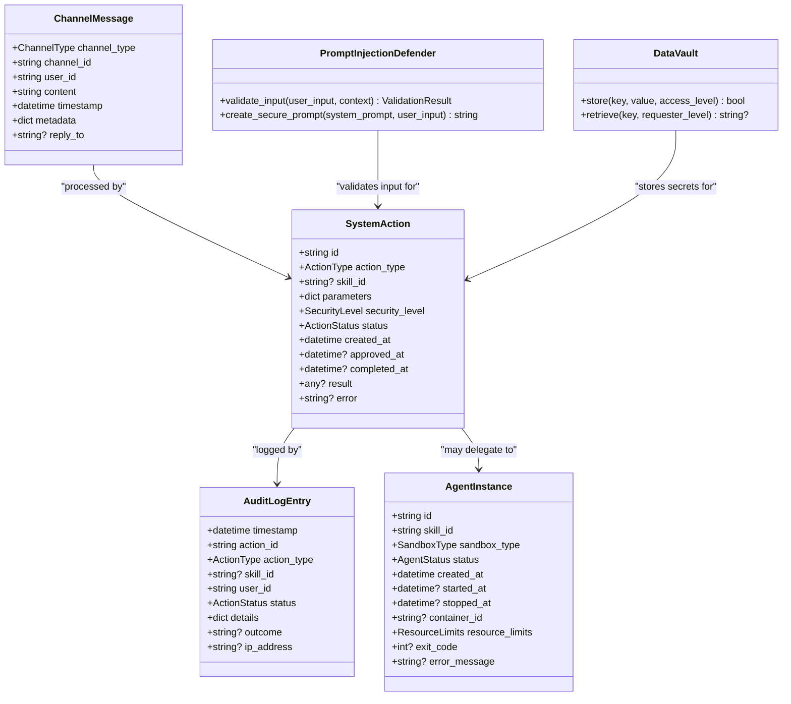
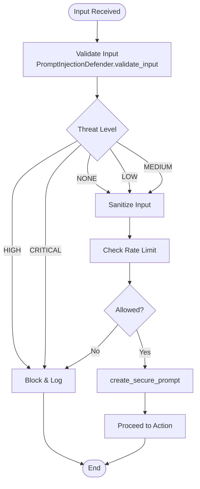
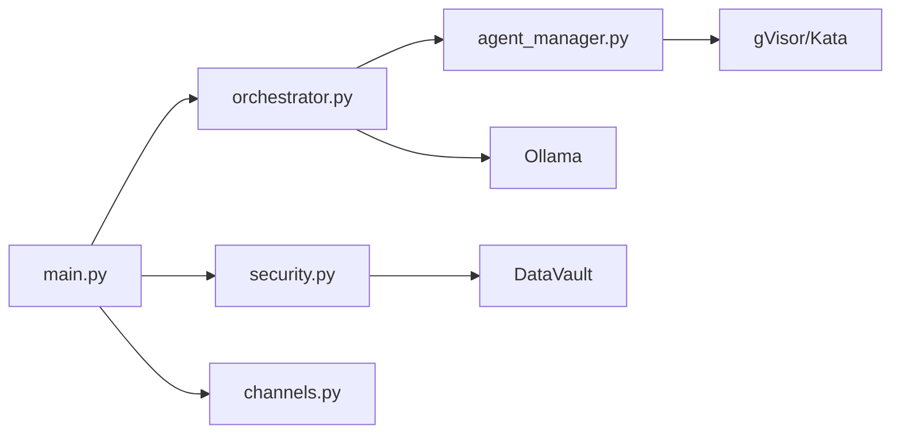

# Appendix

<cite>
**Referenced Files in This Document**
- [README.md](file://README.md)
- [LICENSE](file://LICENSE)
- [CONTRIBUTING.md](file://CONTRIBUTING.md)
- [backend/app/main.py](file://backend/app/main.py)
- [backend/app/core/orchestrator.py](file://backend/app/core/orchestrator.py)
- [backend/app/core/security.py](file://backend/app/core/security.py)
- [backend/app/core/agent_manager.py](file://backend/app/core/agent_manager.py)
- [backend/app/core/channels.py](file://backend/app/core/channels.py)
</cite>

## Table of Contents
1. [Introduction](#introduction)
2. [Project Structure](#project-structure)
3. [Core Components](#core-components)
4. [Architecture Overview](#architecture-overview)
5. [Detailed Component Analysis](#detailed-component-analysis)
6. [Dependency Analysis](#dependency-analysis)
7. [Performance Considerations](#performance-considerations)
8. [Troubleshooting Guide](#troubleshooting-guide)
9. [Conclusion](#conclusion)
10. [Appendices](#appendices)

## Introduction
This appendix provides comprehensive reference material for ClosedPaw’s API schemas, data models, security posture, and operational guidance. It consolidates:
- API request/response schemas and endpoint definitions
- Core data models including entity relationships and field semantics
- Security checklist for deployment verification and validation
- Glossary of security and architecture terms
- References to external resources, licensing, and contribution acknowledgments
- Quick reference guides and troubleshooting steps

## Project Structure
The repository follows a layered backend architecture with a FastAPI application, a core orchestrator, sandboxed agent management, channel integrations, and security modules. The frontend is a separate Next.js application.

**Diagram sources**
- [backend/app/main.py](file://backend/app/main.py#L1-L567)
- [backend/app/core/orchestrator.py](file://backend/app/core/orchestrator.py#L1-L486)
- [backend/app/core/security.py](file://backend/app/core/security.py#L1-L455)
- [backend/app/core/agent_manager.py](file://backend/app/core/agent_manager.py#L1-L708)
- [backend/app/core/channels.py](file://backend/app/core/channels.py#L1-L524)

**Section sources**
- [README.md](file://README.md#L75-L96)
- [backend/app/main.py](file://backend/app/main.py#L72-L87)

## Core Components
This section documents the primary data models and their relationships, focusing on SystemAction, ChatMessage, ChannelMessage, and AuditLogEntry.

- SystemAction
  - Purpose: Represents a unit of work subject to security evaluation and approval.
  - Key fields: id, action_type, skill_id, parameters, security_level, status, timestamps, result, error.
  - Status lifecycle: PENDING → APPROVED → EXECUTING → COMPLETED/FAILED.
  - Security levels: LOW, MEDIUM, HIGH, CRITICAL.

- AuditLogEntry
  - Purpose: Captures security-relevant events for forensic analysis.
  - Key fields: timestamp, action_id, action_type, skill_id, user_id, status, details, outcome, ip_address.

- ChatMessage
  - Purpose: Represents a message exchanged with a channel.
  - Key fields: channel_type, channel_id, user_id, content, timestamp, metadata, reply_to.

- ChannelMessage
  - Purpose: Internal representation of channel-bound messages for routing and processing.
  - Key fields: channel_type, channel_id, user_id, content, timestamp, metadata, reply_to.

- DataVault
  - Purpose: Encrypted storage for secrets (e.g., API keys).
  - Operations: store(key, value), retrieve(key, requester_level).
  - Access control levels: public, standard, elevated, admin.

- PromptInjectionDefender
  - Purpose: Validates and sanitizes user input to mitigate prompt injection.
  - Features: pattern detection, anomaly scoring, rate limiting, secure prompt construction.

- AgentInstance and SandboxType
  - Purpose: Describes sandboxed skill executors with resource limits and isolation.
  - Isolation: gVisor or Kata Containers; Docker alone is not used for sandboxing.

Entity relationship highlights:
- SystemAction is created by the orchestrator and may require Human-in-the-Loop (HITL) approval depending on security_level.
- AuditLogEntry records outcomes of SystemAction lifecycle transitions.
- ChannelMessage and ChatMessage represent inbound/outbound messaging across supported channels.
- DataVault secures sensitive configuration and credentials.
- AgentManager manages sandboxed execution of skills.

**Section sources**
- [backend/app/core/orchestrator.py](file://backend/app/core/orchestrator.py#L59-L85)
- [backend/app/core/orchestrator.py](file://backend/app/core/orchestrator.py#L31-L57)
- [backend/app/core/channels.py](file://backend/app/core/channels.py#L28-L40)
- [backend/app/core/channels.py](file://backend/app/core/channels.py#L18-L26)
- [backend/app/core/security.py](file://backend/app/core/security.py#L325-L435)
- [backend/app/core/security.py](file://backend/app/core/security.py#L35-L288)
- [backend/app/core/agent_manager.py](file://backend/app/core/agent_manager.py#L21-L63)

## Architecture Overview
The system enforces a Zero-Trust model:
- All requests are validated and separated into system and user prompts.
- Low-risk actions execute automatically; high-risk actions require HITL approval.
- Skills execute inside hardened sandboxes (gVisor/Kata).
- All actions are audited for forensic analysis.

**Diagram sources**
- [backend/app/main.py](file://backend/app/main.py#L131-L182)
- [backend/app/core/security.py](file://backend/app/core/security.py#L116-L181)
- [backend/app/core/orchestrator.py](file://backend/app/core/orchestrator.py#L169-L224)
- [backend/app/core/orchestrator.py](file://backend/app/core/orchestrator.py#L303-L332)

**Section sources**
- [README.md](file://README.md#L65-L74)
- [backend/app/core/security.py](file://backend/app/core/security.py#L35-L288)
- [backend/app/core/orchestrator.py](file://backend/app/core/orchestrator.py#L87-L130)

## Detailed Component Analysis

### API Schemas and Endpoints
This section documents request/response schemas and key endpoints used by clients.

- GET /
  - Description: Root health/status endpoint.
  - Response: name, version, status, security_model.

- GET /api/status
  - Description: System status including Ollama connectivity, available models, and pending actions.
  - Response: status, ollama_connected, available_models, pending_actions.

- POST /api/chat
  - Request: message, model, use_cloud.
  - Response: response, model, action_id, status.
  - Behavior: Submits a chat action; waits up to a timeout; returns completion or pending status.

- GET /api/models
  - Description: Lists available local LLM models.
  - Response: Array of ModelInfo (name, description, size, parameters).

- POST /api/models/switch
  - Request: model.
  - Response: status, model.
  - Behavior: Switches to a specified model with medium security.

- POST /api/actions
  - Request: action_type, parameters, skill_id.
  - Response: action_id, status, security_level, requires_approval.

- GET /api/actions/pending
  - Description: Lists pending actions requiring HITL approval.
  - Response: Array of pending action summaries.

- POST /api/actions/{action_id}/approve
  - Request: approved, user_id.
  - Response: action_id, approved, status.

- GET /api/actions/{action_id}
  - Description: Retrieves a specific action’s status and details.
  - Response: action details including timestamps and outcomes.

- GET /api/audit-logs
  - Request: limit.
  - Response: Array of AuditLogEntry items.

- GET /api/skills
  - Response: Array of skills with id, name, enabled.

- POST /api/skills/{skill_id}/enable
- POST /api/skills/{skill_id}/disable

- GET /api/providers
- GET /api/providers/{provider_name}/models
- POST /api/providers/register
- POST /api/providers/{provider_name}/default
- GET /api/providers/health
- GET /api/providers/models

- GET /api/channels
- POST /api/channels/register
- POST /api/channels/{channel_name}/bind-user
- POST /api/channels/start
- POST /api/channels/stop

- POST /api/chat/multi
  - Request: message, provider, model.
  - Response: response, model, provider, tokens, latency_ms.

Notes on schemas:
- Pydantic models define request/response shapes and descriptions.
- Endpoints enforce local-only binding (localhost) and restrict origins via CORS.

**Section sources**
- [backend/app/main.py](file://backend/app/main.py#L19-L56)
- [backend/app/main.py](file://backend/app/main.py#L101-L128)
- [backend/app/main.py](file://backend/app/main.py#L131-L182)
- [backend/app/main.py](file://backend/app/main.py#L184-L211)
- [backend/app/main.py](file://backend/app/main.py#L213-L239)
- [backend/app/main.py](file://backend/app/main.py#L241-L262)
- [backend/app/main.py](file://backend/app/main.py#L265-L282)
- [backend/app/main.py](file://backend/app/main.py#L284-L299)
- [backend/app/main.py](file://backend/app/main.py#L301-L319)
- [backend/app/main.py](file://backend/app/main.py#L322-L339)
- [backend/app/main.py](file://backend/app/main.py#L342-L379)
- [backend/app/main.py](file://backend/app/main.py#L383-L462)
- [backend/app/main.py](file://backend/app/main.py#L466-L529)
- [backend/app/main.py](file://backend/app/main.py#L533-L555)

### Data Models and Relationships

#### Class Diagram: Core Data Models

**Diagram sources**
- [backend/app/core/orchestrator.py](file://backend/app/core/orchestrator.py#L59-L85)
- [backend/app/core/channels.py](file://backend/app/core/channels.py#L28-L40)
- [backend/app/core/security.py](file://backend/app/core/security.py#L325-L435)
- [backend/app/core/security.py](file://backend/app/core/security.py#L35-L288)
- [backend/app/core/agent_manager.py](file://backend/app/core/agent_manager.py#L50-L63)

**Section sources**
- [backend/app/core/orchestrator.py](file://backend/app/core/orchestrator.py#L59-L85)
- [backend/app/core/channels.py](file://backend/app/core/channels.py#L28-L40)
- [backend/app/core/security.py](file://backend/app/core/security.py#L325-L435)
- [backend/app/core/security.py](file://backend/app/core/security.py#L35-L288)
- [backend/app/core/agent_manager.py](file://backend/app/core/agent_manager.py#L50-L63)

### Security Validation Flow

**Diagram sources**
- [backend/app/core/security.py](file://backend/app/core/security.py#L116-L181)
- [backend/app/core/security.py](file://backend/app/core/security.py#L290-L318)
- [backend/app/core/security.py](file://backend/app/core/security.py#L253-L288)

**Section sources**
- [backend/app/core/security.py](file://backend/app/core/security.py#L116-L181)
- [backend/app/core/security.py](file://backend/app/core/security.py#L253-L288)

## Dependency Analysis
- API layer depends on orchestrator for action lifecycle and on security modules for input validation and encryption.
- Orchestrator coordinates with Ollama for local LLM inference and delegates risky tasks to AgentManager.
- AgentManager interacts with sandbox runtimes (gVisor/Kata) to execute skills in isolated containers.
- Channels module integrates external platforms and routes messages to the orchestrator.

**Diagram sources**
- [backend/app/main.py](file://backend/app/main.py#L14-L16)
- [backend/app/core/orchestrator.py](file://backend/app/core/orchestrator.py#L112-L130)
- [backend/app/core/agent_manager.py](file://backend/app/core/agent_manager.py#L81-L98)
- [backend/app/core/security.py](file://backend/app/core/security.py#L325-L435)

**Section sources**
- [backend/app/main.py](file://backend/app/main.py#L14-L16)
- [backend/app/core/orchestrator.py](file://backend/app/core/orchestrator.py#L112-L130)
- [backend/app/core/agent_manager.py](file://backend/app/core/agent_manager.py#L81-L98)
- [backend/app/core/security.py](file://backend/app/core/security.py#L325-L435)

## Performance Considerations
- Local-only binding and CORS restrictions reduce exposure and improve security.
- Async I/O for external LLM and channel APIs prevents blocking.
- Resource limits in sandbox configurations constrain CPU, memory, and process counts.
- Rate limiting in the security module mitigates abuse.

[No sources needed since this section provides general guidance]

## Troubleshooting Guide
Common checks and remedies:
- Ollama connectivity
  - Verify local-only binding and service availability.
  - Endpoint: GET /api/status queries http://127.0.0.1:11434/api/tags.
- Sandbox runtime detection
  - Ensure gVisor or Kata is installed; AgentManager detects runtime and reports availability.
- Audit logs
  - Use GET /api/audit-logs to inspect security events and outcomes.
- Provider registration and health
  - Register providers via POST /api/providers/register and check health via GET /api/providers/health.
- Channel configuration
  - Register channels via POST /api/channels/register and manage allowlists via POST /api/channels/{channel_name}/bind-user.

**Section sources**
- [backend/app/main.py](file://backend/app/main.py#L101-L128)
- [backend/app/core/agent_manager.py](file://backend/app/core/agent_manager.py#L99-L148)
- [backend/app/core/orchestrator.py](file://backend/app/core/orchestrator.py#L459-L461)
- [backend/app/main.py](file://backend/app/main.py#L403-L454)
- [backend/app/main.py](file://backend/app/main.py#L473-L513)

## Conclusion
This appendix consolidates ClosedPaw’s API schemas, core data models, and security architecture. It provides a practical reference for developers and operators to build, deploy, and operate the system securely and efficiently.

[No sources needed since this section summarizes without analyzing specific files]

## Appendices

### Security Checklist for Deployment Verification
- Zero-trust runtime
  - Confirm gVisor or Kata Containers are installed and detected by AgentManager.
- Local-only services
  - Verify backend binds to 127.0.0.1 and CORS allows only localhost origins.
- Input validation
  - Ensure PromptInjectionDefender is active and rate limiting is enforced.
- Audit logging
  - Confirm audit logs are generated and retrievable via GET /api/audit-logs.
- Provider security
  - Register providers with secure defaults; avoid plaintext credentials.
- Channel allowlists
  - Configure allowed users and commands per channel.
- Sandbox enforcement
  - Confirm skills execute in hardened containers; avoid Docker alone.

**Section sources**
- [CONTRIBUTING.md](file://CONTRIBUTING.md#L99-L122)
- [backend/app/core/agent_manager.py](file://backend/app/core/agent_manager.py#L99-L148)
- [backend/app/main.py](file://backend/app/main.py#L80-L87)
- [backend/app/core/security.py](file://backend/app/core/security.py#L290-L318)
- [backend/app/core/orchestrator.py](file://backend/app/core/orchestrator.py#L459-L461)
- [backend/app/main.py](file://backend/app/main.py#L403-L454)
- [backend/app/main.py](file://backend/app/main.py#L473-L513)

### Glossary of Terms
- Zero-trust: A security model that assumes no implicit trust; all requests and actions are continuously validated.
- Implicit distrust: The principle that no component or user is trusted by default; verification is mandatory.
- Sandboxing: Isolation technique that confines processes and resources to minimize risk of escape or lateral movement.
- Security boundary: A protective barrier (e.g., container runtime, network isolation) that separates trusted and untrusted execution contexts.
- Human-in-the-loop (HITL): A security mechanism requiring human approval for high-risk actions.

**Section sources**
- [README.md](file://README.md#L65-L74)
- [CONTRIBUTING.md](file://CONTRIBUTING.md#L17-L22)

### References and Resources
- Related projects and inspiration
  - Built with lessons learned from OpenClaw security analysis.
- Security research
  - Prompt injection defense aligned with CVE-2026-25253-type attacks.
- Licensing
  - MIT License.
- Community and contribution
  - See CONTRIBUTING.md for guidelines and security considerations.

**Section sources**
- [README.md](file://README.md#L121-L125)
- [README.md](file://README.md#L69-L70)
- [LICENSE](file://LICENSE#L1-L21)
- [CONTRIBUTING.md](file://CONTRIBUTING.md#L1-L251)

### Licensing Information
- This project is licensed under the MIT License. See LICENSE for details.

**Section sources**
- [LICENSE](file://LICENSE#L1-L21)

### Contribution Acknowledgments
- Contributions are welcomed and must follow the project’s security-first principles and code of conduct.

**Section sources**
- [CONTRIBUTING.md](file://CONTRIBUTING.md#L15-L25)

### Community Resources
- Discussions and collaboration occur via GitHub Discussions and community chat channels.

**Section sources**
- [CONTRIBUTING.md](file://CONTRIBUTING.md#L239-L244)

### Quick Reference Guides

- API Quick Reference
  - Health: GET /
  - Status: GET /api/status
  - Chat: POST /api/chat
  - Models: GET /api/models, POST /api/models/switch
  - Actions: POST /api/actions, GET /api/actions/pending, POST /api/actions/{id}/approve, GET /api/actions/{id}
  - Audit: GET /api/audit-logs
  - Skills: GET /api/skills, POST /api/skills/{id}/enable, POST /api/skills/{id}/disable
  - Providers: GET /api/providers, POST /api/providers/register, POST /api/providers/{name}/default, GET /api/providers/health, GET /api/providers/models
  - Channels: GET /api/channels, POST /api/channels/register, POST /api/channels/{name}/bind-user, POST /api/channels/start, POST /api/channels/stop
  - Multi-provider chat: POST /api/chat/multi

- Data Model Quick Reference
  - SystemAction: action lifecycle and security levels
  - AuditLogEntry: audit trail fields
  - ChannelMessage: channel-bound message fields
  - DataVault: encrypted secret storage
  - PromptInjectionDefender: input validation and secure prompt construction
  - AgentInstance: sandboxed agent fields

- Security Quick Checks
  - Runtime: gVisor/Kata available and detected
  - Binding: backend on 127.0.0.1, CORS restricted
  - Validation: input validated and sanitized
  - Logs: audit logs accessible
  - Providers: registered and healthy
  - Channels: allowlisted users configured

**Section sources**
- [backend/app/main.py](file://backend/app/main.py#L90-L555)
- [backend/app/core/orchestrator.py](file://backend/app/core/orchestrator.py#L59-L85)
- [backend/app/core/channels.py](file://backend/app/core/channels.py#L28-L40)
- [backend/app/core/security.py](file://backend/app/core/security.py#L325-L435)
- [backend/app/core/security.py](file://backend/app/core/security.py#L35-L288)
- [backend/app/core/agent_manager.py](file://backend/app/core/agent_manager.py#L50-L63)