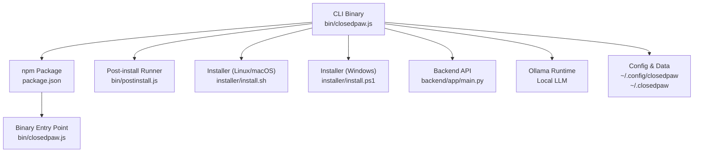
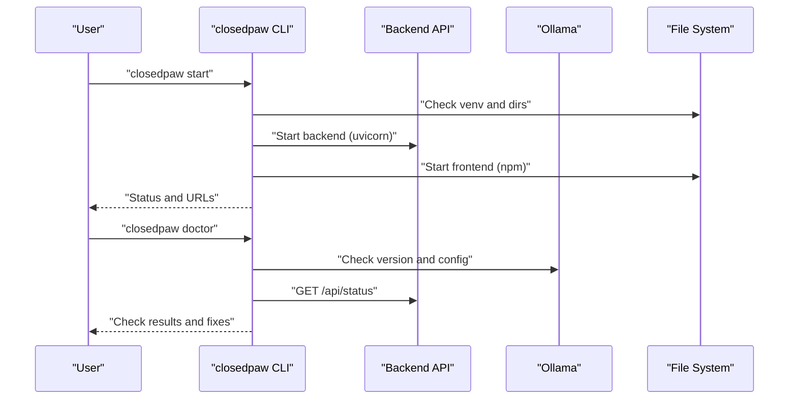
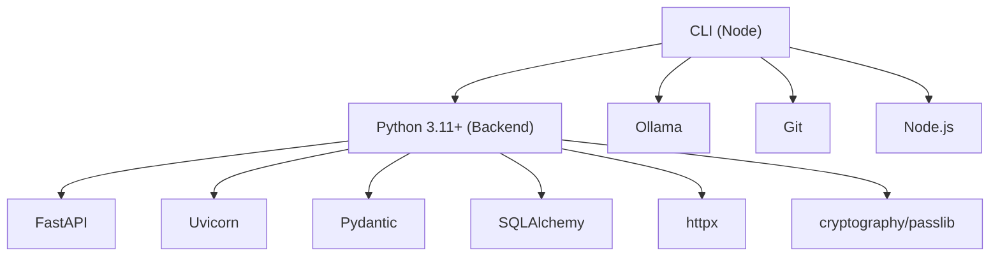

# CLI Reference

<cite>
**Referenced Files in This Document**
- [closedpaw.js](file://bin/closedpaw.js)
- [postinstall.js](file://bin/postinstall.js)
- [install.sh](file://installer/install.sh)
- [install.ps1](file://installer/install.ps1)
- [package.json](file://package.json)
- [README.md](file://README.md)
- [README.ru.md](file://README.ru.md)
- [README.zh.md](file://README.zh.md)
- [requirements.txt](file://backend/requirements.txt)
- [main.py](file://backend/app/main.py)
- [skill.py](file://skills/filesystem/skill.py)
</cite>

## Table of Contents
1. [Introduction](#introduction)
2. [Project Structure](#project-structure)
3. [Core Components](#core-components)
4. [Architecture Overview](#architecture-overview)
5. [Detailed Component Analysis](#detailed-component-analysis)
6. [Dependency Analysis](#dependency-analysis)
7. [Performance Considerations](#performance-considerations)
8. [Troubleshooting Guide](#troubleshooting-guide)
9. [Conclusion](#conclusion)
10. [Appendices](#appendices)

## Introduction
This document provides a comprehensive CLI reference for ClosedPaw, focusing on the command-line interface tool. It covers installation commands, system management functions, configuration utilities, and diagnostic tools. It explains the CLI’s role in installation, configuration, and system administration tasks, including post-installation setup, configuration file management, and system health checks. It also includes troubleshooting guidance for common CLI issues and integration with system services, along with examples of automation scripts and batch operations.

## Project Structure
ClosedPaw’s CLI is distributed as a Node.js package with a primary executable named “closedpaw”. The CLI integrates with system services (Ollama, Node.js, Python) and manages local installation directories. The CLI supports cross-platform installation via npm and platform-specific installers.

**Diagram sources**
- [closedpaw.js](file://bin/closedpaw.js#L1-L911)
- [postinstall.js](file://bin/postinstall.js#L1-L19)
- [install.sh](file://installer/install.sh#L1-L817)
- [install.ps1](file://installer/install.ps1#L1-L571)
- [package.json](file://package.json#L1-L54)
- [main.py](file://backend/app/main.py#L1-L567)

**Section sources**
- [closedpaw.js](file://bin/closedpaw.js#L1-L911)
- [package.json](file://package.json#L1-L54)

## Core Components
- CLI executable: Provides commands for installation, starting/stopping services, status checks, diagnostics, updates, migration, configuration, and chat.
- Post-install runner: Automatically triggers installation after global npm install.
- Platform installers: One-command installers for Linux/macOS and Windows.
- Backend API: Exposes endpoints for chat, model management, actions, providers, channels, and diagnostics.
- Configuration files: Providers and channels configuration stored under the user config directory.

**Section sources**
- [closedpaw.js](file://bin/closedpaw.js#L680-L911)
- [postinstall.js](file://bin/postinstall.js#L1-L19)
- [install.sh](file://installer/install.sh#L1-L817)
- [install.ps1](file://installer/install.ps1#L1-L571)
- [main.py](file://backend/app/main.py#L101-L555)

## Architecture Overview
The CLI orchestrates local services and interacts with the backend API. It ensures prerequisites (Python, Node.js, Ollama) are met, manages installation directories, and exposes commands for system administration and diagnostics.

**Diagram sources**
- [closedpaw.js](file://bin/closedpaw.js#L224-L272)
- [closedpaw.js](file://bin/closedpaw.js#L357-L479)
- [main.py](file://backend/app/main.py#L101-L128)

## Detailed Component Analysis

### CLI Commands and Options
- install
  - Purpose: Install ClosedPaw on the system.
  - Options:
    - -s, --skip-model: Skip model download during installation.
  - Behavior:
    - Checks Python 3.11+ and Ollama presence.
    - Prompts to download a recommended model if Ollama is available.
    - Creates installation and config directories.
    - Clones the repository into the installation directory.
    - Sets up a Python virtual environment and installs backend dependencies.
    - Installs frontend dependencies.
    - Prints success banner with next steps.

- start
  - Purpose: Start ClosedPaw backend and frontend.
  - Behavior:
    - Verifies the virtual environment exists.
    - Starts the backend using uvicorn bound to 127.0.0.1:8000.
    - Starts the frontend development server.
    - Prints status banner with URLs.

- stop
  - Purpose: Stop ClosedPaw processes.
  - Behavior:
    - Terminates uvicorn and Next.js processes based on platform.

- status
  - Purpose: Show installation and runtime status.
  - Behavior:
    - Reports installation presence and locations.
    - Checks Python and Node.js availability.
    - Checks Ollama presence.
    - Queries backend API status endpoint.

- doctor
  - Purpose: Run system diagnostics.
  - Behavior:
    - Performs multiple checks: installation, Python, Node.js, Ollama, virtual environment, frontend dependencies, API server, and config directory.
    - Prints a summary and suggests fixes for failing checks.

- update
  - Purpose: Update ClosedPaw to the latest version.
  - Options:
    - -f, --force: Force update even if already on latest version.
  - Behavior:
    - Updates the CLI globally via npm.
    - If a local git installation exists, pulls latest and updates dependencies.
    - Checks Ollama presence and prints update summary.

- migrate <source>
  - Purpose: Migrate data from other systems.
  - Supported sources: openclaw, securesphere.
  - Behavior:
    - Validates source and checks for data directory.
    - Copies supported files (.json, .md) into the data directory.

- config
  - Purpose: Interactive configuration menu.
  - Subcommands:
    - providers: Configure LLM providers (Ollama, OpenAI, Anthropic, Google, Mistral).
    - channels: Configure communication channels (Telegram, Discord, Slack).
    - exit: Exit configuration.

- bind-telegram <user-id>
  - Purpose: Add a user to the Telegram allowlist.
  - Behavior:
    - Reads channels configuration, adds user ID if not present, and writes back.

- chat [message]
  - Purpose: Send a chat message via CLI.
  - Options:
    - -m, --model <model>: Model to use.
    - -p, --provider <provider>: Provider to use.
  - Behavior:
    - If no message provided, prompts for input.
    - Sends a POST request to the backend chat endpoint.
    - Prints the response or failure message.

**Section sources**
- [closedpaw.js](file://bin/closedpaw.js#L680-L911)
- [main.py](file://backend/app/main.py#L131-L181)

### Post-Install Automation
After installing the npm package globally, the postinstall script automatically invokes the CLI installer to streamline setup.

- Post-install runner:
  - Spawns the CLI installer and forwards process environment.
  - Exits with the same code as the installer.

**Section sources**
- [postinstall.js](file://bin/postinstall.js#L1-L19)
- [package.json](file://package.json#L42-L44)

### Platform Installers
- Linux/macOS installer:
  - Detects OS and distributions.
  - Checks Python 3.11+, Git, and Node.js; installs Node.js if missing.
  - Installs and configures gVisor sandboxing for Linux/macOS.
  - Detects hardware and recommends models via LLM Checker.
  - Installs Ollama with security configuration (localhost binding).
  - Sets up directories, generates encryption key, clones repository, installs dependencies, builds frontend, and creates launcher scripts.

- Windows installer:
  - Detects PowerShell version and environment variables.
  - Checks Python 3.11+, Node.js, Git, and Ollama.
  - Offers sandboxing via WSL2 or Docker Desktop if available.
  - Installs ClosedPaw via npm or Git, sets up directories, and ensures PATH.

**Section sources**
- [install.sh](file://installer/install.sh#L1-L817)
- [install.ps1](file://installer/install.ps1#L1-L571)

### Configuration Utilities
- Providers configuration:
  - Stores provider credentials and defaults in a JSON file under the config directory.
  - Supports Ollama (local) and cloud providers (OpenAI, Anthropic, Google, Mistral).

- Channels configuration:
  - Stores channel settings (e.g., Telegram bot token, allowed users) in a JSON file under the config directory.
  - Provides a quick command to add Telegram users to the allowlist.

**Section sources**
- [closedpaw.js](file://bin/closedpaw.js#L537-L601)
- [closedpaw.js](file://bin/closedpaw.js#L603-L677)
- [closedpaw.js](file://bin/closedpaw.js#L824-L849)

### Diagnostic Tools
- Doctor command:
  - Comprehensive health checks covering installation, Python, Node.js, Ollama, virtual environment, frontend dependencies, API server, and config directory.
  - Summarizes results and prints suggested fixes.

- Status command:
  - Reports installation presence, locations, Python/Node/Ollama status, and backend API status.

**Section sources**
- [closedpaw.js](file://bin/closedpaw.js#L357-L479)
- [closedpaw.js](file://bin/closedpaw.js#L292-L355)

### System Administration Tasks
- Starting and stopping services:
  - Start: Launches backend and frontend with proper environment and ports.
  - Stop: Terminates backend and frontend processes.

- Updating:
  - Updates CLI globally and, if applicable, local installation and dependencies.

- Migration:
  - Migrates memory and settings from compatible systems into the data directory.

**Section sources**
- [closedpaw.js](file://bin/closedpaw.js#L224-L290)
- [closedpaw.js](file://bin/closedpaw.js#L714-L796)
- [closedpaw.js](file://bin/closedpaw.js#L481-L535)

### Backend Integration
- Chat endpoint:
  - Accepts chat requests and returns responses asynchronously, with timeouts and status reporting.

- Status endpoint:
  - Returns system status, Ollama connectivity, available models, and pending actions.

- Provider and channel management:
  - Exposed via backend endpoints for configuration and health checks.

**Section sources**
- [main.py](file://backend/app/main.py#L131-L181)
- [main.py](file://backend/app/main.py#L101-L128)
- [main.py](file://backend/app/main.py#L381-L454)
- [main.py](file://backend/app/main.py#L464-L529)

## Dependency Analysis
- CLI depends on:
  - Node.js runtime and npm ecosystem.
  - Python 3.11+ and a virtual environment for the backend.
  - Ollama for local LLM inference.
  - Git for cloning the repository.
  - Platform-specific services (Docker/gVisor on Linux/macOS; WSL2/Docker Desktop on Windows).

- Backend dependencies:
  - FastAPI, Uvicorn, Pydantic, SQLAlchemy, httpx, cryptography, passlib, pytest, python-dotenv.

**Diagram sources**
- [requirements.txt](file://backend/requirements.txt#L1-L36)
- [install.sh](file://installer/install.sh#L128-L162)
- [install.ps1](file://installer/install.ps1#L62-L177)

**Section sources**
- [requirements.txt](file://backend/requirements.txt#L1-L36)
- [install.sh](file://installer/install.sh#L128-L162)
- [install.ps1](file://installer/install.ps1#L62-L177)

## Performance Considerations
- Model downloads: Large models can take significant time and bandwidth; consider skipping during installation and downloading later.
- Sandbox overhead: gVisor/Kata provides strong isolation but may introduce overhead; use on Linux/macOS for best performance.
- Local vs cloud providers: Local inference avoids network latency but requires sufficient resources; cloud providers may offer faster responses.
- Frontend builds: Production builds are optimized; development mode is intended for local testing.

[No sources needed since this section provides general guidance]

## Troubleshooting Guide
Common issues and resolutions:
- Python 3.11+ not found:
  - Install Python 3.11+ and ensure it is on PATH.
  - Verify with the doctor command.

- Ollama not found or outdated:
  - Install or update Ollama; the installer configures it to listen on localhost.
  - Use the doctor command to verify configuration.

- Ports already in use:
  - Backend runs on 127.0.0.1:8000; frontend on localhost:3000.
  - Stop conflicting services or adjust ports.

- Permissions errors:
  - Ensure write access to installation and config directories.
  - On Linux/macOS, verify sandbox runtime permissions.

- Network connectivity:
  - For cloud providers, ensure API keys are configured and reachable.
  - Use the doctor command to check provider health.

- Frontend dependencies:
  - Reinstall frontend dependencies if builds fail.
  - Use the doctor command to verify frontend dependencies.

**Section sources**
- [closedpaw.js](file://bin/closedpaw.js#L357-L479)
- [install.sh](file://installer/install.sh#L342-L447)
- [install.ps1](file://installer/install.ps1#L314-L334)

## Conclusion
The ClosedPaw CLI provides a unified interface for installation, configuration, administration, and diagnostics across platforms. It integrates tightly with backend services and system prerequisites, enabling secure, local-first AI assistance with hardened sandboxing. Use the commands documented here to manage installations, configure providers and channels, monitor system health, and troubleshoot common issues.

[No sources needed since this section summarizes without analyzing specific files]

## Appendices

### Installation Methods
- npm global install:
  - Install the package globally and run the CLI installer automatically.
- One-command installers:
  - Linux/macOS: curl-based installer.
  - Windows: PowerShell-based installer.
- Manual installation:
  - Clone repository, set up Python virtual environment, install backend and frontend dependencies, then start services.

**Section sources**
- [README.md](file://README.md#L26-L63)
- [README.zh.md](file://README.zh.md#L14-L52)
- [package.json](file://package.json#L27-L29)

### Configuration File Locations
- Providers configuration: ~/.config/closedpaw/providers.json
- Channels configuration: ~/.config/closedpaw/channels.json
- Data directory: ~/.config/closedpaw/data

**Section sources**
- [closedpaw.js](file://bin/closedpaw.js#L23-L26)
- [closedpaw.js](file://bin/closedpaw.js#L549-L616)
- [closedpaw.js](file://bin/closedpaw.js#L827-L849)

### Example Automation Scripts and Batch Operations
- Batch model downloads:
  - Use Ollama CLI to pull models after installation.
- Automated diagnostics:
  - Schedule the doctor command to monitor system health.
- Provider rotation:
  - Use backend endpoints to switch models and manage providers programmatically.

**Section sources**
- [main.py](file://backend/app/main.py#L213-L239)
- [main.py](file://backend/app/main.py#L381-L454)