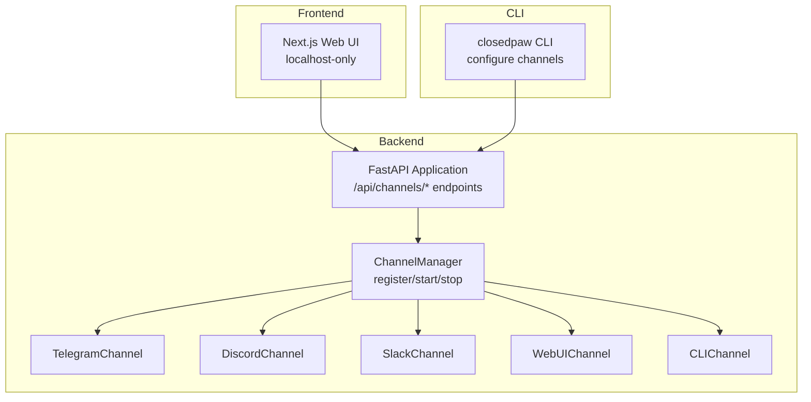
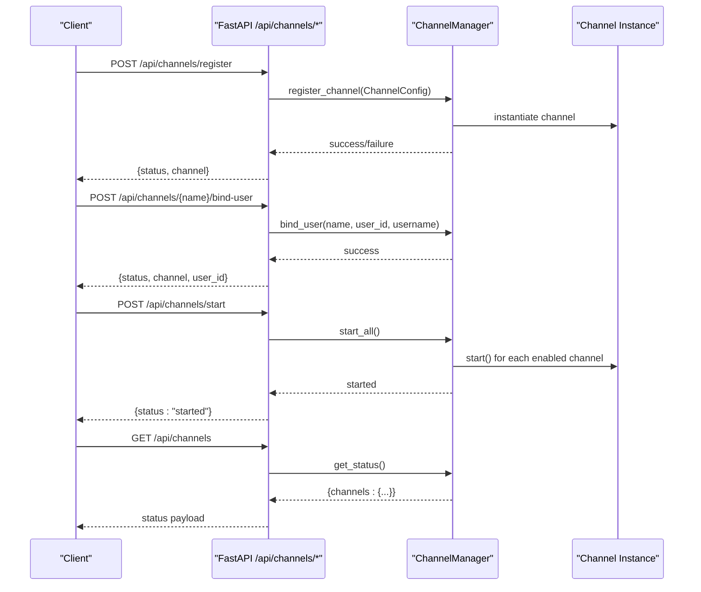
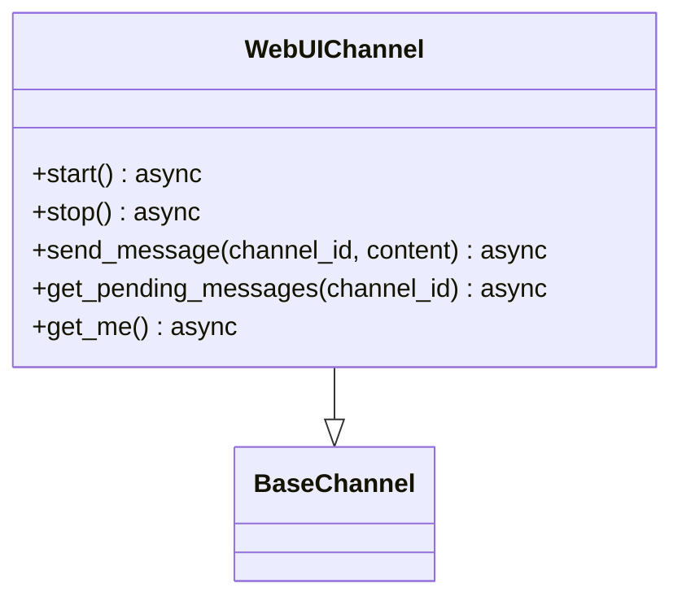
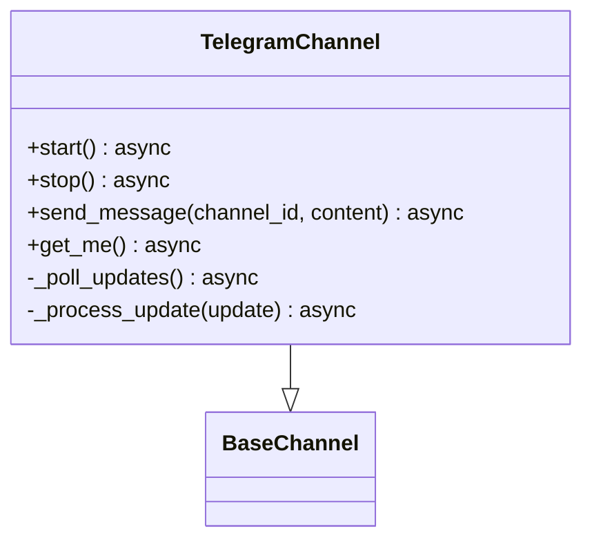
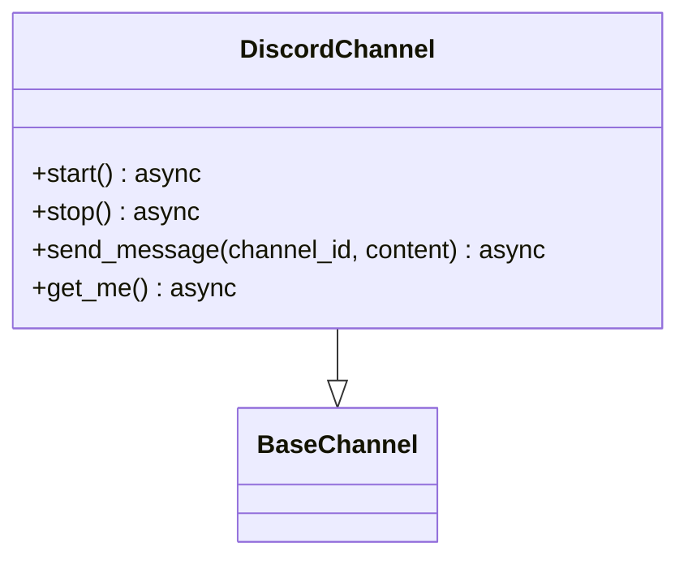
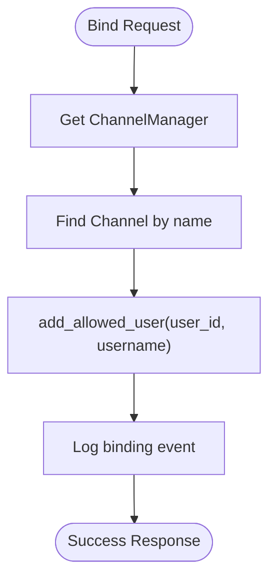
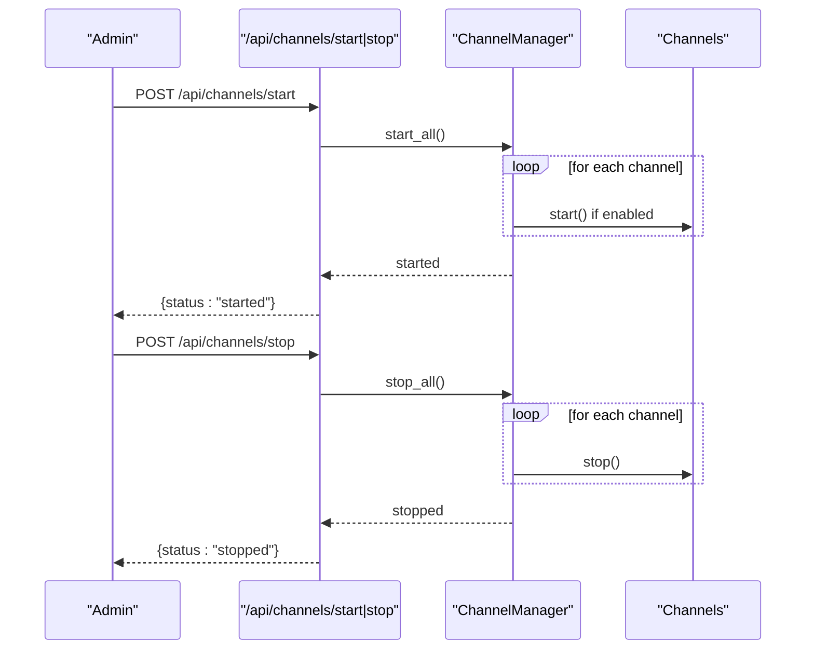
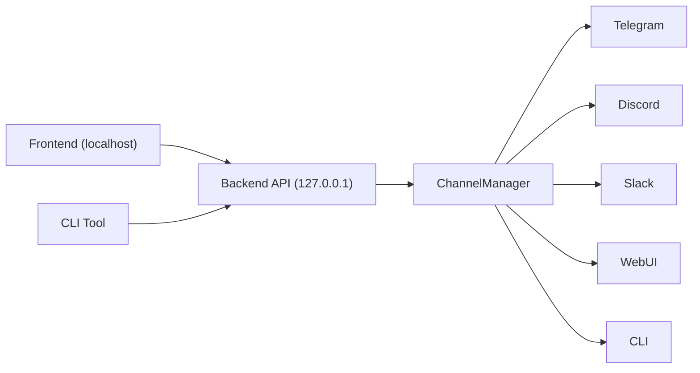

# Channel Configuration

<cite>
**Referenced Files in This Document**
- [channels.py](file://backend/app/core/channels.py)
- [main.py](file://backend/app/main.py)
- [closedpaw.js](file://bin/closedpaw.js)
- [page.tsx](file://frontend/src/app/page.tsx)
- [README.md](file://README.md)
</cite>

## Table of Contents
1. [Introduction](#introduction)
2. [Project Structure](#project-structure)
3. [Core Components](#core-components)
4. [Architecture Overview](#architecture-overview)
5. [Detailed Component Analysis](#detailed-component-analysis)
6. [Dependency Analysis](#dependency-analysis)
7. [Performance Considerations](#performance-considerations)
8. [Troubleshooting Guide](#troubleshooting-guide)
9. [Conclusion](#conclusion)

## Introduction
This document provides comprehensive channel configuration guidance for ClosedPaw's multi-channel communication system. It explains how to register channels, configure each supported channel type, manage users and permissions, and operate channels safely. The system supports Web UI, Telegram, Discord, Slack, Matrix, and CLI channels, with a focus on security and zero-trust operation.

## Project Structure
The channel configuration spans three primary areas:
- Backend API and channel orchestration
- Frontend Web UI for local-only access
- CLI tool for interactive configuration and user binding

**Diagram sources**
- [main.py](file://backend/app/main.py#L464-L529)
- [channels.py](file://backend/app/core/channels.py#L405-L523)
- [page.tsx](file://frontend/src/app/page.tsx#L31-L31)
- [closedpaw.js](file://bin/closedpaw.js#L604-L677)

**Section sources**
- [main.py](file://backend/app/main.py#L72-L87)
- [channels.py](file://backend/app/core/channels.py#L18-L26)
- [README.md](file://README.md#L65-L74)

## Core Components
- ChannelType enumeration defines supported channel categories used during registration and runtime.
- ChannelConfig schema captures channel-level settings including type, name, enablement, tokens, allowed users, and security controls.
- ChannelManager centralizes channel lifecycle, user binding, and status reporting.
- Individual channel implementations encapsulate protocol-specific behavior (Telegram, Discord, Slack, CLI, Web UI).

Key configuration parameters:
- channel_type: One of WEBUI, TELEGRAM, DISCORD, SLACK, MATRIX, CLI
- name: Unique logical name for the channel
- enabled: Whether the channel starts automatically
- bot_token: Protocol token for authenticated APIs
- allowed_users: Whitelist of user identifiers
- allowed_channels: Allowed destination channel IDs for outbound messages
- rate_limit_per_user/rate_limit_global: Built-in throttling
- require_pairing: Authorization requirement
- allowed_commands: Command whitelist for constrained channels

**Section sources**
- [channels.py](file://backend/app/core/channels.py#L18-L65)
- [channels.py](file://backend/app/core/channels.py#L405-L502)

## Architecture Overview
The channel system is API-driven and Web UI–centric:
- Channels are registered via /api/channels/register with a ChannelConfig payload.
- Users are bound to channels via /api/channels/{channel_name}/bind-user.
- Channel lifecycles are controlled via /api/channels/start and /api/channels/stop.
- Status is retrieved via /api/channels.

**Diagram sources**
- [main.py](file://backend/app/main.py#L473-L529)
- [channels.py](file://backend/app/core/channels.py#L416-L502)

## Detailed Component Analysis

### Channel Registration and Lifecycle
- Registration endpoint accepts channel_type, name, optional bot_token, allowed_users, and enabled flag. The backend validates the channel type and constructs a ChannelConfig, then registers it with ChannelManager.
- Start/stop endpoints delegate to ChannelManager to start or stop all enabled channels.
- Status endpoint returns a summary of all registered channels, including type, enablement, and count of allowed users.

Operational notes:
- The Web UI channel is pre-registered as enabled and require_pairing=false.
- Starting a channel without a required token logs a warning; the channel remains registered but inactive.

**Section sources**
- [main.py](file://backend/app/main.py#L473-L529)
- [channels.py](file://backend/app/core/channels.py#L416-L502)
- [channels.py](file://backend/app/core/channels.py#L515-L523)

### Channel Types and Configuration

#### WEB UI Channel
- Purpose: Internal Web UI channel for localhost-only access.
- Behavior: Queues messages for polling; no external token required.
- Security: require_pairing=false by default; CORS restricted to localhost origins.
- Access: Frontend polls backend for pending messages.

**Diagram sources**
- [channels.py](file://backend/app/core/channels.py#L137-L174)

**Section sources**
- [channels.py](file://backend/app/core/channels.py#L137-L174)
- [main.py](file://backend/app/main.py#L80-L87)
- [page.tsx](file://frontend/src/app/page.tsx#L31-L31)

#### Telegram Channel
- Purpose: Receive/send messages via Telegram Bot API.
- Configuration: Requires bot_token; allowed_users list controls who can interact.
- Behavior: Polls updates, validates user authorization, and forwards messages to the system.
- Security: Unauthorized users receive a denial message; rate limiting and command whitelists apply at higher layers.

**Diagram sources**
- [channels.py](file://backend/app/core/channels.py#L177-L286)

**Section sources**
- [channels.py](file://backend/app/core/channels.py#L177-L286)
- [main.py](file://backend/app/main.py#L507-L512)
- [closedpaw.js](file://bin/closedpaw.js#L634-L651)

#### Discord Channel
- Purpose: Receive/send messages via Discord API.
- Configuration: Requires bot_token; channel IDs are used for sending.
- Behavior: Uses Authorization header with "Bot {token}" scheme; logs bot identity on start.

**Diagram sources**
- [channels.py](file://backend/app/core/channels.py#L288-L334)

**Section sources**
- [channels.py](file://backend/app/core/channels.py#L288-L334)
- [closedpaw.js](file://bin/closedpaw.js#L652-L660)

#### Slack Channel
- Purpose: Post messages via Slack API.
- Configuration: Uses Bearer token; requires appropriate scopes.
- Behavior: Sends messages to specified channel IDs.

**Section sources**
- [channels.py](file://backend/app/core/channels.py#L336-L382)
- [closedpaw.js](file://bin/closedpaw.js#L661-L669)

#### CLI Channel
- Purpose: Local terminal interaction for development and testing.
- Behavior: Prints outgoing messages to stdout.

**Section sources**
- [channels.py](file://backend/app/core/channels.py#L384-L403)

### User Binding and Permissions
- Bind endpoint adds a user to a channel’s allowlist and marks them as allowed.
- Authorization checks rely on is_user_allowed(user_id) which consults allowed_users.
- Pairing requirement and command whitelists are enforced at the channel level.

**Diagram sources**
- [main.py](file://backend/app/main.py#L507-L512)
- [channels.py](file://backend/app/core/channels.py#L484-L489)

**Section sources**
- [main.py](file://backend/app/main.py#L507-L512)
- [channels.py](file://backend/app/core/channels.py#L117-L135)

### Channel Lifecycle Management
- Start: Iterates enabled channels and invokes start().
- Stop: Stops all channels.
- Status: Returns channel counts and metadata.

**Diagram sources**
- [main.py](file://backend/app/main.py#L515-L528)
- [channels.py](file://backend/app/core/channels.py#L445-L454)

**Section sources**
- [main.py](file://backend/app/main.py#L515-L528)
- [channels.py](file://backend/app/core/channels.py#L445-L454)

## Dependency Analysis
- The Web UI is restricted to localhost via CORS middleware and frontend base URL.
- The backend runs on 127.0.0.1 by default for local-only operation.
- CLI provides interactive configuration and user binding utilities.

**Diagram sources**
- [main.py](file://backend/app/main.py#L80-L87)
- [main.py](file://backend/app/main.py#L557-L567)
- [page.tsx](file://frontend/src/app/page.tsx#L31-L31)
- [closedpaw.js](file://bin/closedpaw.js#L604-L677)

**Section sources**
- [main.py](file://backend/app/main.py#L80-L87)
- [main.py](file://backend/app/main.py#L557-L567)
- [page.tsx](file://frontend/src/app/page.tsx#L31-L31)
- [README.md](file://README.md#L65-L74)

## Performance Considerations
- Rate limiting: ChannelConfig exposes per-user and global rate limits to prevent abuse.
- Polling vs. webhooks: Telegram uses polling; Discord/Slack use push-style APIs where applicable.
- Broadcasting: ChannelManager supports targeted broadcasts to enabled channels.

Recommendations:
- Tune rate_limit_per_user and rate_limit_global based on expected traffic.
- Prefer explicit allowed_channels for outbound routing to reduce unnecessary fan-out.

**Section sources**
- [channels.py](file://backend/app/core/channels.py#L56-L58)
- [channels.py](file://backend/app/core/channels.py#L470-L482)

## Troubleshooting Guide

Common issues and resolutions:
- Channel not starting due to missing token
  - Symptom: Warning logged; channel remains registered but inactive.
  - Resolution: Provide a valid bot_token during registration or via configuration.
  - Section sources
    - [channels.py](file://backend/app/core/channels.py#L186-L198)
    - [channels.py](file://backend/app/core/channels.py#L296-L298)
    - [channels.py](file://backend/app/core/channels.py#L344-L346)

- Unauthorized user messages
  - Symptom: User receives denial and no further processing occurs.
  - Resolution: Bind the user via /api/channels/{channel_name}/bind-user or add to allowed_users.
  - Section sources
    - [channels.py](file://backend/app/core/channels.py#L240-L242)
    - [main.py](file://backend/app/main.py#L507-L512)

- Web UI not receiving messages
  - Symptom: No messages appear in the UI.
  - Resolution: Ensure Web UI channel is enabled and messages are queued; confirm frontend polling to 127.0.0.1.
  - Section sources
    - [channels.py](file://backend/app/core/channels.py#L144-L167)
    - [page.tsx](file://frontend/src/app/page.tsx#L31-L31)

- Localhost-only access restrictions
  - Symptom: Frontend cannot reach backend.
  - Resolution: Confirm backend is running on 127.0.0.1 and CORS allows localhost origin.
  - Section sources
    - [main.py](file://backend/app/main.py#L80-L87)
    - [main.py](file://backend/app/main.py#L557-L567)

- CLI configuration and user binding
  - Use the CLI to configure channels and bind Telegram users interactively.
  - Section sources
    - [closedpaw.js](file://bin/closedpaw.js#L604-L677)
    - [closedpaw.js](file://bin/closedpaw.js#L825-L849)

## Conclusion
ClosedPaw’s channel system provides a secure, API-driven foundation for multi-channel communication. By registering channels with appropriate tokens and permissions, binding authorized users, and managing lifecycles via dedicated endpoints, administrators can operate a robust, zero-trust communication gateway. The Web UI remains localhost-only, and CLI tools streamline configuration and user management.