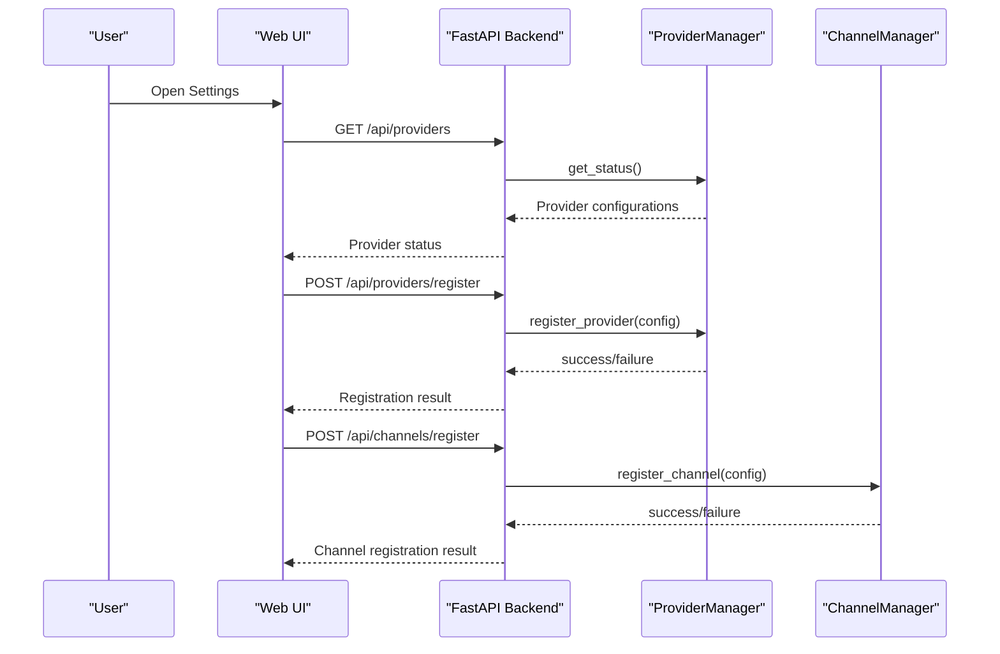
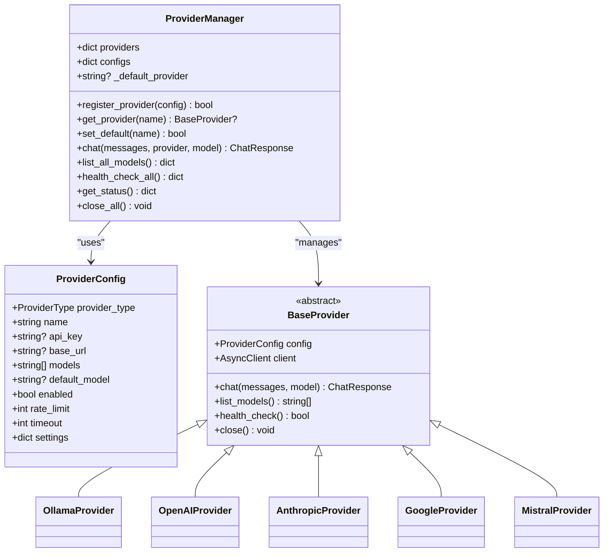
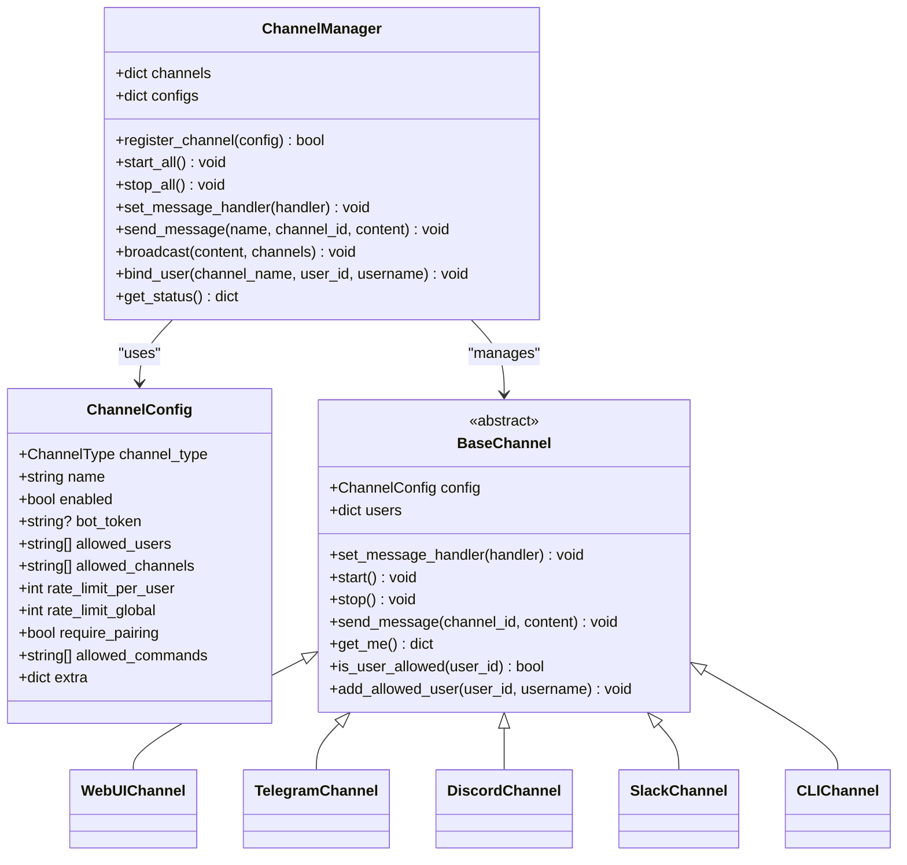
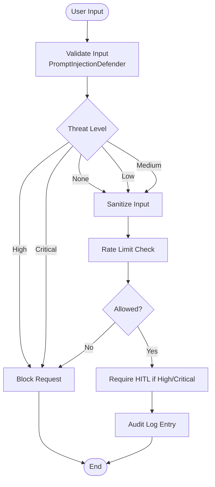
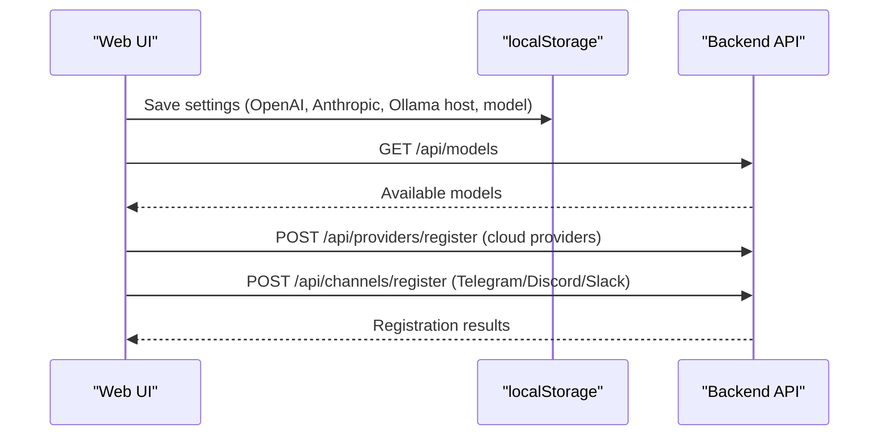
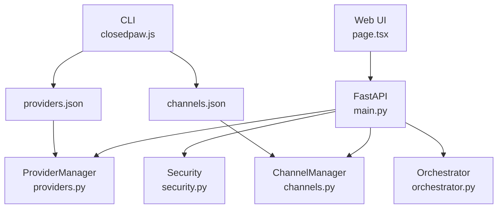

# Configuration Management

<cite>
**Referenced Files in This Document**
- [main.py](file://backend/app/main.py)
- [providers.py](file://backend/app/core/providers.py)
- [channels.py](file://backend/app/core/channels.py)
- [security.py](file://backend/app/core/security.py)
- [agent_manager.py](file://backend/app/core/agent_manager.py)
- [orchestrator.py](file://backend/app/core/orchestrator.py)
- [page.tsx](file://frontend/src/app/page.tsx)
- [layout.tsx](file://frontend/src/app/layout.tsx)
- [package.json](file://frontend/package.json)
- [closedpaw.js](file://bin/closedpaw.js)
- [requirements.txt](file://backend/requirements.txt)
- [README.md](file://README.md)
</cite>

## Table of Contents
1. [Introduction](#introduction)
2. [Project Structure](#project-structure)
3. [Core Components](#core-components)
4. [Architecture Overview](#architecture-overview)
5. [Detailed Component Analysis](#detailed-component-analysis)
6. [Dependency Analysis](#dependency-analysis)
7. [Performance Considerations](#performance-considerations)
8. [Troubleshooting Guide](#troubleshooting-guide)
9. [Conclusion](#conclusion)
10. [Appendices](#appendices)

## Introduction
This document provides comprehensive configuration management guidance for ClosedPaw, focusing on environment configuration, provider settings, channel configuration, and security policies. It explains the configuration system architecture, environment variable handling, and configuration file management. It documents provider configuration for local Ollama and cloud providers (including API key management, model selection, and connection settings), channel configuration for web UI, Telegram, Discord, and CLI interfaces (including user authorization and permission settings), and security policy configuration, audit logging settings, and encryption parameters. It also includes configuration templates, validation rules, troubleshooting guidance, and the relationship between frontend and backend configuration settings.

## Project Structure
ClosedPaw consists of:
- Backend (Python/FastAPI) with core components for providers, channels, security, and orchestration
- Frontend (Next.js) with a web UI that communicates with the backend API
- CLI (Node.js) for installation, configuration, and system management
- Skills subsystem for sandboxed operations

```mermaid
graph TB
subgraph "Backend"
API["FastAPI Application<br/>main.py"]
Prov["Providers<br/>providers.py"]
Chan["Channels<br/>channels.py"]
Sec["Security<br/>security.py"]
Orch["Orchestrator<br/>orchestrator.py"]
Agent["Agent Manager<br/>agent_manager.py"]
end
subgraph "Frontend"
UI["Web UI<br/>page.tsx"]
Layout["App Layout<br/>layout.tsx"]
end
subgraph "CLI"
CLI["ClosedPaw CLI<br/>closedpaw.js"]
end
UI --> API
API --> Prov
API --> Chan
API --> Sec
API --> Orch
Orch --> Agent
CLI --> API
```

**Diagram sources**
- [main.py](file://backend/app/main.py#L73-L87)
- [providers.py](file://backend/app/core/providers.py#L418-L524)
- [channels.py](file://backend/app/core/channels.py#L405-L503)
- [security.py](file://backend/app/core/security.py#L437-L455)
- [agent_manager.py](file://backend/app/core/agent_manager.py#L699-L708)
- [page.tsx](file://frontend/src/app/page.tsx#L27-L28)
- [closedpaw.js](file://bin/closedpaw.js#L23-L33)

**Section sources**
- [README.md](file://README.md#L75-L96)
- [main.py](file://backend/app/main.py#L73-L87)
- [page.tsx](file://frontend/src/app/page.tsx#L27-L28)
- [closedpaw.js](file://bin/closedpaw.js#L23-L33)

## Core Components
- Provider Management: Registers and manages multiple LLM providers (local Ollama and cloud APIs), handles model discovery, health checks, and chat routing.
- Channel Management: Supports multiple communication channels (Web UI, Telegram, Discord, Slack, CLI), with user authorization, rate limiting, and message routing.
- Security Module: Provides prompt injection defense, rate limiting, and encrypted data vault for secrets.
- Orchestrator: Central component coordinating actions, HITL approvals, audit logging, and system status.
- Agent Manager: Manages sandboxed skill execution with gVisor/Kata containers.
- Frontend Configuration: Web UI configuration for models, API keys, network settings, and storage encryption status.
- CLI Configuration: System-wide configuration for providers and channels, stored in user config directories.

**Section sources**
- [providers.py](file://backend/app/core/providers.py#L418-L524)
- [channels.py](file://backend/app/core/channels.py#L405-L503)
- [security.py](file://backend/app/core/security.py#L437-L455)
- [orchestrator.py](file://backend/app/core/orchestrator.py#L87-L451)
- [agent_manager.py](file://backend/app/core/agent_manager.py#L65-L148)
- [page.tsx](file://frontend/src/app/page.tsx#L67-L71)
- [closedpaw.js](file://bin/closedpaw.js#L23-L33)

## Architecture Overview
The configuration system spans three layers:
- Environment Layer: Runtime configuration via environment variables and system settings
- Backend Layer: Provider and channel configuration managed through FastAPI endpoints and internal managers
- Frontend Layer: User-facing configuration in the web UI with persistent settings



**Diagram sources**
- [main.py](file://backend/app/main.py#L383-L435)
- [main.py](file://backend/app/main.py#L473-L504)
- [providers.py](file://backend/app/core/providers.py#L429-L456)
- [channels.py](file://backend/app/core/channels.py#L416-L443)

## Detailed Component Analysis

### Environment Configuration and System Settings
- Backend runtime configuration:
  - CORS middleware allows only localhost origins for security
  - Application runs on 127.0.0.1:8000 by default
  - Health checks probe Ollama on 127.0.0.1:11434
- Frontend runtime configuration:
  - Next.js dev server binds to 127.0.0.1:3000
  - Web UI API base URL points to backend at 127.0.0.1:8000
- CLI configuration:
  - Stores configuration in ~/.config/closedpaw
  - Creates ~/.closedpaw for installation artifacts
  - Generates providers.json and channels.json for runtime configuration

**Section sources**
- [main.py](file://backend/app/main.py#L80-L87)
- [main.py](file://backend/app/main.py#L101-L128)
- [page.tsx](file://frontend/src/app/page.tsx#L27-L28)
- [package.json](file://frontend/package.json#L7-L10)
- [closedpaw.js](file://bin/closedpaw.js#L23-L33)

### Provider Configuration
Provider configuration supports:
- Local Ollama: Host binding, default model selection
- Cloud providers: API key management, default model selection, base URL customization
- Provider management endpoints:
  - GET /api/providers: List provider status
  - GET /api/providers/{provider_name}/models: List provider models
  - POST /api/providers/register: Register new provider
  - POST /api/providers/{provider_name}/default: Set default provider
  - GET /api/providers/health: Health check all providers
  - GET /api/providers/models: List models from all providers



**Diagram sources**
- [providers.py](file://backend/app/core/providers.py#L30-L66)
- [providers.py](file://backend/app/core/providers.py#L418-L524)
- [providers.py](file://backend/app/core/providers.py#L68-L100)

**Section sources**
- [providers.py](file://backend/app/core/providers.py#L30-L66)
- [providers.py](file://backend/app/core/providers.py#L418-L524)
- [main.py](file://backend/app/main.py#L383-L462)

### Channel Configuration
Channel configuration supports:
- Web UI: Internal channel with message queuing for polling
- Telegram: Bot token, user allowlisting, message polling
- Discord: Bot token, message sending
- Slack: Bot token, message posting
- CLI: Console output for terminal interaction
- Channel management endpoints:
  - GET /api/channels: List channel status
  - POST /api/channels/register: Register new channel
  - POST /api/channels/{channel_name}/bind-user: Bind user to allowlist
  - POST /api/channels/start: Start all channels
  - POST /api/channels/stop: Stop all channels



**Diagram sources**
- [channels.py](file://backend/app/core/channels.py#L42-L65)
- [channels.py](file://backend/app/core/channels.py#L405-L503)
- [channels.py](file://backend/app/core/channels.py#L79-L116)

**Section sources**
- [channels.py](file://backend/app/core/channels.py#L42-L65)
- [channels.py](file://backend/app/core/channels.py#L405-L503)
- [main.py](file://backend/app/main.py#L464-L529)

### Security Policy Configuration
Security configuration includes:
- Prompt injection defense with threat detection and input sanitization
- Rate limiting for security controls
- Encrypted data vault for API keys and secrets
- Audit logging for all actions
- Zero-trust architecture with Human-in-the-Loop (HITL) approvals



**Diagram sources**
- [security.py](file://backend/app/core/security.py#L116-L180)
- [security.py](file://backend/app/core/security.py#L290-L317)
- [orchestrator.py](file://backend/app/core/orchestrator.py#L429-L449)

**Section sources**
- [security.py](file://backend/app/core/security.py#L35-L287)
- [security.py](file://backend/app/core/security.py#L290-L317)
- [security.py](file://backend/app/core/security.py#L325-L413)
- [orchestrator.py](file://backend/app/core/orchestrator.py#L59-L85)

### Frontend Configuration Settings
The web UI exposes configuration tabs:
- Models: Select active model, list available models
- API Keys: Store OpenAI and Anthropic keys (encrypted locally)
- Network: Configure Ollama host (bound to localhost)
- Storage: Show Data Vault location and encryption status



**Diagram sources**
- [page.tsx](file://frontend/src/app/page.tsx#L197-L206)
- [page.tsx](file://frontend/src/app/page.tsx#L98-L105)
- [page.tsx](file://frontend/src/app/page.tsx#L514-L542)
- [page.tsx](file://frontend/src/app/page.tsx#L546-L566)
- [page.tsx](file://frontend/src/app/page.tsx#L568-L579)

**Section sources**
- [page.tsx](file://frontend/src/app/page.tsx#L67-L71)
- [page.tsx](file://frontend/src/app/page.tsx#L197-L206)
- [page.tsx](file://frontend/src/app/page.tsx#L514-L542)
- [page.tsx](file://frontend/src/app/page.tsx#L546-L566)
- [page.tsx](file://frontend/src/app/page.tsx#L568-L579)

### CLI Configuration Management
The CLI manages system-wide configuration:
- Creates ~/.config/closedpaw and ~/.closedpaw directories
- Generates providers.json and channels.json
- Interactive configuration for providers and channels
- Migration and doctor checks for system diagnostics

**Section sources**
- [closedpaw.js](file://bin/closedpaw.js#L23-L33)
- [closedpaw.js](file://bin/closedpaw.js#L537-L601)
- [closedpaw.js](file://bin/closedpaw.js#L603-L677)
- [closedpaw.js](file://bin/closedpaw.js#L438-L486)

## Dependency Analysis
The configuration system integrates multiple components with clear boundaries:
- Frontend depends on backend API endpoints for configuration and runtime data
- Backend orchestrates provider and channel managers
- Security module provides shared defensive mechanisms
- CLI manages persistent configuration files



**Diagram sources**
- [page.tsx](file://frontend/src/app/page.tsx#L27-L28)
- [main.py](file://backend/app/main.py#L383-L462)
- [providers.py](file://backend/app/core/providers.py#L418-L524)
- [channels.py](file://backend/app/core/channels.py#L405-L503)
- [security.py](file://backend/app/core/security.py#L437-L455)
- [orchestrator.py](file://backend/app/core/orchestrator.py#L87-L148)
- [closedpaw.js](file://bin/closedpaw.js#L537-L601)
- [closedpaw.js](file://bin/closedpaw.js#L603-L677)

**Section sources**
- [requirements.txt](file://backend/requirements.txt#L1-L36)
- [README.md](file://README.md#L98-L104)

## Performance Considerations
- Provider health checks use short timeouts to avoid blocking
- Rate limiting prevents abuse and protects downstream providers
- Frontend polls backend for pending actions at intervals
- Sandbox initialization and container operations are asynchronous to maintain responsiveness

## Troubleshooting Guide
Common configuration issues and resolutions:
- Ollama connectivity failures:
  - Verify Ollama is running on 127.0.0.1:11434
  - Check system status endpoint for connection status
- Provider registration errors:
  - Ensure API keys are valid for cloud providers
  - Confirm base URLs and model names are correct
- Channel authorization problems:
  - Add user IDs to allowed_users lists
  - Verify bot tokens for Telegram/Discord/Slack
- Audit logging issues:
  - Check temporary directory permissions for audit log file
  - Review security module logs for threat detection events
- Encryption and storage:
  - Data vault uses Fernet encryption; keys are generated if not provided
  - Verify configuration directory permissions

**Section sources**
- [main.py](file://backend/app/main.py#L101-L128)
- [main.py](file://backend/app/main.py#L383-L435)
- [main.py](file://backend/app/main.py#L473-L504)
- [security.py](file://backend/app/core/security.py#L325-L413)
- [orchestrator.py](file://backend/app/core/orchestrator.py#L18-L28)

## Conclusion
ClosedPaw provides a robust, zero-trust configuration management system spanning environment settings, provider configuration, channel management, and comprehensive security policies. The backend exposes REST endpoints for dynamic configuration, while the frontend offers user-friendly configuration interfaces. The CLI manages persistent configuration files in user directories. Together, these components ensure secure, auditable, and flexible deployment across local and cloud environments.

## Appendices

### Configuration Templates
- Provider configuration template:
  - Local Ollama: host, enabled, default_model
  - Cloud providers: api_key, default_model, base_url, enabled
- Channel configuration template:
  - Web UI: enabled, require_pairing=false
  - Telegram/Discord/Slack: bot_token, allowed_users, enabled
- Frontend settings template:
  - OpenAI API key (encrypted)
  - Anthropic API key (encrypted)
  - Ollama host (localhost)
  - Selected model

**Section sources**
- [closedpaw.js](file://bin/closedpaw.js#L537-L601)
- [closedpaw.js](file://bin/closedpaw.js#L603-L677)
- [page.tsx](file://frontend/src/app/page.tsx#L514-L542)
- [page.tsx](file://frontend/src/app/page.tsx#L546-L566)

### Validation Rules
- Provider type must be valid (ollama/openai/anthropic/google/mistral/custom)
- Channel type must be valid (webui/telegram/discord/slack/cli)
- API keys are required for cloud providers
- Model names must be valid for selected provider
- User IDs must be numeric for Telegram allowlists
- Ollama host must be reachable on localhost

**Section sources**
- [providers.py](file://backend/app/core/providers.py#L20-L28)
- [channels.py](file://backend/app/core/channels.py#L18-L26)
- [main.py](file://backend/app/main.py#L404-L417)
- [main.py](file://backend/app/main.py#L484-L487)