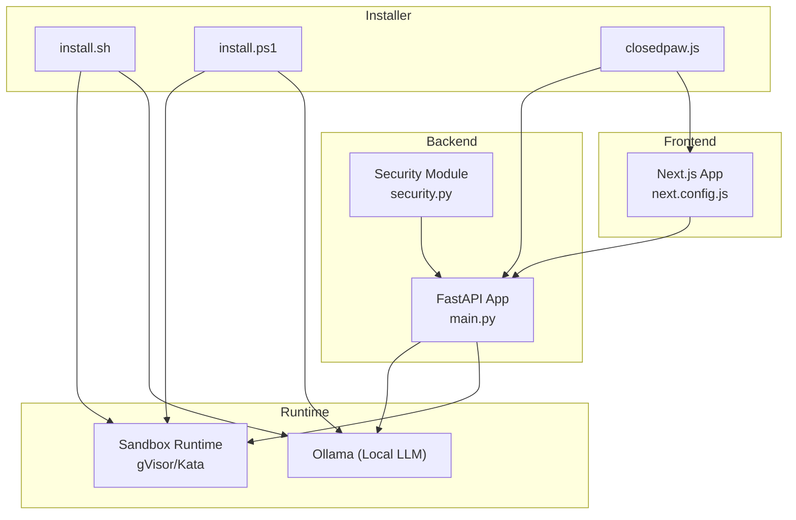
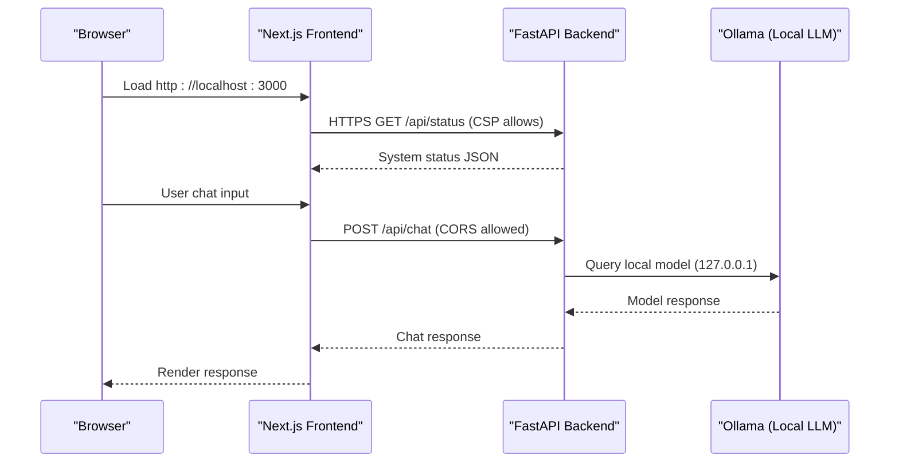
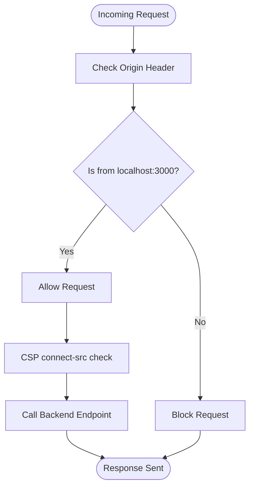
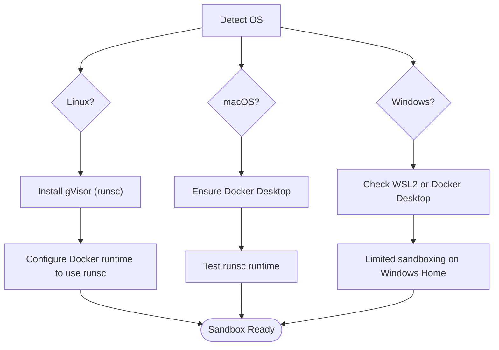
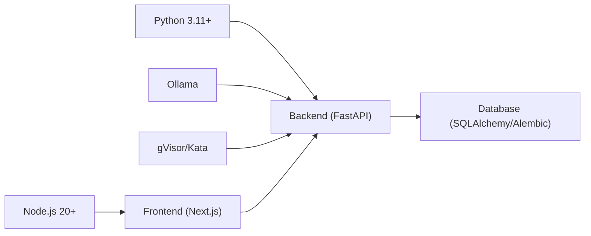

# Environment Configuration

<cite>
**Referenced Files in This Document**
- [README.md](file://README.md)
- [requirements.txt](file://backend/requirements.txt)
- [package.json (backend)](file://backend/package.json)
- [package.json (frontend)](file://frontend/package.json)
- [next.config.js](file://frontend/next.config.js)
- [main.py](file://backend/app/main.py)
- [security.py](file://backend/app/core/security.py)
- [install.sh](file://installer/install.sh)
- [install.ps1](file://installer/install.ps1)
- [closedpaw.js](file://bin/closedpaw.js)
- [postinstall.js](file://bin/postinstall.js)
</cite>

## Table of Contents
1. [Introduction](#introduction)
2. [Project Structure](#project-structure)
3. [Core Components](#core-components)
4. [Architecture Overview](#architecture-overview)
5. [Detailed Component Analysis](#detailed-component-analysis)
6. [Dependency Analysis](#dependency-analysis)
7. [Performance Considerations](#performance-considerations)
8. [Troubleshooting Guide](#troubleshooting-guide)
9. [Conclusion](#conclusion)
10. [Appendices](#appendices)

## Introduction
This document provides comprehensive environment configuration guidance for ClosedPaw. It covers system requirements, environment variables, dependency management, security hardening, CORS configuration, database connectivity, sandbox runtime requirements, and deployment options for Docker and systemd. It also includes practical examples and troubleshooting advice to help you deploy ClosedPaw securely and reliably.

## Project Structure
ClosedPaw consists of:
- Backend: Python FastAPI application with security modules and orchestration
- Frontend: Next.js web UI with strict security headers and localhost-only access
- Installer scripts: Cross-platform setup for sandboxing, Ollama, and runtime dependencies
- CLI: Node.js launcher for installation, startup, and diagnostics

**Diagram sources**
- [main.py](file://backend/app/main.py#L72-L87)
- [security.py](file://backend/app/core/security.py#L35-L287)
- [next.config.js](file://frontend/next.config.js#L1-L42)
- [install.sh](file://installer/install.sh#L191-L270)
- [install.ps1](file://installer/install.ps1#L215-L341)
- [closedpaw.js](file://bin/closedpaw.js#L224-L272)

**Section sources**
- [README.md](file://README.md#L165-L170)
- [main.py](file://backend/app/main.py#L72-L87)
- [next.config.js](file://frontend/next.config.js#L1-L42)
- [install.sh](file://installer/install.sh#L191-L270)
- [install.ps1](file://installer/install.ps1#L215-L341)
- [closedpaw.js](file://bin/closedpaw.js#L224-L272)

## Core Components
- System requirements
  - Python 3.11+ for backend
  - Node.js 20+ for frontend development and tooling (engine requirement is 18+; 20+ recommended)
  - Ollama for local LLM inference
  - Sandbox runtime (gVisor/Kata) for hardened execution
- Dependency management
  - Backend: requirements.txt pins FastAPI, Uvicorn, Pydantic, SQLAlchemy, cryptography, httpx, pytest, python-dotenv
  - Frontend: package.json defines Next.js, React, axios, and related UI libraries
- Security configuration
  - Backend CORS restricted to localhost origins
  - Frontend CSP restricts connections to localhost API
  - Installer secures Ollama to listen on 127.0.0.1
  - Security module defends against prompt injection and rate limits
- Deployment helpers
  - Installer automates sandbox, Ollama, and runtime setup
  - CLI starts backend and frontend locally
  - Post-install hook triggers automatic installation on global npm install

**Section sources**
- [README.md](file://README.md#L165-L170)
- [requirements.txt](file://backend/requirements.txt#L1-L36)
- [package.json (frontend)](file://frontend/package.json#L1-L38)
- [main.py](file://backend/app/main.py#L80-L87)
- [next.config.js](file://frontend/next.config.js#L22-L24)
- [install.sh](file://installer/install.sh#L407-L453)
- [install.ps1](file://installer/install.ps1#L321-L341)
- [security.py](file://backend/app/core/security.py#L35-L287)
- [postinstall.js](file://bin/postinstall.js#L10-L18)

## Architecture Overview
The environment configuration enforces zero-trust boundaries:
- Backend API binds to 127.0.0.1 and allows only localhost origins
- Frontend enforces CSP and restricts outbound connections to the backend
- Installer secures Ollama to localhost-only access
- Sandbox runtime isolates execution

**Diagram sources**
- [main.py](file://backend/app/main.py#L80-L87)
- [next.config.js](file://frontend/next.config.js#L22-L24)
- [install.sh](file://installer/install.sh#L407-L453)
- [install.ps1](file://installer/install.ps1#L321-L341)

## Detailed Component Analysis

### System Requirements and Prerequisites
- Python 3.11+ is required for the backend
- Node.js 20+ recommended for frontend development; engine requirement is 18+
- Ollama is required for local LLM inference
- Sandbox runtime (gVisor/Kata) is recommended for hardened execution

These requirements are enforced by installer scripts and documented in the project README.

**Section sources**
- [README.md](file://README.md#L165-L170)
- [install.sh](file://installer/install.sh#L18-L145)
- [install.ps1](file://installer/install.ps1#L62-L120)

### Dependency Management
- Backend dependencies are pinned in requirements.txt, covering:
  - Web framework (FastAPI, Uvicorn)
  - Data validation (Pydantic, Pydantic AI)
  - HTTP client (httpx)
  - Database (SQLAlchemy, Alembic)
  - Security (cryptography, PyNaCl, python-jose, passlib)
  - Async support (anyio)
  - Testing (pytest, pytest-asyncio)
  - Development (python-dotenv)
- Frontend dependencies are defined in package.json, including Next.js, React, axios, and UI libraries

**Section sources**
- [requirements.txt](file://backend/requirements.txt#L1-L36)
- [package.json (frontend)](file://frontend/package.json#L12-L29)

### Environment Variables and Security Settings
- Ollama host binding
  - Installer configures Ollama to listen on 127.0.0.1:11434 on both Linux and macOS
  - Windows sets environment variables for Ollama host and origins
- Frontend CSP and localhost-only access
  - Content-Security-Policy restricts connect-src to the backend API
  - X-Frame-Options, X-Content-Type-Options, Referrer-Policy enhance security
- Backend CORS policy
  - Only localhost origins are permitted for cross-origin requests
- Data encryption
  - Installer generates an encryption key for storing sensitive data
  - Security module provides a data vault with encryption and access logging

**Section sources**
- [install.sh](file://installer/install.sh#L407-L453)
- [install.ps1](file://installer/install.ps1#L321-L341)
- [next.config.js](file://frontend/next.config.js#L22-L24)
- [main.py](file://backend/app/main.py#L80-L87)
- [security.py](file://backend/app/core/security.py#L325-L435)

### CORS Configuration for Localhost-Only Access
- Backend CORS is configured to allow only http://localhost:3000 and http://127.0.0.1:3000
- Frontend CSP connect-src explicitly permits connections to the backend API

**Diagram sources**
- [main.py](file://backend/app/main.py#L80-L87)
- [next.config.js](file://frontend/next.config.js#L22-L24)

**Section sources**
- [main.py](file://backend/app/main.py#L80-L87)
- [next.config.js](file://frontend/next.config.js#L22-L24)

### Database Connection Settings
- SQLAlchemy and Alembic are included for database operations
- No explicit database connection string is present in the backend entrypoint
- Use environment variables or configuration files to define database URLs and credentials
- Example environment variables to consider:
  - DATABASE_URL
  - DB_ECHO (for SQLAlchemy echo)
  - DB_POOL_SIZE, DB_MAX_OVERFLOW

Note: Define and load these variables using your preferred method (dotenv, system environment, or deployment secrets).

**Section sources**
- [requirements.txt](file://backend/requirements.txt#L17-L20)

### Sandbox Runtime Requirements (gVisor/Kata Containers)
- Installer configures gVisor as the sandbox runtime on Linux/macOS
- On Linux, gVisor is installed and Docker is configured to use runsc as the runtime
- On macOS, installer configures Docker Desktop with gVisor runtime
- Windows supports WSL2 or Docker Desktop for container isolation (full gVisor/Kata requires Linux)

**Diagram sources**
- [install.sh](file://installer/install.sh#L191-L270)
- [install.ps1](file://installer/install.ps1#L215-L319)

**Section sources**
- [install.sh](file://installer/install.sh#L191-L270)
- [install.ps1](file://installer/install.ps1#L215-L319)

### Docker Deployment Configuration
- Use the sandbox configuration created by the installer as a baseline
- For Docker Desktop on macOS/Linux, ensure the Docker daemon is configured to use the gVisor runtime
- Build and run containers with appropriate network policies to maintain localhost-only access
- Mount persistent volumes for configuration and data directories

[No sources needed since this section provides general guidance]

### systemd Service Configuration
- The installer creates a launcher script that starts Ollama, backend, and frontend
- To run as a systemd service:
  - Create a service unit that invokes the launcher script
  - Set user/group to a dedicated service account
  - Configure working directory to the installation path
  - Enable automatic startup and logging

[No sources needed since this section provides general guidance]

### Production Deployment Recommendations
- Bind backend to 127.0.0.1 and expose via reverse proxy (nginx/caddy) with TLS termination
- Enforce strict firewall rules allowing only loopback traffic to backend ports
- Store secrets (API keys, encryption keys) in secure secret stores or environment variables
- Monitor audit logs and set up alerts for security events
- Keep Ollama, sandbox runtime, and application dependencies updated

[No sources needed since this section provides general guidance]

### Environment Variable Templates
- Backend (example keys)
  - DATABASE_URL
  - DB_ECHO
  - DB_POOL_SIZE
  - DB_MAX_OVERFLOW
  - OPENAI_API_KEY
  - ANTHROPIC_API_KEY
  - GOOGLE_API_KEY
  - DISCORD_BOT_TOKEN
  - TELEGRAM_BOT_TOKEN
- Frontend (example keys)
  - NEXT_PUBLIC_BACKEND_BASE_URL=http://127.0.0.1:8000
- Sandbox
  - SANDBOX_RUNTIME=gvisor
  - OLLAMA_HOST=127.0.0.1:11434
  - OLLAMA_ORIGINS=*

[No sources needed since this section provides general guidance]

### Security Hardening Configurations
- Ollama hardening
  - Installer sets Ollama to listen on 127.0.0.1 and configures origins
- Frontend hardening
  - CSP restricts connections to backend
  - X-Frame-Options, X-Content-Type-Options, Referrer-Policy applied
- Backend hardening
  - CORS restricted to localhost
  - Security module validates inputs and sanitizes prompts
  - Data vault encrypts sensitive information

**Section sources**
- [install.sh](file://installer/install.sh#L407-L453)
- [install.ps1](file://installer/install.ps1#L321-L341)
- [next.config.js](file://frontend/next.config.js#L22-L24)
- [main.py](file://backend/app/main.py#L80-L87)
- [security.py](file://backend/app/core/security.py#L325-L435)

### Troubleshooting Common Environment Setup Issues
- Python 3.11+ not found
  - Use installer to check and install Python
- Node.js 20+ not found
  - Installer checks and installs Node.js 18+ (20+ recommended)
- Ollama not accessible
  - Installer secures Ollama to 127.0.0.1; verify environment variables
- Sandbox runtime not available
  - On Linux/macOS, ensure gVisor is installed and Docker configured
  - On Windows, install WSL2 or Docker Desktop for container isolation
- Frontend CSP errors
  - Ensure NEXT_PUBLIC_BACKEND_BASE_URL points to localhost API
- Backend CORS errors
  - Verify frontend origin matches allowed localhost origins

**Section sources**
- [install.sh](file://installer/install.sh#L128-L162)
- [install.ps1](file://installer/install.ps1#L122-L177)
- [install.sh](file://installer/install.sh#L407-L453)
- [install.ps1](file://installer/install.ps1#L321-L341)
- [next.config.js](file://frontend/next.config.js#L22-L24)
- [main.py](file://backend/app/main.py#L80-L87)

## Dependency Analysis
The environment configuration ties together runtime, sandbox, and application components.

**Diagram sources**
- [requirements.txt](file://backend/requirements.txt#L17-L20)
- [README.md](file://README.md#L165-L170)
- [main.py](file://backend/app/main.py#L72-L87)

**Section sources**
- [requirements.txt](file://backend/requirements.txt#L1-L36)
- [README.md](file://README.md#L165-L170)
- [main.py](file://backend/app/main.py#L72-L87)

## Performance Considerations
- Prefer local LLM inference via Ollama on 127.0.0.1 to minimize latency
- Use sandbox runtime judiciously; container overhead may impact performance
- Optimize database pool settings for concurrent requests
- Monitor audit logs and rate-limit thresholds to balance security and usability

[No sources needed since this section provides general guidance]

## Troubleshooting Guide
- Installation failures
  - Review installer logs and ensure dependencies meet minimum versions
- Sandbox runtime issues
  - Verify gVisor installation and Docker runtime configuration
- Ollama connectivity
  - Confirm Ollama is running on 127.0.0.1 and accessible to backend
- Frontend CSP errors
  - Validate NEXT_PUBLIC_BACKEND_BASE_URL and CSP directives
- Backend CORS errors
  - Ensure frontend origin matches allowed localhost origins

**Section sources**
- [install.sh](file://installer/install.sh#L128-L162)
- [install.ps1](file://installer/install.ps1#L122-L177)
- [install.sh](file://installer/install.sh#L407-L453)
- [install.ps1](file://installer/install.ps1#L321-L341)
- [next.config.js](file://frontend/next.config.js#L22-L24)
- [main.py](file://backend/app/main.py#L80-L87)

## Conclusion
ClosedPaw’s environment configuration emphasizes zero-trust security through localhost-only access, strict CSP, sandboxed execution, and secure defaults for Ollama. By following the dependency and deployment recommendations herein, you can achieve a robust, secure, and reliable setup suitable for local-first AI assistance.

[No sources needed since this section summarizes without analyzing specific files]

## Appendices

### Appendix A: Environment Variable Reference
- Backend
  - DATABASE_URL: Database connection string
  - DB_ECHO: SQLAlchemy echo setting
  - DB_POOL_SIZE: Connection pool size
  - DB_MAX_OVERFLOW: Maximum overflow connections
  - OPENAI_API_KEY, ANTHROPIC_API_KEY, GOOGLE_API_KEY: Cloud provider keys
  - DISCORD_BOT_TOKEN, TELEGRAM_BOT_TOKEN: Channel tokens
- Frontend
  - NEXT_PUBLIC_BACKEND_BASE_URL: Backend API base URL
- Sandbox
  - SANDBOX_RUNTIME: Sandbox runtime (e.g., gvisor)
  - OLLAMA_HOST: Ollama host binding (127.0.0.1:11434)
  - OLLAMA_ORIGINS: Allowed origins for Ollama

[No sources needed since this section provides general guidance]