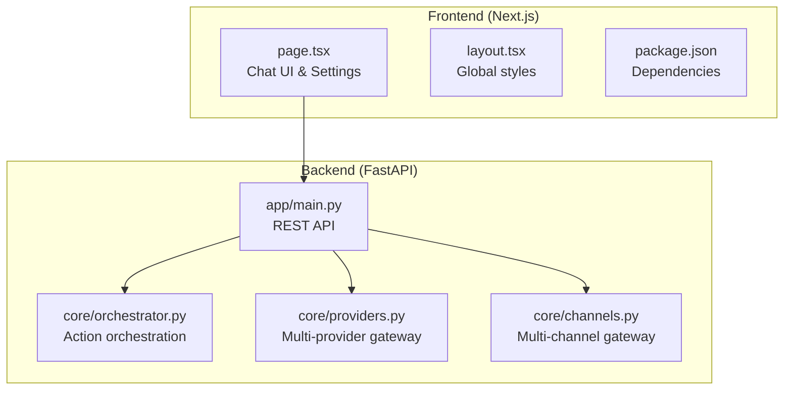
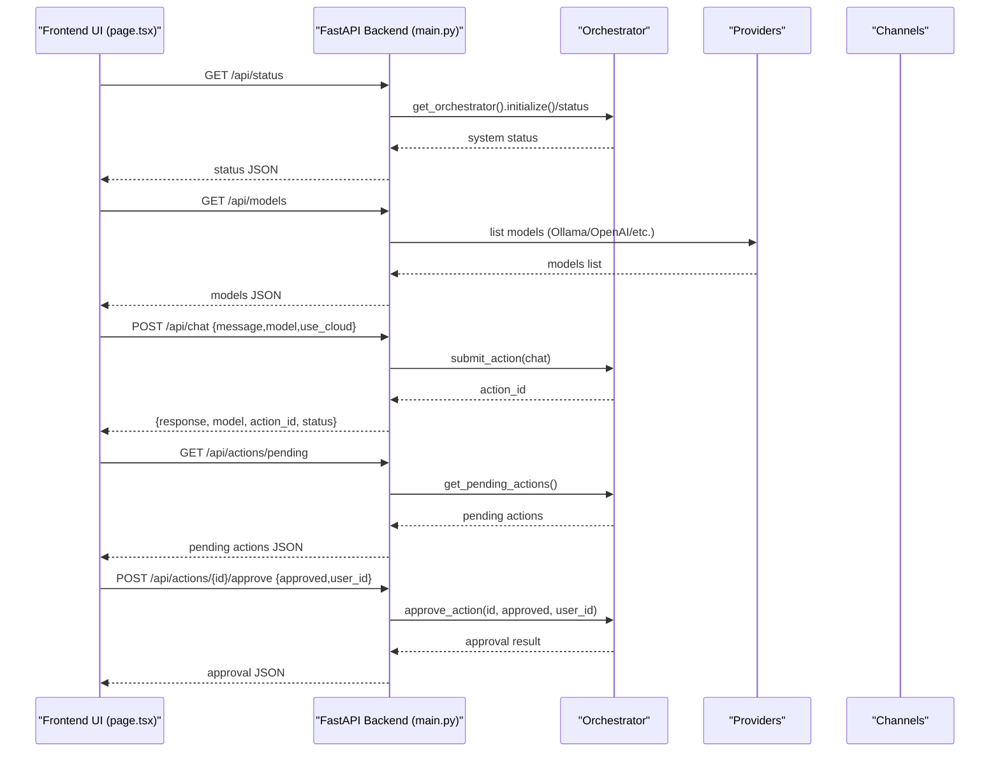
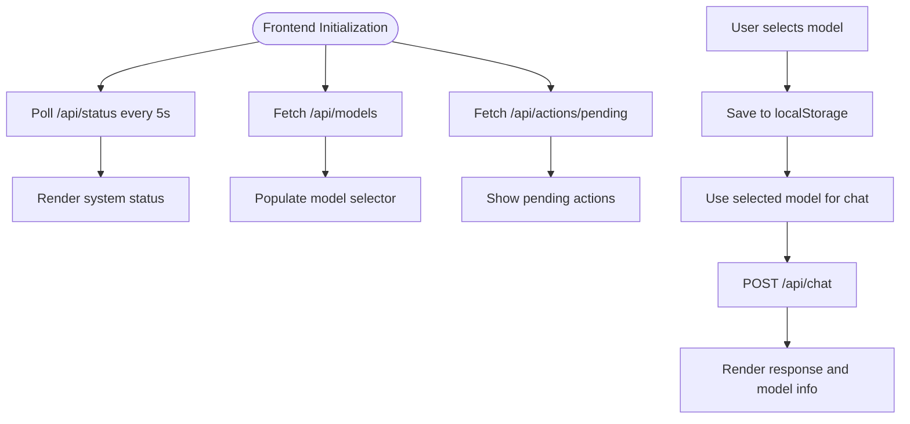
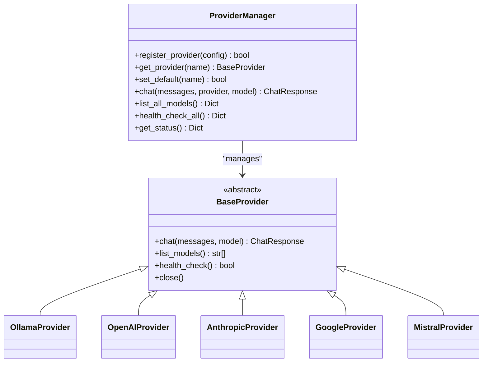
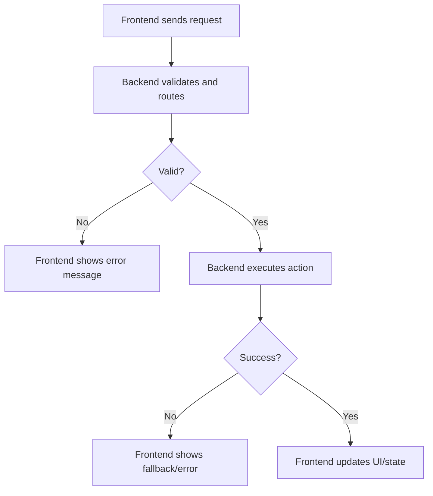
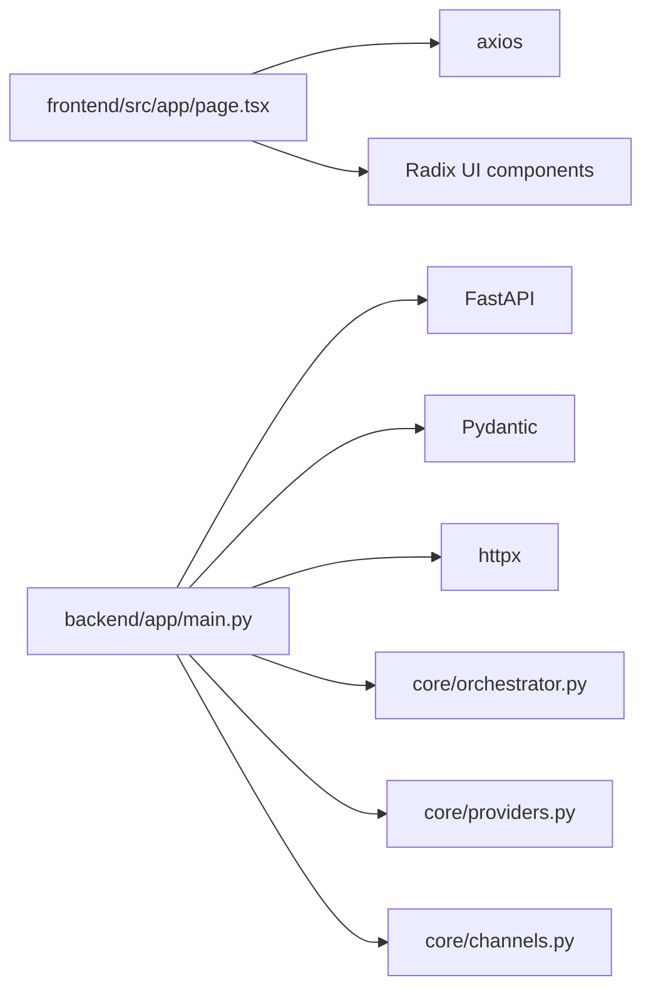

# Frontend-Backend Synchronization

<cite>
**Referenced Files in This Document**
- [README.md](file://README.md)
- [frontend/package.json](file://frontend/package.json)
- [frontend/src/app/layout.tsx](file://frontend/src/app/layout.tsx)
- [frontend/src/app/page.tsx](file://frontend/src/app/page.tsx)
- [backend/app/main.py](file://backend/app/main.py)
- [backend/app/core/orchestrator.py](file://backend/app/core/orchestrator.py)
- [backend/app/core/providers.py](file://backend/app/core/providers.py)
- [backend/app/core/channels.py](file://backend/app/core/channels.py)
</cite>

## Table of Contents
1. [Introduction](#introduction)
2. [Project Structure](#project-structure)
3. [Core Components](#core-components)
4. [Architecture Overview](#architecture-overview)
5. [Detailed Component Analysis](#detailed-component-analysis)
6. [Dependency Analysis](#dependency-analysis)
7. [Performance Considerations](#performance-considerations)
8. [Troubleshooting Guide](#troubleshooting-guide)
9. [Conclusion](#conclusion)
10. [Appendices](#appendices)

## Introduction
This document explains how ClosedPaw’s frontend and backend synchronize configuration settings across model selection, provider preferences, and channel settings. It covers:
- How the frontend communicates with backend endpoints
- Real-time configuration updates and polling-based status synchronization
- Configuration validation and error handling for mismatched configurations
- Persistence across browser sessions using localStorage and fallbacks when backend is unavailable
- Versioning, backward compatibility, and migration strategies for configuration schema changes

## Project Structure
The repository is split into a Next.js frontend and a FastAPI backend. The frontend consumes backend endpoints for models, providers, channels, and chat actions. The backend orchestrates actions, manages providers, and exposes REST endpoints.

**Diagram sources**
- [frontend/src/app/page.tsx](file://frontend/src/app/page.tsx#L1-L659)
- [frontend/src/app/layout.tsx](file://frontend/src/app/layout.tsx#L1-L22)
- [frontend/package.json](file://frontend/package.json#L1-L38)
- [backend/app/main.py](file://backend/app/main.py#L1-L567)
- [backend/app/core/orchestrator.py](file://backend/app/core/orchestrator.py#L1-L486)
- [backend/app/core/providers.py](file://backend/app/core/providers.py#L1-L545)
- [backend/app/core/channels.py](file://backend/app/core/channels.py#L1-L524)

**Section sources**
- [README.md](file://README.md#L1-L192)
- [frontend/package.json](file://frontend/package.json#L1-L38)
- [frontend/src/app/layout.tsx](file://frontend/src/app/layout.tsx#L1-L22)
- [frontend/src/app/page.tsx](file://frontend/src/app/page.tsx#L1-L659)
- [backend/app/main.py](file://backend/app/main.py#L1-L567)
- [backend/app/core/orchestrator.py](file://backend/app/core/orchestrator.py#L1-L486)
- [backend/app/core/providers.py](file://backend/app/core/providers.py#L1-L545)
- [backend/app/core/channels.py](file://backend/app/core/channels.py#L1-L524)

## Core Components
- Frontend chat interface and settings modal:
  - Fetches system status, models, and pending actions
  - Sends chat requests and approves/rejects actions
  - Persists user preferences to localStorage
- Backend REST API:
  - Provides endpoints for models, providers, channels, actions, and chat
  - Orchestrates actions with human-in-the-loop (HITL) approval gating
  - Manages provider and channel integrations

Key frontend-backend interactions:
- Models: GET /api/models (frontend) ↔ backend orchestrator/provider queries
- Providers: GET /api/providers, GET /api/providers/{provider}/models, POST /api/providers/register, POST /api/providers/{provider}/default, GET /api/providers/health, GET /api/providers/models
- Channels: GET /api/channels, POST /api/channels/register, POST /api/channels/{channel}/bind-user, POST /api/channels/start, POST /api/channels/stop
- Chat: POST /api/chat (and POST /api/chat/multi for multi-provider)
- Actions: POST /api/actions, GET /api/actions/pending, POST /api/actions/{action_id}/approve, GET /api/actions/{action_id}, GET /api/audit-logs
- System status: GET /api/status

**Section sources**
- [frontend/src/app/page.tsx](file://frontend/src/app/page.tsx#L77-L119)
- [backend/app/main.py](file://backend/app/main.py#L184-L555)
- [backend/app/core/orchestrator.py](file://backend/app/core/orchestrator.py#L169-L302)
- [backend/app/core/providers.py](file://backend/app/core/providers.py#L418-L524)
- [backend/app/core/channels.py](file://backend/app/core/channels.py#L405-L502)

## Architecture Overview
The frontend polls backend endpoints at intervals to keep configuration and status synchronized. For chat and action approvals, it performs immediate requests. The backend enforces security levels and may require HITL approval for sensitive actions.

**Diagram sources**
- [frontend/src/app/page.tsx](file://frontend/src/app/page.tsx#L94-L131)
- [backend/app/main.py](file://backend/app/main.py#L101-L319)
- [backend/app/core/orchestrator.py](file://backend/app/core/orchestrator.py#L169-L427)

**Section sources**
- [frontend/src/app/page.tsx](file://frontend/src/app/page.tsx#L77-L131)
- [backend/app/main.py](file://backend/app/main.py#L101-L319)
- [backend/app/core/orchestrator.py](file://backend/app/core/orchestrator.py#L169-L427)

## Detailed Component Analysis

### Frontend Configuration and Sync
- System status polling:
  - Every 5 seconds, the frontend fetches /api/status to reflect Ollama connectivity and core status
- Models synchronization:
  - On load and periodically, the frontend fetches /api/models and populates the model selector
- Pending actions:
  - The frontend fetches /api/actions/pending and displays actionable items for approval
- Settings persistence:
  - The settings modal saves to localStorage under a single key, including API keys, Ollama host, and selected model
- Chat flow:
  - The frontend posts to /api/chat with the current model selection and displays results

**Diagram sources**
- [frontend/src/app/page.tsx](file://frontend/src/app/page.tsx#L77-L193)

**Section sources**
- [frontend/src/app/page.tsx](file://frontend/src/app/page.tsx#L77-L193)

### Backend Endpoints and Validation
- Models endpoint:
  - Returns a list of available models, falling back to default models if Ollama is unreachable
- Provider management:
  - Registers providers, sets defaults, lists models, health-checks, and aggregates model listings
- Channel management:
  - Registers channels, binds users, starts/stops channels, and reports status
- Actions and HITL:
  - Submits actions, tracks statuses, and requires approvals for high-risk actions
- Chat endpoints:
  - Single-provider chat via local gateway and multi-provider chat via provider manager

**Diagram sources**
- [backend/app/core/providers.py](file://backend/app/core/providers.py#L418-L524)
- [backend/app/core/providers.py](file://backend/app/core/providers.py#L68-L416)

**Section sources**
- [backend/app/main.py](file://backend/app/main.py#L184-L555)
- [backend/app/core/providers.py](file://backend/app/core/providers.py#L418-L524)
- [backend/app/core/channels.py](file://backend/app/core/channels.py#L405-L502)
- [backend/app/core/orchestrator.py](file://backend/app/core/orchestrator.py#L169-L302)

### Real-Time Updates and WebSocket Considerations
- Current implementation uses periodic polling for system status and pending actions.
- There is no WebSocket implementation in the provided code. Real-time updates could be introduced by adding server-sent events or WebSocket endpoints in the future.

**Section sources**
- [frontend/src/app/page.tsx](file://frontend/src/app/page.tsx#L82-L87)
- [backend/app/main.py](file://backend/app/main.py#L265-L281)

### Configuration Validation and Error Handling
- Frontend:
  - Displays errors when backend is unreachable or chat fails
  - Uses optimistic rendering for model selection and falls back to default model if none is selected
- Backend:
  - Validates action types and handles timeouts and failures
  - Returns explicit HTTP errors for invalid requests and missing resources
  - Logs audit events for all actions

**Diagram sources**
- [frontend/src/app/page.tsx](file://frontend/src/app/page.tsx#L178-L192)
- [backend/app/main.py](file://backend/app/main.py#L131-L181)
- [backend/app/core/orchestrator.py](file://backend/app/core/orchestrator.py#L376-L427)

**Section sources**
- [frontend/src/app/page.tsx](file://frontend/src/app/page.tsx#L178-L192)
- [backend/app/main.py](file://backend/app/main.py#L131-L181)
- [backend/app/core/orchestrator.py](file://backend/app/core/orchestrator.py#L376-L427)

### Configuration Persistence and Fallbacks
- Browser session persistence:
  - Settings saved to localStorage under a single key, including API keys, Ollama host, and selected model
- Fallbacks:
  - Models endpoint returns default models when Ollama is unavailable
  - System status reflects offline state when Ollama is unreachable

**Section sources**
- [frontend/src/app/page.tsx](file://frontend/src/app/page.tsx#L202-L210)
- [backend/app/main.py](file://backend/app/main.py#L202-L209)
- [backend/app/main.py](file://backend/app/main.py#L107-L119)

### Configuration Versioning, Compatibility, and Migration
- Schema evolution:
  - The frontend stores settings as a single serialized object in localStorage
  - The backend defines Pydantic models for API responses and requests
- Backward compatibility:
  - New fields can be added to localStorage settings without breaking existing keys
  - Backend endpoints can introduce optional fields while maintaining existing responses
- Migration strategies:
  - On settings load, detect missing fields and populate defaults
  - On startup, normalize legacy keys to new schema and persist updated settings
  - For API changes, maintain backward-compatible responses and deprecate old fields gradually

[No sources needed since this section provides general guidance]

## Dependency Analysis
- Frontend depends on Axios for HTTP requests and Radix UI for controls
- Backend depends on FastAPI, Pydantic, and httpx for networking
- Orchestrator coordinates actions and integrates with providers and channels

**Diagram sources**
- [frontend/src/app/page.tsx](file://frontend/src/app/page.tsx#L4-L4)
- [frontend/package.json](file://frontend/package.json#L16-L28)
- [backend/app/main.py](file://backend/app/main.py#L10-L16)
- [backend/app/core/orchestrator.py](file://backend/app/core/orchestrator.py#L1-L28)
- [backend/app/core/providers.py](file://backend/app/core/providers.py#L1-L17)
- [backend/app/core/channels.py](file://backend/app/core/channels.py#L1-L15)

**Section sources**
- [frontend/package.json](file://frontend/package.json#L12-L28)
- [backend/app/main.py](file://backend/app/main.py#L10-L16)
- [backend/app/core/orchestrator.py](file://backend/app/core/orchestrator.py#L1-L28)
- [backend/app/core/providers.py](file://backend/app/core/providers.py#L1-L17)
- [backend/app/core/channels.py](file://backend/app/core/channels.py#L1-L15)

## Performance Considerations
- Polling intervals:
  - System status and pending actions are polled every 5 seconds; adjust based on UX needs and backend load
- Request batching:
  - Combine related requests (e.g., models and status) when appropriate
- Caching:
  - Cache models and provider health checks to reduce network calls
- Timeout tuning:
  - Adjust request timeouts for chat and provider endpoints to balance responsiveness and reliability

[No sources needed since this section provides general guidance]

## Troubleshooting Guide
Common issues and remedies:
- Backend unreachable:
  - Frontend shows offline indicators; verify backend is running on localhost and port 8000
- Ollama not available:
  - Models endpoint falls back to defaults; ensure Ollama service is running on localhost
- Invalid action type or missing resource:
  - Backend returns explicit HTTP errors; check action type and resource identifiers
- Approval required:
  - High-risk actions require HITL; approve or reject pending actions in the UI

**Section sources**
- [frontend/src/app/page.tsx](file://frontend/src/app/page.tsx#L98-L100)
- [backend/app/main.py](file://backend/app/main.py#L110-L119)
- [backend/app/main.py](file://backend/app/main.py#L246-L249)
- [backend/app/core/orchestrator.py](file://backend/app/core/orchestrator.py#L210-L214)

## Conclusion
ClosedPaw synchronizes frontend and backend configuration through a combination of periodic polling and targeted requests. The system ensures robustness by providing fallbacks when backend services are unavailable and by enforcing security through HITL approvals. Future enhancements could include real-time updates via WebSocket or server-sent events, while maintaining backward compatibility and clear migration paths for configuration schema changes.

## Appendices
- Endpoint summary:
  - GET /api/status
  - GET /api/models
  - POST /api/models/switch
  - GET /api/providers
  - GET /api/providers/{provider}/models
  - POST /api/providers/register
  - POST /api/providers/{provider}/default
  - GET /api/providers/health
  - GET /api/providers/models
  - GET /api/channels
  - POST /api/channels/register
  - POST /api/channels/{channel}/bind-user
  - POST /api/channels/start
  - POST /api/channels/stop
  - POST /api/chat
  - POST /api/chat/multi
  - POST /api/actions
  - GET /api/actions/pending
  - POST /api/actions/{action_id}/approve
  - GET /api/actions/{action_id}
  - GET /api/audit-logs

[No sources needed since this section summarizes endpoints without analyzing specific files]