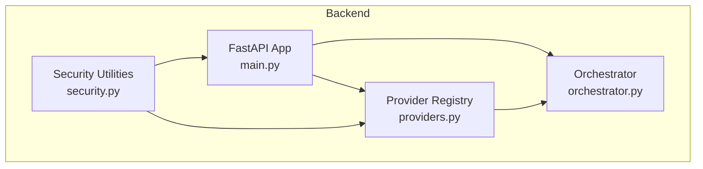
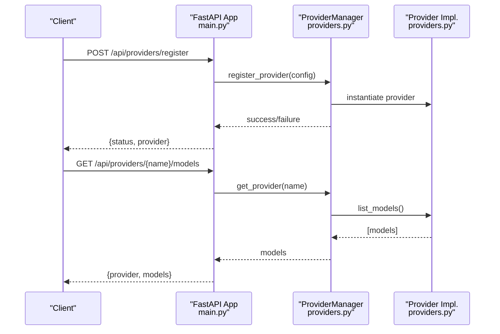
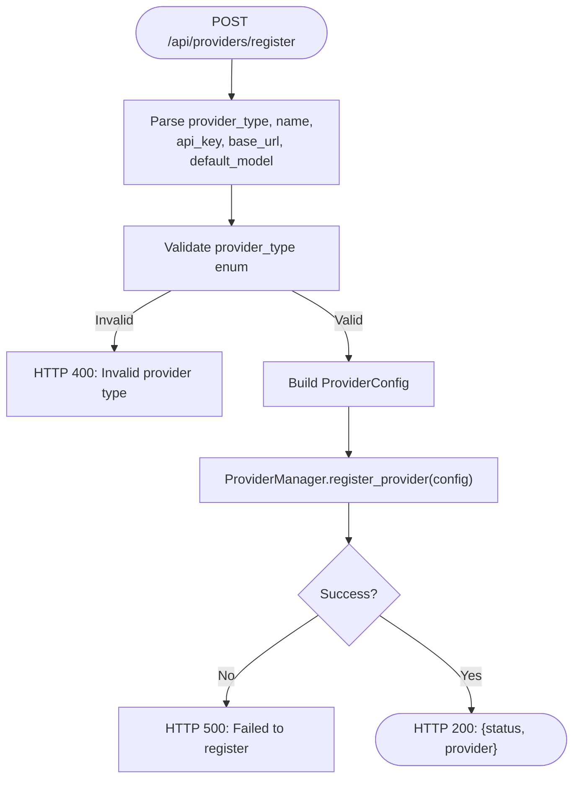
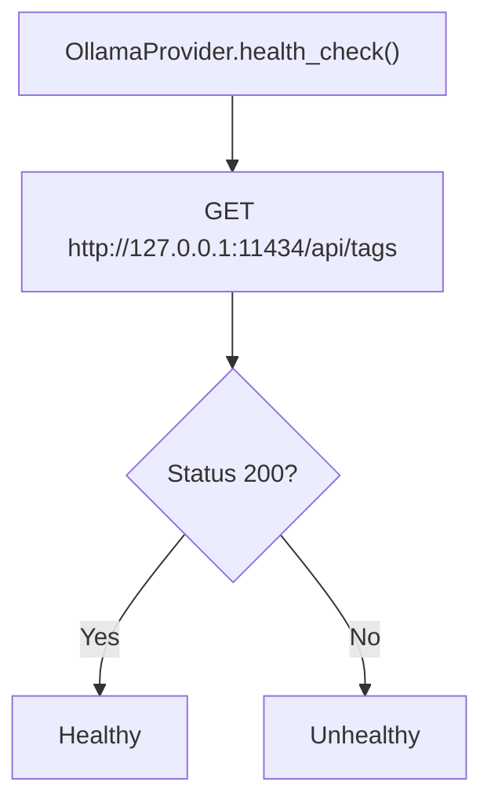
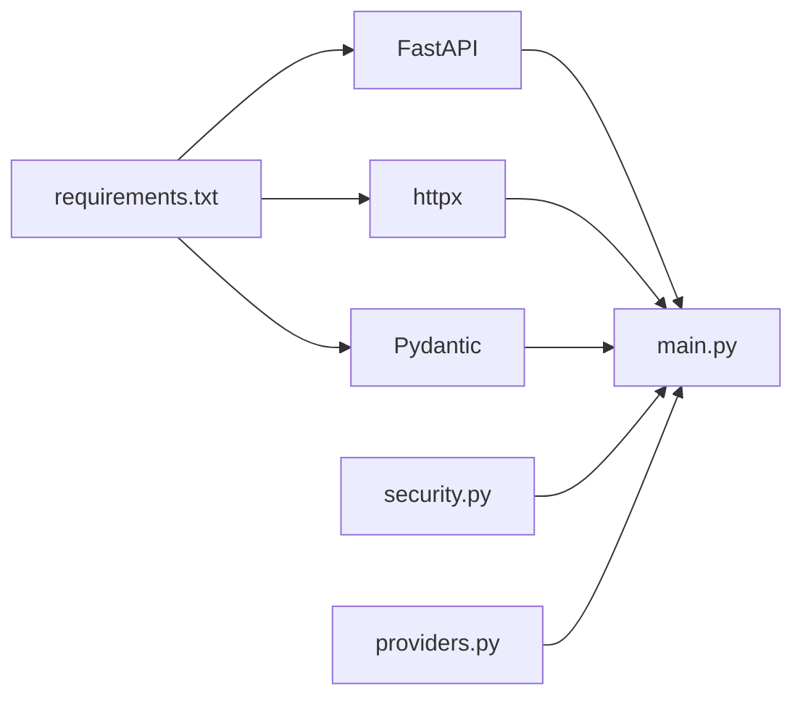

# Provider Configuration

<cite>
**Referenced Files in This Document**
- [providers.py](file://backend/app/core/providers.py)
- [main.py](file://backend/app/main.py)
- [orchestrator.py](file://backend/app/core/orchestrator.py)
- [security.py](file://backend/app/core/security.py)
- [README.md](file://README.md)
- [requirements.txt](file://backend/requirements.txt)
- [closedpaw.js](file://bin/closedpaw.js)
</cite>

## Table of Contents
1. [Introduction](#introduction)
2. [Project Structure](#project-structure)
3. [Core Components](#core-components)
4. [Architecture Overview](#architecture-overview)
5. [Detailed Component Analysis](#detailed-component-analysis)
6. [Dependency Analysis](#dependency-analysis)
7. [Performance Considerations](#performance-considerations)
8. [Troubleshooting Guide](#troubleshooting-guide)
9. [Conclusion](#conclusion)
10. [Appendices](#appendices)

## Introduction
This document explains how to configure and manage multiple LLM providers in ClosedPaw’s multi-provider architecture. It covers provider registration via the /api/providers/register endpoint, the ProviderType enumeration, the ProviderConfig schema, cloud provider integrations (OpenAI, Anthropic, Google, Mistral), local Ollama setup, provider switching, model listing, health checks, and security considerations for API keys.

## Project Structure
The provider configuration system spans several core modules:
- Provider registry and implementations live in the providers module
- API endpoints for provider management are defined in the main application
- The orchestrator coordinates actions and integrates with providers
- Security utilities enforce safe defaults and protect sensitive data
- The CLI installer provides interactive configuration helpers

**Diagram sources**
- [main.py](file://backend/app/main.py#L381-L462)
- [providers.py](file://backend/app/core/providers.py#L418-L524)
- [orchestrator.py](file://backend/app/core/orchestrator.py#L87-L130)
- [security.py](file://backend/app/core/security.py#L325-L455)

**Section sources**
- [main.py](file://backend/app/main.py#L381-L462)
- [providers.py](file://backend/app/core/providers.py#L418-L524)
- [orchestrator.py](file://backend/app/core/orchestrator.py#L87-L130)
- [security.py](file://backend/app/core/security.py#L325-L455)

## Core Components
- ProviderType enumeration defines supported provider categories
- ProviderConfig schema captures provider metadata and settings
- ProviderManager registers and routes to provider implementations
- Individual provider classes encapsulate cloud/local LLM integrations
- API endpoints expose provider registration, listing, switching, and health checks

**Section sources**
- [providers.py](file://backend/app/core/providers.py#L20-L45)
- [providers.py](file://backend/app/core/providers.py#L418-L524)
- [main.py](file://backend/app/main.py#L403-L461)

## Architecture Overview
ClosedPaw’s provider architecture centers on a ProviderManager that maintains a registry of providers. The main application exposes REST endpoints to register providers, list models, set defaults, and check health. The orchestrator coordinates actions and can route to providers as needed.

**Diagram sources**
- [main.py](file://backend/app/main.py#L390-L434)
- [providers.py](file://backend/app/core/providers.py#L418-L493)

**Section sources**
- [main.py](file://backend/app/main.py#L381-L462)
- [providers.py](file://backend/app/core/providers.py#L418-L524)

## Detailed Component Analysis

### ProviderType Enumeration
Defines supported provider categories used during registration and routing.

- Values include: ollama, openai, anthropic, google, mistral, custom

**Section sources**
- [providers.py](file://backend/app/core/providers.py#L20-L27)

### ProviderConfig Schema
Describes the configuration for a provider.

- Fields:
  - provider_type: ProviderType
  - name: string
  - api_key: optional string
  - base_url: optional string
  - models: list of strings
  - default_model: optional string
  - enabled: boolean
  - rate_limit: integer (requests per minute)
  - timeout: integer (seconds)
  - settings: dict for provider-specific options

**Section sources**
- [providers.py](file://backend/app/core/providers.py#L30-L45)

### ProviderManager
Manages provider lifecycle and routing.

- register_provider(config): validates type, instantiates provider, sets default if none
- get_provider(name): resolves provider by name or default
- set_default(name): sets default provider
- chat(messages, provider, model): dispatches to selected provider
- list_all_models(): aggregates models from all providers
- health_check_all(): checks availability of all providers
- get_status(): returns registry status

**Section sources**
- [providers.py](file://backend/app/core/providers.py#L418-L524)

### Provider Implementations
Each provider class implements BaseProvider and handles:
- chat(): sends request to provider API or local endpoint
- list_models(): returns provider’s model catalog
- health_check(): validates connectivity or credential presence

Cloud providers:
- OpenAIProvider: uses Authorization header, default base URL
- AnthropicProvider: uses x-api-key header, specific base URL
- GoogleProvider: uses API key query param, specific base URL
- MistralProvider: uses Authorization header, default base URL

Local provider:
- OllamaProvider: connects to http://127.0.0.1:11434 by default

**Section sources**
- [providers.py](file://backend/app/core/providers.py#L102-L161)
- [providers.py](file://backend/app/core/providers.py#L163-L222)
- [providers.py](file://backend/app/core/providers.py#L224-L294)
- [providers.py](file://backend/app/core/providers.py#L296-L354)
- [providers.py](file://backend/app/core/providers.py#L356-L416)

### API Endpoints for Provider Management
- GET /api/providers: returns provider registry status
- GET /api/providers/{provider_name}/models: lists models for a named provider
- POST /api/providers/register: registers a new provider
- POST /api/providers/{provider_name}/default: sets default provider
- GET /api/providers/health: health check for all providers
- GET /api/providers/models: lists models from all providers

**Diagram sources**
- [main.py](file://backend/app/main.py#L403-L434)
- [providers.py](file://backend/app/core/providers.py#L429-L456)

**Section sources**
- [main.py](file://backend/app/main.py#L381-L462)

### Cloud Provider Integration Details
- OpenAI: default base URL, Authorization header, default models include GPT-4o variants
- Anthropic: default base URL, x-api-key header, default models include Claude 3.5 Sonnet
- Google: default base URL, API key via query param, default models include Gemini 2.0 Flash
- Mistral: default base URL, Authorization header, default models include Mistral Large

Regional endpoint configuration:
- base_url can be customized per provider during registration
- For Google, the default base URL points to generativelanguage.googleapis.com/v1beta

Authentication methods:
- OpenAI/Mistral: Authorization: Bearer <api_key>
- Anthropic: x-api-key: <api_key>
- Google: query param key=<api_key>

**Section sources**
- [providers.py](file://backend/app/core/providers.py#L163-L222)
- [providers.py](file://backend/app/core/providers.py#L224-L294)
- [providers.py](file://backend/app/core/providers.py#L296-L354)
- [providers.py](file://backend/app/core/providers.py#L356-L416)

### Local Ollama Provider Setup
- Default base URL: http://127.0.0.1:11434
- Model discovery: GET /api/tags returns installed models
- Connection validation: health_check performs GET /api/tags with short timeout
- Chat format: converts messages to a single prompt string

**Diagram sources**
- [providers.py](file://backend/app/core/providers.py#L155-L160)

**Section sources**
- [providers.py](file://backend/app/core/providers.py#L102-L161)

### Provider Switching and Model Listing
- Switch default provider: POST /api/providers/{provider_name}/default
- List models for a provider: GET /api/providers/{provider_name}/models
- List models across all providers: GET /api/providers/models
- Health check all providers: GET /api/providers/health

**Section sources**
- [main.py](file://backend/app/main.py#L437-L461)

### Multi-Provider Chat Endpoint
- POST /api/chat/multi: sends a message to a specific provider and returns response details

**Section sources**
- [main.py](file://backend/app/main.py#L533-L555)

## Dependency Analysis
- FastAPI and httpx power the REST API and HTTP client
- Pydantic validates request/response models
- Security utilities provide encryption and rate limiting
- The CLI installer demonstrates configuration flows for providers

**Diagram sources**
- [requirements.txt](file://backend/requirements.txt#L4-L15)
- [main.py](file://backend/app/main.py#L10-L16)
- [security.py](file://backend/app/core/security.py#L325-L455)
- [providers.py](file://backend/app/core/providers.py#L102-L161)

**Section sources**
- [requirements.txt](file://backend/requirements.txt#L1-L36)
- [main.py](file://backend/app/main.py#L10-L16)
- [security.py](file://backend/app/core/security.py#L325-L455)
- [providers.py](file://backend/app/core/providers.py#L102-L161)

## Performance Considerations
- ProviderManager caches provider instances and configurations
- Health checks use short timeouts to avoid blocking
- Rate limits and timeouts are configurable per provider
- Model listing is aggregated asynchronously across providers

[No sources needed since this section provides general guidance]

## Troubleshooting Guide
Common issues and resolutions:

- Registration failures:
  - Cause: Invalid provider_type or instantiation error
  - Resolution: Verify provider_type matches enumeration; check base_url and api_key if applicable

- Provider not found:
  - Cause: Name mismatch or provider not registered
  - Resolution: Confirm provider name; use GET /api/providers to list registered providers

- Health check failures:
  - Cause: Network connectivity, wrong base_url, missing api_key for cloud providers
  - Resolution: Validate endpoints; confirm credentials; adjust timeouts

- Local Ollama connectivity:
  - Cause: Ollama not running or not bound to 127.0.0.1
  - Resolution: Start Ollama locally; ensure default port 11434 is reachable

- Model listing empty:
  - Cause: Provider not configured or models endpoint unreachable
  - Resolution: Re-register provider; verify base_url; check network access

**Section sources**
- [providers.py](file://backend/app/core/providers.py#L429-L456)
- [providers.py](file://backend/app/core/providers.py#L495-L503)
- [main.py](file://backend/app/main.py#L448-L453)

## Conclusion
ClosedPaw’s provider configuration system offers a flexible, secure way to integrate local and cloud LLMs. The REST API enables dynamic registration, model discovery, provider switching, and health monitoring. By leveraging ProviderConfig and ProviderManager, administrators can safely manage multiple providers with robust defaults and strong security practices.

[No sources needed since this section summarizes without analyzing specific files]

## Appendices

### Provider Configuration Templates
- Local Ollama:
  - provider_type: ollama
  - name: ollama
  - base_url: http://127.0.0.1:11434
  - default_model: llama3.2:3b

- OpenAI:
  - provider_type: openai
  - name: openai
  - api_key: <your-openai-key>
  - base_url: https://api.openai.com/v1
  - default_model: gpt-4o-mini

- Anthropic:
  - provider_type: anthropic
  - name: anthropic
  - api_key: <your-anthropic-key>
  - base_url: https://api.anthropic.com/v1
  - default_model: claude-3-5-sonnet-20241022

- Google:
  - provider_type: google
  - name: google
  - api_key: <your-google-key>
  - base_url: https://generativelanguage.googleapis.com/v1beta
  - default_model: gemini-1.5-flash

- Mistral:
  - provider_type: mistral
  - name: mistral
  - api_key: <your-mistral-key>
  - base_url: https://api.mistral.ai/v1
  - default_model: mistral-small-latest

**Section sources**
- [main.py](file://backend/app/main.py#L403-L434)
- [providers.py](file://backend/app/core/providers.py#L163-L416)

### Security Considerations for API Keys
- API keys are stored in ProviderConfig; treat as sensitive
- The security module includes an encrypted data vault for secrets
- Best practices:
  - Use environment variables or secure secret stores
  - Limit provider permissions to least privilege
  - Rotate keys regularly
  - Avoid embedding keys in client-side code

**Section sources**
- [security.py](file://backend/app/core/security.py#L325-L455)
- [README.md](file://README.md#L65-L74)

### Interactive Configuration Helper
The CLI installer provides an interactive wizard to configure providers and channels, including prompts for API keys and default models.

**Section sources**
- [closedpaw.js](file://bin/closedpaw.js#L537-L601)