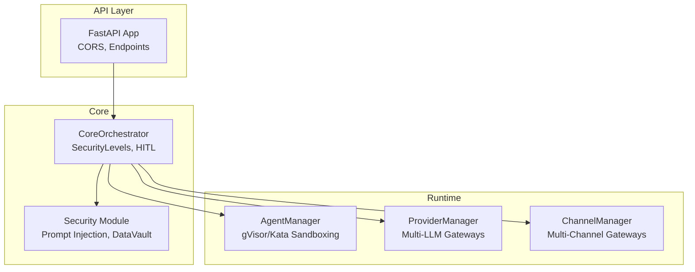
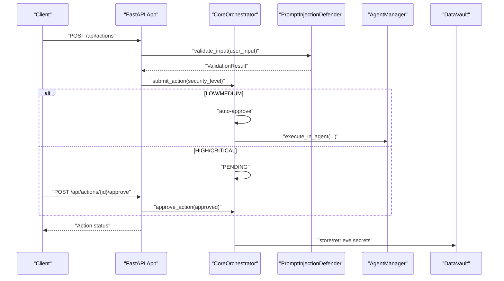
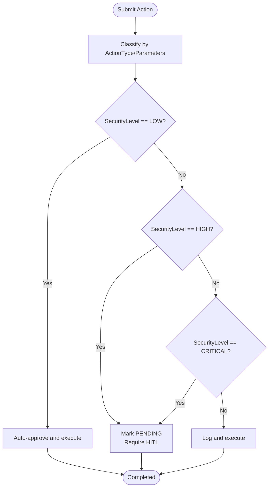
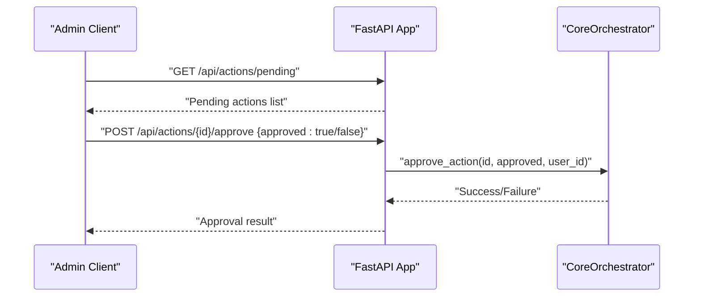
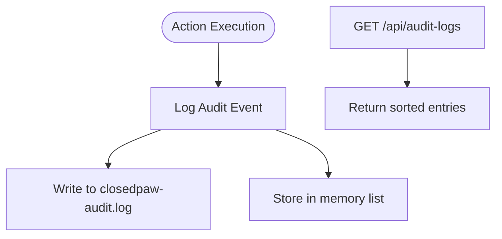
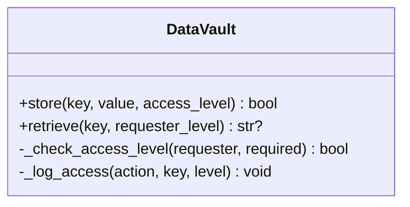
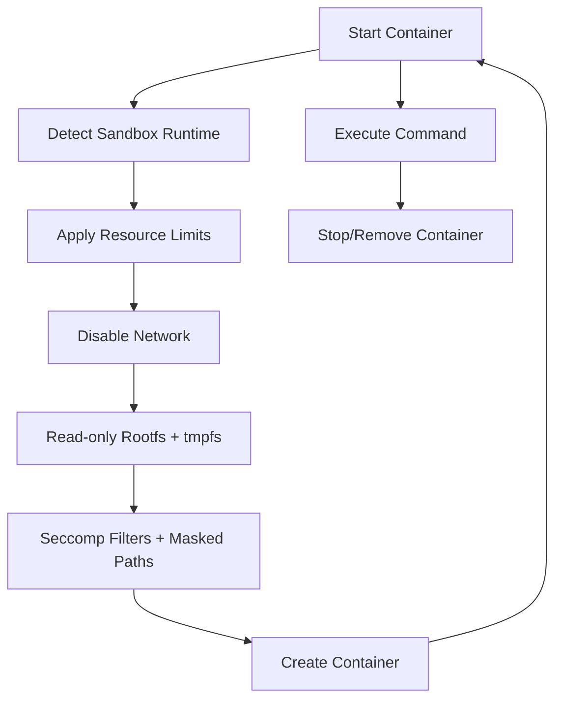
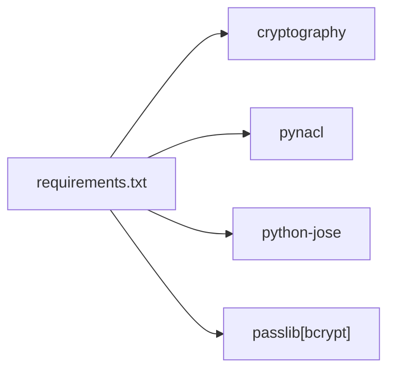

# Security Policies

<cite>
**Referenced Files in This Document**
- [README.md](file://README.md)
- [CONTRIBUTING.md](file://CONTRIBUTING.md)
- [requirements.txt](file://backend/requirements.txt)
- [main.py](file://backend/app/main.py)
- [security.py](file://backend/app/core/security.py)
- [orchestrator.py](file://backend/app/core/orchestrator.py)
- [agent_manager.py](file://backend/app/core/agent_manager.py)
- [providers.py](file://backend/app/core/providers.py)
- [channels.py](file://backend/app/core/channels.py)
- [install.sh](file://installer/install.sh)
- [install.ps1](file://installer/install.ps1)
- [page.tsx](file://frontend/src/app/page.tsx)
</cite>

## Table of Contents
1. [Introduction](#introduction)
2. [Project Structure](#project-structure)
3. [Core Components](#core-components)
4. [Architecture Overview](#architecture-overview)
5. [Detailed Component Analysis](#detailed-component-analysis)
6. [Dependency Analysis](#dependency-analysis)
7. [Performance Considerations](#performance-considerations)
8. [Troubleshooting Guide](#troubleshooting-guide)
9. [Conclusion](#conclusion)
10. [Appendices](#appendices)

## Introduction
This document defines the security policy configuration for ClosedPaw’s zero-trust architecture. It covers the security level classification system, automatic and human-in-the-loop (HITL) approval workflows, audit logging, encrypted data storage, sandbox security policies for gVisor/Kata Containers, encryption configuration for API keys and user data, CORS policy for localhost-only access, and compliance logging through the /api/audit-logs endpoint. It also includes security boundary enforcement, privilege separation, and practical guidance for policy templates, threat modeling, and hardening best practices.

## Project Structure
ClosedPaw implements a layered zero-trust design:
- API gateway with CORS and action submission
- Core orchestrator enforcing security levels and HITL approvals
- Agent manager with hardened sandboxing (gVisor/Kata)
- Provider manager for multi-cloud LLM gateways
- Channel manager for secure multi-channel communications
- Security module with prompt injection defense and encrypted data vault
- Installer scripts ensuring sandbox runtime availability

**Diagram sources**
- [main.py](file://backend/app/main.py#L72-L87)
- [orchestrator.py](file://backend/app/core/orchestrator.py#L87-L130)
- [agent_manager.py](file://backend/app/core/agent_manager.py#L65-L98)
- [providers.py](file://backend/app/core/providers.py#L418-L457)
- [channels.py](file://backend/app/core/channels.py#L405-L444)
- [security.py](file://backend/app/core/security.py#L35-L107)

**Section sources**
- [README.md](file://README.md#L65-L74)
- [main.py](file://backend/app/main.py#L72-L87)
- [orchestrator.py](file://backend/app/core/orchestrator.py#L87-L130)

## Core Components
- Security Level Classification: LOW, MEDIUM, HIGH, CRITICAL
- Automatic Approval: LOW/MEDIUM actions auto-execute after validation
- HITL Approval: HIGH/CRITICAL actions require manual approval
- Audit Logging: Centralized audit trail for all actions
- Encrypted Data Vault: API keys and secrets at rest
- Sandbox Runtime: gVisor/Kata enforced for agent execution
- CORS Policy: localhost-only access
- Multi-Provider and Channel Security: Provider and channel configurations enforce security boundaries

**Section sources**
- [orchestrator.py](file://backend/app/core/orchestrator.py#L51-L56)
- [orchestrator.py](file://backend/app/core/orchestrator.py#L225-L249)
- [main.py](file://backend/app/main.py#L284-L298)
- [security.py](file://backend/app/core/security.py#L325-L413)
- [agent_manager.py](file://backend/app/core/agent_manager.py#L21-L26)
- [main.py](file://backend/app/main.py#L80-L87)

## Architecture Overview
The system enforces zero-trust by:
- Validating and sanitizing all user inputs
- Classifying actions by risk and applying appropriate approval workflows
- Enforcing sandboxing and resource limits for all agent execution
- Logging all actions for compliance and forensics
- Restricting API access to localhost only

**Diagram sources**
- [main.py](file://backend/app/main.py#L241-L262)
- [security.py](file://backend/app/core/security.py#L116-L180)
- [orchestrator.py](file://backend/app/core/orchestrator.py#L169-L223)
- [agent_manager.py](file://backend/app/core/agent_manager.py#L475-L537)
- [security.py](file://backend/app/core/security.py#L347-L413)

## Detailed Component Analysis

### Security Level Classification and Automatic Approval Workflows
- LOW: No approval required; auto-executed after validation
- MEDIUM: Logged; auto-executed after validation
- HIGH: Requires HITL approval
- CRITICAL: Requires HITL approval plus additional verification

**Diagram sources**
- [orchestrator.py](file://backend/app/core/orchestrator.py#L225-L249)
- [orchestrator.py](file://backend/app/core/orchestrator.py#L210-L223)

**Section sources**
- [orchestrator.py](file://backend/app/core/orchestrator.py#L51-L56)
- [orchestrator.py](file://backend/app/core/orchestrator.py#L225-L249)
- [main.py](file://backend/app/main.py#L241-L262)

### Human-in-the-Loop (HITL) Approval Mechanisms
- Pending actions are exposed via GET /api/actions/pending
- Approve or reject via POST /api/actions/{id}/approve
- Approval records audit events and triggers execution

**Diagram sources**
- [main.py](file://backend/app/main.py#L265-L281)
- [main.py](file://backend/app/main.py#L284-L298)
- [orchestrator.py](file://backend/app/core/orchestrator.py#L376-L427)

**Section sources**
- [main.py](file://backend/app/main.py#L265-L298)
- [orchestrator.py](file://backend/app/core/orchestrator.py#L376-L427)

### Audit Logging Configuration and Compliance
- Centralized audit logs written to a temporary file path
- Endpoint GET /api/audit-logs exposes recent audit entries
- Logs include timestamps, action types, statuses, outcomes, and details

**Diagram sources**
- [orchestrator.py](file://backend/app/core/orchestrator.py#L18-L28)
- [orchestrator.py](file://backend/app/core/orchestrator.py#L429-L461)
- [main.py](file://backend/app/main.py#L322-L339)

**Section sources**
- [orchestrator.py](file://backend/app/core/orchestrator.py#L18-L28)
- [orchestrator.py](file://backend/app/core/orchestrator.py#L429-L461)
- [main.py](file://backend/app/main.py#L322-L339)

### Encrypted Data Storage Settings
- DataVault stores secrets encrypted at rest using symmetric encryption
- Access control levels (public, standard, elevated, admin)
- Audit access logs for all store/retrieve operations

**Diagram sources**
- [security.py](file://backend/app/core/security.py#L325-L413)

**Section sources**
- [security.py](file://backend/app/core/security.py#L325-L413)

### Sandbox Security Policies for gVisor/Kata Containers
- Preferred runtime detection and fallback behavior
- Resource limits: CPU cores, memory, disk, process count
- Network isolation: disabled by default
- Rootfs: read-only, tmpfs for ephemeral data
- Seccomp filters and masked/readonly paths for kernel surface reduction
- Container lifecycle: create/start/stop/delete with timeouts and forced termination

**Diagram sources**
- [agent_manager.py](file://backend/app/core/agent_manager.py#L99-L147)
- [agent_manager.py](file://backend/app/core/agent_manager.py#L194-L293)
- [agent_manager.py](file://backend/app/core/agent_manager.py#L309-L473)

**Section sources**
- [agent_manager.py](file://backend/app/core/agent_manager.py#L21-L26)
- [agent_manager.py](file://backend/app/core/agent_manager.py#L39-L47)
- [agent_manager.py](file://backend/app/core/agent_manager.py#L86-L94)
- [agent_manager.py](file://backend/app/core/agent_manager.py#L203-L293)
- [agent_manager.py](file://backend/app/core/agent_manager.py#L309-L473)

### Encryption Configuration for API Keys, User Data, and Audit Logs
- Symmetric encryption for secrets at rest (Fernet)
- Audit logs are stored in plaintext but protected by filesystem permissions and runtime isolation
- Provider API keys are stored in the DataVault and retrieved only when needed

**Section sources**
- [security.py](file://backend/app/core/security.py#L341-L345)
- [security.py](file://backend/app/core/security.py#L379-L413)
- [providers.py](file://backend/app/core/providers.py#L31-L44)

### CORS Policy Configuration for Localhost-Only Access
- Only localhost origins permitted for development
- Credentials allowed; headers/methods permissive for internal use

**Section sources**
- [main.py](file://backend/app/main.py#L80-L87)

### Authentication and Authorization Controls
- No built-in authentication/authorization in the API layer
- Localhost-only binding and sandboxing provide primary isolation
- Provider/channel configurations include allowlists and rate limits

**Section sources**
- [channels.py](file://backend/app/core/channels.py#L42-L64)
- [providers.py](file://backend/app/core/providers.py#L31-L44)

### Security Boundary Enforcement and Privilege Separation
- CoreOrchestrator separates concerns: action submission, approval, execution, auditing
- AgentManager isolates skill execution in hardened containers
- ProviderManager and ChannelManager encapsulate external integrations with allowlists and rate limits
- Installer scripts ensure sandbox runtime availability

**Section sources**
- [orchestrator.py](file://backend/app/core/orchestrator.py#L87-L130)
- [agent_manager.py](file://backend/app/core/agent_manager.py#L65-L98)
- [providers.py](file://backend/app/core/providers.py#L418-L457)
- [channels.py](file://backend/app/core/channels.py#L405-L444)
- [install.sh](file://installer/install.sh#L191-L270)
- [install.ps1](file://installer/install.ps1#L280-L318)

### Compliance Logging Through /api/audit-logs
- Endpoint returns recent audit entries with structured fields
- Supports compliance reporting and forensic analysis

**Section sources**
- [main.py](file://backend/app/main.py#L322-L339)
- [orchestrator.py](file://backend/app/core/orchestrator.py#L459-L461)

## Dependency Analysis
Security-related dependencies include cryptography libraries for encryption and jose for token handling.

**Diagram sources**
- [requirements.txt](file://backend/requirements.txt#L21-L25)

**Section sources**
- [requirements.txt](file://backend/requirements.txt#L21-L25)

## Performance Considerations
- gVisor/Kata introduce overhead; tune resource limits to balance safety and performance
- Audit logging writes to disk; consider log rotation and retention policies
- Rate limiting prevents abuse but may throttle legitimate users—adjust thresholds per deployment

## Troubleshooting Guide
- Sandbox runtime not available: Installer scripts detect and configure gVisor/Kata; ensure platform support
- Audit logs missing: Verify file path and permissions; confirm logging configuration
- Secrets not retrievable: Check access levels and vault key generation

**Section sources**
- [install.sh](file://installer/install.sh#L272-L288)
- [install.ps1](file://installer/install.ps1#L218-L252)
- [orchestrator.py](file://backend/app/core/orchestrator.py#L18-L28)
- [security.py](file://backend/app/core/security.py#L341-L345)

## Conclusion
ClosedPaw’s zero-trust security model combines input validation, security-level classification, HITL approvals, hardened sandboxing, encrypted storage, and comprehensive audit logging. Adhering to localhost-only access, privilege separation, and strict resource limits ensures robust protection for local AI operations.

## Appendices

### Security Policy Templates
- Input Validation Template: Define regex patterns and sanitization rules for user inputs; classify threats by severity.
- Approval Workflow Template: Map action types to security levels; define escalation paths for HIGH/CRITICAL actions.
- Sandbox Configuration Template: Specify CPU/memory/disk limits, network isolation, and seccomp profiles.
- Encryption Template: Define secret categories, access levels, and key rotation procedures.
- Audit Logging Template: Define log fields, retention, and compliance export formats.

### Threat Model Considerations
- Prompt injection: Mitigated by layered validation and sanitization
- Code execution: Mitigated by gVisor/Kata sandboxing
- Data exfiltration: Mitigated by local-only operation and encrypted storage
- Network attacks: Mitigated by localhost binding and no external exposure
- Supply chain: Mitigated by signed packages and dependency scanning

**Section sources**
- [README.md](file://README.md#L75-L105)
- [security.py](file://backend/app/core/security.py#L16-L23)
- [agent_manager.py](file://backend/app/core/agent_manager.py#L73-L79)

### Security Hardening Best Practices
- Never disable security features
- Validate and sanitize all inputs
- Separate system and user prompts
- Use hardened sandboxes (gVisor/Kata); avoid Docker alone
- Encrypt sensitive data at rest
- Log security events
- Bind services to 127.0.0.1 only

**Section sources**
- [CONTRIBUTING.md](file://CONTRIBUTING.md#L101-L121)
- [README.md](file://README.md#L65-L74)
- [main.py](file://backend/app/main.py#L80-L87)