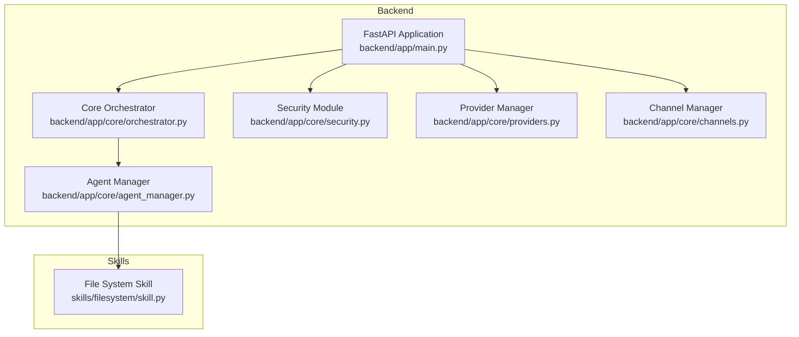
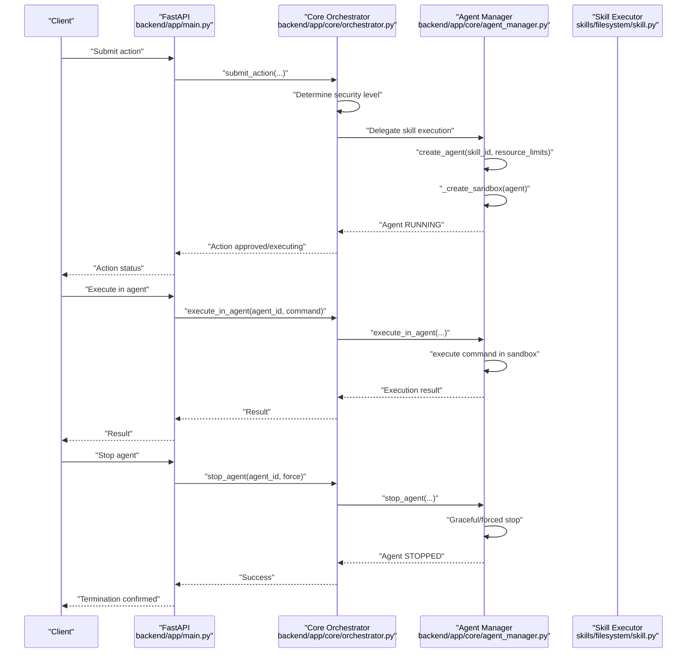
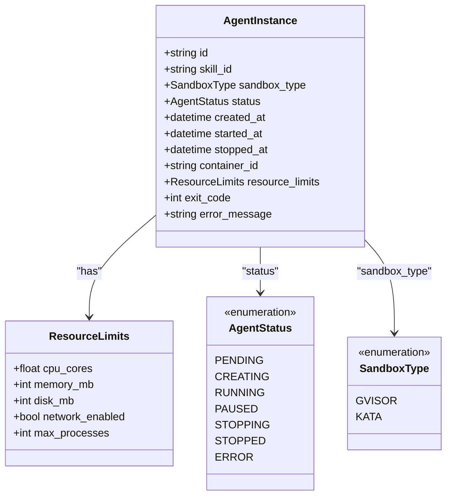
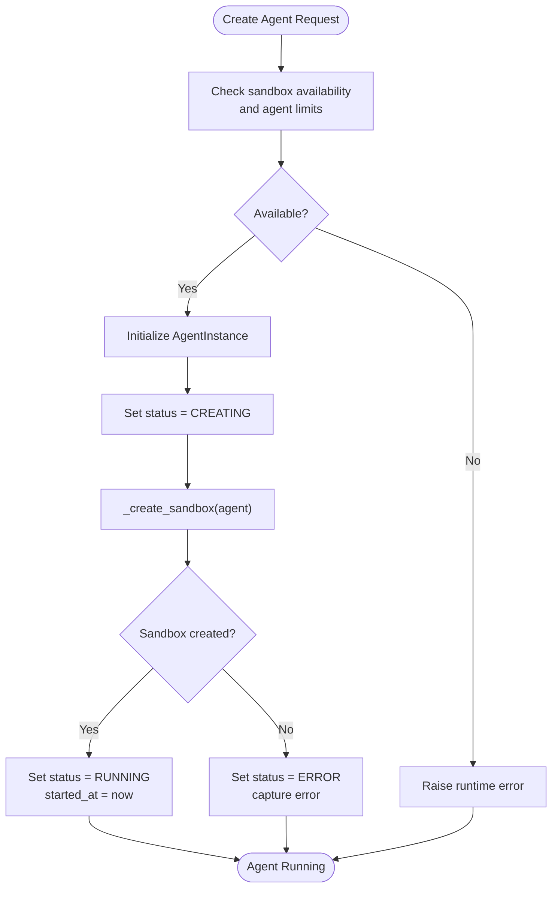
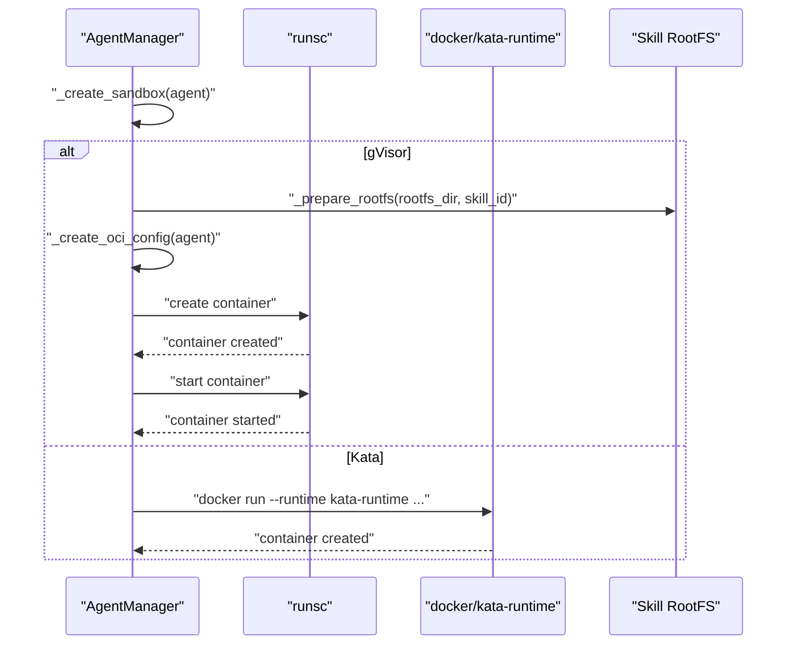
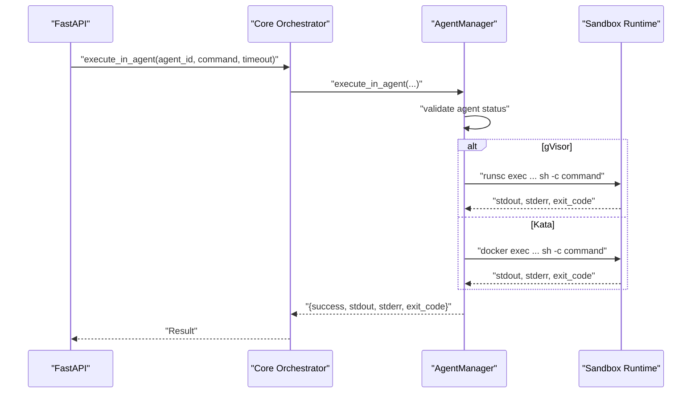
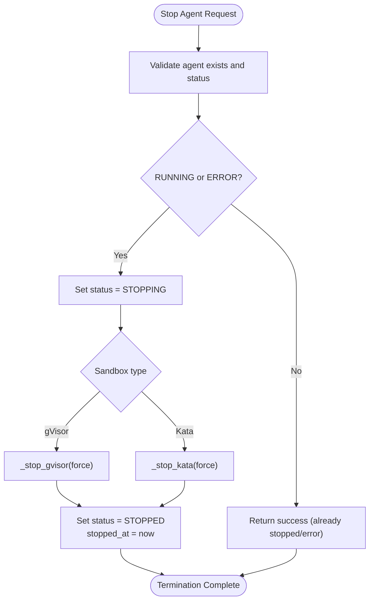
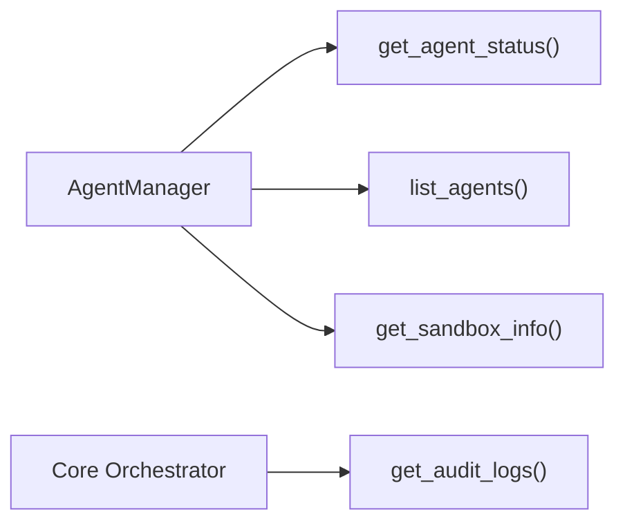
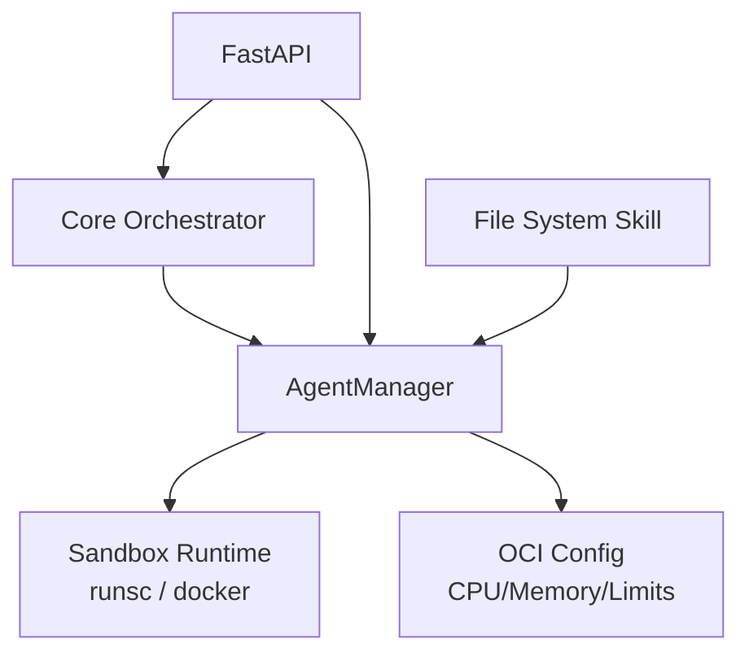

# Agent Lifecycle Management

<cite>
**Referenced Files in This Document**
- [agent_manager.py](file://backend/app/core/agent_manager.py)
- [orchestrator.py](file://backend/app/core/orchestrator.py)
- [main.py](file://backend/app/main.py)
- [filesystem/skill.py](file://skills/filesystem/skill.py)
</cite>

## Table of Contents
1. [Introduction](#introduction)
2. [Project Structure](#project-structure)
3. [Core Components](#core-components)
4. [Architecture Overview](#architecture-overview)
5. [Detailed Component Analysis](#detailed-component-analysis)
6. [Dependency Analysis](#dependency-analysis)
7. [Performance Considerations](#performance-considerations)
8. [Troubleshooting Guide](#troubleshooting-guide)
9. [Conclusion](#conclusion)

## Introduction
This document provides comprehensive documentation for agent lifecycle management in the system. It covers the complete lifecycle of sandboxed agents: creation, execution, and termination. It details the AgentInstance data structure, status transitions (PENDING → CREATING → RUNNING → STOPPING → STOPPED), and state management. It also explains the agent creation workflow including resource allocation, sandbox initialization, and error handling; the agent execution process for command execution, timeout handling, and result processing; and the termination procedures including graceful shutdown, forced termination, and cleanup operations. Practical examples, status monitoring, troubleshooting, concurrent agent management, resource limits enforcement, and performance optimization strategies are included.

## Project Structure
The agent lifecycle is primarily managed by the Agent Manager module, integrated with the Core Orchestrator and exposed via the FastAPI backend. Skills (executors) are sandboxed and invoked by the Agent Manager during execution.

**Diagram sources**
- [main.py](file://backend/app/main.py#L1-L567)
- [orchestrator.py](file://backend/app/core/orchestrator.py#L1-L486)
- [agent_manager.py](file://backend/app/core/agent_manager.py#L1-L708)
- [filesystem/skill.py](file://skills/filesystem/skill.py#L1-L483)

**Section sources**
- [main.py](file://backend/app/main.py#L1-L567)
- [agent_manager.py](file://backend/app/core/agent_manager.py#L1-L708)
- [orchestrator.py](file://backend/app/core/orchestrator.py#L1-L486)

## Core Components
- AgentInstance: Data structure representing a sandboxed agent with identifiers, status, timestamps, container metadata, resource limits, and error tracking.
- AgentManager: Central coordinator for agent lifecycle, sandbox detection, resource enforcement, sandbox creation, command execution, and termination.
- Core Orchestrator: Manages system actions, security levels, HITL approvals, and delegates skill execution to the Agent Manager.
- Skills: Executable units (e.g., File System Skill) that operate within sandboxed agents.

Key lifecycle statuses:
- PENDING: Agent created but not yet initialized.
- CREATING: Sandbox container being created.
- RUNNING: Agent is active and ready to execute commands.
- STOPPING: Agent is in the process of terminating.
- STOPPED: Agent terminated successfully.
- ERROR: Agent encountered an error during creation or execution.

**Section sources**
- [agent_manager.py](file://backend/app/core/agent_manager.py#L28-L63)
- [agent_manager.py](file://backend/app/core/agent_manager.py#L65-L708)
- [orchestrator.py](file://backend/app/core/orchestrator.py#L72-L85)

## Architecture Overview
The system follows a Zero-Trust architecture. The Core Orchestrator evaluates actions and security levels, delegating skill execution to the Agent Manager. The Agent Manager creates sandboxed containers (gVisor or Kata), enforces resource limits, executes commands, and manages termination. The backend exposes APIs for status monitoring, action submission, and audit logging.

**Diagram sources**
- [main.py](file://backend/app/main.py#L241-L319)
- [orchestrator.py](file://backend/app/core/orchestrator.py#L169-L302)
- [agent_manager.py](file://backend/app/core/agent_manager.py#L149-L192)
- [agent_manager.py](file://backend/app/core/agent_manager.py#L475-L537)
- [agent_manager.py](file://backend/app/core/agent_manager.py#L586-L627)
- [filesystem/skill.py](file://skills/filesystem/skill.py#L35-L483)

## Detailed Component Analysis

### AgentInstance Data Structure
AgentInstance encapsulates the state and metadata of a sandboxed agent:
- Identifiers: id, skill_id, container_id
- Status: AgentStatus enum (PENDING, CREATING, RUNNING, PAUSED, STOPPING, STOPPED, ERROR)
- Timestamps: created_at, started_at, stopped_at
- Sandbox configuration: sandbox_type, resource_limits
- Execution metadata: exit_code, error_message

**Diagram sources**
- [agent_manager.py](file://backend/app/core/agent_manager.py#L39-L63)
- [agent_manager.py](file://backend/app/core/agent_manager.py#L40-L47)
- [agent_manager.py](file://backend/app/core/agent_manager.py#L28-L37)

**Section sources**
- [agent_manager.py](file://backend/app/core/agent_manager.py#L39-L63)
- [agent_manager.py](file://backend/app/core/agent_manager.py#L40-L47)

### Agent Creation Workflow
The create_agent method orchestrates agent creation:
- Availability check: Validates sandbox runtime (gVisor or Kata) and agent limits.
- Instance creation: Initializes AgentInstance with defaults and resource limits.
- Sandbox creation: Chooses sandbox type and prepares OCI bundle or container runtime.
- Status transitions: Sets status to CREATING, then RUNNING upon success; captures errors and sets ERROR.

**Diagram sources**
- [agent_manager.py](file://backend/app/core/agent_manager.py#L149-L192)
- [agent_manager.py](file://backend/app/core/agent_manager.py#L194-L201)
- [agent_manager.py](file://backend/app/core/agent_manager.py#L203-L261)

**Section sources**
- [agent_manager.py](file://backend/app/core/agent_manager.py#L149-L192)
- [agent_manager.py](file://backend/app/core/agent_manager.py#L194-L261)

### Sandbox Initialization and Resource Allocation
- gVisor: Creates OCI bundle with minimal rootfs, config.json, and starts container via runsc.
- Kata: Spawns container with CPU/memory/disk/network constraints and read-only rootfs.
- ResourceLimits: Enforced via OCI config (CPU shares/quota, memory limits, process limits) and Docker flags for Kata.

**Diagram sources**
- [agent_manager.py](file://backend/app/core/agent_manager.py#L194-L201)
- [agent_manager.py](file://backend/app/core/agent_manager.py#L203-L261)
- [agent_manager.py](file://backend/app/core/agent_manager.py#L262-L294)
- [agent_manager.py](file://backend/app/core/agent_manager.py#L295-L308)
- [agent_manager.py](file://backend/app/core/agent_manager.py#L309-L473)

**Section sources**
- [agent_manager.py](file://backend/app/core/agent_manager.py#L203-L261)
- [agent_manager.py](file://backend/app/core/agent_manager.py#L262-L294)
- [agent_manager.py](file://backend/app/core/agent_manager.py#L309-L473)

### Agent Execution Workflow
The execute_in_agent method runs commands inside a sandboxed agent:
- Validation: Ensures agent exists and is RUNNING.
- Execution: Executes via runsc (gVisor) or docker exec (Kata) with a configurable timeout.
- Result processing: Returns structured result with stdout/stderr/exit_code; handles timeouts and exceptions.

**Diagram sources**
- [main.py](file://backend/app/main.py#L241-L319)
- [agent_manager.py](file://backend/app/core/agent_manager.py#L475-L537)
- [agent_manager.py](file://backend/app/core/agent_manager.py#L539-L561)
- [agent_manager.py](file://backend/app/core/agent_manager.py#L563-L584)

**Section sources**
- [agent_manager.py](file://backend/app/core/agent_manager.py#L475-L537)
- [agent_manager.py](file://backend/app/core/agent_manager.py#L539-L584)

### Agent Termination Procedures
The stop_agent method supports graceful and forced termination:
- Status validation: Only stops RUNNING or ERROR agents.
- Graceful stop: Sends TERM signal, waits briefly, deletes container.
- Forced stop: Sends KILL/SIGKILL, removes container.
- Cleanup: Updates status to STOPPED, records stopped_at.

**Diagram sources**
- [agent_manager.py](file://backend/app/core/agent_manager.py#L586-L627)
- [agent_manager.py](file://backend/app/core/agent_manager.py#L628-L645)
- [agent_manager.py](file://backend/app/core/agent_manager.py#L646-L658)

**Section sources**
- [agent_manager.py](file://backend/app/core/agent_manager.py#L586-L627)
- [agent_manager.py](file://backend/app/core/agent_manager.py#L628-L658)

### Status Monitoring and Auditing
- Agent status retrieval: get_agent_status and list_agents expose current state.
- Sandbox info: get_sandbox_info provides runtime, capacity, and agent inventory.
- Audit logs: Core Orchestrator maintains audit trails for actions and outcomes.

**Diagram sources**
- [agent_manager.py](file://backend/app/core/agent_manager.py#L670-L696)
- [orchestrator.py](file://backend/app/core/orchestrator.py#L459-L462)

**Section sources**
- [agent_manager.py](file://backend/app/core/agent_manager.py#L670-L696)
- [orchestrator.py](file://backend/app/core/orchestrator.py#L459-L462)

### Practical Examples
- Creating an agent:
  - Call create_agent with skill_id and optional ResourceLimits.
  - Observe status transitions from PENDING to RUNNING.
- Executing a command:
  - Call execute_in_agent with agent_id, command, and timeout.
  - Review result structure with success flag, stdout, stderr, and exit_code.
- Stopping an agent:
  - Call stop_agent with agent_id; optionally force=True for immediate termination.
  - Confirm status becomes STOPPED.

These operations are exposed via the FastAPI backend endpoints and orchestrated by the Core Orchestrator.

**Section sources**
- [main.py](file://backend/app/main.py#L241-L319)
- [agent_manager.py](file://backend/app/core/agent_manager.py#L149-L192)
- [agent_manager.py](file://backend/app/core/agent_manager.py#L475-L537)
- [agent_manager.py](file://backend/app/core/agent_manager.py#L586-L627)

## Dependency Analysis
Agent lifecycle depends on:
- Sandbox runtime availability (gVisor or Kata) detected at startup.
- Resource limits enforced via OCI configuration and container runtime flags.
- Skill execution delegated from the Core Orchestrator to the Agent Manager.
- Backend API exposing lifecycle operations and status monitoring.

**Diagram sources**
- [agent_manager.py](file://backend/app/core/agent_manager.py#L99-L147)
- [agent_manager.py](file://backend/app/core/agent_manager.py#L309-L473)
- [orchestrator.py](file://backend/app/core/orchestrator.py#L333-L350)
- [main.py](file://backend/app/main.py#L241-L319)

**Section sources**
- [agent_manager.py](file://backend/app/core/agent_manager.py#L99-L147)
- [agent_manager.py](file://backend/app/core/agent_manager.py#L309-L473)
- [orchestrator.py](file://backend/app/core/orchestrator.py#L333-L350)
- [main.py](file://backend/app/main.py#L241-L319)

## Performance Considerations
- Concurrency: AgentManager stores agents in-memory and performs asynchronous sandbox operations. Use appropriate timeouts and resource limits to avoid contention.
- Resource limits: Tune CPU cores, memory, disk, and process limits to balance performance and safety.
- Sandbox overhead: gVisor provides strong isolation with some overhead; Kata offers container-native performance with kernel-level isolation.
- I/O and timeouts: Set reasonable execution timeouts to prevent long-running commands from blocking the system.
- Cleanup: Use cleanup to stop all agents on shutdown to free resources.

[No sources needed since this section provides general guidance]

## Troubleshooting Guide
Common issues and resolutions:
- Sandbox runtime not available:
  - Symptom: RuntimeError indicating sandbox runtime not available.
  - Resolution: Install gVisor or Kata Containers; verify detection and availability.
- Maximum agents reached:
  - Symptom: RuntimeError about maximum agents.
  - Resolution: Increase max_agents or stop existing agents.
- Agent stuck in CREATING:
  - Symptom: Agent remains in CREATING after extended time.
  - Resolution: Inspect sandbox logs, verify OCI bundle creation, and check container runtime health.
- Execution timeout:
  - Symptom: execute_in_agent returns timeout result.
  - Resolution: Increase timeout or optimize command execution.
- Termination failures:
  - Symptom: stop_agent fails or leaves container running.
  - Resolution: Use force=True for SIGKILL; verify container runtime permissions and cleanup scripts.

Monitoring tips:
- Use get_sandbox_info to inspect current agents and runtime capabilities.
- Use get_audit_logs to track action outcomes and errors.
- Observe agent timestamps (created_at, started_at, stopped_at) for lifecycle diagnostics.

**Section sources**
- [agent_manager.py](file://backend/app/core/agent_manager.py#L161-L167)
- [agent_manager.py](file://backend/app/core/agent_manager.py#L520-L528)
- [agent_manager.py](file://backend/app/core/agent_manager.py#L622-L626)
- [agent_manager.py](file://backend/app/core/agent_manager.py#L678-L696)
- [orchestrator.py](file://backend/app/core/orchestrator.py#L459-L462)

## Conclusion
The agent lifecycle management system provides a robust, secure, and observable framework for sandboxed agent operations. It enforces resource limits, supports graceful and forced termination, and integrates with the broader orchestration and security layers. By leveraging the documented workflows, status monitoring, and troubleshooting practices, operators can reliably manage agents at scale while maintaining strong isolation and auditability.