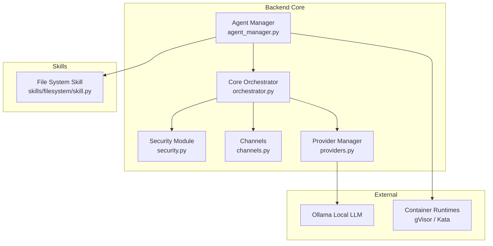
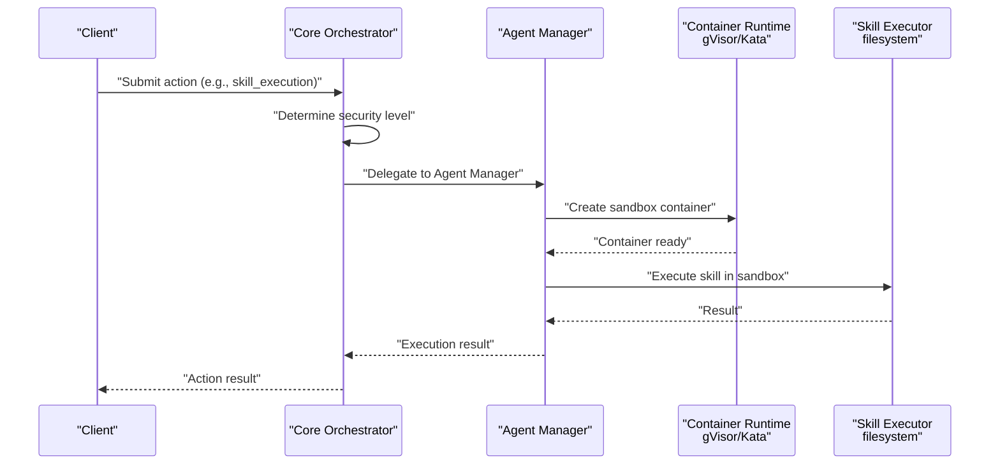
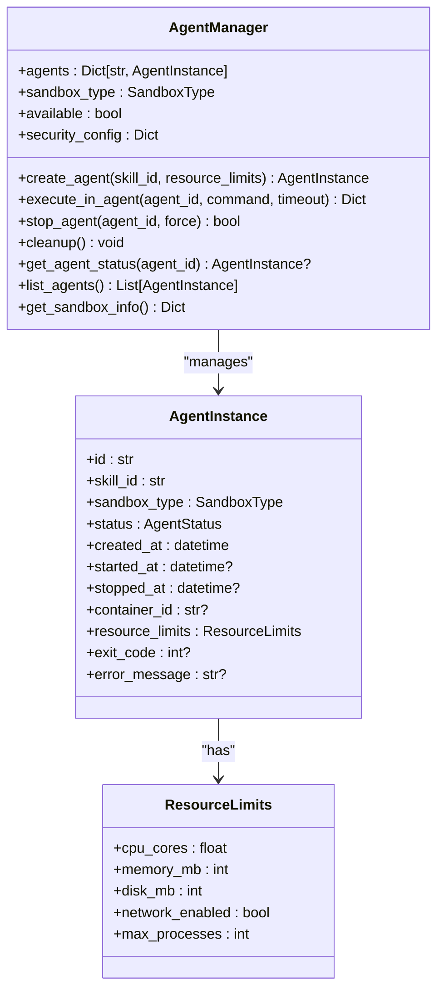
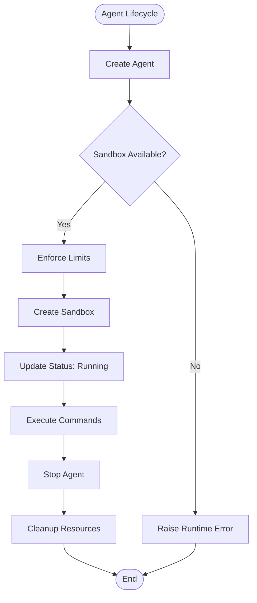
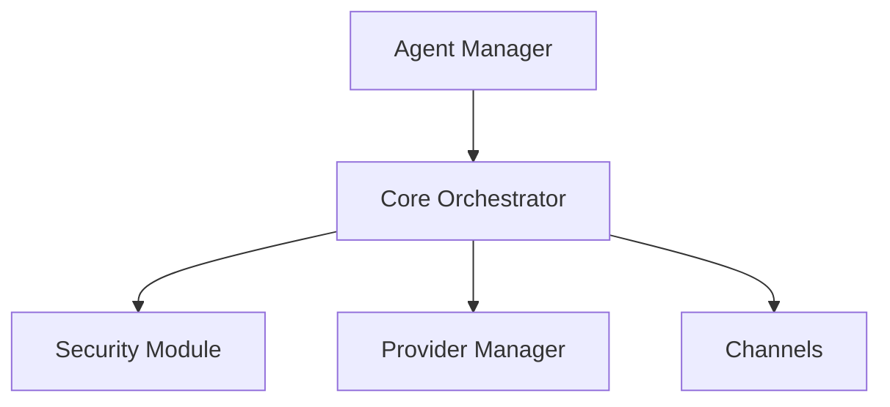

# Agent Manager

<cite>
**Referenced Files in This Document**
- [agent_manager.py](file://backend/app/core/agent_manager.py)
- [orchestrator.py](file://backend/app/core/orchestrator.py)
- [security.py](file://backend/app/core/security.py)
- [providers.py](file://backend/app/core/providers.py)
- [main.py](file://backend/app/main.py)
- [channels.py](file://backend/app/core/channels.py)
- [skill.py](file://skills/filesystem/skill.py)
</cite>

## Table of Contents
1. [Introduction](#introduction)
2. [Project Structure](#project-structure)
3. [Core Components](#core-components)
4. [Architecture Overview](#architecture-overview)
5. [Detailed Component Analysis](#detailed-component-analysis)
6. [Dependency Analysis](#dependency-analysis)
7. [Performance Considerations](#performance-considerations)
8. [Troubleshooting Guide](#troubleshooting-guide)
9. [Conclusion](#conclusion)
10. [Appendices](#appendices)

## Introduction
This document provides comprehensive documentation for the Agent Manager component responsible for sandbox environment setup and agent orchestration in the SecureSphere AI system. It explains the integration with gVisor and Kata Containers for kernel-level isolation, resource limits and security boundary enforcement, agent lifecycle management, sandbox configuration, container orchestration, and security policy enforcement. It also covers the agent spawning process, resource allocation, monitoring capabilities, integration with the Core Orchestrator for action delegation and security approvals, practical examples, security hardening measures, audit logging, troubleshooting procedures, performance optimization, scaling considerations, and security compliance requirements for the sandboxed execution environment.

## Project Structure
The Agent Manager resides in the backend core module and integrates with the Core Orchestrator, security modules, provider management, and channels. The skills directory contains skill executors that operate within sandboxed agents.

**Diagram sources**
- [agent_manager.py](file://backend/app/core/agent_manager.py#L65-L708)
- [orchestrator.py](file://backend/app/core/orchestrator.py#L87-L486)
- [security.py](file://backend/app/core/security.py#L35-L455)
- [providers.py](file://backend/app/core/providers.py#L418-L545)
- [channels.py](file://backend/app/core/channels.py#L405-L524)
- [skill.py](file://skills/filesystem/skill.py#L35-L483)

**Section sources**
- [agent_manager.py](file://backend/app/core/agent_manager.py#L65-L708)
- [orchestrator.py](file://backend/app/core/orchestrator.py#L87-L486)
- [providers.py](file://backend/app/core/providers.py#L418-L545)
- [channels.py](file://backend/app/core/channels.py#L405-L524)
- [skill.py](file://skills/filesystem/skill.py#L35-L483)

## Core Components
- Agent Manager: Creates, manages, and monitors sandboxed agents using gVisor or Kata Containers. Implements resource limits, security policies, and lifecycle controls.
- Core Orchestrator: Central coordinator that delegates actions to the Agent Manager, enforces security levels, and maintains audit logs.
- Security Module: Provides prompt injection defense, rate limiting, and encrypted data vault.
- Provider Manager: Manages multiple LLM providers (Ollama, OpenAI, Anthropic, Google, Mistral).
- Channels: Multi-channel gateway for Telegram, Discord, Slack, Matrix, Web UI, and CLI.
- Skills: Executable skill modules (e.g., File System) that operate within sandboxed agents.

**Section sources**
- [agent_manager.py](file://backend/app/core/agent_manager.py#L65-L708)
- [orchestrator.py](file://backend/app/core/orchestrator.py#L87-L486)
- [security.py](file://backend/app/core/security.py#L35-L455)
- [providers.py](file://backend/app/core/providers.py#L418-L545)
- [channels.py](file://backend/app/core/channels.py#L405-L524)
- [skill.py](file://skills/filesystem/skill.py#L35-L483)

## Architecture Overview
The Agent Manager operates within a Zero-Trust architecture. The Core Orchestrator determines action security levels and delegates skill execution to the Agent Manager, which provisions sandboxed containers with strict resource limits and security policies. The system logs all actions for audit and supports human-in-the-loop approvals for high-risk actions.

**Diagram sources**
- [orchestrator.py](file://backend/app/core/orchestrator.py#L169-L224)
- [agent_manager.py](file://backend/app/core/agent_manager.py#L149-L192)
- [agent_manager.py](file://backend/app/core/agent_manager.py#L194-L201)
- [agent_manager.py](file://backend/app/core/agent_manager.py#L203-L261)
- [agent_manager.py](file://backend/app/core/agent_manager.py#L475-L537)
- [skill.py](file://skills/filesystem/skill.py#L35-L483)

## Detailed Component Analysis

### Agent Manager
The Agent Manager is the central component for sandboxed agent lifecycle management. It detects available sandbox runtimes (gVisor or Kata), creates sandboxed containers, executes commands inside agents, and stops agents with graceful or forced termination. It enforces security configurations, resource limits, and maintains agent state.

Key responsibilities:
- Runtime detection and availability checks
- Sandbox creation for gVisor and Kata Containers
- Resource limit enforcement (CPU, memory, disk, processes)
- Command execution within sandboxed agents
- Agent lifecycle management (create, execute, stop)
- Monitoring and status reporting

**Diagram sources**
- [agent_manager.py](file://backend/app/core/agent_manager.py#L65-L708)
- [agent_manager.py](file://backend/app/core/agent_manager.py#L39-L63)
- [agent_manager.py](file://backend/app/core/agent_manager.py#L40-L47)

**Section sources**
- [agent_manager.py](file://backend/app/core/agent_manager.py#L65-L708)

#### Sandbox Runtime Detection and Availability
The Agent Manager automatically detects available sandbox runtimes and sets the preferred runtime. It performs availability checks for gVisor and Kata Containers and initializes security configurations accordingly.

- Runtime detection order: gVisor first, then Kata Containers
- Availability checks use subprocess calls to verify runtime presence
- Security configuration includes defaults for CPU/memory/disk limits, agent caps, timeouts, and escape detection

**Section sources**
- [agent_manager.py](file://backend/app/core/agent_manager.py#L99-L147)
- [agent_manager.py](file://backend/app/core/agent_manager.py#L86-L94)

#### Sandbox Creation (gVisor)
For gVisor, the Agent Manager prepares an OCI bundle with a minimal rootfs, creates a config.json with strict capabilities and seccomp filters, and launches the container using runsc. It ensures read-only rootfs, masked paths, and resource quotas.

Key steps:
- Prepare sandbox directory and rootfs structure
- Create OCI config with process user, environment, mounts, and seccomp
- Launch container via runsc create/start
- Set container_id and track status

**Section sources**
- [agent_manager.py](file://backend/app/core/agent_manager.py#L194-L261)
- [agent_manager.py](file://backend/app/core/agent_manager.py#L203-L261)
- [agent_manager.py](file://backend/app/core/agent_manager.py#L295-L308)
- [agent_manager.py](file://backend/app/core/agent_manager.py#L309-L473)

#### Sandbox Creation (Kata Containers)
For Kata Containers, the Agent Manager uses Docker/Podman as the frontend to create containers with strict isolation. It applies CPU, memory, and network isolation, read-only rootfs, and tmpfs for temporary files.

Key steps:
- Construct docker run command with runtime, resource limits, and security flags
- Start detached container and record container_id
- Enforce network isolation and read-only filesystem

**Section sources**
- [agent_manager.py](file://backend/app/core/agent_manager.py#L262-L294)
- [agent_manager.py](file://backend/app/core/agent_manager.py#L267-L280)

#### Agent Lifecycle Management
The Agent Manager handles agent lifecycle from creation to cleanup:
- Creation: Validates sandbox availability, enforces agent limits, creates sandbox, updates status
- Execution: Executes commands via runsc or docker exec with timeouts
- Stopping: Graceful TERM then KILL if needed, deletes containers
- Cleanup: Stops all agents and clears state

**Diagram sources**
- [agent_manager.py](file://backend/app/core/agent_manager.py#L149-L192)
- [agent_manager.py](file://backend/app/core/agent_manager.py#L586-L627)
- [agent_manager.py](file://backend/app/core/agent_manager.py#L660-L668)

**Section sources**
- [agent_manager.py](file://backend/app/core/agent_manager.py#L149-L192)
- [agent_manager.py](file://backend/app/core/agent_manager.py#L586-L627)
- [agent_manager.py](file://backend/app/core/agent_manager.py#L660-L668)

#### Resource Limits and Security Policies
The Agent Manager enforces strict resource limits and security policies:
- CPU shares/quota and memory limits via Linux cgroups
- Disk quotas and process limits
- Seccomp filters and capability drops for gVisor
- Masked and readonly paths for container isolation
- No network access by default for Kata
- Read-only rootfs and tmpfs for ephemeral storage

**Section sources**
- [agent_manager.py](file://backend/app/core/agent_manager.py#L40-L47)
- [agent_manager.py](file://backend/app/core/agent_manager.py#L354-L367)
- [agent_manager.py](file://backend/app/core/agent_manager.py#L376-L391)
- [agent_manager.py](file://backend/app/core/agent_manager.py#L273-L278)

#### Integration with Core Orchestrator
The Core Orchestrator delegates skill execution to the Agent Manager and enforces security levels. The Agent Manager returns execution results and status updates to the Orchestrator, which logs audit events and coordinates approvals.

- Orchestrator determines security level and approves actions
- Orchestrator delegates skill execution to Agent Manager
- Agent Manager executes skill in sandbox and returns results
- Orchestrator logs audit events and updates action status

**Section sources**
- [orchestrator.py](file://backend/app/core/orchestrator.py#L333-L350)
- [orchestrator.py](file://backend/app/core/orchestrator.py#L251-L302)
- [orchestrator.py](file://backend/app/core/orchestrator.py#L429-L450)
- [agent_manager.py](file://backend/app/core/agent_manager.py#L475-L537)

#### Practical Examples
- Creating an agent with custom resource limits
- Executing a command inside a sandboxed agent
- Stopping an agent gracefully or forcibly
- Listing agents and retrieving sandbox information

These operations demonstrate the Agent Manager’s capabilities for sandboxed execution and lifecycle management.

**Section sources**
- [agent_manager.py](file://backend/app/core/agent_manager.py#L149-L192)
- [agent_manager.py](file://backend/app/core/agent_manager.py#L475-L537)
- [agent_manager.py](file://backend/app/core/agent_manager.py#L586-L627)
- [agent_manager.py](file://backend/app/core/agent_manager.py#L670-L696)

### Security Hardening Measures
The Agent Manager integrates with the security module to enforce prompt injection defense, rate limiting, and encrypted storage. It also implements Zero-Trust principles by validating inputs, enforcing strict isolation, and logging all actions.

- Prompt injection defense with pattern matching and sanitization
- Rate limiting to prevent abuse
- Encrypted data vault for secrets
- Audit logging for all actions and security events

**Section sources**
- [security.py](file://backend/app/core/security.py#L35-L455)
- [orchestrator.py](file://backend/app/core/orchestrator.py#L429-L450)

### Monitoring and Audit Logging
The Agent Manager tracks agent status, timestamps, and errors. The Core Orchestrator maintains audit logs for all system actions, including approvals and outcomes. These logs support forensic analysis and compliance auditing.

- Agent status tracking (pending, creating, running, paused, stopping, stopped, error)
- Timestamps for creation, start, and stop events
- Error messages and exit codes for diagnostics
- Audit logs with timestamps, action types, statuses, and outcomes

**Section sources**
- [agent_manager.py](file://backend/app/core/agent_manager.py#L28-L37)
- [agent_manager.py](file://backend/app/core/agent_manager.py#L56-L62)
- [agent_manager.py](file://backend/app/core/agent_manager.py#L670-L696)
- [orchestrator.py](file://backend/app/core/orchestrator.py#L59-L70)
- [orchestrator.py](file://backend/app/core/orchestrator.py#L429-L450)

### Skill Execution Coordination
Skills operate within sandboxed agents. The File System skill demonstrates sandboxed operations with path validation, extension whitelisting, size limits, and audit logging. The Agent Manager executes skill modules inside isolated containers.

- Path traversal prevention and sandbox restrictions
- Whitelisted file extensions and size limits
- Audit trails for all operations
- Integration with Agent Manager for sandboxed execution

**Section sources**
- [skill.py](file://skills/filesystem/skill.py#L35-L483)
- [agent_manager.py](file://backend/app/core/agent_manager.py#L475-L537)

## Dependency Analysis
The Agent Manager depends on container runtimes (gVisor/Kata), the Core Orchestrator for action delegation, and the security module for input validation and audit logging. The Orchestrator coordinates with provider management and channels.

**Diagram sources**
- [agent_manager.py](file://backend/app/core/agent_manager.py#L65-L708)
- [orchestrator.py](file://backend/app/core/orchestrator.py#L87-L486)
- [security.py](file://backend/app/core/security.py#L35-L455)
- [providers.py](file://backend/app/core/providers.py#L418-L545)
- [channels.py](file://backend/app/core/channels.py#L405-L524)

**Section sources**
- [agent_manager.py](file://backend/app/core/agent_manager.py#L65-L708)
- [orchestrator.py](file://backend/app/core/orchestrator.py#L87-L486)
- [security.py](file://backend/app/core/security.py#L35-L455)
- [providers.py](file://backend/app/core/providers.py#L418-L545)
- [channels.py](file://backend/app/core/channels.py#L405-L524)

## Performance Considerations
- Choose gVisor for stronger isolation with moderate overhead; Kata for near-native performance with kernel-level isolation
- Tune CPU shares and memory limits based on workload characteristics
- Use read-only rootfs and tmpfs to reduce I/O overhead
- Monitor agent counts and resource utilization to avoid contention
- Implement timeouts for long-running commands to prevent resource exhaustion

[No sources needed since this section provides general guidance]

## Troubleshooting Guide
Common issues and resolutions:
- Sandbox runtime not available: Install gVisor or Kata Containers and verify versions
- Agent creation failures: Check OCI bundle preparation and config.json correctness
- Execution timeouts: Increase timeouts or optimize resource limits
- Permission errors: Verify seccomp filters and capability drops
- Audit log analysis: Review Orchestrator audit logs for action outcomes and errors

**Section sources**
- [agent_manager.py](file://backend/app/core/agent_manager.py#L115-L139)
- [agent_manager.py](file://backend/app/core/agent_manager.py#L186-L190)
- [agent_manager.py](file://backend/app/core/agent_manager.py#L520-L537)
- [orchestrator.py](file://backend/app/core/orchestrator.py#L429-L450)

## Conclusion
The Agent Manager provides robust sandboxed execution using gVisor and Kata Containers, enforcing strict resource limits and security boundaries. It integrates tightly with the Core Orchestrator for action delegation, security approvals, and audit logging. With comprehensive monitoring, security hardening, and practical examples, it enables secure, scalable, and compliant sandboxed execution environments.

[No sources needed since this section summarizes without analyzing specific files]

## Appendices

### API Definitions
- Agent creation: POST /api/actions with action_type “skill_execution”
- Agent execution: Execute commands within sandboxed agents
- Agent lifecycle: Stop agents gracefully or forcibly
- Status and audit: Retrieve agent status and Orchestrator audit logs

**Section sources**
- [main.py](file://backend/app/main.py#L241-L262)
- [main.py](file://backend/app/main.py#L301-L319)
- [main.py](file://backend/app/main.py#L322-L339)
- [orchestrator.py](file://backend/app/core/orchestrator.py#L455-L461)