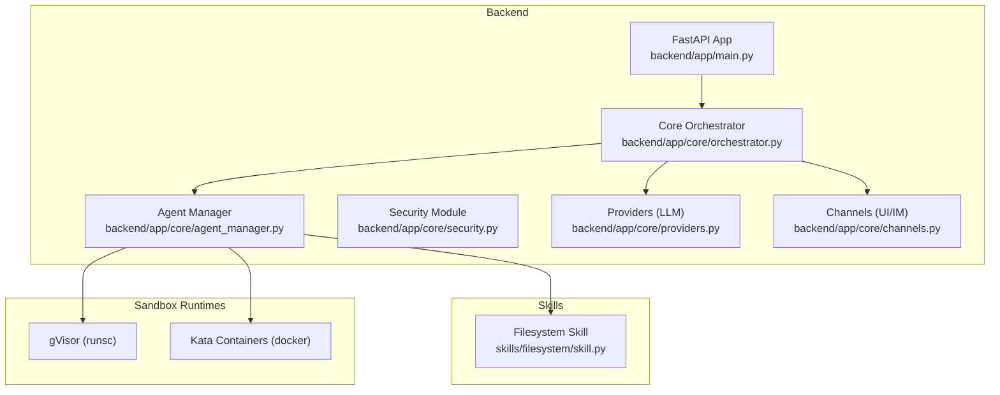
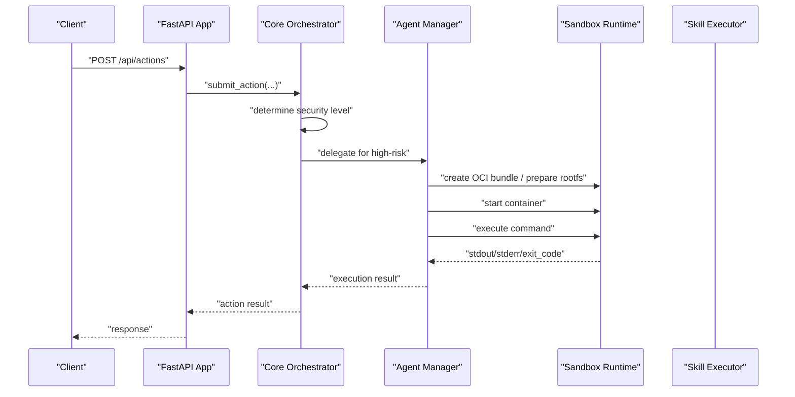
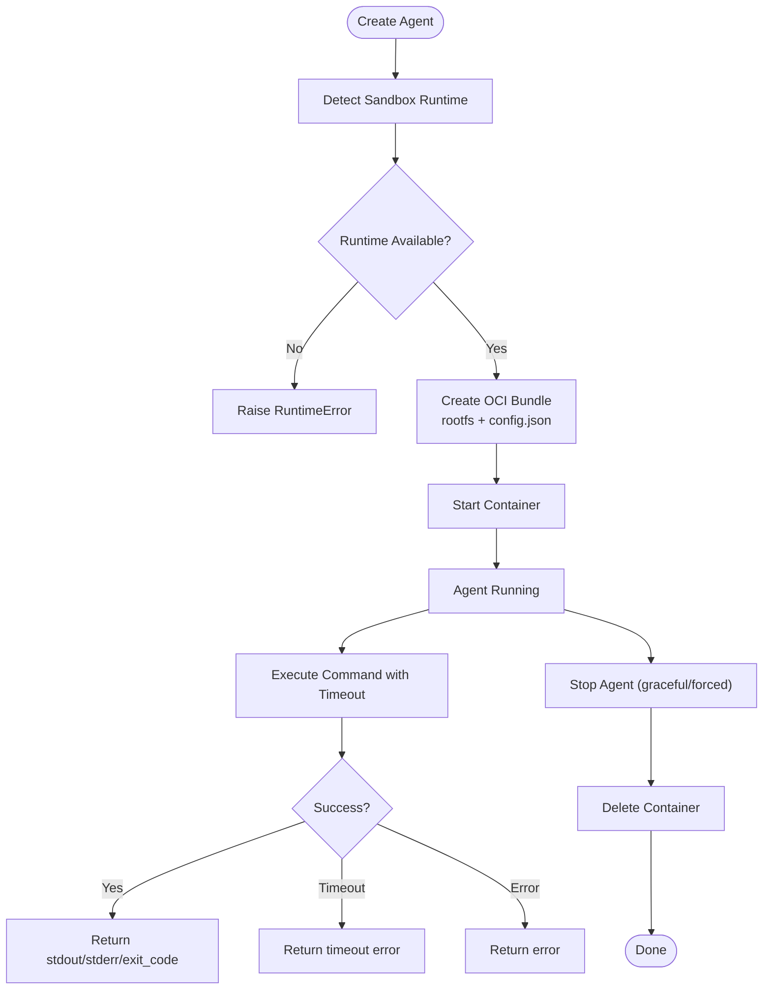
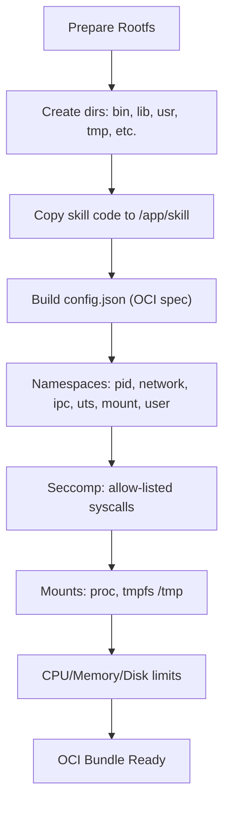
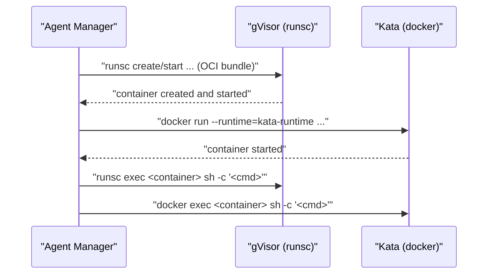
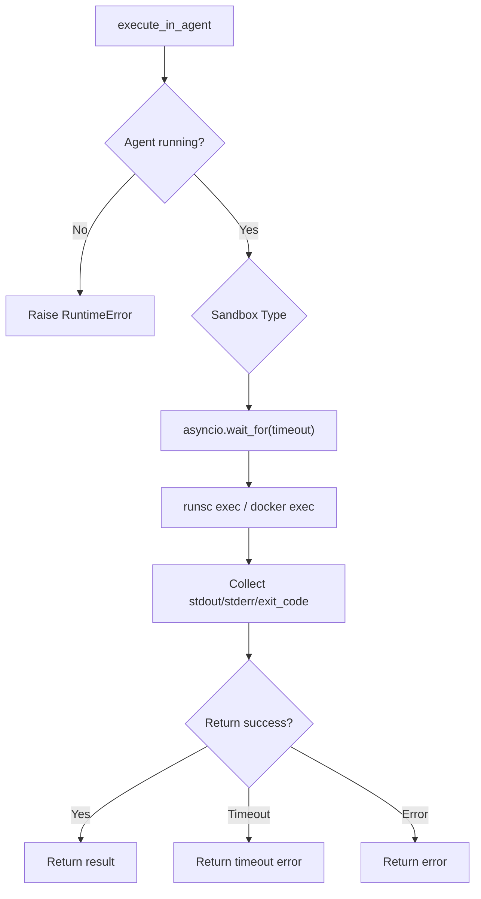
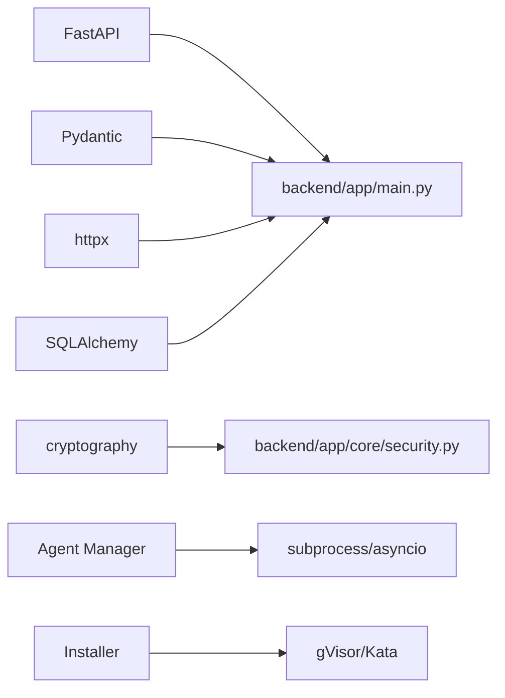

# Container Execution

<cite>
**Referenced Files in This Document**
- [README.md](file://README.md)
- [backend/app/main.py](file://backend/app/main.py)
- [backend/app/core/orchestrator.py](file://backend/app/core/orchestrator.py)
- [backend/app/core/agent_manager.py](file://backend/app/core/agent_manager.py)
- [backend/app/core/security.py](file://backend/app/core/security.py)
- [backend/app/core/providers.py](file://backend/app/core/providers.py)
- [backend/app/core/channels.py](file://backend/app/core/channels.py)
- [skills/filesystem/skill.py](file://skills/filesystem/skill.py)
- [backend/requirements.txt](file://backend/requirements.txt)
- [installer/install.sh](file://installer/install.sh)
- [installer/install.ps1](file://installer/install.ps1)
</cite>

## Table of Contents
1. [Introduction](#introduction)
2. [Project Structure](#project-structure)
3. [Core Components](#core-components)
4. [Architecture Overview](#architecture-overview)
5. [Detailed Component Analysis](#detailed-component-analysis)
6. [Dependency Analysis](#dependency-analysis)
7. [Performance Considerations](#performance-considerations)
8. [Troubleshooting Guide](#troubleshooting-guide)
9. [Conclusion](#conclusion)
10. [Appendices](#appendices)

## Introduction
This document explains how ClosedPaw executes containerized skills using hardened sandboxing. It covers the container creation process (OCI bundle preparation, rootfs setup, runtime configuration), execution commands for gVisor and Kata Containers, process isolation, inter-container communication, and the command execution workflow including timeouts, output capture, and error propagation. It also provides practical examples, debugging guidance, performance monitoring, security considerations, and a comparison of gVisor versus Kata execution models.

## Project Structure
The system is organized around a FastAPI backend that orchestrates actions, manages sandboxed agents, validates inputs, and exposes multi-provider LLM capabilities. Skills are executed inside isolated containers using either gVisor or Kata Containers.

**Diagram sources**
- [backend/app/main.py](file://backend/app/main.py#L72-L78)
- [backend/app/core/orchestrator.py](file://backend/app/core/orchestrator.py#L87-L110)
- [backend/app/core/agent_manager.py](file://backend/app/core/agent_manager.py#L65-L98)
- [backend/app/core/security.py](file://backend/app/core/security.py#L35-L107)
- [backend/app/core/providers.py](file://backend/app/core/providers.py#L418-L456)
- [backend/app/core/channels.py](file://backend/app/core/channels.py#L405-L443)
- [skills/filesystem/skill.py](file://skills/filesystem/skill.py#L35-L75)

**Section sources**
- [README.md](file://README.md#L13-L25)
- [backend/app/main.py](file://backend/app/main.py#L72-L78)

## Core Components
- Core Orchestrator: central action lifecycle, security levels, audit logging, and delegation to Agent Manager for sandboxed skill execution.
- Agent Manager: creates and manages sandboxed agents, selects runtime (gVisor or Kata), prepares OCI bundles/rootfs, executes commands, and enforces resource limits.
- Security Module: prompt injection defense, rate limiting, and encrypted data vault.
- Providers: multi-provider LLM gateway (Ollama, OpenAI, Anthropic, Google, Mistral).
- Channels: multi-channel messaging interface (Web UI, Telegram, Discord, Slack, CLI).
- Skills: modular executors (e.g., filesystem) executed in sandboxed containers.

**Section sources**
- [backend/app/core/orchestrator.py](file://backend/app/core/orchestrator.py#L87-L110)
- [backend/app/core/agent_manager.py](file://backend/app/core/agent_manager.py#L65-L98)
- [backend/app/core/security.py](file://backend/app/core/security.py#L35-L107)
- [backend/app/core/providers.py](file://backend/app/core/providers.py#L418-L456)
- [backend/app/core/channels.py](file://backend/app/core/channels.py#L405-L443)
- [skills/filesystem/skill.py](file://skills/filesystem/skill.py#L35-L75)

## Architecture Overview
The system integrates a zero-trust security model with sandboxed execution. Actions are submitted to the orchestrator, which determines security level and either auto-executes or waits for Human-in-the-Loop approval. High-risk actions are delegated to the Agent Manager, which provisions a sandboxed container (gVisor or Kata) and executes the requested skill command with strict resource and capability controls.

**Diagram sources**
- [backend/app/main.py](file://backend/app/main.py#L241-L262)
- [backend/app/core/orchestrator.py](file://backend/app/core/orchestrator.py#L169-L223)
- [backend/app/core/agent_manager.py](file://backend/app/core/agent_manager.py#L149-L192)
- [backend/app/core/agent_manager.py](file://backend/app/core/agent_manager.py#L475-L537)

## Detailed Component Analysis

### Agent Manager: Sandbox Creation and Execution
The Agent Manager detects available sandbox runtime (gVisor preferred, Kata as fallback), creates OCI bundles with minimal rootfs, applies strict Linux namespaces and seccomp filters, and executes commands with timeouts and resource limits.

Key responsibilities:
- Runtime detection and availability checks
- OCI bundle creation and rootfs preparation
- Container start and stop with graceful and forced termination
- Command execution with timeout handling and output capture
- Resource limits enforcement (CPU, memory, disk, processes)

**Diagram sources**
- [backend/app/core/agent_manager.py](file://backend/app/core/agent_manager.py#L99-L147)
- [backend/app/core/agent_manager.py](file://backend/app/core/agent_manager.py#L194-L201)
- [backend/app/core/agent_manager.py](file://backend/app/core/agent_manager.py#L475-L537)

**Section sources**
- [backend/app/core/agent_manager.py](file://backend/app/core/agent_manager.py#L65-L98)
- [backend/app/core/agent_manager.py](file://backend/app/core/agent_manager.py#L194-L201)
- [backend/app/core/agent_manager.py](file://backend/app/core/agent_manager.py#L203-L294)
- [backend/app/core/agent_manager.py](file://backend/app/core/agent_manager.py#L475-L537)
- [backend/app/core/agent_manager.py](file://backend/app/core/agent_manager.py#L586-L658)

### OCI Bundle Preparation and Rootfs Setup
The Agent Manager prepares an OCI-compliant bundle with:
- Minimal rootfs structure
- Skill code copied into the bundle
- config.json with process args, environment, mounts, namespaces, masked paths, readonly paths, and seccomp syscall policy
- Strict resource limits and no-new-privileges

**Diagram sources**
- [backend/app/core/agent_manager.py](file://backend/app/core/agent_manager.py#L295-L308)
- [backend/app/core/agent_manager.py](file://backend/app/core/agent_manager.py#L309-L473)

**Section sources**
- [backend/app/core/agent_manager.py](file://backend/app/core/agent_manager.py#L295-L308)
- [backend/app/core/agent_manager.py](file://backend/app/core/agent_manager.py#L309-L473)

### Execution Commands: gVisor vs Kata Containers
- gVisor: uses runsc with debug logging and strace; creates and starts containers via OCI bundle.
- Kata: uses docker with kata-runtime; runs with read-only rootfs, no network, and tmpfs for /tmp.

**Diagram sources**
- [backend/app/core/agent_manager.py](file://backend/app/core/agent_manager.py#L224-L260)
- [backend/app/core/agent_manager.py](file://backend/app/core/agent_manager.py#L266-L293)
- [backend/app/core/agent_manager.py](file://backend/app/core/agent_manager.py#L539-L584)

**Section sources**
- [backend/app/core/agent_manager.py](file://backend/app/core/agent_manager.py#L224-L260)
- [backend/app/core/agent_manager.py](file://backend/app/core/agent_manager.py#L266-L293)
- [backend/app/core/agent_manager.py](file://backend/app/core/agent_manager.py#L539-L584)

### Command Execution Workflow: Timeout, Output Capture, Error Propagation
- The Agent Manager executes commands with asyncio.wait_for and a configurable timeout.
- Output is captured from stdout/stderr and returned with exit code.
- Errors are caught and returned with a failure flag and error message.

**Diagram sources**
- [backend/app/core/agent_manager.py](file://backend/app/core/agent_manager.py#L475-L537)

**Section sources**
- [backend/app/core/agent_manager.py](file://backend/app/core/agent_manager.py#L475-L537)

### Inter-Container Communication
- By default, Kata containers are started with no network (--network none).
- gVisor containers inherit the host network namespace unless configured otherwise in the OCI config.
- For secure isolation, network access is disabled for Kata; gVisor relies on seccomp and masked paths.

Practical implication: inter-container communication is not enabled by default. If needed, adjust runtime configuration and network policies accordingly.

**Section sources**
- [backend/app/core/agent_manager.py](file://backend/app/core/agent_manager.py#L275-L277)
- [backend/app/core/agent_manager.py](file://backend/app/core/agent_manager.py#L368-L375)

### Practical Examples
- Creating a sandboxed agent for a filesystem skill and executing a read operation:
  - Use the Agent Manager to create an agent with a skill_id and resource limits.
  - Execute a shell command inside the sandbox using execute_in_agent with a timeout.
  - Inspect stdout/stderr/exit_code in the returned result.

- Debugging execution failures:
  - Check Agent Manager logs for container creation/start errors.
  - Review runsc debug logs if using gVisor.
  - Validate OCI config.json and rootfs structure.

- Performance monitoring:
  - Monitor CPU/memory/disk limits via the Agent Manager’s resource limits.
  - Track latency and tokens via the multi-provider LLM gateway.

**Section sources**
- [backend/app/core/agent_manager.py](file://backend/app/core/agent_manager.py#L149-L192)
- [backend/app/core/agent_manager.py](file://backend/app/core/agent_manager.py#L475-L537)
- [backend/app/core/providers.py](file://backend/app/core/providers.py#L109-L143)

### Security Considerations
- Zero-trust architecture: all actions are audited and may require Human-in-the-Loop approval.
- Prompt injection defense: regex-based detection and sanitization with rate limiting.
- Encrypted data vault: secrets are stored and accessed with access control.
- Sandboxing: gVisor or Kata Containers with strict namespaces, masked paths, seccomp, and resource limits.
- Network isolation: disabled by default for Kata; gVisor relies on syscall filtering.

**Section sources**
- [README.md](file://README.md#L65-L105)
- [backend/app/core/security.py](file://backend/app/core/security.py#L35-L107)
- [backend/app/core/security.py](file://backend/app/core/security.py#L325-L434)
- [backend/app/core/agent_manager.py](file://backend/app/core/agent_manager.py#L368-L473)

### Differences Between gVisor and Kata Execution Models
- gVisor:
  - Kernel-mode emulation with userspace kernel; strong isolation.
  - Uses runsc with OCI bundle; supports debug logging and strace.
  - Syscall filtering via seccomp; masked/readonly paths; no network by default in OCI config.
- Kata Containers:
  - VM-based isolation with lightweight VMs; slower boot but stronger isolation.
  - Uses docker with kata-runtime; read-only rootfs and tmpfs for /tmp.
  - Network disabled by default; can be configured if needed.

Advantages and limitations:
- gVisor: lower overhead, faster startup, easier integration with existing container tooling; still requires careful seccomp and namespace configuration.
- Kata: stronger isolation, VM-level separation; higher overhead and slower startup; requires VM runtime.

**Section sources**
- [backend/app/core/agent_manager.py](file://backend/app/core/agent_manager.py#L203-L294)
- [backend/app/core/agent_manager.py](file://backend/app/core/agent_manager.py#L309-L473)
- [README.md](file://README.md#L19-L24)

## Dependency Analysis
The backend depends on FastAPI, Pydantic, httpx, cryptography, and SQLAlchemy. The Agent Manager depends on subprocess and asyncio for container orchestration. The installer configures sandbox runtimes and sets up platform-specific sandboxing.

**Diagram sources**
- [backend/requirements.txt](file://backend/requirements.txt#L4-L36)
- [backend/app/main.py](file://backend/app/main.py#L10-L17)
- [backend/app/core/agent_manager.py](file://backend/app/core/agent_manager.py#L7-L17)
- [installer/install.sh](file://installer/install.sh#L191-L270)

**Section sources**
- [backend/requirements.txt](file://backend/requirements.txt#L4-L36)
- [backend/app/main.py](file://backend/app/main.py#L10-L17)
- [installer/install.sh](file://installer/install.sh#L191-L270)

## Performance Considerations
- gVisor vs Kata trade-offs: choose gVisor for lower overhead and faster startup; choose Kata for stronger isolation when latency is less critical.
- Resource limits: tune CPU shares, memory limits, and process counts per agent to balance performance and safety.
- OCI config: minimize mounted filesystems and syscalls to reduce overhead.
- Monitoring: track latency and tokens via the multi-provider LLM gateway; monitor container resource usage externally.

[No sources needed since this section provides general guidance]

## Troubleshooting Guide
Common issues and resolutions:
- Sandbox runtime not available:
  - Ensure runsc is installed and accessible for gVisor, or kata-runtime for Kata.
  - On macOS, configure Docker Desktop with gVisor runtime.
- Container creation/start failures:
  - Check OCI bundle structure and config.json correctness.
  - Review runsc debug logs for gVisor.
- Command timeouts:
  - Increase timeout in execute_in_agent or optimize the command.
- Permission errors:
  - Verify seccomp policy allows required syscalls.
  - Confirm user namespaces and capabilities are restricted as intended.

**Section sources**
- [installer/install.sh](file://installer/install.sh#L191-L270)
- [installer/install.ps1](file://installer/install.ps1#L218-L251)
- [backend/app/core/agent_manager.py](file://backend/app/core/agent_manager.py#L115-L139)
- [backend/app/core/agent_manager.py](file://backend/app/core/agent_manager.py#L224-L260)
- [backend/app/core/agent_manager.py](file://backend/app/core/agent_manager.py#L520-L528)

## Conclusion
ClosedPaw’s container execution model combines a zero-trust orchestrator with hardened sandboxing using gVisor or Kata Containers. The Agent Manager prepares OCI bundles, enforces strict isolation and resource limits, and executes commands with robust timeout handling and error reporting. The system emphasizes security, auditability, and flexibility across platforms, with practical guidance for installation, debugging, and performance tuning.

[No sources needed since this section summarizes without analyzing specific files]

## Appendices

### API Definitions: Sandbox and Execution
- Create Agent: POST /api/actions with action_type “skill_execution” and skill_id; orchestrator delegates to Agent Manager.
- Execute Command: execute_in_agent(agent_id, command, timeout) returns stdout, stderr, exit_code.
- Status and Logs: GET /api/status, GET /api/audit-logs.

**Section sources**
- [backend/app/main.py](file://backend/app/main.py#L241-L262)
- [backend/app/core/agent_manager.py](file://backend/app/core/agent_manager.py#L475-L537)
- [backend/app/core/orchestrator.py](file://backend/app/core/orchestrator.py#L459-L461)

### Installer Notes: Sandbox Availability
- Linux/macOS: installer configures gVisor by default; verifies runsc availability.
- Windows: limited sandboxing without Hyper-V or Docker Desktop; installer warns about reduced isolation.

**Section sources**
- [installer/install.sh](file://installer/install.sh#L272-L287)
- [installer/install.ps1](file://installer/install.ps1#L218-L251)