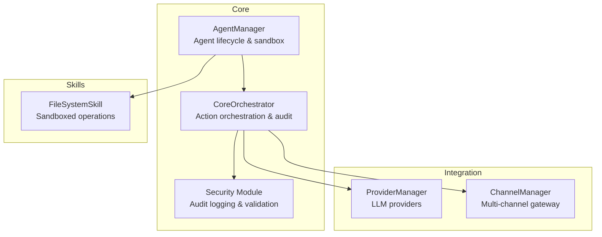
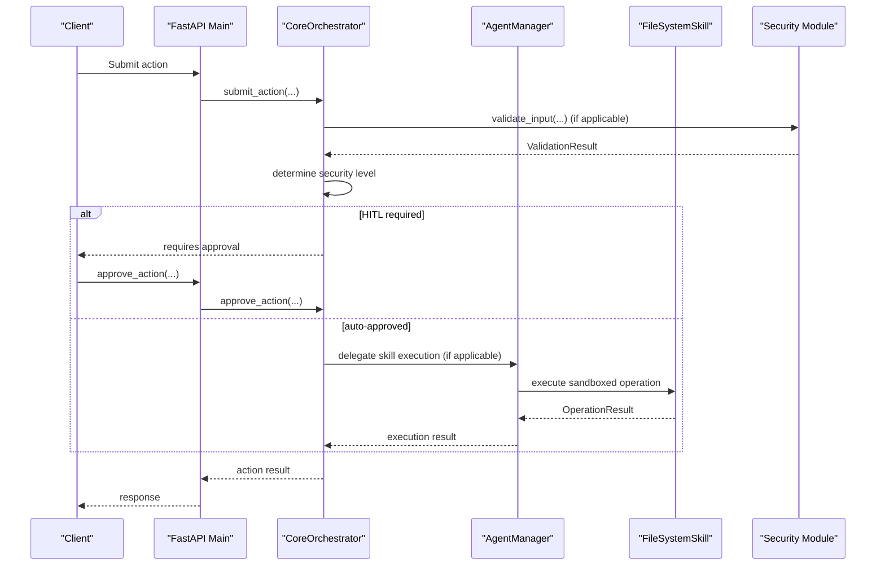
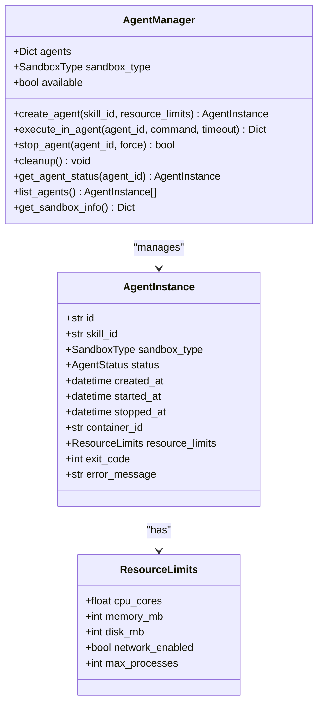
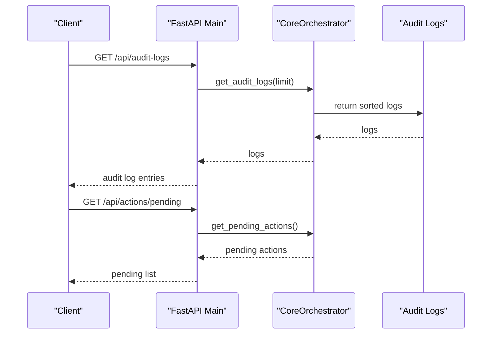
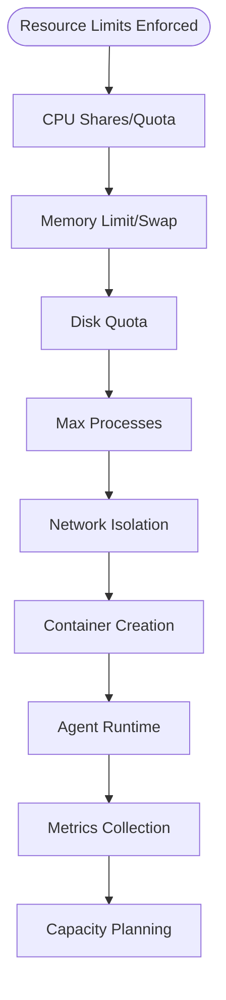
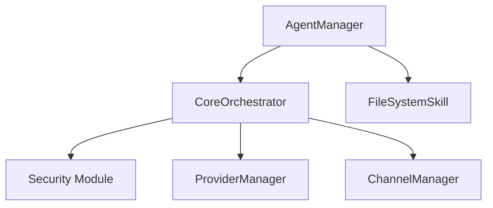

# Monitoring and Maintenance

<cite>
**Referenced Files in This Document**
- [agent_manager.py](file://backend/app/core/agent_manager.py)
- [orchestrator.py](file://backend/app/core/orchestrator.py)
- [main.py](file://backend/app/main.py)
- [channels.py](file://backend/app/core/channels.py)
- [providers.py](file://backend/app/core/providers.py)
- [security.py](file://backend/app/core/security.py)
- [skill.py](file://skills/filesystem/skill.py)
- [README.md](file://README.md)
</cite>

## Table of Contents
1. [Introduction](#introduction)
2. [Project Structure](#project-structure)
3. [Core Components](#core-components)
4. [Architecture Overview](#architecture-overview)
5. [Detailed Component Analysis](#detailed-component-analysis)
6. [Dependency Analysis](#dependency-analysis)
7. [Performance Considerations](#performance-considerations)
8. [Troubleshooting Guide](#troubleshooting-guide)
9. [Conclusion](#conclusion)
10. [Appendices](#appendices)

## Introduction
This document focuses on monitoring and maintenance operations for agent lifecycle management, system health, resource tracking, and administrative functions. It explains how the agent status monitoring system works, how resource utilization is tracked, and how performance metrics are collected. It also documents cleanup procedures for stopping agents, releasing resources, and maintaining system hygiene. Practical examples demonstrate monitoring agent health, identifying resource bottlenecks, and performing maintenance tasks. Automated cleanup strategies, emergency shutdown procedures, and system recovery operations are covered, along with integration points for external monitoring systems and alerting mechanisms.

## Project Structure
The monitoring and maintenance functionality spans several core modules:
- Agent lifecycle and sandbox orchestration
- System-wide action orchestration and auditing
- Provider and channel management
- Security and audit logging
- Skill sandboxing and resource constraints

**Diagram sources**
- [agent_manager.py](file://backend/app/core/agent_manager.py#L65-L696)
- [orchestrator.py](file://backend/app/core/orchestrator.py#L87-L474)
- [providers.py](file://backend/app/core/providers.py#L418-L524)
- [channels.py](file://backend/app/core/channels.py#L405-L502)
- [security.py](file://backend/app/core/security.py#L325-L435)
- [skill.py](file://skills/filesystem/skill.py#L35-L465)

**Section sources**
- [README.md](file://README.md#L134-L155)
- [main.py](file://backend/app/main.py#L72-L87)

## Core Components
- AgentManager: Creates, runs, and stops sandboxed agents with resource limits and status tracking. Provides sandbox capability detection and agent inventory.
- CoreOrchestrator: Centralized action orchestration with Zero-Trust security, HITL approval gating, and comprehensive audit logging.
- ProviderManager: Manages multiple LLM providers, health checks, and model listings.
- ChannelManager: Multi-channel gateway for Telegram, Discord, Slack, Web UI, and CLI with allowlists and rate limiting.
- Security Module: Input validation, prompt injection defense, rate limiting, and encrypted data vault.
- FileSystemSkill: Sandboxed file system operations with audit logging and sandbox constraints.

**Section sources**
- [agent_manager.py](file://backend/app/core/agent_manager.py#L65-L696)
- [orchestrator.py](file://backend/app/core/orchestrator.py#L87-L474)
- [providers.py](file://backend/app/core/providers.py#L418-L524)
- [channels.py](file://backend/app/core/channels.py#L405-L502)
- [security.py](file://backend/app/core/security.py#L325-L435)
- [skill.py](file://skills/filesystem/skill.py#L35-L465)

## Architecture Overview
The monitoring and maintenance architecture integrates agent lifecycle management with system-wide orchestration and auditing. Agents are created in hardened sandboxed environments and monitored via the AgentManager. Actions are submitted to the CoreOrchestrator, which enforces security policies, performs HITL approvals when required, and logs all actions for audit. Providers and channels are managed centrally, and the security module ensures input validation and encrypted storage.

**Diagram sources**
- [main.py](file://backend/app/main.py#L241-L262)
- [orchestrator.py](file://backend/app/core/orchestrator.py#L169-L223)
- [agent_manager.py](file://backend/app/core/agent_manager.py#L475-L537)
- [skill.py](file://skills/filesystem/skill.py#L133-L208)
- [security.py](file://backend/app/core/security.py#L116-L180)

## Detailed Component Analysis

### Agent Status Monitoring and Lifecycle
AgentManager manages agent creation, execution, and termination with robust status tracking and sandbox capability detection. It exposes APIs to list agents, retrieve sandbox info, and stop agents gracefully or forcibly.

Key capabilities:
- Sandbox detection and availability checks for gVisor/Kata
- Agent creation with resource limits and status transitions
- Execution delegation to sandboxed containers
- Graceful and forced stopping with cleanup
- Inventory and sandbox info retrieval

**Diagram sources**
- [agent_manager.py](file://backend/app/core/agent_manager.py#L65-L696)

Practical monitoring examples:
- Retrieve sandbox info to assess current capacity and agent counts
  - Endpoint: GET /api/status (system status) and internal sandbox info
  - Method: AgentManager.get_sandbox_info()
- List all agents to monitor inventory and statuses
  - Method: AgentManager.list_agents()

Cleanup procedures:
- Stop all agents gracefully, then forcibly if needed
  - Method: AgentManager.cleanup() and AgentManager.stop_agent(force=True)
- Release sandbox resources and container artifacts

**Section sources**
- [agent_manager.py](file://backend/app/core/agent_manager.py#L149-L192)
- [agent_manager.py](file://backend/app/core/agent_manager.py#L586-L627)
- [agent_manager.py](file://backend/app/core/agent_manager.py#L660-L668)
- [agent_manager.py](file://backend/app/core/agent_manager.py#L670-L676)
- [agent_manager.py](file://backend/app/core/agent_manager.py#L678-L696)

### System Health and Audit Logging
CoreOrchestrator centralizes action orchestration with Zero-Trust security, HITL approval gating, and comprehensive audit logging. It maintains a registry of actions, their statuses, and outcomes, enabling system health monitoring and forensic analysis.

Key capabilities:
- Action submission with automatic or HITL approval
- Security level determination based on action type and parameters
- Audit log entries with timestamps, outcomes, and details
- Pending action management and retrieval
- System status reporting

**Diagram sources**
- [main.py](file://backend/app/main.py#L322-L339)
- [main.py](file://backend/app/main.py#L265-L281)
- [orchestrator.py](file://backend/app/core/orchestrator.py#L451-L461)
- [orchestrator.py](file://backend/app/core/orchestrator.py#L459-L461)

Practical monitoring examples:
- View recent audit logs for security events and action outcomes
  - Endpoint: GET /api/audit-logs
  - Method: CoreOrchestrator.get_audit_logs()
- Track pending actions requiring HITL approval
  - Endpoint: GET /api/actions/pending
  - Method: CoreOrchestrator.get_pending_actions()

**Section sources**
- [orchestrator.py](file://backend/app/core/orchestrator.py#L429-L450)
- [orchestrator.py](file://backend/app/core/orchestrator.py#L451-L453)
- [orchestrator.py](file://backend/app/core/orchestrator.py#L459-L461)
- [main.py](file://backend/app/main.py#L322-L339)
- [main.py](file://backend/app/main.py#L265-L281)

### Resource Utilization Tracking and Capacity Planning
AgentManager enforces resource limits at the container level and exposes sandbox information for capacity planning. Skills implement their own sandbox boundaries and constraints.

Key capabilities:
- Per-agent CPU, memory, disk, process limits
- Sandbox capability detection and enforcement
- Agent inventory with current status and sandbox type
- Skill sandbox constraints and audit logging

**Diagram sources**
- [agent_manager.py](file://backend/app/core/agent_manager.py#L39-L47)
- [agent_manager.py](file://backend/app/core/agent_manager.py#L354-L367)
- [agent_manager.py](file://backend/app/core/agent_manager.py#L678-L696)
- [skill.py](file://skills/filesystem/skill.py#L64-L71)

Practical examples:
- Monitor current agent counts versus maximum capacity
  - Method: AgentManager.get_sandbox_info()
- Evaluate sandbox capabilities and availability
  - Methods: AgentManager._detect_sandbox_runtime(), _check_sandbox_availability()
- Assess skill sandbox usage and constraints
  - Method: FileSystemSkill.get_sandbox_info()

**Section sources**
- [agent_manager.py](file://backend/app/core/agent_manager.py#L39-L47)
- [agent_manager.py](file://backend/app/core/agent_manager.py#L354-L367)
- [agent_manager.py](file://backend/app/core/agent_manager.py#L678-L696)
- [skill.py](file://skills/filesystem/skill.py#L446-L465)

### Cleanup Procedures and Emergency Shutdown
The system provides multiple cleanup and shutdown pathways to ensure safe termination of agents and system components.

Cleanup strategies:
- Graceful agent termination with SIGTERM and container deletion
- Forced termination with SIGKILL and cleanup
- System-wide cleanup to stop all agents and clear state
- Provider and channel shutdown routines

Emergency shutdown procedures:
- CoreOrchestrator shutdown waits for executing actions to complete
- ProviderManager and ChannelManager shutdown routines
- AgentManager cleanup to terminate all agents

**Section sources**
- [agent_manager.py](file://backend/app/core/agent_manager.py#L628-L658)
- [agent_manager.py](file://backend/app/core/agent_manager.py#L660-L668)
- [orchestrator.py](file://backend/app/core/orchestrator.py#L463-L474)
- [providers.py](file://backend/app/core/providers.py#L520-L523)
- [channels.py](file://backend/app/core/channels.py#L451-L454)

### Sandbox Information Retrieval and Agent Inventory Management
AgentManager provides sandbox information and agent inventory for operational visibility. This enables administrators to track agent health, resource usage, and sandbox capabilities.

Key methods:
- get_sandbox_info(): Returns sandbox type, availability, max agents, current agents, and agent list
- list_agents(): Returns all agent instances
- get_agent_status(agent_id): Returns a specific agent’s status

**Section sources**
- [agent_manager.py](file://backend/app/core/agent_manager.py#L678-L696)
- [agent_manager.py](file://backend/app/core/agent_manager.py#L674-L676)
- [agent_manager.py](file://backend/app/core/agent_manager.py#L670-L672)

### System Capacity Planning
Capacity planning relies on sandbox information and agent inventory to determine current utilization and available headroom.

Key indicators:
- Current agent count vs. maximum agents
- Sandbox type and availability
- Agent status distribution (running, paused, stopped, error)
- Skill sandbox usage metrics (file count, total size)

**Section sources**
- [agent_manager.py](file://backend/app/core/agent_manager.py#L678-L696)
- [skill.py](file://skills/filesystem/skill.py#L446-L465)

### Integration with External Monitoring Systems and Alerting
While the system includes internal audit logging and sandbox info, integration with external monitoring systems can be achieved via:
- Audit log export endpoints for SIEM ingestion
- System status endpoints for health checks
- Provider health checks for LLM service monitoring
- Channel status endpoints for communication platform monitoring

Recommended integration points:
- Export audit logs via GET /api/audit-logs
- Health checks via GET /api/status and provider/channel endpoints
- Provider health via GET /api/providers/health and GET /api/channels

**Section sources**
- [main.py](file://backend/app/main.py#L101-L128)
- [main.py](file://backend/app/main.py#L448-L453)
- [main.py](file://backend/app/main.py#L466-L504)
- [orchestrator.py](file://backend/app/core/orchestrator.py#L429-L450)

## Dependency Analysis
The monitoring and maintenance components depend on each other in a layered manner:
- AgentManager depends on sandbox runtime availability and resource limits
- CoreOrchestrator depends on AgentManager for skill execution and on Security for input validation
- ProviderManager and ChannelManager provide external integrations and are managed by the main API
- Security module underpins input validation and audit logging

**Diagram sources**
- [agent_manager.py](file://backend/app/core/agent_manager.py#L65-L98)
- [orchestrator.py](file://backend/app/core/orchestrator.py#L93-L108)
- [providers.py](file://backend/app/core/providers.py#L418-L428)
- [channels.py](file://backend/app/core/channels.py#L405-L415)
- [security.py](file://backend/app/core/security.py#L325-L335)

**Section sources**
- [agent_manager.py](file://backend/app/core/agent_manager.py#L65-L98)
- [orchestrator.py](file://backend/app/core/orchestrator.py#L93-L108)
- [providers.py](file://backend/app/core/providers.py#L418-L428)
- [channels.py](file://backend/app/core/channels.py#L405-L415)
- [security.py](file://backend/app/core/security.py#L325-L335)

## Performance Considerations
- Sandbox runtime detection and fallback strategies ensure availability
- Resource limits prevent resource exhaustion and enable fair sharing
- Audit logging and security validation add overhead; tune thresholds and batching for high-throughput scenarios
- Provider and channel health checks should be rate-limited to avoid unnecessary load
- Graceful shutdown waits reduce abrupt termination but may delay system recovery

[No sources needed since this section provides general guidance]

## Troubleshooting Guide
Common issues and resolutions:
- Sandbox runtime not available
  - Symptoms: Agent creation failures
  - Resolution: Install gVisor or Kata Containers; verify runtime availability
  - Methods: AgentManager._detect_sandbox_runtime(), _check_sandbox_availability()
- Agent stuck in error state
  - Symptoms: AgentStatus.ERROR with error_message
  - Resolution: Inspect error_message, restart agent, or cleanup
  - Methods: AgentManager.get_agent_status(), AgentManager.stop_agent(force=True)
- Exceeded maximum agents
  - Symptoms: RuntimeError indicating max agents reached
  - Resolution: Increase max_agents or stop existing agents
  - Methods: AgentManager.get_sandbox_info()
- Provider health issues
  - Symptoms: Provider health checks failing
  - Resolution: Verify credentials and connectivity; retry health checks
  - Methods: ProviderManager.health_check_all()
- Channel communication errors
  - Symptoms: Send failures or unauthorized users
  - Resolution: Check tokens and allowlists; verify channel configuration
  - Methods: ChannelManager.send_message(), ChannelManager.get_status()

**Section sources**
- [agent_manager.py](file://backend/app/core/agent_manager.py#L161-L166)
- [agent_manager.py](file://backend/app/core/agent_manager.py#L186-L190)
- [agent_manager.py](file://backend/app/core/agent_manager.py#L678-L696)
- [providers.py](file://backend/app/core/providers.py#L495-L503)
- [channels.py](file://backend/app/core/channels.py#L462-L468)

## Conclusion
The monitoring and maintenance framework provides comprehensive agent lifecycle management, system health visibility, and robust cleanup procedures. By leveraging sandbox information, audit logs, and structured action orchestration, administrators can effectively monitor agent health, identify resource bottlenecks, and perform maintenance tasks. Integration with external monitoring systems and alerting mechanisms enhances observability and incident response.

[No sources needed since this section summarizes without analyzing specific files]

## Appendices

### Practical Examples Index
- Monitoring agent health
  - Use AgentManager.list_agents() and AgentManager.get_sandbox_info()
- Identifying resource bottlenecks
  - Review AgentManager.get_sandbox_info() for current agent counts and sandbox capabilities
- Performing maintenance tasks
  - Stop agents with AgentManager.stop_agent(force=True)
  - Perform system-wide cleanup with AgentManager.cleanup()
- Emergency shutdown procedures
  - Trigger CoreOrchestrator.shutdown() during system maintenance
- System recovery operations
  - Restart sandbox runtime, reinitialize components, and re-register providers/channels

**Section sources**
- [agent_manager.py](file://backend/app/core/agent_manager.py#L674-L696)
- [agent_manager.py](file://backend/app/core/agent_manager.py#L660-L668)
- [orchestrator.py](file://backend/app/core/orchestrator.py#L463-L474)
- [main.py](file://backend/app/main.py#L59-L70)