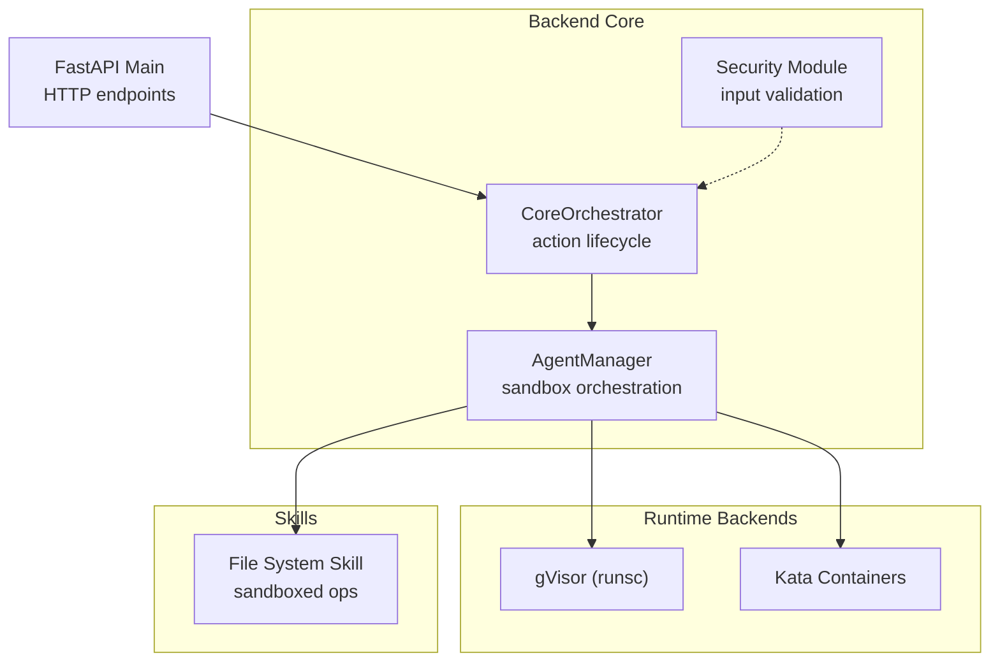
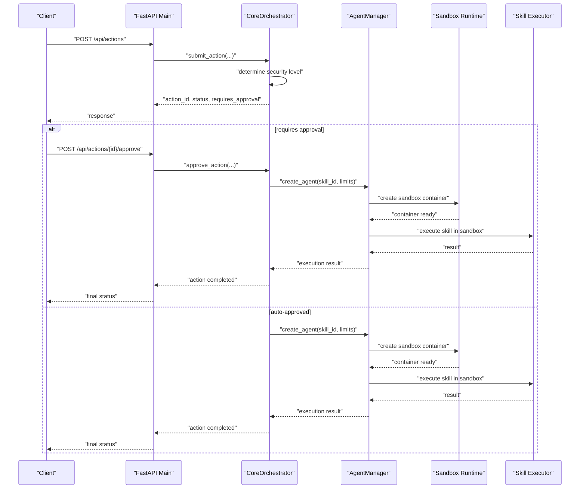
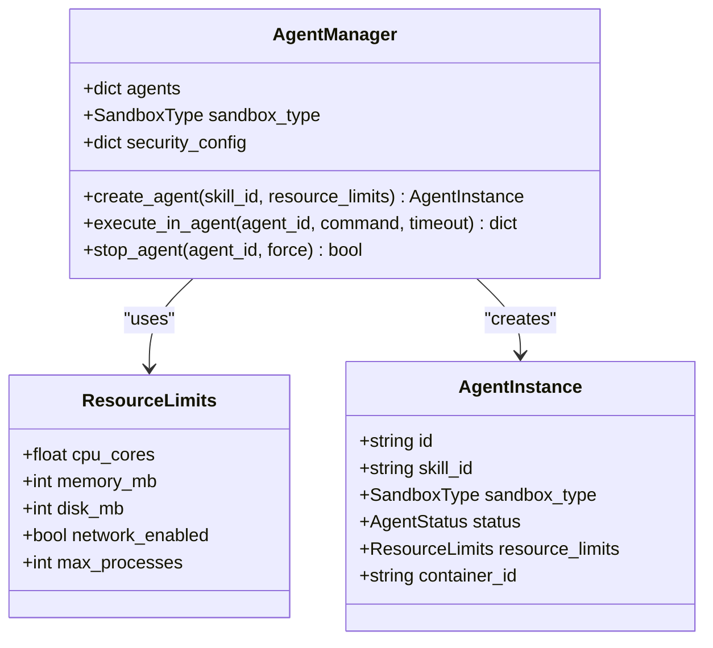
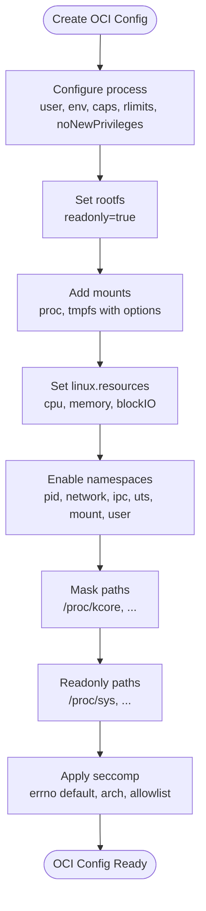
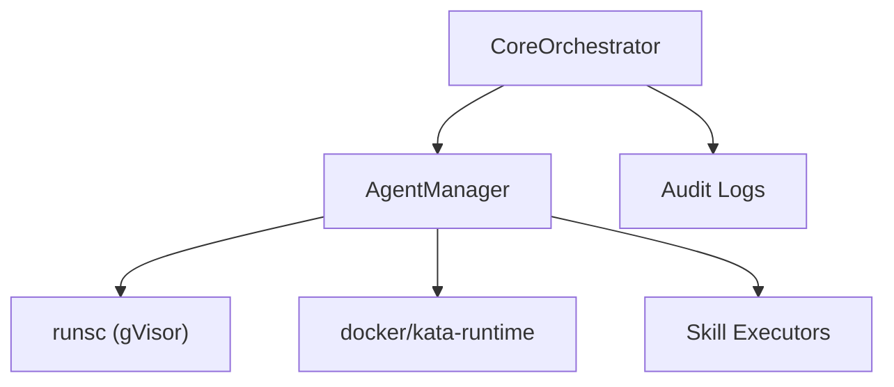

# Sandbox Configuration

<cite>
**Referenced Files in This Document**
- [README.md](file://README.md)
- [agent_manager.py](file://backend/app/core/agent_manager.py)
- [orchestrator.py](file://backend/app/core/orchestrator.py)
- [security.py](file://backend/app/core/security.py)
- [main.py](file://backend/app/main.py)
- [skill.py](file://skills/filesystem/skill.py)
- [install.sh](file://installer/install.sh)
</cite>

## Table of Contents
1. [Introduction](#introduction)
2. [Project Structure](#project-structure)
3. [Core Components](#core-components)
4. [Architecture Overview](#architecture-overview)
5. [Detailed Component Analysis](#detailed-component-analysis)
6. [Dependency Analysis](#dependency-analysis)
7. [Performance Considerations](#performance-considerations)
8. [Troubleshooting Guide](#troubleshooting-guide)
9. [Conclusion](#conclusion)
10. [Appendices](#appendices)

## Introduction
This document explains sandbox configuration and security hardening for the system, focusing on resource limits, isolation policies, and security boundaries. It documents the ResourceLimits class structure, OCI runtime configuration generation, seccomp filter implementation, namespace isolation setup, and security configurations such as masked paths, read-only filesystems, capability restrictions, and network isolation. Practical examples demonstrate customizing sandbox configurations, enforcing security policies, meeting compliance requirements, performance tuning, audit trails, troubleshooting, and integrating with different sandbox backends (gVisor and Kata).

## Project Structure
The sandboxing and security features are implemented primarily in the backend core modules and integrated with the main API server. The filesystem skill demonstrates sandboxed operations with audit logging.

**Diagram sources**
- [agent_manager.py](file://backend/app/core/agent_manager.py#L65-L192)
- [orchestrator.py](file://backend/app/core/orchestrator.py#L87-L130)
- [main.py](file://backend/app/main.py#L72-L87)

**Section sources**
- [README.md](file://README.md#L13-L163)
- [main.py](file://backend/app/main.py#L72-L87)

## Core Components
- ResourceLimits: Defines CPU cores, memory allocation, disk quotas, process limits, and network enablement for sandboxed agents.
- AgentManager: Creates sandboxed containers using gVisor or Kata, generates OCI runtime configuration, applies seccomp filters, and enforces namespaces and isolation.
- CoreOrchestrator: Manages system actions with zero-trust security, logs audit events, and coordinates skill execution within sandboxes.
- Security module: Provides prompt injection defense and input validation.
- File System Skill: Demonstrates sandboxed file operations with path validation, extension whitelisting, size limits, and audit logging.

**Section sources**
- [agent_manager.py](file://backend/app/core/agent_manager.py#L39-L63)
- [agent_manager.py](file://backend/app/core/agent_manager.py#L65-L192)
- [orchestrator.py](file://backend/app/core/orchestrator.py#L87-L130)
- [security.py](file://backend/app/core/security.py#L35-L180)
- [skill.py](file://skills/filesystem/skill.py#L35-L76)

## Architecture Overview
The system uses a zero-trust architecture with sandboxed skill execution. The orchestrator submits actions, which may require human-in-the-loop approval. Approved actions are executed within sandboxed agents using either gVisor or Kata. The AgentManager generates OCI runtime configurations with strict seccomp filters, masked paths, read-only filesystems, and namespace isolation. Audit logs are maintained for all actions and skill operations.

**Diagram sources**
- [main.py](file://backend/app/main.py#L241-L298)
- [orchestrator.py](file://backend/app/core/orchestrator.py#L169-L224)
- [agent_manager.py](file://backend/app/core/agent_manager.py#L149-L192)

## Detailed Component Analysis

### ResourceLimits and Sandbox Configuration
ResourceLimits defines the constraints applied to sandboxed agents:
- CPU cores: Controls scheduling shares and quota.
- Memory allocation: Sets memory limit and swap.
- Disk quotas: Enforced indirectly via filesystem quotas and tmpfs sizing.
- Network enablement: Disables networking by default for stronger isolation.
- Max processes: Limits process creation via RLIMIT_NPROC.

AgentManager uses ResourceLimits to configure OCI runtime resources and seccomp filters. It also sets namespace isolation and masked/readonly paths for enhanced security.

**Diagram sources**
- [agent_manager.py](file://backend/app/core/agent_manager.py#L39-L63)
- [agent_manager.py](file://backend/app/core/agent_manager.py#L65-L98)

**Section sources**
- [agent_manager.py](file://backend/app/core/agent_manager.py#L39-L63)
- [agent_manager.py](file://backend/app/core/agent_manager.py#L86-L98)

### OCI Runtime Configuration Generation
AgentManager generates OCI runtime configuration for gVisor containers:
- Process configuration: Non-root user, minimal environment, no-new-privileges, rlimits, and capability drops.
- Root filesystem: Read-only rootfs.
- Mounts: proc and tmpfs with strict options.
- Linux resources: CPU shares/quota, memory limit/swap, blockIO weight.
- Namespaces: pid, network, ipc, uts, mount, user.
- Masked paths: Sensitive kernel interfaces.
- Read-only paths: Sensitive sysfs entries.
- Seccomp: Default errno, architectures, and syscall allowlist.

**Diagram sources**
- [agent_manager.py](file://backend/app/core/agent_manager.py#L309-L473)

**Section sources**
- [agent_manager.py](file://backend/app/core/agent_manager.py#L309-L473)

### Seccomp Filter Implementation
Seccomp configuration:
- Default action: errno to block disallowed syscalls.
- Architectures: x86_64, x86, aarch64.
- Syscall allowlist: A curated set of syscalls required for basic operations.
- Additional hardening: Capability drops, no-new-privileges, masked/readonly paths.

This ensures that only explicitly permitted syscalls can succeed, minimizing the kernel attack surface.

**Section sources**
- [agent_manager.py](file://backend/app/core/agent_manager.py#L392-L471)

### Namespace Isolation Setup
Namespaces enabled for sandboxing:
- PID: Process isolation.
- Network: Disabled by default for stronger isolation.
- IPC: Inter-process communication isolation.
- UTS: Hostname isolation.
- Mount: Filesystem namespace for rootfs isolation.
- User: User namespace for privilege separation.

These namespaces collectively enforce process, filesystem, and network isolation.

**Section sources**
- [agent_manager.py](file://backend/app/core/agent_manager.py#L368-L375)

### Security Configurations
Key security controls:
- Masked paths: Prevent access to sensitive kernel interfaces.
- Read-only filesystems: Prevent tampering with critical paths.
- Capability restrictions: Drop bounding/effective/permitted capabilities.
- No-new-privileges: Prevent privilege escalation.
- Network isolation: Disabled by default; can be enabled per requirement.
- Process limits: Controlled via RLIMIT_NPROC.

These controls are applied consistently across gVisor and Kata configurations.

**Section sources**
- [agent_manager.py](file://backend/app/core/agent_manager.py#L323-L333)
- [agent_manager.py](file://backend/app/core/agent_manager.py#L376-L391)

### Practical Examples

#### Example 1: Customize Resource Limits for a Skill
- Define ResourceLimits with desired CPU cores, memory, disk, and process limits.
- Pass the ResourceLimits instance when creating an agent via AgentManager.
- Adjust security_config defaults (e.g., max_agents, timeouts) for operational needs.

**Section sources**
- [agent_manager.py](file://backend/app/core/agent_manager.py#L149-L192)
- [agent_manager.py](file://backend/app/core/agent_manager.py#L86-L94)

#### Example 2: Enforce Security Policy for File Operations
- Use the File System Skill’s path validation and extension checks.
- Enforce size limits and audit logs for all operations.
- Integrate with HITL approvals for destructive operations.

**Section sources**
- [skill.py](file://skills/filesystem/skill.py#L77-L132)
- [skill.py](file://skills/filesystem/skill.py#L274-L335)
- [orchestrator.py](file://backend/app/core/orchestrator.py#L225-L249)

#### Example 3: Compliance Requirements
- Maintain audit logs for all actions and skill operations.
- Enforce read-only rootfs and masked paths.
- Apply seccomp filters and capability drops.
- Limit network access unless explicitly required.

**Section sources**
- [orchestrator.py](file://backend/app/core/orchestrator.py#L429-L449)
- [agent_manager.py](file://backend/app/core/agent_manager.py#L335-L337)
- [agent_manager.py](file://backend/app/core/agent_manager.py#L376-L391)

### Integration with Different Sandbox Backends

#### gVisor Integration
- AgentManager detects gVisor availability and creates OCI bundles with runsc.
- Generates OCI config with strict seccomp, masked paths, and read-only rootfs.
- Executes commands inside the sandbox using runsc exec.

**Section sources**
- [agent_manager.py](file://backend/app/core/agent_manager.py#L99-L147)
- [agent_manager.py](file://backend/app/core/agent_manager.py#L203-L261)
- [agent_manager.py](file://backend/app/core/agent_manager.py#L539-L561)

#### Kata Containers Integration
- AgentManager detects Kata availability and uses docker with kata-runtime.
- Applies CPU/memory/disk constraints via docker flags.
- Enables network isolation via --network none and read-only rootfs via --read-only.

**Section sources**
- [agent_manager.py](file://backend/app/core/agent_manager.py#L128-L147)
- [agent_manager.py](file://backend/app/core/agent_manager.py#L262-L293)

#### Installer Integration (Linux/macOS)
- The installer configures gVisor runtime and creates a sandbox configuration file.
- On macOS, integrates with Docker Desktop to use runsc.

**Section sources**
- [install.sh](file://installer/install.sh#L191-L288)

## Dependency Analysis
The sandbox configuration depends on:
- AgentManager for runtime detection and sandbox creation.
- OCI runtime (runsc) for gVisor and docker/kata for Kata.
- Skill executors for performing operations within the sandbox.
- CoreOrchestrator for action lifecycle and audit logging.

**Diagram sources**
- [agent_manager.py](file://backend/app/core/agent_manager.py#L99-L147)
- [orchestrator.py](file://backend/app/core/orchestrator.py#L429-L449)

**Section sources**
- [agent_manager.py](file://backend/app/core/agent_manager.py#L99-L147)
- [orchestrator.py](file://backend/app/core/orchestrator.py#L429-L449)

## Performance Considerations
- CPU and memory limits: Tune cpu_cores and memory_mb to balance performance and isolation.
- Disk I/O: Use tmpfs for temporary data to reduce persistent I/O overhead.
- Seccomp allowlist: Keep the allowlist minimal to reduce syscall overhead.
- Namespace isolation: Enabling additional namespaces adds overhead; enable only what is necessary.
- Network isolation: Disabling network reduces attack surface but may limit functionality; enable only when required.

[No sources needed since this section provides general guidance]

## Troubleshooting Guide
Common issues and resolutions:
- Sandbox runtime not available: Ensure gVisor or Kata is installed and detectable by AgentManager. The installer configures gVisor on Linux/macOS.
- Container creation failures: Check OCI config generation and seccomp filter compatibility. Validate masked paths and read-only filesystem settings.
- Execution timeouts: Increase agent timeouts and adjust resource limits.
- Audit logging: Verify audit log configuration and file permissions.

**Section sources**
- [agent_manager.py](file://backend/app/core/agent_manager.py#L115-L147)
- [install.sh](file://installer/install.sh#L272-L288)
- [orchestrator.py](file://backend/app/core/orchestrator.py#L18-L28)

## Conclusion
The system implements robust sandboxing using gVisor and Kata with strong isolation policies, resource limits, and security controls. OCI runtime configuration, seccomp filters, namespace isolation, masked paths, and read-only filesystems collectively enforce a zero-trust security model. Operational customization is supported through ResourceLimits and security_config, while audit logging and human-in-the-loop approval provide compliance and oversight.

[No sources needed since this section summarizes without analyzing specific files]

## Appendices

### Appendix A: API Endpoints Related to Sandbox and Security
- Status and audit logs endpoints support monitoring and compliance.
- Action submission and approval endpoints integrate with sandboxed skill execution.

**Section sources**
- [main.py](file://backend/app/main.py#L101-L128)
- [main.py](file://backend/app/main.py#L322-L339)
- [main.py](file://backend/app/main.py#L241-L298)