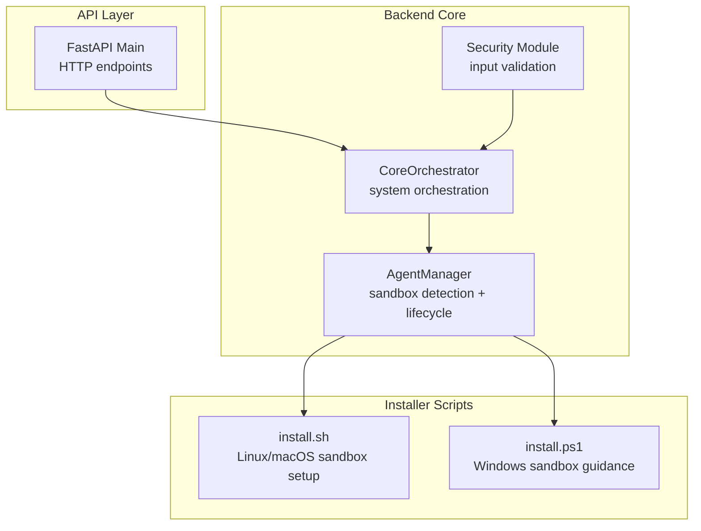
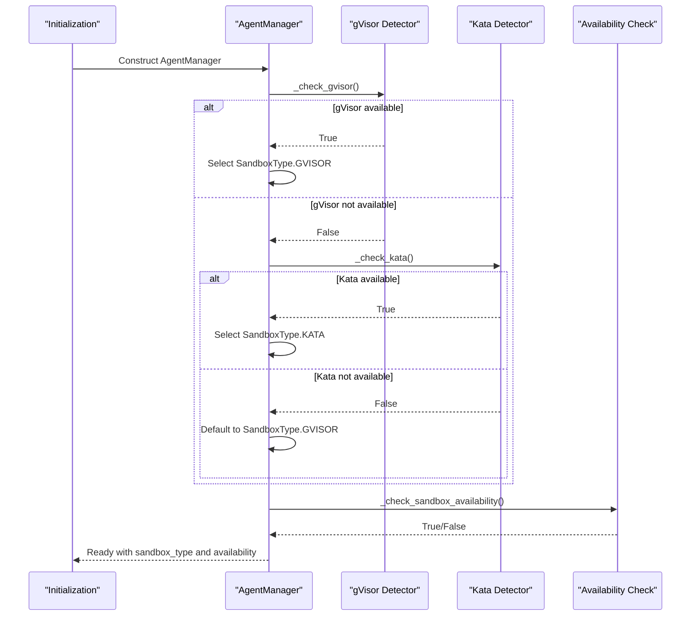
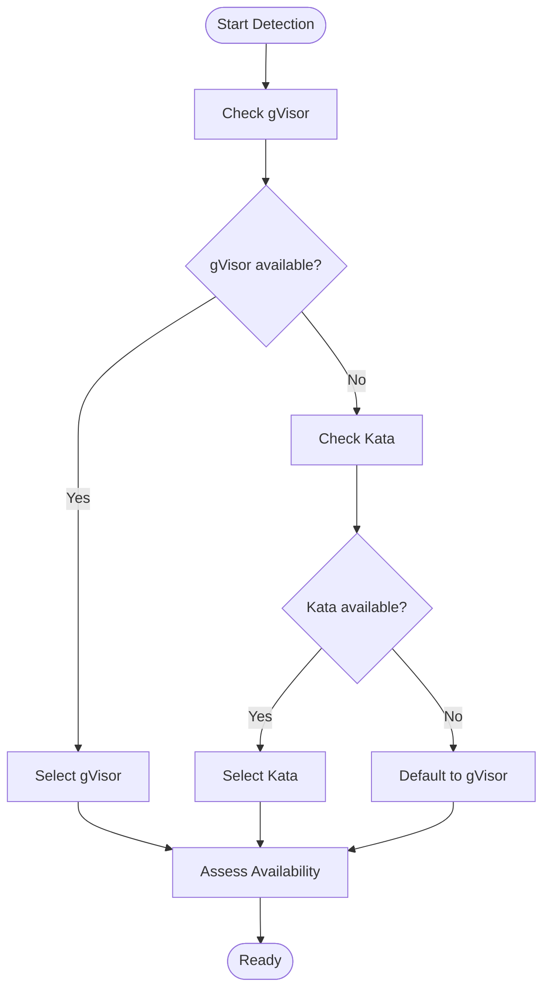
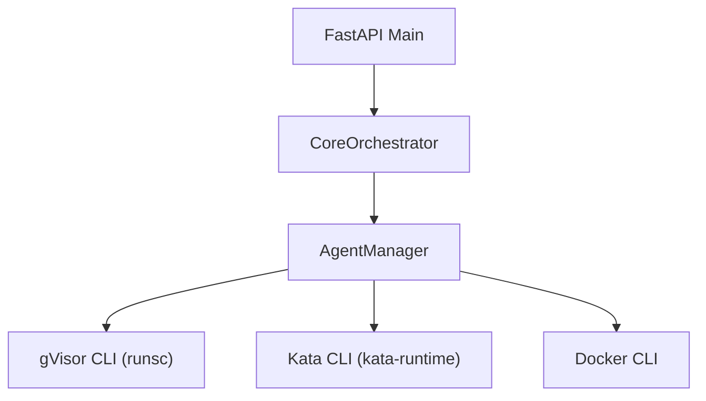

# Sandbox Runtime Detection

<cite>
**Referenced Files in This Document**
- [agent_manager.py](file://backend/app/core/agent_manager.py)
- [orchestrator.py](file://backend/app/core/orchestrator.py)
- [main.py](file://backend/app/main.py)
- [security.py](file://backend/app/core/security.py)
- [install.sh](file://installer/install.sh)
- [install.ps1](file://installer/install.ps1)
- [README.md](file://README.md)
</cite>

## Table of Contents
1. [Introduction](#introduction)
2. [Project Structure](#project-structure)
3. [Core Components](#core-components)
4. [Architecture Overview](#architecture-overview)
5. [Detailed Component Analysis](#detailed-component-analysis)
6. [Dependency Analysis](#dependency-analysis)
7. [Performance Considerations](#performance-considerations)
8. [Troubleshooting Guide](#troubleshooting-guide)
9. [Conclusion](#conclusion)
10. [Appendices](#appendices)

## Introduction
This document explains the sandbox runtime detection subsystem responsible for automatic sandbox type identification and availability checking. It covers the detection algorithms for gVisor and Kata Containers, runtime capability assessment, fallback mechanisms, and integration with the broader agent management system. It also documents the sandbox type enumeration, detection priority order, failure handling strategies, security implications, performance considerations, and platform-specific detection challenges.

## Project Structure
The sandbox runtime detection is implemented in the backend core module and integrated with the orchestration and API layers. The installer scripts provide platform-specific guidance and auto-configuration for sandbox environments.

**Diagram sources**
- [agent_manager.py](file://backend/app/core/agent_manager.py#L65-L114)
- [orchestrator.py](file://backend/app/core/orchestrator.py#L87-L130)
- [main.py](file://backend/app/main.py#L59-L70)
- [install.sh](file://installer/install.sh#L191-L288)
- [install.ps1](file://installer/install.ps1#L218-L318)

**Section sources**
- [agent_manager.py](file://backend/app/core/agent_manager.py#L65-L114)
- [orchestrator.py](file://backend/app/core/orchestrator.py#L87-L130)
- [main.py](file://backend/app/main.py#L59-L70)
- [install.sh](file://installer/install.sh#L191-L288)
- [install.ps1](file://installer/install.ps1#L218-L318)

## Core Components
- SandboxType enumeration defines supported sandbox backends: gVisor and Kata.
- AgentManager performs detection and availability checks, selects a runtime, and manages sandbox lifecycle.
- Installer scripts provide platform-specific guidance and auto-configuration for sandbox environments.
- CoreOrchestrator coordinates system actions and delegates skill execution to AgentManager.
- Security module provides prompt injection defense and input validation.

Key responsibilities:
- Automatic detection of gVisor and Kata runtimes.
- Capability assessment and fallback behavior.
- Execution of commands inside sandboxed agents.
- Integration with orchestration and API layers.

**Section sources**
- [agent_manager.py](file://backend/app/core/agent_manager.py#L21-L26)
- [agent_manager.py](file://backend/app/core/agent_manager.py#L99-L114)
- [agent_manager.py](file://backend/app/core/agent_manager.py#L141-L147)
- [install.sh](file://installer/install.sh#L191-L288)
- [install.ps1](file://installer/install.ps1#L218-L318)
- [orchestrator.py](file://backend/app/core/orchestrator.py#L87-L130)
- [security.py](file://backend/app/core/security.py#L35-L287)

## Architecture Overview
The sandbox runtime detection integrates with the AgentManager during initialization. The AgentManager detects available runtimes, assesses availability, and stores the selected sandbox type. The orchestrator coordinates actions and delegates skill execution to the AgentManager, which creates sandboxed agents using the chosen runtime.

**Diagram sources**
- [agent_manager.py](file://backend/app/core/agent_manager.py#L99-L114)
- [agent_manager.py](file://backend/app/core/agent_manager.py#L115-L139)
- [agent_manager.py](file://backend/app/core/agent_manager.py#L141-L147)

## Detailed Component Analysis

### Sandbox Type Enumeration
- SandboxType.GVISOR: gVisor userspace container runtime.
- SandboxType.KATA: Kata Containers hypervisor-based runtime.
- Docker alone is intentionally excluded due to insufficient isolation.

These values are used to select the appropriate sandboxing backend and to configure agent creation accordingly.

**Section sources**
- [agent_manager.py](file://backend/app/core/agent_manager.py#L21-L26)

### Detection Algorithm: gVisor
The gVisor detector invokes the runtime CLI to check availability. The detection uses a short timeout to avoid blocking initialization.

Detection steps:
- Invoke the runtime CLI with a version flag.
- Capture process exit code.
- Treat zero exit code as available; otherwise unavailable.

Failure handling:
- Timeouts and missing binaries are treated as unavailability.
- The system logs warnings and proceeds to the next detection stage.

**Section sources**
- [agent_manager.py](file://backend/app/core/agent_manager.py#L115-L126)

### Detection Algorithm: Kata Containers
The Kata detector follows the same pattern as gVisor, invoking the runtime CLI and checking the exit code.

Detection steps:
- Invoke the runtime CLI with a version flag.
- Capture process exit code.
- Treat zero exit code as available; otherwise unavailable.

Failure handling:
- Timeouts and missing binaries are treated as unavailability.
- The system logs warnings and falls back to gVisor.

**Section sources**
- [agent_manager.py](file://backend/app/core/agent_manager.py#L128-L139)

### Detection Priority Order and Fallback Mechanism
Priority order:
1. gVisor: Preferred runtime.
2. Kata Containers: Secondary runtime.
3. Default fallback: If neither is detected, the system defaults to gVisor and marks availability as false.

Availability assessment:
- Availability is determined by the presence of the selected runtime.
- If availability is false, agent creation raises an error instructing the user to install a supported runtime.

**Diagram sources**
- [agent_manager.py](file://backend/app/core/agent_manager.py#L99-L114)
- [agent_manager.py](file://backend/app/core/agent_manager.py#L141-L147)

**Section sources**
- [agent_manager.py](file://backend/app/core/agent_manager.py#L99-L114)
- [agent_manager.py](file://backend/app/core/agent_manager.py#L141-L147)

### Runtime Capability Assessment
The availability check evaluates whether the selected runtime is present and functional. If unavailable, agent creation is blocked until a supported runtime is installed.

Assessment logic:
- For gVisor selection: check gVisor presence.
- For Kata selection: check Kata presence.
- Otherwise: not available.

**Section sources**
- [agent_manager.py](file://backend/app/core/agent_manager.py#L141-L147)

### Agent Creation and Execution Using Selected Runtime
Once a runtime is selected, the AgentManager creates sandboxed agents using the chosen backend. Commands are executed inside the sandbox using the appropriate runtime CLI.

Key behaviors:
- gVisor: Uses the runtime CLI to create and start containers, then executes commands.
- Kata: Uses Docker as a frontend to manage Kata containers.
- Execution timeouts and errors are handled gracefully with structured responses.

**Section sources**
- [agent_manager.py](file://backend/app/core/agent_manager.py#L194-L201)
- [agent_manager.py](file://backend/app/core/agent_manager.py#L203-L261)
- [agent_manager.py](file://backend/app/core/agent_manager.py#L262-L294)
- [agent_manager.py](file://backend/app/core/agent_manager.py#L475-L538)
- [agent_manager.py](file://backend/app/core/agent_manager.py#L539-L561)
- [agent_manager.py](file://backend/app/core/agent_manager.py#L563-L584)

### Integration with Orchestrator and API
The orchestrator initializes the system and delegates skill execution to the AgentManager. The API exposes endpoints that trigger actions, which may require sandboxed execution depending on security levels.

Integration points:
- Initialization lifecycle hooks call orchestrator initialization.
- Skill execution actions are delegated to AgentManager for sandboxed execution.
- Status and audit logs are maintained for security monitoring.

**Section sources**
- [main.py](file://backend/app/main.py#L59-L70)
- [orchestrator.py](file://backend/app/core/orchestrator.py#L169-L224)
- [orchestrator.py](file://backend/app/core/orchestrator.py#L333-L350)

### Platform-Specific Detection Challenges
- Linux/macOS: Native gVisor installation and Docker integration are supported.
- Windows: WSL2 or Docker Desktop required; full sandboxing is limited compared to Linux/macOS.
- Installer scripts detect platform capabilities and guide users to install sandbox components.

Platform guidance:
- Linux/macOS: Auto-installation of gVisor is supported.
- Windows: Guidance to install WSL2 or Docker Desktop; limited sandboxing without these components.

**Section sources**
- [install.sh](file://installer/install.sh#L191-L288)
- [install.ps1](file://installer/install.ps1#L218-L318)
- [README.md](file://README.md#L19-L25)

### Practical Examples of Runtime Detection in Action
- Initialization: AgentManager detects gVisor first, then Kata, and finally defaults to gVisor if neither is available.
- Availability check: If gVisor is selected but not installed, agent creation fails with a clear error message.
- Execution: Commands are executed inside sandboxed agents using the selected runtime CLI.

Example paths:
- Detection and availability: [agent_manager.py](file://backend/app/core/agent_manager.py#L99-L114), [agent_manager.py](file://backend/app/core/agent_manager.py#L141-L147)
- Agent creation and execution: [agent_manager.py](file://backend/app/core/agent_manager.py#L194-L201), [agent_manager.py](file://backend/app/core/agent_manager.py#L475-L538)

**Section sources**
- [agent_manager.py](file://backend/app/core/agent_manager.py#L99-L114)
- [agent_manager.py](file://backend/app/core/agent_manager.py#L141-L147)
- [agent_manager.py](file://backend/app/core/agent_manager.py#L194-L201)
- [agent_manager.py](file://backend/app/core/agent_manager.py#L475-L538)

### Configuration Validation and Manual Runtime Configuration
- Configuration validation: The system validates runtime presence and logs warnings when runtimes are missing.
- Manual configuration: Users can install gVisor or Kata manually and ensure the runtime CLIs are available in PATH.
- Installer scripts provide automated setup for Linux/macOS and guidance for Windows.

Validation and configuration:
- Installer scripts check platform capabilities and install sandbox components automatically.
- AgentManager logs detection results and availability status.

**Section sources**
- [install.sh](file://installer/install.sh#L191-L288)
- [install.ps1](file://installer/install.ps1#L218-L318)
- [agent_manager.py](file://backend/app/core/agent_manager.py#L96-L97)
- [agent_manager.py](file://backend/app/core/agent_manager.py#L678-L696)

### Security Implications of Runtime Detection
- Zero-trust architecture: The system avoids Docker alone due to escape risks and prefers kernel-level isolation via gVisor or Kata.
- Input validation: The security module defends against prompt injection attacks and sanitizes inputs before processing.
- Audit logging: All actions are logged for forensic analysis.

Security measures:
- Sandbox enforcement: Only gVisor/Kata are considered safe.
- Prompt injection defense: Pattern-based detection and sanitization.
- Audit trails: Comprehensive logging of system actions.

**Section sources**
- [agent_manager.py](file://backend/app/core/agent_manager.py#L66-L79)
- [security.py](file://backend/app/core/security.py#L35-L287)

## Dependency Analysis
The AgentManager depends on the runtime CLIs for detection and sandbox creation. The orchestrator coordinates actions and delegates skill execution to the AgentManager. The API layer exposes endpoints that trigger actions, which may require sandboxed execution.

**Diagram sources**
- [agent_manager.py](file://backend/app/core/agent_manager.py#L115-L139)
- [agent_manager.py](file://backend/app/core/agent_manager.py#L262-L294)
- [orchestrator.py](file://backend/app/core/orchestrator.py#L333-L350)
- [main.py](file://backend/app/main.py#L131-L182)

**Section sources**
- [agent_manager.py](file://backend/app/core/agent_manager.py#L115-L139)
- [agent_manager.py](file://backend/app/core/agent_manager.py#L262-L294)
- [orchestrator.py](file://backend/app/core/orchestrator.py#L333-L350)
- [main.py](file://backend/app/main.py#L131-L182)

## Performance Considerations
- Detection timeouts: Short timeouts are used to avoid blocking initialization.
- Container creation overhead: gVisor and Kata introduce overhead; resource limits are enforced to mitigate impact.
- Execution timeouts: Command execution inside agents is bounded to prevent hangs.
- Logging overhead: Audit logging is enabled for security but should be monitored for performance impact.

[No sources needed since this section provides general guidance]

## Troubleshooting Guide
Common detection issues and resolutions:
- gVisor not detected:
  - Ensure the runtime CLI is installed and available in PATH.
  - Verify the runtime CLI responds to the version flag.
  - Check platform-specific installer guidance for Linux/macOS or Windows WSL2/Docker Desktop.
- Kata not detected:
  - Ensure the runtime CLI is installed and available in PATH.
  - Verify the runtime CLI responds to the version flag.
  - Confirm Docker is available as a frontend for Kata.
- Availability false:
  - The system blocks agent creation if no supported runtime is detected.
  - Install a supported runtime (gVisor or Kata) and restart the service.
- Execution failures:
  - Review logs for container creation and execution errors.
  - Check resource limits and timeouts.
  - Validate that the selected runtime is functioning correctly.

**Section sources**
- [agent_manager.py](file://backend/app/core/agent_manager.py#L115-L126)
- [agent_manager.py](file://backend/app/core/agent_manager.py#L128-L139)
- [agent_manager.py](file://backend/app/core/agent_manager.py#L161-L162)
- [agent_manager.py](file://backend/app/core/agent_manager.py#L245-L246)
- [agent_manager.py](file://backend/app/core/agent_manager.py#L290-L291)
- [agent_manager.py](file://backend/app/core/agent_manager.py#L520-L537)

## Conclusion
The sandbox runtime detection subsystem provides robust automatic detection of gVisor and Kata Containers, with clear fallback behavior and availability assessment. It integrates tightly with the AgentManager and orchestrator to ensure all skill execution occurs in a hardened sandbox. Platform-specific guidance is provided by installer scripts, and security is reinforced through input validation and audit logging.

[No sources needed since this section summarizes without analyzing specific files]

## Appendices

### API Definitions Related to Sandbox Information
- Endpoint: GET /api/status
  - Purpose: Retrieve system status including sandbox availability and runtime information.
  - Response fields: status, ollama_connected, available_models, pending_actions.
  - Notes: Sandbox runtime information is derived from the AgentManager’s sandbox info.

- Endpoint: GET /api/skills
  - Purpose: List available skills.
  - Response fields: id, name, enabled.

- Endpoint: POST /api/actions
  - Purpose: Submit a generic action.
  - Request body: action_type, parameters, skill_id.
  - Response fields: action_id, status, security_level, requires_approval.

- Endpoint: GET /api/actions/pending
  - Purpose: Get all pending actions requiring approval.
  - Response fields: id, action_type, skill_id, security_level, parameters, created_at.

- Endpoint: POST /api/actions/{action_id}/approve
  - Purpose: Approve or reject a pending action.
  - Request body: approved, user_id.
  - Response fields: action_id, approved, status.

- Endpoint: GET /api/actions/{action_id}
  - Purpose: Get status of a specific action.
  - Response fields: id, action_type, status, security_level, result, error, created_at, completed_at.

- Endpoint: GET /api/audit-logs
  - Purpose: Get security audit logs.
  - Response fields: timestamp, action_id, action_type, skill_id, status, outcome, details.

- Endpoint: GET /api/skills
  - Purpose: Get available skills.
  - Response fields: id, name, enabled.

- Endpoint: POST /api/skills/{skill_id}/enable
  - Purpose: Enable a skill.
  - Response fields: skill_id, enabled.

- Endpoint: POST /api/skills/{skill_id}/disable
  - Purpose: Disable a skill.
  - Response fields: skill_id, enabled.

**Section sources**
- [main.py](file://backend/app/main.py#L101-L128)
- [main.py](file://backend/app/main.py#L342-L378)
- [main.py](file://backend/app/main.py#L241-L262)
- [main.py](file://backend/app/main.py#L265-L281)
- [main.py](file://backend/app/main.py#L284-L298)
- [main.py](file://backend/app/main.py#L301-L319)
- [main.py](file://backend/app/main.py#L322-L339)