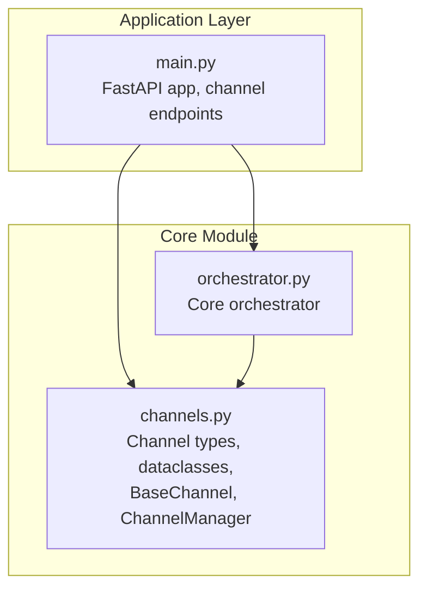
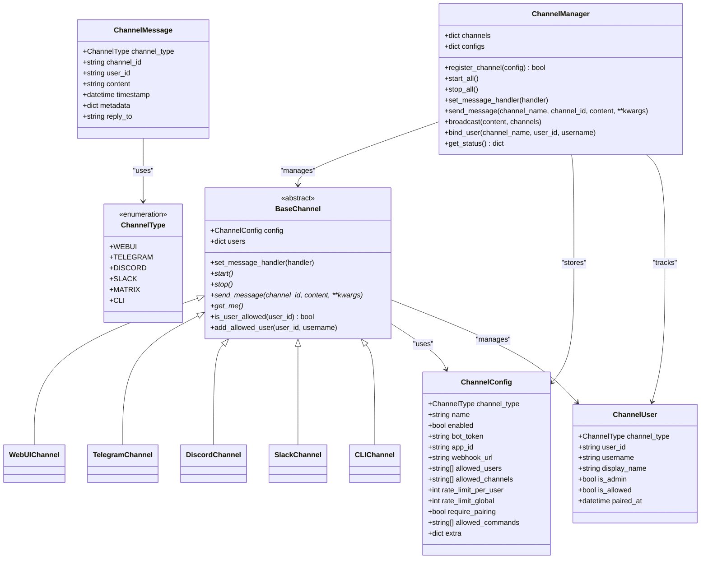
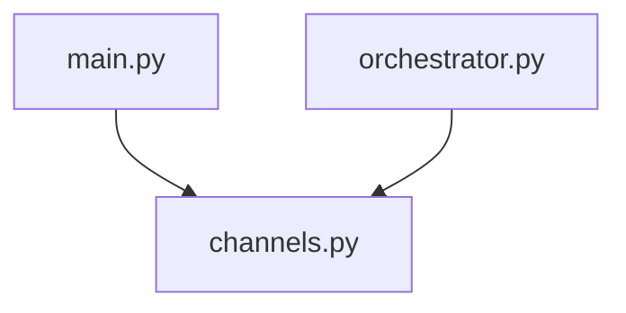

# Channel Architecture and Base Classes

<cite>
**Referenced Files in This Document**
- [channels.py](file://backend/app/core/channels.py)
- [main.py](file://backend/app/main.py)
- [orchestrator.py](file://backend/app/core/orchestrator.py)
</cite>

## Table of Contents
1. [Introduction](#introduction)
2. [Project Structure](#project-structure)
3. [Core Components](#core-components)
4. [Architecture Overview](#architecture-overview)
5. [Detailed Component Analysis](#detailed-component-analysis)
6. [Dependency Analysis](#dependency-analysis)
7. [Performance Considerations](#performance-considerations)
8. [Troubleshooting Guide](#troubleshooting-guide)
9. [Conclusion](#conclusion)

## Introduction
This document explains the channel architecture and base classes that power ClosedPaw's multi-channel messaging system. It covers the BaseChannel abstract class design, common interface methods (start, stop, send_message, get_me), the ChannelMessage dataclass structure, ChannelUser identity management, and the singleton ChannelManager pattern for channel registration and lifecycle management. The goal is to provide a clear understanding of how different communication channels (Telegram, Discord, Slack, CLI, Web UI) are unified under a common abstraction and managed centrally.

## Project Structure
The channel system resides in the core module and integrates with the main FastAPI application and the orchestrator. The primary files involved are:
- Channel definitions and managers: backend/app/core/channels.py
- Application entry point and channel API endpoints: backend/app/main.py
- Orchestrator integration: backend/app/core/orchestrator.py

**Diagram sources**
- [channels.py](file://backend/app/core/channels.py#L1-L524)
- [main.py](file://backend/app/main.py#L1-L567)
- [orchestrator.py](file://backend/app/core/orchestrator.py#L1-L486)

**Section sources**
- [channels.py](file://backend/app/core/channels.py#L1-L524)
- [main.py](file://backend/app/main.py#L1-L567)

## Core Components
This section introduces the foundational building blocks of the channel architecture.

- ChannelType enumeration defines supported channel types: webui, telegram, discord, slack, matrix, cli.
- ChannelMessage dataclass encapsulates incoming messages with channel_type, channel_id, user_id, content, timestamp, metadata, and optional reply_to.
- ChannelConfig dataclass holds channel configuration including type, name, enabled flag, tokens/webhooks, allowlists, rate limits, security flags, and extra settings.
- ChannelUser dataclass manages user identity with channel_type, user_id, username, display_name, admin/allowed flags, and pairing timestamp.
- BaseChannel abstract class defines the common interface for all channels, including lifecycle methods and user allowlist utilities.
- ChannelManager singleton centralizes channel registration, lifecycle, message routing, and broadcasting.

**Section sources**
- [channels.py](file://backend/app/core/channels.py#L18-L135)
- [channels.py](file://backend/app/core/channels.py#L405-L524)

## Architecture Overview
The channel architecture follows a layered design:
- Abstraction Layer: BaseChannel defines a uniform interface for all channels.
- Implementation Layer: Concrete channel classes (TelegramChannel, DiscordChannel, SlackChannel, CLIChannel, WebUIChannel) implement platform-specific behavior.
- Management Layer: ChannelManager handles registration, lifecycle, and routing of messages across channels.
- Integration Layer: FastAPI endpoints expose channel management APIs; the orchestrator coordinates higher-level actions.

**Diagram sources**
- [channels.py](file://backend/app/core/channels.py#L18-L135)
- [channels.py](file://backend/app/core/channels.py#L137-L403)
- [channels.py](file://backend/app/core/channels.py#L405-L524)

## Detailed Component Analysis

### BaseChannel Abstract Class
BaseChannel defines the contract that all channel implementations must satisfy. It includes:
- Lifecycle methods: start, stop, send_message, get_me (abstract).
- Message handling: set_message_handler to register a callback and _handle_message to dispatch ChannelMessage instances.
- User management: is_user_allowed checks allowlists; add_allowed_user adds users and marks them as allowed with pairing timestamp.
- State: tracks running status and maintains a users dictionary keyed by user_id.

Key responsibilities:
- Enforce consistent interface across channels.
- Provide shared utilities for security and user management.
- Enable centralized message routing via the ChannelManager.

**Section sources**
- [channels.py](file://backend/app/core/channels.py#L79-L135)

### ChannelMessage Dataclass
ChannelMessage represents incoming messages uniformly across channels:
- channel_type: identifies the originating channel type.
- channel_id: platform-specific identifier for the conversation/channel.
- user_id: sender identifier.
- content: textual payload.
- timestamp: UTC timestamp of message receipt.
- metadata: arbitrary key-value pairs (e.g., usernames, message IDs).
- reply_to: optional reference to a previous message ID for threaded replies.

Usage pattern:
- Concrete channels construct ChannelMessage instances from platform-specific events and forward them to the message handler via _handle_message.

**Section sources**
- [channels.py](file://backend/app/core/channels.py#L28-L40)

### ChannelUser Identity Management
ChannelUser encapsulates user identity and permissions:
- channel_type: the channel where the user exists.
- user_id: unique identifier within that channel.
- username/display_name: optional human-readable identifiers.
- is_admin/is_allowed: permission flags.
- paired_at: timestamp when the user was bound to the system.

Management:
- BaseChannel.add_allowed_user creates or updates ChannelUser entries and sets is_allowed and paired_at.
- ChannelConfig.allowed_users controls access; BaseChannel.is_user_allowed enforces allowlists.

**Section sources**
- [channels.py](file://backend/app/core/channels.py#L67-L77)
- [channels.py](file://backend/app/core/channels.py#L117-L135)

### ChannelManager Singleton Pattern
ChannelManager is a singleton that centralizes channel operations:
- Registration: register_channel maps ChannelType to concrete channel classes and instantiates them.
- Lifecycle: start_all and stop_all iterate through registered channels.
- Routing: send_message routes messages to a named channel; broadcast sends to multiple channels.
- Binding: bind_user adds users to a channel’s allowlist.
- Status: get_status reports channel configurations and counts.

Singleton behavior:
- get_channel_manager lazily initializes the manager and registers a default WebUI channel.

Integration:
- FastAPI endpoints delegate channel operations to ChannelManager.
- The orchestrator can coordinate with ChannelManager for cross-channel messaging.

**Section sources**
- [channels.py](file://backend/app/core/channels.py#L405-L524)
- [main.py](file://backend/app/main.py#L464-L528)

### Concrete Channel Implementations
Each concrete channel extends BaseChannel and implements platform-specific logic:

- WebUIChannel: internal polling-style channel with pending message storage and retrieval.
- TelegramChannel: asynchronous polling for updates, user allowlist enforcement, and Telegram API interactions.
- DiscordChannel: Discord API integration for sending messages and retrieving bot info.
- SlackChannel: Slack API integration for posting messages and testing authentication.
- CLIChannel: simple console output for terminal interaction.

Common patterns:
- All implement start/stop to manage runtime state.
- All implement send_message to deliver content to the platform.
- All implement get_me to retrieve bot/user identity.
- All use BaseChannel.is_user_allowed for access control.

**Section sources**
- [channels.py](file://backend/app/core/channels.py#L137-L403)

### Message Handler Pattern
The message handler pattern enables decoupled processing of incoming messages:
- BaseChannel.set_message_handler registers a callable that receives ChannelMessage instances asynchronously.
- Concrete channels trigger the handler via _handle_message after validating and constructing ChannelMessage.
- ChannelManager.set_message_handler propagates the handler to all registered channels.

Typical flow:
- Platform-specific channel detects an incoming event.
- Channel constructs ChannelMessage and calls _handle_message.
- Registered handler processes the message (e.g., invoking orchestrator actions).

**Section sources**
- [channels.py](file://backend/app/core/channels.py#L108-L116)
- [channels.py](file://backend/app/core/channels.py#L456-L461)

### Channel Registration Process
Channel registration is handled by ChannelManager.register_channel:
- Validates ChannelType and maps to a concrete channel class.
- Instantiates the channel with the provided ChannelConfig.
- Applies the global message handler if present.
- Logs registration and returns success/failure.

Default registration:
- get_channel_manager ensures a default WebUI channel is registered on first access.

API endpoints:
- FastAPI exposes /api/channels/register to register new channels programmatically.

**Section sources**
- [channels.py](file://backend/app/core/channels.py#L416-L443)
- [channels.py](file://backend/app/core/channels.py#L509-L524)
- [main.py](file://backend/app/main.py#L473-L504)

## Dependency Analysis
The channel architecture exhibits clear separation of concerns:
- channels.py depends on typing, dataclasses, datetime, and logging for core abstractions and utilities.
- Concrete channels depend on httpx for external API calls and platform-specific libraries.
- ChannelManager depends on BaseChannel subclasses and maintains dictionaries keyed by channel name.
- FastAPI main.py depends on get_channel_manager for channel operations and integrates with the orchestrator.

**Diagram sources**
- [channels.py](file://backend/app/core/channels.py#L1-L524)
- [main.py](file://backend/app/main.py#L1-L567)
- [orchestrator.py](file://backend/app/core/orchestrator.py#L1-L486)

**Section sources**
- [channels.py](file://backend/app/core/channels.py#L1-L524)
- [main.py](file://backend/app/main.py#L1-L567)

## Performance Considerations
- Asynchronous I/O: Channels rely on async HTTP clients for external APIs to minimize blocking and improve throughput.
- Polling vs. Webhooks: Telegram uses polling; consider webhooks for lower latency and reduced load where supported.
- Rate limiting: ChannelConfig includes per-user and global rate limits; enforce these in handlers to prevent abuse.
- Broadcasting: ChannelManager.broadcast iterates over channels; use targeted channel lists to reduce unnecessary sends.
- Memory footprint: Pending message queues (e.g., WebUIChannel) should be bounded to avoid memory growth.

## Troubleshooting Guide
Common issues and resolutions:
- Unknown channel type during registration: Verify ChannelType values match supported enumerations.
- Missing bot tokens: Ensure ChannelConfig.bot_token is set for Telegram/Discord/Slack channels before starting.
- Unauthorized users: Confirm user_id is present in ChannelConfig.allowed_users or disable require_pairing for unrestricted access.
- Channel not found: Use ChannelManager.get_status to inspect registered channels and names.
- Broadcast failures: Check ChannelConfig.allowed_channels for each channel and ensure they are enabled.

Operational checks:
- Use FastAPI endpoints to start/stop channels and bind users.
- Inspect logs for warnings and errors emitted by channels and ChannelManager.

**Section sources**
- [channels.py](file://backend/app/core/channels.py#L416-L443)
- [channels.py](file://backend/app/core/channels.py#L445-L454)
- [channels.py](file://backend/app/core/channels.py#L484-L489)
- [main.py](file://backend/app/main.py#L515-L528)

## Conclusion
The channel architecture provides a robust, extensible foundation for multi-platform messaging. The BaseChannel abstraction unifies diverse channel implementations behind a consistent interface, while ChannelManager centralizes lifecycle and routing concerns. ChannelMessage and ChannelUser define standardized data structures for identity and content, enabling clean integration with the orchestrator and broader system components. The singleton ChannelManager pattern simplifies initialization and ensures consistent behavior across the application.