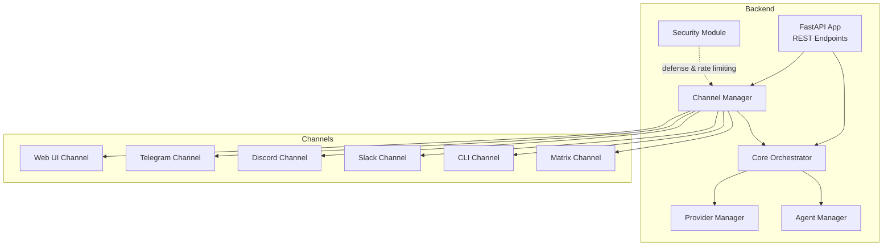
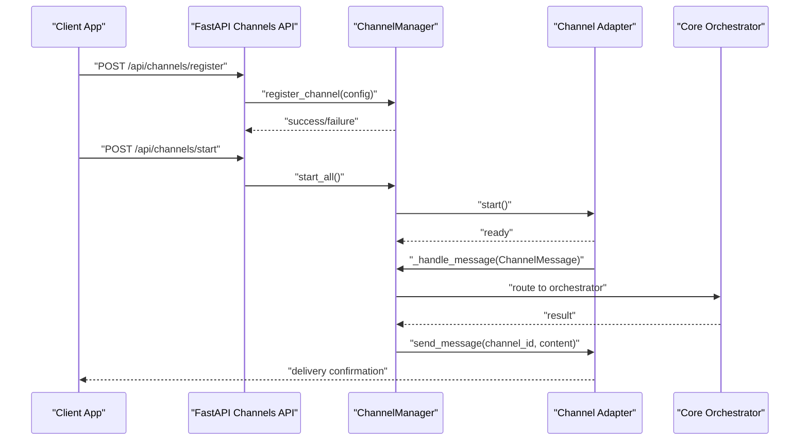
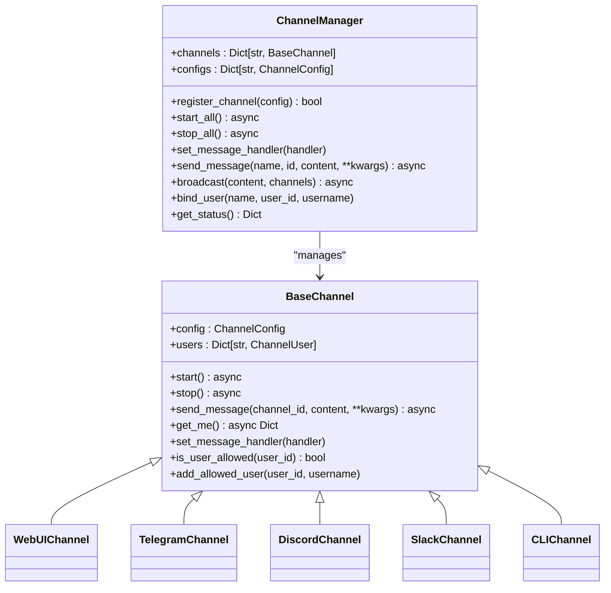
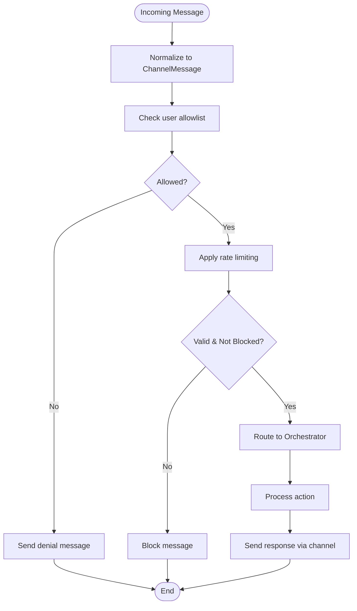
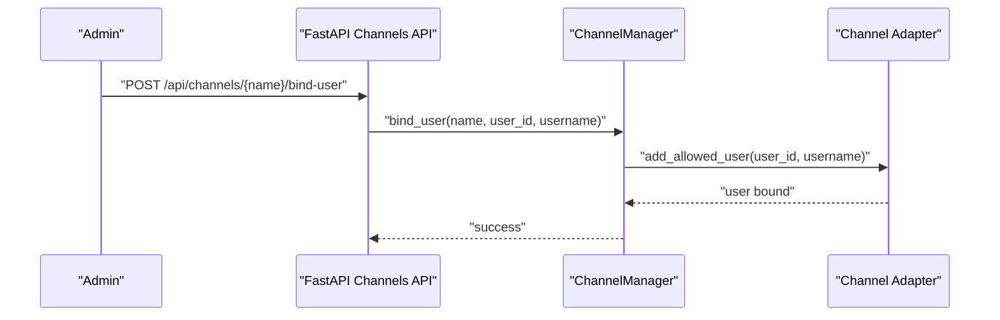
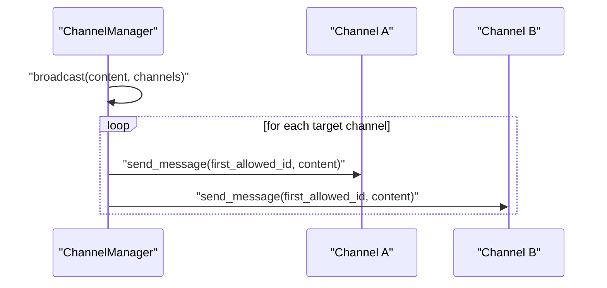
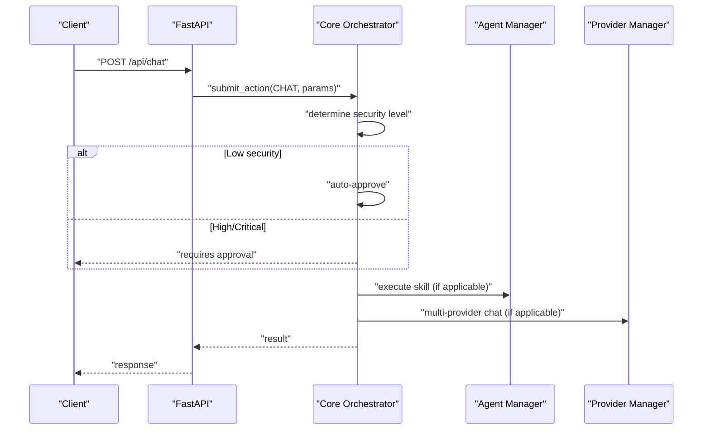
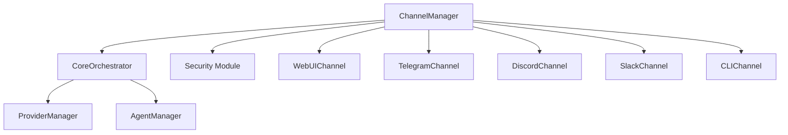

# Channel Manager

<cite>
**Referenced Files in This Document**
- [channels.py](file://backend/app/core/channels.py)
- [orchestrator.py](file://backend/app/core/orchestrator.py)
- [security.py](file://backend/app/core/security.py)
- [main.py](file://backend/app/main.py)
- [providers.py](file://backend/app/core/providers.py)
- [agent_manager.py](file://backend/app/core/agent_manager.py)
- [skill.py](file://skills/filesystem/skill.py)
</cite>

## Table of Contents
1. [Introduction](#introduction)
2. [Project Structure](#project-structure)
3. [Core Components](#core-components)
4. [Architecture Overview](#architecture-overview)
5. [Detailed Component Analysis](#detailed-component-analysis)
6. [Dependency Analysis](#dependency-analysis)
7. [Performance Considerations](#performance-considerations)
8. [Troubleshooting Guide](#troubleshooting-guide)
9. [Conclusion](#conclusion)
10. [Appendices](#appendices)

## Introduction
This document describes the Channel Manager component responsible for multi-channel communication support and user authorization across web UI, Telegram, Discord, Slack, CLI, and Matrix interfaces. It explains the channel registration and configuration system, user authorization and permission management, message routing and security validation, cross-channel synchronization, the channel adapter framework, message format standardization, and real-time communication protocols. It also documents integration with the Core Orchestrator for action distribution, approval workflow coordination, and audit logging across channels, along with channel-specific security considerations and compliance requirements.

## Project Structure
The Channel Manager is implemented in the core module and integrates with the FastAPI backend, the Core Orchestrator, and the security subsystem. The backend exposes REST endpoints to manage channels and integrate with the orchestrator.

**Diagram sources**
- [channels.py](file://backend/app/core/channels.py#L405-L524)
- [main.py](file://backend/app/main.py#L464-L530)
- [orchestrator.py](file://backend/app/core/orchestrator.py#L87-L130)
- [security.py](file://backend/app/core/security.py#L35-L107)
- [providers.py](file://backend/app/core/providers.py#L418-L457)
- [agent_manager.py](file://backend/app/core/agent_manager.py#L65-L98)

**Section sources**
- [channels.py](file://backend/app/core/channels.py#L1-L524)
- [main.py](file://backend/app/main.py#L464-L530)

## Core Components
- ChannelType: Enumerates supported channel types (webui, telegram, discord, slack, matrix, cli).
- ChannelMessage: Standardized message structure with channel metadata, user identity, content, timestamp, and optional reply linkage.
- ChannelConfig: Per-channel configuration including credentials, allowlists, rate limits, security flags, and extra settings.
- ChannelUser: User identity within a channel, including admin status, permissions, and pairing timestamp.
- BaseChannel: Abstract base class defining the channel interface (start, stop, send_message, get_me) and shared security helpers.
- ChannelManager: Central registry and router for channels, including registration, lifecycle management, message routing, broadcasting, and user binding.
- Channel adapters: Concrete implementations for WebUI, Telegram, Discord, Slack, CLI, and Matrix.

Key responsibilities:
- Registration and lifecycle management of channels
- Message routing and broadcasting
- User authorization and allowlisting
- Security validation and rate limiting
- Cross-channel synchronization and standardized message format

**Section sources**
- [channels.py](file://backend/app/core/channels.py#L18-L135)
- [channels.py](file://backend/app/core/channels.py#L405-L524)

## Architecture Overview
The Channel Manager sits between the backend API and external channels. Incoming messages are normalized into ChannelMessage and routed to the Core Orchestrator for processing. Outgoing messages are sent via the appropriate channel adapter.

**Diagram sources**
- [channels.py](file://backend/app/core/channels.py#L416-L461)
- [main.py](file://backend/app/main.py#L473-L521)
- [orchestrator.py](file://backend/app/core/orchestrator.py#L169-L224)

## Detailed Component Analysis

### Channel Adapter Framework
The framework defines a uniform interface for all channels and provides concrete implementations for each platform. Each adapter encapsulates protocol specifics (HTTP APIs, polling, etc.), handles authentication, and normalizes outbound messages.

**Diagram sources**
- [channels.py](file://backend/app/core/channels.py#L79-L135)
- [channels.py](file://backend/app/core/channels.py#L405-L524)

**Section sources**
- [channels.py](file://backend/app/core/channels.py#L79-L135)
- [channels.py](file://backend/app/core/channels.py#L137-L403)
- [channels.py](file://backend/app/core/channels.py#L405-L524)

### Message Routing and Security Validation
- Message normalization: All inbound messages are transformed into ChannelMessage with standardized fields.
- Authorization: Each channel checks user allowlists before processing messages.
- Rate limiting: Configurable per-user and global limits are enforced at the channel level.
- Security validation: Input validation and sanitization occur before routing to the orchestrator.

**Diagram sources**
- [channels.py](file://backend/app/core/channels.py#L225-L257)
- [channels.py](file://backend/app/core/channels.py#L117-L121)
- [security.py](file://backend/app/core/security.py#L116-L180)

**Section sources**
- [channels.py](file://backend/app/core/channels.py#L28-L40)
- [channels.py](file://backend/app/core/channels.py#L117-L121)
- [security.py](file://backend/app/core/security.py#L116-L180)

### User Authorization and Permission Management
- Allowlists: Each channel maintains an allowlist of user IDs. Users can be bound programmatically or via API.
- Pairing: Users can be bound to channels with optional usernames; pairing timestamps are recorded.
- Admin flags: ChannelUser supports admin designation for elevated permissions.

**Diagram sources**
- [channels.py](file://backend/app/core/channels.py#L484-L489)
- [main.py](file://backend/app/main.py#L507-L512)

**Section sources**
- [channels.py](file://backend/app/core/channels.py#L67-L77)
- [channels.py](file://backend/app/core/channels.py#L123-L134)
- [channels.py](file://backend/app/core/channels.py#L484-L489)
- [main.py](file://backend/app/main.py#L507-L512)

### Cross-Channel Message Synchronization
- Broadcast capability: ChannelManager can broadcast messages to multiple channels.
- Standardized format: All channels emit ChannelMessage, enabling consistent routing and logging.
- Channel-specific IDs: Each channel adapter manages its own channel identifiers (e.g., Telegram chat_id, Discord channel_id).

**Diagram sources**
- [channels.py](file://backend/app/core/channels.py#L470-L482)

**Section sources**
- [channels.py](file://backend/app/core/channels.py#L470-L482)

### Channel Adapter Implementations
- Web UI: Queues messages for polling by the frontend; internal-only channel.
- Telegram: Polls updates via Telegram Bot API, validates users, and sends messages with Markdown parsing.
- Discord: Uses Bot token authentication to send messages.
- Slack: Uses Bearer token authentication to post messages.
- CLI: Prints messages to stdout for terminal interaction.
- Matrix: Supported via ChannelType enum; adapter class present for future implementation.

**Section sources**
- [channels.py](file://backend/app/core/channels.py#L137-L175)
- [channels.py](file://backend/app/core/channels.py#L177-L286)
- [channels.py](file://backend/app/core/channels.py#L288-L334)
- [channels.py](file://backend/app/core/channels.py#L336-L382)
- [channels.py](file://backend/app/core/channels.py#L384-L403)
- [channels.py](file://backend/app/core/channels.py#L18-L26)

### Integration with Core Orchestrator
- Action submission: The backend routes chat and action requests to the Core Orchestrator, which determines security levels and executes actions.
- Approval workflow: High-risk actions require Human-in-the-Loop (HITL) approval; the Web UI surfaces pending actions for admin review.
- Audit logging: All actions are logged with detailed audit trails for compliance.

**Diagram sources**
- [main.py](file://backend/app/main.py#L131-L182)
- [orchestrator.py](file://backend/app/core/orchestrator.py#L169-L224)
- [agent_manager.py](file://backend/app/core/agent_manager.py#L65-L98)
- [providers.py](file://backend/app/core/providers.py#L418-L457)

**Section sources**
- [main.py](file://backend/app/main.py#L131-L182)
- [orchestrator.py](file://backend/app/core/orchestrator.py#L225-L250)
- [orchestrator.py](file://backend/app/core/orchestrator.py#L376-L428)
- [agent_manager.py](file://backend/app/core/agent_manager.py#L65-L98)
- [providers.py](file://backend/app/core/providers.py#L418-L457)

### Practical Examples

- Channel setup via API:
  - Register a Telegram channel with bot token and allowed users.
  - Start all channels to activate adapters.
  - Bind users to channel allowlists.

- User authorization workflow:
  - Bind a user to a channel.
  - Attempt message; if unauthorized, deny message is sent.

- Message routing pattern:
  - Incoming message is normalized and routed to the orchestrator.
  - Orchestrator processes and returns a result.
  - Channel adapter sends the response back to the originating channel.

**Section sources**
- [main.py](file://backend/app/main.py#L473-L521)
- [channels.py](file://backend/app/core/channels.py#L225-L257)
- [channels.py](file://backend/app/core/channels.py#L462-L468)

## Dependency Analysis
The Channel Manager depends on:
- Core Orchestrator for action processing and approval workflows
- Security module for input validation and rate limiting
- Provider Manager for multi-provider LLM operations
- Agent Manager for skill execution in sandboxed environments

**Diagram sources**
- [channels.py](file://backend/app/core/channels.py#L405-L524)
- [orchestrator.py](file://backend/app/core/orchestrator.py#L87-L130)
- [security.py](file://backend/app/core/security.py#L35-L107)
- [providers.py](file://backend/app/core/providers.py#L418-L457)
- [agent_manager.py](file://backend/app/core/agent_manager.py#L65-L98)

**Section sources**
- [channels.py](file://backend/app/core/channels.py#L405-L524)
- [orchestrator.py](file://backend/app/core/orchestrator.py#L87-L130)
- [security.py](file://backend/app/core/security.py#L35-L107)
- [providers.py](file://backend/app/core/providers.py#L418-L457)
- [agent_manager.py](file://backend/app/core/agent_manager.py#L65-L98)

## Performance Considerations
- Asynchronous I/O: Channel adapters use async HTTP clients to minimize blocking during API calls.
- Polling vs. webhooks: Telegram uses long-polling; other platforms use REST APIs. Consider implementing webhooks for lower latency where supported.
- Rate limiting: Enforced per-channel to prevent abuse and API throttling.
- Broadcasting: Efficiently iterates over enabled channels and uses first allowed channel ID for broadcast targets.

[No sources needed since this section provides general guidance]

## Troubleshooting Guide
Common issues and resolutions:
- Channel not starting: Verify credentials (bot tokens) and network connectivity.
- Unauthorized user messages: Ensure user is bound to channel allowlist.
- Rate limit exceeded: Reduce message frequency or increase limits in ChannelConfig.
- Audit logging: Use the audit logs endpoint to inspect action outcomes and errors.

**Section sources**
- [channels.py](file://backend/app/core/channels.py#L185-L196)
- [channels.py](file://backend/app/core/channels.py#L240-L242)
- [main.py](file://backend/app/main.py#L322-L339)

## Conclusion
The Channel Manager provides a robust, extensible foundation for multi-channel communication with strong security, standardized message formats, and seamless integration with the Core Orchestrator. Its adapter-based design enables straightforward addition of new channels, while built-in authorization, rate limiting, and audit logging support compliance and operational safety.

## Appendices

### Channel Configuration Reference
- ChannelConfig fields:
  - channel_type: One of webui, telegram, discord, slack, matrix, cli
  - name: Unique channel identifier
  - enabled: Whether channel is active
  - bot_token: Platform authentication token
  - app_id/webhook_url: Additional platform-specific settings
  - allowed_users: List of authorized user IDs
  - allowed_channels: List of channel IDs for outbound routing
  - rate_limit_per_user/rate_limit_global: Request limits
  - require_pairing: Whether pairing is mandatory
  - allowed_commands: Whitelisted commands for CLI/web UI
  - extra: Arbitrary configuration payload

**Section sources**
- [channels.py](file://backend/app/core/channels.py#L42-L64)

### Security Boundaries and Compliance
- Prompt injection defense: Input validation and sanitization reduce prompt injection risks.
- Rate limiting: Prevents abuse and ensures fair usage.
- Audit logging: Comprehensive logs for all actions and security events.
- Data vault: Encrypted storage for secrets and credentials.
- Sandbox execution: Agent Manager isolates skill execution with containers.

**Section sources**
- [security.py](file://backend/app/core/security.py#L35-L107)
- [security.py](file://backend/app/core/security.py#L290-L318)
- [security.py](file://backend/app/core/security.py#L325-L435)
- [agent_manager.py](file://backend/app/core/agent_manager.py#L65-L98)

### Example: File System Skill Integration
- The filesystem skill demonstrates sandboxed execution, path validation, and audit logging, aligning with the Orchestrator’s security posture.

**Section sources**
- [skill.py](file://skills/filesystem/skill.py#L35-L76)
- [skill.py](file://skills/filesystem/skill.py#L133-L208)
- [skill.py](file://skills/filesystem/skill.py#L468-L483)