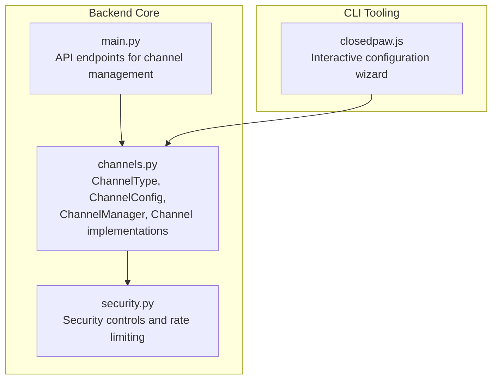
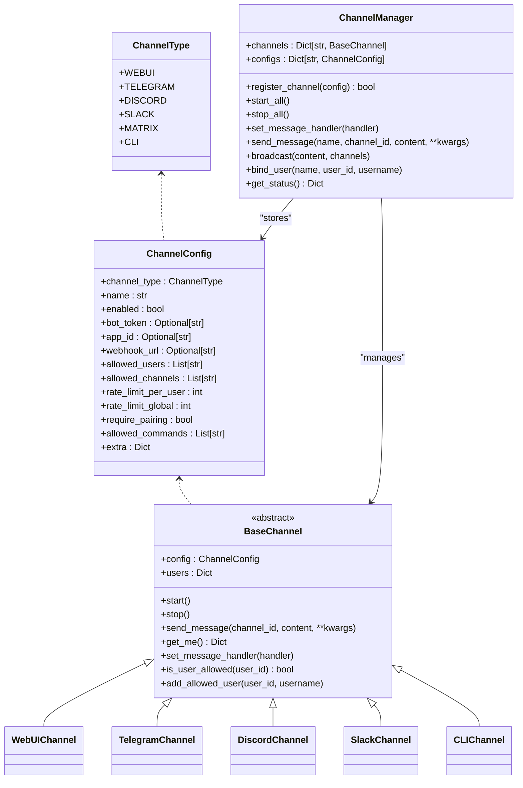
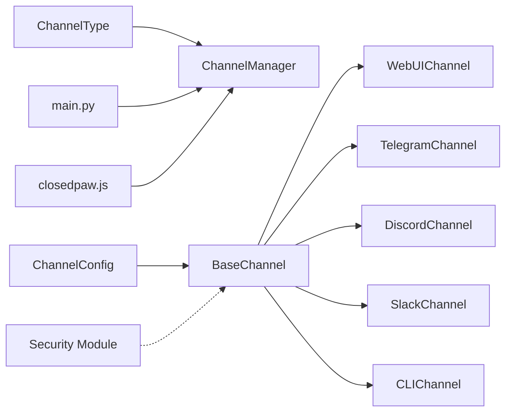
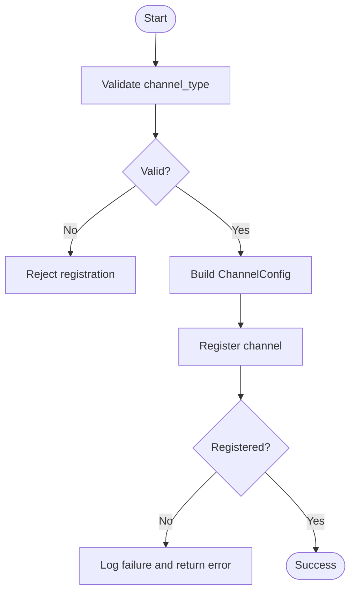

# Channel Types and Configuration

<cite>
**Referenced Files in This Document**
- [channels.py](file://backend/app/core/channels.py)
- [security.py](file://backend/app/core/security.py)
- [main.py](file://backend/app/main.py)
- [closedpaw.js](file://bin/closedpaw.js)
- [README.md](file://README.md)
</cite>

## Table of Contents
1. [Introduction](#introduction)
2. [Project Structure](#project-structure)
3. [Core Components](#core-components)
4. [Architecture Overview](#architecture-overview)
5. [Detailed Component Analysis](#detailed-component-analysis)
6. [Dependency Analysis](#dependency-analysis)
7. [Performance Considerations](#performance-considerations)
8. [Troubleshooting Guide](#troubleshooting-guide)
9. [Conclusion](#conclusion)
10. [Appendices](#appendices)

## Introduction
This document explains the channel types and configuration management in the system. It covers the ChannelType enumeration, the ChannelConfig dataclass, channel-specific settings, rate limiting, security controls, and practical configuration examples for supported platforms. It also documents the configuration validation process and default settings for each channel type.

## Project Structure
The channel subsystem is implemented in the backend core and integrates with the main application and interactive configuration tooling.

**Diagram sources**
- [channels.py](file://backend/app/core/channels.py#L1-L524)
- [security.py](file://backend/app/core/security.py#L1-L455)
- [main.py](file://backend/app/main.py#L464-L541)
- [closedpaw.js](file://bin/closedpaw.js#L603-L849)

**Section sources**
- [channels.py](file://backend/app/core/channels.py#L1-L524)
- [main.py](file://backend/app/main.py#L464-L541)
- [closedpaw.js](file://bin/closedpaw.js#L603-L849)

## Core Components
- ChannelType: Enumeration of supported channel types (webui, telegram, discord, slack, matrix, cli).
- ChannelConfig: Dataclass defining channel configuration including bot tokens, app IDs, webhook URLs, allowed users/channels, rate limits, security flags, and extra fields.
- ChannelManager: Central registry and lifecycle manager for channels, including registration, start/stop, broadcasting, and user binding.
- Channel implementations: BaseChannel and subclasses for each platform (WebUI, Telegram, Discord, Slack, CLI), each handling platform-specific APIs and message routing.

Key defaults and behaviors:
- Default WebUI channel is registered automatically with pairing disabled.
- Allowed commands default to a safe subset (chat, status, help).
- Rate limiting defaults: per-user and global thresholds are defined in ChannelConfig.

**Section sources**
- [channels.py](file://backend/app/core/channels.py#L18-L65)
- [channels.py](file://backend/app/core/channels.py#L405-L523)

## Architecture Overview
The channel system is a multi-channel gateway that routes messages across platforms. The ChannelManager registers channel instances mapped by ChannelType and coordinates message handling and security checks.

**Diagram sources**
- [channels.py](file://backend/app/core/channels.py#L18-L523)

## Detailed Component Analysis

### ChannelType Enumeration
Supported channel types:
- webui: Internal web interface channel.
- telegram: Telegram bot channel.
- discord: Discord bot channel.
- slack: Slack bot channel.
- matrix: Matrix channel placeholder.
- cli: Command-line interface channel.

These values are used to select the appropriate channel implementation during registration.

**Section sources**
- [channels.py](file://backend/app/core/channels.py#L18-L26)

### ChannelConfig Dataclass
Fields and defaults:
- channel_type: ChannelType
- name: str
- enabled: bool (default True)
- bot_token: Optional[str] (platform-specific auth token)
- app_id: Optional[str] (platform-specific app identifier)
- webhook_url: Optional[str] (webhook endpoint URL)
- allowed_users: List[str] (empty by default)
- allowed_channels: List[str] (empty by default)
- rate_limit_per_user: int (default 30 per minute)
- rate_limit_global: int (default 100)
- require_pairing: bool (default True)
- allowed_commands: List[str] (default ["chat", "status", "help"])
- extra: Dict[str, Any] (additional platform-specific settings)

Validation and defaults:
- If allowed_users is empty, user allowance defaults to True (allow all).
- require_pairing defaults to True for security-sensitive channels.
- allowed_commands restricts command surface by default.

**Section sources**
- [channels.py](file://backend/app/core/channels.py#L42-L65)

### ChannelManager
Responsibilities:
- Registers channels by mapping ChannelType to concrete channel classes.
- Starts/stops channels and forwards messages.
- Broadcasts messages to multiple channels.
- Binds users to allowlists.
- Provides status reporting.

Behavior highlights:
- Unknown channel types are rejected during registration.
- Message handler is propagated to all registered channels.
- Default WebUI channel is registered automatically with pairing disabled.

**Section sources**
- [channels.py](file://backend/app/core/channels.py#L405-L523)

### Channel Implementations
- WebUIChannel: Queues messages for polling by the web UI; no external API calls.
- TelegramChannel: Polls updates and sends messages via Telegram Bot API; validates user permissions.
- DiscordChannel: Sends messages via Discord API; retrieves bot identity.
- SlackChannel: Sends messages via Slack API; retrieves bot identity.
- CLIChannel: Prints messages to stdout.

Each implementation:
- Uses bot_token when present.
- Implements get_me to retrieve identity information.
- Enforces user allowlist checks when applicable.

**Section sources**
- [channels.py](file://backend/app/core/channels.py#L137-L403)

### Security Controls and Rate Limiting
- Channel-level security:
  - require_pairing flag influences access control.
  - allowed_users list gates who can use the channel.
  - allowed_commands list constrains command surface.
- Rate limiting:
  - ChannelConfig defines per-user and global thresholds.
  - Additional rate limiting is implemented in the security module for broader protections.

Note: The security module’s RateLimiter provides a separate mechanism for request throttling across the system.

**Section sources**
- [channels.py](file://backend/app/core/channels.py#L42-L65)
- [security.py](file://backend/app/core/security.py#L290-L318)

### Configuration Validation and Defaults
- Registration API validation:
  - Channel type is validated against ChannelType enumeration.
  - On success, a ChannelConfig is constructed and registered.
- Default settings:
  - Default WebUI channel is registered with require_pairing=False.
  - ChannelConfig defaults apply for rate limits, allowed commands, and allowlists.

**Section sources**
- [main.py](file://backend/app/main.py#L473-L504)
- [channels.py](file://backend/app/core/channels.py#L515-L523)

### Practical Configuration Examples

#### Web UI Channel
- Purpose: Internal web interface.
- Typical settings:
  - enabled: True
  - require_pairing: False (no external auth required)
  - allowed_users: empty (allow all)
- Notes: No tokens or webhook URLs are needed.

**Section sources**
- [channels.py](file://backend/app/core/channels.py#L515-L523)

#### Telegram Channel
- Setup steps:
  - Obtain a bot token from BotFather.
  - Configure allowed users (Telegram user IDs).
- Example configuration fields:
  - bot_token: "<your_telegram_bot_token>"
  - allowed_users: ["<user_id_1>", "<user_id_2>"]
  - enabled: True
- Security boundary:
  - Users not in allowed_users are blocked.
  - Pairing requirement depends on deployment policy.

**Section sources**
- [closedpaw.js](file://bin/closedpaw.js#L634-L651)
- [channels.py](file://backend/app/core/channels.py#L177-L286)

#### Discord Channel
- Setup steps:
  - Create a bot application and invite it to your server.
  - Copy the bot token from the developer portal.
- Example configuration fields:
  - bot_token: "<your_discord_bot_token>"
  - allowed_channels: ["<channel_id_1>"]
  - enabled: True
- Security boundary:
  - Ensure the bot has permissions to read messages and send responses in allowed channels.

**Section sources**
- [closedpaw.js](file://bin/closedpaw.js#L652-L671)
- [channels.py](file://backend/app/core/channels.py#L288-L334)

#### Slack Channel
- Setup steps:
  - Create an app and install it to your workspace.
  - Generate a Bot User OAuth Token.
- Example configuration fields:
  - bot_token: "xoxb-<your_slack_bot_token>"
  - allowed_channels: ["<channel_id_1>"]
  - enabled: True
- Security boundary:
  - Verify the token has chat:write scope for the target channels.

**Section sources**
- [closedpaw.js](file://bin/closedpaw.js#L672-L691)
- [channels.py](file://backend/app/core/channels.py#L336-L382)

#### CLI Channel
- Purpose: Terminal interaction for testing and automation.
- Typical settings:
  - enabled: True
  - allowed_users: empty (allow all)
- Notes: No tokens or webhook URLs are needed.

**Section sources**
- [channels.py](file://backend/app/core/channels.py#L384-L403)

#### Matrix Channel
- Status: Placeholder support exists in ChannelType and ChannelManager mapping.
- Typical settings:
  - bot_token: "<your_matrix_access_token>" (if applicable)
  - allowed_channels: ["!<room_id>:matrix.example.org"]
  - enabled: True
- Notes: Implementation specifics depend on Matrix homeserver and SDK used.

**Section sources**
- [channels.py](file://backend/app/core/channels.py#L18-L26)
- [channels.py](file://backend/app/core/channels.py#L419-L425)

### Configuration Workflow and API Endpoints
- Interactive configuration:
  - The CLI wizard prompts for channel selection and collects tokens and allowlists.
- Programmatic registration:
  - POST /api/channels/register accepts channel_type, name, bot_token, allowed_users, enabled.
  - POST /api/channels/{channel_name}/bind-user binds a user to a channel’s allowlist.
  - POST /api/channels/start and POST /api/channels/stop manage channel lifecycles.
  - GET /api/channels returns channel status.

**Section sources**
- [closedpaw.js](file://bin/closedpaw.js#L603-L849)
- [main.py](file://backend/app/main.py#L464-L541)

## Dependency Analysis
- ChannelManager depends on ChannelType to instantiate the correct channel subclass.
- Channel implementations depend on ChannelConfig for credentials and settings.
- Security module provides rate limiting and input validation utilities used across the system.
- The main application exposes REST endpoints to manage channels.

**Diagram sources**
- [channels.py](file://backend/app/core/channels.py#L18-L523)
- [security.py](file://backend/app/core/security.py#L1-L455)
- [main.py](file://backend/app/main.py#L464-L541)
- [closedpaw.js](file://bin/closedpaw.js#L603-L849)

**Section sources**
- [channels.py](file://backend/app/core/channels.py#L405-L523)
- [security.py](file://backend/app/core/security.py#L1-L455)
- [main.py](file://backend/app/main.py#L464-L541)
- [closedpaw.js](file://bin/closedpaw.js#L603-L849)

## Performance Considerations
- Rate limiting:
  - ChannelConfig defines per-user and global thresholds to mitigate abuse.
  - The security module’s RateLimiter provides additional protection for high-level requests.
- Asynchronous polling:
  - TelegramChannel uses asynchronous polling to avoid blocking the event loop.
- Broadcasting:
  - ChannelManager.broadcast iterates enabled channels and sends messages to the first allowed channel ID.

[No sources needed since this section provides general guidance]

## Troubleshooting Guide
Common issues and resolutions:
- Channel not starting:
  - Verify bot_token is configured for Telegram/Discord/Slack channels.
  - Check logs for warnings about missing tokens.
- Unauthorized user errors:
  - Ensure the user ID is present in allowed_users for the channel.
  - For Telegram, user IDs are numeric; confirm correct format.
- Messages not delivered:
  - Confirm allowed_channels contains the target channel IDs for Discord/Slack.
  - For Telegram, ensure the bot has permission to read messages in the chat.
- Rate limit exceeded:
  - Reduce message frequency or adjust rate_limit_per_user/rate_limit_global in ChannelConfig.
  - Review security module rate limiting if applicable.

**Section sources**
- [channels.py](file://backend/app/core/channels.py#L185-L201)
- [channels.py](file://backend/app/core/channels.py#L117-L134)
- [channels.py](file://backend/app/core/channels.py#L308-L321)
- [channels.py](file://backend/app/core/channels.py#L356-L369)
- [security.py](file://backend/app/core/security.py#L290-L318)

## Conclusion
The channel system provides a unified, secure, and extensible framework for multi-platform communication. ChannelConfig centralizes configuration, ChannelManager orchestrates lifecycle and routing, and platform-specific implementations handle protocol details. Security defaults and rate limiting help enforce zero-trust boundaries, while the interactive configuration tool simplifies setup.

[No sources needed since this section summarizes without analyzing specific files]

## Appendices

### Configuration Validation Flow

**Diagram sources**
- [main.py](file://backend/app/main.py#L473-L504)
- [channels.py](file://backend/app/core/channels.py#L416-L444)

### Default Settings Reference
- Default WebUI:
  - require_pairing: False
  - enabled: True
- ChannelConfig defaults:
  - rate_limit_per_user: 30 per minute
  - rate_limit_global: 100
  - allowed_commands: ["chat", "status", "help"]

**Section sources**
- [channels.py](file://backend/app/core/channels.py#L515-L523)
- [channels.py](file://backend/app/core/channels.py#L56-L62)