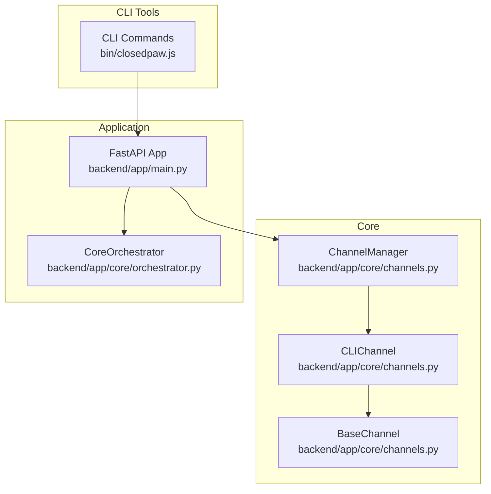
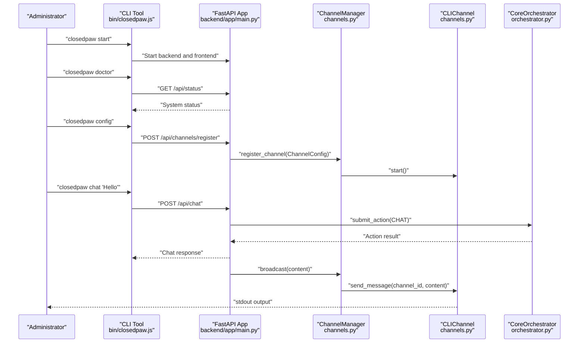
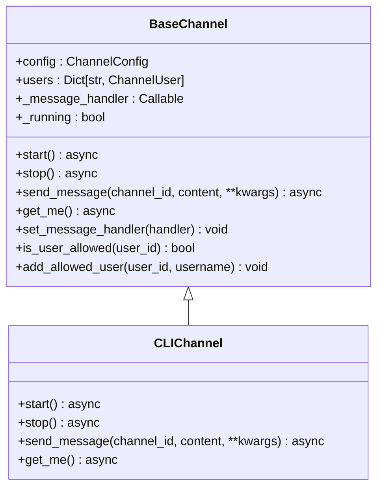
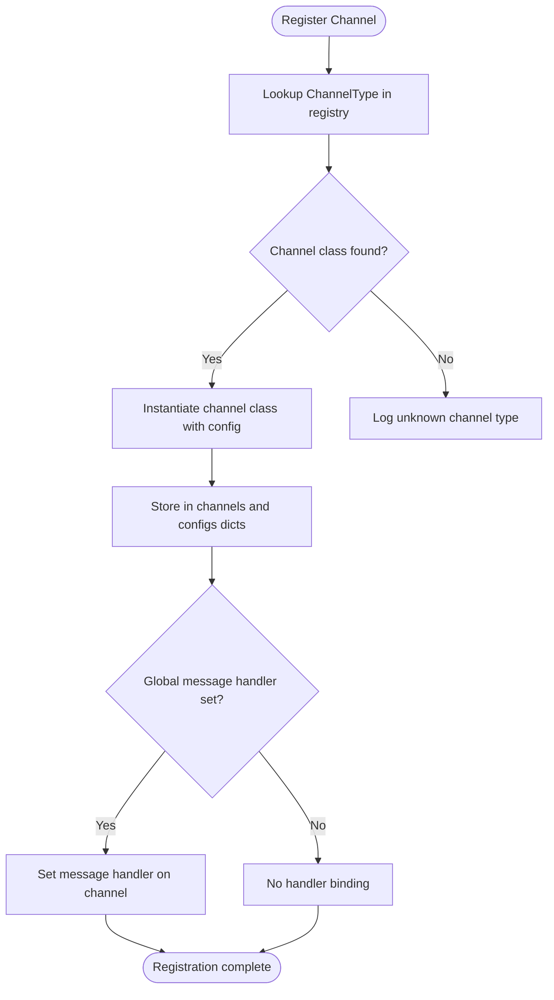
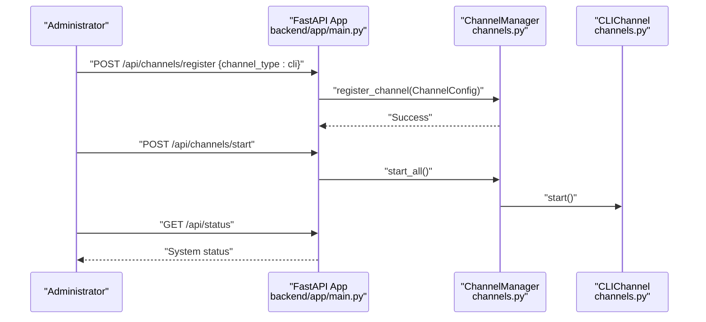
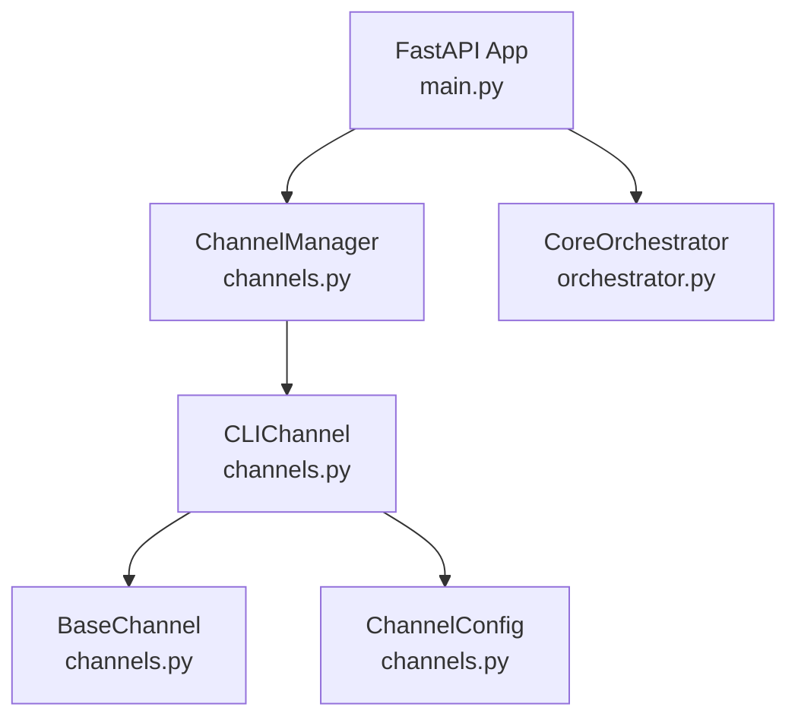

# Command Line Interface Channel

<cite>
**Referenced Files in This Document**
- [channels.py](file://backend/app/core/channels.py)
- [main.py](file://backend/app/main.py)
- [orchestrator.py](file://backend/app/core/orchestrator.py)
- [closedpaw.js](file://bin/closedpaw.js)
- [README.md](file://README.md)
</cite>

## Table of Contents
1. [Introduction](#introduction)
2. [Project Structure](#project-structure)
3. [Core Components](#core-components)
4. [Architecture Overview](#architecture-overview)
5. [Detailed Component Analysis](#detailed-component-analysis)
6. [Dependency Analysis](#dependency-analysis)
7. [Performance Considerations](#performance-considerations)
8. [Troubleshooting Guide](#troubleshooting-guide)
9. [Conclusion](#conclusion)

## Introduction
This document describes the Command Line Interface (CLI) channel implementation for terminal-based interaction and system administration within the ClosedPaw system. The CLI channel enables administrators and users to interact with the system through standard output printing, facilitating debugging, automated operations, and integration with system monitoring tools. It is part of a broader multi-channel gateway that supports various communication platforms while maintaining a unified abstraction for message handling and routing.

## Project Structure
The CLI channel resides in the core channel framework alongside other channel implementations (Web UI, Telegram, Discord, Slack). It is integrated with the application’s channel management system and exposed through the main FastAPI application for administrative commands and system status reporting.

**Diagram sources**
- [channels.py](file://backend/app/core/channels.py#L405-L524)
- [main.py](file://backend/app/main.py#L1-L567)
- [orchestrator.py](file://backend/app/core/orchestrator.py#L1-L486)
- [closedpaw.js](file://bin/closedpaw.js#L1-L911)

**Section sources**
- [channels.py](file://backend/app/core/channels.py#L1-L524)
- [main.py](file://backend/app/main.py#L1-L567)
- [closedpaw.js](file://bin/closedpaw.js#L1-L911)

## Core Components
- CLIChannel: Terminal-based channel that prints outgoing messages to standard output. It inherits from BaseChannel and implements minimal lifecycle and messaging methods tailored for CLI environments.
- ChannelManager: Central registry and orchestrator for all channel types, including CLI. It manages registration, message routing, and broadcasting across channels.
- BaseChannel: Abstract base class defining the channel contract, including lifecycle methods, user allowlisting, and message handler callbacks.
- ChannelConfig: Configuration container for channel settings such as type, name, enablement, and security parameters.
- ChannelType: Enumeration of supported channel types, including CLI.

Key characteristics of the CLI channel:
- Simplified message handling: Outgoing content is printed to stdout, enabling straightforward integration with shell scripts and monitoring tools.
- Minimal runtime overhead: No network I/O or external service dependencies.
- Administrative integration: Works seamlessly with the application’s channel management APIs for starting/stopping channels and broadcasting messages.

**Section sources**
- [channels.py](file://backend/app/core/channels.py#L384-L403)
- [channels.py](file://backend/app/core/channels.py#L405-L524)
- [channels.py](file://backend/app/core/channels.py#L79-L135)
- [channels.py](file://backend/app/core/channels.py#L18-L65)

## Architecture Overview
The CLI channel participates in the multi-channel architecture by adhering to the BaseChannel interface. It is registered through ChannelManager and can receive messages routed from the orchestrator or administrative commands. The main application exposes endpoints for channel management and status reporting, enabling automation and monitoring.

**Diagram sources**
- [closedpaw.js](file://bin/closedpaw.js#L224-L272)
- [closedpaw.js](file://bin/closedpaw.js#L326-L355)
- [closedpaw.js](file://bin/closedpaw.js#L851-L907)
- [main.py](file://backend/app/main.py#L515-L529)
- [main.py](file://backend/app/main.py#L466-L504)
- [channels.py](file://backend/app/core/channels.py#L405-L483)
- [channels.py](file://backend/app/core/channels.py#L384-L403)
- [orchestrator.py](file://backend/app/core/orchestrator.py#L169-L224)

## Detailed Component Analysis

### CLIChannel Class
The CLIChannel class provides a minimal implementation for terminal-based interaction:
- Lifecycle: start sets the channel running; stop clears the running flag.
- Message sending: send_message prints content to stdout, enabling integration with shell pipelines and monitoring tools.
- Identity: get_me returns a simple identifier for CLI channel.

**Diagram sources**
- [channels.py](file://backend/app/core/channels.py#L79-L135)
- [channels.py](file://backend/app/core/channels.py#L384-L403)

**Section sources**
- [channels.py](file://backend/app/core/channels.py#L384-L403)

### ChannelManager Integration
ChannelManager registers and manages channels, including CLI. It maps ChannelType to concrete channel classes and wires message handlers across all channels. It also provides administrative operations such as starting/stopping channels and broadcasting messages.

**Diagram sources**
- [channels.py](file://backend/app/core/channels.py#L416-L444)

**Section sources**
- [channels.py](file://backend/app/core/channels.py#L405-L483)

### Application Integration and Administrative Commands
The main application exposes endpoints for channel management and status reporting:
- GET /api/channels: Retrieve channel status
- POST /api/channels/register: Register a new channel (including CLI)
- POST /api/channels/start: Start all channels
- POST /api/channels/stop: Stop all channels
- GET /api/status: System status including Ollama connectivity and pending actions

These endpoints integrate with ChannelManager to manage channel lifecycles and broadcast messages to all enabled channels, including CLI.

**Diagram sources**
- [main.py](file://backend/app/main.py#L466-L529)
- [channels.py](file://backend/app/core/channels.py#L416-L444)
- [channels.py](file://backend/app/core/channels.py#L384-L403)

**Section sources**
- [main.py](file://backend/app/main.py#L466-L529)
- [channels.py](file://backend/app/core/channels.py#L405-L483)

### CLI Usage Patterns and Command-Line Argument Processing
The CLI tool provides several commands for system administration and interaction:
- install: Installs ClosedPaw, checking dependencies and downloading models.
- start/stop: Starts and stops the backend and frontend services.
- status: Reports installation and runtime status, including API availability and Ollama connectivity.
- doctor: Runs diagnostics to check system health.
- update: Updates the CLI and local installation.
- migrate: Migrates data from other systems.
- config: Interactive configuration for providers and channels.
- bind-telegram: Adds users to Telegram allowlist.
- chat: Sends chat messages to the AI assistant via the API.

These commands demonstrate argument processing and integration with the application’s API endpoints, enabling automated operations and system monitoring.

**Section sources**
- [closedpaw.js](file://bin/closedpaw.js#L88-L222)
- [closedpaw.js](file://bin/closedpaw.js#L224-L290)
- [closedpaw.js](file://bin/closedpaw.js#L292-L355)
- [closedpaw.js](file://bin/closedpaw.js#L357-L479)
- [closedpaw.js](file://bin/closedpaw.js#L481-L535)
- [closedpaw.js](file://bin/closedpaw.js#L537-L601)
- [closedpaw.js](file://bin/closedpaw.js#L603-L677)
- [closedpaw.js](file://bin/closedpaw.js#L824-L849)
- [closedpaw.js](file://bin/closedpaw.js#L851-L907)

## Dependency Analysis
The CLI channel depends on the channel framework and integrates with the application’s orchestration and management layers. The primary dependencies are:
- BaseChannel and ChannelConfig for channel behavior and configuration.
- ChannelManager for registration and lifecycle management.
- CoreOrchestrator for action submission and execution, which may route results to channels.
- FastAPI application for administrative endpoints and status reporting.

**Diagram sources**
- [channels.py](file://backend/app/core/channels.py#L79-L135)
- [channels.py](file://backend/app/core/channels.py#L384-L403)
- [channels.py](file://backend/app/core/channels.py#L405-L524)
- [main.py](file://backend/app/main.py#L1-L567)
- [orchestrator.py](file://backend/app/core/orchestrator.py#L1-L486)

**Section sources**
- [channels.py](file://backend/app/core/channels.py#L384-L403)
- [channels.py](file://backend/app/core/channels.py#L405-L524)
- [main.py](file://backend/app/main.py#L1-L567)
- [orchestrator.py](file://backend/app/core/orchestrator.py#L1-L486)

## Performance Considerations
- Output throughput: Printing to stdout is efficient for terminal-based interaction but may not scale for high-volume messaging scenarios.
- Minimal overhead: The CLI channel avoids network I/O and external dependencies, reducing latency and resource consumption.
- Broadcasting: ChannelManager’s broadcast mechanism iterates over enabled channels; ensure only necessary channels are enabled for optimal performance.

## Troubleshooting Guide
Common issues and resolutions:
- CLI channel not receiving messages:
  - Verify the channel is registered and started via administrative endpoints.
  - Confirm the global message handler is set so that incoming messages are routed to the CLI channel.
- API connectivity problems:
  - Use the doctor command to diagnose system health and API availability.
  - Ensure the backend is running on localhost and accessible on the expected port.
- Permission and allowlisting:
  - For channels that support user allowlists, ensure users are bound to the channel before sending messages.
- Logging and auditing:
  - Review application logs for channel lifecycle events and errors.

**Section sources**
- [channels.py](file://backend/app/core/channels.py#L416-L444)
- [channels.py](file://backend/app/core/channels.py#L456-L461)
- [closedpaw.js](file://bin/closedpaw.js#L357-L479)

## Conclusion
The CLI channel provides a streamlined, terminal-centric interface for interacting with the ClosedPaw system. Its simplified message handling approach—printing to stdout—enables easy integration with shell scripts, automation tools, and monitoring systems. Integrated with the application’s channel management and administrative endpoints, the CLI channel supports debugging, system administration, and automated operations within a zero-trust architecture. Administrators can leverage the CLI tool’s commands and the application’s endpoints to configure, monitor, and operate the system efficiently.