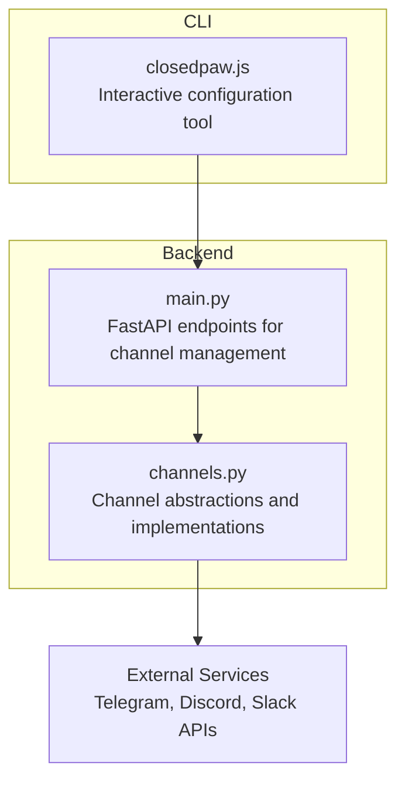
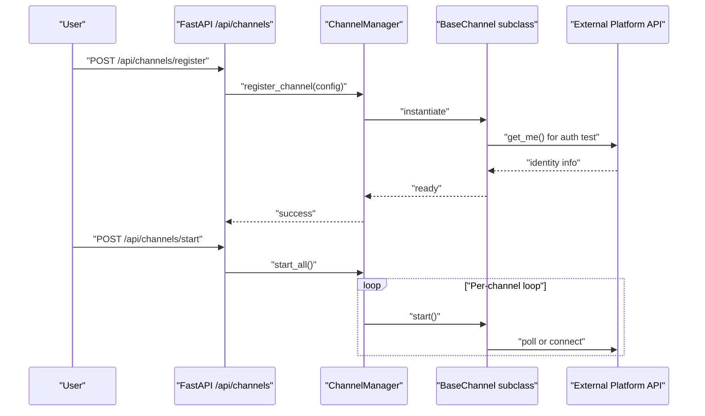
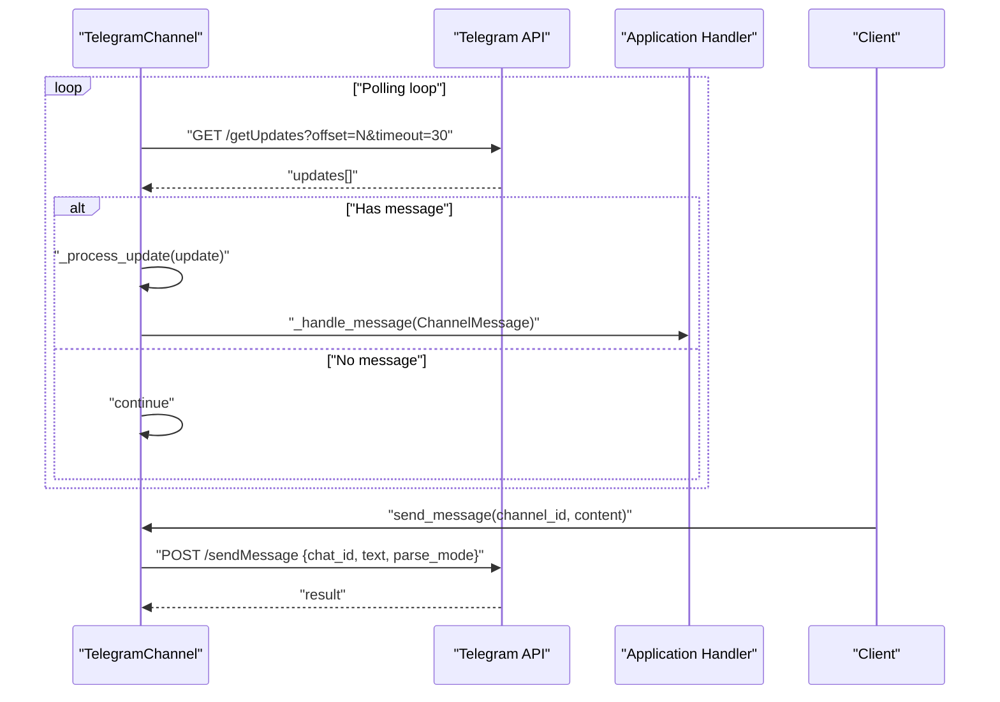
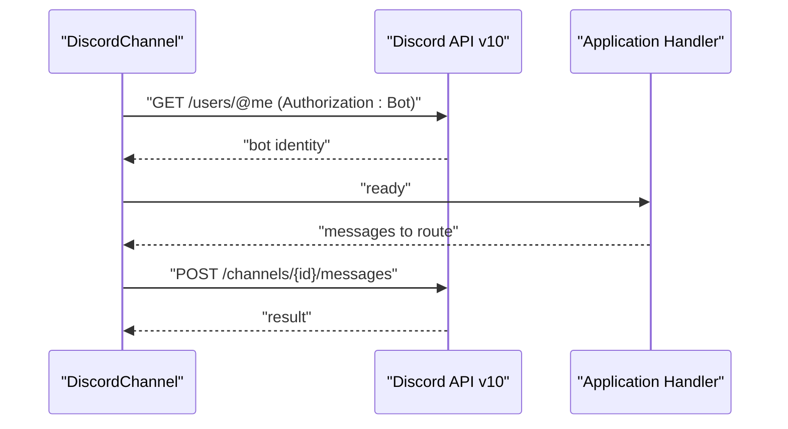
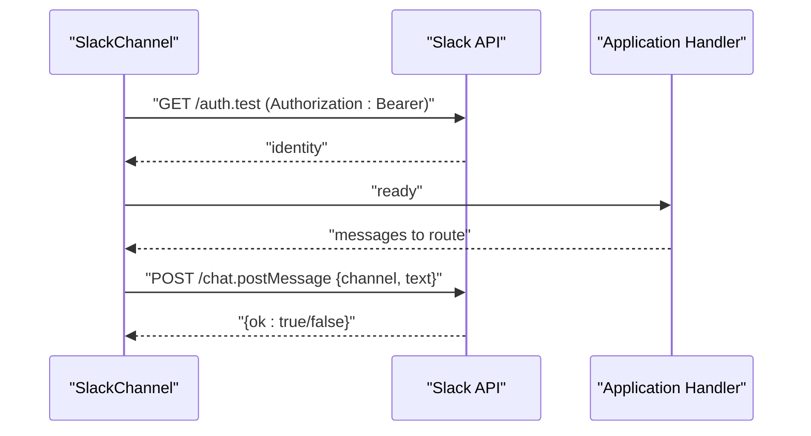
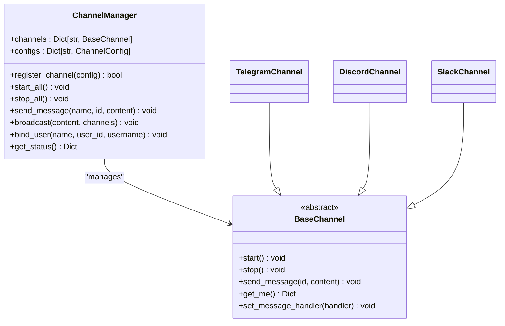
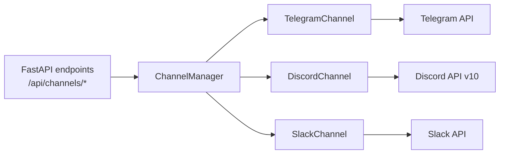

# External Communication Channels

<cite>
**Referenced Files in This Document**
- [channels.py](file://backend/app/core/channels.py)
- [main.py](file://backend/app/main.py)
- [closedpaw.js](file://bin/closedpaw.js)
- [README.md](file://README.md)
</cite>

## Table of Contents
1. [Introduction](#introduction)
2. [Project Structure](#project-structure)
3. [Core Components](#core-components)
4. [Architecture Overview](#architecture-overview)
5. [Detailed Component Analysis](#detailed-component-analysis)
6. [Dependency Analysis](#dependency-analysis)
7. [Performance Considerations](#performance-considerations)
8. [Troubleshooting Guide](#troubleshooting-guide)
9. [Conclusion](#conclusion)
10. [Appendices](#appendices)

## Introduction
This document explains the external communication channels supported by the system, focusing on Telegram, Discord, and Slack integrations. It covers authentication, message routing, rate limiting, error handling, and practical setup steps. The implementation centers around a unified channel abstraction with a shared configuration model and a channel manager that registers and controls channel instances.

## Project Structure
The channel implementations reside in the backend core module and are exposed via the FastAPI application. A command-line tool assists with initial configuration.

**Diagram sources**
- [channels.py](file://backend/app/core/channels.py#L177-L382)
- [main.py](file://backend/app/main.py#L464-L529)
- [closedpaw.js](file://bin/closedpaw.js#L604-L677)

**Section sources**
- [channels.py](file://backend/app/core/channels.py#L1-L524)
- [main.py](file://backend/app/main.py#L1-L567)
- [closedpaw.js](file://bin/closedpaw.js#L600-L850)

## Core Components
- ChannelType: Enumerates supported channel types including telegram, discord, slack, webui, cli, and matrix.
- ChannelConfig: Holds channel-wide settings such as bot tokens, allowed users/channels, rate limits, and security flags.
- ChannelMessage: Standardized message envelope passed to the application’s message handler.
- BaseChannel: Abstract interface defining lifecycle and messaging operations.
- ChannelManager: Central registry and orchestrator for channel instances, including registration, startup, shutdown, and broadcasting.

Key configuration defaults:
- Rate limiting: per-user and global thresholds are defined in ChannelConfig.
- Allowed commands: default set includes chat, status, help.
- Pairing requirement: enabled by default for stricter access control.

**Section sources**
- [channels.py](file://backend/app/core/channels.py#L18-L77)
- [channels.py](file://backend/app/core/channels.py#L405-L503)

## Architecture Overview
The system integrates external chat platforms through asynchronous HTTP clients. Incoming messages are polled or fetched and routed into the application via a shared message handler. Outgoing messages are sent using platform-specific APIs with appropriate authorization headers.

**Diagram sources**
- [main.py](file://backend/app/main.py#L473-L520)
- [channels.py](file://backend/app/core/channels.py#L416-L450)

## Detailed Component Analysis

### TelegramChannel
- Polling mechanism: Uses long-polling via getUpdates with an offset to avoid duplicates and minimize missed messages.
- Update processing: Extracts chat_id, user_id, and text; validates presence; checks user allowlist; constructs ChannelMessage; invokes the global handler.
- Message routing: Sends Markdown-formatted messages using sendMessage with parse_mode.
- Authentication: Requires a bot token; fetches bot identity via getMe.
- Rate limiting: Implemented at the configuration level via ChannelConfig; enforcement occurs in the application’s orchestration layer.
- Error handling: Logs errors during polling and sending; continues polling on exceptions.

**Diagram sources**
- [channels.py](file://backend/app/core/channels.py#L202-L258)
- [channels.py](file://backend/app/core/channels.py#L259-L285)

**Section sources**
- [channels.py](file://backend/app/core/channels.py#L177-L285)

### DiscordChannel
- Integration: Uses the Discord API v10 with Authorization: Bot <token>.
- Message sending: Posts to channels/{channel_id}/messages with plain text content.
- Authentication: Validates identity via users/@me endpoint.
- Rate limiting: Configured via ChannelConfig; enforcement handled by the application layer.
- Error handling: Logs non-200/201 responses.

**Diagram sources**
- [channels.py](file://backend/app/core/channels.py#L288-L334)

**Section sources**
- [channels.py](file://backend/app/core/channels.py#L288-L334)

### SlackChannel
- Integration: Uses Slack’s chat.postMessage endpoint with Authorization: Bearer <token>.
- Message sending: Sends plain text content to the specified channel.
- Authentication: Validates via auth.test endpoint.
- Rate limiting: Configured via ChannelConfig; enforcement handled by the application layer.
- Error handling: Logs failures when ok is false.

**Diagram sources**
- [channels.py](file://backend/app/core/channels.py#L336-L382)

**Section sources**
- [channels.py](file://backend/app/core/channels.py#L336-L382)

### ChannelManager and Registration
- Registration: Maps ChannelType to concrete channel classes and instantiates them with provided ChannelConfig.
- Lifecycle: Supports start_all and stop_all operations.
- Routing: Provides send_message and broadcast helpers; forwards messages to enabled channels.
- Status: Exposes channel counts and configuration summaries.

**Diagram sources**
- [channels.py](file://backend/app/core/channels.py#L405-L503)
- [channels.py](file://backend/app/core/channels.py#L177-L382)

**Section sources**
- [channels.py](file://backend/app/core/channels.py#L405-L503)

## Dependency Analysis
- HTTP client: httpx.AsyncClient is used across Telegram, Discord, and Slack implementations for outbound requests.
- Application integration: FastAPI endpoints expose channel registration, binding, and lifecycle control.
- CLI configuration: The interactive tool writes a channels.json file consumed by the configuration system.

**Diagram sources**
- [main.py](file://backend/app/main.py#L466-L529)
- [channels.py](file://backend/app/core/channels.py#L177-L382)

**Section sources**
- [main.py](file://backend/app/main.py#L464-L529)
- [channels.py](file://backend/app/core/channels.py#L177-L382)

## Performance Considerations
- Polling overhead: TelegramChannel uses long-polling; tune timeout and offset handling to balance latency and missed updates.
- Concurrency: httpx.AsyncClient enables concurrent operations; ensure upstream platform rate limits are respected.
- Rate limiting: Configure per-user and global limits in ChannelConfig; enforce at the application level to prevent downstream throttling.
- Backoff: On exceptions during polling, the implementation retries after a short delay; consider jitter for resilience.

[No sources needed since this section provides general guidance]

## Troubleshooting Guide
Common issues and resolutions:
- Missing bot token:
  - Symptom: Warning logged and channel does not start.
  - Resolution: Provide a valid token in ChannelConfig and restart the channel.
- Unauthorized access:
  - Symptom: Messages rejected for non-allowlisted users.
  - Resolution: Bind the user to the channel allowlist via the API or CLI tool.
- Sending failures:
  - Telegram: Check parse_mode and content length; verify token permissions.
  - Discord: Confirm Authorization header format and channel accessibility.
  - Slack: Verify Bearer token and channel existence.
- Health and status:
  - Use the status endpoint to confirm connectivity and model availability.

Practical steps:
- Register a channel via the API with bot_token and allowed_users.
- Start all channels to initialize connections.
- Use the CLI tool to interactively configure tokens and allowlists.

**Section sources**
- [channels.py](file://backend/app/core/channels.py#L185-L200)
- [channels.py](file://backend/app/core/channels.py#L295-L302)
- [channels.py](file://backend/app/core/channels.py#L343-L350)
- [main.py](file://backend/app/main.py#L473-L520)
- [closedpaw.js](file://bin/closedpaw.js#L634-L670)

## Conclusion
The channel subsystem provides a consistent, extensible foundation for integrating Telegram, Discord, and Slack. By centralizing configuration, enforcing security and rate limits, and offering robust error handling, the system supports secure, scalable multi-platform communication. Use the provided APIs and CLI tooling to configure tokens, manage users, and monitor channel health.

[No sources needed since this section summarizes without analyzing specific files]

## Appendices

### Setup and Configuration Examples
- Interactive configuration:
  - Run the CLI configuration wizard and select channels to configure.
  - Provide tokens and allowed users as prompted.
- Programmatic registration:
  - Use the FastAPI endpoint to register channels with ChannelConfig.
  - Start channels to activate polling/connectivity.
- Binding users:
  - Use the bind endpoint or CLI command to add users to allowlists.

**Section sources**
- [closedpaw.js](file://bin/closedpaw.js#L604-L677)
- [main.py](file://backend/app/main.py#L473-L520)
- [main.py](file://backend/app/main.py#L507-L513)