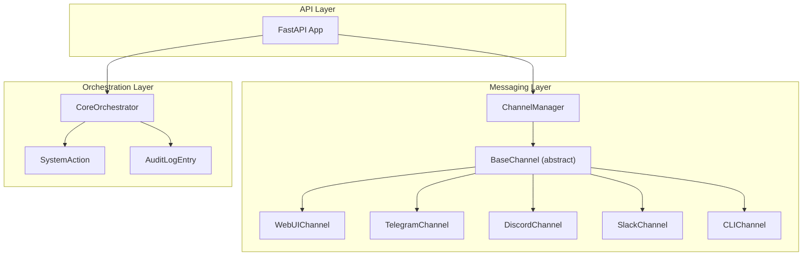
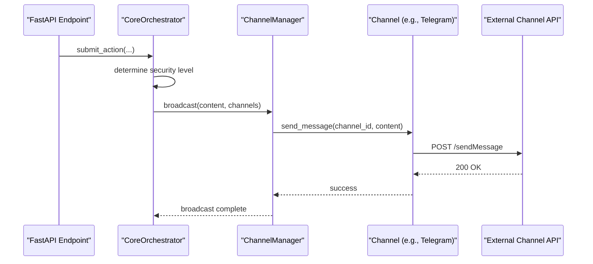
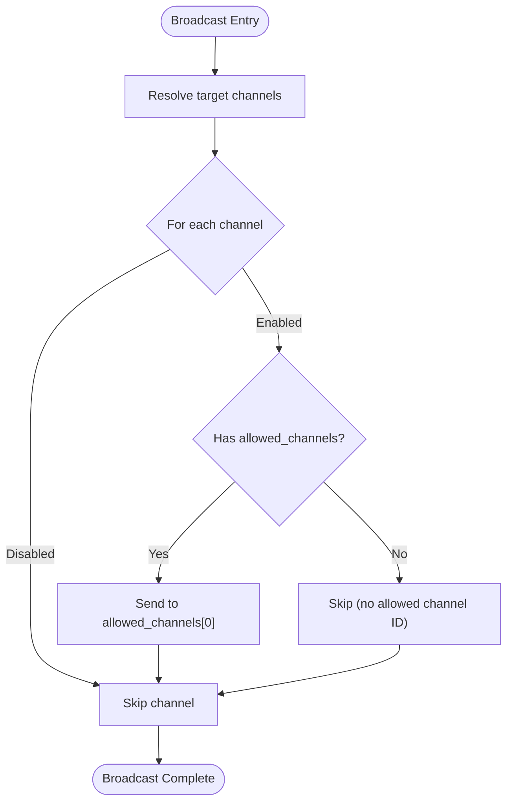
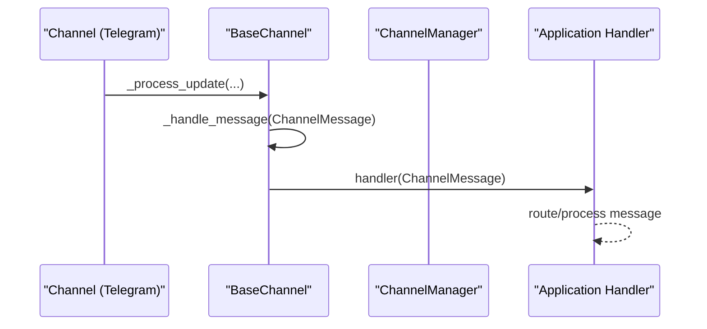
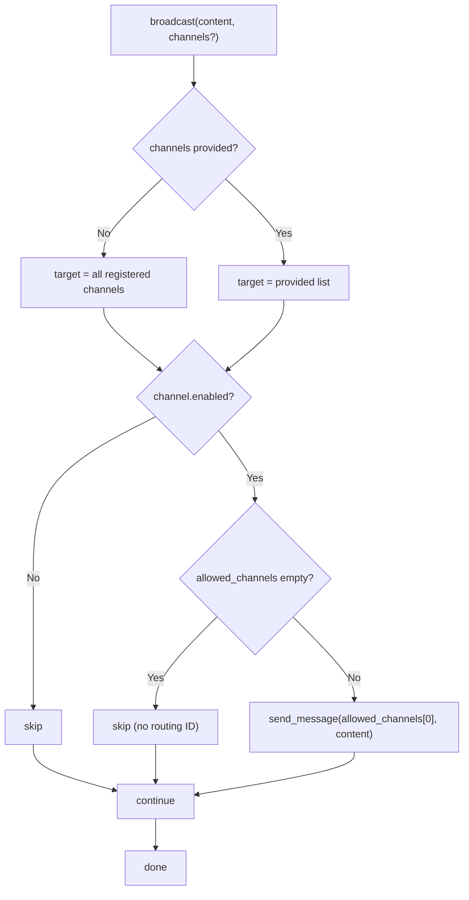
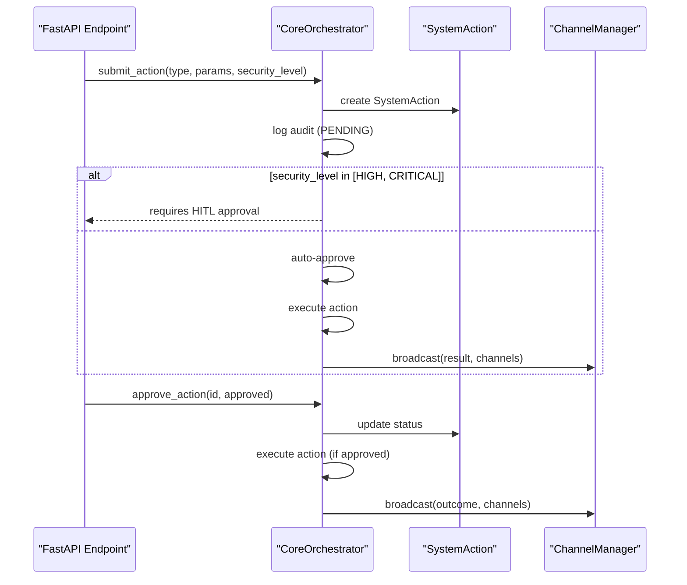
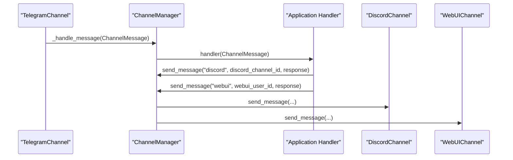
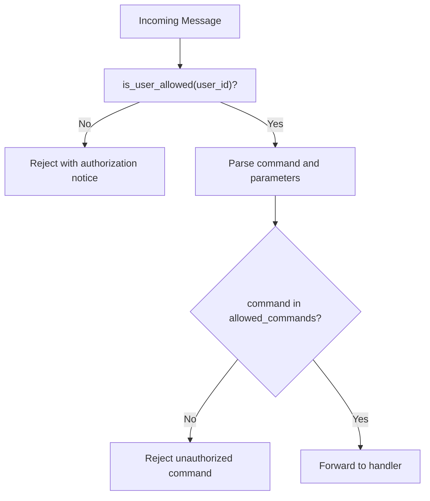
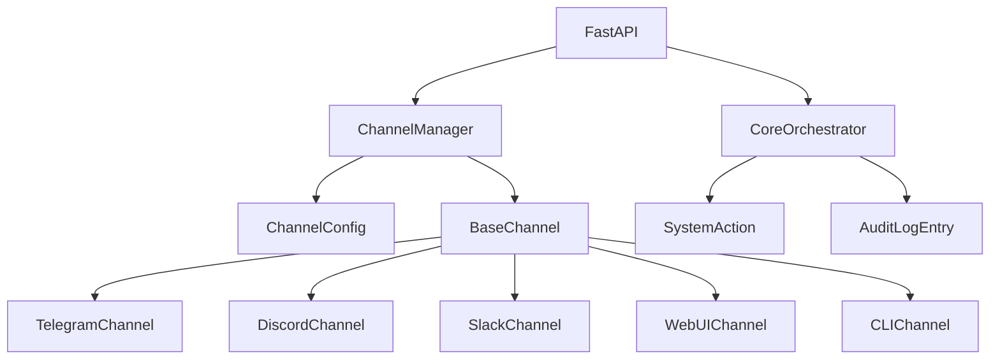

# Message Routing and Broadcasting

<cite>
**Referenced Files in This Document**
- [channels.py](file://backend/app/core/channels.py)
- [orchestrator.py](file://backend/app/core/orchestrator.py)
- [main.py](file://backend/app/main.py)
- [providers.py](file://backend/app/core/providers.py)
- [skill.py](file://skills/filesystem/skill.py)
</cite>

## Table of Contents
1. [Introduction](#introduction)
2. [Project Structure](#project-structure)
3. [Core Components](#core-components)
4. [Architecture Overview](#architecture-overview)
5. [Detailed Component Analysis](#detailed-component-analysis)
6. [Dependency Analysis](#dependency-analysis)
7. [Performance Considerations](#performance-considerations)
8. [Troubleshooting Guide](#troubleshooting-guide)
9. [Conclusion](#conclusion)
10. [Appendices](#appendices)

## Introduction
This document explains the message routing and broadcasting capabilities of the system, focusing on the ChannelManager’s targeted delivery and multi-channel broadcast mechanisms. It also documents the message handler pattern and event-driven architecture that enables cross-channel communication, the broadcast functionality with channel filtering and selective distribution, and the integration with the Core Orchestrator for action distribution and approval workflow coordination. Practical examples illustrate message routing patterns, broadcast scenarios, and cross-channel synchronization.

## Project Structure
The messaging and broadcasting system spans three primary areas:
- Channel abstraction and routing: ChannelManager and channel implementations
- Event-driven message handling: BaseChannel and message handler callbacks
- Orchestrator integration: Action submission, approval, and execution coordination

**Diagram sources**
- [channels.py](file://backend/app/core/channels.py#L405-L523)
- [orchestrator.py](file://backend/app/core/orchestrator.py#L87-L486)
- [main.py](file://backend/app/main.py#L13-L17)

**Section sources**
- [channels.py](file://backend/app/core/channels.py#L1-L523)
- [orchestrator.py](file://backend/app/core/orchestrator.py#L1-L486)
- [main.py](file://backend/app/main.py#L1-L567)

## Core Components
- ChannelType: Enumerates supported channel types (Web UI, Telegram, Discord, Slack, CLI).
- ChannelMessage: Standardized message structure for cross-channel events.
- ChannelConfig: Per-channel configuration including tokens, allowlists, rate limits, and allowed commands.
- BaseChannel: Abstract interface defining lifecycle and message sending behavior.
- ChannelManager: Central registry and router for channels, with targeted send and broadcast capabilities.
- CoreOrchestrator: Action lifecycle manager with security levels, HITL approval, and execution.

Key APIs for messaging:
- ChannelManager.send_message(channel_name, channel_id, content, **kwargs)
- ChannelManager.broadcast(content, channels=None)
- BaseChannel.set_message_handler(handler)
- BaseChannel.send_message(channel_id, content, **kwargs)

**Section sources**
- [channels.py](file://backend/app/core/channels.py#L18-L135)
- [channels.py](file://backend/app/core/channels.py#L405-L523)
- [orchestrator.py](file://backend/app/core/orchestrator.py#L87-L130)

## Architecture Overview
The system uses an event-driven architecture:
- Incoming messages are parsed by channel implementations and emitted as ChannelMessage objects.
- ChannelManager sets a global message handler on all channels.
- Applications (e.g., FastAPI routes) can subscribe to the handler to process cross-channel events.
- Broadcast leverages ChannelManager to distribute a single message to selected channels using their configured allowed channel IDs.

**Diagram sources**
- [main.py](file://backend/app/main.py#L131-L181)
- [orchestrator.py](file://backend/app/core/orchestrator.py#L169-L223)
- [channels.py](file://backend/app/core/channels.py#L462-L482)
- [channels.py](file://backend/app/core/channels.py#L259-L276)

## Detailed Component Analysis

### ChannelManager: Targeted Delivery and Broadcast
- Targeted delivery: send_message resolves the named channel and delegates to its send_message implementation.
- Broadcast: broadcast iterates over target channels, skipping disabled ones, and sends to the first allowed channel ID if configured.
- Global handler: set_message_handler propagates a single handler to all registered channels.

**Diagram sources**
- [channels.py](file://backend/app/core/channels.py#L470-L482)

**Section sources**
- [channels.py](file://backend/app/core/channels.py#L462-L482)

### Message Handler Pattern and Cross-Channel Events
- BaseChannel exposes set_message_handler to attach a callback for incoming messages.
- ChannelManager forwards the global handler to each channel during registration and start.
- Channel implementations parse external updates and emit ChannelMessage objects to the handler.

**Diagram sources**
- [channels.py](file://backend/app/core/channels.py#L112-L115)
- [channels.py](file://backend/app/core/channels.py#L456-L460)
- [channels.py](file://backend/app/core/channels.py#L225-L257)

**Section sources**
- [channels.py](file://backend/app/core/channels.py#L79-L135)
- [channels.py](file://backend/app/core/channels.py#L456-L460)

### Broadcast Filtering and Selective Distribution
- Channel filtering: broadcast accepts an optional channels list; if omitted, it targets all registered channels.
- Enabled-only dispatch: only enabled channels receive broadcast messages.
- Channel-specific routing: each channel’s allowed_channels list determines the destination ID used for broadcast.

**Diagram sources**
- [channels.py](file://backend/app/core/channels.py#L470-L482)

**Section sources**
- [channels.py](file://backend/app/core/channels.py#L470-L482)

### Integration with Core Orchestrator: Action Distribution and Approval Workflow
- Action submission: submit_action creates a SystemAction, logs audit, and auto-approves low/medium security actions or defers to HITL for high/critical.
- Approval workflow: approve_action transitions status and triggers execution if approved.
- Execution delegation: orchestrator routes actions to appropriate executors and records outcomes.

**Diagram sources**
- [main.py](file://backend/app/main.py#L131-L181)
- [main.py](file://backend/app/main.py#L284-L298)
- [orchestrator.py](file://backend/app/core/orchestrator.py#L169-L223)
- [orchestrator.py](file://backend/app/core/orchestrator.py#L376-L427)
- [channels.py](file://backend/app/core/channels.py#L470-L482)

**Section sources**
- [main.py](file://backend/app/main.py#L131-L181)
- [main.py](file://backend/app/main.py#L284-L298)
- [orchestrator.py](file://backend/app/core/orchestrator.py#L169-L223)
- [orchestrator.py](file://backend/app/core/orchestrator.py#L376-L427)

### Cross-Channel Synchronization Example
- Scenario: A user sends a message in Telegram; the system needs to echo the response to Discord and Web UI.
- Steps:
  1) TelegramChannel parses the update and emits ChannelMessage.
  2) ChannelManager forwards the message to the application handler.
  3) Application handler constructs a response and calls ChannelManager.send_message for each target channel.
  4) Channel implementations deliver via their respective APIs.

**Diagram sources**
- [channels.py](file://backend/app/core/channels.py#L112-L115)
- [channels.py](file://backend/app/core/channels.py#L462-L467)
- [channels.py](file://backend/app/core/channels.py#L308-L320)
- [channels.py](file://backend/app/core/channels.py#L152-L161)

**Section sources**
- [channels.py](file://backend/app/core/channels.py#L112-L115)
- [channels.py](file://backend/app/core/channels.py#L462-L467)
- [channels.py](file://backend/app/core/channels.py#L308-L320)
- [channels.py](file://backend/app/core/channels.py#L152-L161)

### Channel Filtering and Allowed Users
- User allowlisting: ChannelManager.bind_user adds users to a channel’s allowlist; channels enforce is_user_allowed during inbound processing.
- Command gating: ChannelConfig.allowed_commands restricts permitted commands per channel.

**Diagram sources**
- [channels.py](file://backend/app/core/channels.py#L117-L121)
- [channels.py](file://backend/app/core/channels.py#L239-L242)
- [channels.py](file://backend/app/core/channels.py#L61-L62)

**Section sources**
- [channels.py](file://backend/app/core/channels.py#L117-L121)
- [channels.py](file://backend/app/core/channels.py#L239-L242)
- [channels.py](file://backend/app/core/channels.py#L61-L62)

### Example Patterns
- Targeted delivery to a specific channel and user/group:
  - Use ChannelManager.send_message with the channel name and the channel-specific ID.
  - Reference: [channels.py](file://backend/app/core/channels.py#L462-L467)
- Broadcast to multiple channels:
  - Use ChannelManager.broadcast with an optional channels list to filter recipients.
  - Reference: [channels.py](file://backend/app/core/channels.py#L470-L482)
- Cross-channel synchronization after action execution:
  - After orchestrator completes an action, broadcast the result to Web UI and other channels.
  - References: [main.py](file://backend/app/main.py#L131-L181), [orchestrator.py](file://backend/app/core/orchestrator.py#L251-L301), [channels.py](file://backend/app/core/channels.py#L470-L482)
- Human-in-the-loop approval with broadcast:
  - For high/critical actions, orchestrator defers to HITL; upon approval, broadcast outcome to channels.
  - References: [orchestrator.py](file://backend/app/core/orchestrator.py#L210-L223), [main.py](file://backend/app/main.py#L284-L298), [channels.py](file://backend/app/core/channels.py#L470-L482)

**Section sources**
- [channels.py](file://backend/app/core/channels.py#L462-L482)
- [main.py](file://backend/app/main.py#L131-L181)
- [orchestrator.py](file://backend/app/core/orchestrator.py#L210-L223)
- [orchestrator.py](file://backend/app/core/orchestrator.py#L251-L301)
- [main.py](file://backend/app/main.py#L284-L298)

## Dependency Analysis
- ChannelManager depends on channel implementations and configuration to route messages.
- CoreOrchestrator depends on action definitions and security levels to decide execution and approval.
- FastAPI integrates with both systems to expose endpoints for chat, actions, and channel management.

**Diagram sources**
- [channels.py](file://backend/app/core/channels.py#L405-L523)
- [orchestrator.py](file://backend/app/core/orchestrator.py#L87-L130)
- [main.py](file://backend/app/main.py#L13-L17)

**Section sources**
- [channels.py](file://backend/app/core/channels.py#L405-L523)
- [orchestrator.py](file://backend/app/core/orchestrator.py#L87-L130)
- [main.py](file://backend/app/main.py#L13-L17)

## Performance Considerations
- Asynchronous I/O: Channels use async HTTP clients for external API calls; ensure timeouts and retry strategies are configured per provider/channel.
- Broadcast scaling: Broadcast loops through target channels; keep the target list minimal for large deployments.
- Rate limiting: Respect ChannelConfig.rate_limit_* and provider-side rate limits to avoid throttling.
- Message queuing: WebUIChannel queues messages for polling; monitor queue sizes to prevent memory pressure.

## Troubleshooting Guide
- Channel not found during send:
  - Ensure the channel name is registered and enabled.
  - Reference: [channels.py](file://backend/app/core/channels.py#L464-L468)
- Broadcast not reaching channels:
  - Verify channel.enabled and that allowed_channels is configured for each target.
  - Reference: [channels.py](file://backend/app/core/channels.py#L476-L482)
- Unauthorized user messages:
  - Confirm user binding and allowlist configuration.
  - Reference: [channels.py](file://backend/app/core/channels.py#L123-L134), [channels.py](file://backend/app/core/channels.py#L117-L121)
- Action not executing after approval:
  - Check orchestrator logs and action status transitions.
  - Reference: [orchestrator.py](file://backend/app/core/orchestrator.py#L376-L427), [main.py](file://backend/app/main.py#L284-L298)

**Section sources**
- [channels.py](file://backend/app/core/channels.py#L464-L468)
- [channels.py](file://backend/app/core/channels.py#L476-L482)
- [channels.py](file://backend/app/core/channels.py#L123-L134)
- [channels.py](file://backend/app/core/channels.py#L117-L121)
- [orchestrator.py](file://backend/app/core/orchestrator.py#L376-L427)
- [main.py](file://backend/app/main.py#L284-L298)

## Conclusion
The ChannelManager provides a robust, event-driven foundation for multi-channel messaging with targeted delivery and selective broadcast. Combined with the Core Orchestrator’s action lifecycle and approval workflow, the system supports secure, scalable cross-channel synchronization. Proper configuration of channel allowlists, allowed commands, and broadcast filters ensures predictable and auditable behavior across Telegram, Discord, Slack, Web UI, and CLI channels.

## Appendices
- Provider integration: While not part of message routing, the ProviderManager demonstrates similar patterns for multi-provider orchestration and can inspire consistent configuration and lifecycle management across channels and skills.
  - Reference: [providers.py](file://backend/app/core/providers.py#L418-L524)

**Section sources**
- [providers.py](file://backend/app/core/providers.py#L418-L524)