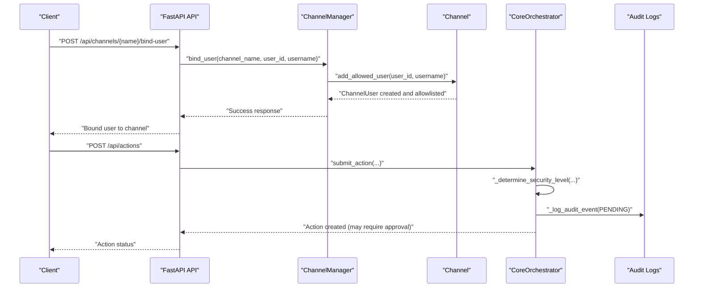
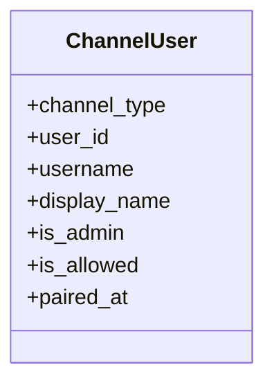
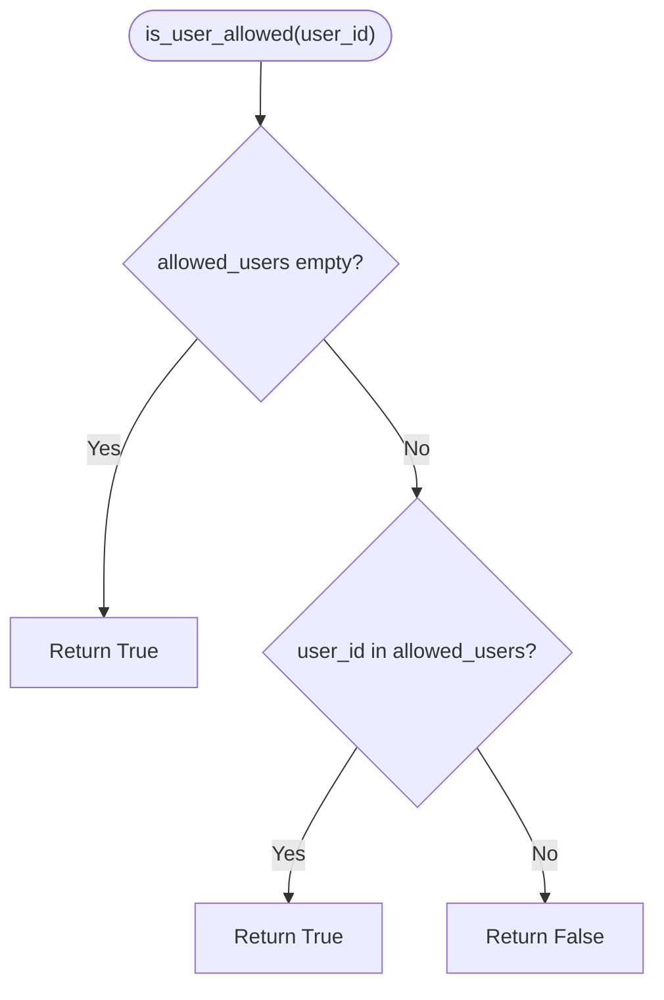
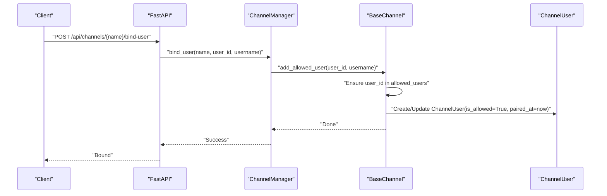
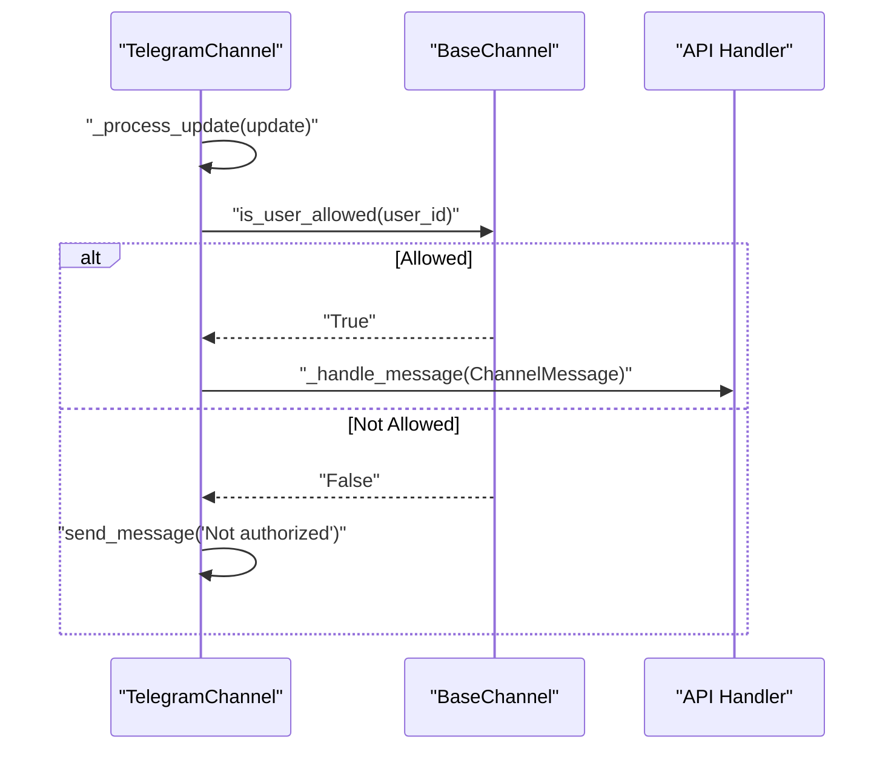
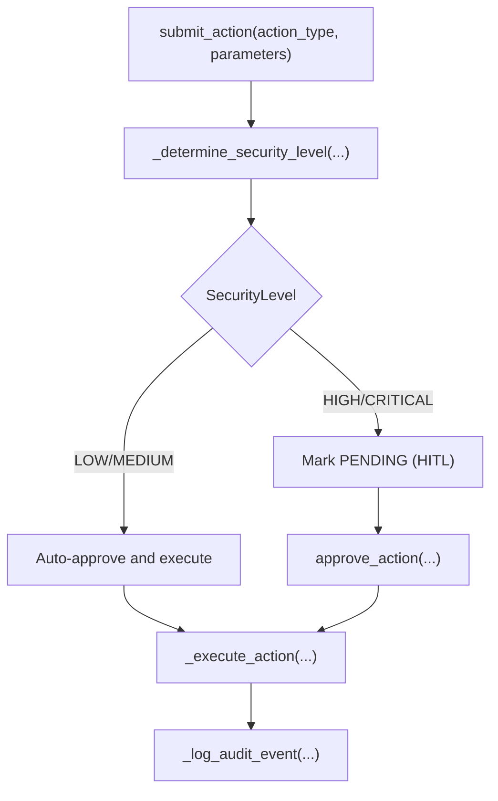
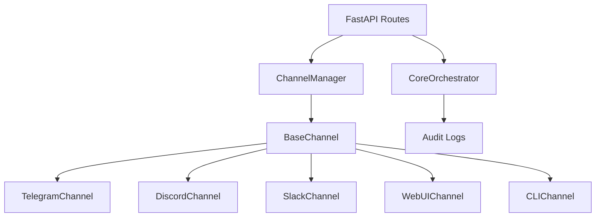

# User Authentication and Authorization

<cite>
**Referenced Files in This Document**
- [channels.py](file://backend/app/core/channels.py)
- [main.py](file://backend/app/main.py)
- [orchestrator.py](file://backend/app/core/orchestrator.py)
- [security.py](file://backend/app/core/security.py)
- [agent_manager.py](file://backend/app/core/agent_manager.py)
- [providers.py](file://backend/app/core/providers.py)
</cite>

## Table of Contents
1. [Introduction](#introduction)
2. [Project Structure](#project-structure)
3. [Core Components](#core-components)
4. [Architecture Overview](#architecture-overview)
5. [Detailed Component Analysis](#detailed-component-analysis)
6. [Dependency Analysis](#dependency-analysis)
7. [Performance Considerations](#performance-considerations)
8. [Troubleshooting Guide](#troubleshooting-guide)
9. [Conclusion](#conclusion)

## Introduction
This document explains the user authentication and authorization mechanisms in the system. It focuses on the ChannelUser class structure, user binding through the bind_user method, allowlist management, the is_user_allowed validation logic, channel-specific permission enforcement, the pairing mechanism for user verification, and the require_pairing security setting. It also covers practical user management workflows, permission escalation processes, and security audit trails for user activities across different channels.

## Project Structure
The authentication and authorization logic spans several modules:
- Channel gateway and user identity management
- API endpoints for channel management and user binding
- Orchestrator for security-aware action processing and audit logging
- Security utilities for input validation and rate limiting
- Agent manager for sandboxed execution of privileged operations

```mermaid
graph TB
subgraph "Channels"
CM["ChannelManager"]
BC["BaseChannel"]
TG["TelegramChannel"]
DC["DiscordChannel"]
SC["SlackChannel"]
WC["WebUIChannel"]
CL["CLIChannel"]
end
subgraph "API"
API["FastAPI App"]
CH["/api/channels/* endpoints"]
end
subgraph "Core"
ORCH["CoreOrchestrator"]
AUDIT["Audit Logs"]
end
subgraph "Security"
DEF["PromptInjectionDefender"]
RL["RateLimiter"]
end
API --> CH
CH --> CM
CM --> BC
BC --> TG
BC --> DC
BC --> SC
BC --> WC
BC --> CL
API --> ORCH
ORCH --> AUDIT
DEF --> API
RL --> API
```

**Diagram sources**
- [channels.py](file://backend/app/core/channels.py#L405-L524)
- [main.py](file://backend/app/main.py#L464-L530)
- [orchestrator.py](file://backend/app/core/orchestrator.py#L87-L486)
- [security.py](file://backend/app/core/security.py#L35-L323)

**Section sources**
- [channels.py](file://backend/app/core/channels.py#L1-L524)
- [main.py](file://backend/app/main.py#L1-L567)

## Core Components
- ChannelUser: Represents a user’s identity within a specific channel, including admin status, allowlist membership, and pairing timestamp.
- ChannelConfig: Holds channel-level security settings, including require_pairing and allowed_users.
- BaseChannel: Provides allowlist checking and user binding helpers.
- ChannelManager: Central registry and controller for channels, exposing bind_user and status APIs.
- CoreOrchestrator: Enforces security levels and logs all actions for audit trails.
- PromptInjectionDefender and RateLimiter: Provide input validation and rate limiting for security.

**Section sources**
- [channels.py](file://backend/app/core/channels.py#L67-L135)
- [channels.py](file://backend/app/core/channels.py#L405-L524)
- [orchestrator.py](file://backend/app/core/orchestrator.py#L59-L462)
- [security.py](file://backend/app/core/security.py#L35-L323)

## Architecture Overview
The system enforces zero-trust security by validating users at the channel boundary and enforcing security levels for actions. Users must be explicitly bound to a channel’s allowlist to receive service. Certain channels may require pairing before allowing access. Actions are categorized by security level and either auto-executed or require human-in-the-loop approval, with comprehensive audit logging.



**Diagram sources**
- [main.py](file://backend/app/main.py#L507-L513)
- [channels.py](file://backend/app/core/channels.py#L484-L490)
- [channels.py](file://backend/app/core/channels.py#L123-L135)
- [orchestrator.py](file://backend/app/core/orchestrator.py#L169-L224)
- [orchestrator.py](file://backend/app/core/orchestrator.py#L429-L450)

## Detailed Component Analysis

### ChannelUser Class and Identity
ChannelUser encapsulates a user’s identity within a channel:
- channel_type: The channel type (e.g., Telegram, Discord).
- user_id: Unique identifier for the user in that channel.
- username and display_name: Optional identifiers for display and binding.
- is_admin: Indicates administrative privileges within the system.
- is_allowed: Whether the user is currently allowlisted for the channel.
- paired_at: Timestamp when the user was bound to the channel.



**Diagram sources**
- [channels.py](file://backend/app/core/channels.py#L67-L77)

**Section sources**
- [channels.py](file://backend/app/core/channels.py#L67-L77)

### Allowlist Management and is_user_allowed
Each channel maintains an allowlist of user IDs. The is_user_allowed method checks whether a user is permitted to use the channel. If the allowlist is empty, all users are implicitly allowed.



**Diagram sources**
- [channels.py](file://backend/app/core/channels.py#L117-L122)

**Section sources**
- [channels.py](file://backend/app/core/channels.py#L117-L122)

### User Binding via bind_user and add_allowed_user
The bind_user endpoint delegates to ChannelManager.bind_user, which locates the channel and calls BaseChannel.add_allowed_user. This method:
- Adds the user_id to the channel’s allowed_users list if not present.
- Creates or updates a ChannelUser record with is_allowed set to True and sets paired_at to the current UTC time.



**Diagram sources**
- [main.py](file://backend/app/main.py#L507-L513)
- [channels.py](file://backend/app/core/channels.py#L484-L490)
- [channels.py](file://backend/app/core/channels.py#L123-L135)

**Section sources**
- [main.py](file://backend/app/main.py#L507-L513)
- [channels.py](file://backend/app/core/channels.py#L484-L490)
- [channels.py](file://backend/app/core/channels.py#L123-L135)

### Pairing Mechanism and require_pairing
Pairing ties a user account to a channel’s allowlist. The require_pairing flag in ChannelConfig controls whether pairing is mandatory for the channel. Channels may vary in their pairing requirements; for example, the default WebUI channel disables pairing while other channels enforce it.

- require_pairing: When True, pairing is enforced for the channel.
- paired_at: Stored in ChannelUser to track when pairing occurred.

**Section sources**
- [channels.py](file://backend/app/core/channels.py#L61-L62)
- [channels.py](file://backend/app/core/channels.py#L133-L134)
- [channels.py](file://backend/app/core/channels.py#L515-L522)

### Channel-Specific Permission Enforcement
Channel implementations demonstrate enforcement of allowlists:
- TelegramChannel: Validates user_id via is_user_allowed and responds with a denial message if unauthorized.
- Other channels (Discord, Slack, CLI) inherit the same allowlist logic through BaseChannel.



**Diagram sources**
- [channels.py](file://backend/app/core/channels.py#L225-L258)
- [channels.py](file://backend/app/core/channels.py#L117-L122)

**Section sources**
- [channels.py](file://backend/app/core/channels.py#L225-L258)
- [channels.py](file://backend/app/core/channels.py#L117-L122)

### Security Levels and Action Approval
The orchestrator categorizes actions by security level and decides whether to auto-execute or require human-in-the-loop (HITL) approval. It logs all actions for audit trails.

- SecurityLevel: LOW, MEDIUM, HIGH, CRITICAL.
- Approval flow: submit_action -> auto-approve or pending -> approve_action -> execute.
- Audit logging: _log_audit_event captures timestamps, action type, status, outcome, and details.



**Diagram sources**
- [orchestrator.py](file://backend/app/core/orchestrator.py#L169-L224)
- [orchestrator.py](file://backend/app/core/orchestrator.py#L225-L249)
- [orchestrator.py](file://backend/app/core/orchestrator.py#L376-L428)
- [orchestrator.py](file://backend/app/core/orchestrator.py#L429-L450)

**Section sources**
- [orchestrator.py](file://backend/app/core/orchestrator.py#L51-L57)
- [orchestrator.py](file://backend/app/core/orchestrator.py#L225-L249)
- [orchestrator.py](file://backend/app/core/orchestrator.py#L376-L428)
- [orchestrator.py](file://backend/app/core/orchestrator.py#L429-L450)

### Practical User Management Workflows
- Bind a user to a channel:
  - Endpoint: POST /api/channels/{channel_name}/bind-user
  - Behavior: Adds user_id to ChannelConfig.allowed_users and creates a ChannelUser with is_allowed=True and paired_at timestamp.
- Check channel status:
  - Endpoint: GET /api/channels
  - Returns counts of allowed users per channel.
- Start/stop channels:
  - Endpoints: POST /api/channels/start, POST /api/channels/stop

**Section sources**
- [main.py](file://backend/app/main.py#L507-L513)
- [main.py](file://backend/app/main.py#L466-L471)
- [main.py](file://backend/app/main.py#L515-L529)

### Permission Escalation Processes
- Low-security actions (e.g., chat) are auto-approved and executed immediately.
- High/Critical actions require HITL approval. The approve_action endpoint updates status and triggers execution.
- Audit logs capture approvals/rejections with approver identity and outcomes.

**Section sources**
- [orchestrator.py](file://backend/app/core/orchestrator.py#L169-L224)
- [orchestrator.py](file://backend/app/core/orchestrator.py#L376-L428)
- [main.py](file://backend/app/main.py#L284-L299)

### Security Audit Trails for User Activities
- AuditLogEntry captures action_id, action_type, skill_id, status, outcome, details, and timestamp.
- get_audit_logs endpoint returns recent entries for monitoring and compliance.
- Logs are written to a temporary file and also streamed to console.

**Section sources**
- [orchestrator.py](file://backend/app/core/orchestrator.py#L59-L70)
- [orchestrator.py](file://backend/app/core/orchestrator.py#L459-L462)
- [main.py](file://backend/app/main.py#L322-L339)

## Dependency Analysis
- ChannelManager depends on BaseChannel implementations to enforce allowlists and manage user binding.
- FastAPI routes delegate to ChannelManager for channel operations and to CoreOrchestrator for action processing.
- CoreOrchestrator integrates with audit logging and security utilities for comprehensive oversight.



**Diagram sources**
- [main.py](file://backend/app/main.py#L464-L530)
- [channels.py](file://backend/app/core/channels.py#L405-L524)
- [orchestrator.py](file://backend/app/core/orchestrator.py#L87-L486)

**Section sources**
- [main.py](file://backend/app/main.py#L464-L530)
- [channels.py](file://backend/app/core/channels.py#L405-L524)
- [orchestrator.py](file://backend/app/core/orchestrator.py#L87-L486)

## Performance Considerations
- Allowlist checks are O(n) in the number of allowed users; keep lists concise for large deployments.
- Rate limiting is enforced centrally by PromptInjectionDefender and can be tuned via RateLimiter configuration.
- Channel polling and message handling are asynchronous; ensure channel-specific rate limits are respected.

[No sources needed since this section provides general guidance]

## Troubleshooting Guide
- Unauthorized access messages: If a user receives “Not authorized” from TelegramChannel, verify the user is bound to the channel via the bind endpoint and that the allowlist is populated.
- Pairing failures: For channels with require_pairing=True, ensure the user has been bound (paired_at timestamp recorded) before attempting to use the channel.
- Audit gaps: Confirm that audit logging is enabled and that the log file path is accessible. Use the /api/audit-logs endpoint to retrieve recent entries.
- Security alerts: PromptInjectionDefender logs warnings for detected threats; review logs for patterns and adjust thresholds as needed.

**Section sources**
- [channels.py](file://backend/app/core/channels.py#L240-L242)
- [channels.py](file://backend/app/core/channels.py#L133-L134)
- [security.py](file://backend/app/core/security.py#L176-L180)
- [orchestrator.py](file://backend/app/core/orchestrator.py#L448-L450)

## Conclusion
The system implements a robust, zero-trust authentication and authorization framework:
- Users are explicitly bound to channels via allowlists.
- Channel-specific enforcement ensures only authorized users can interact.
- Pairing and require_pairing provide an additional verification layer.
- Security levels govern action execution, with HITL escalation for high-risk operations.
- Comprehensive audit logging enables security monitoring and compliance.

[No sources needed since this section summarizes without analyzing specific files]