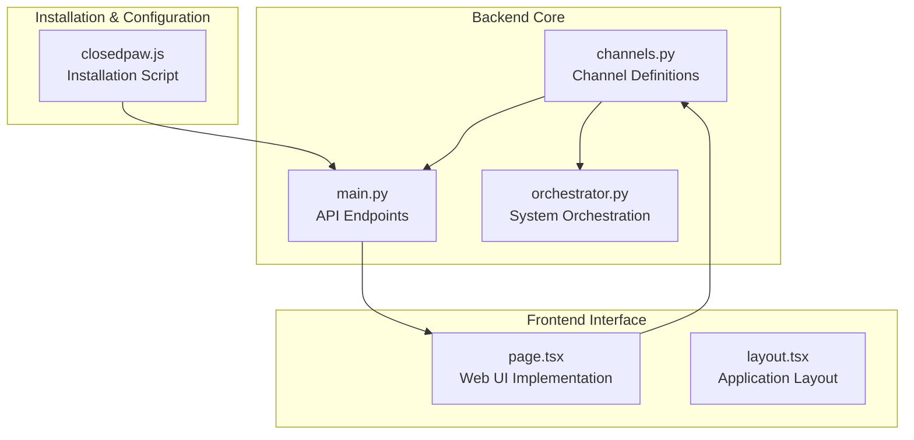
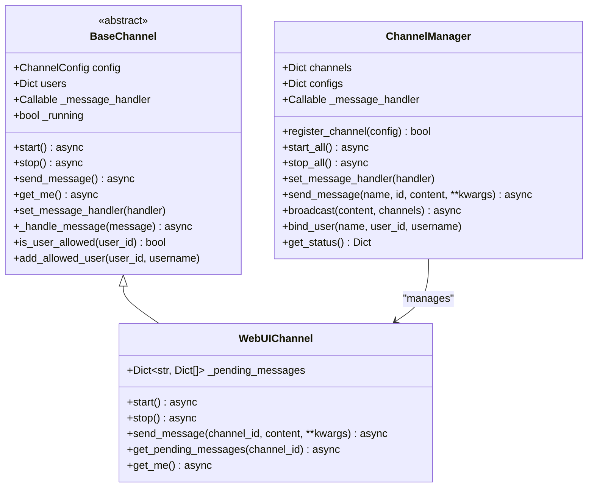
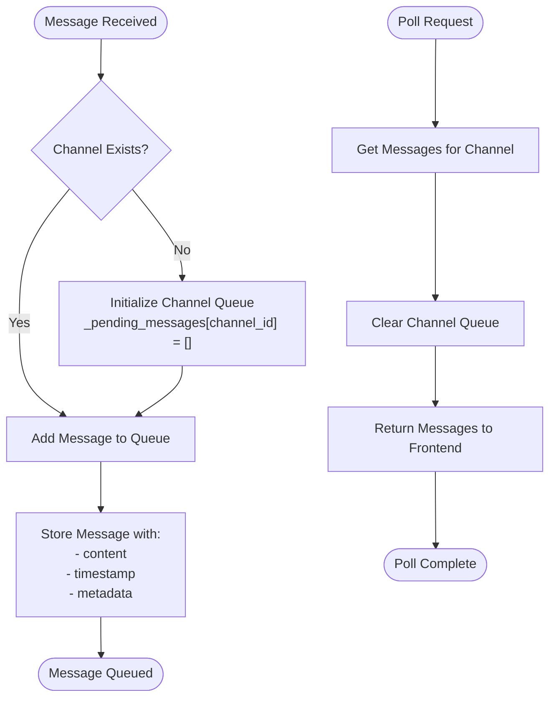
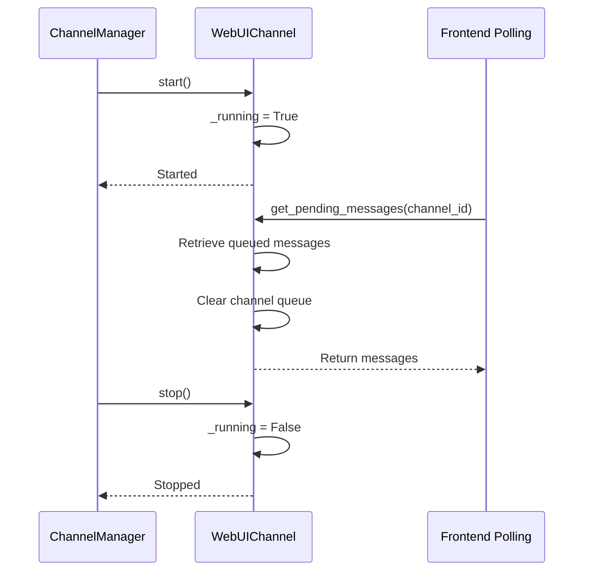
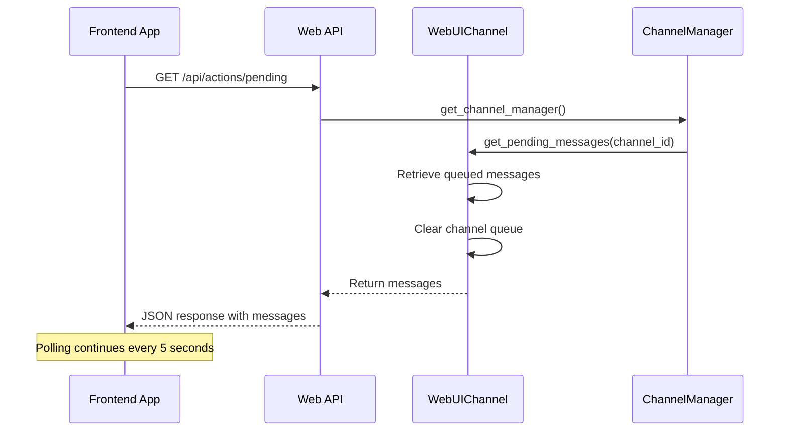
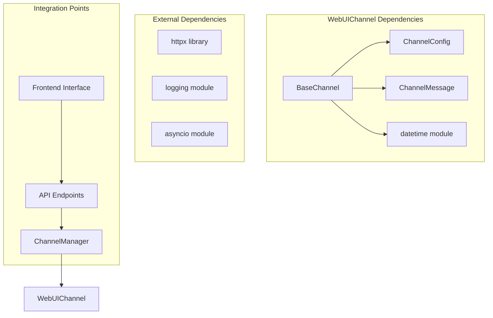

# Web UI Channel Implementation

<cite>
**Referenced Files in This Document**
- [channels.py](file://backend/app/core/channels.py)
- [main.py](file://backend/app/main.py)
- [page.tsx](file://frontend/src/app/page.tsx)
- [layout.tsx](file://frontend/src/app/layout.tsx)
- [closedpaw.js](file://bin/closedpaw.js)
</cite>

## Table of Contents
1. [Introduction](#introduction)
2. [Project Structure](#project-structure)
3. [Core Components](#core-components)
4. [Architecture Overview](#architecture-overview)
5. [Detailed Component Analysis](#detailed-component-analysis)
6. [Dependency Analysis](#dependency-analysis)
7. [Performance Considerations](#performance-considerations)
8. [Troubleshooting Guide](#troubleshooting-guide)
9. [Conclusion](#conclusion)

## Introduction

The Web UI Channel Implementation represents a critical component in the ClosedPaw system's multi-channel communication architecture. This internal channel serves as the bridge between the backend orchestration system and the frontend web interface, enabling real-time communication through a polling-based mechanism.

The WebUIChannel class is specifically designed for internal web interface communication, operating as part of the broader channel ecosystem that supports multiple communication platforms including Telegram, Discord, Slack, Matrix, and CLI interfaces. Unlike external channels that rely on push-based APIs, the WebUI channel implements a polling mechanism to deliver messages to the web interface in real-time.

## Project Structure

The Web UI Channel implementation is distributed across several key files in the ClosedPaw codebase:



**Diagram sources**
- [channels.py](file://backend/app/core/channels.py#L137-L175)
- [main.py](file://backend/app/main.py#L464-L529)
- [page.tsx](file://frontend/src/app/page.tsx#L77-L88)

**Section sources**
- [channels.py](file://backend/app/core/channels.py#L1-L524)
- [main.py](file://backend/app/main.py#L1-L567)
- [page.tsx](file://frontend/src/app/page.tsx#L1-L659)

## Core Components

The Web UI Channel is built upon a robust foundation of channel abstractions and follows the established patterns for multi-channel communication in the ClosedPaw system.

### WebUIChannel Class Architecture

The WebUIChannel class extends the BaseChannel abstract class and implements the specific requirements for internal web interface communication:



**Diagram sources**
- [channels.py](file://backend/app/core/channels.py#L79-L175)
- [channels.py](file://backend/app/core/channels.py#L405-L503)

### Message Queuing Mechanism

The WebUI channel implements a sophisticated message queuing system using the `_pending_messages` dictionary structure:



**Diagram sources**
- [channels.py](file://backend/app/core/channels.py#L152-L167)

**Section sources**
- [channels.py](file://backend/app/core/channels.py#L137-L175)

## Architecture Overview

The Web UI Channel operates within a comprehensive multi-channel architecture that separates concerns between different communication platforms while maintaining unified message handling capabilities.

```mermaid
graph TB
subgraph "External Channels"
Telegram[TelegramChannel]
Discord[DiscordChannel]
Slack[SlackChannel]
CLI[CLIChannel]
end
subgraph "Internal Channel"
WebUI[WebUIChannel]
end
subgraph "Core System"
ChannelManager[ChannelManager]
BaseChannel[BaseChannel]
end
subgraph "Frontend Integration"
WebInterface[Web Interface]
Polling[Polling Mechanism]
end
BaseChannel <|-- Telegram
BaseChannel <|-- Discord
BaseChannel <|-- Slack
BaseChannel <|-- CLI
BaseChannel <|-- WebUI
ChannelManager --> Telegram
ChannelManager --> Discord
ChannelManager --> Slack
ChannelManager --> CLI
ChannelManager --> WebUI
WebUI --> Polling
Polling --> WebInterface
```

**Diagram sources**
- [channels.py](file://backend/app/core/channels.py#L137-L175)
- [channels.py](file://backend/app/core/channels.py#L405-L503)

### Lifecycle Management

The WebUI channel follows a structured lifecycle managed through the ChannelManager:



**Diagram sources**
- [channels.py](file://backend/app/core/channels.py#L144-L150)
- [channels.py](file://backend/app/core/channels.py#L163-L167)

**Section sources**
- [channels.py](file://backend/app/core/channels.py#L405-L503)

## Detailed Component Analysis

### WebUIChannel Implementation Details

The WebUIChannel class provides specialized functionality for internal web interface communication through its polling-based approach:

#### Message Storage Structure

The `_pending_messages` dictionary implements a channel-based message storage system:

| Component | Description | Data Type | Purpose |
|-----------|-------------|-----------|---------|
| `channel_id` | Unique identifier for the web interface session | String | Message routing and isolation |
| `content` | Message payload content | String | User-facing message text |
| `timestamp` | ISO format timestamp | String | Message ordering and debugging |
| `metadata` | Additional message attributes | Dictionary | Optional parameters and context |

#### Polling-Based Communication Pattern

The WebUI channel implements a real-time polling mechanism that allows the frontend to retrieve messages without requiring persistent connections:

```mermaid
flowchart LR
subgraph "Backend Processing"
A[Message Generated] --> B[WebUIChannel.send_message]
B --> C[_pending_messages[channel_id].append]
end
subgraph "Frontend Polling"
D[setInterval Timer] --> E[get_pending_messages]
E --> F[Retrieve Messages]
F --> G[Clear Channel Queue]
G --> H[Display to User]
end
C -.-> F
```

**Diagram sources**
- [channels.py](file://backend/app/core/channels.py#L152-L167)
- [page.tsx](file://frontend/src/app/page.tsx#L82-L87)

### Integration with Frontend Web Interface

The frontend web interface integrates with the WebUI channel through a polling mechanism that periodically checks for new messages:

#### Frontend Polling Configuration

The frontend implements a polling strategy with configurable intervals:

| Parameter | Value | Purpose |
|-----------|--------|---------|
| Poll Interval | 5 seconds | Balances responsiveness vs. server load |
| API Endpoint | `/api/actions/pending` | Retrieves pending actions requiring approval |
| Base URL | `http://127.0.0.1:8000` | Localhost binding for security |

#### Real-Time Message Retrieval

The frontend polling mechanism enables real-time message delivery through periodic API calls:



**Diagram sources**
- [page.tsx](file://frontend/src/app/page.tsx#L112-L119)
- [main.py](file://backend/app/main.py#L265-L281)

**Section sources**
- [page.tsx](file://frontend/src/app/page.tsx#L77-L119)
- [main.py](file://backend/app/main.py#L265-L281)

### Internal Nature and Security Considerations

The WebUI channel maintains its internal nature through several security and architectural design decisions:

#### Localhost Binding

The system enforces localhost-only binding for security:

- Backend API binds to `127.0.0.1:8000`
- Frontend development server runs on `localhost:3000`
- CORS middleware restricts origins to localhost domains

#### Zero-Trust Architecture

The WebUI channel participates in the overall zero-trust security model:

- All communications are authenticated and authorized
- Message queues are isolated per channel/session
- No external dependencies for internal communication
- Local-only execution prevents data leakage

**Section sources**
- [main.py](file://backend/app/main.py#L80-L87)
- [main.py](file://backend/app/main.py#L558-L567)

## Dependency Analysis

The WebUI channel has minimal external dependencies while maintaining strong internal integration with the channel management system.



**Diagram sources**
- [channels.py](file://backend/app/core/channels.py#L79-L175)
- [channels.py](file://backend/app/core/channels.py#L405-L503)

### Coupling and Cohesion Analysis

The WebUI channel demonstrates excellent design principles:

- **Low Coupling**: Minimal external dependencies, primarily for logging and datetime
- **High Cohesion**: All web UI communication logic encapsulated within the class
- **Single Responsibility**: Focuses exclusively on web interface message delivery
- **Extensibility**: Easy to extend for additional web UI features

**Section sources**
- [channels.py](file://backend/app/core/channels.py#L137-L175)

## Performance Considerations

The WebUI channel implementation balances performance with resource efficiency through several optimization strategies:

### Memory Management

The message queue system implements efficient memory usage patterns:

- **Queue Clearing**: Messages are cleared after retrieval to prevent memory accumulation
- **Channel Isolation**: Separate queues per channel_id prevent cross-channel interference
- **Timestamp Management**: ISO format timestamps enable efficient sorting and filtering

### Scalability Factors

The polling-based approach provides predictable scalability characteristics:

- **Linear Scaling**: Performance scales linearly with number of concurrent sessions
- **Memory Efficiency**: Queue size proportional to active session activity
- **Network Overhead**: Minimal overhead due to lightweight polling requests

### Optimization Opportunities

Potential improvements for high-load scenarios:

- **Batch Processing**: Implement batch message retrieval for reduced API calls
- **Connection Pooling**: Reuse HTTP connections for improved performance
- **Compression**: Enable gzip compression for large message payloads

## Troubleshooting Guide

Common issues and solutions for Web UI channel implementation:

### Message Delivery Issues

**Problem**: Messages not appearing in web interface
**Solution**: Verify polling interval and API endpoint connectivity

**Problem**: Messages accumulating without clearing
**Solution**: Check `get_pending_messages` implementation and queue clearing logic

### Performance Issues

**Problem**: High memory usage with multiple concurrent sessions
**Solution**: Monitor queue sizes and implement queue cleanup strategies

**Problem**: Slow response times during peak usage
**Solution**: Adjust polling intervals and implement connection pooling

### Integration Problems

**Problem**: CORS errors between frontend and backend
**Solution**: Verify localhost binding and CORS middleware configuration

**Problem**: Authentication failures for web UI access
**Solution**: Check channel configuration and user authorization settings

**Section sources**
- [channels.py](file://backend/app/core/channels.py#L152-L167)
- [main.py](file://backend/app/main.py#L80-L87)

## Conclusion

The Web UI Channel Implementation represents a well-designed solution for internal web interface communication within the ClosedPaw system. Through its polling-based architecture, the WebUI channel provides reliable real-time message delivery while maintaining the system's zero-trust security model.

The implementation demonstrates excellent separation of concerns, with the WebUI channel focusing solely on message queuing and delivery while leveraging the broader channel management infrastructure for configuration and lifecycle management. The polling mechanism ensures compatibility across different deployment scenarios while maintaining predictable performance characteristics.

Future enhancements could include advanced features such as message batching, connection pooling, and enhanced monitoring capabilities, but the current implementation provides a solid foundation for secure, reliable web interface communication within the ClosedPaw ecosystem.