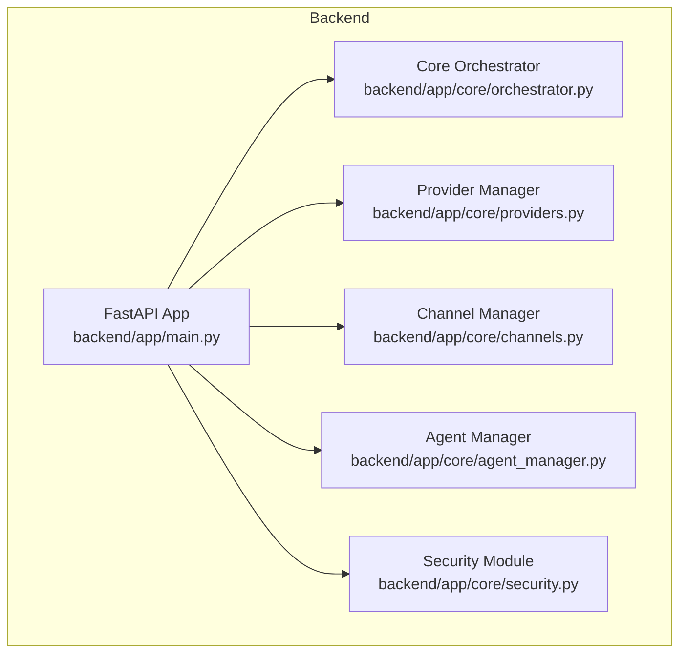
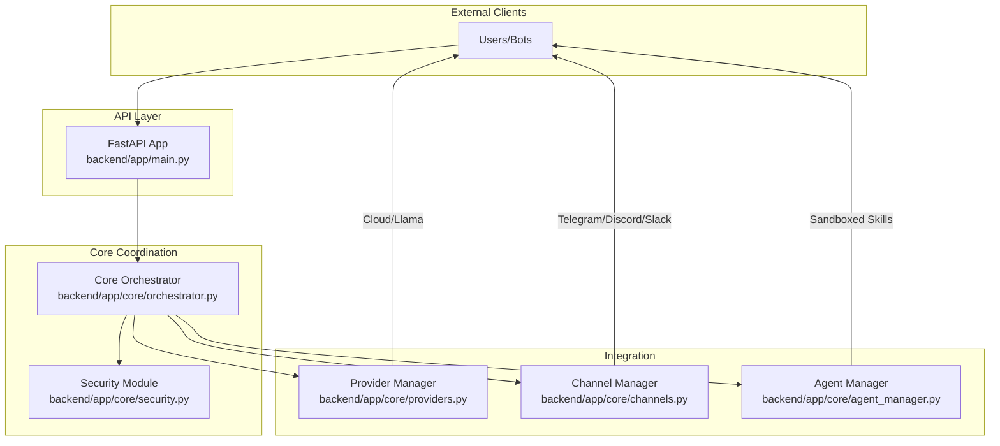
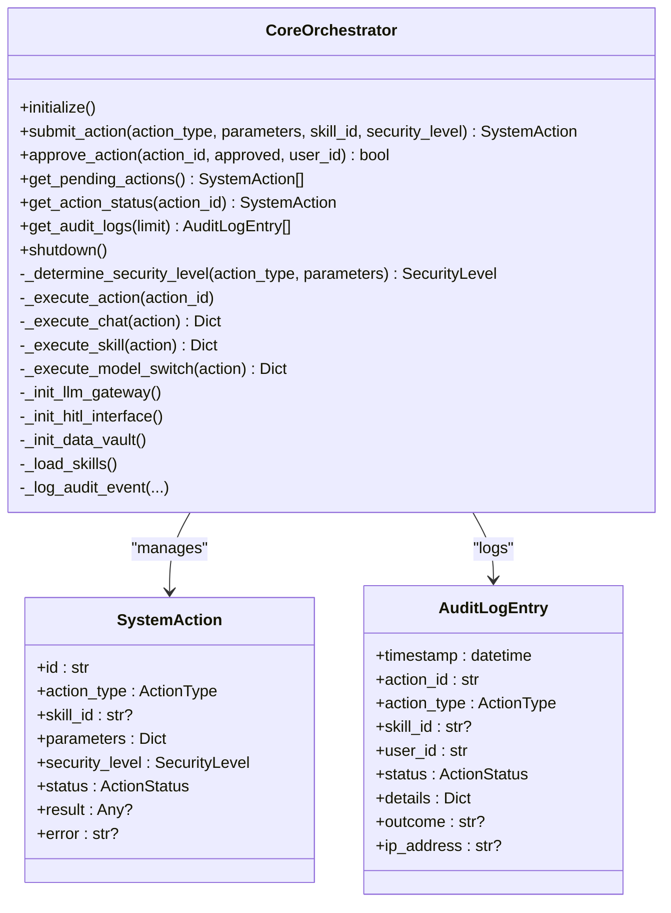
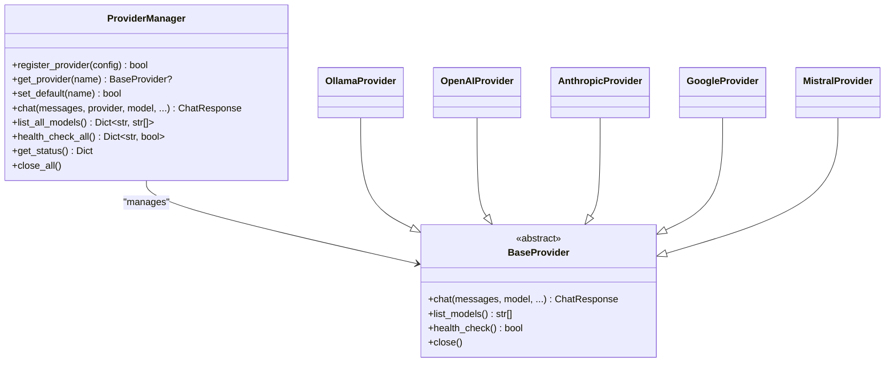
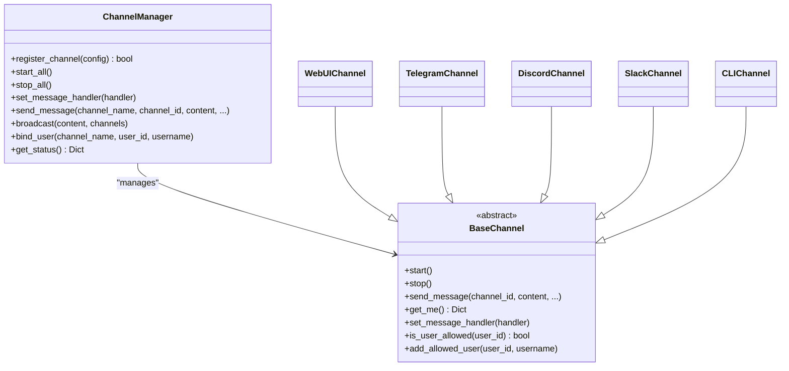
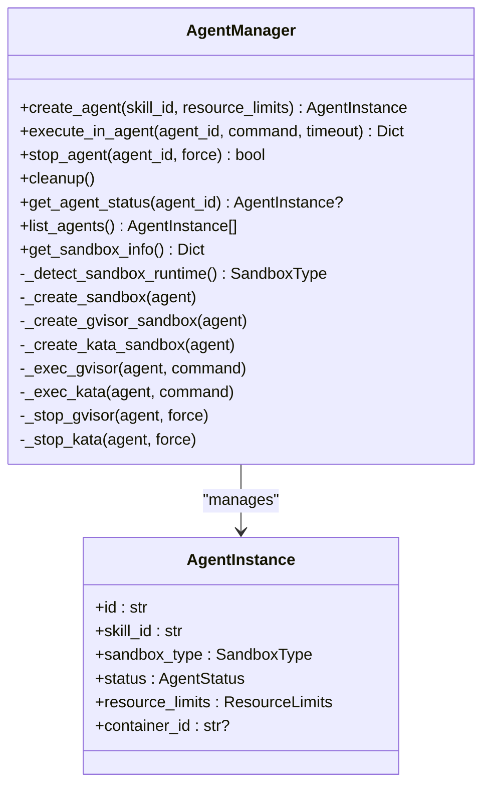
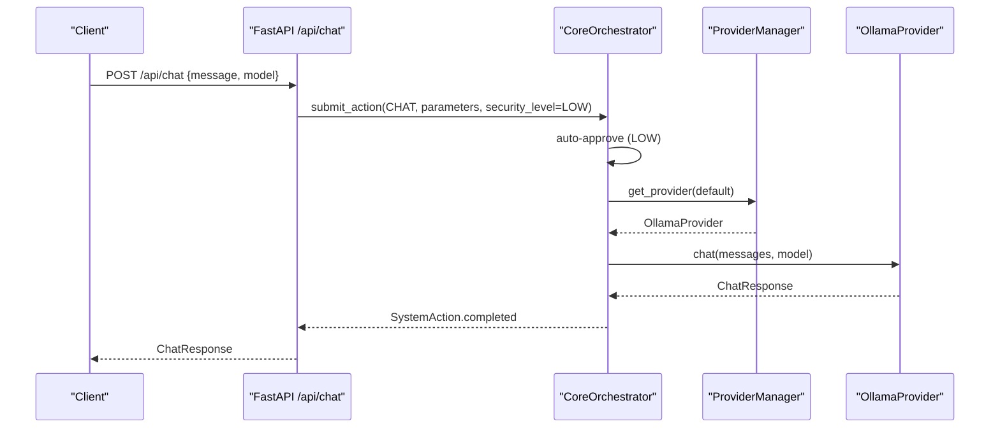
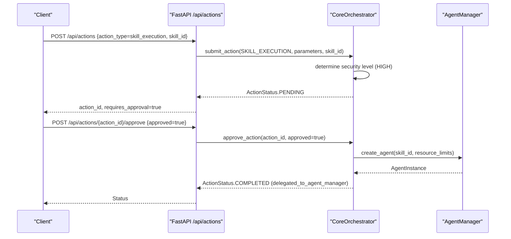
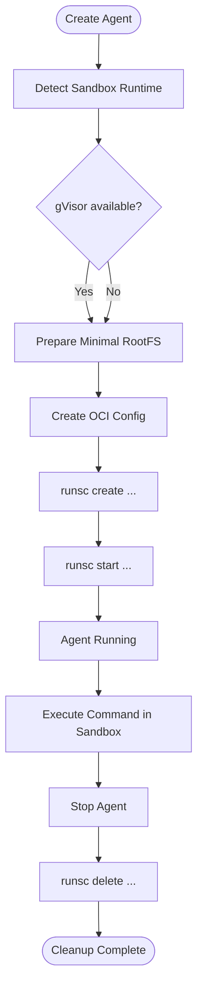
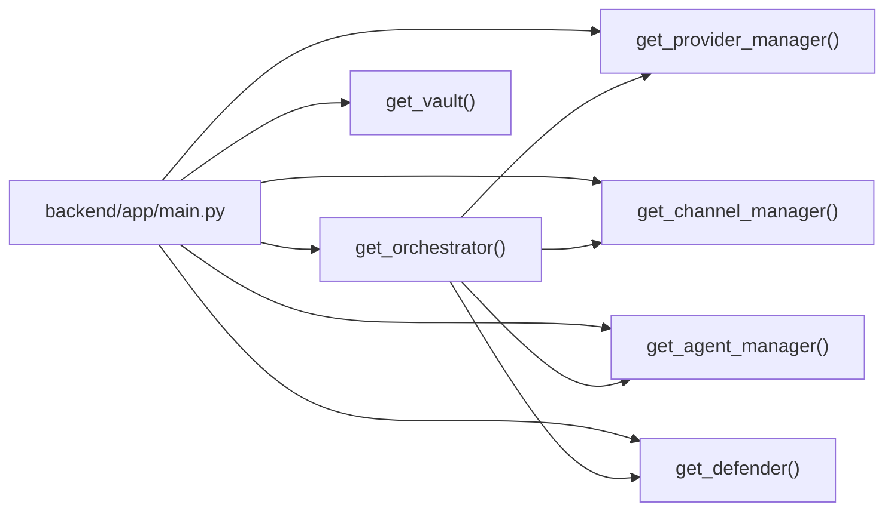

# Core Components

<cite>
**Referenced Files in This Document**
- [backend/app/core/orchestrator.py](file://backend/app/core/orchestrator.py)
- [backend/app/core/providers.py](file://backend/app/core/providers.py)
- [backend/app/core/channels.py](file://backend/app/core/channels.py)
- [backend/app/core/agent_manager.py](file://backend/app/core/agent_manager.py)
- [backend/app/core/security.py](file://backend/app/core/security.py)
- [backend/app/main.py](file://backend/app/main.py)
- [skills/filesystem/skill.py](file://skills/filesystem/skill.py)
- [backend/requirements.txt](file://backend/requirements.txt)
</cite>

## Table of Contents
1. [Introduction](#introduction)
2. [Project Structure](#project-structure)
3. [Core Components](#core-components)
4. [Architecture Overview](#architecture-overview)
5. [Detailed Component Analysis](#detailed-component-analysis)
6. [Dependency Analysis](#dependency-analysis)
7. [Performance Considerations](#performance-considerations)
8. [Troubleshooting Guide](#troubleshooting-guide)
9. [Conclusion](#conclusion)
10. [Appendices](#appendices)

## Introduction
This document explains the core coordination architecture and component relationships of ClosedPaw. It focuses on:
- Core Orchestrator as the central coordination hub with Zero-Trust architecture, Action lifecycle management, and security level classification
- Provider Manager supporting multiple LLM backends (local Ollama plus cloud providers), dynamic registration, and health monitoring
- Channel Manager for multi-channel communication support, user authorization, and message routing
- Agent Manager for sandbox environment setup using gVisor/Kata Containers, resource limits, and security boundary enforcement
- Security module with prompt injection defense and encrypted data vault
- Event-driven architecture, singleton pattern implementation, and dependency injection
- Practical examples of component usage and configuration

## Project Structure
The backend is organized around a core module that exposes singletons for each major subsystem. The FastAPI application wires these singletons into endpoints and manages lifecycle via a lifespan context manager.



**Diagram sources**
- [backend/app/main.py](file://backend/app/main.py#L59-L70)
- [backend/app/core/orchestrator.py](file://backend/app/core/orchestrator.py#L87-L130)
- [backend/app/core/providers.py](file://backend/app/core/providers.py#L418-L457)
- [backend/app/core/channels.py](file://backend/app/core/channels.py#L405-L444)
- [backend/app/core/agent_manager.py](file://backend/app/core/agent_manager.py#L65-L98)
- [backend/app/core/security.py](file://backend/app/core/security.py#L325-L346)

**Section sources**
- [backend/app/main.py](file://backend/app/main.py#L59-L70)
- [backend/app/core/__init__.py](file://backend/app/core/__init__.py#L1-L18)

## Core Components
- Core Orchestrator: Central coordinator for actions, security levels, audit logging, and HITL approvals. Provides a singleton accessor and integrates with LLM gateways and skills.
- Provider Manager: Multi-provider LLM gateway supporting Ollama, OpenAI, Anthropic, Google, Mistral, and custom endpoints. Handles registration, selection, model listing, and health checks.
- Channel Manager: Multi-channel gateway supporting Web UI, Telegram, Discord, Slack, and CLI. Handles user authorization, message routing, and broadcasting.
- Agent Manager: Sandboxed skill executor manager using gVisor or Kata Containers with resource limits, process isolation, and security boundaries.
- Security Module: Prompt injection defense, rate limiting, and encrypted data vault with access control.

**Section sources**
- [backend/app/core/orchestrator.py](file://backend/app/core/orchestrator.py#L87-L130)
- [backend/app/core/providers.py](file://backend/app/core/providers.py#L418-L457)
- [backend/app/core/channels.py](file://backend/app/core/channels.py#L405-L444)
- [backend/app/core/agent_manager.py](file://backend/app/core/agent_manager.py#L65-L98)
- [backend/app/core/security.py](file://backend/app/core/security.py#L325-L346)

## Architecture Overview
The system follows a Zero-Trust model:
- All actions are classified by security level and audited
- Low-risk actions auto-execute; high-risk actions require Human-in-the-Loop (HITL) approval
- Providers and channels are dynamically registered and monitored
- Skills execute inside hardened sandboxes with strict resource limits



**Diagram sources**
- [backend/app/main.py](file://backend/app/main.py#L131-L182)
- [backend/app/core/orchestrator.py](file://backend/app/core/orchestrator.py#L169-L224)
- [backend/app/core/providers.py](file://backend/app/core/providers.py#L470-L483)
- [backend/app/core/channels.py](file://backend/app/core/channels.py#L462-L483)
- [backend/app/core/agent_manager.py](file://backend/app/core/agent_manager.py#L149-L192)

## Detailed Component Analysis

### Core Orchestrator
Responsibilities:
- Action lifecycle: submit, classify by security level, approve/reject (HITL), execute, and audit
- Integrates with LLM gateways and skills
- Maintains in-memory action registry and audit logs
- Provides singleton accessor

Key behaviors:
- Security levels: Low, Medium, High, Critical
- Auto-approval for Low/Medium; High/Critical require HITL
- Audit logging for all actions
- Graceful shutdown with pending action handling



**Diagram sources**
- [backend/app/core/orchestrator.py](file://backend/app/core/orchestrator.py#L87-L130)
- [backend/app/core/orchestrator.py](file://backend/app/core/orchestrator.py#L72-L85)
- [backend/app/core/orchestrator.py](file://backend/app/core/orchestrator.py#L59-L70)

**Section sources**
- [backend/app/core/orchestrator.py](file://backend/app/core/orchestrator.py#L87-L130)
- [backend/app/core/orchestrator.py](file://backend/app/core/orchestrator.py#L169-L224)
- [backend/app/core/orchestrator.py](file://backend/app/core/orchestrator.py#L251-L302)
- [backend/app/core/orchestrator.py](file://backend/app/core/orchestrator.py#L376-L428)
- [backend/app/core/orchestrator.py](file://backend/app/core/orchestrator.py#L451-L475)

### Provider Manager
Responsibilities:
- Dynamic registration of providers (Ollama, OpenAI, Anthropic, Google, Mistral, Custom)
- Provider selection and default provider management
- Model listing and health checks
- Unified chat interface across providers



**Diagram sources**
- [backend/app/core/providers.py](file://backend/app/core/providers.py#L418-L457)
- [backend/app/core/providers.py](file://backend/app/core/providers.py#L68-L100)
- [backend/app/core/providers.py](file://backend/app/core/providers.py#L102-L161)
- [backend/app/core/providers.py](file://backend/app/core/providers.py#L163-L222)
- [backend/app/core/providers.py](file://backend/app/core/providers.py#L224-L294)
- [backend/app/core/providers.py](file://backend/app/core/providers.py#L296-L354)
- [backend/app/core/providers.py](file://backend/app/core/providers.py#L356-L416)

**Section sources**
- [backend/app/core/providers.py](file://backend/app/core/providers.py#L418-L457)
- [backend/app/core/providers.py](file://backend/app/core/providers.py#L470-L483)
- [backend/app/core/providers.py](file://backend/app/core/providers.py#L495-L504)

### Channel Manager
Responsibilities:
- Multi-channel support (Web UI, Telegram, Discord, Slack, CLI)
- User authorization and allowlists
- Message routing and broadcasting
- Channel registration and lifecycle management



**Diagram sources**
- [backend/app/core/channels.py](file://backend/app/core/channels.py#L405-L444)
- [backend/app/core/channels.py](file://backend/app/core/channels.py#L79-L117)
- [backend/app/core/channels.py](file://backend/app/core/channels.py#L137-L175)
- [backend/app/core/channels.py](file://backend/app/core/channels.py#L177-L286)
- [backend/app/core/channels.py](file://backend/app/core/channels.py#L288-L334)
- [backend/app/core/channels.py](file://backend/app/core/channels.py#L336-L382)
- [backend/app/core/channels.py](file://backend/app/core/channels.py#L384-L403)

**Section sources**
- [backend/app/core/channels.py](file://backend/app/core/channels.py#L405-L444)
- [backend/app/core/channels.py](file://backend/app/core/channels.py#L462-L483)
- [backend/app/core/channels.py](file://backend/app/core/channels.py#L484-L490)

### Agent Manager
Responsibilities:
- Create and manage sandboxed agents using gVisor or Kata Containers
- Enforce resource limits and security boundaries
- Execute commands in sandboxed environments
- Cleanup and status reporting



**Diagram sources**
- [backend/app/core/agent_manager.py](file://backend/app/core/agent_manager.py#L65-L98)
- [backend/app/core/agent_manager.py](file://backend/app/core/agent_manager.py#L149-L192)
- [backend/app/core/agent_manager.py](file://backend/app/core/agent_manager.py#L194-L202)
- [backend/app/core/agent_manager.py](file://backend/app/core/agent_manager.py#L475-L538)
- [backend/app/core/agent_manager.py](file://backend/app/core/agent_manager.py#L586-L627)

**Section sources**
- [backend/app/core/agent_manager.py](file://backend/app/core/agent_manager.py#L65-L98)
- [backend/app/core/agent_manager.py](file://backend/app/core/agent_manager.py#L149-L192)
- [backend/app/core/agent_manager.py](file://backend/app/core/agent_manager.py#L475-L538)
- [backend/app/core/agent_manager.py](file://backend/app/core/agent_manager.py#L586-L627)

### Security Module
Responsibilities:
- Prompt injection defense with layered detection and sanitization
- Rate limiting for security
- Encrypted data vault with access control levels

```mermaid
classDiagram
class PromptInjectionDefender {
+validate_input(user_input, context) ValidationResult
+create_secure_prompt(system_prompt, user_input) str
}
class ValidationResult {
+is_valid : bool
+threat_level : ThreatLevel
+sanitized_input : str
+detected_patterns : str[]
+recommendations : str[]
}
class RateLimiter {
+check_limit(key) bool
}
class DataVault {
+store(key, value, access_level) bool
+retrieve(key, requester_level) str?
+access_log : List
}
PromptInjectionDefender --> ValidationResult : "produces"
PromptInjectionDefender --> RateLimiter : "uses"
DataVault --> "encrypted storage" : "uses"
```

**Diagram sources**
- [backend/app/core/security.py](file://backend/app/core/security.py#L35-L107)
- [backend/app/core/security.py](file://backend/app/core/security.py#L25-L33)
- [backend/app/core/security.py](file://backend/app/core/security.py#L290-L318)
- [backend/app/core/security.py](file://backend/app/core/security.py#L325-L435)

**Section sources**
- [backend/app/core/security.py](file://backend/app/core/security.py#L35-L107)
- [backend/app/core/security.py](file://backend/app/core/security.py#L290-L318)
- [backend/app/core/security.py](file://backend/app/core/security.py#L325-L435)

### API Workflow: Chat Through Orchestrator


**Diagram sources**
- [backend/app/main.py](file://backend/app/main.py#L131-L182)
- [backend/app/core/orchestrator.py](file://backend/app/core/orchestrator.py#L169-L224)
- [backend/app/core/providers.py](file://backend/app/core/providers.py#L470-L483)
- [backend/app/core/providers.py](file://backend/app/core/providers.py#L109-L143)

### API Workflow: Skill Execution Delegation


**Diagram sources**
- [backend/app/main.py](file://backend/app/main.py#L241-L299)
- [backend/app/core/orchestrator.py](file://backend/app/core/orchestrator.py#L169-L224)
- [backend/app/core/orchestrator.py](file://backend/app/core/orchestrator.py#L376-L428)
- [backend/app/core/agent_manager.py](file://backend/app/core/agent_manager.py#L149-L192)

### Sandbox Flow: gVisor Container Creation


**Diagram sources**
- [backend/app/core/agent_manager.py](file://backend/app/core/agent_manager.py#L99-L114)
- [backend/app/core/agent_manager.py](file://backend/app/core/agent_manager.py#L194-L202)
- [backend/app/core/agent_manager.py](file://backend/app/core/agent_manager.py#L203-L261)
- [backend/app/core/agent_manager.py](file://backend/app/core/agent_manager.py#L498-L511)

## Dependency Analysis
- Singletons: Each core component exposes a singleton accessor to ensure centralized, shared state across the application.
- Dependency Injection: FastAPI endpoints depend on singletons from the core module, enabling loose coupling and testability.
- Event-driven: Orchestrator schedules actions asynchronously; channels and providers operate independently; AgentManager executes commands asynchronously.



**Diagram sources**
- [backend/app/main.py](file://backend/app/main.py#L14-L16)
- [backend/app/core/orchestrator.py](file://backend/app/core/orchestrator.py#L481-L486)
- [backend/app/core/providers.py](file://backend/app/core/providers.py#L530-L545)
- [backend/app/core/channels.py](file://backend/app/core/channels.py#L509-L524)
- [backend/app/core/agent_manager.py](file://backend/app/core/agent_manager.py#L703-L708)
- [backend/app/core/security.py](file://backend/app/core/security.py#L442-L455)

**Section sources**
- [backend/app/main.py](file://backend/app/main.py#L14-L16)
- [backend/app/core/__init__.py](file://backend/app/core/__init__.py#L5-L18)

## Performance Considerations
- Asynchronous execution: Orchestrator and managers use asyncio to avoid blocking I/O and improve throughput.
- Provider caching: ProviderManager caches provider instances and configurations to minimize overhead.
- Resource limits: AgentManager enforces CPU, memory, and process limits to prevent resource exhaustion.
- Health checks: ProviderManager and ChannelManager provide health monitoring to detect degraded services early.
- Audit logging: Security audit logs are written to both memory and file for performance and persistence.

[No sources needed since this section provides general guidance]

## Troubleshooting Guide
Common issues and resolutions:
- Ollama connectivity: The Orchestrator and API check Ollama availability; ensure the service is running locally on the default port.
- Provider registration failures: Verify provider type, name, and required credentials; use health checks to diagnose.
- Channel authorization errors: Confirm user allowlists and channel configuration; use binding APIs to authorize users.
- Agent sandbox unavailable: Install gVisor or Kata Containers; AgentManager detects runtime availability and falls back gracefully.
- Security alerts: Review prompt injection defender logs and recommendations; adjust thresholds or sanitize inputs accordingly.

**Section sources**
- [backend/app/core/orchestrator.py](file://backend/app/core/orchestrator.py#L131-L145)
- [backend/app/core/providers.py](file://backend/app/core/providers.py#L495-L504)
- [backend/app/core/channels.py](file://backend/app/core/channels.py#L484-L490)
- [backend/app/core/agent_manager.py](file://backend/app/core/agent_manager.py#L99-L114)
- [backend/app/core/security.py](file://backend/app/core/security.py#L176-L180)

## Conclusion
ClosedPaw’s core architecture centers on a Zero-Trust Orchestrator that governs action lifecycle, security classification, and auditing. Provider and Channel Managers offer flexible, dynamic integrations, while the Agent Manager ensures safe, sandboxed execution of skills. The Security Module provides robust defenses and secure secret storage. Together, these components form a cohesive, event-driven system with strong isolation and observability.

[No sources needed since this section summarizes without analyzing specific files]

## Appendices

### Practical Usage Examples

- Submit a chat action:
  - Endpoint: POST /api/chat
  - Behavior: Submits a CHAT action; LOW security auto-executes; returns action_id and status
  - Reference: [backend/app/main.py](file://backend/app/main.py#L131-L182)

- Approve a pending action (HITL):
  - Endpoint: POST /api/actions/{action_id}/approve
  - Behavior: Approve or reject a PENDING action; triggers execution if approved
  - Reference: [backend/app/main.py](file://backend/app/main.py#L284-L299), [backend/app/core/orchestrator.py](file://backend/app/core/orchestrator.py#L376-L428)

- Register a cloud provider:
  - Endpoint: POST /api/providers/register
  - Behavior: Registers OpenAI, Anthropic, Google, or Mistral with API keys and defaults
  - Reference: [backend/app/main.py](file://backend/app/main.py#L403-L435), [backend/app/core/providers.py](file://backend/app/core/providers.py#L429-L457)

- Enable a skill:
  - Endpoint: POST /api/skills/{skill_id}/enable
  - Behavior: Enables a skill for execution; Orchestrator delegates to Agent Manager
  - Reference: [backend/app/main.py](file://backend/app/main.py#L357-L379), [backend/app/core/orchestrator.py](file://backend/app/core/orchestrator.py#L333-L351)

- Create a sandboxed agent:
  - Behavior: AgentManager creates gVisor/Kata containers with resource limits
  - Reference: [backend/app/core/agent_manager.py](file://backend/app/core/agent_manager.py#L149-L192)

- File system skill sandbox:
  - Behavior: FileSystemSkill operates within a restricted sandbox with path validation and size limits
  - Reference: [skills/filesystem/skill.py](file://skills/filesystem/skill.py#L77-L109), [skills/filesystem/skill.py](file://skills/filesystem/skill.py#L133-L208)

### Configuration Notes
- CORS: Only allows localhost origins for security
- Host binding: Uvicorn runs on 127.0.0.1 by default
- Logging: Orchestrator writes audit logs to a temporary file for security monitoring

**Section sources**
- [backend/app/main.py](file://backend/app/main.py#L80-L87)
- [backend/app/main.py](file://backend/app/main.py#L557-L567)
- [backend/app/core/orchestrator.py](file://backend/app/core/orchestrator.py#L19-L28)

### Dependencies Overview
- Web framework: FastAPI, Uvicorn
- Data validation: Pydantic
- HTTP client: httpx
- Security: cryptography, pynacl, python-jose, passlib
- SQLAlchemy and Alembic for persistence (future use)
- Testing: pytest, pytest-asyncio

**Section sources**
- [backend/requirements.txt](file://backend/requirements.txt#L1-L36)