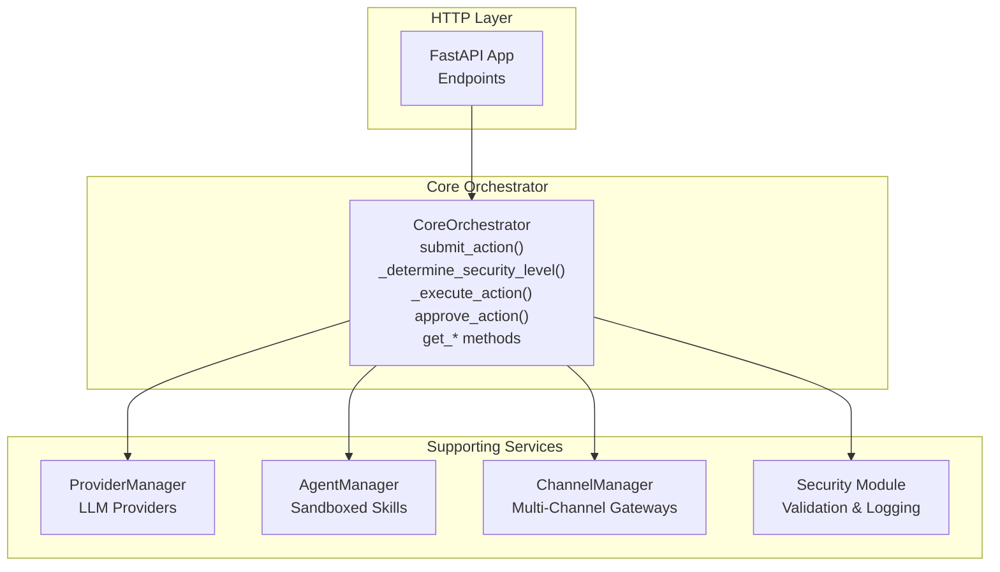
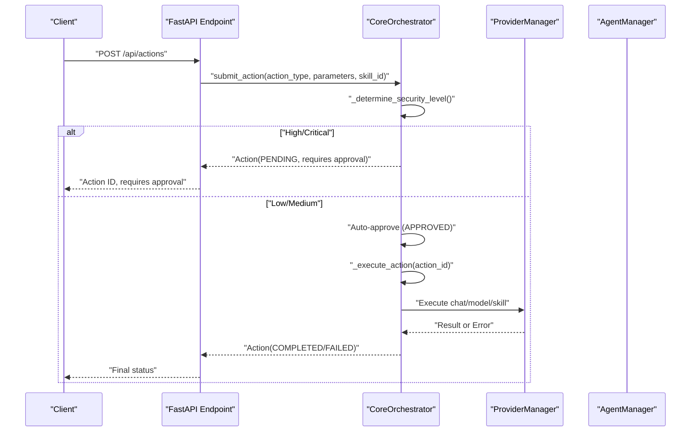
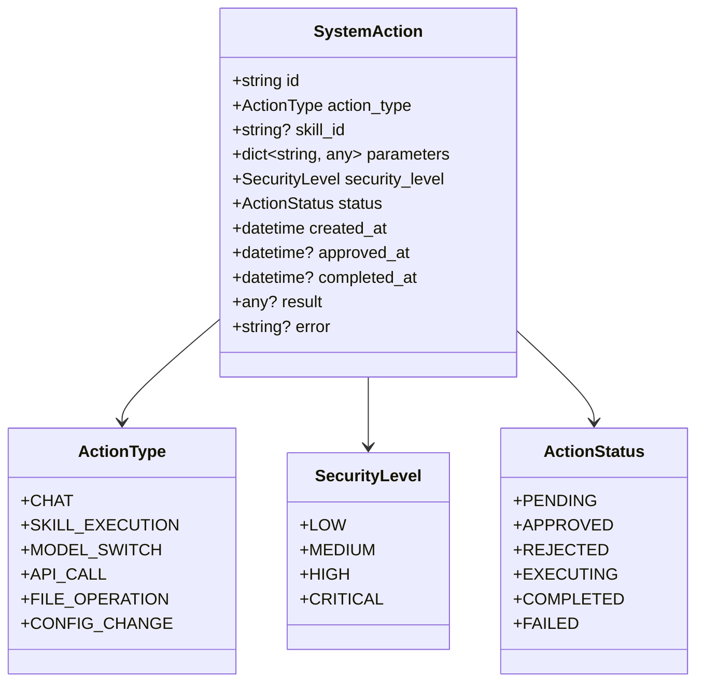
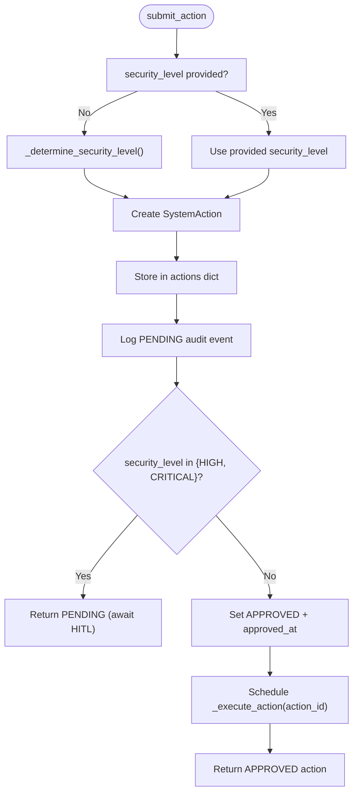
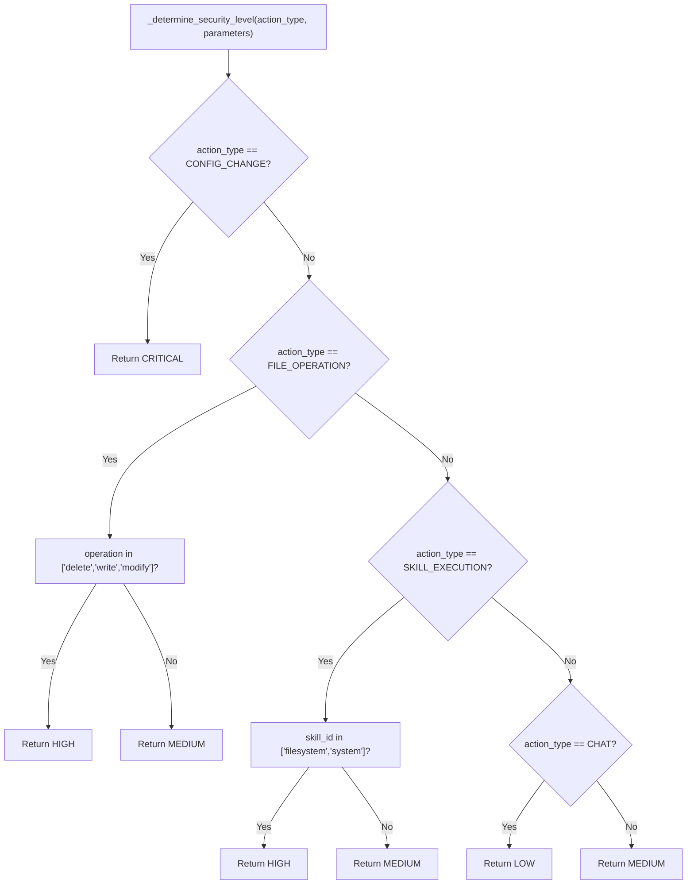
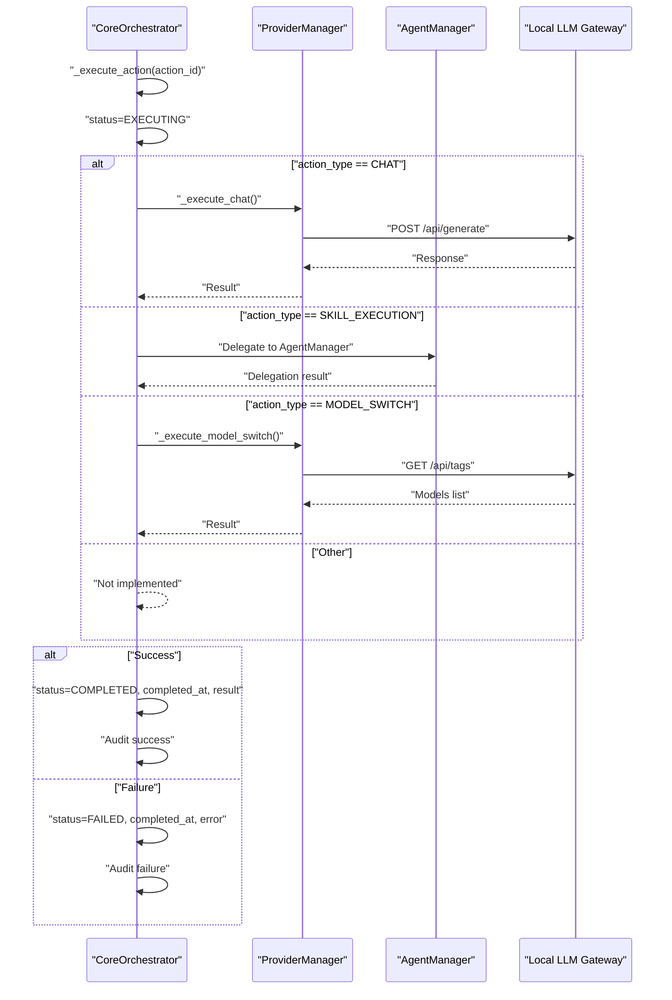
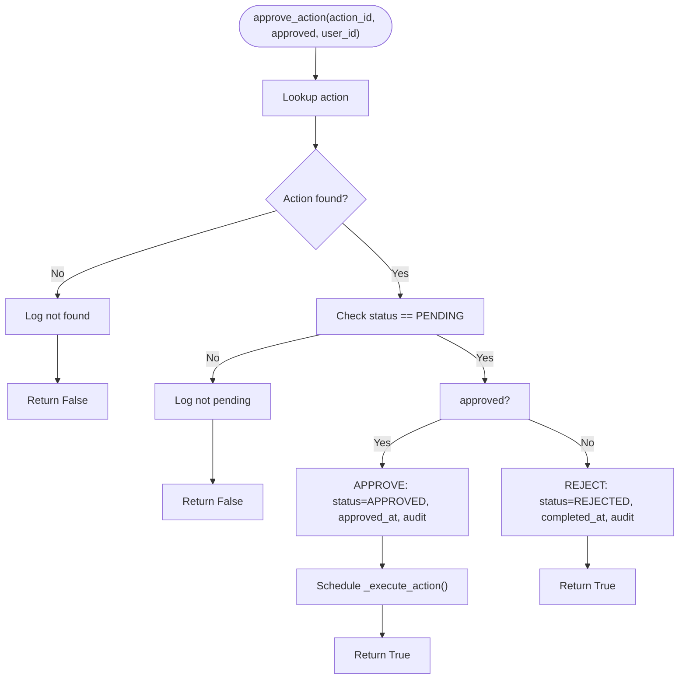
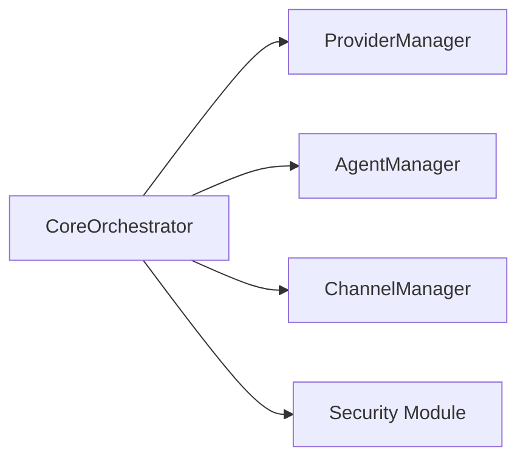

# Action Lifecycle Management

<cite>
**Referenced Files in This Document**
- [orchestrator.py](file://backend/app/core/orchestrator.py)
- [main.py](file://backend/app/main.py)
- [security.py](file://backend/app/core/security.py)
- [agent_manager.py](file://backend/app/core/agent_manager.py)
- [channels.py](file://backend/app/core/channels.py)
- [providers.py](file://backend/app/core/providers.py)
- [skill.py](file://skills/filesystem/skill.py)
</cite>

## Table of Contents
1. [Introduction](#introduction)
2. [Project Structure](#project-structure)
3. [Core Components](#core-components)
4. [Architecture Overview](#architecture-overview)
5. [Detailed Component Analysis](#detailed-component-analysis)
6. [Dependency Analysis](#dependency-analysis)
7. [Performance Considerations](#performance-considerations)
8. [Troubleshooting Guide](#troubleshooting-guide)
9. [Conclusion](#conclusion)
10. [Appendices](#appendices)

## Introduction
This document explains the Action Lifecycle Management subsystem within the Core Orchestrator. It covers the complete lifecycle of a SystemAction from submission through approval, execution, completion, and failure. It documents the SystemAction data model, the action creation workflow via submit_action(), automatic security level determination via _determine_security_level(), and the execution pipeline in _execute_action(). Practical examples illustrate creation, state transitions, and error handling. It also explains action lookup methods, in-memory storage, timeout handling, cleanup, and graceful shutdown integration.

## Project Structure
The Action Lifecycle Management subsystem is centered around the Core Orchestrator, which exposes HTTP endpoints for clients and manages actions in memory. Supporting components include the Provider Manager for LLM integrations, the Agent Manager for sandboxed skill execution, and the Channels layer for multi-channel communication.

**Diagram sources**
- [main.py](file://backend/app/main.py#L131-L320)
- [orchestrator.py](file://backend/app/core/orchestrator.py#L87-L486)
- [providers.py](file://backend/app/core/providers.py#L418-L545)
- [agent_manager.py](file://backend/app/core/agent_manager.py#L65-L708)
- [channels.py](file://backend/app/core/channels.py#L405-L524)
- [security.py](file://backend/app/core/security.py#L35-L455)

**Section sources**
- [main.py](file://backend/app/main.py#L131-L320)
- [orchestrator.py](file://backend/app/core/orchestrator.py#L87-L486)

## Core Components
- SystemAction: The data model representing a single action with fields for identification, type, parameters, security level, status, timestamps, and result/error.
- CoreOrchestrator: The central component that stores actions in memory, determines security levels, routes approvals, and executes actions.
- ProviderManager: Integrates with multiple LLM providers for chat and model operations.
- AgentManager: Manages sandboxed skill execution with strong isolation.
- ChannelManager: Provides multi-channel messaging integration.
- Security Module: Validates inputs and defends against prompt injection.

**Section sources**
- [orchestrator.py](file://backend/app/core/orchestrator.py#L72-L85)
- [orchestrator.py](file://backend/app/core/orchestrator.py#L87-L486)
- [providers.py](file://backend/app/core/providers.py#L418-L545)
- [agent_manager.py](file://backend/app/core/agent_manager.py#L65-L708)
- [channels.py](file://backend/app/core/channels.py#L405-L524)
- [security.py](file://backend/app/core/security.py#L35-L455)

## Architecture Overview
The HTTP API delegates action submissions to the Core Orchestrator. The Orchestrator decides whether an action requires Human-in-the-Loop (HITL) approval based on its security level. Approved actions are executed asynchronously. The Orchestrator logs audit events and maintains in-memory state for actions and logs.

**Diagram sources**
- [main.py](file://backend/app/main.py#L241-L262)
- [orchestrator.py](file://backend/app/core/orchestrator.py#L169-L223)
- [orchestrator.py](file://backend/app/core/orchestrator.py#L225-L250)
- [orchestrator.py](file://backend/app/core/orchestrator.py#L251-L302)
- [providers.py](file://backend/app/core/providers.py#L418-L545)

## Detailed Component Analysis

### SystemAction Data Model
SystemAction encapsulates all aspects of an action’s lifecycle and metadata.

Fields:
- id: Unique identifier generated automatically.
- action_type: Enumerated type indicating the operation (e.g., chat, skill_execution, model_switch, api_call, file_operation, config_change).
- skill_id: Optional identifier for skill-based actions.
- parameters: Arbitrary dictionary of parameters passed to the action.
- security_level: Determined automatically or overridden; influences approval requirements.
- status: Lifecycle state (PENDING, APPROVED, REJECTED, EXECUTING, COMPLETED, FAILED).
- created_at: Timestamp when the action was created.
- approved_at: Timestamp when the action was approved (optional).
- completed_at: Timestamp when the action finished (optional).
- result: Successful execution result (optional).
- error: Error message if execution failed (optional).

**Diagram sources**
- [orchestrator.py](file://backend/app/core/orchestrator.py#L31-L49)
- [orchestrator.py](file://backend/app/core/orchestrator.py#L51-L57)
- [orchestrator.py](file://backend/app/core/orchestrator.py#L72-L85)

**Section sources**
- [orchestrator.py](file://backend/app/core/orchestrator.py#L72-L85)

### Action Creation Workflow: submit_action()
- Determines security level if not provided.
- Creates a SystemAction instance and stores it in memory.
- Logs an initial audit event for the PENDING state.
- If security level is HIGH or CRITICAL, returns PENDING and waits for HITL approval.
- Otherwise, auto-approves (APPROVED), records approved_at, and schedules asynchronous execution.

**Diagram sources**
- [orchestrator.py](file://backend/app/core/orchestrator.py#L169-L223)
- [orchestrator.py](file://backend/app/core/orchestrator.py#L225-L250)

**Section sources**
- [orchestrator.py](file://backend/app/core/orchestrator.py#L169-L223)

### Automatic Security Level Determination: _determine_security_level()
Security levels are derived from action type and parameters:
- CONFIG_CHANGE: CRITICAL
- FILE_OPERATION: HIGH if destructive operations (delete/write/modify), otherwise MEDIUM
- SKILL_EXECUTION: HIGH if skill_id is filesystem/system, otherwise MEDIUM
- CHAT: LOW
- Other types: MEDIUM by default

**Diagram sources**
- [orchestrator.py](file://backend/app/core/orchestrator.py#L225-L249)

**Section sources**
- [orchestrator.py](file://backend/app/core/orchestrator.py#L225-L249)

### Execution Pipeline: _execute_action()
- Marks action as EXECUTING.
- Routes execution by action_type:
  - CHAT: Calls _execute_chat(), which communicates with the local LLM gateway.
  - SKILL_EXECUTION: Delegates to Agent Manager with sandboxed execution.
  - MODEL_SWITCH: Verifies model availability via the LLM gateway.
  - Other types: Returns a not-implemented result.
- On success: sets COMPLETED, completed_at, and result; logs audit success.
- On exception: sets FAILED, completed_at, error; logs audit failure.

**Diagram sources**
- [orchestrator.py](file://backend/app/core/orchestrator.py#L251-L302)
- [orchestrator.py](file://backend/app/core/orchestrator.py#L303-L332)
- [orchestrator.py](file://backend/app/core/orchestrator.py#L352-L374)
- [providers.py](file://backend/app/core/providers.py#L102-L161)
- [agent_manager.py](file://backend/app/core/agent_manager.py#L475-L538)

**Section sources**
- [orchestrator.py](file://backend/app/core/orchestrator.py#L251-L302)

### HITL Approval and Rejection: approve_action()
- Validates the action exists and is PENDING.
- Approve: sets APPROVED, approved_at, logs audit, and schedules execution.
- Reject: sets REJECTED, completed_at, logs audit.

**Diagram sources**
- [orchestrator.py](file://backend/app/core/orchestrator.py#L376-L427)

**Section sources**
- [orchestrator.py](file://backend/app/core/orchestrator.py#L376-L427)

### Action Lookup Methods
- get_action_status(action_id): Returns the current SystemAction or None.
- get_pending_actions(): Returns all actions with PENDING status.
- get_audit_logs(limit): Returns recent audit logs sorted by timestamp.

These methods support monitoring and administrative views of the action lifecycle.

**Section sources**
- [orchestrator.py](file://backend/app/core/orchestrator.py#L451-L461)

### In-Memory Storage and Audit Logging
- Actions are stored in a dictionary keyed by action id.
- Audit logs are appended to an in-memory list and written to a file via the logger.
- Audit entries include timestamps, action id/type/skill, status, outcome, and details.

**Section sources**
- [orchestrator.py](file://backend/app/core/orchestrator.py#L94-L96)
- [orchestrator.py](file://backend/app/core/orchestrator.py#L429-L449)

### Practical Examples

- Example 1: Submit a chat action
  - Endpoint: POST /api/chat
  - Behavior: Submits a CHAT action with LOW security; auto-approved and executed asynchronously.
  - Outcome: Returns response, model, action_id, and status; if still pending after timeout, returns current status.

- Example 2: Submit a model switch action
  - Endpoint: POST /api/models/switch
  - Behavior: Submits MODEL_SWITCH action with MEDIUM security; waits for completion and returns success or error.

- Example 3: Submit a generic action
  - Endpoint: POST /api/actions
  - Behavior: Submits action with provided type and parameters; returns action_id, status, security_level, and requires_approval flag.

- Example 4: Approve/reject pending actions
  - Endpoint: POST /api/actions/{action_id}/approve
  - Behavior: Approve sets APPROVED and triggers execution; Reject sets REJECTED and completes immediately.

- Example 5: View pending actions
  - Endpoint: GET /api/actions/pending
  - Behavior: Lists all PENDING actions for HITL review.

- Example 6: View action status
  - Endpoint: GET /api/actions/{action_id}
  - Behavior: Returns full details including result or error.

**Section sources**
- [main.py](file://backend/app/main.py#L131-L181)
- [main.py](file://backend/app/main.py#L213-L238)
- [main.py](file://backend/app/main.py#L241-L262)
- [main.py](file://backend/app/main.py#L284-L298)
- [main.py](file://backend/app/main.py#L265-L281)
- [main.py](file://backend/app/main.py#L301-L319)

### Error Handling Scenarios
- Chat action fails: _execute_chat() catches exceptions and returns an error result; Orchestrator marks FAILED and logs audit failure.
- Model switch fails: _execute_model_switch() validates model availability and returns errors; Orchestrator marks FAILED and logs audit failure.
- Skill execution: Orchestrator delegates to Agent Manager; failures propagate as errors in the action result.
- Security validation: The Security Module can block malicious inputs before they reach the Orchestrator.

**Section sources**
- [orchestrator.py](file://backend/app/core/orchestrator.py#L287-L301)
- [orchestrator.py](file://backend/app/core/orchestrator.py#L352-L374)
- [security.py](file://backend/app/core/security.py#L116-L180)

### Timeout Handling, Cleanup, and Graceful Shutdown
- Action timeouts: The HTTP layer polls action status and returns a “processing” response if the action is still pending after a reasonable wait.
- Orchestrator shutdown: During shutdown, the Orchestrator stops accepting new actions and waits briefly for executing actions to complete before exiting.
- Agent cleanup: The Agent Manager provides explicit cleanup routines to stop agents and remove containers.

Note: There is no centralized action expiration timer in the Orchestrator. Long-running actions rely on the HTTP polling behavior and the Orchestrator’s shutdown grace period.

**Section sources**
- [main.py](file://backend/app/main.py#L153-L181)
- [orchestrator.py](file://backend/app/core/orchestrator.py#L463-L474)
- [agent_manager.py](file://backend/app/core/agent_manager.py#L660-L668)

## Dependency Analysis
The Core Orchestrator depends on:
- ProviderManager for chat and model operations.
- AgentManager for skill execution in sandboxed environments.
- ChannelManager for multi-channel integration.
- Security module for input validation and logging.

**Diagram sources**
- [orchestrator.py](file://backend/app/core/orchestrator.py#L87-L129)
- [providers.py](file://backend/app/core/providers.py#L418-L545)
- [agent_manager.py](file://backend/app/core/agent_manager.py#L65-L148)
- [channels.py](file://backend/app/core/channels.py#L405-L455)
- [security.py](file://backend/app/core/security.py#L35-L107)

**Section sources**
- [orchestrator.py](file://backend/app/core/orchestrator.py#L87-L129)

## Performance Considerations
- Asynchronous execution: Approved actions are scheduled as background tasks to avoid blocking the HTTP request.
- Local LLM gateway: Chat and model operations communicate with a local service to reduce latency and improve privacy.
- Sandboxed skills: AgentManager isolates skill execution to prevent system compromise.
- Audit logging: Minimal overhead; logs are written to both memory and file.

[No sources needed since this section provides general guidance]

## Troubleshooting Guide
Common issues and resolutions:
- Action remains PENDING: Check if HITL approval is required (HIGH/CRITICAL security). Approve or reject via the approval endpoint.
- Action fails with error: Inspect the action’s error field and audit logs for details.
- Model switch fails: Verify the model exists in the local LLM gateway and that the gateway is reachable.
- Skill execution not working: Confirm the skill is enabled and the Agent Manager has available sandbox capacity.

**Section sources**
- [orchestrator.py](file://backend/app/core/orchestrator.py#L376-L427)
- [orchestrator.py](file://backend/app/core/orchestrator.py#L459-L461)
- [main.py](file://backend/app/main.py#L213-L238)

## Conclusion
The Action Lifecycle Management subsystem provides a robust, secure, and observable framework for managing system actions. It enforces a Zero-Trust security posture through automatic security level determination, optional HITL approval, sandboxed skill execution, and comprehensive audit logging. The Orchestrator’s asynchronous execution model ensures responsiveness while maintaining safety and transparency.

[No sources needed since this section summarizes without analyzing specific files]

## Appendices

### API Surface for Action Lifecycle
- POST /api/actions: Submit a new action.
- GET /api/actions/pending: List pending actions requiring approval.
- POST /api/actions/{action_id}/approve: Approve or reject a pending action.
- GET /api/actions/{action_id}: Get the status and result/error of an action.
- GET /api/audit-logs: Retrieve recent audit logs.

**Section sources**
- [main.py](file://backend/app/main.py#L241-L319)

### Skill Execution Details
- Skill execution is delegated to the Agent Manager, which runs skills in sandboxed containers with strict resource limits and seccomp policies.
- The filesystem skill demonstrates secure file operations with sandboxing, path validation, and audit logging.

**Section sources**
- [agent_manager.py](file://backend/app/core/agent_manager.py#L65-L708)
- [skill.py](file://skills/filesystem/skill.py#L35-L483)