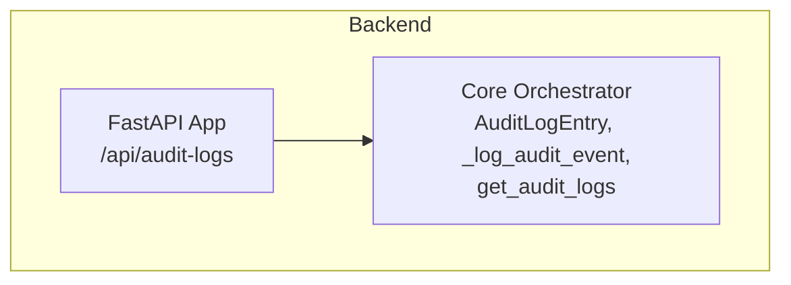
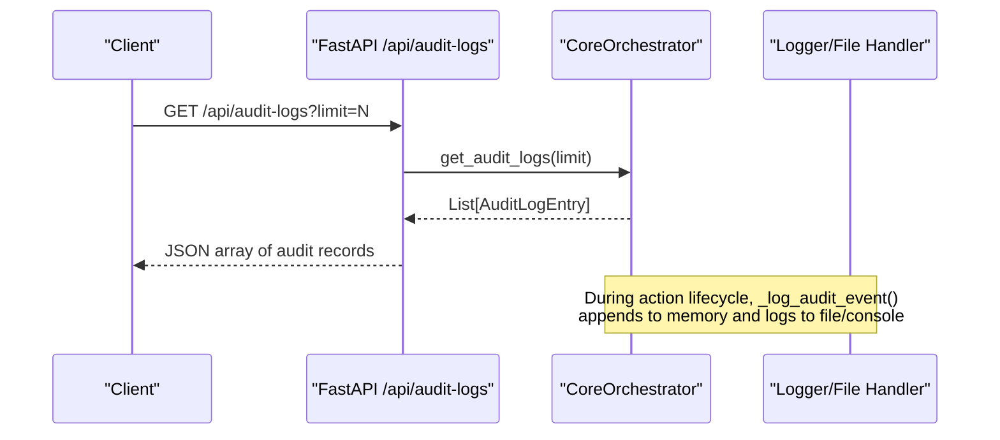
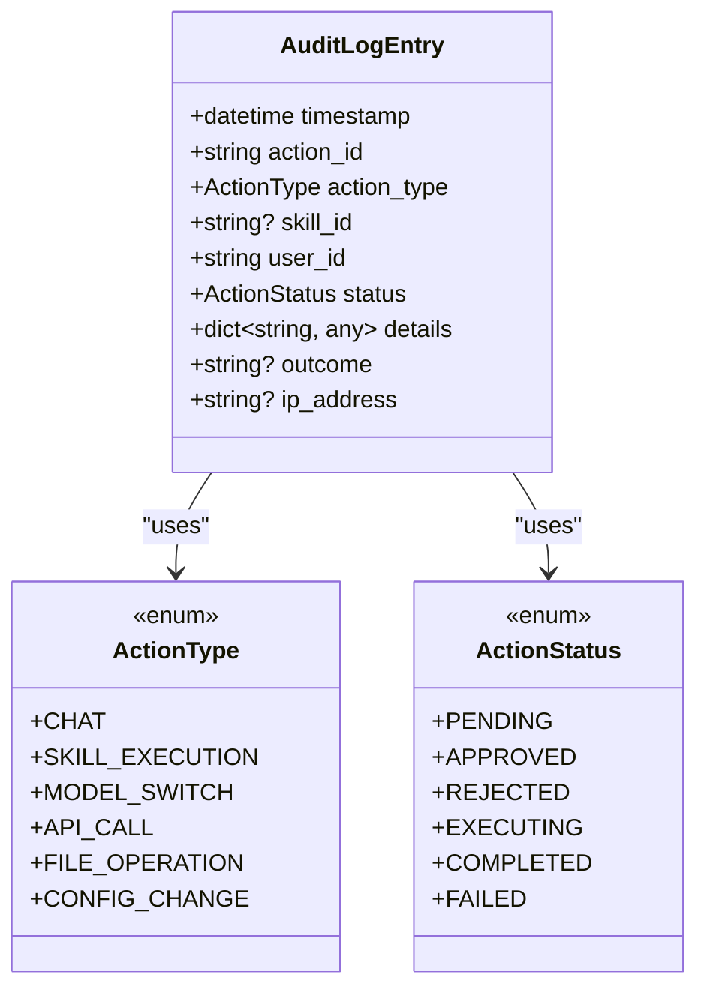
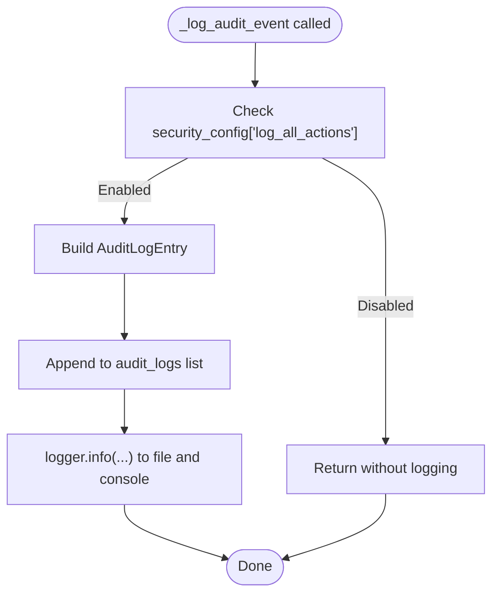
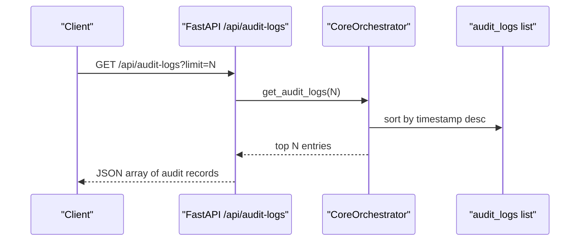
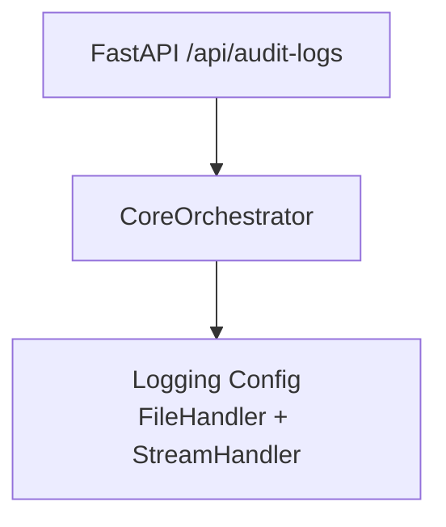

# Audit Logging System

<cite>
**Referenced Files in This Document**
- [orchestrator.py](file://backend/app/core/orchestrator.py)
- [main.py](file://backend/app/main.py)
- [README.md](file://README.md)
</cite>

## Table of Contents
1. [Introduction](#introduction)
2. [Project Structure](#project-structure)
3. [Core Components](#core-components)
4. [Architecture Overview](#architecture-overview)
5. [Detailed Component Analysis](#detailed-component-analysis)
6. [Dependency Analysis](#dependency-analysis)
7. [Performance Considerations](#performance-considerations)
8. [Troubleshooting Guide](#troubleshooting-guide)
9. [Conclusion](#conclusion)
10. [Appendices](#appendices)

## Introduction
This document describes the Audit Logging System within the Core Orchestrator of the ClosedPaw project. It explains the AuditLogEntry data model, the centralized logging mechanism, security configuration options, retrieval of audit logs, and operational guidance for storage, rotation, and compliance.

## Project Structure
The audit logging system is implemented in the Core Orchestrator module and exposed via the FastAPI backend. The relevant components are:
- Core Orchestrator with audit logging and security configuration
- FastAPI routes for retrieving audit logs
- README highlights the security posture and audit logging as a core feature

**Diagram sources**
- [main.py](file://backend/app/main.py#L322-L339)
- [orchestrator.py](file://backend/app/core/orchestrator.py#L59-L70)
- [orchestrator.py](file://backend/app/core/orchestrator.py#L429-L450)
- [orchestrator.py](file://backend/app/core/orchestrator.py#L459-L461)

**Section sources**
- [README.md](file://README.md#L65-L74)
- [main.py](file://backend/app/main.py#L322-L339)
- [orchestrator.py](file://backend/app/core/orchestrator.py#L59-L70)

## Core Components
- AuditLogEntry: The audit record model capturing timestamps, action identity, type, skill association, user identity, status, outcome, and details.
- Centralized logging: The _log_audit_event() method creates entries and writes to both a file and console.
- Security configuration: Controls whether all actions are logged, HITL requirements for critical actions, timeouts, and rate limiting.
- Retrieval: The get_audit_logs() method returns recent entries sorted by timestamp.

**Section sources**
- [orchestrator.py](file://backend/app/core/orchestrator.py#L59-L70)
- [orchestrator.py](file://backend/app/core/orchestrator.py#L429-L450)
- [orchestrator.py](file://backend/app/core/orchestrator.py#L459-L461)

## Architecture Overview
The audit logging architecture integrates with the Core Orchestrator’s lifecycle. When actions are submitted, executed, approved, or rejected, the system emits audit events. These events are appended to an in-memory list and written to a log file in the system’s temporary directory. A dedicated API endpoint retrieves recent audit logs.

**Diagram sources**
- [main.py](file://backend/app/main.py#L322-L339)
- [orchestrator.py](file://backend/app/core/orchestrator.py#L429-L450)
- [orchestrator.py](file://backend/app/core/orchestrator.py#L459-L461)

## Detailed Component Analysis

### AuditLogEntry Data Model
The AuditLogEntry captures the essential attributes for security monitoring and forensic analysis:
- timestamp: UTC timestamp of the event
- action_id: Unique identifier of the action
- action_type: Enumerated action type
- skill_id: Optional skill identifier
- user_id: Identity of the acting user
- status: Enumerated status of the action
- details: Arbitrary structured metadata
- outcome: Optional outcome descriptor
- ip_address: Optional IP address

**Diagram sources**
- [orchestrator.py](file://backend/app/core/orchestrator.py#L31-L49)
- [orchestrator.py](file://backend/app/core/orchestrator.py#L59-L70)

**Section sources**
- [orchestrator.py](file://backend/app/core/orchestrator.py#L59-L70)

### Centralized Audit Logging Mechanism
The Core Orchestrator centralizes audit logging through _log_audit_event(), which:
- Checks the security configuration flag to decide whether to log
- Constructs an AuditLogEntry with provided parameters
- Appends the entry to an in-memory list
- Writes a formatted log line to the configured logger (dual handler to file and console)

Automatic log file creation:
- The logger is configured with a file handler pointing to a file in the system’s temporary directory
- The filename is derived from a constant path within the temp directory

Dual logging:
- The logging configuration includes both a file handler and a stream handler, ensuring logs appear in both the file and console

**Diagram sources**
- [orchestrator.py](file://backend/app/core/orchestrator.py#L18-L28)
- [orchestrator.py](file://backend/app/core/orchestrator.py#L429-L450)

**Section sources**
- [orchestrator.py](file://backend/app/core/orchestrator.py#L18-L28)
- [orchestrator.py](file://backend/app/core/orchestrator.py#L429-L450)

### Security Configuration Options
The Core Orchestrator maintains a security configuration dictionary controlling audit behavior and risk controls:
- require_hitl_for_critical: Enforces Human-in-the-Loop approval for critical actions
- log_all_actions: Enables or disables emission of audit events
- max_action_timeout: Maximum allowed time for an action to complete
- rate_limit_per_minute: Requests per minute threshold for rate limiting

These options influence the determination of security levels and the enforcement of approvals during action submission and execution.

**Section sources**
- [orchestrator.py](file://backend/app/core/orchestrator.py#L102-L108)
- [orchestrator.py](file://backend/app/core/orchestrator.py#L225-L249)

### Retrieving Audit Logs
The get_audit_logs() method:
- Returns the most recent entries up to a specified limit
- Sorts entries by timestamp in descending order (most recent first)
- The FastAPI route exposes this via GET /api/audit-logs with an optional limit parameter

**Diagram sources**
- [main.py](file://backend/app/main.py#L322-L339)
- [orchestrator.py](file://backend/app/core/orchestrator.py#L459-L461)

**Section sources**
- [main.py](file://backend/app/main.py#L322-L339)
- [orchestrator.py](file://backend/app/core/orchestrator.py#L459-L461)

### Audit Trail Structure
The audit trail is composed of AuditLogEntry instances stored in memory. Each entry encapsulates:
- Identity and timing of the action
- Status transitions and outcomes
- Details payload for contextual information
- Optional skill and user identifiers

The API response shape for audit logs includes:
- timestamp
- action_id
- action_type
- skill_id
- status
- outcome
- details

**Section sources**
- [orchestrator.py](file://backend/app/core/orchestrator.py#L59-L70)
- [main.py](file://backend/app/main.py#L328-L339)

### Example Audit Log Entries
Below are representative examples of audit log entries for different scenarios. These illustrate typical fields and values emitted by the system.

- Chat action created and completed
  - Fields: timestamp, action_id, action_type, skill_id, user_id, status, details, outcome, ip_address
  - Typical values: action_type=CHAT, status=COMPLETED, outcome=success, details contains parameters and security level

- High-risk file operation rejected
  - Fields: timestamp, action_id, action_type, skill_id, user_id, status, details, outcome, ip_address
  - Typical values: action_type=FILE_OPERATION, status=REJECTED, outcome=error, details contains rejection metadata

- Approval workflow for critical configuration change
  - Fields: timestamp, action_id, action_type, skill_id, user_id, status, details, outcome, ip_address
  - Typical values: action_type=CONFIG_CHANGE, status=PENDING initially, later APPROVED or REJECTED depending on decision

- Error scenario during skill execution
  - Fields: timestamp, action_id, action_type, skill_id, user_id, status, details, outcome, ip_address
  - Typical values: action_type=SKILL_EXECUTION, status=FAILED, outcome=error, details contains error message

Note: The exact field values depend on runtime conditions and parameters passed during action submission.

**Section sources**
- [orchestrator.py](file://backend/app/core/orchestrator.py#L199-L206)
- [orchestrator.py](file://backend/app/core/orchestrator.py#L401-L407)
- [orchestrator.py](file://backend/app/core/orchestrator.py#L417-L423)
- [orchestrator.py](file://backend/app/core/orchestrator.py#L292-L299)
- [main.py](file://backend/app/main.py#L328-L339)

## Dependency Analysis
The audit logging system depends on:
- Core Orchestrator for constructing and emitting audit events
- Logger configuration for writing to file and console
- FastAPI routes for exposing audit retrieval

**Diagram sources**
- [orchestrator.py](file://backend/app/core/orchestrator.py#L18-L28)
- [main.py](file://backend/app/main.py#L322-L339)

**Section sources**
- [orchestrator.py](file://backend/app/core/orchestrator.py#L18-L28)
- [main.py](file://backend/app/main.py#L322-L339)

## Performance Considerations
- In-memory storage: The audit_logs list grows with each event. Consider periodic trimming or persistence for long-running deployments.
- Logging throughput: Dual logging to file and console introduces I/O overhead; tune log levels and batching if needed.
- Sorting cost: get_audit_logs() sorts the entire list; for large histories, consider indexing or offloading to persistent storage.

[No sources needed since this section provides general guidance]

## Troubleshooting Guide
- Audit logs not appearing:
  - Verify the security configuration flag enabling logging is set appropriately.
  - Confirm the logger handlers include both file and stream handlers.
  - Check the temporary directory path and permissions.

- Retrieving empty audit logs:
  - Ensure actions were submitted and executed so that audit events are generated.
  - Adjust the limit parameter to retrieve more entries.

- File path issues:
  - The log file path is derived from the system’s temporary directory. On some systems, this may require administrative permissions or special handling.

**Section sources**
- [orchestrator.py](file://backend/app/core/orchestrator.py#L18-L28)
- [orchestrator.py](file://backend/app/core/orchestrator.py#L429-L450)
- [orchestrator.py](file://backend/app/core/orchestrator.py#L459-L461)

## Conclusion
The Audit Logging System in the Core Orchestrator provides a robust, centralized mechanism for capturing security-relevant events. It supports dual logging to file and console, configurable logging behavior, and a straightforward API for retrieving recent audit trails. For production deployments, consider persistent storage, rotation, and retention policies aligned with compliance requirements.

[No sources needed since this section summarizes without analyzing specific files]

## Appendices

### API Definition: Get Audit Logs
- Endpoint: GET /api/audit-logs
- Query parameters:
  - limit: integer, default 100
- Response: Array of audit records with fields:
  - timestamp, action_id, action_type, skill_id, status, outcome, details

**Section sources**
- [main.py](file://backend/app/main.py#L322-L339)

### Security Configuration Reference
- require_hitl_for_critical: Boolean controlling HITL requirement for critical actions
- log_all_actions: Boolean controlling whether audit events are emitted
- max_action_timeout: Integer representing maximum action execution time
- rate_limit_per_minute: Integer representing requests per minute threshold

**Section sources**
- [orchestrator.py](file://backend/app/core/orchestrator.py#L102-L108)