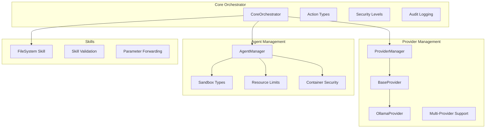
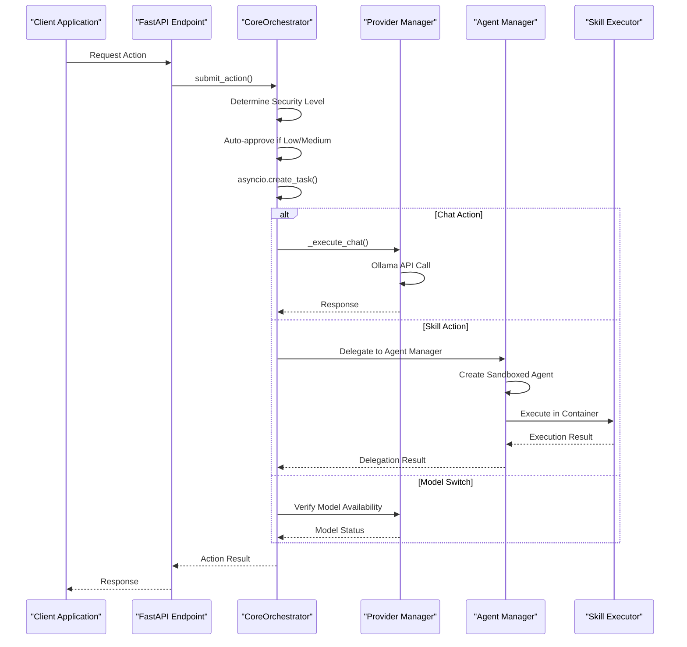
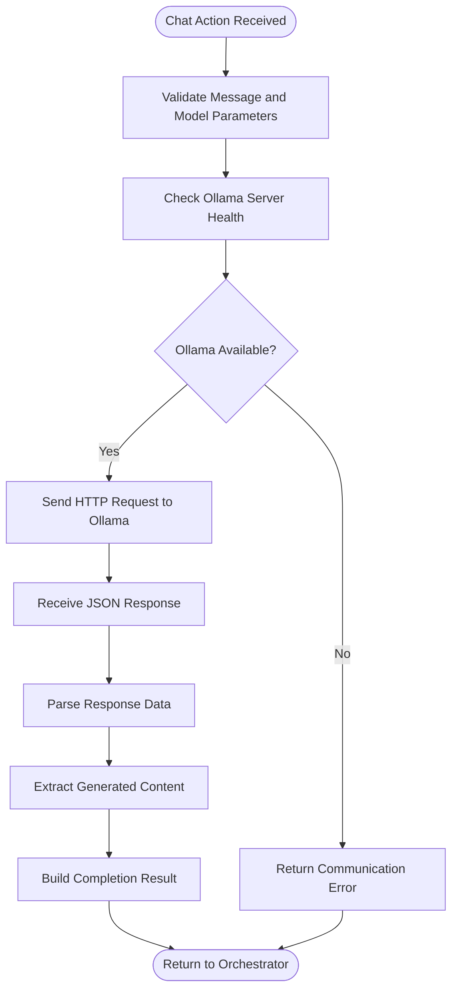
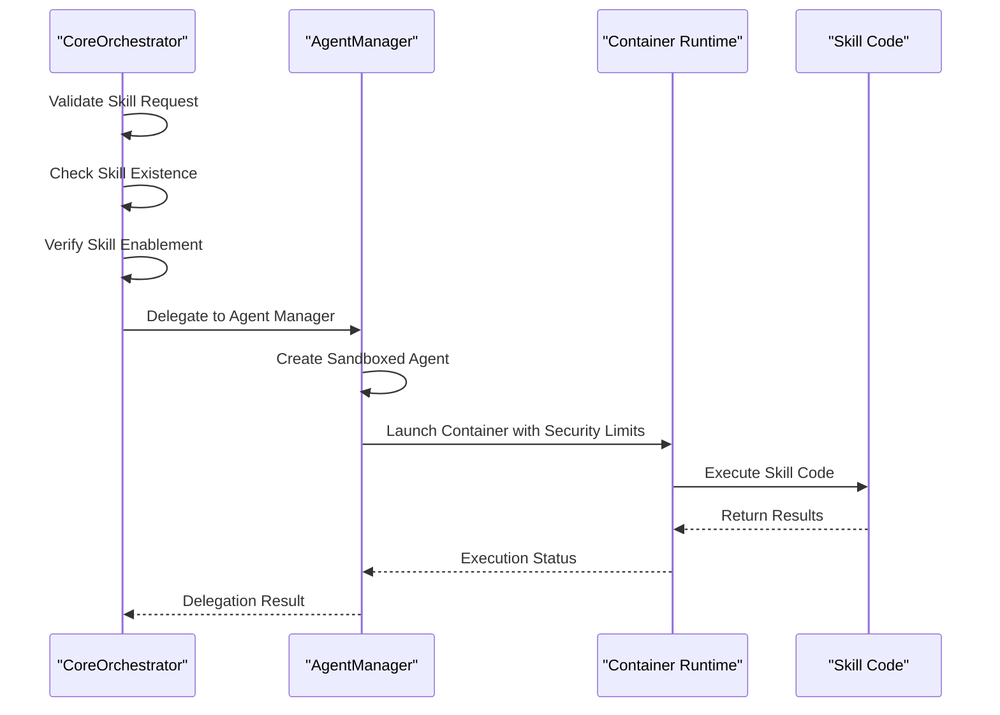
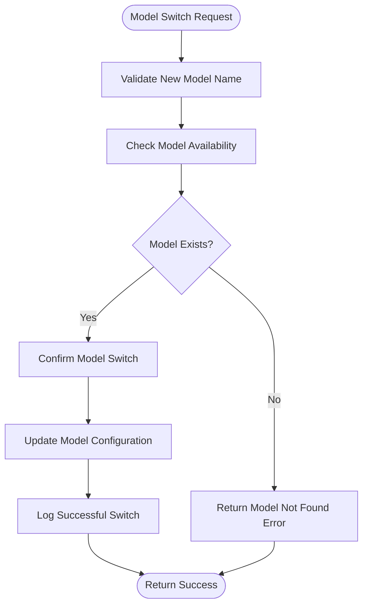
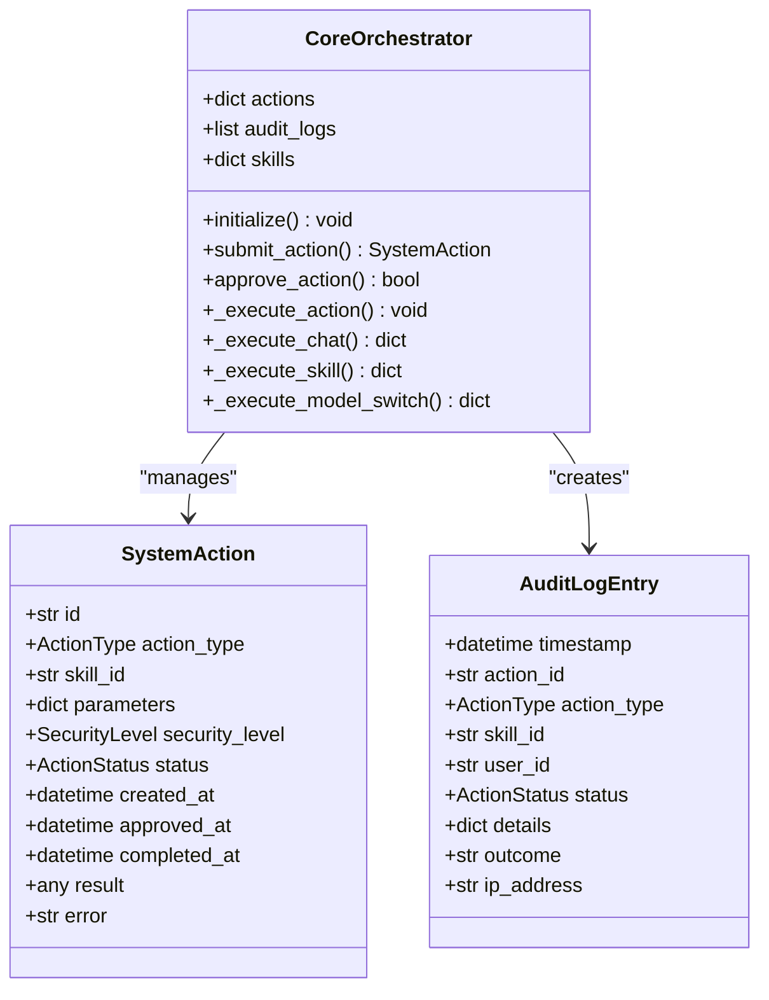
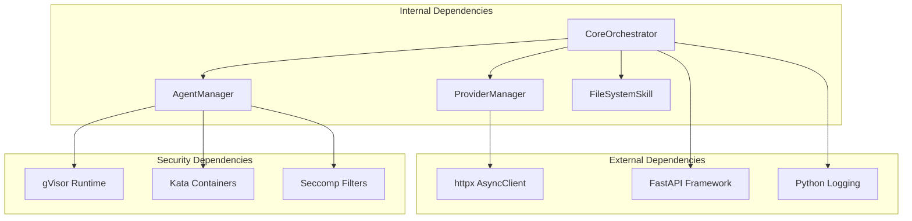

# Execution Pipeline

<cite>
**Referenced Files in This Document**
- [orchestrator.py](file://backend/app/core/orchestrator.py)
- [providers.py](file://backend/app/core/providers.py)
- [agent_manager.py](file://backend/app/core/agent_manager.py)
- [main.py](file://backend/app/main.py)
- [skill.py](file://skills/filesystem/skill.py)
</cite>

## Table of Contents
1. [Introduction](#introduction)
2. [Project Structure](#project-structure)
3. [Core Components](#core-components)
4. [Architecture Overview](#architecture-overview)
5. [Detailed Component Analysis](#detailed-component-analysis)
6. [Dependency Analysis](#dependency-analysis)
7. [Performance Considerations](#performance-considerations)
8. [Troubleshooting Guide](#troubleshooting-guide)
9. [Conclusion](#conclusion)

## Introduction

The Execution Pipeline within the Core Orchestrator represents the central nervous system of the ClosedPaw AI assistant platform. This sophisticated system manages three primary execution pathways: natural language processing with Ollama integration, skill-based operations delegation, and model management. The pipeline operates on a Zero-Trust security model with comprehensive audit logging, human-in-the-loop approval mechanisms, and robust error handling strategies.

The orchestrator serves as the primary coordination center, managing asynchronous task execution through Python's asyncio framework while maintaining strict security boundaries around skill execution through sandboxed containers. This architecture ensures both performance and security in AI-assisted operations.

## Project Structure

The execution pipeline spans several key modules within the backend application:

**Diagram sources**
- [orchestrator.py](file://backend/app/core/orchestrator.py#L87-L486)
- [providers.py](file://backend/app/core/providers.py#L418-L545)
- [agent_manager.py](file://backend/app/core/agent_manager.py#L65-L708)

**Section sources**
- [orchestrator.py](file://backend/app/core/orchestrator.py#L1-L110)
- [providers.py](file://backend/app/core/providers.py#L1-L50)
- [agent_manager.py](file://backend/app/core/agent_manager.py#L1-L40)

## Core Components

### CoreOrchestrator: Central Execution Coordinator

The CoreOrchestrator serves as the primary execution engine, managing all system operations through a sophisticated action-based workflow. It maintains a registry of system actions, implements security policies, and coordinates execution across multiple subsystems.

Key orchestration capabilities include:
- **Action Submission and Tracking**: Comprehensive action lifecycle management from submission to completion
- **Security Level Determination**: Automated risk assessment based on action type and parameters
- **Human-in-the-Loop Integration**: Approval workflows for high-risk operations
- **Audit Trail Management**: Complete logging of all actions for compliance and security monitoring

### Provider Management System

The provider management system abstracts multiple Large Language Model providers behind a unified interface, currently supporting Ollama, OpenAI, Anthropic, Google, and Mistral APIs. This abstraction enables seamless provider switching and failover capabilities.

Provider characteristics:
- **Unified Interface**: Consistent API across all supported providers
- **Health Monitoring**: Automatic provider health checks and availability verification
- **Rate Limiting**: Built-in request throttling and rate limiting
- **Timeout Management**: Configurable timeouts for each provider

### Agent Management System

The Agent Management System provides secure, sandboxed execution environments for skill operations using advanced container technologies. This system ensures complete isolation between skill executions and the host system.

Security features include:
- **Kernel-Level Isolation**: gVisor and Kata Containers provide true kernel-level sandboxing
- **Resource Constraints**: CPU, memory, and disk limitations prevent resource exhaustion
- **Network Isolation**: Complete network isolation prevents external communication
- **Process Control**: Seccomp filters and capability restrictions limit system access

**Section sources**
- [orchestrator.py](file://backend/app/core/orchestrator.py#L87-L130)
- [providers.py](file://backend/app/core/providers.py#L418-L457)
- [agent_manager.py](file://backend/app/core/agent_manager.py#L65-L98)

## Architecture Overview

The execution pipeline follows a layered architecture with clear separation of concerns:

**Diagram sources**
- [main.py](file://backend/app/main.py#L131-L182)
- [orchestrator.py](file://backend/app/core/orchestrator.py#L251-L286)
- [providers.py](file://backend/app/core/providers.py#L470-L483)

The architecture implements several key design patterns:

1. **Strategy Pattern**: Different execution strategies for chat, skill, and model operations
2. **Observer Pattern**: Audit logging and status notifications
3. **Factory Pattern**: Dynamic skill and provider instantiation
4. **Command Pattern**: Action-based execution with approval workflows

## Detailed Component Analysis

### Chat Execution Pipeline (_execute_chat)

The chat execution pathway handles natural language processing through the Ollama local server integration:

**Diagram sources**
- [orchestrator.py](file://backend/app/core/orchestrator.py#L303-L332)

Key features of the chat execution:
- **Local LLM Integration**: Direct communication with Ollama server on localhost
- **Timeout Management**: 60-second timeout for chat completion requests
- **Error Handling**: Graceful degradation when Ollama is unavailable
- **Response Processing**: Structured parsing of Ollama JSON responses

Practical examples:
- **Basic Chat**: Simple text queries with default model selection
- **Model-Specific Queries**: Targeted model selection for specialized tasks
- **Error Recovery**: Automatic fallback when external services fail

### Skill Execution Delegation (_execute_skill)

The skill execution pathway provides secure delegation of complex operations through sandboxed containers:

**Diagram sources**
- [orchestrator.py](file://backend/app/core/orchestrator.py#L333-L350)
- [agent_manager.py](file://backend/app/core/agent_manager.py#L149-L192)

Skill execution validation process:
- **Skill Discovery**: Dynamic loading of available skill modules
- **Enablement Verification**: Ensures skills are properly configured and enabled
- **Parameter Forwarding**: Secure transmission of execution parameters
- **Delegation Coordination**: Seamless handoff to agent management system

### Model Management Pipeline (_execute_model_switch)

The model management pathway handles dynamic model switching and validation:

**Diagram sources**
- [orchestrator.py](file://backend/app/core/orchestrator.py#L352-L375)

Model management capabilities:
- **Dynamic Model Loading**: Runtime model availability verification
- **Configuration Updates**: Seamless model switching without service interruption
- **Audit Logging**: Complete tracking of model changes for compliance
- **Error Reporting**: Detailed feedback on model availability and errors

### Async Execution Model

The execution pipeline leverages Python's asyncio framework for non-blocking operations:

**Diagram sources**
- [orchestrator.py](file://backend/app/core/orchestrator.py#L72-L110)

Async execution benefits:
- **Non-blocking Operations**: Concurrent action processing without thread blocking
- **Resource Efficiency**: Reduced memory footprint through cooperative multitasking
- **Scalability**: Ability to handle multiple concurrent operations efficiently
- **Responsiveness**: Maintains system responsiveness during long-running operations

**Section sources**
- [orchestrator.py](file://backend/app/core/orchestrator.py#L251-L375)
- [main.py](file://backend/app/main.py#L131-L182)

## Dependency Analysis

The execution pipeline exhibits well-structured dependencies with clear separation of concerns:

**Diagram sources**
- [providers.py](file://backend/app/core/providers.py#L15-L17)
- [agent_manager.py](file://backend/app/core/agent_manager.py#L10-L18)

Dependency management strategies:
- **Interface Abstraction**: Clear interfaces between components reduce coupling
- **Configuration Management**: Externalized configuration for easy testing and deployment
- **Error Boundary Protection**: Comprehensive error handling prevents cascading failures
- **Resource Cleanup**: Proper resource management through context managers and cleanup routines

**Section sources**
- [providers.py](file://backend/app/core/providers.py#L418-L545)
- [agent_manager.py](file://backend/app/core/agent_manager.py#L660-L696)

## Performance Considerations

The execution pipeline implements several performance optimization strategies:

### Asynchronous Processing
- **Task Parallelization**: Multiple actions can execute concurrently without blocking
- **Connection Pooling**: Reuse HTTP connections for provider communications
- **Memory Management**: Efficient handling of large responses and streaming operations

### Caching and Optimization
- **Model Availability Caching**: Reduce repeated model availability checks
- **Provider Health Monitoring**: Proactive detection of service degradation
- **Resource Limits**: Prevent resource exhaustion through automatic throttling

### Scalability Features
- **Horizontal Scaling**: Stateless design enables load balancing across instances
- **Graceful Degradation**: System continues operating with reduced functionality during failures
- **Backpressure Handling**: Automatic throttling during high-load conditions

## Troubleshooting Guide

### Common Issues and Solutions

**Ollama Connection Problems**
- **Symptom**: Chat actions failing with communication errors
- **Diagnosis**: Check Ollama server status and network connectivity
- **Solution**: Restart Ollama service or adjust timeout configurations

**Skill Execution Failures**
- **Symptom**: Skills not executing or returning permission errors
- **Diagnosis**: Verify skill enablement and sandbox runtime availability
- **Solution**: Enable required skills and ensure sandbox dependencies are installed

**Model Switch Errors**
- **Symptom**: Model switching failing with availability errors
- **Diagnosis**: Verify model exists in Ollama registry
- **Solution**: Download required model or select available model

### Error Propagation Strategies

The system implements comprehensive error handling:
- **Action-Level Error Tracking**: Individual action failure isolation
- **Audit Trail Integration**: Complete error logging for debugging
- **Graceful Degradation**: Partial functionality during component failures
- **Timeout Management**: Prevents indefinite blocking of operations

**Section sources**
- [orchestrator.py](file://backend/app/core/orchestrator.py#L287-L302)
- [agent_manager.py](file://backend/app/core/agent_manager.py#L520-L537)

## Conclusion

The Execution Pipeline within the Core Orchestrator represents a sophisticated balance between performance, security, and reliability. Through its three primary execution pathways—natural language processing, skill-based operations, and model management—the system provides comprehensive AI-assisted functionality while maintaining strict security boundaries.

The implementation demonstrates several key strengths:
- **Robust Security Architecture**: Zero-Trust principles with kernel-level isolation
- **Flexible Provider Support**: Multi-provider architecture with seamless switching
- **Comprehensive Error Handling**: Graceful degradation and detailed error reporting
- **Performance Optimization**: Async execution model with efficient resource utilization

Future enhancements could include:
- Enhanced provider abstraction for additional LLM services
- Advanced caching mechanisms for improved response times
- Machine learning-based security policy optimization
- Enhanced monitoring and observability features

The execution pipeline successfully meets the requirements for secure, efficient, and reliable AI-assisted operations while maintaining the flexibility needed for future expansion and enhancement.