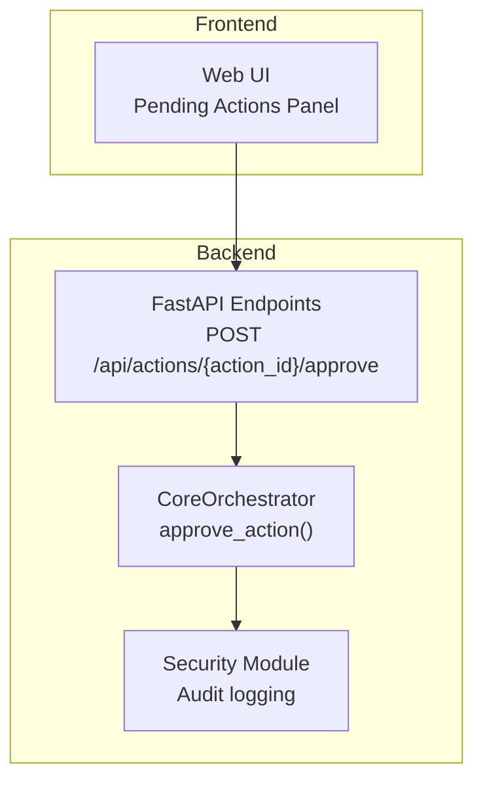
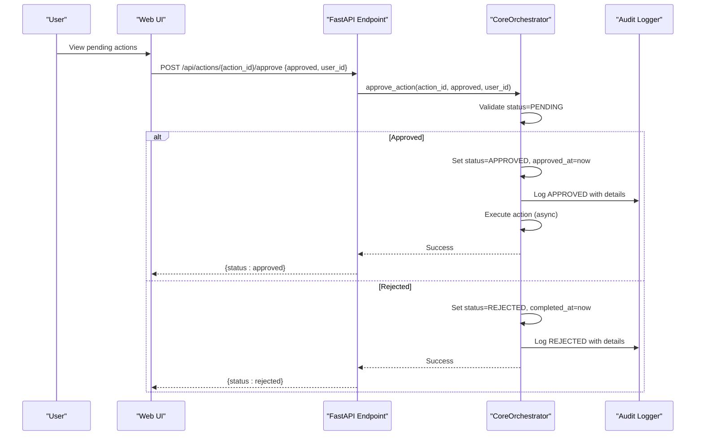
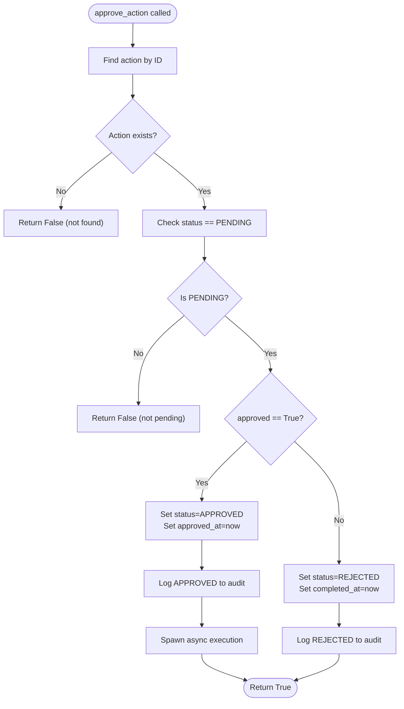
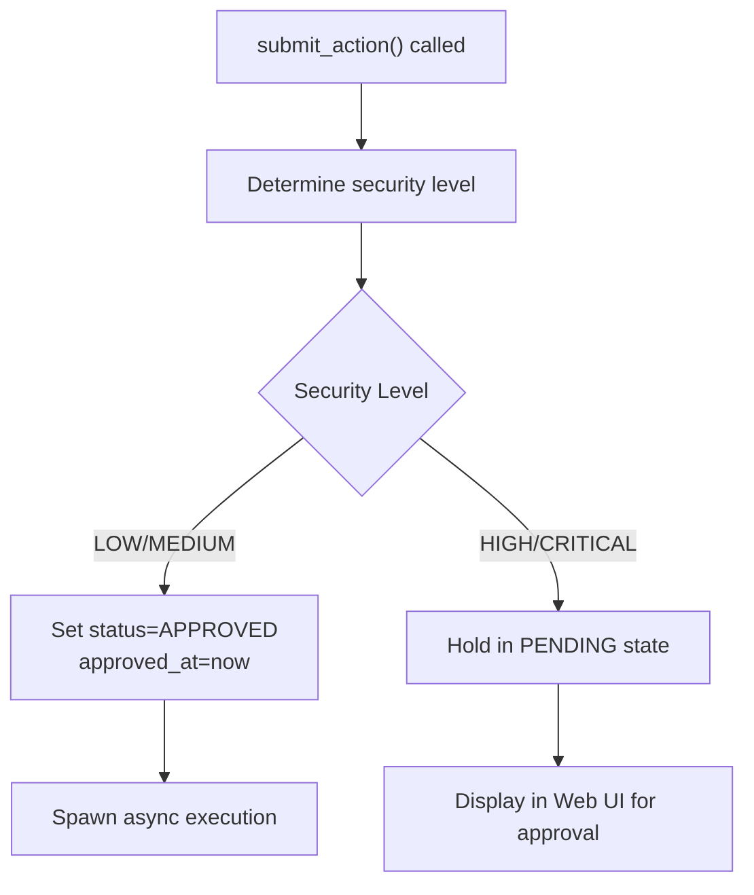
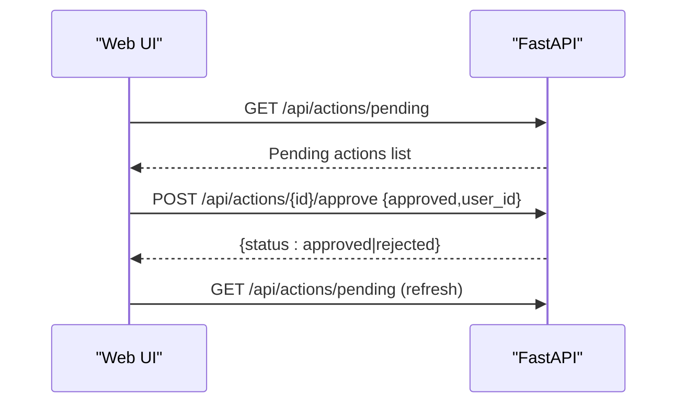
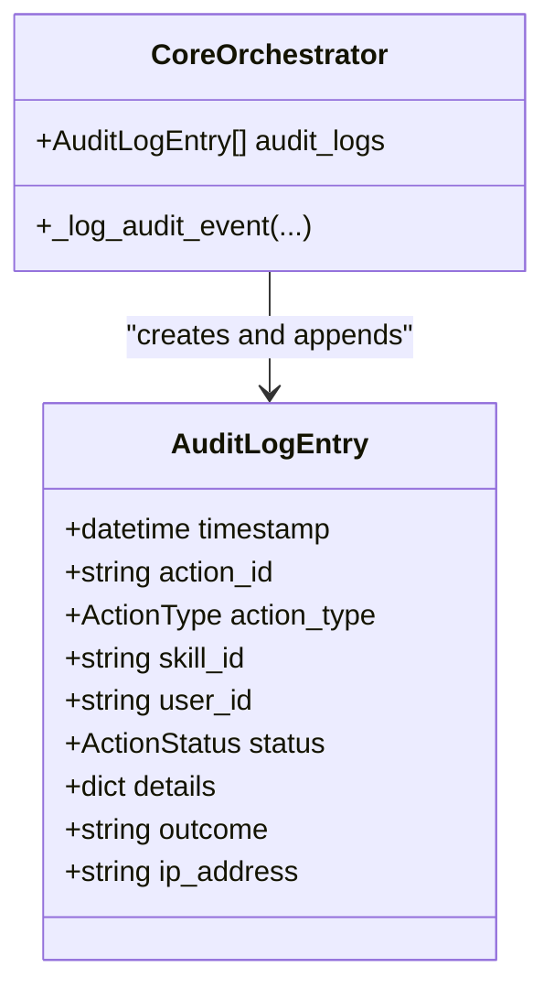
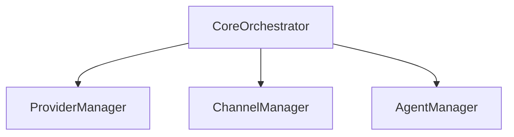
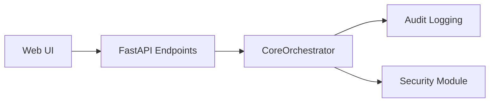

# Human-in-the-Loop Interface

<cite>
**Referenced Files in This Document**
- [orchestrator.py](file://backend/app/core/orchestrator.py)
- [main.py](file://backend/app/main.py)
- [page.tsx](file://frontend/src/app/page.tsx)
- [security.py](file://backend/app/core/security.py)
- [agent_manager.py](file://backend/app/core/agent_manager.py)
- [providers.py](file://backend/app/core/providers.py)
- [channels.py](file://backend/app/core/channels.py)
- [README.md](file://README.md)
</cite>

## Table of Contents
1. [Introduction](#introduction)
2. [Project Structure](#project-structure)
3. [Core Components](#core-components)
4. [Architecture Overview](#architecture-overview)
5. [Detailed Component Analysis](#detailed-component-analysis)
6. [Dependency Analysis](#dependency-analysis)
7. [Performance Considerations](#performance-considerations)
8. [Troubleshooting Guide](#troubleshooting-guide)
9. [Conclusion](#conclusion)

## Introduction
This document explains the Human-in-the-Loop (HITL) Interface functionality within the Core Orchestrator. It focuses on the approve_action() method for manual action approval and rejection, covering user authorization, approval validation, and status updates. It also details integration points with the web UI for approval workflows, including how high and critical security actions are routed to human approval. The approval process flow from PENDING state through APPROVED/REJECTED states to EXECUTING completion is documented, along with security implications such as user identity management, approval tracking, and audit trail completeness. Examples of approval scenarios, rejection reasons, and automated vs. manual approval workflows are included, alongside the HITL interface initialization process, integration with external approval systems, and fallback mechanisms when human approval is unavailable.

## Project Structure
The HITL functionality spans three primary areas:
- Core Orchestrator: action lifecycle, security levels, approval logic, and audit logging
- FastAPI Backend: REST endpoints for submitting actions, retrieving pending actions, and approving/rejecting actions
- Web UI: real-time display of pending actions and manual approval controls

**Diagram sources**
- [orchestrator.py](file://backend/app/core/orchestrator.py#L376-L427)
- [main.py](file://backend/app/main.py#L284-L298)
- [page.tsx](file://frontend/src/app/page.tsx#L112-L131)

**Section sources**
- [README.md](file://README.md#L65-L105)
- [orchestrator.py](file://backend/app/core/orchestrator.py#L87-L130)
- [main.py](file://backend/app/main.py#L284-L298)
- [page.tsx](file://frontend/src/app/page.tsx#L112-L131)

## Core Components
- CoreOrchestrator: central component managing actions, security levels, and approval lifecycle
- approve_action(): validates and processes manual approvals/rejections
- SecurityLevel: categorizes actions by risk (LOW, MEDIUM, HIGH, CRITICAL)
- AuditLogEntry: records security-relevant events for compliance and forensics
- FastAPI endpoints: expose approval workflows to the web UI
- Web UI: displays pending actions and triggers approvals

Key responsibilities:
- Determine security level for submitted actions
- Route high-risk actions to human approval
- Enforce approval validation and status transitions
- Maintain audit trails for all approvals and executions

**Section sources**
- [orchestrator.py](file://backend/app/core/orchestrator.py#L31-L85)
- [orchestrator.py](file://backend/app/core/orchestrator.py#L225-L250)
- [orchestrator.py](file://backend/app/core/orchestrator.py#L376-L427)
- [main.py](file://backend/app/main.py#L284-L298)
- [page.tsx](file://frontend/src/app/page.tsx#L112-L131)

## Architecture Overview
The HITL approval workflow integrates the backend orchestrator with the web UI:

**Diagram sources**
- [main.py](file://backend/app/main.py#L284-L298)
- [orchestrator.py](file://backend/app/core/orchestrator.py#L376-L427)
- [security.py](file://backend/app/core/security.py#L429-L449)

## Detailed Component Analysis

### approve_action() Method
The approve_action() method enforces:
- Action existence and PENDING status validation
- Approval or rejection transitions
- Timestamp updates and audit logging
- Asynchronous execution of approved actions

**Diagram sources**
- [orchestrator.py](file://backend/app/core/orchestrator.py#L376-L427)

**Section sources**
- [orchestrator.py](file://backend/app/core/orchestrator.py#L376-L427)

### Security Levels and Routing to HITL
Security levels drive whether actions auto-execute or require human approval:
- LOW: auto-approved and executed
- MEDIUM: auto-approved and executed
- HIGH: routed to HITL (approval required)
- CRITICAL: routed to HITL (additional verification may apply)

**Diagram sources**
- [orchestrator.py](file://backend/app/core/orchestrator.py#L169-L223)
- [orchestrator.py](file://backend/app/core/orchestrator.py#L225-L249)

**Section sources**
- [orchestrator.py](file://backend/app/core/orchestrator.py#L51-L56)
- [orchestrator.py](file://backend/app/core/orchestrator.py#L225-L249)

### Web UI Integration for Approvals
The web UI polls for pending actions and allows manual approval/rejection:
- Fetch pending actions via GET /api/actions/pending
- Approve or reject via POST /api/actions/{action_id}/approve
- Real-time updates after each approval action

**Diagram sources**
- [page.tsx](file://frontend/src/app/page.tsx#L112-L131)
- [main.py](file://backend/app/main.py#L265-L281)
- [main.py](file://backend/app/main.py#L284-L298)

**Section sources**
- [page.tsx](file://frontend/src/app/page.tsx#L112-L131)
- [main.py](file://backend/app/main.py#L265-L281)
- [main.py](file://backend/app/main.py#L284-L298)

### Audit Trail and Compliance
All approvals and executions are recorded in the audit log:
- Fields include timestamp, action_id, action_type, skill_id, user_id, status, outcome, details
- Logs are written to a dedicated audit file and maintained in-memory for retrieval

**Diagram sources**
- [orchestrator.py](file://backend/app/core/orchestrator.py#L59-L70)
- [orchestrator.py](file://backend/app/core/orchestrator.py#L429-L449)

**Section sources**
- [orchestrator.py](file://backend/app/core/orchestrator.py#L429-L449)
- [security.py](file://backend/app/core/security.py#L429-L449)

### External Systems Integration and Fallbacks
- LLM Providers: Multi-provider gateway supports local and cloud providers
- Channels: Web UI, Telegram, Discord, Slack, CLI channels
- Agent Manager: Sandboxed execution for skills with gVisor/Kata
- Fallbacks: Local-only operation, secure defaults, and audit logging ensure continuity and safety

**Diagram sources**
- [providers.py](file://backend/app/core/providers.py#L418-L524)
- [channels.py](file://backend/app/core/channels.py#L405-L502)
- [agent_manager.py](file://backend/app/core/agent_manager.py#L65-L98)

**Section sources**
- [providers.py](file://backend/app/core/providers.py#L418-L524)
- [channels.py](file://backend/app/core/channels.py#L405-L502)
- [agent_manager.py](file://backend/app/core/agent_manager.py#L65-L98)

## Dependency Analysis
The approval workflow depends on:
- CoreOrchestrator for action state management and approval logic
- FastAPI endpoints for external API access
- Web UI for user interaction and real-time updates
- Security module for audit logging and compliance

**Diagram sources**
- [main.py](file://backend/app/main.py#L284-L298)
- [orchestrator.py](file://backend/app/core/orchestrator.py#L376-L427)
- [security.py](file://backend/app/core/security.py#L429-L449)

**Section sources**
- [main.py](file://backend/app/main.py#L284-L298)
- [orchestrator.py](file://backend/app/core/orchestrator.py#L376-L427)
- [security.py](file://backend/app/core/security.py#L429-L449)

## Performance Considerations
- Asynchronous execution: Approved actions are executed asynchronously to avoid blocking the approval endpoint
- Minimal in-memory footprint: Audit logs are stored in-memory for quick retrieval; consider persistence for production deployments
- Rate limiting: Security module includes rate limiting to mitigate abuse during approval workflows
- Scalability: For high-throughput environments, consider queuing mechanisms and external audit storage

[No sources needed since this section provides general guidance]

## Troubleshooting Guide
Common issues and resolutions:
- Action not found or not pending: approve_action returns False; verify action_id and status
- Rejected actions: Confirm user intent and review audit logs for rejection details
- Audit logging failures: Ensure audit log file path is writable and accessible
- Web UI not updating: Verify polling intervals and endpoint reachability

**Section sources**
- [orchestrator.py](file://backend/app/core/orchestrator.py#L388-L395)
- [main.py](file://backend/app/main.py#L284-L298)
- [security.py](file://backend/app/core/security.py#L429-L449)

## Conclusion
The HITL Interface in the Core Orchestrator provides a robust, secure mechanism for manual approval of high-risk actions. Through clear state transitions, comprehensive audit logging, and seamless web UI integration, it ensures that critical decisions remain under human control while maintaining system responsiveness and compliance. The modular architecture supports future enhancements such as external approval systems and extended audit storage, preserving the zero-trust security posture.