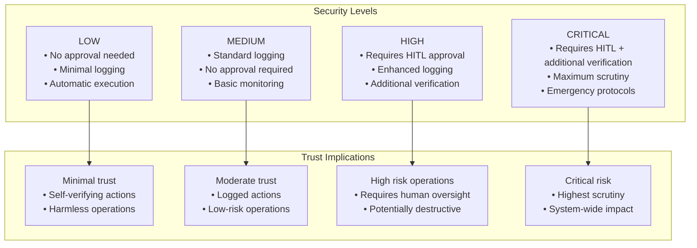
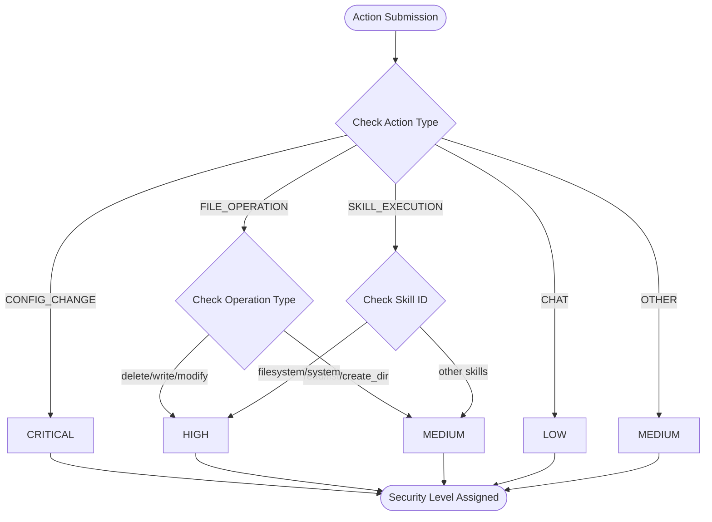
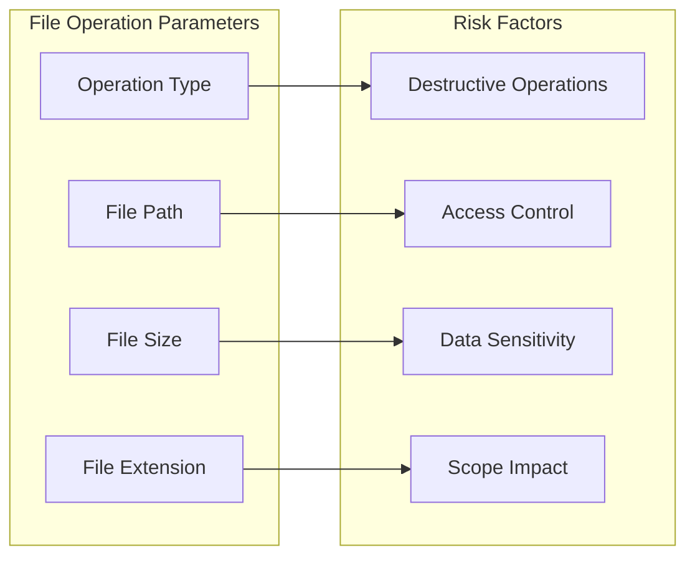
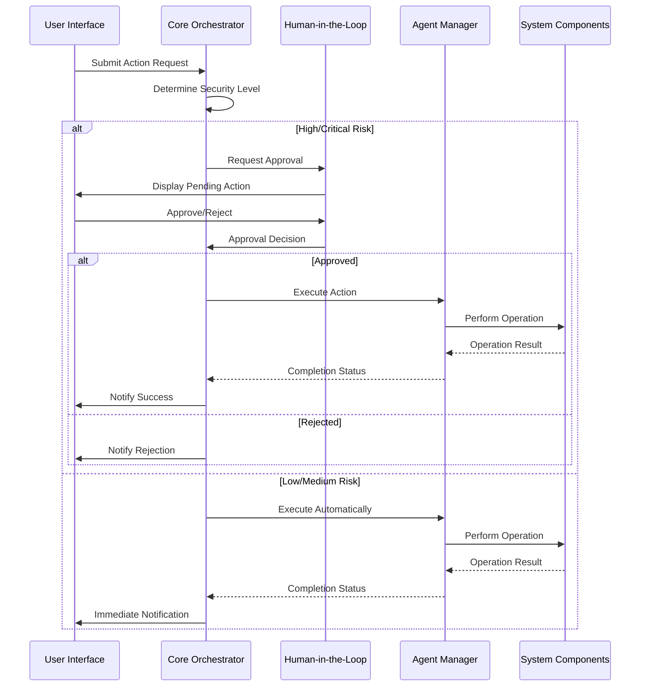
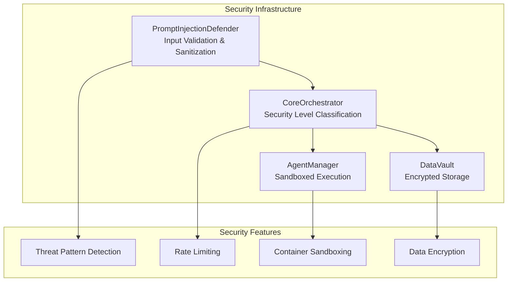

# Security Level Classification

<cite>
**Referenced Files in This Document**
- [security.py](file://backend/app/core/security.py)
- [orchestrator.py](file://backend/app/core/orchestrator.py)
- [agent_manager.py](file://backend/app/core/agent_manager.py)
- [skill.py](file://skills/filesystem/skill.py)
- [README.md](file://README.md)
- [main.py](file://backend/app/main.py)
</cite>

## Table of Contents
1. [Introduction](#introduction)
2. [Security Level Framework](#security-level-framework)
3. [Automatic Security Determination Algorithm](#automatic-security-determination-algorithm)
4. [Security Decision Matrix](#security-decision-matrix)
5. [Parameter Analysis Examples](#parameter-analysis-examples)
6. [Human-in-the-Loop Integration](#human-in-the-loop-integration)
7. [Logging and Audit Trail](#logging-and-audit-trail)
8. [Security Implementation Details](#security-implementation-details)
9. [Best Practices and Recommendations](#best-practices-and-recommendations)
10. [Troubleshooting Guide](#troubleshooting-guide)

## Introduction

The Security Level Classification system in the Core Orchestrator implements a comprehensive zero-trust security model designed to protect users from potentially harmful actions while maintaining operational efficiency. This system automatically classifies all system actions into four security levels (LOW, MEDIUM, HIGH, CRITICAL) based on action type, parameters, and contextual factors.

The system operates on the principle that "implicit trust is the enemy of security," requiring explicit verification and approval for any action that could potentially compromise system integrity or user data. This approach ensures that even trusted users cannot execute potentially dangerous operations without proper oversight.

## Security Level Framework

The security classification system defines four distinct security levels, each with specific trust implications and operational requirements:



**Section sources**
- [orchestrator.py](file://backend/app/core/orchestrator.py#L51-L57)

### Security Level Definitions

Each security level represents different degrees of trust and risk assessment:

- **LOW (Low Risk)**: Actions that are inherently safe and can execute without human intervention
- **MEDIUM (Medium Risk)**: Actions that should be logged but can execute automatically
- **HIGH (High Risk)**: Actions requiring human-in-the-loop approval before execution
- **CRITICAL (Critical Risk)**: Actions requiring multiple approvals and additional verification procedures

## Automatic Security Determination Algorithm

The `_determine_security_level()` method implements a sophisticated algorithm that evaluates action types and parameters to assign appropriate security classifications. The algorithm follows a hierarchical decision tree with specific criteria for each action category.



**Diagram sources**
- [orchestrator.py](file://backend/app/core/orchestrator.py#L225-L249)

### Algorithm Implementation Details

The security determination algorithm follows these evaluation steps:

1. **Critical Action Detection**: Actions that immediately receive highest security classification
2. **File Operation Analysis**: Destructive operations classified as HIGH risk
3. **Skill-Based Assessment**: Certain skills require elevated security levels
4. **Default Classification**: Safe operations default to MEDIUM or LOW levels

**Section sources**
- [orchestrator.py](file://backend/app/core/orchestrator.py#L225-L249)

## Security Decision Matrix

The security decision matrix provides comprehensive guidelines for classifying different action categories based on their inherent risk profiles and potential impact.

### Action Category Classification

| Action Type | Security Level | Risk Assessment | Trust Implications |
|-------------|----------------|-----------------|-------------------|
| **CHAT** | LOW | Minimal risk - informational exchange | Implicit trust for communication |
| **FILE_OPERATION** | MEDIUM/HIGH | Variable risk based on operation type | Requires careful handling of data |
| **SKILL_EXECUTION** | MEDIUM/HIGH | Depends on skill capabilities | Potential system access |
| **CONFIG_CHANGE** | CRITICAL | Maximum risk - system modification | Requires highest scrutiny |
| **MODEL_SWITCH** | MEDIUM | Moderate risk - model selection | Controlled access to resources |

### Parameter-Based Risk Scoring

The system evaluates parameters to determine additional risk factors:



**Diagram sources**
- [orchestrator.py](file://backend/app/core/orchestrator.py#L232-L237)

**Section sources**
- [orchestrator.py](file://backend/app/core/orchestrator.py#L225-L249)

## Parameter Analysis Examples

### File Operations Security Assessment

The system performs detailed analysis of file operation parameters to determine appropriate security levels:

#### Destructive Operations Analysis
- **Delete Operations**: Automatically classified as HIGH risk
- **Write Operations**: Classified as HIGH risk requiring approval
- **Modify Operations**: Classified as HIGH risk requiring approval
- **Read/List Operations**: Classified as MEDIUM risk

#### Path and Scope Evaluation
The system analyzes file paths for potential security issues:
- Path traversal attempts are blocked and logged
- Operations outside designated sandboxes are prevented
- File size limits prevent resource exhaustion attacks

**Section sources**
- [orchestrator.py](file://backend/app/core/orchestrator.py#L232-L237)
- [skill.py](file://skills/filesystem/skill.py#L77-L108)

### Skill Security Assessment

Skills are evaluated based on their potential system access and capabilities:

#### High-Risk Skills
- **Filesystem Operations**: Requires HIGH security level
- **System-Level Access**: Requires HIGH security level
- **Network Operations**: Requires HIGH security level

#### Medium-Risk Skills
- **Information Retrieval**: Requires MEDIUM security level
- **Basic Processing**: Requires MEDIUM security level

**Section sources**
- [orchestrator.py](file://backend/app/core/orchestrator.py#L239-L243)
- [skill.py](file://skills/filesystem/skill.py#L47-L75)

### Model Switching Security Considerations

Model switching operations undergo specific security evaluations:

#### Validation Requirements
- **Model Availability**: Verifies target model exists in system
- **Resource Constraints**: Checks system capacity for model switching
- **Security Compliance**: Ensures model meets security requirements

#### Risk Mitigation
- Prevents switching to untrusted or compromised models
- Validates model compatibility with system requirements
- Monitors resource usage during model transitions

**Section sources**
- [orchestrator.py](file://backend/app/core/orchestrator.py#L352-L374)

## Human-in-the-Loop Integration

The Human-in-the-Loop (HITL) system provides critical oversight for high-risk operations through a comprehensive approval workflow.



**Diagram sources**
- [orchestrator.py](file://backend/app/core/orchestrator.py#L210-L223)
- [main.py](file://backend/app/main.py#L242-L298)

### HITL Workflow Implementation

The HITL system implements several key features:

#### Approval Management
- **Pending Actions Queue**: Centralized management of pending approvals
- **Approval Tracking**: Complete audit trail of all approval decisions
- **Escalation Procedures**: Automatic escalation for critical failures

#### Security Controls
- **Multi-Factor Approval**: Additional verification for CRITICAL actions
- **Time-Based Approvals**: Timeout mechanisms for pending actions
- **Role-Based Access**: Different approval permissions based on user roles

**Section sources**
- [orchestrator.py](file://backend/app/core/orchestrator.py#L376-L427)
- [main.py](file://backend/app/main.py#L265-L298)

## Logging and Audit Trail

The system maintains comprehensive logging and audit trails for all security-related activities, providing complete forensic capabilities and compliance support.

### Audit Log Structure

```mermaid
erDiagram
AUDIT_LOG {
string action_id PK
datetime timestamp
enum action_type
string skill_id
string user_id
enum status
json details
string outcome
string ip_address
}
SYSTEM_ACTION {
string id PK
enum action_type
string skill_id
json parameters
enum security_level
enum status
datetime created_at
datetime approved_at
datetime completed_at
json result
string error
}
AUDIT_LOG }o|--|| SYSTEM_ACTION : "tracks"
```

**Diagram sources**
- [orchestrator.py](file://backend/app/core/orchestrator.py#L59-L84)

### Logging Policy Framework

#### Comprehensive Coverage
- **All Actions**: Every system action is logged regardless of security level
- **Status Changes**: Complete lifecycle tracking of action status
- **Error Conditions**: Detailed error logging for troubleshooting
- **Security Events**: Special handling for security-related incidents

#### Data Protection Measures
- **Minimal Data Collection**: Only necessary information is logged
- **Timestamp Precision**: High-resolution timestamps for correlation
- **Structured Format**: Consistent JSON format for easy analysis
- **Retention Policies**: Configurable retention periods for compliance

**Section sources**
- [orchestrator.py](file://backend/app/core/orchestrator.py#L429-L449)

### Audit Trail Implications

The audit trail serves multiple critical purposes:

#### Forensic Analysis
- **Incident Response**: Complete timeline of events for security incidents
- **Compliance Reporting**: Evidence for regulatory compliance requirements
- **System Monitoring**: Patterns and trends analysis for system health

#### Operational Benefits
- **Performance Metrics**: Action completion times and success rates
- **Usage Analytics**: Popular actions and user behavior patterns
- **Troubleshooting Support**: Detailed error information for debugging

**Section sources**
- [orchestrator.py](file://backend/app/core/orchestrator.py#L459-L461)

## Security Implementation Details

The security system integrates multiple layers of protection through specialized components and defensive mechanisms.

### Core Security Components



**Diagram sources**
- [security.py](file://backend/app/core/security.py#L35-L107)
- [agent_manager.py](file://backend/app/core/agent_manager.py#L65-L97)

### Threat Detection Mechanisms

The system implements comprehensive threat detection through multiple pattern recognition systems:

#### Pattern Recognition Categories
- **Instruction Override**: Attempts to bypass system instructions
- **Role Manipulation**: Social engineering and role-playing attacks
- **Delimiter Manipulation**: Markdown and code injection attempts
- **Encoding Obfuscation**: Base64, hex, and other obfuscation techniques
- **Context Manipulation**: System prompt and context injection
- **Persistence Attempts**: Requests to save or remember information
- **Tool Hijacking**: Attempts to misuse system tools

**Section sources**
- [security.py](file://backend/app/core/security.py#L42-L93)

### Container Security Architecture

The Agent Manager implements advanced sandboxing using industry-leading technologies:

#### Sandbox Technologies
- **gVisor**: Userspace kernel for container isolation
- **Kata Containers**: VM-level isolation for maximum security
- **Process Isolation**: Individual process containment
- **Network Isolation**: Complete network separation

#### Security Hardening
- **Seccomp Filters**: System call restrictions
- **Resource Limits**: CPU, memory, and disk quotas
- **Read-Only Filesystems**: Immutable container roots
- **Network Restrictions**: No outbound connections

**Section sources**
- [agent_manager.py](file://backend/app/core/agent_manager.py#L65-L97)
- [agent_manager.py](file://backend/app/core/agent_manager.py#L194-L200)

## Best Practices and Recommendations

### Security Level Selection Guidelines

#### Low-Risk Operations
- **Chat Interactions**: General conversation and information requests
- **Public Information**: Non-sensitive data retrieval
- **System Monitoring**: Status checks and health monitoring

#### Medium-Risk Operations
- **File Reading**: Non-sensitive file access
- **Basic Processing**: Simple data transformations
- **System Information**: Non-critical system queries

#### High-Risk Operations
- **File Modifications**: Writing, deleting, or modifying files
- **System Access**: Direct system-level operations
- **Network Operations**: External connectivity and data transfer

#### Critical Operations
- **Configuration Changes**: System-wide modifications
- **Security Policy Updates**: Access control changes
- **Emergency Procedures**: Critical system interventions

### Implementation Recommendations

#### Parameter Validation
- **Input Sanitization**: Always validate and sanitize user inputs
- **Type Checking**: Verify parameter types and formats
- **Range Validation**: Check parameter values against acceptable ranges
- **Pattern Matching**: Use regular expressions for complex validations

#### Security Monitoring
- **Real-time Alerts**: Immediate notification of security events
- **Trend Analysis**: Identify patterns in security incidents
- **Threshold Management**: Adjustable security thresholds
- **Automated Responses**: Predefined responses to common threats

#### Compliance Considerations
- **Data Minimization**: Collect only necessary information
- **Privacy Protection**: Anonymize personal data where possible
- **Audit Requirements**: Maintain complete audit trails
- **Regulatory Compliance**: Adhere to applicable regulations

## Troubleshooting Guide

### Common Security Issues

#### Action Classification Problems
- **Misclassified Actions**: Actions incorrectly assigned security levels
- **Parameter Validation Failures**: Valid parameters flagged as risky
- **Approval Delays**: HITL approvals taking excessive time
- **Audit Log Issues**: Missing or corrupted audit entries

#### Resolution Strategies

##### Action Classification Issues
1. **Review Security Logic**: Verify `_determine_security_level()` implementation
2. **Parameter Analysis**: Check parameter values and types
3. **Action Type Validation**: Ensure proper action type specification
4. **Context Evaluation**: Consider action context and user permissions

##### Parameter Validation Problems
1. **Input Sanitization**: Review input validation rules
2. **Pattern Matching**: Check regular expression patterns
3. **Threshold Values**: Verify security threshold configurations
4. **Rate Limiting**: Examine rate limiting parameters

##### HITL Integration Issues
1. **Approval Workflow**: Verify HITL approval processes
2. **User Permissions**: Check user role and permission levels
3. **Notification Systems**: Ensure proper user notifications
4. **Timeout Handling**: Review timeout and escalation procedures

**Section sources**
- [orchestrator.py](file://backend/app/core/orchestrator.py#L225-L249)
- [security.py](file://backend/app/core/security.py#L182-L205)

### Security Event Investigation

#### Incident Response Procedures
- **Event Classification**: Determine security event severity
- **Impact Assessment**: Evaluate potential system and data impact
- **Containment Measures**: Implement immediate protective actions
- **Forensic Analysis**: Collect and preserve evidence
- **Remediation Steps**: Address root causes and vulnerabilities
- **Post-Incident Review**: Analyze lessons learned and improvements

#### Monitoring and Alerting
- **Security Dashboard**: Real-time security event monitoring
- **Alert Thresholds**: Configurable alerting parameters
- **Escalation Procedures**: Automatic escalation for critical events
- **Response Automation**: Automated responses to common threats

### Performance Optimization

#### Security Overhead Management
- **Efficient Pattern Matching**: Optimize regular expression performance
- **Memory Usage**: Monitor and optimize security component memory
- **Processing Speed**: Balance security thoroughness with performance
- **Resource Allocation**: Proper allocation of security resources

#### Scalability Considerations
- **Horizontal Scaling**: Distribute security components across nodes
- **Load Balancing**: Evenly distribute security workload
- **Caching Strategies**: Implement intelligent caching for security data
- **Database Optimization**: Optimize security database performance

**Section sources**
- [security.py](file://backend/app/core/security.py#L290-L317)
- [agent_manager.py](file://backend/app/core/agent_manager.py#L81-L97)