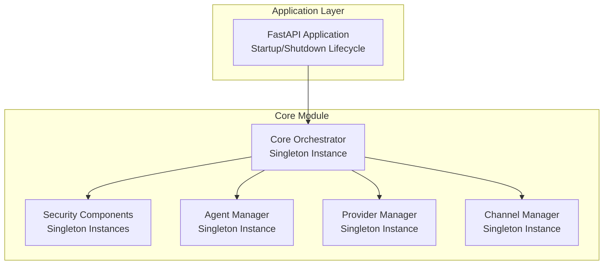
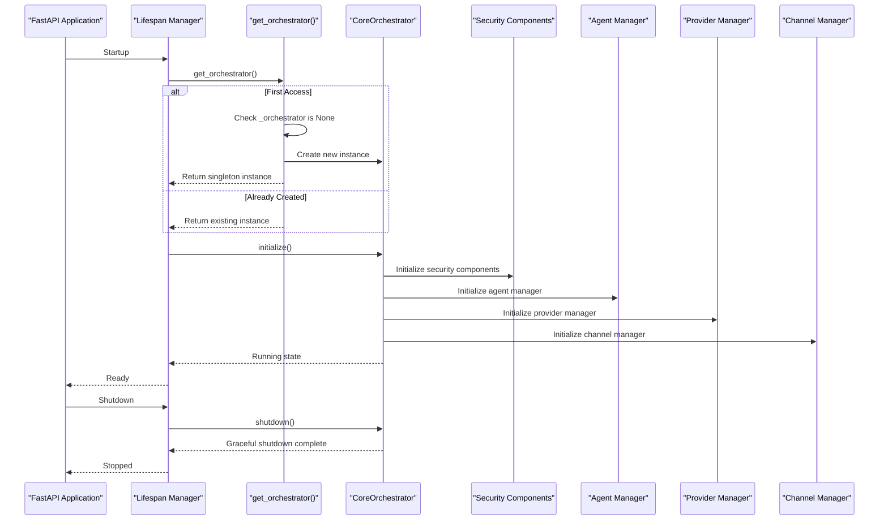
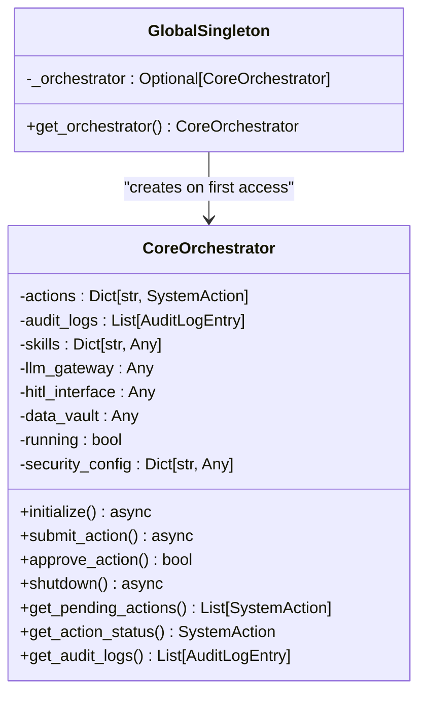
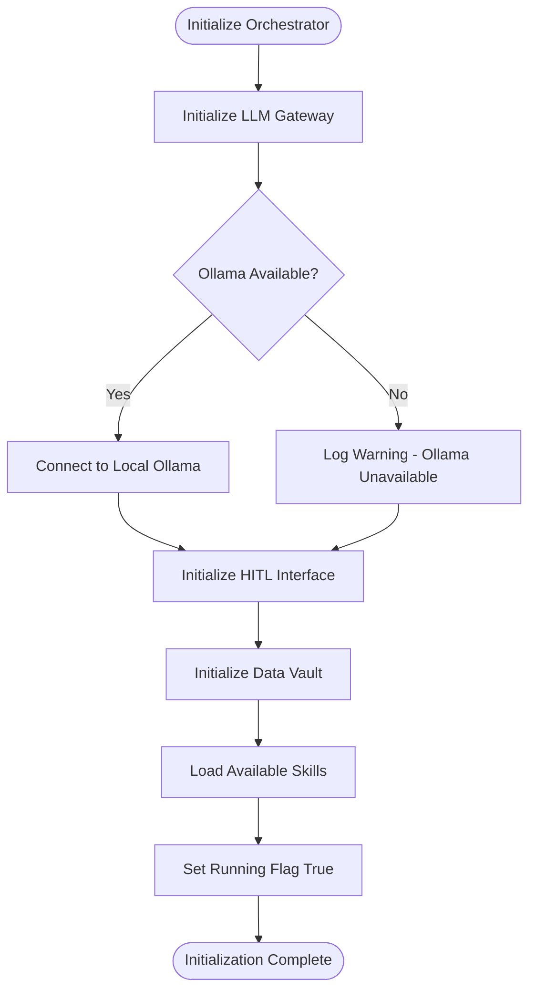
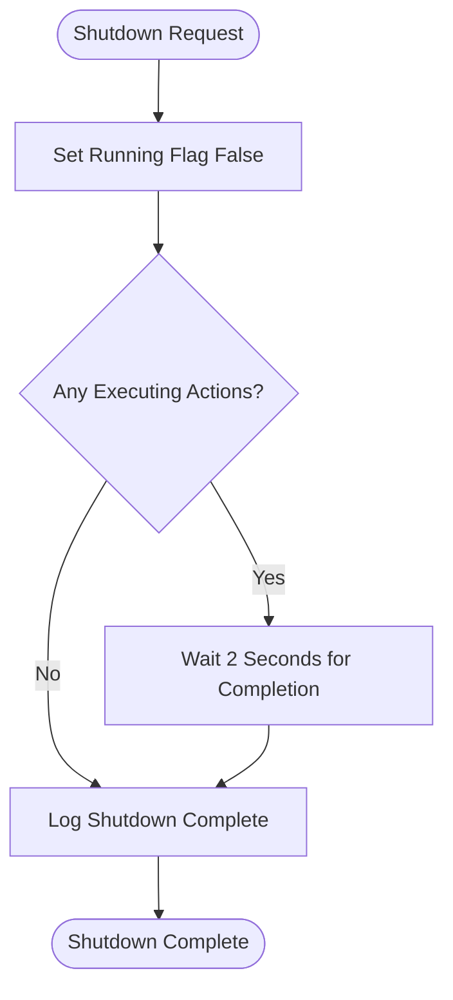
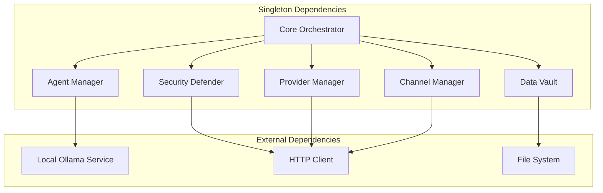

# Singleton Pattern Implementation

<cite>
**Referenced Files in This Document**
- [orchestrator.py](file://backend/app/core/orchestrator.py)
- [__init__.py](file://backend/app/core/__init__.py)
- [main.py](file://backend/app/main.py)
- [security.py](file://backend/app/core/security.py)
- [agent_manager.py](file://backend/app/core/agent_manager.py)
- [providers.py](file://backend/app/core/providers.py)
- [channels.py](file://backend/app/core/channels.py)
</cite>

## Table of Contents
1. [Introduction](#introduction)
2. [Project Structure](#project-structure)
3. [Core Components](#core-components)
4. [Architecture Overview](#architecture-overview)
5. [Detailed Component Analysis](#detailed-component-analysis)
6. [Dependency Analysis](#dependency-analysis)
7. [Performance Considerations](#performance-considerations)
8. [Troubleshooting Guide](#troubleshooting-guide)
9. [Conclusion](#conclusion)

## Introduction
This document provides comprehensive documentation for the Singleton Pattern Implementation in the Core Orchestrator. It explains the `get_orchestrator()` factory function that manages the single instance creation and access, details the global `_orchestrator` variable and lazy initialization, and documents the benefits of the singleton pattern for the orchestrator. It also covers the initialization sequence in `CoreOrchestrator.__init__()`, security configuration defaults, internal state initialization, and the shutdown procedure via the `shutdown()` method. Practical examples of singleton usage, thread safety considerations, testing strategies, and distributed environment challenges are included.

## Project Structure
The singleton pattern is implemented consistently across several core modules:
- Core Orchestrator: central orchestration and action management
- Security components: input validation and encrypted data vault
- Agent Manager: sandboxed skill execution
- Provider Manager: multi-provider LLM gateway
- Channel Manager: multi-channel communication gateway

**Diagram sources**
- [orchestrator.py](file://backend/app/core/orchestrator.py#L477-L486)
- [security.py](file://backend/app/core/security.py#L437-L455)
- [agent_manager.py](file://backend/app/core/agent_manager.py#L699-L708)
- [providers.py](file://backend/app/core/providers.py#L526-L544)
- [channels.py](file://backend/app/core/channels.py#L505-L523)
- [main.py](file://backend/app/main.py#L59-L70)

**Section sources**
- [__init__.py](file://backend/app/core/__init__.py#L5-L18)
- [main.py](file://backend/app/main.py#L59-L70)

## Core Components
The singleton pattern is implemented using a private global variable and a factory function in each module. The pattern ensures a single instance is created on first access and reused thereafter.

Key singleton implementations:
- Core Orchestrator: `_orchestrator` global variable and `get_orchestrator()` factory
- Security Defender: `_defender` global variable and `get_defender()` factory
- Data Vault: `_vault` global variable and `get_vault()` factory
- Agent Manager: `_agent_manager` global variable and `get_agent_manager()` factory
- Provider Manager: `_provider_manager` global variable and `get_provider_manager()` factory
- Channel Manager: `_channel_manager` global variable and `get_channel_manager()` factory

Benefits of singleton pattern for the orchestrator:
- Shared state management: centralized action registry, audit logs, and security configuration
- Resource optimization: single instance of LLM gateway, HITL interface, and data vault
- Coordinated access: unified control over system components and consistent security policies
- Simplified dependency injection: predictable access to the orchestrator instance

**Section sources**
- [orchestrator.py](file://backend/app/core/orchestrator.py#L477-L486)
- [security.py](file://backend/app/core/security.py#L437-L455)
- [agent_manager.py](file://backend/app/core/agent_manager.py#L699-L708)
- [providers.py](file://backend/app/core/providers.py#L526-L544)
- [channels.py](file://backend/app/core/channels.py#L505-L523)

## Architecture Overview
The singleton pattern enables a layered architecture where the Core Orchestrator coordinates all system operations while maintaining shared state and resources.

**Diagram sources**
- [main.py](file://backend/app/main.py#L59-L70)
- [orchestrator.py](file://backend/app/core/orchestrator.py#L93-L129)
- [orchestrator.py](file://backend/app/core/orchestrator.py#L463-L474)

## Detailed Component Analysis

### CoreOrchestrator Singleton Implementation
The Core Orchestrator implements the singleton pattern with a private global variable and factory function.

**Diagram sources**
- [orchestrator.py](file://backend/app/core/orchestrator.py#L87-L111)
- [orchestrator.py](file://backend/app/core/orchestrator.py#L477-L486)

Initialization sequence in `CoreOrchestrator.__init__()`:
1. Initialize internal state variables (actions registry, audit logs, skills)
2. Set up security configuration defaults
3. Initialize component references (LLM gateway, HITL interface, data vault)
4. Set running flag to False initially

Security configuration defaults include:
- Require HITL for critical actions
- Log all actions for audit
- Maximum action timeout of 5 minutes
- Rate limit of 60 requests per minute

**Section sources**
- [orchestrator.py](file://backend/app/core/orchestrator.py#L93-L111)
- [orchestrator.py](file://backend/app/core/orchestrator.py#L102-L108)

### Lazy Initialization and Component Setup
The orchestrator uses lazy initialization for its components during the `initialize()` method:

**Diagram sources**
- [orchestrator.py](file://backend/app/core/orchestrator.py#L112-L129)
- [orchestrator.py](file://backend/app/core/orchestrator.py#L131-L167)

**Section sources**
- [orchestrator.py](file://backend/app/core/orchestrator.py#L112-L167)

### Shutdown Procedure
The shutdown procedure ensures graceful termination:

**Diagram sources**
- [orchestrator.py](file://backend/app/core/orchestrator.py#L463-L474)

**Section sources**
- [orchestrator.py](file://backend/app/core/orchestrator.py#L463-L474)

### Proper Singleton Usage Examples
Singleton usage throughout the application follows consistent patterns:

1. **Application Startup**: The FastAPI lifespan manager obtains the orchestrator instance and initializes it
2. **API Endpoints**: All endpoints access the orchestrator through the factory function
3. **Action Submission**: Endpoints call `get_orchestrator()` to submit actions
4. **Status Queries**: Endpoints retrieve pending actions and audit logs via the singleton

**Section sources**
- [main.py](file://backend/app/main.py#L63-L69)
- [main.py](file://backend/app/main.py#L140-L151)
- [main.py](file://backend/app/main.py#L268-L281)

### Thread Safety Considerations
The current singleton implementation uses a simple global variable check and assignment. While this works for single-threaded contexts, it has limitations in concurrent environments:

Current implementation characteristics:
- Simple global variable `_orchestrator`
- Basic None-check before instantiation
- No explicit locking mechanism
- Not thread-safe for concurrent access

Thread safety recommendations:
- Use threading locks around the factory function
- Implement double-checked locking pattern
- Consider using threading.local() for thread-local singletons
- Add race condition protection for instance creation

**Section sources**
- [orchestrator.py](file://backend/app/core/orchestrator.py#L481-L486)

### Testing Strategies for Singleton-Dependent Code
Testing approaches for singleton-dependent code:

1. **Mocking the Factory Function**: Replace `get_orchestrator()` with a mock during tests
2. **Manual Instance Control**: Create test instances and inject them into the factory
3. **Reset Between Tests**: Clear the global singleton instance between test runs
4. **Context Managers**: Use context managers to temporarily replace the singleton
5. **Dependency Injection**: Refactor to accept orchestrator instances as parameters

Recommended testing patterns:
- Use pytest fixtures to manage singleton lifecycle
- Mock external dependencies (Ollama, HTTP clients)
- Test initialization sequences independently
- Verify shutdown procedures in teardown

**Section sources**
- [main.py](file://backend/app/main.py#L59-L70)

### Distributed Environment Considerations
Singleton pattern challenges in distributed environments:

1. **Process Isolation**: Each process maintains its own singleton instance
2. **Shared State**: No cross-process sharing of orchestrator state
3. **Resource Contention**: Multiple instances may compete for external resources
4. **Consistency Issues**: Different instances may have inconsistent configurations

Mitigation strategies:
- Use external coordination mechanisms (distributed locks)
- Implement state synchronization across instances
- Design stateless components where possible
- Use process-local singletons with external state management

## Dependency Analysis
The singleton pattern creates dependencies between components and their managers:

**Diagram sources**
- [orchestrator.py](file://backend/app/core/orchestrator.py#L112-L129)
- [security.py](file://backend/app/core/security.py#L104-L107)
- [agent_manager.py](file://backend/app/core/agent_manager.py#L99-L147)
- [providers.py](file://backend/app/core/providers.py#L418-L428)

**Section sources**
- [orchestrator.py](file://backend/app/core/orchestrator.py#L112-L129)
- [security.py](file://backend/app/core/security.py#L104-L107)
- [agent_manager.py](file://backend/app/core/agent_manager.py#L99-L147)
- [providers.py](file://backend/app/core/providers.py#L418-L428)

## Performance Considerations
Singleton pattern performance characteristics:

- Memory efficiency: Single instance reduces memory footprint
- Access speed: Direct global variable access is fast
- Initialization overhead: One-time cost during first access
- Concurrency impact: Potential contention in multi-threaded environments
- Resource sharing: Efficient reuse of expensive resources

Optimization recommendations:
- Lazy initialization for expensive components
- Caching frequently accessed data
- Asynchronous initialization for I/O-bound components
- Consider weak references for circular dependencies

## Troubleshooting Guide
Common singleton-related issues and solutions:

1. **Instance Not Found**: Ensure the factory function is called correctly
2. **Initialization Failures**: Check that `initialize()` is called during startup
3. **Shutdown Problems**: Verify `shutdown()` is called during application teardown
4. **Thread Safety**: Implement proper locking for concurrent access
5. **Testing Conflicts**: Reset singleton state between test runs

Debugging tips:
- Log singleton creation and access events
- Monitor resource usage and cleanup
- Validate component initialization order
- Check for circular dependencies

**Section sources**
- [main.py](file://backend/app/main.py#L59-L70)
- [orchestrator.py](file://backend/app/core/orchestrator.py#L463-L474)

## Conclusion
The singleton pattern implementation in the Core Orchestrator provides a robust foundation for centralized system management. The `get_orchestrator()` factory function ensures controlled access to a single orchestrator instance, enabling shared state management, resource optimization, and coordinated access to system components. While the current implementation is simple and effective for single-process applications, considerations for thread safety, testing, and distributed environments should be addressed for production deployments. The consistent singleton pattern across security, agent, provider, and channel managers demonstrates a cohesive architectural approach to system-wide coordination.