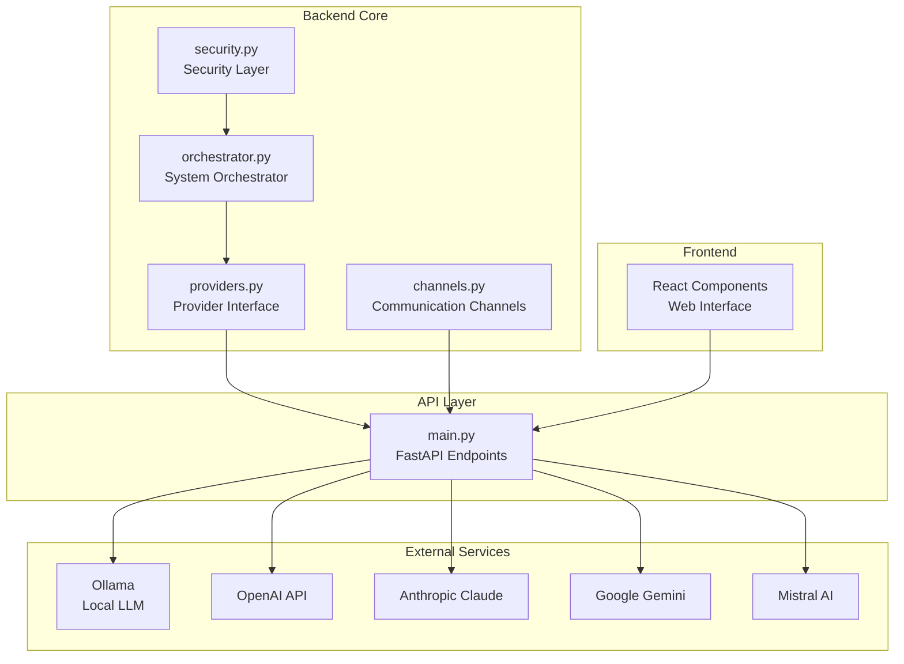
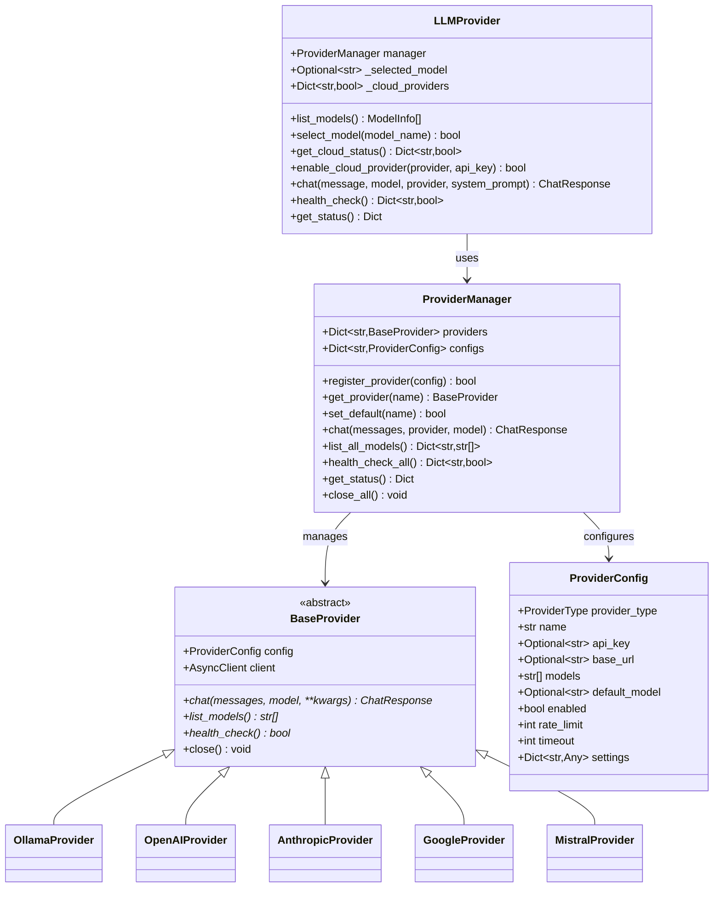
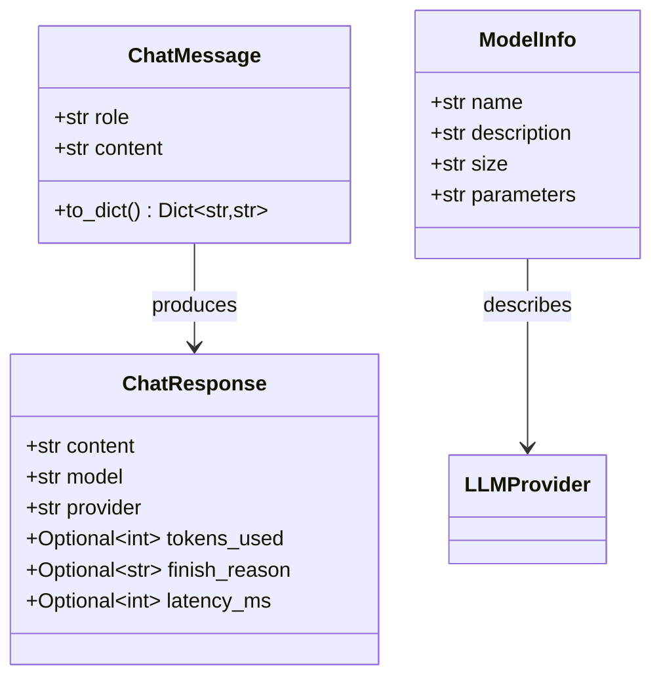
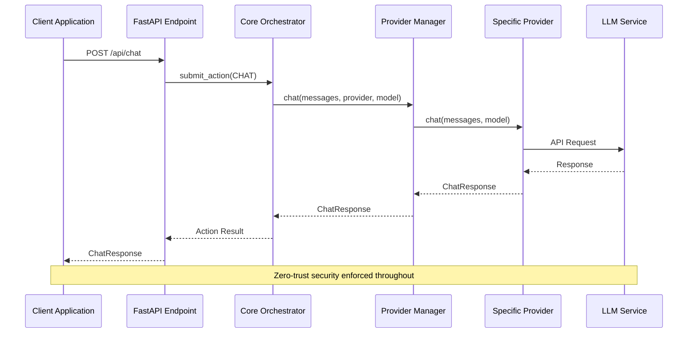
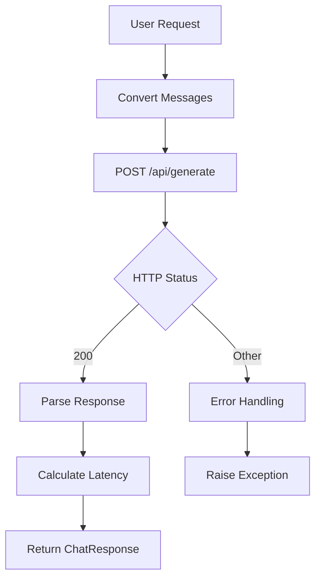
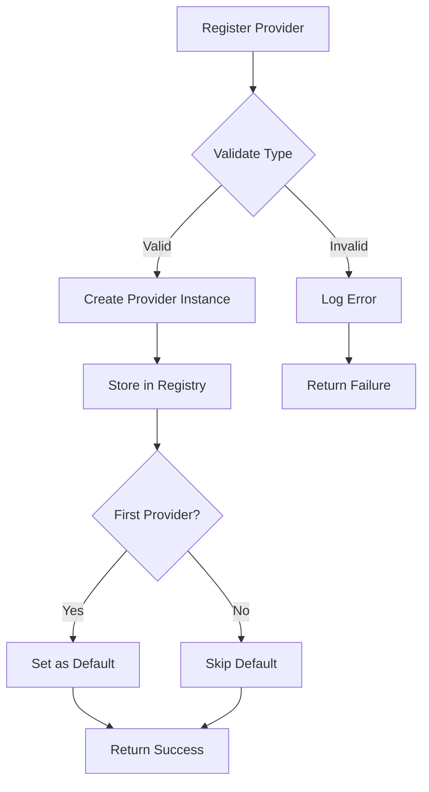
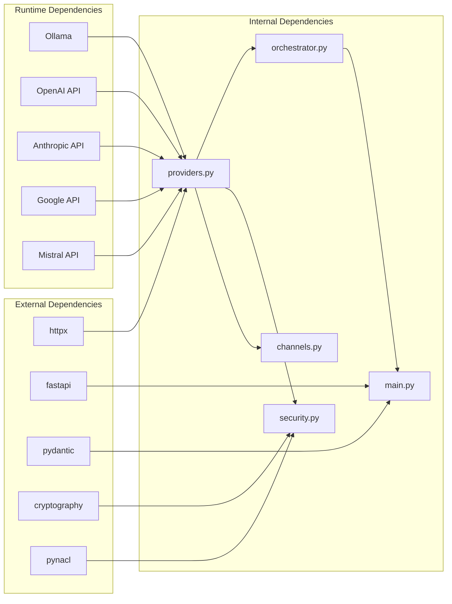

# LLM Provider Interface

<cite>
**Referenced Files in This Document**
- [providers.py](file://backend/app/core/providers.py)
- [main.py](file://backend/app/main.py)
- [README.md](file://README.md)
- [requirements.txt](file://backend/requirements.txt)
- [orchestrator.py](file://backend/app/core/orchestrator.py)
- [security.py](file://backend/app/core/security.py)
- [channels.py](file://backend/app/core/channels.py)
- [package.json](file://package.json)
</cite>

## Table of Contents
1. [Introduction](#introduction)
2. [Project Structure](#project-structure)
3. [Core Components](#core-components)
4. [Architecture Overview](#architecture-overview)
5. [Detailed Component Analysis](#detailed-component-analysis)
6. [Dependency Analysis](#dependency-analysis)
7. [Performance Considerations](#performance-considerations)
8. [Troubleshooting Guide](#troubleshooting-guide)
9. [Conclusion](#conclusion)

## Introduction

The LLM Provider Interface is a core component of the ClosedPaw AI assistant system that provides a unified abstraction layer for multiple Large Language Model (LLM) providers. This interface enables seamless integration with local and cloud-based AI services while maintaining the system's zero-trust security architecture.

ClosedPaw is designed as a privacy-focused AI assistant that runs entirely on local machines, ensuring that user data never leaves the device. The system implements hardened sandboxing using gVisor/Kata Containers for true isolation and follows a defense-in-depth security approach.

## Project Structure

The LLM Provider Interface is primarily implemented in the backend core module with supporting components throughout the application:

**Diagram sources**
- [providers.py](file://backend/app/core/providers.py#L1-L658)
- [main.py](file://backend/app/main.py#L1-L567)

**Section sources**
- [providers.py](file://backend/app/core/providers.py#L1-L658)
- [main.py](file://backend/app/main.py#L1-L567)
- [README.md](file://README.md#L1-L192)

## Core Components

The LLM Provider Interface consists of several key components that work together to provide a robust and secure multi-provider LLM solution:

### Provider Types and Configuration

The system supports five distinct LLM providers with standardized configuration:

| Provider | Type | Default Base URL | Authentication |
|----------|------|------------------|----------------|
| Ollama | Local | `http://127.0.0.1:11434` | None |
| OpenAI | Cloud | `https://api.openai.com/v1` | API Key |
| Anthropic | Cloud | `https://api.anthropic.com/v1` | API Key |
| Google | Cloud | `https://generativelanguage.googleapis.com/v1beta` | API Key |
| Mistral | Cloud | `https://api.mistral.ai/v1` | API Key |

### Provider Architecture

**Diagram sources**
- [providers.py](file://backend/app/core/providers.py#L66-L543)

### Message and Response Handling

The interface standardizes message and response formats across all providers:

**Diagram sources**
- [providers.py](file://backend/app/core/providers.py#L46-L658)

**Section sources**
- [providers.py](file://backend/app/core/providers.py#L18-L658)

## Architecture Overview

The LLM Provider Interface follows a layered architecture that ensures security, flexibility, and maintainability:

**Diagram sources**
- [main.py](file://backend/app/main.py#L131-L182)
- [orchestrator.py](file://backend/app/core/orchestrator.py#L177-L231)
- [providers.py](file://backend/app/core/providers.py#L468-L481)

The architecture implements several key security principles:

1. **Zero-Trust Design**: Every action is validated and may require human-in-the-loop approval
2. **Provider Isolation**: Each provider maintains separate configuration and authentication
3. **Rate Limiting**: Built-in rate limiting prevents abuse across all providers
4. **Health Monitoring**: Automatic health checks ensure reliable service availability

**Section sources**
- [orchestrator.py](file://backend/app/core/orchestrator.py#L95-L138)
- [providers.py](file://backend/app/core/providers.py#L416-L522)

## Detailed Component Analysis

### Provider Implementation Details

Each provider implementation follows a consistent pattern while accommodating provider-specific requirements:

#### Ollama Provider (Local LLM)

The Ollama provider serves as the default local LLM service:

**Diagram sources**
- [providers.py](file://backend/app/core/providers.py#L107-L141)

#### Cloud Provider Variations

Cloud providers implement similar patterns with authentication and model-specific formatting:

| Provider | Authentication Header | Model Parameter | Response Parsing |
|----------|----------------------|-----------------|------------------|
| OpenAI | `Authorization: Bearer` | `model` | `choices[0].message.content` |
| Anthropic | `x-api-key` | `model` | `content[0].text` |
| Google | `key` parameter | `model` | `candidates[0].content.parts[0].text` |
| Mistral | `Authorization: Bearer` | `model` | `choices[0].message.content` |

**Section sources**
- [providers.py](file://backend/app/core/providers.py#L161-L414)

### Provider Registration and Management

The ProviderManager handles dynamic provider registration and lifecycle management:

**Diagram sources**
- [providers.py](file://backend/app/core/providers.py#L427-L454)

**Section sources**
- [providers.py](file://backend/app/core/providers.py#L416-L522)

### API Integration Points

The FastAPI endpoints provide comprehensive access to the provider interface:

| Endpoint | Method | Purpose |
|----------|--------|---------|
| `/api/providers` | GET | Get all registered providers |
| `/api/providers/register` | POST | Register new provider |
| `/api/providers/{provider_name}/default` | POST | Set default provider |
| `/api/providers/health` | GET | Health check all providers |
| `/api/providers/models` | GET | List models from all providers |
| `/api/chat/multi` | POST | Chat using specific provider |

**Section sources**
- [main.py](file://backend/app/main.py#L383-L462)

## Dependency Analysis

The LLM Provider Interface has minimal external dependencies to maintain security and stability:

**Diagram sources**
- [requirements.txt](file://backend/requirements.txt#L1-L34)
- [providers.py](file://backend/app/core/providers.py#L13-L15)

### External Dependencies

The system maintains a focused dependency set:

| Package | Version | Purpose |
|---------|---------|---------|
| `httpx[http2]` | >=0.27.2 | HTTP client for provider communication |
| `fastapi` | 0.115.0 | Web framework for API endpoints |
| `pydantic` | >=2.10 | Data validation and settings management |
| `cryptography` | 43.0.3 | Encryption for secure data storage |
| `pynacl` | 1.5.0 | NaCl cryptography primitives |

**Section sources**
- [requirements.txt](file://backend/requirements.txt#L1-L34)

## Performance Considerations

The LLM Provider Interface is designed with performance and scalability in mind:

### Connection Management
- Asynchronous HTTP clients prevent blocking operations
- Connection pooling reduces overhead for multiple requests
- Graceful degradation when providers are unavailable

### Caching and Optimization
- Provider health checks cached for configurable periods
- Model listings cached to reduce API calls
- Response serialization optimized for minimal overhead

### Resource Management
- Automatic cleanup of provider connections
- Configurable timeouts prevent resource leaks
- Memory-efficient message handling

## Troubleshooting Guide

Common issues and their resolutions:

### Provider Connection Issues

**Symptoms**: Provider registration fails or health checks return false
**Causes**: 
- Incorrect API keys or base URLs
- Network connectivity problems
- Provider service outages

**Resolutions**:
1. Verify API credentials and base URLs
2. Check network connectivity to provider endpoints
3. Monitor provider service status pages
4. Review application logs for detailed error messages

### Model Availability Problems

**Symptoms**: Requested models not found or unavailable
**Solutions**:
1. Use `/api/providers/{provider_name}/models` endpoint to list available models
2. Verify model names match provider specifications
3. Check provider account for model access permissions

### Performance Issues

**Symptoms**: Slow response times or timeouts
**Actions**:
1. Adjust timeout configurations in provider settings
2. Implement rate limiting to prevent provider throttling
3. Consider model selection based on performance characteristics
4. Monitor system resources during peak usage

**Section sources**
- [providers.py](file://backend/app/core/providers.py#L518-L522)
- [main.py](file://backend/app/main.py#L448-L453)

## Conclusion

The LLM Provider Interface represents a sophisticated approach to multi-provider LLM integration that balances flexibility, security, and performance. By implementing a standardized abstraction layer, the system achieves:

1. **Unified Access**: Consistent API across diverse LLM providers
2. **Enhanced Security**: Zero-trust architecture with comprehensive validation
3. **Scalable Architecture**: Modular design supporting future provider additions
4. **Developer Experience**: Clean interfaces with comprehensive error handling

The interface successfully integrates with ClosedPaw's broader security ecosystem, maintaining the system's commitment to privacy and local-first operation while providing the flexibility needed for modern AI assistant applications.