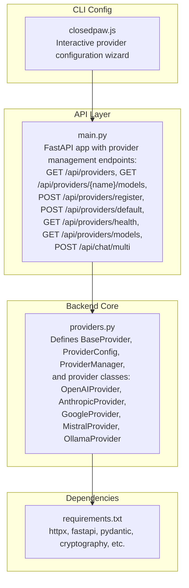
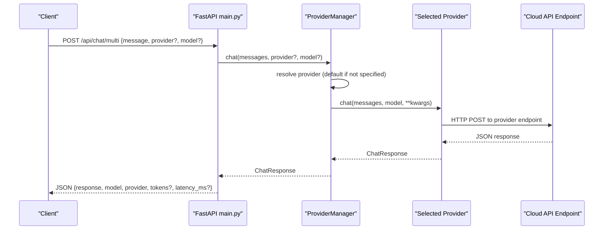
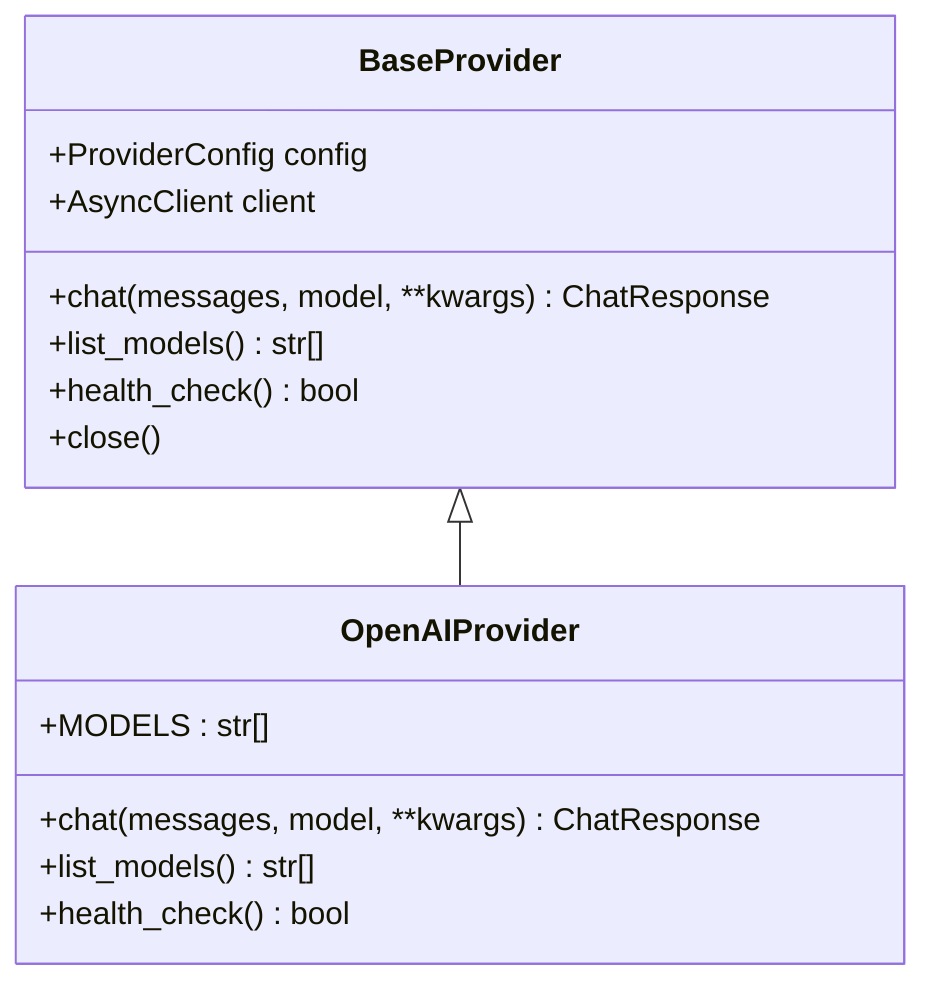
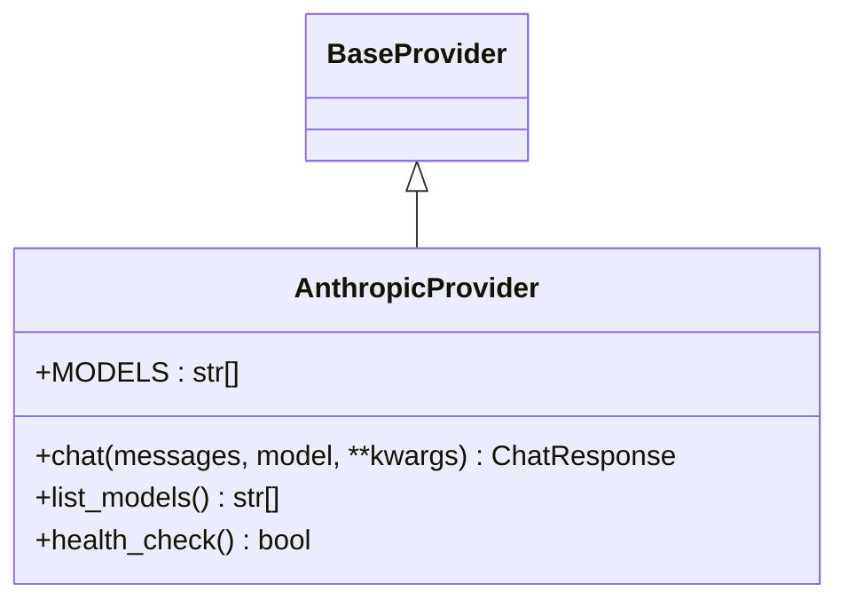
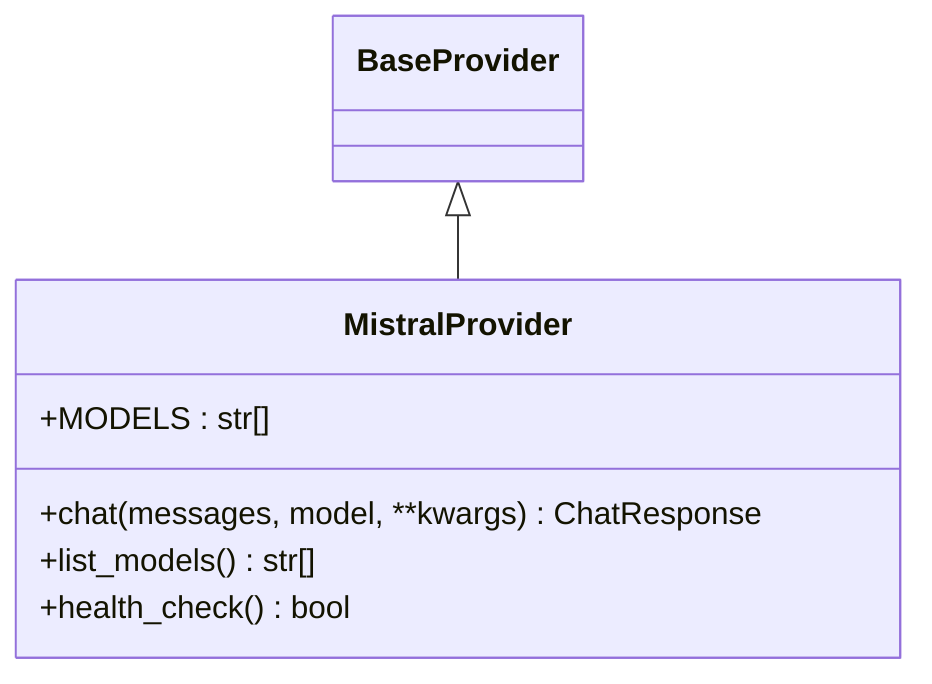
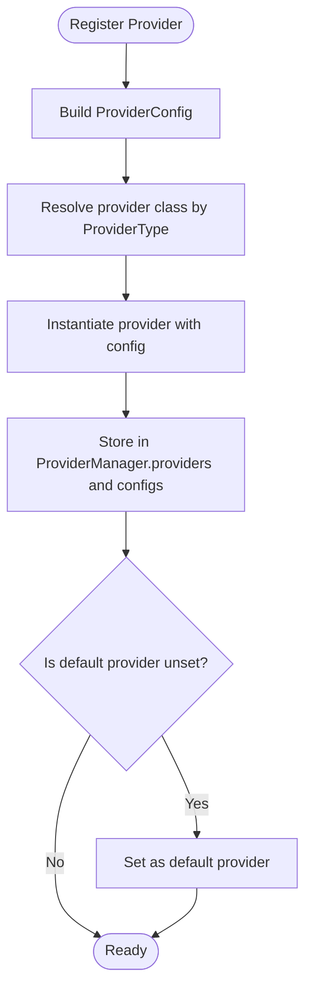
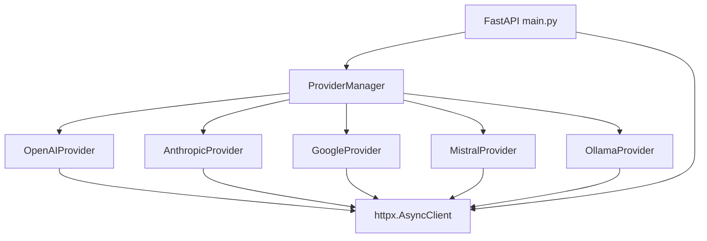

# Cloud Provider Implementations

<cite>
**Referenced Files in This Document**
- [providers.py](file://backend/app/core/providers.py)
- [main.py](file://backend/app/main.py)
- [requirements.txt](file://backend/requirements.txt)
- [README.md](file://README.md)
- [closedpaw.js](file://bin/closedpaw.js)
</cite>

## Table of Contents
1. [Introduction](#introduction)
2. [Project Structure](#project-structure)
3. [Core Components](#core-components)
4. [Architecture Overview](#architecture-overview)
5. [Detailed Component Analysis](#detailed-component-analysis)
6. [Dependency Analysis](#dependency-analysis)
7. [Performance Considerations](#performance-considerations)
8. [Troubleshooting Guide](#troubleshooting-guide)
9. [Conclusion](#conclusion)
10. [Appendices](#appendices)

## Introduction
This document provides comprehensive documentation for the cloud provider implementations in the project, focusing on OpenAI, Anthropic, Google, and Mistral API integrations. It explains provider classes, authentication, model lists, request/response formats, message formatting specifics, error handling, API key management, base URL configuration, health checks, and practical integration patterns. It also covers rate limiting, token usage tracking, and cost optimization strategies for each provider, along with provider-specific limitations and best practices.

## Project Structure
The cloud provider logic resides in the backend core module and is exposed via FastAPI endpoints. The primary implementation file defines provider abstractions and concrete provider classes, while the main application integrates these providers into the API surface.

**Diagram sources**
- [providers.py](file://backend/app/core/providers.py#L1-L545)
- [main.py](file://backend/app/main.py#L381-L555)
- [requirements.txt](file://backend/requirements.txt#L1-L36)
- [closedpaw.js](file://bin/closedpaw.js#L537-L601)

**Section sources**
- [providers.py](file://backend/app/core/providers.py#L1-L545)
- [main.py](file://backend/app/main.py#L381-L555)
- [requirements.txt](file://backend/requirements.txt#L1-L36)
- [README.md](file://README.md#L1-L192)
- [closedpaw.js](file://bin/closedpaw.js#L537-L601)

## Core Components
- ProviderType: Enumerates supported providers (ollama, openai, anthropic, google, mistral, custom).
- ProviderConfig: Holds provider configuration including provider_type, name, api_key, base_url, models, default_model, enabled flag, rate_limit, timeout, and settings.
- ChatMessage: Standardized message structure with role and content, with a conversion helper to dictionary.
- ChatResponse: Unified response structure containing content, model, provider, tokens_used, finish_reason, and latency_ms.
- BaseProvider: Abstract base class defining the contract for chat, list_models, and health_check, plus shared HTTP client and lifecycle management.
- ProviderManager: Central registry and orchestrator for providers, enabling registration, selection, default setting, multi-provider chat, model listing, and health checks.

Key behaviors:
- All providers inherit from BaseProvider and use an asynchronous HTTP client for API calls.
- Each provider enforces API key presence for cloud providers (OpenAI, Anthropic, Google, Mistral) and validates configuration during health checks.
- ProviderManager manages provider instances and exposes a unified interface for multi-provider operations.

**Section sources**
- [providers.py](file://backend/app/core/providers.py#L20-L100)
- [providers.py](file://backend/app/core/providers.py#L418-L524)

## Architecture Overview
The system implements a multi-provider gateway pattern. The ProviderManager registers provider instances and routes chat requests to the selected provider. The FastAPI app exposes endpoints to manage providers and perform multi-provider chat.

**Diagram sources**
- [main.py](file://backend/app/main.py#L533-L555)
- [providers.py](file://backend/app/core/providers.py#L470-L483)
- [providers.py](file://backend/app/core/providers.py#L175-L215)

**Section sources**
- [main.py](file://backend/app/main.py#L533-L555)
- [providers.py](file://backend/app/core/providers.py#L418-L524)

## Detailed Component Analysis

### OpenAIProvider
- Purpose: Integrates with OpenAI’s chat completions API.
- Authentication: Uses Authorization header with Bearer token derived from api_key.
- Base URL: Defaults to the official OpenAI API base URL.
- Message Formatting: Converts ChatMessage list to the OpenAI messages array format.
- Request Parameters: Includes model, messages, and passes through additional kwargs.
- Response Parsing: Extracts content from the first choice, tokens_used from usage, finish_reason, and latency_ms.
- Health Check: Requires api_key presence.
- Model List: Predefined list of supported models.

**Diagram sources**
- [providers.py](file://backend/app/core/providers.py#L68-L100)
- [providers.py](file://backend/app/core/providers.py#L163-L222)

**Section sources**
- [providers.py](file://backend/app/core/providers.py#L163-L222)

Practical configuration and usage:
- API key management: Provide api_key via ProviderConfig or environment variables.
- Base URL: Override base_url if using a compatible endpoint or proxy.
- Model selection: Choose from predefined MODELS or pass a model parameter.
- Example integration pattern: Use POST /api/chat/multi with provider=openai and model=<selected>.

Rate limiting and cost optimization:
- Respect provider rate limits; consider exponential backoff and retries.
- Monitor tokens_used to estimate costs; prefer smaller models for cost-sensitive tasks.
- Use streaming APIs when available to reduce latency and improve UX.

Limitations and best practices:
- Ensure api_key is configured; otherwise health_check fails.
- Prefer models aligned with task complexity; use gpt-4o-mini for lightweight tasks.

### AnthropicProvider
- Purpose: Integrates with Anthropic’s Messages API.
- Authentication: Uses x-api-key header and sets anthropic-version.
- Base URL: Defaults to the official Anthropic API base URL.
- Message Formatting: Separates system prompt from chat messages; sends system via dedicated field and messages as an array.
- Request Parameters: Includes model, max_tokens (defaults to 4096 if not provided), system, and messages.
- Response Parsing: Extracts content from the first candidate, total tokens from usage, finish_reason, and latency_ms.
- Health Check: Requires api_key presence.
- Model List: Predefined list of supported Claude models.

**Diagram sources**
- [providers.py](file://backend/app/core/providers.py#L68-L100)
- [providers.py](file://backend/app/core/providers.py#L224-L294)

**Section sources**
- [providers.py](file://backend/app/core/providers.py#L224-L294)

Practical configuration and usage:
- API key management: Provide api_key via ProviderConfig.
- Base URL: Override base_url for enterprise or proxy setups.
- Model selection: Choose from MODELS; Claude 3.5 Sonnet is default if unspecified.
- Example integration pattern: Use POST /api/chat/multi with provider=anthropic and model=<selected>.

Rate limiting and cost optimization:
- Anthropic rate limits apply; implement retry/backoff logic.
- Monitor tokens_used for accurate cost tracking.
- Use concise system prompts to reduce input tokens.

Limitations and best practices:
- Ensure api_key is configured; otherwise health_check fails.
- Use system field for instructions; keep messages array clean.

### GoogleProvider
- Purpose: Integrates with Google Gemini’s generateContent endpoint.
- Authentication: Uses API key via query parameter key.
- Base URL: Defaults to the official Google Generative Language API base URL.
- Message Formatting: Converts roles to Gemini conventions (user/system to user, others to model) and wraps content in parts arrays.
- Request Parameters: Includes model and contents array.
- Response Parsing: Extracts text from the first candidate’s content parts, latency_ms.
- Health Check: Requires api_key presence.
- Model List: Predefined list of supported Gemini models.

**Diagram sources**
- [providers.py](file://backend/app/core/providers.py#L68-L100)
- [providers.py](file://backend/app/core/providers.py#L296-L354)

**Section sources**
- [providers.py](file://backend/app/core/providers.py#L296-L354)

Practical configuration and usage:
- API key management: Provide api_key via ProviderConfig.
- Base URL: Override base_url for regional endpoints or proxies.
- Model selection: Choose from MODELS; gemini-1.5-flash is default if unspecified.
- Example integration pattern: Use POST /api/chat/multi with provider=google and model=<selected>.

Rate limiting and cost optimization:
- Respect Google’s quotas and rate limits.
- Monitor latency_ms and tokens_used for cost estimation.
- Use shorter prompts and structured content to reduce token usage.

Limitations and best practices:
- Ensure api_key is configured; otherwise health_check fails.
- Gemini requires parts arrays; ensure content is properly formatted.

### MistralProvider
- Purpose: Integrates with Mistral’s chat completions API.
- Authentication: Uses Authorization header with Bearer token derived from api_key.
- Base URL: Defaults to the official Mistral API base URL.
- Message Formatting: Converts ChatMessage list to the Mistral messages array format.
- Request Parameters: Includes model, messages, and passes through additional kwargs.
- Response Parsing: Extracts content from the first choice, tokens_used from usage, finish_reason, and latency_ms.
- Health Check: Requires api_key presence.
- Model List: Predefined list of supported Mistral models.

**Diagram sources**
- [providers.py](file://backend/app/core/providers.py#L68-L100)
- [providers.py](file://backend/app/core/providers.py#L356-L416)

**Section sources**
- [providers.py](file://backend/app/core/providers.py#L356-L416)

Practical configuration and usage:
- API key management: Provide api_key via ProviderConfig.
- Base URL: Override base_url for enterprise or proxy setups.
- Model selection: Choose from MODELS; mistral-small-latest is default if unspecified.
- Example integration pattern: Use POST /api/chat/multi with provider=mistral and model=<selected>.

Rate limiting and cost optimization:
- Apply retry/backoff logic respecting provider limits.
- Monitor tokens_used to estimate costs; prefer smaller models for budget-conscious tasks.
- Use concise prompts and structured instructions.

Limitations and best practices:
- Ensure api_key is configured; otherwise health_check fails.
- Align model selection with workload characteristics.

### ProviderManager and Provider Registration
- Registration: Accepts ProviderConfig and instantiates the appropriate provider class based on ProviderType.
- Selection: Provides get_provider and set_default to select a default provider.
- Multi-provider chat: Delegates chat requests to the selected provider.
- Health checks: Aggregates health status across all providers.
- Status reporting: Returns provider metadata including type, enabled flag, default_model, and base_url.

**Diagram sources**
- [providers.py](file://backend/app/core/providers.py#L429-L456)

**Section sources**
- [providers.py](file://backend/app/core/providers.py#L418-L524)

## Dependency Analysis
- httpx: Used for asynchronous HTTP requests across all providers.
- fastapi/pydantic: Define API endpoints and request/response models in main.py.
- cryptography/pynacl: Security-related dependencies for the broader system (not directly used by providers).

**Diagram sources**
- [providers.py](file://backend/app/core/providers.py#L418-L524)
- [main.py](file://backend/app/main.py#L381-L555)
- [requirements.txt](file://backend/requirements.txt#L13-L15)

**Section sources**
- [requirements.txt](file://backend/requirements.txt#L13-L15)
- [providers.py](file://backend/app/core/providers.py#L71-L75)
- [main.py](file://backend/app/main.py#L381-L555)

## Performance Considerations
- Asynchronous HTTP: All providers use httpx.AsyncClient for non-blocking I/O.
- Latency tracking: Each provider computes latency_ms from request start to response parsing.
- Token usage: Providers extract tokens_used from response usage fields when available.
- Rate limiting: ProviderConfig includes rate_limit and timeout fields; implement provider-specific throttling and backoff strategies.
- Cost optimization: Prefer smaller models for cost-sensitive tasks; monitor tokens_used; minimize prompt length and complexity.

[No sources needed since this section provides general guidance]

## Troubleshooting Guide
Common issues and resolutions:
- Missing API key: Providers for OpenAI, Anthropic, Google, and Mistral require api_key; health_check returns false if missing. Ensure ProviderConfig.api_key is set.
- Incorrect provider type: When registering providers, invalid provider_type values cause registration failures. Validate provider_type against ProviderType.
- Base URL misconfiguration: If base_url is incorrect, requests will fail. Verify provider base_url and network connectivity.
- Model not supported: Ensure the chosen model is in the provider’s MODELS list or supported by the endpoint.
- Health check failures: Use GET /api/providers/health to diagnose provider availability and API key validity.

Operational endpoints:
- GET /api/providers: Retrieve provider status and configuration.
- GET /api/providers/{name}/models: List models for a specific provider.
- POST /api/providers/register: Register a new provider with api_key, base_url, and default_model.
- POST /api/providers/{name}/default: Set default provider.
- GET /api/providers/health: Health status for all providers.
- GET /api/providers/models: List models from all providers.
- POST /api/chat/multi: Perform multi-provider chat with latency_ms and tokens_used in response.

**Section sources**
- [providers.py](file://backend/app/core/providers.py#L440-L456)
- [providers.py](file://backend/app/core/providers.py#L448-L503)
- [main.py](file://backend/app/main.py#L383-L461)
- [main.py](file://backend/app/main.py#L533-L555)

## Conclusion
The cloud provider implementations provide a robust, extensible foundation for integrating OpenAI, Anthropic, Google, and Mistral APIs. They enforce consistent authentication, standardized request/response formats, and health checks, while offering flexible configuration and multi-provider orchestration. By leveraging ProviderManager and the exposed FastAPI endpoints, applications can integrate cloud LLMs securely and efficiently, with clear mechanisms for configuration, monitoring, and troubleshooting.

[No sources needed since this section summarizes without analyzing specific files]

## Appendices

### Provider-Specific Configuration and Integration Patterns
- OpenAI
  - Endpoint: chat/completions
  - Headers: Authorization: Bearer <api_key>, Content-Type: application/json
  - Message format: Array of messages with role/content
  - Health: api_key present
  - Example: POST /api/chat/multi with provider=openai and model=gpt-4o-mini

- Anthropic
  - Endpoint: messages
  - Headers: x-api-key: <api_key>, anthropic-version: 2023-06-01, Content-Type: application/json
  - Message format: Separate system prompt and messages array
  - Health: api_key present
  - Example: POST /api/chat/multi with provider=anthropic and model=claude-3-5-sonnet-20241022

- Google
  - Endpoint: models/{model}:generateContent
  - Query param: key=<api_key>
  - Message format: contents array with role and parts
  - Health: api_key present
  - Example: POST /api/chat/multi with provider=google and model=gemini-1.5-flash

- Mistral
  - Endpoint: chat/completions
  - Headers: Authorization: Bearer <api_key>, Content-Type: application/json
  - Message format: Array of messages with role/content
  - Health: api_key present
  - Example: POST /api/chat/multi with provider=mistral and model=mistral-small-latest

**Section sources**
- [providers.py](file://backend/app/core/providers.py#L175-L215)
- [providers.py](file://backend/app/core/providers.py#L237-L287)
- [providers.py](file://backend/app/core/providers.py#L305-L347)
- [providers.py](file://backend/app/core/providers.py#L369-L409)
- [main.py](file://backend/app/main.py#L533-L555)

### CLI Configuration Workflow
The interactive configuration wizard supports setting up providers, including API keys and default models for OpenAI, Anthropic, Google, and Mistral, as well as Ollama host configuration.

**Section sources**
- [closedpaw.js](file://bin/closedpaw.js#L537-L601)