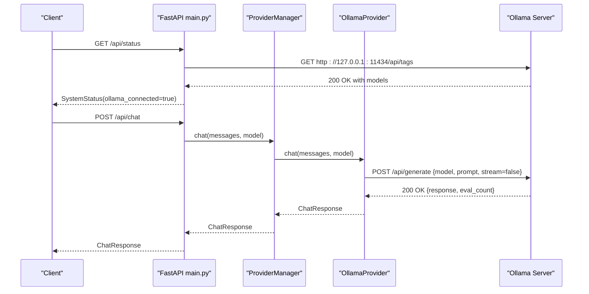
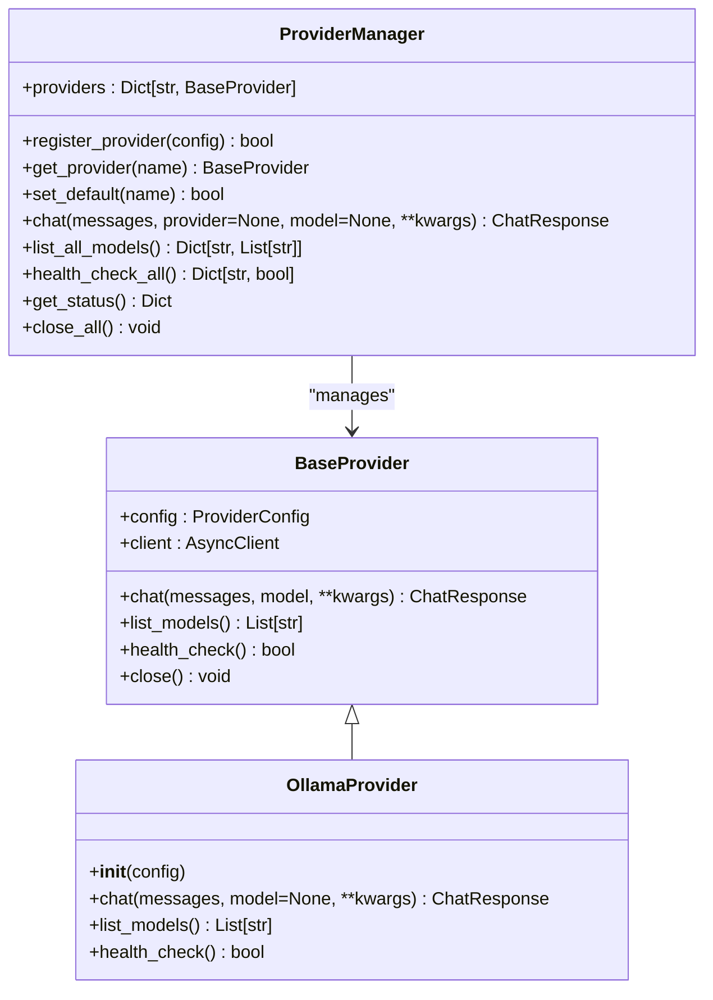
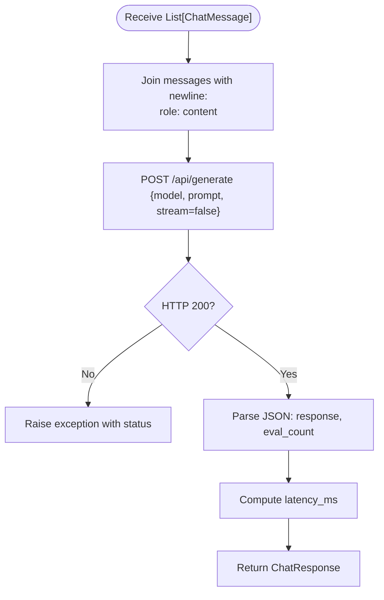
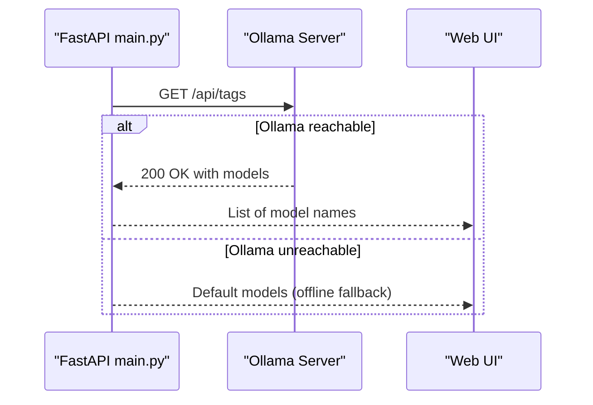
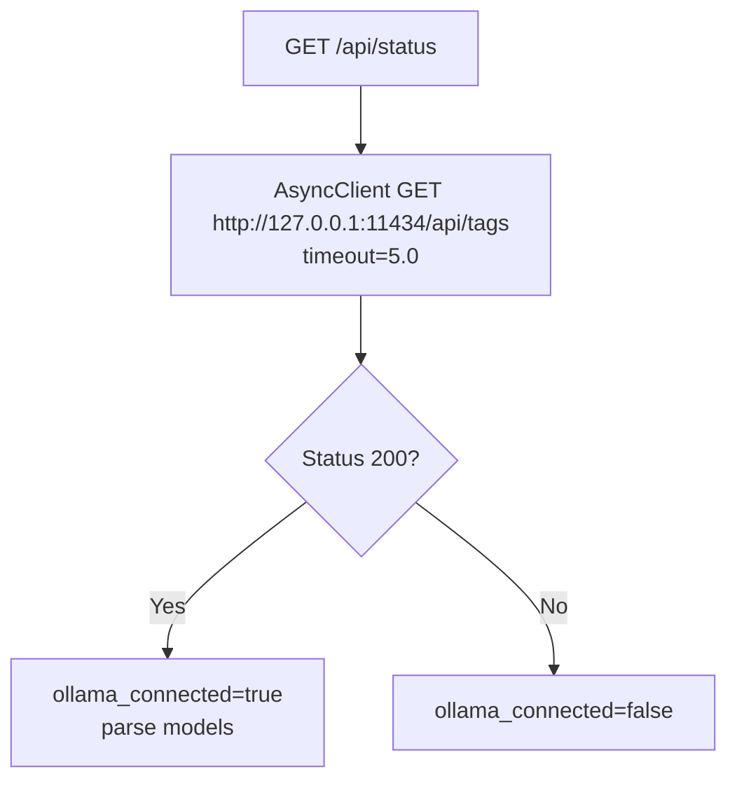
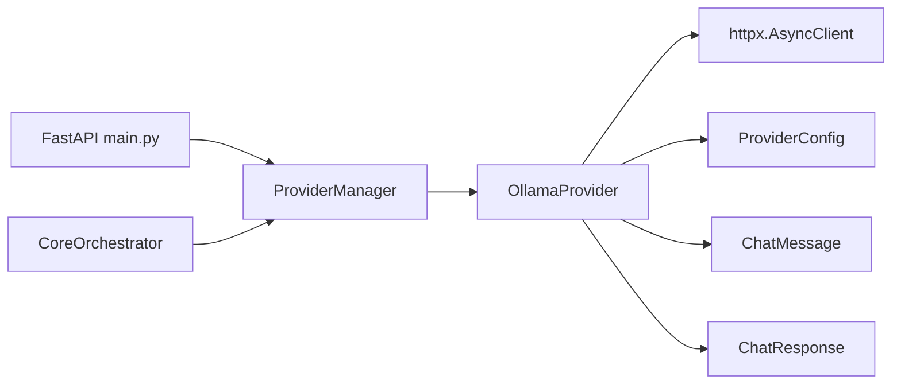

# Local Provider Implementation

<cite>
**Referenced Files in This Document**
- [providers.py](file://backend/app/core/providers.py)
- [main.py](file://backend/app/main.py)
- [orchestrator.py](file://backend/app/core/orchestrator.py)
- [security.py](file://backend/app/core/security.py)
- [requirements.txt](file://backend/requirements.txt)
- [install.sh](file://installer/install.sh)
- [README.md](file://README.md)
</cite>

## Table of Contents
1. [Introduction](#introduction)
2. [Project Structure](#project-structure)
3. [Core Components](#core-components)
4. [Architecture Overview](#architecture-overview)
5. [Detailed Component Analysis](#detailed-component-analysis)
6. [Dependency Analysis](#dependency-analysis)
7. [Performance Considerations](#performance-considerations)
8. [Troubleshooting Guide](#troubleshooting-guide)
9. [Conclusion](#conclusion)
10. [Appendices](#appendices)

## Introduction
This document explains the Ollama local provider implementation that powers zero-trust, offline-first local LLM execution in the system. It covers the OllamaProvider class architecture, integration with the local Ollama API, offline operation capabilities, default base URL configuration, model discovery via the /api/tags endpoint, local model management, message formatting conversion, request/response handling, error management, health checks, timeouts, offline fallback strategies, local resource requirements, and troubleshooting common connectivity issues.

## Project Structure
The local provider resides in the backend core module and integrates with the FastAPI application and orchestrator. The provider supports a multi-provider architecture and includes a dedicated OllamaProvider for local execution.

```mermaid
graph TB
subgraph "Backend Core"
Providers["providers.py<br/>OllamaProvider, BaseProvider, ProviderManager"]
Orchestrator["orchestrator.py<br/>CoreOrchestrator"]
Security["security.py<br/>PromptInjectionDefender"]
end
subgraph "FastAPI Application"
Main["main.py<br/>Endpoints, Health Checks, Model Discovery"]
end
subgraph "Installer"
Installer["install.sh<br/>Ollama Setup, Security Config"]
end
Main --> Providers
Main --> Orchestrator
Orchestrator --> Providers
Main --> Security
Installer --> Main
```

**Diagram sources**
- [providers.py](file://backend/app/core/providers.py#L102-L161)
- [main.py](file://backend/app/main.py#L101-L206)
- [orchestrator.py](file://backend/app/core/orchestrator.py#L131-L145)
- [security.py](file://backend/app/core/security.py#L35-L200)
- [install.sh](file://installer/install.sh#L407-L453)

**Section sources**
- [providers.py](file://backend/app/core/providers.py#L102-L161)
- [main.py](file://backend/app/main.py#L101-L206)
- [orchestrator.py](file://backend/app/core/orchestrator.py#L131-L145)
- [security.py](file://backend/app/core/security.py#L35-L200)
- [install.sh](file://installer/install.sh#L407-L453)

## Core Components
- OllamaProvider: Implements local LLM execution against Ollama’s /api/generate endpoint, converts generic ChatMessage format to Ollama prompt format, and handles health checks and model discovery.
- ProviderManager: Registers and manages providers, including default Ollama provider configuration.
- FastAPI endpoints: Provide system status, model listing, and multi-provider chat with health checks and offline fallbacks.
- Orchestrator: Initializes local LLM gateway and performs health checks against Ollama.

Key responsibilities:
- Default base URL: http://127.0.0.1:11434
- Model discovery: GET /api/tags
- Request format: POST /api/generate with model, prompt, stream disabled
- Response parsing: response content, eval_count, latency calculation
- Health check: GET /api/tags with short timeout
- Offline fallback: default models when Ollama is unreachable

**Section sources**
- [providers.py](file://backend/app/core/providers.py#L102-L161)
- [providers.py](file://backend/app/core/providers.py#L418-L524)
- [main.py](file://backend/app/main.py#L101-L206)
- [orchestrator.py](file://backend/app/core/orchestrator.py#L131-L145)

## Architecture Overview
The Ollama local provider is part of a multi-provider architecture. The FastAPI application exposes endpoints that delegate to the ProviderManager, which selects the OllamaProvider for local execution. The orchestrator ensures the local LLM gateway is reachable during initialization.



**Diagram sources**
- [main.py](file://backend/app/main.py#L101-L182)
- [providers.py](file://backend/app/core/providers.py#L109-L143)
- [providers.py](file://backend/app/core/providers.py#L155-L160)

**Section sources**
- [main.py](file://backend/app/main.py#L101-L182)
- [providers.py](file://backend/app/core/providers.py#L109-L143)
- [providers.py](file://backend/app/core/providers.py#L155-L160)

## Detailed Component Analysis

### OllamaProvider Class
The OllamaProvider extends BaseProvider and implements:
- Initialization with default base URL http://127.0.0.1:11434
- chat(): Converts ChatMessage list to a newline-delimited prompt and posts to /api/generate
- list_models(): Retrieves models via /api/tags
- health_check(): Validates connectivity to /api/tags with a short timeout



**Diagram sources**
- [providers.py](file://backend/app/core/providers.py#L68-L99)
- [providers.py](file://backend/app/core/providers.py#L102-L161)
- [providers.py](file://backend/app/core/providers.py#L418-L524)

Implementation highlights:
- Message conversion: Joins roles and content into a single prompt string
- Request payload: model, prompt, stream disabled
- Response mapping: response content, eval_count, latency_ms
- Health check: short timeout to prevent blocking

**Section sources**
- [providers.py](file://backend/app/core/providers.py#L102-L161)

### Message Formatting and Conversion
The OllamaProvider converts generic ChatMessage instances to Ollama’s expected prompt format by concatenating role and content with newlines. This preserves conversational context for the local LLM.



**Diagram sources**
- [providers.py](file://backend/app/core/providers.py#L118-L143)

**Section sources**
- [providers.py](file://backend/app/core/providers.py#L118-L143)

### Model Discovery and Local Management
- Model discovery: GET /api/tags returns a list of installed models; the provider extracts model names
- Local model management: The installer secures Ollama to listen on 127.0.0.1:11434 and offers model downloads
- Fallback behavior: When Ollama is unreachable, the API returns default models



**Diagram sources**
- [main.py](file://backend/app/main.py#L184-L210)
- [install.sh](file://installer/install.sh#L407-L453)

**Section sources**
- [main.py](file://backend/app/main.py#L184-L210)
- [install.sh](file://installer/install.sh#L407-L453)

### Health Check Mechanism
- Endpoint-level health: GET /api/status queries /api/tags with a short timeout
- Provider-level health: OllamaProvider.health_check() validates connectivity
- Orchestrator-level health: During initialization, the orchestrator checks Ollama availability



**Diagram sources**
- [main.py](file://backend/app/main.py#L101-L128)
- [providers.py](file://backend/app/core/providers.py#L155-L160)
- [orchestrator.py](file://backend/app/core/orchestrator.py#L131-L145)

**Section sources**
- [main.py](file://backend/app/main.py#L101-L128)
- [providers.py](file://backend/app/core/providers.py#L155-L160)
- [orchestrator.py](file://backend/app/core/orchestrator.py#L131-L145)

### Request/Response Handling and Error Management
- Request: POST /api/generate with model, prompt, stream disabled
- Response: JSON with response text and eval_count; latency computed from start time
- Error handling: Non-200 responses raise exceptions; provider-level errors are surfaced to callers
- Offline fallback: When Ollama is down, API endpoints return default models and status

**Section sources**
- [providers.py](file://backend/app/core/providers.py#L109-L143)
- [main.py](file://backend/app/main.py#L184-L210)

## Dependency Analysis
The OllamaProvider depends on:
- httpx.AsyncClient for asynchronous HTTP operations
- ProviderConfig for base URL, timeout, and model defaults
- ChatMessage and ChatResponse for standardized messaging



**Diagram sources**
- [providers.py](file://backend/app/core/providers.py#L68-L99)
- [providers.py](file://backend/app/core/providers.py#L102-L161)
- [providers.py](file://backend/app/core/providers.py#L418-L524)
- [main.py](file://backend/app/main.py#L131-L182)
- [orchestrator.py](file://backend/app/core/orchestrator.py#L131-L145)

**Section sources**
- [providers.py](file://backend/app/core/providers.py#L68-L99)
- [providers.py](file://backend/app/core/providers.py#L418-L524)
- [main.py](file://backend/app/main.py#L131-L182)
- [orchestrator.py](file://backend/app/core/orchestrator.py#L131-L145)

## Performance Considerations
- Timeout configuration: ProviderConfig.timeout controls HTTP client timeout; health checks use a shorter timeout to prevent blocking
- Streaming disabled: The provider sends stream=false to simplify response handling and reduce overhead
- Latency measurement: The provider computes latency_ms from request start time to response parsing
- Offline fallback: When Ollama is unreachable, the API returns default models to keep the UI responsive

Practical tips:
- Adjust ProviderConfig.timeout for network conditions
- Prefer smaller models for constrained environments
- Monitor eval_count to estimate compute usage

**Section sources**
- [providers.py](file://backend/app/core/providers.py#L30-L44)
- [providers.py](file://backend/app/core/providers.py#L109-L143)
- [main.py](file://backend/app/main.py#L184-L210)

## Troubleshooting Guide
Common issues and resolutions:
- Ollama not running or bound to 127.0.0.1:11434
  - Verify Ollama service configuration and restart if needed
  - Installer secures Ollama to listen on 127.0.0.1:11434
- Model not found
  - Pull the model using ollama pull <model-name>
  - Confirm model appears in /api/tags
- Connectivity timeouts
  - Increase ProviderConfig.timeout or adjust system network settings
  - Check firewall and localhost routing
- Offline fallback behavior
  - When Ollama is unreachable, the API returns default models; install models locally to restore full functionality

Operational checks:
- Health endpoint: GET /api/status should show ollama_connected=true
- Model endpoint: GET /api/models should list installed models
- Multi-provider chat: POST /api/chat/multi should succeed with local provider

**Section sources**
- [install.sh](file://installer/install.sh#L407-L453)
- [main.py](file://backend/app/main.py#L101-L210)
- [providers.py](file://backend/app/core/providers.py#L145-L160)

## Conclusion
The Ollama local provider enables secure, zero-trust, offline-first LLM execution by integrating tightly with the local Ollama server. It provides robust model discovery, health checks, and offline fallbacks, while maintaining a clean abstraction over the local API. The FastAPI application and orchestrator complement the provider to deliver a resilient, secure system.

## Appendices

### Practical Setup and Verification
- Install Ollama and secure it to 127.0.0.1:11434 using the installer
- Pull a model (e.g., llama3.2:3b) and verify it appears in /api/tags
- Start the backend and confirm /api/status shows ollama_connected=true
- Test multi-provider chat via /api/chat/multi

**Section sources**
- [install.sh](file://installer/install.sh#L407-L453)
- [main.py](file://backend/app/main.py#L101-L182)
- [README.md](file://README.md#L165-L171)