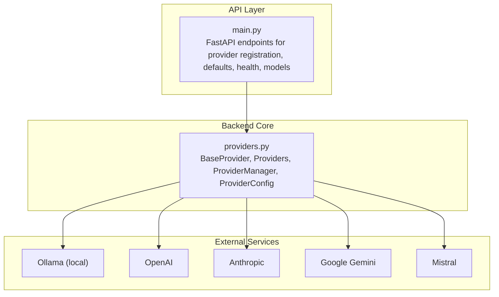
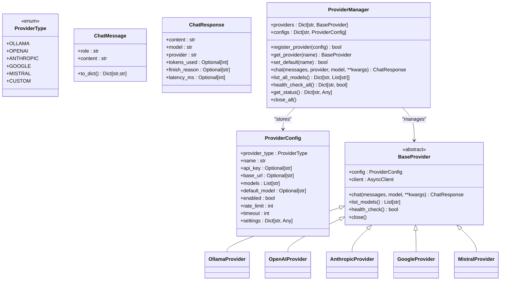
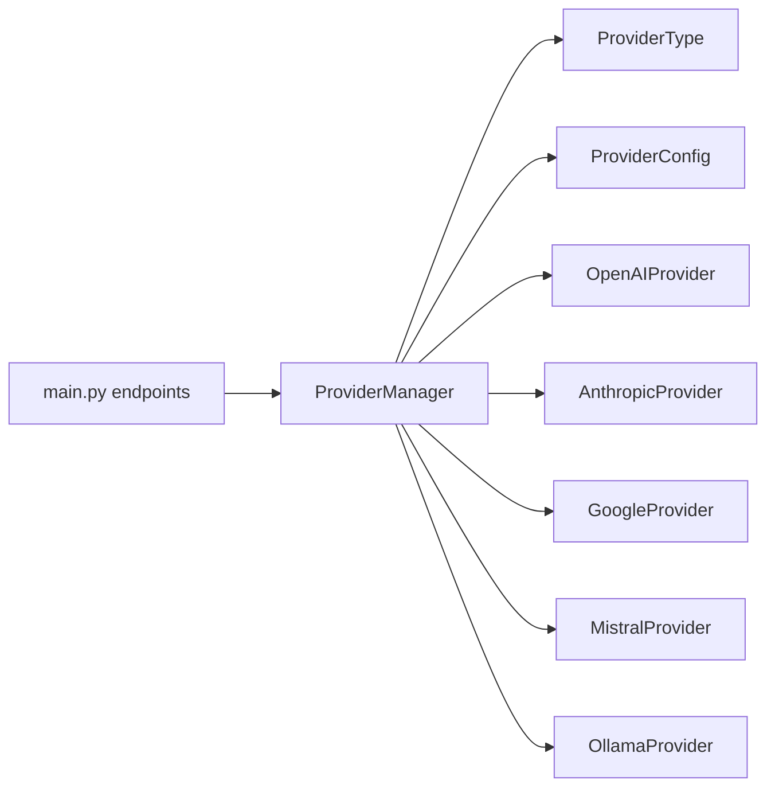
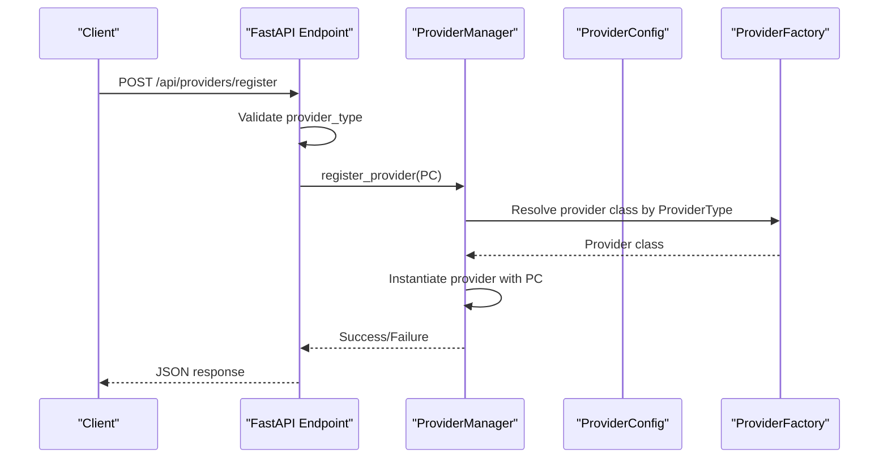

# Provider Architecture

<cite>
**Referenced Files in This Document**
- [providers.py](file://backend/app/core/providers.py)
- [main.py](file://backend/app/main.py)
- [README.md](file://README.md)
</cite>

## Table of Contents
1. [Introduction](#introduction)
2. [Project Structure](#project-structure)
3. [Core Components](#core-components)
4. [Architecture Overview](#architecture-overview)
5. [Detailed Component Analysis](#detailed-component-analysis)
6. [Dependency Analysis](#dependency-analysis)
7. [Performance Considerations](#performance-considerations)
8. [Troubleshooting Guide](#troubleshooting-guide)
9. [Conclusion](#conclusion)
10. [Appendices](#appendices)

## Introduction
This document explains the Provider Architecture for the ClosedPaw multi-provider LLM gateway. It focuses on the abstract provider design pattern, the unified interface across providers, the provider type enumeration, configuration data structures, provider registration and singleton management, and the factory mapping system. It also covers practical instantiation and configuration validation patterns, and outlines the extensibility framework for adding custom providers and future plugin-style integrations.

## Project Structure
The provider architecture is centered in the backend core module and exposed via FastAPI endpoints. The key files are:
- Provider definitions and manager: backend/app/core/providers.py
- API endpoints for provider management: backend/app/main.py
- Project overview and architecture: README.md

**Diagram sources**
- [providers.py](file://backend/app/core/providers.py#L68-L100)
- [main.py](file://backend/app/main.py#L403-L461)

**Section sources**
- [providers.py](file://backend/app/core/providers.py#L1-L545)
- [main.py](file://backend/app/main.py#L1-L567)
- [README.md](file://README.md#L134-L155)

## Core Components
- ProviderType enumeration defines supported provider categories including OLLAMA, OPENAI, ANTHROPIC, GOOGLE, MISTRAL, and CUSTOM.
- ProviderConfig dataclass encapsulates provider configuration including provider_type, name, api_key, base_url, models, default_model, enabled flag, rate_limit, timeout, and a settings dictionary for provider-specific options.
- BaseProvider abstract class defines the unified interface for all providers: chat, list_models, health_check, and close.
- Provider implementations: OllamaProvider, OpenAIProvider, AnthropicProvider, GoogleProvider, MistralProvider.
- ProviderManager centralizes provider registration, selection, default provider management, and batch operations (list models, health checks).
- Singleton provider manager via get_provider_manager ensures a single shared registry across the application lifecycle.
- FastAPI endpoints expose provider registration, default provider setting, health checks, and model listings.

**Section sources**
- [providers.py](file://backend/app/core/providers.py#L20-L45)
- [providers.py](file://backend/app/core/providers.py#L68-L100)
- [providers.py](file://backend/app/core/providers.py#L102-L161)
- [providers.py](file://backend/app/core/providers.py#L163-L222)
- [providers.py](file://backend/app/core/providers.py#L224-L294)
- [providers.py](file://backend/app/core/providers.py#L296-L354)
- [providers.py](file://backend/app/core/providers.py#L356-L416)
- [providers.py](file://backend/app/core/providers.py#L418-L524)
- [providers.py](file://backend/app/core/providers.py#L530-L544)
- [main.py](file://backend/app/main.py#L403-L461)

## Architecture Overview
The system follows a layered architecture:
- API Layer: FastAPI routes manage provider lifecycle and multi-provider chat.
- Core Layer: ProviderManager and provider implementations encapsulate provider logic.
- External Layer: Provider APIs (Ollama, OpenAI, Anthropic, Google, Mistral).

**Diagram sources**
- [providers.py](file://backend/app/core/providers.py#L20-L45)
- [providers.py](file://backend/app/core/providers.py#L47-L66)
- [providers.py](file://backend/app/core/providers.py#L68-L100)
- [providers.py](file://backend/app/core/providers.py#L102-L161)
- [providers.py](file://backend/app/core/providers.py#L163-L222)
- [providers.py](file://backend/app/core/providers.py#L224-L294)
- [providers.py](file://backend/app/core/providers.py#L296-L354)
- [providers.py](file://backend/app/core/providers.py#L356-L416)
- [providers.py](file://backend/app/core/providers.py#L418-L524)

## Detailed Component Analysis

### ProviderType Enumeration
Defines supported provider categories. Includes CUSTOM to support future or custom endpoints.

**Section sources**
- [providers.py](file://backend/app/core/providers.py#L20-L28)

### ProviderConfig Dataclass
Encapsulates provider configuration:
- provider_type: Enumerated provider category
- name: Unique logical name for the provider instance
- api_key: Optional API key for cloud providers
- base_url: Optional base URL override
- models: Optional pre-defined model list
- default_model: Fallback model if not specified
- enabled: Whether the provider is enabled
- rate_limit: Requests per minute
- timeout: Request timeout in seconds
- settings: Dictionary for provider-specific options

**Section sources**
- [providers.py](file://backend/app/core/providers.py#L30-L45)

### BaseProvider Abstract Class
Defines the unified interface:
- chat(messages, model, **kwargs) -> ChatResponse
- list_models() -> List[str]
- health_check() -> bool
- close() async

Also manages:
- httpx.AsyncClient with configurable timeout
- Internal counters and timing for request tracking

**Section sources**
- [providers.py](file://backend/app/core/providers.py#L68-L100)

### Provider Implementations
Each provider specializes BaseProvider:
- OllamaProvider: Local endpoint defaults to a standard address; converts messages to a prompt format; lists local models via tags endpoint.
- OpenAIProvider: Uses OpenAI API base URL; validates presence of api_key; returns tokens_used and finish_reason.
- AnthropicProvider: Uses Anthropic API base URL; separates system messages; sets anthropic-version header.
- GoogleProvider: Uses Google Generative Language API; transforms roles to Gemini format; requires api_key.
- MistralProvider: Uses Mistral API base URL; validates presence of api_key.

All providers:
- Respect default_model fallback
- Compute latency_ms
- Return standardized ChatResponse fields

**Section sources**
- [providers.py](file://backend/app/core/providers.py#L102-L161)
- [providers.py](file://backend/app/core/providers.py#L163-L222)
- [providers.py](file://backend/app/core/providers.py#L224-L294)
- [providers.py](file://backend/app/core/providers.py#L296-L354)
- [providers.py](file://backend/app/core/providers.py#L356-L416)

### ProviderManager and Factory Mapping
ProviderManager centralizes:
- Registration: Maps ProviderType to provider class and instantiates the provider with the given ProviderConfig.
- Selection: Retrieves a provider by name or falls back to the default provider.
- Operations: chat, list_all_models, health_check_all, get_status, close_all.

Factory mapping currently supports OLLAMA, OPENAI, ANTHROPIC, GOOGLE, MISTRAL. CUSTOM is defined in ProviderType but not mapped in the factory; see Extensibility section.

**Section sources**
- [providers.py](file://backend/app/core/providers.py#L418-L457)
- [providers.py](file://backend/app/core/providers.py#L458-L468)
- [providers.py](file://backend/app/core/providers.py#L470-L482)
- [providers.py](file://backend/app/core/providers.py#L484-L493)
- [providers.py](file://backend/app/core/providers.py#L495-L503)
- [providers.py](file://backend/app/core/providers.py#L505-L518)
- [providers.py](file://backend/app/core/providers.py#L520-L524)

### Singleton Provider Manager
A global singleton ensures a single ProviderManager instance across the application lifecycle. On first access, it registers a default Ollama provider with sensible defaults.

**Section sources**
- [providers.py](file://backend/app/core/providers.py#L526-L544)

### API Endpoints for Provider Management
FastAPI endpoints integrate provider management:
- GET /api/providers: Status of all providers
- GET /api/providers/{provider_name}/models: Models from a specific provider
- POST /api/providers/register: Register a new provider (validated against ProviderType)
- POST /api/providers/{provider_name}/default: Set default provider
- GET /api/providers/health: Health check for all providers
- GET /api/providers/models: Models from all providers
- POST /api/chat/multi: Multi-provider chat using a specific provider or default

These endpoints delegate to ProviderManager for operations.

**Section sources**
- [main.py](file://backend/app/main.py#L383-L461)
- [main.py](file://backend/app/main.py#L533-L554)

### Practical Examples

#### Example: Provider Instantiation and Configuration
- Instantiate ProviderConfig with provider_type, name, optional api_key/base_url/default_model.
- Call get_provider_manager() to obtain the singleton.
- Register provider via manager.register_provider(config).
- Optionally set default provider via manager.set_default(name).

Validation occurs during registration:
- ProviderType is validated; invalid types cause HTTP 400.
- Unknown provider types are logged and registration fails.
- Successful registration logs provider metadata.

**Section sources**
- [main.py](file://backend/app/main.py#L403-L434)
- [providers.py](file://backend/app/core/providers.py#L429-L456)

#### Example: Multi-Provider Chat
- Prepare ChatMessage list.
- Call manager.chat(messages, provider=provider_name, model=model) to route to a specific provider.
- Handle exceptions and return standardized ChatResponse fields.

**Section sources**
- [main.py](file://backend/app/main.py#L533-L554)
- [providers.py](file://backend/app/core/providers.py#L470-L482)

#### Example: Health Checks and Model Listing
- Health checks: manager.health_check_all() returns a map of provider name to health status.
- Model listing: manager.list_all_models() aggregates model lists from all providers.

**Section sources**
- [main.py](file://backend/app/main.py#L448-L461)
- [providers.py](file://backend/app/core/providers.py#L484-L493)
- [providers.py](file://backend/app/core/providers.py#L495-L503)

### Extensibility Framework and Plugin Architecture
- ProviderType includes CUSTOM to enable future or custom endpoints.
- Factory mapping in ProviderManager currently supports OLLAMA, OPENAI, ANTHROPIC, GOOGLE, MISTRAL.
- To add a new provider:
  - Define a new subclass of BaseProvider implementing chat, list_models, health_check.
  - Add a mapping from ProviderType.CUSTOM to your provider class in ProviderManager.register_provider.
  - Optionally extend ProviderConfig.settings for provider-specific options.
  - Register instances via POST /api/providers/register with provider_type set to the new enum value.

Note: The current factory mapping does not include CUSTOM. Adding CUSTOM support requires updating the mapping in ProviderManager.register_provider.

**Section sources**
- [providers.py](file://backend/app/core/providers.py#L20-L28)
- [providers.py](file://backend/app/core/providers.py#L432-L438)
- [providers.py](file://backend/app/core/providers.py#L429-L456)

## Dependency Analysis
ProviderManager depends on:
- ProviderType for mapping
- ProviderConfig for configuration
- Individual provider classes for instantiation
- httpx.AsyncClient for HTTP operations

API endpoints depend on ProviderManager for all provider operations.

**Diagram sources**
- [main.py](file://backend/app/main.py#L403-L461)
- [providers.py](file://backend/app/core/providers.py#L418-L457)

**Section sources**
- [main.py](file://backend/app/main.py#L403-L461)
- [providers.py](file://backend/app/core/providers.py#L418-L457)

## Performance Considerations
- Asynchronous HTTP: All providers use httpx.AsyncClient to minimize blocking.
- Latency measurement: Each provider computes latency_ms for observability.
- Rate limiting: ProviderConfig includes rate_limit; consider integrating enforcement at the manager level if needed.
- Timeout tuning: ProviderConfig.timeout controls request timeouts; tune per provider characteristics.
- Health checks: ProviderManager.health_check_all provides quick status across providers.

[No sources needed since this section provides general guidance]

## Troubleshooting Guide
Common issues and resolutions:
- Unknown provider type during registration: Ensure provider_type matches ProviderType values. The endpoint raises HTTP 400 for invalid types.
- Provider not found: When calling chat or listing models, ensure the provider name exists or a default is set.
- API key missing: Cloud providers (OpenAI, Anthropic, Google, Mistral) require api_key; health_check reflects readiness.
- Local provider connectivity: OllamaProvider health_check queries the local tags endpoint; ensure Ollama is running on the expected address/port.

Operational checks:
- Use GET /api/providers/health to verify provider health.
- Use GET /api/providers/models to enumerate models across providers.
- Use GET /api/providers to inspect provider status and defaults.

**Section sources**
- [main.py](file://backend/app/main.py#L414-L417)
- [providers.py](file://backend/app/core/providers.py#L478-L482)
- [providers.py](file://backend/app/core/providers.py#L243-L244)
- [providers.py](file://backend/app/core/providers.py#L311-L312)
- [providers.py](file://backend/app/core/providers.py#L375-L376)
- [providers.py](file://backend/app/core/providers.py#L495-L503)

## Conclusion
The Provider Architecture provides a clean, extensible abstraction for multi-provider LLM integration. The BaseProvider interface unifies provider operations, ProviderManager centralizes lifecycle and selection, and the singleton pattern ensures consistent state. The architecture supports local and cloud providers out-of-the-box and can accommodate custom providers via the CUSTOM type and factory mapping updates.

[No sources needed since this section summarizes without analyzing specific files]

## Appendices

### Unified Interface Summary
- chat(messages, model=None, **kwargs) -> ChatResponse
- list_models() -> List[str]
- health_check() -> bool
- close() async

All providers return standardized ChatResponse fields for consistent downstream processing.

**Section sources**
- [providers.py](file://backend/app/core/providers.py#L77-L95)
- [providers.py](file://backend/app/core/providers.py#L58-L66)

### Provider Registration Flow

**Diagram sources**
- [main.py](file://backend/app/main.py#L403-L434)
- [providers.py](file://backend/app/core/providers.py#L429-L456)