# Provider Integration Patterns

<cite>
**Referenced Files in This Document**
- [providers.py](file://backend/app/core/providers.py)
- [orchestrator.py](file://backend/app/core/orchestrator.py)
- [main.py](file://backend/app/main.py)
- [security.py](file://backend/app/core/security.py)
- [channels.py](file://backend/app/core/channels.py)
- [requirements.txt](file://backend/requirements.txt)
- [README.md](file://README.md)
</cite>

## Table of Contents
1. [Introduction](#introduction)
2. [Project Structure](#project-structure)
3. [Core Components](#core-components)
4. [Architecture Overview](#architecture-overview)
5. [Detailed Component Analysis](#detailed-component-analysis)
6. [Dependency Analysis](#dependency-analysis)
7. [Performance Considerations](#performance-considerations)
8. [Troubleshooting Guide](#troubleshooting-guide)
9. [Conclusion](#conclusion)
10. [Appendices](#appendices)

## Introduction
This document explains the Provider Integration Patterns used by the system’s Provider Manager and how it integrates with the Core Orchestrator and other system components. It covers:
- How the Provider Manager integrates with the Core Orchestrator for action processing
- Unified chat interface enabling multi-provider operations
- Configuration management for providers
- Provider selection strategies, model availability checks, and dynamic provider switching
- Error propagation mechanisms, fallback strategies, and monitoring integration
- Practical examples of provider configuration in the main application, API endpoint integration, and real-time provider status monitoring
- Provider plugin architecture, extensibility patterns, and best practices for adding new providers
- Relationship between providers and the broader security framework, audit logging integration, and compliance considerations

## Project Structure
The provider integration spans several modules:
- Core provider abstractions and implementations
- Core Orchestrator for action lifecycle and security
- Main application exposing REST APIs for provider management and chat
- Security module for prompt injection defense and encrypted storage
- Channel gateway for multi-channel messaging

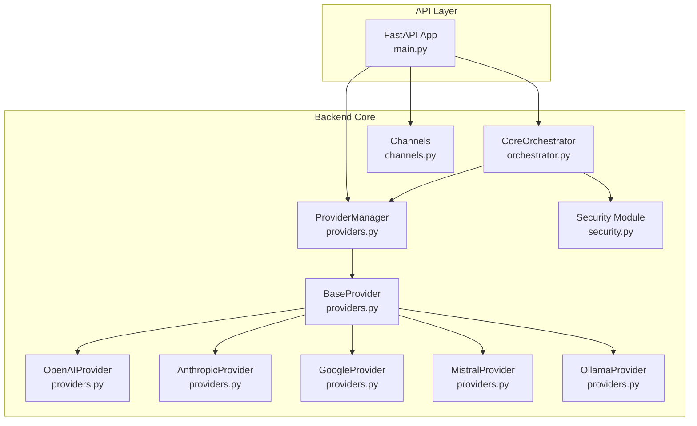

**Diagram sources**
- [providers.py](file://backend/app/core/providers.py#L68-L100)
- [providers.py](file://backend/app/core/providers.py#L418-L524)
- [orchestrator.py](file://backend/app/core/orchestrator.py#L87-L130)
- [main.py](file://backend/app/main.py#L14-L16)
- [security.py](file://backend/app/core/security.py#L35-L107)
- [channels.py](file://backend/app/core/channels.py#L405-L455)

**Section sources**
- [providers.py](file://backend/app/core/providers.py#L1-L545)
- [orchestrator.py](file://backend/app/core/orchestrator.py#L1-L486)
- [main.py](file://backend/app/main.py#L1-L567)
- [security.py](file://backend/app/core/security.py#L1-L455)
- [channels.py](file://backend/app/core/channels.py#L1-L524)

## Core Components
- ProviderManager: central registry and orchestrator for provider instances, default provider selection, health checks, and model discovery
- BaseProvider and concrete providers: standardized chat, model listing, and health-check interfaces for Ollama, OpenAI, Anthropic, Google, and Mistral
- CoreOrchestrator: action lifecycle, security levels, audit logging, and delegation to provider manager for chat operations
- FastAPI endpoints: provider registration, default provider setting, health checks, model listing, and multi-provider chat
- Security module: prompt injection defense and encrypted storage for secrets
- Channel gateway: multi-channel messaging abstraction and management

Key responsibilities:
- ProviderManager exposes a unified interface to select and route chat requests to a specific provider
- CoreOrchestrator enforces security policies and logs actions for audit
- FastAPI endpoints expose provider management and chat APIs
- Security module protects inputs and stores secrets securely

**Section sources**
- [providers.py](file://backend/app/core/providers.py#L418-L524)
- [providers.py](file://backend/app/core/providers.py#L68-L100)
- [orchestrator.py](file://backend/app/core/orchestrator.py#L87-L130)
- [main.py](file://backend/app/main.py#L381-L555)
- [security.py](file://backend/app/core/security.py#L35-L107)
- [channels.py](file://backend/app/core/channels.py#L405-L455)

## Architecture Overview
The Provider Integration Pattern follows a plugin-style architecture:
- ProviderManager registers provider implementations keyed by type and name
- CoreOrchestrator delegates chat actions to ProviderManager
- FastAPI routes provide runtime configuration and inspection of providers
- Security module validates inputs and stores secrets

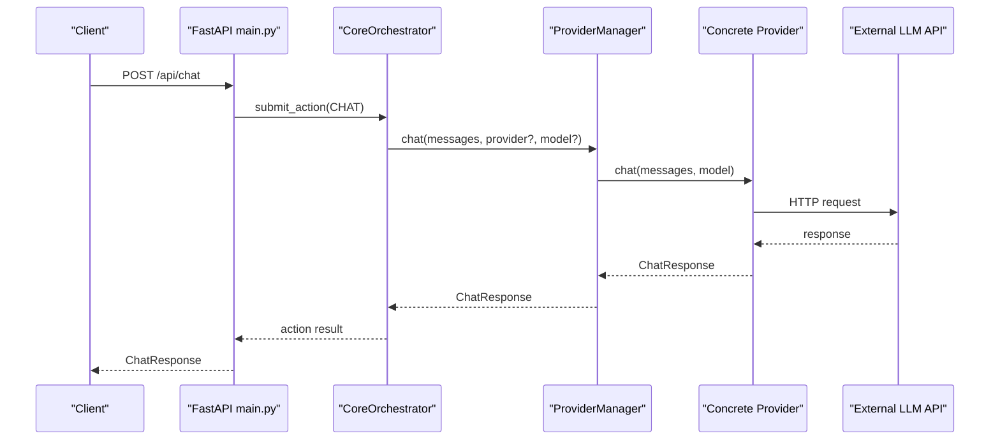

**Diagram sources**
- [main.py](file://backend/app/main.py#L131-L181)
- [orchestrator.py](file://backend/app/core/orchestrator.py#L169-L223)
- [providers.py](file://backend/app/core/providers.py#L470-L482)

## Detailed Component Analysis

### ProviderManager and Provider Plugin Architecture
ProviderManager acts as the central registry and dispatcher:
- Registers providers by type and name
- Selects default provider if none specified
- Delegates chat requests to selected provider
- Provides health checks and model listings across all providers
- Exposes status for monitoring

Concrete providers implement a common interface:
- BaseProvider defines abstract methods for chat, list_models, and health_check
- OllamaProvider, OpenAIProvider, AnthropicProvider, GoogleProvider, MistralProvider implement provider-specific logic

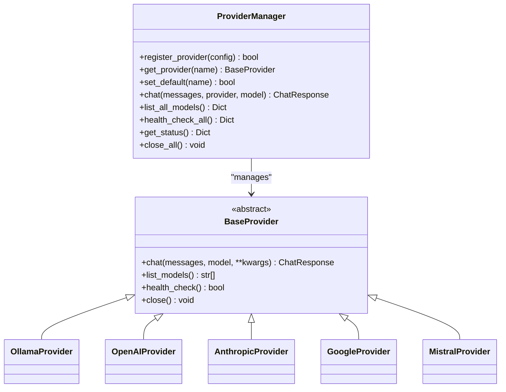

**Diagram sources**
- [providers.py](file://backend/app/core/providers.py#L418-L524)
- [providers.py](file://backend/app/core/providers.py#L68-L100)
- [providers.py](file://backend/app/core/providers.py#L102-L161)
- [providers.py](file://backend/app/core/providers.py#L163-L222)
- [providers.py](file://backend/app/core/providers.py#L224-L294)
- [providers.py](file://backend/app/core/providers.py#L296-L354)
- [providers.py](file://backend/app/core/providers.py#L356-L416)

**Section sources**
- [providers.py](file://backend/app/core/providers.py#L418-L524)
- [providers.py](file://backend/app/core/providers.py#L68-L100)

### CoreOrchestrator Integration for Action Processing
CoreOrchestrator manages the action lifecycle and integrates with ProviderManager for chat:
- Determines security level for actions
- Submits actions and auto-executes low-risk ones
- Logs audit events for all actions
- Delegates chat actions to ProviderManager for multi-provider support

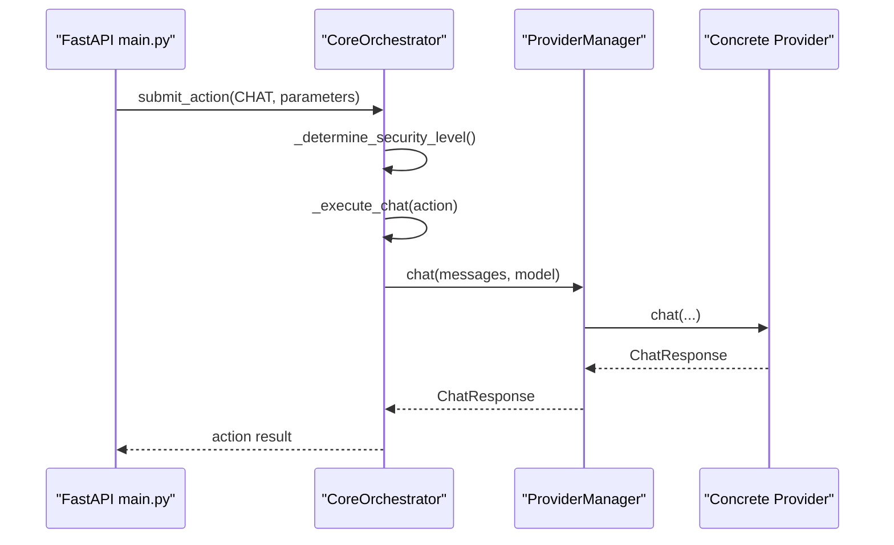

**Diagram sources**
- [main.py](file://backend/app/main.py#L131-L181)
- [orchestrator.py](file://backend/app/core/orchestrator.py#L169-L223)
- [orchestrator.py](file://backend/app/core/orchestrator.py#L303-L332)
- [providers.py](file://backend/app/core/providers.py#L470-L482)

**Section sources**
- [orchestrator.py](file://backend/app/core/orchestrator.py#L169-L223)
- [orchestrator.py](file://backend/app/core/orchestrator.py#L303-L332)

### Unified Chat Interface for Multi-Provider Operations
The system exposes a unified chat interface:
- Single endpoint for chat that delegates to CoreOrchestrator
- Multi-provider chat endpoint that directly calls ProviderManager
- Provider selection by name and model override per request

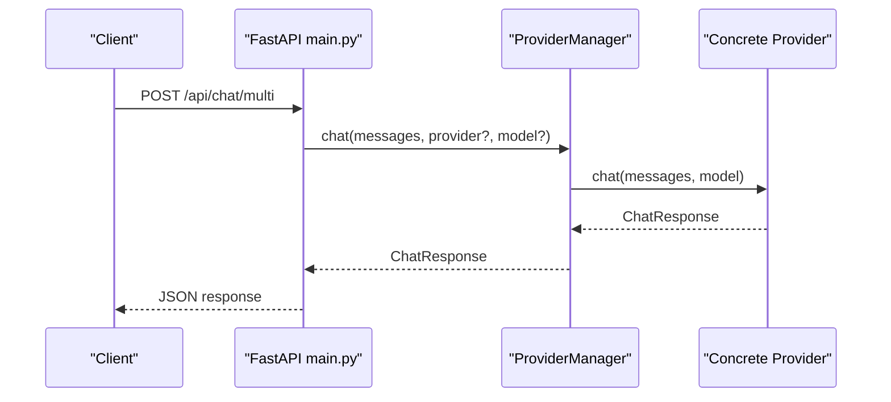

**Diagram sources**
- [main.py](file://backend/app/main.py#L531-L555)
- [providers.py](file://backend/app/core/providers.py#L470-L482)

**Section sources**
- [main.py](file://backend/app/main.py#L531-L555)
- [providers.py](file://backend/app/core/providers.py#L470-L482)

### Configuration Management System
Provider configuration is centralized:
- ProviderConfig encapsulates provider type, name, API keys, base URLs, models, defaults, and limits
- ProviderManager registers providers from configuration
- FastAPI endpoints allow runtime registration and default provider selection

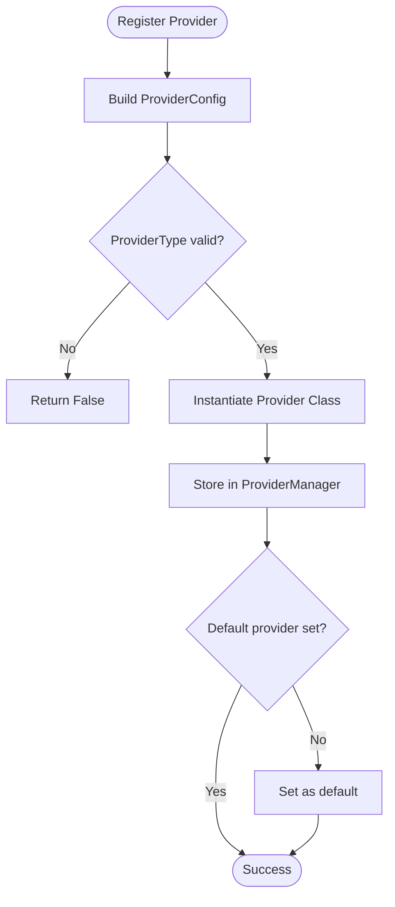

**Diagram sources**
- [providers.py](file://backend/app/core/providers.py#L429-L456)
- [providers.py](file://backend/app/core/providers.py#L432-L446)

**Section sources**
- [providers.py](file://backend/app/core/providers.py#L30-L45)
- [providers.py](file://backend/app/core/providers.py#L429-L456)
- [main.py](file://backend/app/main.py#L403-L434)

### Provider Selection Strategies, Model Availability Checking, and Dynamic Switching
- Provider selection: explicit by name or default provider
- Model availability: provider-specific model lists and health checks
- Dynamic switching: set default provider at runtime and list models across providers

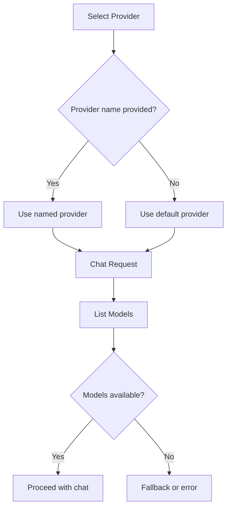

**Diagram sources**
- [providers.py](file://backend/app/core/providers.py#L458-L468)
- [providers.py](file://backend/app/core/providers.py#L484-L493)
- [providers.py](file://backend/app/core/providers.py#L495-L503)

**Section sources**
- [providers.py](file://backend/app/core/providers.py#L458-L468)
- [providers.py](file://backend/app/core/providers.py#L484-L493)
- [providers.py](file://backend/app/core/providers.py#L495-L503)

### Error Propagation Mechanisms and Fallback Strategies
- Provider errors: raised exceptions propagated to callers
- Health checks: per-provider readiness checks
- Fallback strategies: default provider selection and model listing fallbacks

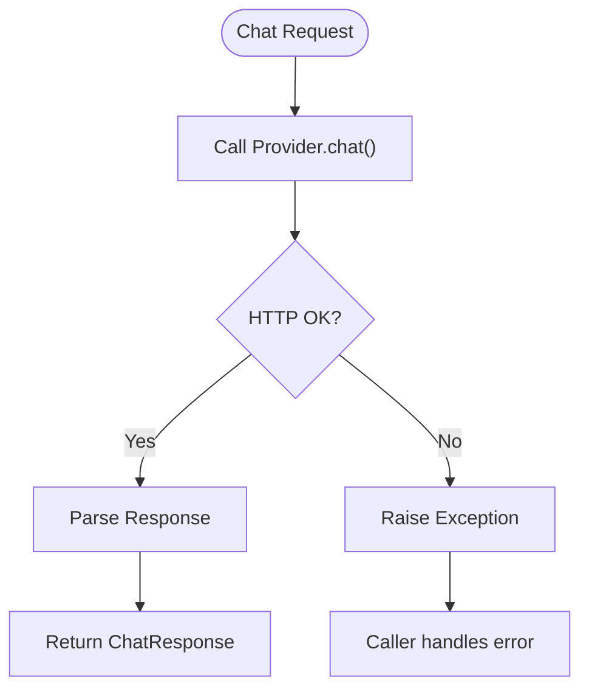

**Diagram sources**
- [providers.py](file://backend/app/core/providers.py#L131-L133)
- [providers.py](file://backend/app/core/providers.py#L200-L203)
- [providers.py](file://backend/app/core/providers.py#L273-L276)
- [providers.py](file://backend/app/core/providers.py#L333-L336)
- [providers.py](file://backend/app/core/providers.py#L394-L397)

**Section sources**
- [providers.py](file://backend/app/core/providers.py#L131-L133)
- [providers.py](file://backend/app/core/providers.py#L200-L203)
- [providers.py](file://backend/app/core/providers.py#L273-L276)
- [providers.py](file://backend/app/core/providers.py#L333-L336)
- [providers.py](file://backend/app/core/providers.py#L394-L397)

### Monitoring Integration and Real-Time Status
- Provider health checks: asynchronous health_check_all
- Provider status: get_status for monitoring dashboards
- Audit logs: CoreOrchestrator logs all actions for security monitoring

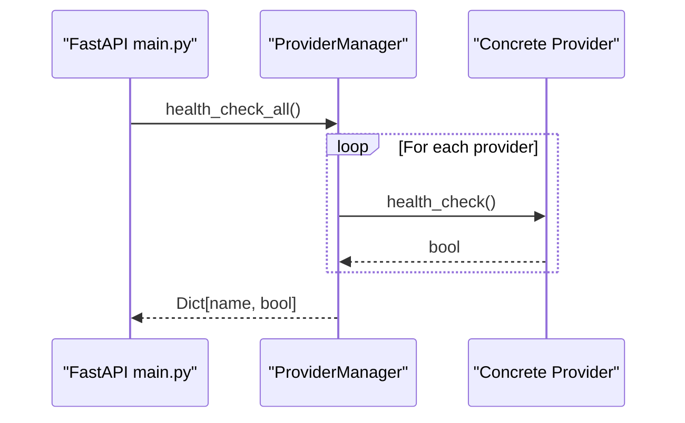

**Diagram sources**
- [main.py](file://backend/app/main.py#L448-L453)
- [providers.py](file://backend/app/core/providers.py#L495-L503)

**Section sources**
- [main.py](file://backend/app/main.py#L448-L453)
- [providers.py](file://backend/app/core/providers.py#L495-L503)
- [orchestrator.py](file://backend/app/core/orchestrator.py#L429-L450)

### Practical Examples: API Endpoints and Configuration
- Register a new provider: POST /api/providers/register
- Set default provider: POST /api/providers/{provider_name}/default
- Get provider models: GET /api/providers/{provider_name}/models
- Health check: GET /api/providers/health
- List all models: GET /api/providers/models
- Multi-provider chat: POST /api/chat/multi

These endpoints delegate to ProviderManager for runtime configuration and model discovery.

**Section sources**
- [main.py](file://backend/app/main.py#L403-L434)
- [main.py](file://backend/app/main.py#L437-L445)
- [main.py](file://backend/app/main.py#L390-L401)
- [main.py](file://backend/app/main.py#L448-L461)
- [main.py](file://backend/app/main.py#L531-L555)

### Extensibility Patterns and Best Practices for New Providers
To add a new provider:
- Define a new subclass of BaseProvider with chat, list_models, and health_check
- Add provider type to ProviderType and mapping in ProviderManager.register_provider
- Expose configuration via ProviderConfig and register via API
- Ensure robust error handling and health checks

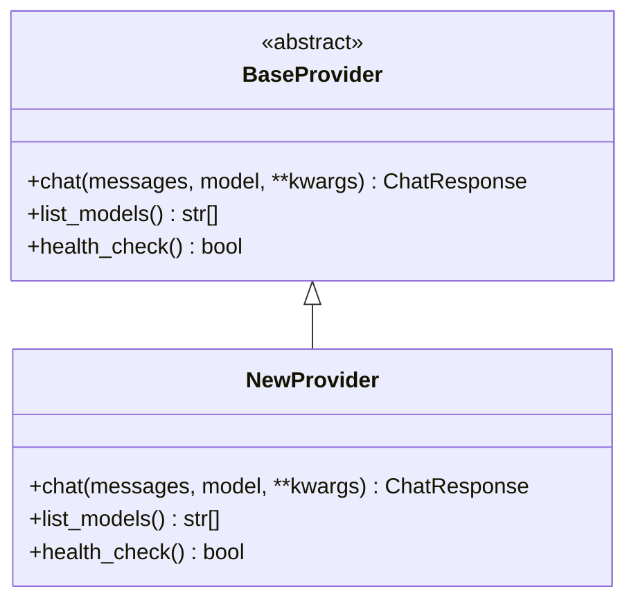

**Diagram sources**
- [providers.py](file://backend/app/core/providers.py#L68-L100)
- [providers.py](file://backend/app/core/providers.py#L429-L456)

**Section sources**
- [providers.py](file://backend/app/core/providers.py#L68-L100)
- [providers.py](file://backend/app/core/providers.py#L429-L456)

### Relationship to Security Framework, Audit Logging, and Compliance
- Prompt injection defense: input validation and sanitization
- Encrypted storage: DataVault for secrets
- Audit logging: CoreOrchestrator logs all actions with timestamps and outcomes
- Compliance considerations: local-only operation, encrypted storage, and human-in-the-loop for critical actions

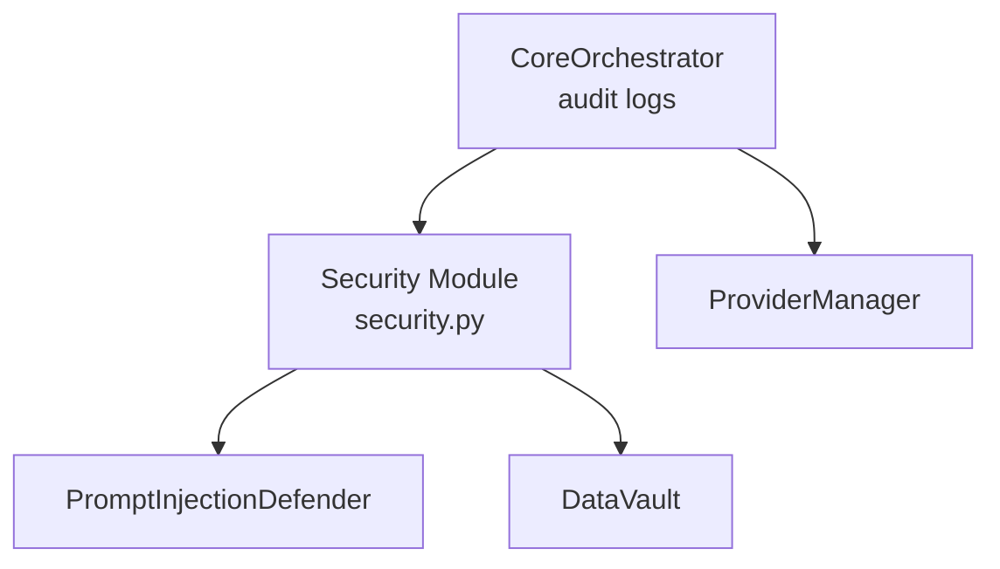

**Diagram sources**
- [security.py](file://backend/app/core/security.py#L35-L107)
- [security.py](file://backend/app/core/security.py#L325-L413)
- [orchestrator.py](file://backend/app/core/orchestrator.py#L429-L450)

**Section sources**
- [security.py](file://backend/app/core/security.py#L35-L107)
- [security.py](file://backend/app/core/security.py#L325-L413)
- [orchestrator.py](file://backend/app/core/orchestrator.py#L429-L450)

## Dependency Analysis
The system relies on FastAPI and httpx for networking, and cryptography for secure storage. ProviderManager depends on httpx for HTTP calls to external LLM APIs.

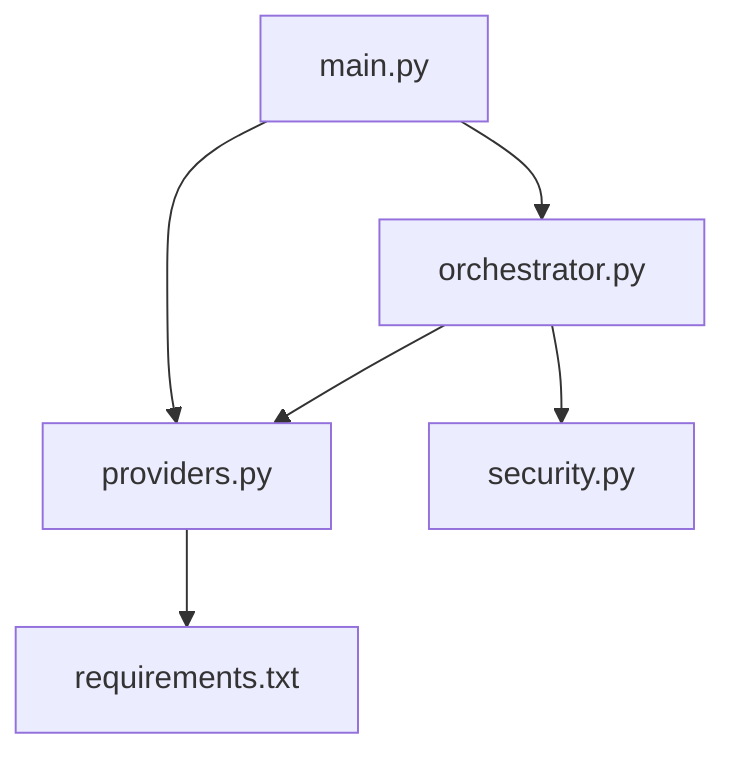

**Diagram sources**
- [main.py](file://backend/app/main.py#L14-L16)
- [orchestrator.py](file://backend/app/core/orchestrator.py#L87-L130)
- [providers.py](file://backend/app/core/providers.py#L68-L100)
- [requirements.txt](file://backend/requirements.txt#L13-L15)

**Section sources**
- [requirements.txt](file://backend/requirements.txt#L1-L36)
- [providers.py](file://backend/app/core/providers.py#L68-L100)

## Performance Considerations
- Asynchronous HTTP client usage ensures non-blocking I/O for provider calls
- Health checks and model listing are cached at the API layer to reduce repeated network calls
- Rate limiting and timeouts are configurable per provider
- Consider batching model queries and caching provider status for dashboard views

[No sources needed since this section provides general guidance]

## Troubleshooting Guide
Common issues and resolutions:
- Provider not found: verify provider name and default provider configuration
- API key missing: ensure API key is set in ProviderConfig
- Health check failures: confirm external service availability and network connectivity
- Audit logs not appearing: verify security configuration and log file permissions

**Section sources**
- [providers.py](file://backend/app/core/providers.py#L458-L468)
- [providers.py](file://backend/app/core/providers.py#L181-L182)
- [providers.py](file://backend/app/core/providers.py#L243-L244)
- [providers.py](file://backend/app/core/providers.py#L311-L312)
- [providers.py](file://backend/app/core/providers.py#L375-L376)
- [providers.py](file://backend/app/core/providers.py#L414-L415)
- [orchestrator.py](file://backend/app/core/orchestrator.py#L429-L450)

## Conclusion
The Provider Integration Patterns establish a robust, extensible, and secure foundation for multi-provider LLM operations. ProviderManager centralizes provider lifecycle and selection, CoreOrchestrator enforces security and auditability, and FastAPI exposes a clean API surface for configuration and monitoring. The security module and encrypted storage ensure sensitive data remains protected, while audit logging enables compliance and forensics.

[No sources needed since this section summarizes without analyzing specific files]

## Appendices

### API Endpoint Reference for Provider Management
- GET /api/providers: list provider status
- GET /api/providers/{provider_name}/models: list models for a provider
- POST /api/providers/register: register a new provider
- POST /api/providers/{provider_name}/default: set default provider
- GET /api/providers/health: health check all providers
- GET /api/providers/models: list models from all providers
- POST /api/chat/multi: multi-provider chat

**Section sources**
- [main.py](file://backend/app/main.py#L383-L461)
- [main.py](file://backend/app/main.py#L531-L555)

### Security and Compliance Highlights
- Zero-trust architecture with human-in-the-loop for critical actions
- Prompt injection defense with input validation and sanitization
- Encrypted storage for API keys and secrets
- Audit logging for all actions with detailed metadata

**Section sources**
- [README.md](file://README.md#L65-L74)
- [security.py](file://backend/app/core/security.py#L35-L107)
- [security.py](file://backend/app/core/security.py#L325-L413)
- [orchestrator.py](file://backend/app/core/orchestrator.py#L429-L450)