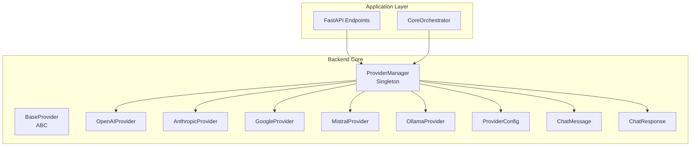
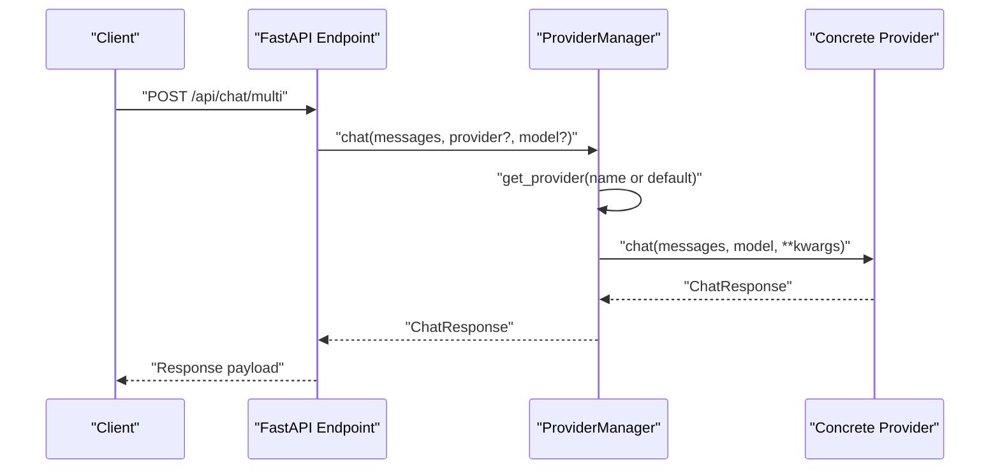
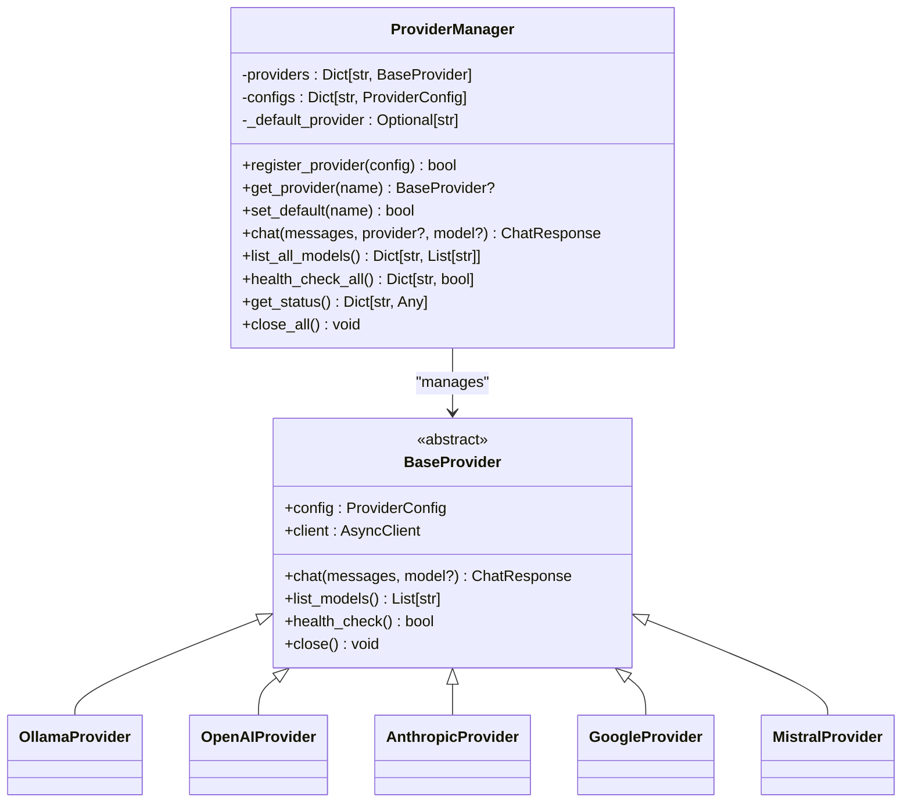
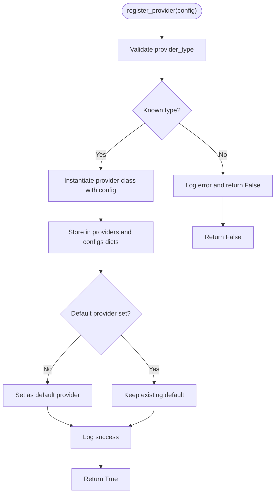
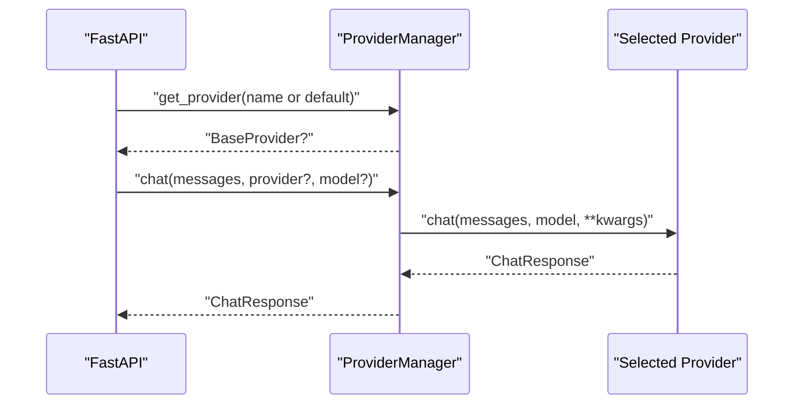
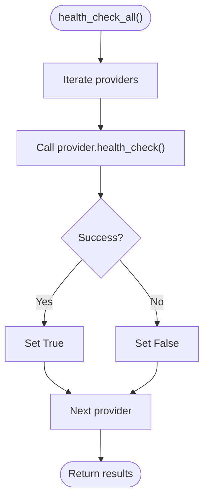
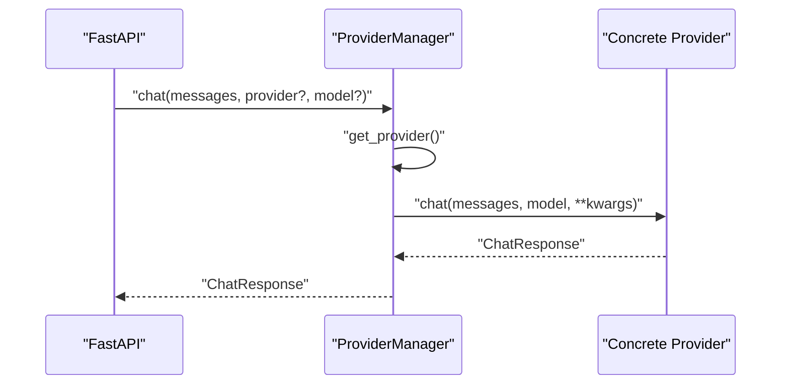
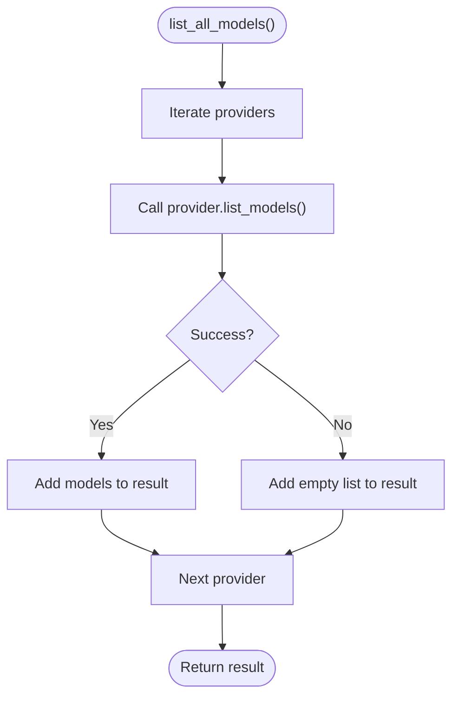
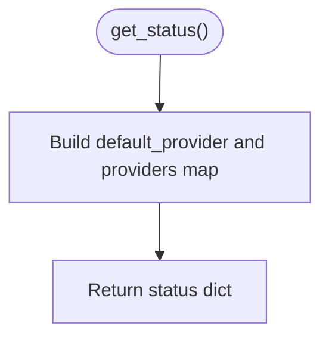
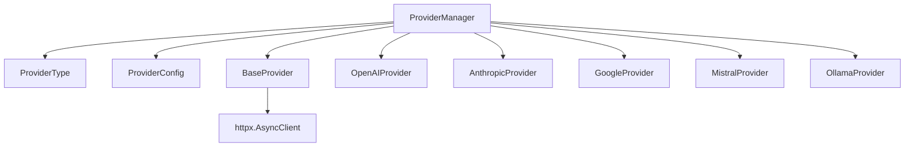

# Provider Management Operations

<cite>
**Referenced Files in This Document**
- [providers.py](file://backend/app/core/providers.py)
- [main.py](file://backend/app/main.py)
- [orchestrator.py](file://backend/app/core/orchestrator.py)
- [README.md](file://README.md)
</cite>

## Table of Contents
1. [Introduction](#introduction)
2. [Project Structure](#project-structure)
3. [Core Components](#core-components)
4. [Architecture Overview](#architecture-overview)
5. [Detailed Component Analysis](#detailed-component-analysis)
6. [Dependency Analysis](#dependency-analysis)
7. [Performance Considerations](#performance-considerations)
8. [Troubleshooting Guide](#troubleshooting-guide)
9. [Conclusion](#conclusion)
10. [Appendices](#appendices)

## Introduction
This document provides comprehensive documentation for Provider Management Operations centered around the ProviderManager singleton class. It explains provider registration, dynamic addition and removal, default provider configuration, provider selection algorithms, health monitoring, failover mechanisms, chat method delegation, model listing aggregation, and status reporting. Practical examples illustrate lifecycle management, configuration updates, operational monitoring, provider status retrieval, health checks, graceful shutdown procedures, configuration validation, error handling strategies, and performance monitoring. Thread safety considerations and resource cleanup processes are addressed.

## Project Structure
The provider management system resides in the backend core module and is exposed via FastAPI endpoints. The main application integrates provider operations with the orchestrator and exposes administrative APIs for provider lifecycle management.

**Diagram sources**
- [providers.py](file://backend/app/core/providers.py#L418-L544)
- [main.py](file://backend/app/main.py#L404-L567)
- [orchestrator.py](file://backend/app/core/orchestrator.py#L87-L130)

**Section sources**
- [providers.py](file://backend/app/core/providers.py#L1-L545)
- [main.py](file://backend/app/main.py#L1-L200)
- [README.md](file://README.md#L134-L155)

## Core Components
- ProviderType: Enumerates supported provider types (Ollama, OpenAI, Anthropic, Google, Mistral, Custom).
- ProviderConfig: Configuration dataclass for provider settings including type, name, API key, base URL, models, default model, enablement, rate limit, timeout, and provider-specific settings.
- BaseProvider: Abstract base class defining the contract for provider implementations (chat, list_models, health_check, close).
- Concrete Providers: OllamaProvider, OpenAIProvider, AnthropicProvider, GoogleProvider, MistralProvider implement BaseProvider.
- ProviderManager: Singleton responsible for registering providers, selecting providers, delegating chat, aggregating model listings, health checking, status reporting, and graceful shutdown.
- get_provider_manager(): Factory function implementing the singleton pattern with default provider initialization.

Key responsibilities:
- Registration: Validates provider type and instantiates the appropriate provider class.
- Selection: Retrieves a provider by name or falls back to the default provider.
- Delegation: Routes chat requests to the selected provider.
- Aggregation: Collects model lists and health statuses across all providers.
- Status Reporting: Provides a structured snapshot of provider configurations and defaults.
- Lifecycle: Closes provider HTTP clients during shutdown.

**Section sources**
- [providers.py](file://backend/app/core/providers.py#L20-L17)
- [providers.py](file://backend/app/core/providers.py#L30-L45)
- [providers.py](file://backend/app/core/providers.py#L68-L100)
- [providers.py](file://backend/app/core/providers.py#L102-L161)
- [providers.py](file://backend/app/core/providers.py#L163-L222)
- [providers.py](file://backend/app/core/providers.py#L224-L294)
- [providers.py](file://backend/app/core/providers.py#L296-L354)
- [providers.py](file://backend/app/core/providers.py#L356-L416)
- [providers.py](file://backend/app/core/providers.py#L418-L524)
- [providers.py](file://backend/app/core/providers.py#L530-L544)

## Architecture Overview
ProviderManager acts as the central hub for multi-provider LLM operations. It integrates with FastAPI endpoints for runtime management and with the orchestrator for system-wide operations. Concrete providers encapsulate provider-specific logic and HTTP interactions.

**Diagram sources**
- [main.py](file://backend/app/main.py#L533-L554)
- [providers.py](file://backend/app/core/providers.py#L470-L482)

**Section sources**
- [main.py](file://backend/app/main.py#L404-L567)
- [providers.py](file://backend/app/core/providers.py#L418-L524)

## Detailed Component Analysis

### ProviderManager Singleton and Default Provider Configuration
- Singleton Pattern: get_provider_manager() ensures a single ProviderManager instance. On first access, it initializes with a default Ollama provider configured with a default model and enabled flag.
- Default Provider: The first registered provider becomes the default if no default is set.
- Thread Safety: The singleton uses a global variable and a simple factory. While Python’s GIL provides basic atomicity for small operations, there is no explicit locking. For concurrent access scenarios, consider adding locks around shared mutable state if needed.

**Diagram sources**
- [providers.py](file://backend/app/core/providers.py#L418-L544)

**Section sources**
- [providers.py](file://backend/app/core/providers.py#L526-L544)

### Provider Registration Process
- Validation: The provider type is validated against ProviderType. Unknown types are rejected.
- Instantiation: The appropriate provider class is instantiated with the provided ProviderConfig.
- Default Assignment: If no default provider is set, the newly registered provider becomes the default.
- Logging: Successful registration logs provider name and type; failures log errors.

**Diagram sources**
- [providers.py](file://backend/app/core/providers.py#L429-L456)

**Section sources**
- [providers.py](file://backend/app/core/providers.py#L429-L456)

### Dynamic Provider Addition and Removal
- Addition: Use the FastAPI endpoint POST /api/providers/register to add a new provider. The endpoint validates the provider type, constructs a ProviderConfig, and calls ProviderManager.register_provider.
- Removal: There is no explicit remove endpoint in the current code. To remove a provider, you would need to extend ProviderManager with a removal method and expose a corresponding endpoint. Until then, providers remain registered until application restart or manual intervention.

Operational example:
- Add a new OpenAI provider named “openai-cloud” with an API key and default model via the endpoint. The system logs the registration and sets it as default if none exists.

**Section sources**
- [main.py](file://backend/app/main.py#L404-L434)
- [providers.py](file://backend/app/core/providers.py#L429-L456)

### Provider Selection Algorithms
- Selection: ProviderManager.get_provider(name or default) retrieves the provider by name or falls back to the default provider.
- Delegation: ProviderManager.chat delegates the chat request to the selected provider’s chat method.
- Current Behavior: No built-in load balancing or failover logic exists. Failover can be implemented by extending ProviderManager to iterate through providers and retry on failure.

**Diagram sources**
- [providers.py](file://backend/app/core/providers.py#L458-L482)

**Section sources**
- [providers.py](file://backend/app/core/providers.py#L458-L482)

### Health Monitoring System
- Health Check: ProviderManager.health_check_all iterates providers and calls each provider’s health_check method, returning a dictionary of provider names to boolean health status.
- Provider-Specific Health Checks:
  - Ollama: Tests connectivity to the local Ollama endpoint.
  - OpenAI/Anthropic/Google/Mistral: Validates presence of API key.
- Endpoint: GET /api/providers/health returns aggregated health status.

**Diagram sources**
- [providers.py](file://backend/app/core/providers.py#L495-L503)

**Section sources**
- [providers.py](file://backend/app/core/providers.py#L155-L160)
- [providers.py](file://backend/app/core/providers.py#L220-L221)
- [providers.py](file://backend/app/core/providers.py#L292-L293)
- [providers.py](file://backend/app/core/providers.py#L352-L353)
- [providers.py](file://backend/app/core/providers.py#L414-L415)
- [main.py](file://backend/app/main.py#L448-L453)

### Failover Mechanisms
- Current State: No automatic failover is implemented. ProviderManager.select_provider does not attempt retries across providers.
- Recommended Implementation: Extend ProviderManager.chat to:
  - Attempt the primary provider.
  - On failure, iterate through available providers and try the next healthy provider.
  - Return the first successful response or propagate the last error.
- This enhancement requires careful error handling and health status caching to avoid repeated failures.

[No sources needed since this section proposes enhancements not currently implemented]

### Chat Method Delegation
- Delegation: ProviderManager.chat resolves a provider and forwards the chat request with messages, model, and additional kwargs.
- Response: Returns a ChatResponse containing content, model, provider identifier, tokens used, finish reason, and latency.

**Diagram sources**
- [providers.py](file://backend/app/core/providers.py#L470-L482)

**Section sources**
- [providers.py](file://backend/app/core/providers.py#L470-L482)

### Model Listing Aggregation
- Aggregation: ProviderManager.list_all_models iterates providers and collects model lists from each provider, catching exceptions and returning empty lists for failing providers.
- Endpoint: GET /api/providers/models returns a dictionary mapping provider names to their model lists.

**Diagram sources**
- [providers.py](file://backend/app/core/providers.py#L484-L493)

**Section sources**
- [providers.py](file://backend/app/core/providers.py#L484-L493)
- [main.py](file://backend/app/main.py#L456-L461)

### Status Reporting Capabilities
- Status: ProviderManager.get_status returns the default provider and a dictionary of provider configurations with type, enabled flag, default model, and base URL.
- Endpoint: GET /api/providers returns the status snapshot.

**Diagram sources**
- [providers.py](file://backend/app/core/providers.py#L505-L518)

**Section sources**
- [providers.py](file://backend/app/core/providers.py#L505-L518)
- [main.py](file://backend/app/main.py#L448-L453)

### Practical Examples

#### Provider Lifecycle Management
- Register a new provider:
  - Endpoint: POST /api/providers/register with provider_type, name, api_key, base_url, default_model.
  - Behavior: Validates type, constructs ProviderConfig, registers provider, logs success or error.
- Set default provider:
  - Endpoint: POST /api/providers/{provider_name}/default sets the default provider if it exists.
- Retrieve status:
  - Endpoint: GET /api/providers returns default provider and provider configurations.

**Section sources**
- [main.py](file://backend/app/main.py#L404-L445)
- [providers.py](file://backend/app/core/providers.py#L505-L518)

#### Configuration Updates
- Update provider configuration:
  - Modify ProviderConfig fields (e.g., default_model, base_url, api_key).
  - Re-register the provider via POST /api/providers/register to apply changes.
- Rate limiting and timeouts:
  - Adjust ProviderConfig.rate_limit and ProviderConfig.timeout to tune provider behavior.

**Section sources**
- [providers.py](file://backend/app/core/providers.py#L30-L45)

#### Operational Monitoring
- Health monitoring:
  - GET /api/providers/health checks all providers’ health.
- Model availability:
  - GET /api/providers/models lists models from all providers.
- System status:
  - GET /api/status checks Ollama connectivity and pending actions.

**Section sources**
- [main.py](file://backend/app/main.py#L448-L461)
- [main.py](file://backend/app/main.py#L101-L128)

#### Graceful Shutdown Procedures
- Application lifespan:
  - The FastAPI lifespan manager initializes the orchestrator on startup and shuts it down on exit.
- Provider cleanup:
  - ProviderManager.close_all closes all provider HTTP clients asynchronously.
- Integration:
  - The orchestrator’s shutdown routine is invoked during application shutdown.

**Section sources**
- [main.py](file://backend/app/main.py#L58-L70)
- [providers.py](file://backend/app/core/providers.py#L520-L523)
- [orchestrator.py](file://backend/app/core/orchestrator.py#L112-L129)

### Provider Configuration Validation and Error Handling
- Validation:
  - ProviderType validation occurs in the FastAPI endpoint before constructing ProviderConfig.
  - ProviderManager.register_provider validates provider type and handles instantiation exceptions.
- Error Handling:
  - Registration failures are logged and return False.
  - Health checks and model listing wrap provider calls in try-except blocks, logging warnings and returning safe defaults.
  - Chat endpoint wraps ProviderManager.chat in try-except and raises HTTPException on errors.

**Section sources**
- [main.py](file://backend/app/main.py#L414-L432)
- [providers.py](file://backend/app/core/providers.py#L440-L456)
- [providers.py](file://backend/app/core/providers.py#L495-L503)
- [providers.py](file://backend/app/core/providers.py#L484-L493)
- [main.py](file://backend/app/main.py#L553-L554)

### Performance Monitoring
- Latency Measurement:
  - Concrete providers measure request latency and populate ChatResponse.latency_ms.
- Token Usage:
  - Providers populate tokens_used when available (OpenAI, Mistral).
- Observability:
  - Use health checks and model listing to monitor provider availability and model counts.
  - Consider adding metrics collection for latency and error rates.

**Section sources**
- [providers.py](file://backend/app/core/providers.py#L135-L143)
- [providers.py](file://backend/app/core/providers.py#L205-L215)
- [providers.py](file://backend/app/core/providers.py#L278-L287)
- [providers.py](file://backend/app/core/providers.py#L338-L347)
- [providers.py](file://backend/app/core/providers.py#L399-L409)

## Dependency Analysis
ProviderManager depends on:
- ProviderType and ProviderConfig for type validation and configuration.
- Concrete provider classes for implementation details.
- httpx.AsyncClient for HTTP operations.
- Logging for operational visibility.

**Diagram sources**
- [providers.py](file://backend/app/core/providers.py#L418-L544)

**Section sources**
- [providers.py](file://backend/app/core/providers.py#L418-L544)

## Performance Considerations
- Asynchronous I/O: All provider operations use httpx.AsyncClient, enabling non-blocking network calls.
- Latency Tracking: Providers compute and report latency, aiding performance monitoring.
- Health Checks: Periodic health checks prevent routing to unhealthy providers.
- Recommendations:
  - Implement provider-side rate limiting using ProviderConfig.rate_limit.
  - Add circuit breaker logic for transient failures.
  - Cache model lists periodically to reduce repeated provider calls.
  - Consider connection pooling and reuse across requests.

[No sources needed since this section provides general guidance]

## Troubleshooting Guide
Common issues and resolutions:
- Provider Not Found:
  - Symptom: Error indicating provider not found when calling chat.
  - Resolution: Ensure the provider is registered and the name is correct. Set a default provider if none is set.
- Health Check Failures:
  - Symptom: Health reports false for a provider.
  - Resolution: Verify API key configuration for cloud providers or local service availability for Ollama.
- Registration Failures:
  - Symptom: Registration returns False or logs an error.
  - Resolution: Confirm provider_type is valid and configuration values are correct.
- Chat Errors:
  - Symptom: HTTPException raised from chat endpoint.
  - Resolution: Inspect underlying provider error messages and adjust configuration or retry.

**Section sources**
- [providers.py](file://backend/app/core/providers.py#L458-L482)
- [providers.py](file://backend/app/core/providers.py#L495-L503)
- [providers.py](file://backend/app/core/providers.py#L429-L456)
- [main.py](file://backend/app/main.py#L553-L554)

## Conclusion
ProviderManager provides a robust foundation for multi-provider LLM operations with a clear singleton pattern, registration pipeline, and essential management capabilities. While current implementations lack automatic failover and advanced monitoring, the architecture supports straightforward extensions for health-aware routing, model caching, and performance metrics. The FastAPI integration enables dynamic provider lifecycle management and operational visibility, aligning with the system’s zero-trust security posture.

[No sources needed since this section summarizes without analyzing specific files]

## Appendices

### API Endpoints for Provider Management
- POST /api/providers/register
  - Purpose: Register a new provider.
  - Request: provider_type, name, api_key, base_url, default_model.
  - Response: status and provider name.
- POST /api/providers/{provider_name}/default
  - Purpose: Set default provider.
  - Response: status and default_provider.
- GET /api/providers/health
  - Purpose: Health check all providers.
  - Response: Dictionary of provider names to boolean health status.
- GET /api/providers/models
  - Purpose: List models from all providers.
  - Response: Dictionary mapping provider names to model lists.
- POST /api/chat/multi
  - Purpose: Chat using a specific provider.
  - Request: message, provider, model.
  - Response: Response content, model, provider, tokens, latency.

**Section sources**
- [main.py](file://backend/app/main.py#L404-L461)
- [main.py](file://backend/app/main.py#L533-L554)