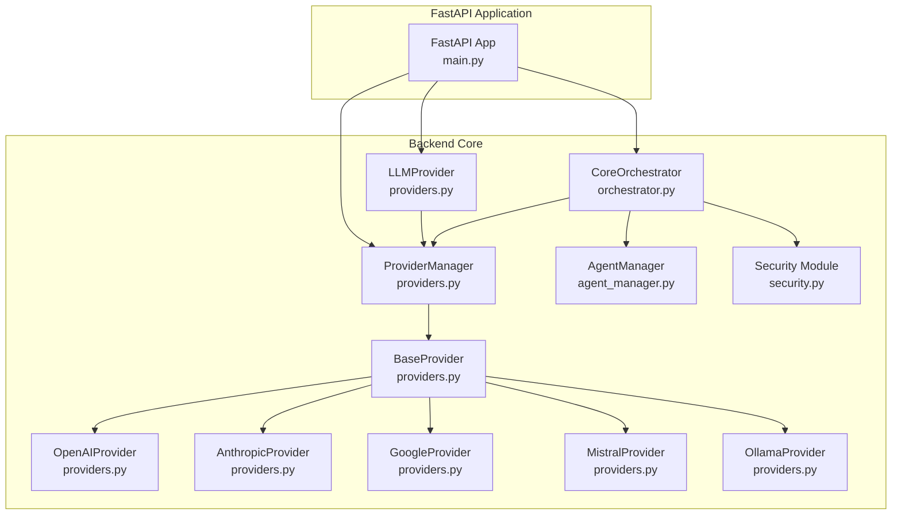
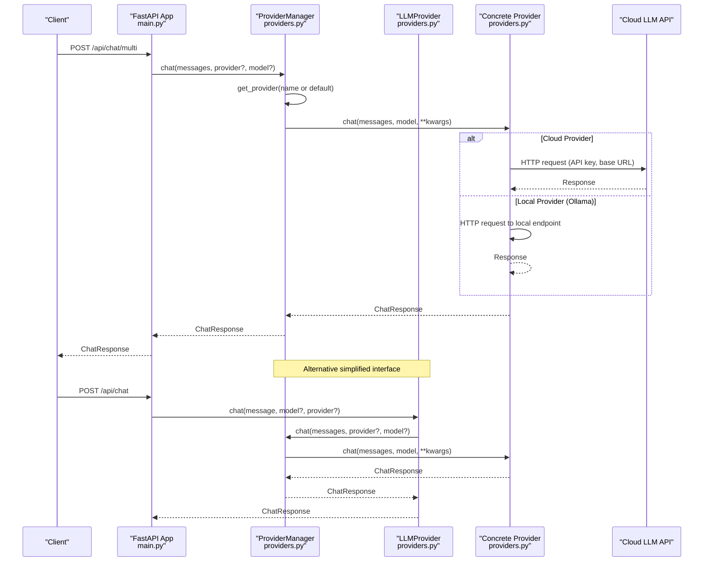
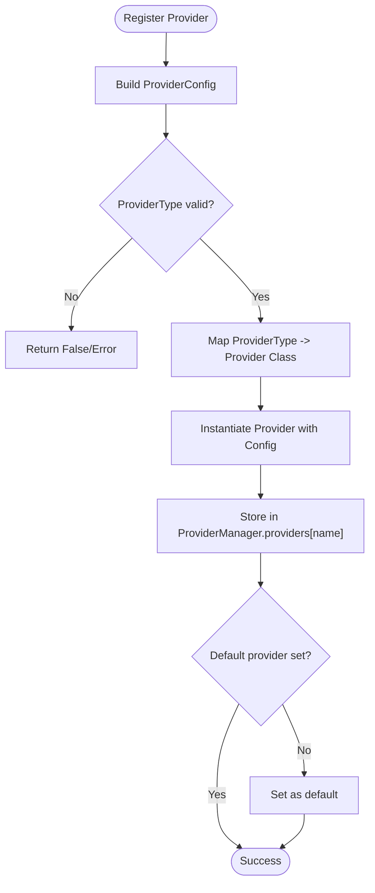
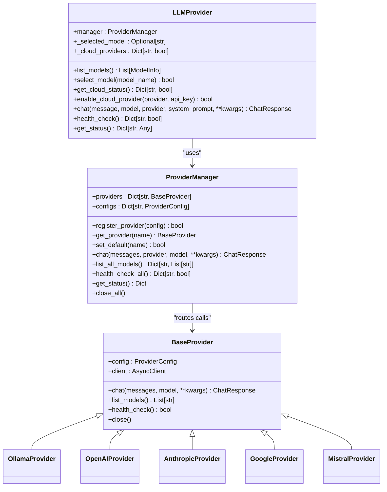
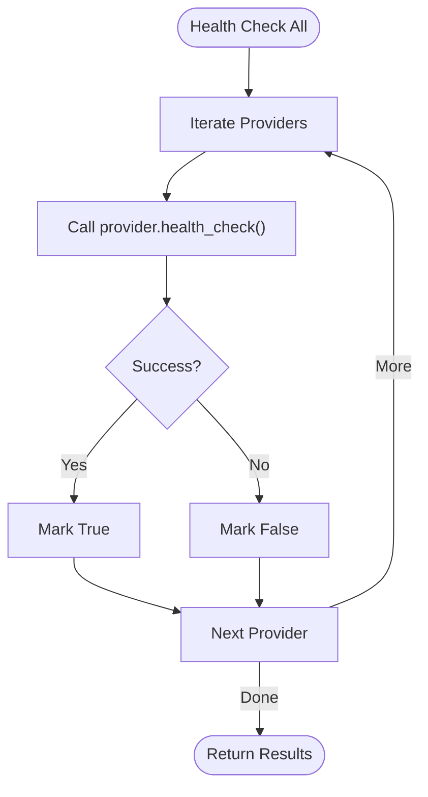
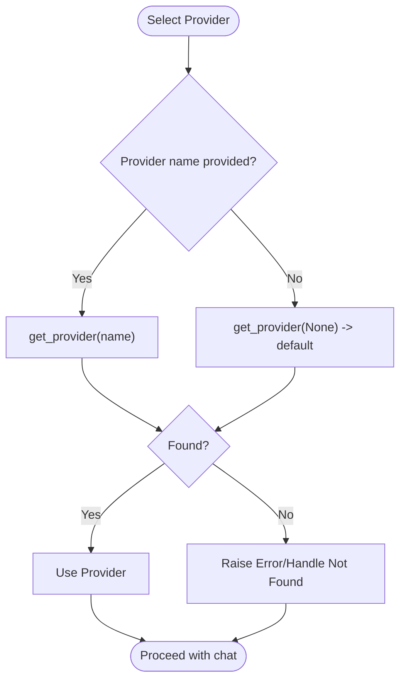
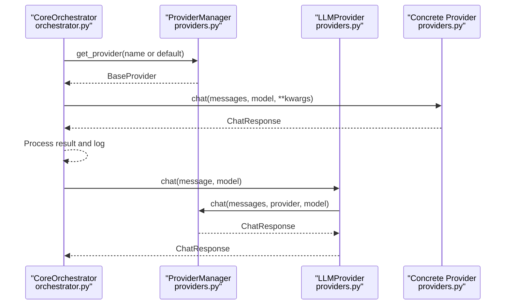
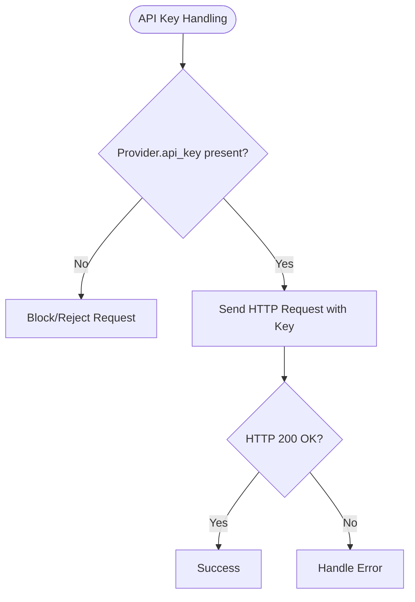
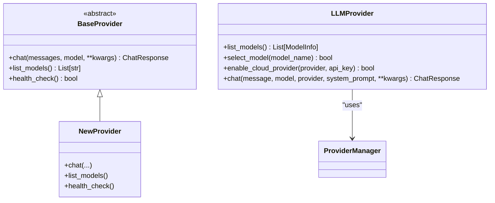
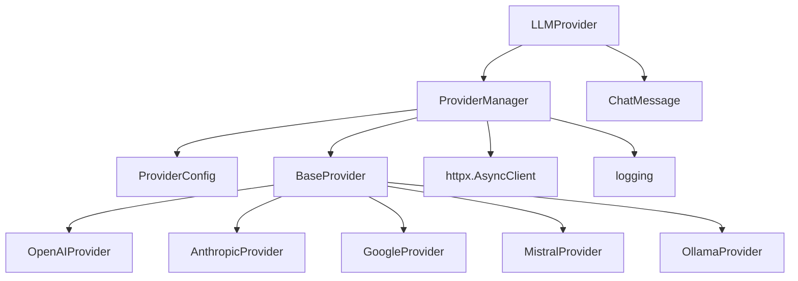

# Provider Manager

<cite>
**Referenced Files in This Document**
- [providers.py](file://backend/app/core/providers.py)
- [orchestrator.py](file://backend/app/core/orchestrator.py)
- [main.py](file://backend/app/main.py)
- [security.py](file://backend/app/core/security.py)
- [agent_manager.py](file://backend/app/core/agent_manager.py)
- [__init__.py](file://backend/app/core/__init__.py)
- [README.md](file://README.md)
- [test_unit.py](file://backend/tests/test_unit.py)
</cite>

## Update Summary
**Changes Made**
- Added comprehensive documentation for the new LLMProvider interface class
- Enhanced cloud provider implementations with improved error handling and model management
- Expanded provider management operations with new simplified interface
- Updated architecture diagrams to reflect the dual-provider system (BaseProvider + LLMProvider)
- Added practical examples for the new LLMProvider usage patterns

## Table of Contents
1. [Introduction](#introduction)
2. [Project Structure](#project-structure)
3. [Core Components](#core-components)
4. [Architecture Overview](#architecture-overview)
5. [Detailed Component Analysis](#detailed-component-analysis)
6. [Dependency Analysis](#dependency-analysis)
7. [Performance Considerations](#performance-considerations)
8. [Troubleshooting Guide](#troubleshooting-guide)
9. [Conclusion](#conclusion)
10. [Appendices](#appendices)

## Introduction
This document describes the Provider Manager component that powers multi-provider LLM architecture and dynamic provider management in the system. It explains the abstract provider architecture supporting multiple LLM backends (local Ollama and cloud providers OpenAI, Anthropic, Google, Mistral), the provider registration and configuration process, health monitoring and failover mechanisms, and the unified interface for provider operations. The system now features two distinct provider interfaces: the traditional BaseProvider for advanced users and the new LLMProvider for simplified operations. It also covers provider selection algorithms, model availability checking, dynamic provider switching, integration with the Core Orchestrator for action processing, authentication management for cloud providers, and cost optimization strategies. Practical examples of provider setup, model listing, health checking, and configuration management are included, along with the provider plugin architecture, extensibility patterns, and best practices for adding new providers.

## Project Structure
The Provider Manager resides in the backend core and integrates with the FastAPI application and the Core Orchestrator. The main application exposes REST endpoints for provider management and multi-provider chat. Security and sandboxing are handled by dedicated modules. The system now supports both advanced BaseProvider operations and simplified LLMProvider operations.

**Diagram sources**
- [providers.py](file://backend/app/core/providers.py#L418-L658)
- [orchestrator.py](file://backend/app/core/orchestrator.py#L87-L486)
- [main.py](file://backend/app/main.py#L381-L555)
- [security.py](file://backend/app/core/security.py#L325-L455)
- [agent_manager.py](file://backend/app/core/agent_manager.py#L65-L200)

**Section sources**
- [providers.py](file://backend/app/core/providers.py#L1-L658)
- [orchestrator.py](file://backend/app/core/orchestrator.py#L1-L486)
- [main.py](file://backend/app/main.py#L1-L567)
- [README.md](file://README.md#L134-L155)

## Core Components
- ProviderType: Enumerates supported LLM provider types (Ollama, OpenAI, Anthropic, Google, Mistral, Custom).
- ProviderConfig: Configuration dataclass for provider registration, including provider type, name, API key, base URL, model lists, default model, enabled flag, rate limit, and timeout.
- BaseProvider: Abstract base class defining the unified interface for chat, list_models, and health_check, plus shared HTTP client and request tracking.
- Concrete Providers: OllamaProvider, OpenAIProvider, AnthropicProvider, GoogleProvider, MistralProvider implement the BaseProvider interface and handle provider-specific request/response formats.
- ProviderManager: Central manager for registering, selecting, and operating providers. Provides chat routing, model listing across providers, health checks, and status reporting.
- LLMProvider: New simplified interface providing easy access to models and chat functionality with cloud provider management capabilities.
- API Endpoints: FastAPI endpoints expose provider registration, default provider setting, health checks, model listing, and multi-provider chat.

Key responsibilities:
- Unified provider interface: All providers implement the same contract for chat, model listing, and health checks.
- Dual interface support: Both BaseProvider (advanced) and LLMProvider (simplified) interfaces available for different use cases.
- Dynamic provider management: Register new providers at runtime, set default provider, and route requests accordingly.
- Health monitoring: Health checks for all providers to detect availability and readiness.
- Model discovery: Aggregate model lists from all providers for selection and display.
- Cloud provider management: LLMProvider provides simplified cloud provider enablement with API key management.
- Integration with Core Orchestrator: ProviderManager is used by the orchestrator for action processing and multi-provider chat.

**Section sources**
- [providers.py](file://backend/app/core/providers.py#L20-L100)
- [providers.py](file://backend/app/core/providers.py#L102-L416)
- [providers.py](file://backend/app/core/providers.py#L418-L524)
- [providers.py](file://backend/app/core/providers.py#L558-L658)
- [main.py](file://backend/app/main.py#L381-L555)

## Architecture Overview
The Provider Manager enables a multi-provider LLM gateway with both unified and simplified interfaces. The system supports:
- Local LLM via Ollama
- Cloud LLMs via OpenAI, Anthropic, Google, Mistral
- Extensible provider plugin architecture for additional providers
- Advanced BaseProvider interface for power users
- Simplified LLMProvider interface for basic operations

**Diagram sources**
- [main.py](file://backend/app/main.py#L533-L555)
- [providers.py](file://backend/app/core/providers.py#L470-L482)
- [providers.py](file://backend/app/core/providers.py#L109-L143)
- [providers.py](file://backend/app/core/providers.py#L175-L215)
- [providers.py](file://backend/app/core/providers.py#L237-L287)
- [providers.py](file://backend/app/core/providers.py#L305-L347)
- [providers.py](file://backend/app/core/providers.py#L369-L409)
- [providers.py](file://backend/app/core/providers.py#L626-L649)

## Detailed Component Analysis

### Provider Registration and Configuration
- Registration: Providers are registered via ProviderConfig with provider_type, name, optional api_key/base_url/default_model, and enabled flag. The ProviderManager maps ProviderType to concrete provider classes and stores them by name.
- Default Provider: The first registered provider becomes the default. Users can change the default provider at runtime.
- Configuration Management: API endpoints support registering providers, setting default provider, listing models per provider, listing all models, and health checks.

**Diagram sources**
- [providers.py](file://backend/app/core/providers.py#L429-L456)
- [providers.py](file://backend/app/core/providers.py#L432-L438)
- [providers.py](file://backend/app/core/providers.py#L445-L446)
- [providers.py](file://backend/app/core/providers.py#L448-L449)

**Section sources**
- [providers.py](file://backend/app/core/providers.py#L429-L456)
- [providers.py](file://backend/app/core/providers.py#L432-L438)
- [providers.py](file://backend/app/core/providers.py#L445-L446)
- [providers.py](file://backend/app/core/providers.py#L448-L449)
- [main.py](file://backend/app/main.py#L403-L434)
- [main.py](file://backend/app/main.py#L437-L445)

### Unified Provider Interface and Operations
- BaseProvider defines the contract: chat(messages, model?, **kwargs) -> ChatResponse, list_models() -> List[str], health_check() -> bool, and close().
- Concrete providers implement provider-specific logic:
  - OllamaProvider: Converts ChatMessage to prompt, posts to /api/generate, parses response, records latency and tokens.
  - OpenAIProvider: Sends chat/completions with Authorization header, handles usage and finish_reason.
  - AnthropicProvider: Separates system message, sends messages with anthropic-version header.
  - GoogleProvider: Formats contents for Gemini, uses API key via query param.
  - MistralProvider: Sends chat/completions with Authorization header, handles usage and finish_reason.
- ProviderManager routes requests to the selected provider and aggregates model lists and health checks.

**Diagram sources**
- [providers.py](file://backend/app/core/providers.py#L68-L100)
- [providers.py](file://backend/app/core/providers.py#L418-L524)
- [providers.py](file://backend/app/core/providers.py#L558-L658)
- [providers.py](file://backend/app/core/providers.py#L102-L161)
- [providers.py](file://backend/app/core/providers.py#L163-L222)
- [providers.py](file://backend/app/core/providers.py#L224-L294)
- [providers.py](file://backend/app/core/providers.py#L296-L354)
- [providers.py](file://backend/app/core/providers.py#L356-L416)

**Section sources**
- [providers.py](file://backend/app/core/providers.py#L68-L100)
- [providers.py](file://backend/app/core/providers.py#L102-L416)
- [providers.py](file://backend/app/core/providers.py#L418-L524)
- [providers.py](file://backend/app/core/providers.py#L558-L658)

### Enhanced Cloud Provider Implementations
The cloud provider implementations have been enhanced with improved error handling, model management, and health checking:

- **OpenAIProvider**: Now includes comprehensive error handling with detailed error messages from the API, proper token accounting, and support for multiple model variants including GPT-4o, GPT-4o mini, and newer models.
- **AnthropicProvider**: Enhanced with improved system message handling, better error propagation, and support for Claude 3.5 Sonnet and Haiku models.
- **GoogleProvider**: Improved Gemini integration with proper content formatting and API key management via query parameters.
- **MistralProvider**: Enhanced with better usage tracking and support for the latest Mistral models including codestral-latest.

Each provider now implements robust health_check methods that validate API key presence and endpoint accessibility.

**Section sources**
- [providers.py](file://backend/app/core/providers.py#L161-L220)
- [providers.py](file://backend/app/core/providers.py#L222-L292)
- [providers.py](file://backend/app/core/providers.py#L294-L352)
- [providers.py](file://backend/app/core/providers.py#L354-L414)

### Simplified LLMProvider Interface
The new LLMProvider class provides a streamlined interface for common operations:

- **Model Management**: `list_models()` returns structured ModelInfo objects with name, description, size, and parameters.
- **Cloud Provider Management**: `enable_cloud_provider(provider, api_key)` allows dynamic enabling of cloud providers with automatic registration.
- **Simplified Chat**: `chat(message, model=None, provider=None, system_prompt=None)` provides a straightforward chat interface.
- **Status Monitoring**: `health_check()` and `get_status()` provide easy access to provider health and configuration.

The LLMProvider maintains internal state for selected models and cloud provider status, making it ideal for simple integrations and rapid prototyping.

**Section sources**
- [providers.py](file://backend/app/core/providers.py#L558-L658)

### Health Monitoring and Failover Mechanisms
- Health checks: Each provider implements health_check() tailored to its requirements (e.g., API key presence for cloud providers, local endpoint reachability for Ollama).
- ProviderManager.health_check_all(): Aggregates health status for all registered providers.
- LLMProvider.health_check(): Provides simplified health monitoring for the entire system.
- Failover strategy: ProviderManager.get_provider() returns None if provider not found; callers should handle errors. The system does not auto-switch providers automatically; applications can implement higher-level logic to retry with alternate providers based on health results.

**Diagram sources**
- [providers.py](file://backend/app/core/providers.py#L495-L503)
- [providers.py](file://backend/app/core/providers.py#L155-L160)
- [providers.py](file://backend/app/core/providers.py#L220-L221)
- [providers.py](file://backend/app/core/providers.py#L292-L293)
- [providers.py](file://backend/app/core/providers.py#L352-L353)
- [providers.py](file://backend/app/core/providers.py#L414-L415)
- [providers.py](file://backend/app/core/providers.py#L651-L654)

**Section sources**
- [providers.py](file://backend/app/core/providers.py#L495-L503)
- [providers.py](file://backend/app/core/providers.py#L155-L160)
- [providers.py](file://backend/app/core/providers.py#L220-L221)
- [providers.py](file://backend/app/core/providers.py#L292-L293)
- [providers.py](file://backend/app/core/providers.py#L352-L353)
- [providers.py](file://backend/app/core/providers.py#L414-L415)
- [providers.py](file://backend/app/core/providers.py#L651-L654)

### Provider Selection Algorithms and Dynamic Switching
- Selection: ProviderManager.get_provider(name or default) selects a provider by name or falls back to the default.
- Dynamic switching: Applications can call set_default(name) to change the default provider and then use chat without specifying a provider. Alternatively, pass provider explicitly to chat to target a specific provider.
- Model availability: ProviderManager.list_all_models() aggregates model lists from all providers, enabling informed selection.
- LLMProvider selection: Uses internal `_selected_model` for simplified model management.

**Diagram sources**
- [providers.py](file://backend/app/core/providers.py#L458-L461)
- [providers.py](file://backend/app/core/providers.py#L463-L468)
- [providers.py](file://backend/app/core/providers.py#L484-L493)

**Section sources**
- [providers.py](file://backend/app/core/providers.py#L458-L468)
- [providers.py](file://backend/app/core/providers.py#L484-L493)

### Integration with Core Orchestrator
- The Core Orchestrator coordinates system actions and can leverage the Provider Manager for multi-provider chat and model operations.
- The orchestrator initializes local LLM gateway connectivity and delegates skill execution to the Agent Manager with sandboxing.
- ProviderManager is used by the application layer for multi-provider chat and model management.
- LLMProvider can be used for simplified chat operations within the orchestrator framework.

**Diagram sources**
- [orchestrator.py](file://backend/app/core/orchestrator.py#L303-L331)
- [providers.py](file://backend/app/core/providers.py#L458-L482)
- [providers.py](file://backend/app/core/providers.py#L109-L143)
- [providers.py](file://backend/app/core/providers.py#L626-L649)

**Section sources**
- [orchestrator.py](file://backend/app/core/orchestrator.py#L303-L331)
- [providers.py](file://backend/app/core/providers.py#L458-L482)
- [providers.py](file://backend/app/core/providers.py#L626-L649)

### Authentication Management for Cloud Providers
- API Keys: Cloud providers require API keys in ProviderConfig.api_key. Providers validate presence during health_check and use the key in HTTP headers or query parameters as required.
- Data Vault: The security module provides a DataVault for encrypted storage of secrets (e.g., API keys). While the Provider Manager itself does not directly use DataVault, it is available for storing and retrieving sensitive configuration data.
- LLMProvider Cloud Management: Simplified cloud provider enablement through `enable_cloud_provider()` method.

**Diagram sources**
- [providers.py](file://backend/app/core/providers.py#L181-L202)
- [providers.py](file://backend/app/core/providers.py#L243-L275)
- [providers.py](file://backend/app/core/providers.py#L311-L335)
- [providers.py](file://backend/app/core/providers.py#L375-L396)
- [security.py](file://backend/app/core/security.py#L325-L455)

**Section sources**
- [providers.py](file://backend/app/core/providers.py#L181-L202)
- [providers.py](file://backend/app/core/providers.py#L243-L275)
- [providers.py](file://backend/app/core/providers.py#L311-L335)
- [providers.py](file://backend/app/core/providers.py#L375-L396)
- [security.py](file://backend/app/core/security.py#L325-L455)

### Cost Optimization Strategies
- Model selection: Use smaller, efficient models for routine tasks (e.g., mistral-small-latest, gemini-1.5-flash) to reduce token usage.
- Provider selection: Prefer local Ollama for frequent operations to avoid cloud costs.
- Rate limiting: ProviderConfig includes rate_limit and timeout fields; implement application-level throttling to respect provider quotas.
- Token accounting: Providers return tokens_used when available; track usage per request to monitor costs.
- LLMProvider cost awareness: Simplified interface encourages cost-conscious model selection through `select_model()`.

**Section sources**
- [providers.py](file://backend/app/core/providers.py#L30-L44)
- [providers.py](file://backend/app/core/providers.py#L206-L214)
- [providers.py](file://backend/app/core/providers.py#L284-L286)
- [providers.py](file://backend/app/core/providers.py#L400-L408)
- [providers.py](file://backend/app/core/providers.py#L592-L596)

### Practical Examples

- **Provider Setup**
  - Register a new provider: POST /api/providers/register with provider_type, name, optional api_key, base_url, default_model.
  - Set default provider: POST /api/providers/{provider_name}/default.
  - Example paths:
    - [register_provider](file://backend/app/main.py#L403-L434)
    - [set_default_provider](file://backend/app/main.py#L437-L445)

- **Model Listing**
  - List models for a specific provider: GET /api/providers/{provider_name}/models.
  - List models from all providers: GET /api/providers/models.
  - Example paths:
    - [get_provider_models](file://backend/app/main.py#L390-L400)
    - [list_all_models](file://backend/app/main.py#L456-L461)

- **Health Checking**
  - Health check all providers: GET /api/providers/health.
  - Example path:
    - [check_providers_health](file://backend/app/main.py#L448-L453)

- **Configuration Management**
  - Get provider status: GET /api/providers.
  - Example path:
    - [get_providers](file://backend/app/main.py#L383-L387)

- **Multi-Provider Chat**
  - Chat with a specific provider: POST /api/chat/multi with message, optional provider, optional model.
  - Example path:
    - [chat_multi_provider](file://backend/app/main.py#L533-L555)

- **LLMProvider Usage**
  - Enable cloud provider: `await llm_provider.enable_cloud_provider("openai", "sk-...")`
  - Select model: `await llm_provider.select_model("gpt-4o-mini")`
  - Simple chat: `await llm_provider.chat("Hello!")`
  - Check health: `await llm_provider.health_check()`

**Section sources**
- [main.py](file://backend/app/main.py#L383-L387)
- [main.py](file://backend/app/main.py#L390-L400)
- [main.py](file://backend/app/main.py#L403-L434)
- [main.py](file://backend/app/main.py#L437-L445)
- [main.py](file://backend/app/main.py#L448-L453)
- [main.py](file://backend/app/main.py#L456-L461)
- [main.py](file://backend/app/main.py#L533-L555)
- [providers.py](file://backend/app/core/providers.py#L592-L658)
- [test_unit.py](file://backend/tests/test_unit.py#L16-L42)

### Provider Plugin Architecture and Extensibility
- Extensibility Pattern: Add a new provider by subclassing BaseProvider and implementing chat, list_models, and health_check. Register the new ProviderType and map it in ProviderManager.register_provider.
- LLMProvider Integration: New providers can be accessed through LLMProvider by extending the underlying ProviderManager.
- Best Practices:
  - Validate configuration in __init__ (e.g., required keys, base URLs).
  - Implement robust error handling and return meaningful exceptions.
  - Respect timeouts and rate limits.
  - Provide accurate token usage reporting when available.
  - Keep health_check lightweight and fast.
  - Support both BaseProvider and LLMProvider patterns for maximum compatibility.

**Diagram sources**
- [providers.py](file://backend/app/core/providers.py#L68-L100)
- [providers.py](file://backend/app/core/providers.py#L558-L658)
- [providers.py](file://backend/app/core/providers.py#L429-L456)

**Section sources**
- [providers.py](file://backend/app/core/providers.py#L68-L100)
- [providers.py](file://backend/app/core/providers.py#L558-L658)
- [providers.py](file://backend/app/core/providers.py#L429-L456)

## Dependency Analysis
ProviderManager depends on:
- ProviderConfig for configuration
- Concrete provider classes for implementation
- httpx.AsyncClient for HTTP operations
- Logging for diagnostics

**Diagram sources**
- [providers.py](file://backend/app/core/providers.py#L418-L658)
- [providers.py](file://backend/app/core/providers.py#L30-L44)
- [providers.py](file://backend/app/core/providers.py#L71-L75)
- [providers.py](file://backend/app/core/providers.py#L45-L53)

**Section sources**
- [providers.py](file://backend/app/core/providers.py#L418-L658)
- [providers.py](file://backend/app/core/providers.py#L30-L44)
- [providers.py](file://backend/app/core/providers.py#L71-L75)
- [providers.py](file://backend/app/core/providers.py#L45-L53)

## Performance Considerations
- Asynchronous I/O: All provider operations use async HTTP clients to minimize blocking.
- Latency tracking: Providers record latency_ms for performance monitoring.
- Token accounting: Providers report tokens_used when available to enable cost tracking.
- Rate limiting: ProviderConfig includes rate_limit and timeout; implement application-level throttling to respect provider quotas.
- Health checks: Lightweight health_check methods prevent unnecessary heavy operations.
- LLMProvider caching: Internal model selection caching reduces repeated lookups.
- Connection pooling: Shared AsyncClient instances improve connection reuse.

## Troubleshooting Guide
- Provider not found: Ensure provider is registered and name matches. Use get_status to verify registration.
- Health check failures: Check API keys for cloud providers and local endpoint reachability for Ollama.
- Authentication errors: Verify API keys are set and valid; providers check key presence during health_check.
- Model listing failures: Confirm provider.list_models() implementation and network connectivity.
- Rate limiting: Adjust rate_limit and implement application-level throttling.
- LLMProvider issues: Use `get_cloud_status()` to check cloud provider enablement and `health_check()` for system-wide status.
- Configuration problems: Verify ProviderConfig values and ensure proper initialization of both BaseProvider and LLMProvider instances.

**Section sources**
- [providers.py](file://backend/app/core/providers.py#L458-L461)
- [providers.py](file://backend/app/core/providers.py#L495-L503)
- [providers.py](file://backend/app/core/providers.py#L220-L221)
- [providers.py](file://backend/app/core/providers.py#L292-L293)
- [providers.py](file://backend/app/core/providers.py#L352-L353)
- [providers.py](file://backend/app/core/providers.py#L414-L415)
- [providers.py](file://backend/app/core/providers.py#L597-L600)
- [providers.py](file://backend/app/core/providers.py#L651-L654)

## Conclusion
The Provider Manager provides a robust, extensible foundation for multi-provider LLM operations with dual interface support. The new LLMProvider interface significantly simplifies common operations while maintaining the powerful BaseProvider capabilities for advanced users. It offers a unified interface across local and cloud providers, supports dynamic registration and selection, and integrates seamlessly with the Core Orchestrator. With enhanced cloud provider implementations, health monitoring, model discovery, and strong security foundations, it enables flexible, secure, and cost-aware AI assistant deployments for both simple and complex use cases.

## Appendices

### API Reference Summary
- **Provider Management**
  - GET /api/providers
  - GET /api/providers/{provider_name}/models
  - POST /api/providers/register
  - POST /api/providers/{provider_name}/default
  - GET /api/providers/health
  - GET /api/providers/models
- **Multi-Provider Chat**
  - POST /api/chat/multi
- **LLMProvider Operations** *(New)*
  - `LLMProvider.enable_cloud_provider(provider, api_key)`
  - `LLMProvider.select_model(model_name)`
  - `LLMProvider.chat(message, model=None, provider=None, system_prompt=None)`
  - `LLMProvider.health_check()`
  - `LLMProvider.get_status()`

**Section sources**
- [main.py](file://backend/app/main.py#L383-L387)
- [main.py](file://backend/app/main.py#L390-L400)
- [main.py](file://backend/app/main.py#L403-L434)
- [main.py](file://backend/app/main.py#L437-L445)
- [main.py](file://backend/app/main.py#L448-L453)
- [main.py](file://backend/app/main.py#L456-L461)
- [main.py](file://backend/app/main.py#L533-L555)
- [providers.py](file://backend/app/core/providers.py#L592-L658)