# Security Manager System

<cite>
**Referenced Files in This Document**
- [security.py](file://backend/app/core/security.py)
- [agent_manager.py](file://backend/app/core/agent_manager.py)
- [orchestrator.py](file://backend/app/core/orchestrator.py)
- [providers.py](file://backend/app/core/providers.py)
- [channels.py](file://backend/app/core/channels.py)
- [main.py](file://backend/app/main.py)
- [test_security.py](file://backend/tests/test_security.py)
- [requirements.txt](file://backend/requirements.txt)
- [Dockerfile](file://Dockerfile)
- [docker-compose.yml](file://docker-compose.yml)
- [README.md](file://README.md)
</cite>

## Update Summary
**Changes Made**
- Enhanced Prompt Injection Defender with expanded regex patterns for tool hijacking detection
- Added comprehensive subprocess usage detection patterns
- Improved path sanitization with enhanced URL decoding and normalization
- Implemented enhanced error message redaction capabilities with sensitive data protection
- Expanded security testing coverage for new detection patterns

## Table of Contents
1. [Introduction](#introduction)
2. [Project Structure](#project-structure)
3. [Core Security Components](#core-security-components)
4. [Architecture Overview](#architecture-overview)
5. [Security Manager Implementation](#security-manager-implementation)
6. [Agent Management Security](#agent-management-security)
7. [Multi-Provider Security](#multi-provider-security)
8. [Channel Security](#channel-security)
9. [Testing and Validation](#testing-and-validation)
10. [Deployment Security](#deployment-security)
11. [Troubleshooting Guide](#troubleshooting-guide)
12. [Conclusion](#conclusion)

## Introduction

The Security Manager System is a comprehensive security framework designed for the ClosedPaw Zero-Trust AI Assistant. This system implements defense-in-depth security measures including prompt injection prevention, hardened sandboxing, encrypted data storage, and multi-layered access controls. Built with security-first principles, the system protects against sophisticated attacks while maintaining usability and performance.

The system follows the Zero-Trust security model, where no implicit trust is assumed and all actions are verified and audited. It leverages advanced technologies including gVisor and Kata Containers for kernel-level isolation, cryptographic libraries for secure data handling, and comprehensive input validation to prevent prompt injection attacks.

**Updated** Enhanced with expanded regex patterns for prompt injection detection, subprocess usage detection, improved path sanitization, and enhanced error message redaction capabilities.

## Project Structure

The security system is organized into several key modules within the backend application:

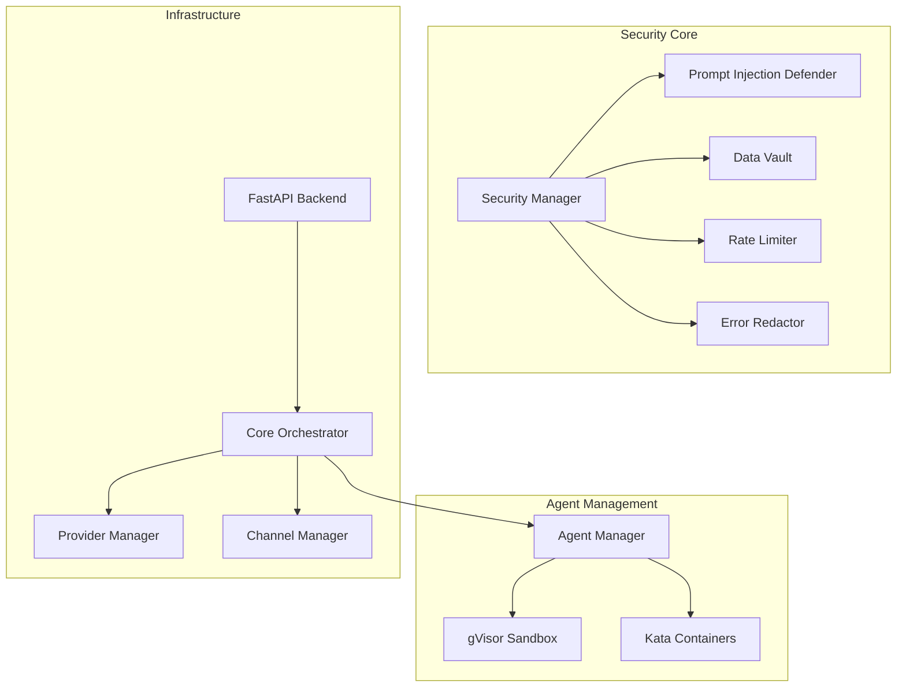

**Diagram sources**
- [security.py](file://backend/app/core/security.py#L498-L836)
- [agent_manager.py](file://backend/app/core/agent_manager.py#L65-L192)
- [orchestrator.py](file://backend/app/core/orchestrator.py#L95-L138)

**Section sources**
- [README.md](file://README.md#L134-L155)
- [security.py](file://backend/app/core/security.py#L1-L891)

## Core Security Components

### Enhanced Prompt Injection Defender

The Prompt Injection Defender serves as the primary line of defense against prompt injection attacks, implementing multiple detection mechanisms and sanitization techniques with expanded pattern recognition capabilities.

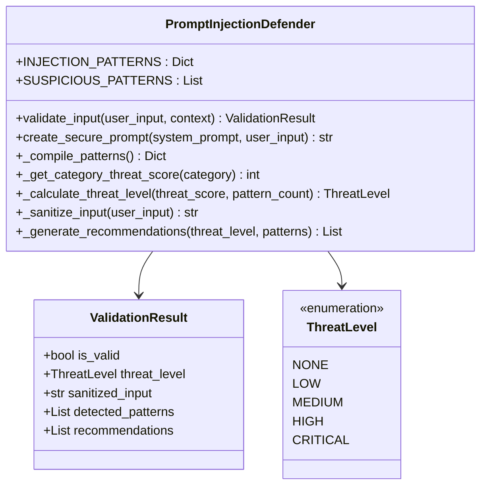

**Diagram sources**
- [security.py](file://backend/app/core/security.py#L36-L292)

The defender implements comprehensive pattern matching across seven categories of injection attempts with enhanced threat scoring:

| Attack Category | Detection Patterns | Enhanced Threat Score |
|----------------|-------------------|--------------|
| Instruction Override | Ignore commands, bypass protocols, override instructions | 7 |
| Role Manipulation | Act as system, pretend to be admin, role play modes | 6 |
| Delimiter Manipulation | Code blocks, system tags, special delimiters | 6 |
| Encoding Obfuscation | Base64, hex, ROT13, template injection | 5 |
| Context Manipulation | System prompt, admin mode, debug mode | 5 |
| Persistence Attempts | Remember forever, save permanently, permanent change | 4 |
| Tool Hijacking | Dangerous system commands, privilege escalation | 7 |

**Updated** Added new "tool_hijacking" category with enhanced patterns for detecting dangerous system command execution attempts.

**Section sources**
- [security.py](file://backend/app/core/security.py#L43-L97)
- [security.py](file://backend/app/core/security.py#L186-L197)

### Data Vault Security

The Data Vault provides encrypted storage for sensitive information including API keys, credentials, and other secrets using industry-standard cryptography.

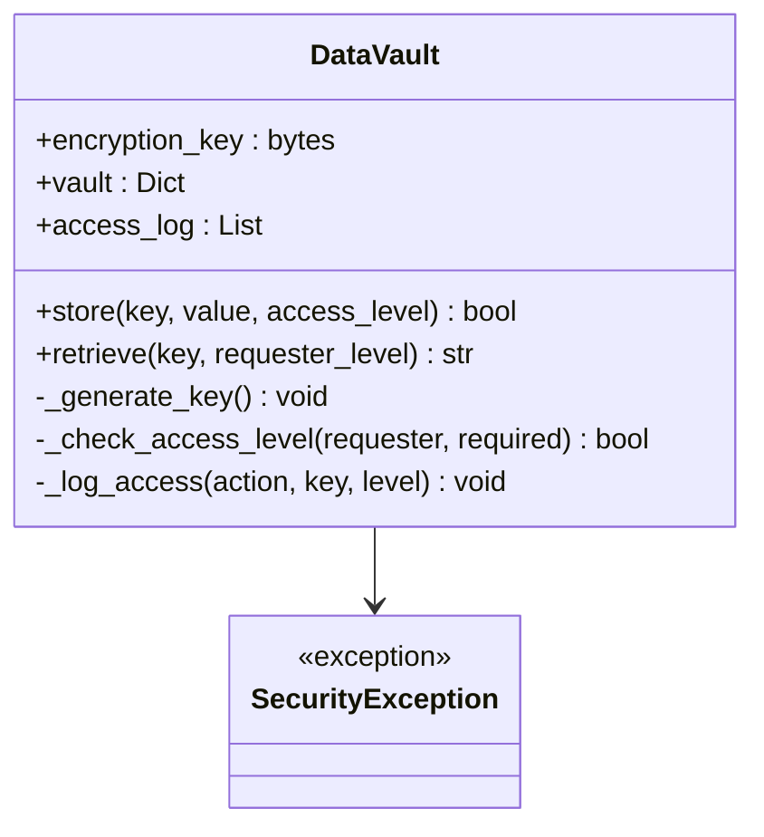

**Diagram sources**
- [security.py](file://backend/app/core/security.py#L329-L437)

The vault implements hierarchical access control with four security levels:

| Access Level | Description | Required Privileges |
|-------------|-------------|-------------------|
| Public | General access | Any authenticated user |
| Standard | Basic operations | Standard user privileges |
| Elevated | Sensitive operations | Elevated user privileges |
| Admin | Administrative functions | Highest privileges |

**Section sources**
- [security.py](file://backend/app/core/security.py#L418-L428)
- [security.py](file://backend/app/core/security.py#L351-L417)

### Enhanced Error Message Redaction

The system now includes comprehensive error message redaction capabilities to prevent sensitive data exposure in error logs and messages.

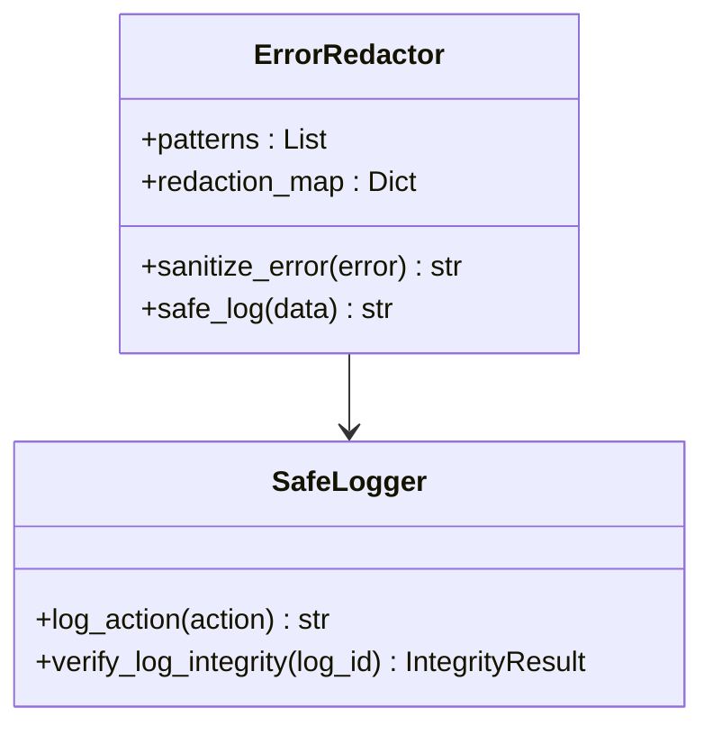

**Diagram sources**
- [security.py](file://backend/app/core/security.py#L802-L836)

**Section sources**
- [security.py](file://backend/app/core/security.py#L802-L836)

## Architecture Overview

The Security Manager System follows a layered security architecture with multiple overlapping defense mechanisms:

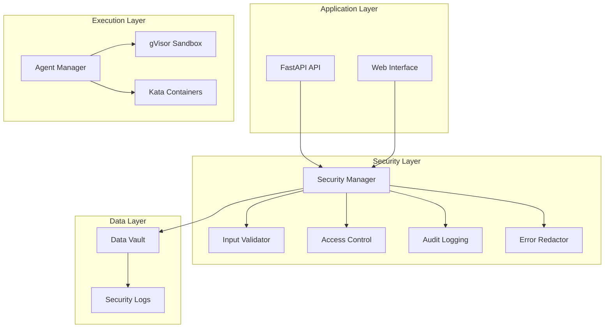

**Diagram sources**
- [main.py](file://backend/app/main.py#L131-L182)
- [security.py](file://backend/app/core/security.py#L498-L518)
- [agent_manager.py](file://backend/app/core/agent_manager.py#L65-L98)

The architecture implements Zero-Trust principles where every request is authenticated, authorized, and continuously validated throughout its lifecycle.

**Section sources**
- [README.md](file://README.md#L65-L105)
- [orchestrator.py](file://backend/app/core/orchestrator.py#L95-L118)

## Security Manager Implementation

### Unified Security API

The Security Manager provides a centralized interface for all security operations, offering a unified API for validation, access control, and auditing with enhanced error handling.

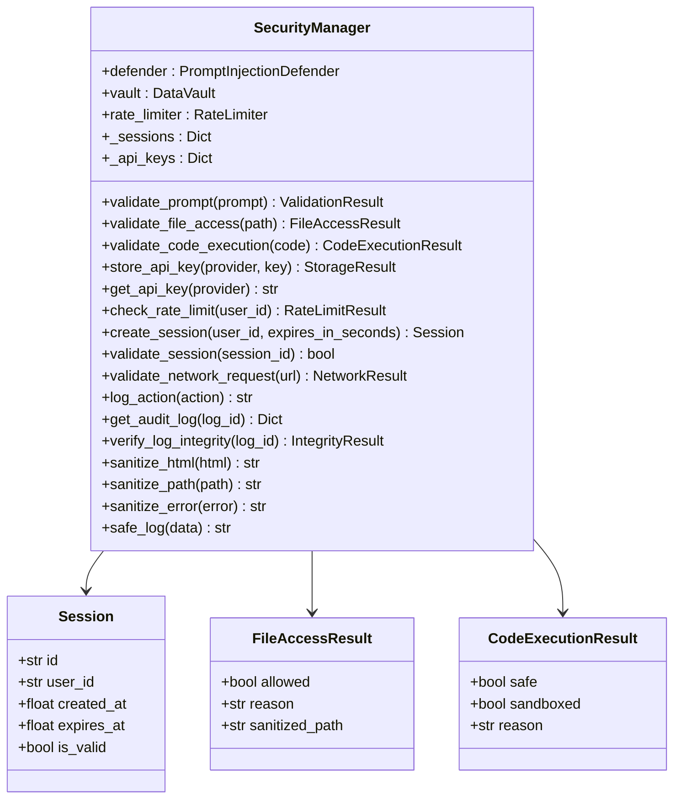

**Diagram sources**
- [security.py](file://backend/app/core/security.py#L498-L836)

### Enhanced Rate Limiting and Protection

The system implements comprehensive rate limiting to prevent abuse and protect against various attack vectors including brute force attempts and denial-of-service attacks.

**Section sources**
- [security.py](file://backend/app/core/security.py#L294-L322)
- [security.py](file://backend/app/core/security.py#L623-L634)

## Agent Management Security

### Hardened Sandbox Architecture

The Agent Manager implements true kernel-level isolation using gVisor and Kata Containers, providing defense against container escape attempts and privilege escalation.

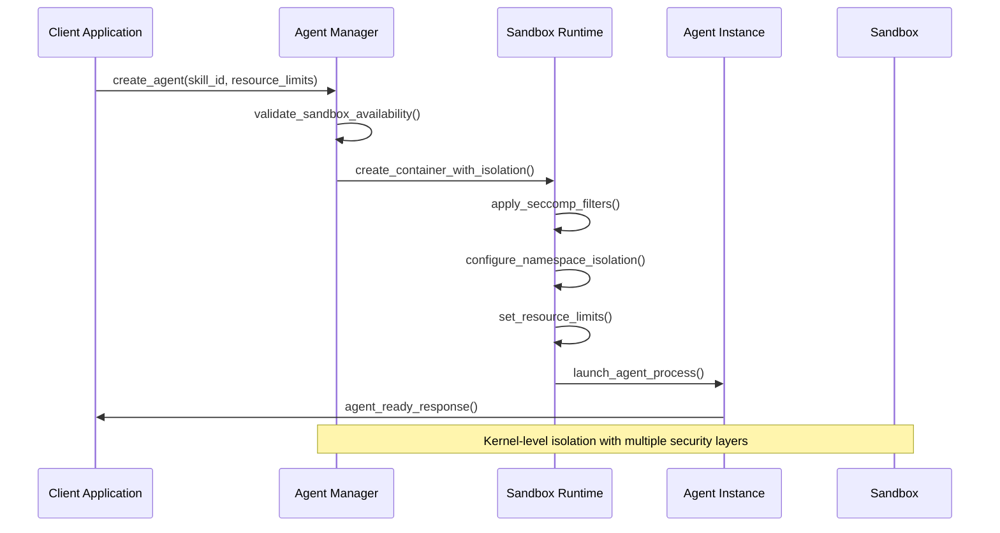

**Diagram sources**
- [agent_manager.py](file://backend/app/core/agent_manager.py#L149-L192)
- [agent_manager.py](file://backend/app/core/agent_manager.py#L203-L261)

The sandbox implementation includes:

- **Seccomp Filters**: Restrict system calls to essential operations only
- **Namespace Isolation**: Separate PID, network, IPC, and mount namespaces
- **Resource Limits**: CPU, memory, disk, and process count restrictions
- **Read-Only Filesystems**: Prevent modification of system files
- **Network Isolation**: Disable network access by default

**Updated** Enhanced subprocess usage detection with expanded patterns for dangerous system command execution.

**Section sources**
- [agent_manager.py](file://backend/app/core/agent_manager.py#L310-L473)
- [agent_manager.py](file://backend/app/core/agent_manager.py#L586-L627)

## Multi-Provider Security

### Provider Authentication and Authorization

The Provider Manager secures communication with external AI services through comprehensive authentication, authorization, and encryption mechanisms.

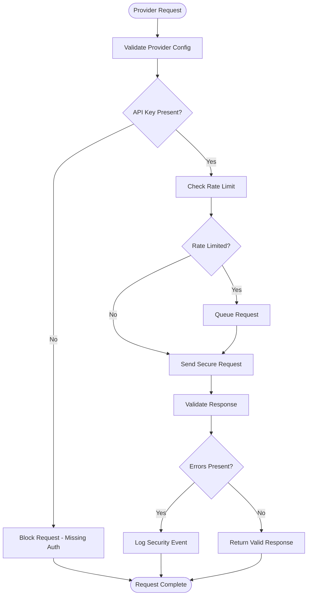

**Diagram sources**
- [providers.py](file://backend/app/core/providers.py#L427-L481)

**Section sources**
- [providers.py](file://backend/app/core/providers.py#L28-L43)
- [providers.py](file://backend/app/core/providers.py#L416-L522)

## Channel Security

### Multi-Channel Access Control

The Channel Manager implements comprehensive security controls for all communication channels including Telegram, Discord, Slack, and Web UI.

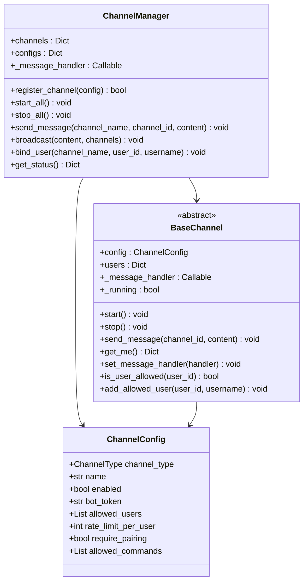

**Diagram sources**
- [channels.py](file://backend/app/core/channels.py#L404-L502)

**Section sources**
- [channels.py](file://backend/app/core/channels.py#L41-L134)
- [channels.py](file://backend/app/core/channels.py#L404-L523)

## Testing and Validation

### Comprehensive Security Testing

The system includes extensive security testing covering prompt injection, access control, data protection, and network security validation with enhanced coverage for new detection patterns.

```mermaid
graph TB
subgraph "Security Test Categories"
PIT[Prompt Injection Tests]
ACT[Access Control Tests]
DTP[Data Protection Tests]
NET[Network Security Tests]
HITL[HITL Functionality Tests]
AUD[Audit Logging Tests]
ER[Error Redaction Tests]
end
subgraph "Test Coverage"
PI1[Basic Injection Patterns]
PI2[Encoded Attacks]
PI3[Role Manipulation]
PI4[Safe Prompts]
PI5[Tool Hijacking Attempts]
AC1[Unauthorized Access Blocked]
AC2[Sandboxed Execution]
DP1[API Key Encryption]
DP2[Sensitive Data Redaction]
NS1[Localhost Binding]
NS2[External Requests Blocked]
HITL1[Dangerous Actions Require Approval]
HITL2[Safe Actions Auto-Approved]
AUD1[All Actions Logged]
AUD2[Tamper Detection]
ER1[Error Messages Redacted]
ER2[Sensitive Data Protection]
end
PIT --> PI1
PIT --> PI2
PIT --> PI3
PIT --> PI4
PIT --> PI5
ACT --> AC1
ACT --> AC2
DP --> DP1
DP --> DP2
NET --> NS1
NET --> NS2
HITL --> HITL1
HITL --> HITL2
AUD --> AUD1
AUD --> AUD2
ER --> ER1
ER --> ER2
```

**Diagram sources**
- [test_security.py](file://backend/tests/test_security.py#L17-L275)

**Updated** Enhanced testing coverage includes new tool hijacking detection patterns and error message redaction validation.

**Section sources**
- [test_security.py](file://backend/tests/test_security.py#L1-L275)

## Deployment Security

### Production-Ready Security Configuration

The deployment infrastructure implements comprehensive security hardening including container isolation, network security, and runtime protection.

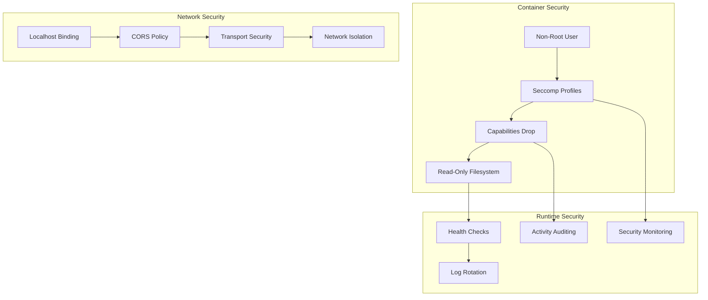

**Diagram sources**
- [Dockerfile](file://Dockerfile#L40-L95)
- [docker-compose.yml](file://docker-compose.yml#L27-L32)

**Section sources**
- [Dockerfile](file://Dockerfile#L1-L95)
- [docker-compose.yml](file://docker-compose.yml#L1-L77)

## Troubleshooting Guide

### Common Security Issues and Solutions

| Issue | Symptoms | Solution |
|-------|----------|----------|
| Prompt Injection Detected | Validation errors, blocked input | Review input patterns, adjust sanitization thresholds |
| Sandbox Creation Failed | Container startup errors | Verify gVisor/Kata installation, check system resources |
| API Key Retrieval Failure | Empty API key responses | Check access levels, verify encryption key |
| Rate Limit Exceeded | Request throttling, blocked operations | Adjust rate limits, implement exponential backoff |
| Audit Log Integrity Issues | Log verification failures | Check log storage permissions, verify file integrity |
| Error Message Exposure | Sensitive data in logs | Use sanitize_error() method, enable safe logging |

**Updated** Added troubleshooting guidance for error message redaction and tool hijacking detection issues.

### Security Monitoring and Debugging

The system provides comprehensive logging and monitoring capabilities for security events:

- **Security Events**: Prompt injection attempts, access violations, system errors
- **Audit Trails**: Complete action logs with timestamps and user context
- **Performance Metrics**: Request rates, response times, resource utilization
- **Alerting**: Configurable notifications for security incidents

**Section sources**
- [security.py](file://backend/app/core/security.py#L180-L184)
- [orchestrator.py](file://backend/app/core/orchestrator.py#L492-L513)

## Conclusion

The Security Manager System represents a comprehensive approach to AI assistant security, implementing defense-in-depth principles across multiple layers of the application stack. By combining prompt injection prevention, hardened sandboxing, encrypted data storage, and comprehensive access controls, the system provides robust protection against sophisticated threats.

Key security achievements include:

- **Zero-Trust Architecture**: Every action is verified and audited
- **Kernel-Level Isolation**: True sandboxing with gVisor and Kata Containers
- **Multi-Layered Defense**: Comprehensive protection against various attack vectors
- **Enhanced Pattern Recognition**: Expanded regex patterns for prompt injection detection
- **Subprocess Safety**: Comprehensive detection of dangerous system command execution
- **Improved Path Sanitization**: Enhanced URL decoding and normalization
- **Error Message Protection**: Comprehensive redaction of sensitive data in logs
- **Comprehensive Logging**: Complete audit trails for forensic analysis
- **Production-Ready Security**: Container hardening and deployment security

The system's modular design allows for easy maintenance and extension while maintaining strong security guarantees. Regular security testing and continuous monitoring ensure ongoing protection against emerging threats.

**Updated** Recent enhancements significantly strengthen the system's ability to detect and prevent sophisticated prompt injection attacks, particularly those involving tool hijacking and dangerous system command execution, while improving overall error handling and data protection capabilities.