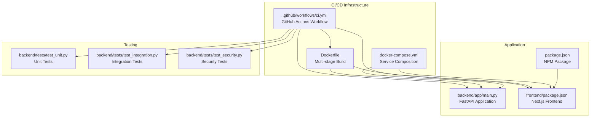
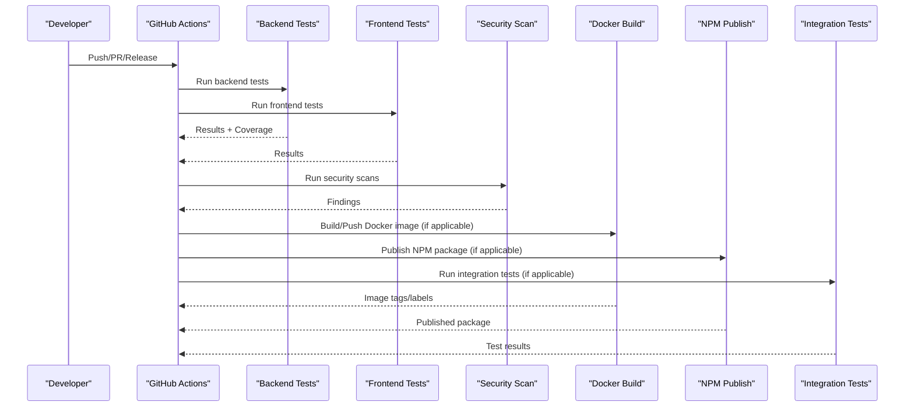
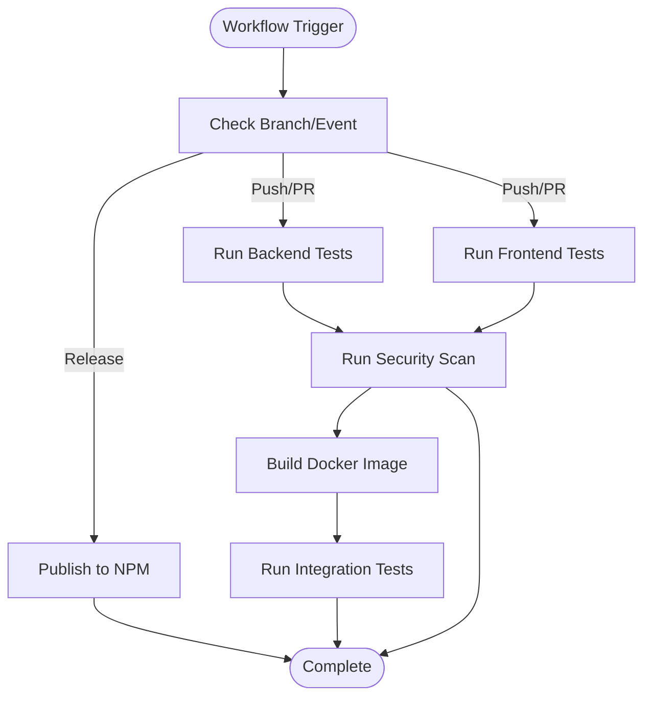
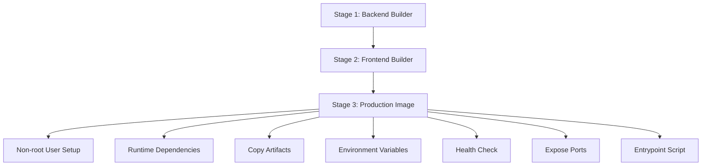
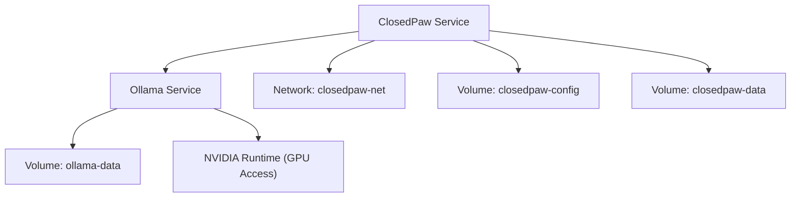
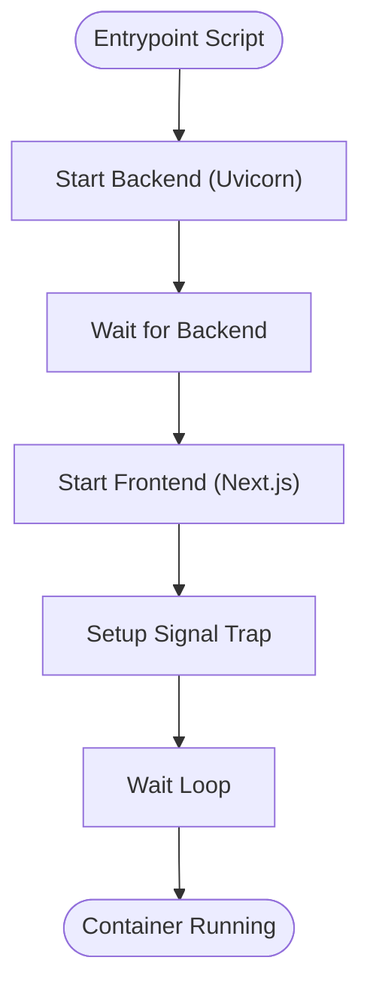
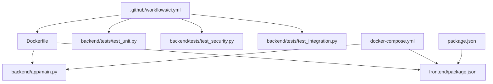

# CI/CD Pipeline Automation

<cite>
**Referenced Files in This Document**
- [.github/workflows/ci.yml](file://.github/workflows/ci.yml)
- [Dockerfile](file://Dockerfile)
- [docker-compose.yml](file://docker-compose.yml)
- [package.json](file://package.json)
- [backend/requirements.txt](file://backend/requirements.txt)
- [docker/entrypoint.sh](file://docker/entrypoint.sh)
- [frontend/package.json](file://frontend/package.json)
- [backend/app/main.py](file://backend/app/main.py)
- [backend/tests/test_unit.py](file://backend/tests/test_unit.py)
- [backend/tests/test_integration.py](file://backend/tests/test_integration.py)
- [backend/tests/test_security.py](file://backend/tests/test_security.py)
- [installer/install.sh](file://installer/install.sh)
- [installer/install.ps1](file://installer/install.ps1)
- [README.md](file://README.md)
- [CONTRIBUTING.md](file://CONTRIBUTING.md)
</cite>

## Table of Contents
1. [Introduction](#introduction)
2. [Project Structure](#project-structure)
3. [Core Components](#core-components)
4. [Architecture Overview](#architecture-overview)
5. [Detailed Component Analysis](#detailed-component-analysis)
6. [Dependency Analysis](#dependency-analysis)
7. [Performance Considerations](#performance-considerations)
8. [Troubleshooting Guide](#troubleshooting-guide)
9. [Conclusion](#conclusion)

## Introduction
This document provides a comprehensive analysis of the CI/CD pipeline automation implemented in the ClosedPaw project. The pipeline encompasses continuous integration, automated testing, security scanning, containerized builds, and deployment orchestration. It integrates GitHub Actions workflows, Docker multi-stage builds, and comprehensive test suites to ensure code quality, security, and reliability across backend and frontend components.

## Project Structure
The CI/CD system spans multiple layers:
- GitHub Actions workflow orchestrates jobs for backend and frontend testing, security scanning, Docker image building, NPM publishing, and integration testing.
- Docker multi-stage build produces a secure, production-ready image with non-root user execution and health checks.
- docker-compose defines service composition for local development and testing, including Ollama and sandbox configurations.
- Package manifests define cross-platform distribution and dependency management for both backend and frontend.

**Diagram sources**
- [.github/workflows/ci.yml](file://.github/workflows/ci.yml#L1-L227)
- [Dockerfile](file://Dockerfile#L1-L95)
- [docker-compose.yml](file://docker-compose.yml#L1-L77)
- [backend/app/main.py](file://backend/app/main.py#L1-L567)
- [frontend/package.json](file://frontend/package.json#L1-L38)
- [package.json](file://package.json#L1-L54)
- [backend/tests/test_unit.py](file://backend/tests/test_unit.py#L1-L167)
- [backend/tests/test_integration.py](file://backend/tests/test_integration.py#L1-L230)
- [backend/tests/test_security.py](file://backend/tests/test_security.py#L1-L275)

**Section sources**
- [.github/workflows/ci.yml](file://.github/workflows/ci.yml#L1-L227)
- [Dockerfile](file://Dockerfile#L1-L95)
- [docker-compose.yml](file://docker-compose.yml#L1-L77)
- [package.json](file://package.json#L1-L54)
- [frontend/package.json](file://frontend/package.json#L1-L38)
- [backend/app/main.py](file://backend/app/main.py#L1-L567)

## Core Components
The CI/CD pipeline consists of the following primary components:

- Backend Tests Job: Executes Python unit and security tests with coverage reporting and uploads coverage metrics.
- Frontend Tests Job: Installs Node.js dependencies, runs linting, builds the frontend, and executes tests.
- Security Scan Job: Performs vulnerability scanning using Trivy, security linting with Bandit, and npm audit.
- Docker Build Job: Builds and pushes Docker images to GitHub Container Registry with metadata tagging and caching.
- NPM Publish Job: Publishes the NPM package on release events with authentication.
- Integration Tests Job: Runs integration tests against a local Ollama instance using Docker services.

Key environment variables and job dependencies are defined centrally to ensure consistent execution across platforms.

**Section sources**
- [.github/workflows/ci.yml](file://.github/workflows/ci.yml#L11-L13)
- [.github/workflows/ci.yml](file://.github/workflows/ci.yml#L19-L56)
- [.github/workflows/ci.yml](file://.github/workflows/ci.yml#L61-L95)
- [.github/workflows/ci.yml](file://.github/workflows/ci.yml#L99-L126)
- [.github/workflows/ci.yml](file://.github/workflows/ci.yml#L130-L169)
- [.github/workflows/ci.yml](file://.github/workflows/ci.yml#L173-L196)
- [.github/workflows/ci.yml](file://.github/workflows/ci.yml#L200-L227)

## Architecture Overview
The CI/CD architecture follows a staged pipeline with explicit dependencies and parallel execution where possible. The workflow triggers on pushes to main and develop, pull requests targeting those branches, and releases. Jobs are orchestrated to minimize redundant work and maximize security verification.

**Diagram sources**
- [.github/workflows/ci.yml](file://.github/workflows/ci.yml#L3-L10)
- [.github/workflows/ci.yml](file://.github/workflows/ci.yml#L15-L227)

## Detailed Component Analysis

### GitHub Actions Workflow
The workflow defines a comprehensive CI/CD pipeline with the following characteristics:
- Triggers: push to main/develop, pull_request to main/develop, release published.
- Environment: Python 3.11 and Node.js 20 are used consistently across jobs.
- Backend Tests: Installs dependencies, runs linting with Ruff, executes pytest with coverage, and uploads coverage to Codecov.
- Frontend Tests: Sets up Node.js, installs dependencies, runs linting and tests, and builds the Next.js application.
- Security Scan: Uses Trivy for filesystem scanning, Bandit for Python security linting, and npm audit for JavaScript dependencies.
- Docker Build: Utilizes Docker Buildx with metadata extraction, login to GHCR, and cache optimization.
- NPM Publish: Publishes the package to the public registry on release events with authentication.
- Integration Tests: Starts Ollama as a service, pulls a test model, and runs backend integration tests.

**Diagram sources**
- [.github/workflows/ci.yml](file://.github/workflows/ci.yml#L3-L10)
- [.github/workflows/ci.yml](file://.github/workflows/ci.yml#L19-L56)
- [.github/workflows/ci.yml](file://.github/workflows/ci.yml#L61-L95)
- [.github/workflows/ci.yml](file://.github/workflows/ci.yml#L99-L126)
- [.github/workflows/ci.yml](file://.github/workflows/ci.yml#L130-L169)
- [.github/workflows/ci.yml](file://.github/workflows/ci.yml#L173-L196)
- [.github/workflows/ci.yml](file://.github/workflows/ci.yml#L200-L227)

**Section sources**
- [.github/workflows/ci.yml](file://.github/workflows/ci.yml#L1-L227)

### Docker Multi-Stage Build
The Dockerfile implements a multi-stage build process:
- Backend Builder: Installs Python build dependencies and backend requirements.
- Frontend Builder: Installs Node.js dependencies and builds the Next.js application.
- Production Image: Creates a non-root user, installs runtime dependencies, copies built artifacts, sets environment variables, configures health checks, exposes ports, and defines the entrypoint script.

**Diagram sources**
- [Dockerfile](file://Dockerfile#L1-L95)

**Section sources**
- [Dockerfile](file://Dockerfile#L1-L95)

### docker-compose Service Configuration
The compose file defines:
- ClosedPaw service: Builds from the Dockerfile, binds ports 3000/8000, mounts configuration and data volumes, depends on Ollama health, and applies security options.
- Ollama service: Runs the latest Ollama image, exposes port 11434, mounts data volume, and configures GPU access via NVIDIA runtime.
- Networks and volumes: Defines a bridge network and named volumes for persistent data.

**Diagram sources**
- [docker-compose.yml](file://docker-compose.yml#L1-L77)

**Section sources**
- [docker-compose.yml](file://docker-compose.yml#L1-L77)

### Test Suites and Coverage
The repository includes comprehensive test suites:
- Unit Tests: Validate LLM provider functionality, input sanitization, rate limiting, session management, and error handling.
- Security Tests: Focus on prompt injection defense, access control, data protection, Human-in-the-Loop validation, network security, and audit logging.
- Integration Tests: Verify API health, chat functionality, model management, security controls, and performance under load.

These tests are executed in parallel within the CI pipeline and produce coverage reports for backend components.

**Section sources**
- [backend/tests/test_unit.py](file://backend/tests/test_unit.py#L1-L167)
- [backend/tests/test_security.py](file://backend/tests/test_security.py#L1-L275)
- [backend/tests/test_integration.py](file://backend/tests/test_integration.py#L1-L230)

### Entrypoint Script and Application Startup
The entrypoint script starts both backend and frontend services:
- Starts Uvicorn server for the FastAPI backend on port 8000.
- Waits briefly for backend readiness.
- Starts Next.js frontend on port 3000.
- Handles graceful shutdown and prints runtime information.

**Diagram sources**
- [docker/entrypoint.sh](file://docker/entrypoint.sh#L1-L35)

**Section sources**
- [docker/entrypoint.sh](file://docker/entrypoint.sh#L1-L35)

### Package and Distribution Management
- NPM Package: Defines the CLI entry point, files included, engines requirement, and postinstall script.
- Frontend Dependencies: Specifies Next.js, React, and UI libraries for the web interface.
- Backend Dependencies: Lists FastAPI, Uvicorn, Pydantic, SQLAlchemy, cryptography, and testing tools.

**Section sources**
- [package.json](file://package.json#L1-L54)
- [frontend/package.json](file://frontend/package.json#L1-L38)
- [backend/requirements.txt](file://backend/requirements.txt#L1-L34)

### Installation Scripts and Developer Experience
- Bash Installer (Linux/macOS): Automates sandbox installation (gVisor), dependency checks, Ollama configuration, model selection, and service setup.
- PowerShell Installer (Windows): Provides equivalent functionality with platform-specific package managers and WSL/Docker Desktop detection.

**Section sources**
- [installer/install.sh](file://installer/install.sh#L1-L823)
- [installer/install.ps1](file://installer/install.ps1#L1-L578)

## Dependency Analysis
The CI/CD pipeline exhibits strong separation of concerns:
- GitHub Actions coordinates all stages and enforces job dependencies.
- Docker encapsulates runtime dependencies and ensures reproducibility.
- Compose orchestrates multi-service environments for development and testing.
- Test suites validate correctness, security, and performance across components.

**Diagram sources**
- [.github/workflows/ci.yml](file://.github/workflows/ci.yml#L1-L227)
- [Dockerfile](file://Dockerfile#L1-L95)
- [docker-compose.yml](file://docker-compose.yml#L1-L77)
- [backend/app/main.py](file://backend/app/main.py#L1-L567)
- [frontend/package.json](file://frontend/package.json#L1-L38)
- [package.json](file://package.json#L1-L54)

**Section sources**
- [.github/workflows/ci.yml](file://.github/workflows/ci.yml#L1-L227)
- [Dockerfile](file://Dockerfile#L1-L95)
- [docker-compose.yml](file://docker-compose.yml#L1-L77)
- [backend/app/main.py](file://backend/app/main.py#L1-L567)
- [frontend/package.json](file://frontend/package.json#L1-L38)
- [package.json](file://package.json#L1-L54)

## Performance Considerations
- Parallelization: Backend and frontend jobs run concurrently to reduce total pipeline duration.
- Caching: Pip and npm caches are utilized to accelerate dependency installation.
- Build Optimization: Docker Buildx with GH cache improves rebuild times.
- Resource Constraints: Integration tests use a controlled Ollama model pull and bounded timeouts.

## Troubleshooting Guide
Common issues and resolutions:
- Python/Node.js Version Mismatch: Ensure local versions match workflow environment variables.
- Dependency Installation Failures: Verify cache configuration and network access during pip/npm install steps.
- Security Scan Failures: Address Trivy and Bandit findings; review severity thresholds and remediation steps.
- Docker Build Errors: Confirm Buildx availability, registry credentials, and image metadata configuration.
- Integration Test Failures: Validate Ollama service health, model availability, and environment variable configuration.

**Section sources**
- [.github/workflows/ci.yml](file://.github/workflows/ci.yml#L11-L13)
- [.github/workflows/ci.yml](file://.github/workflows/ci.yml#L33-L38)
- [.github/workflows/ci.yml](file://.github/workflows/ci.yml#L76-L79)
- [.github/workflows/ci.yml](file://.github/workflows/ci.yml#L140-L148)
- [.github/workflows/ci.yml](file://.github/workflows/ci.yml#L216-L225)

## Conclusion
The CI/CD pipeline in ClosedPaw establishes a robust foundation for automated quality assurance, security validation, and reliable delivery. By leveraging GitHub Actions, Docker multi-stage builds, and comprehensive test suites, the project maintains high standards for correctness, security, and developer productivity. The documented architecture and troubleshooting guidance facilitate maintenance and extension of the pipeline across diverse environments.