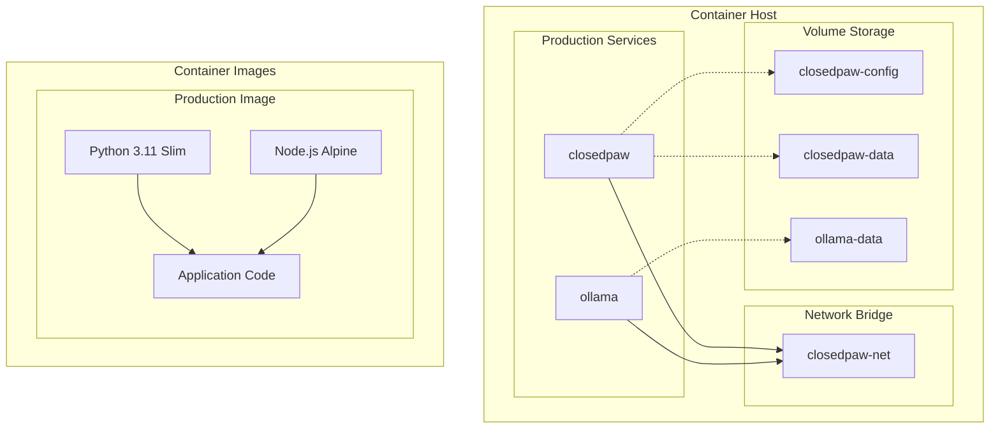
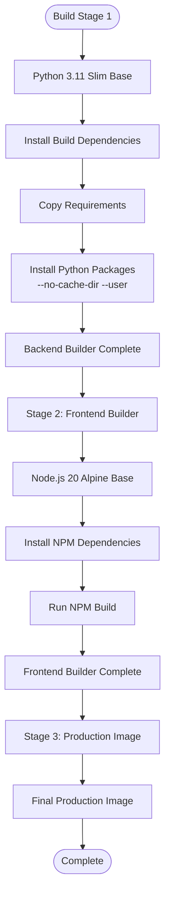
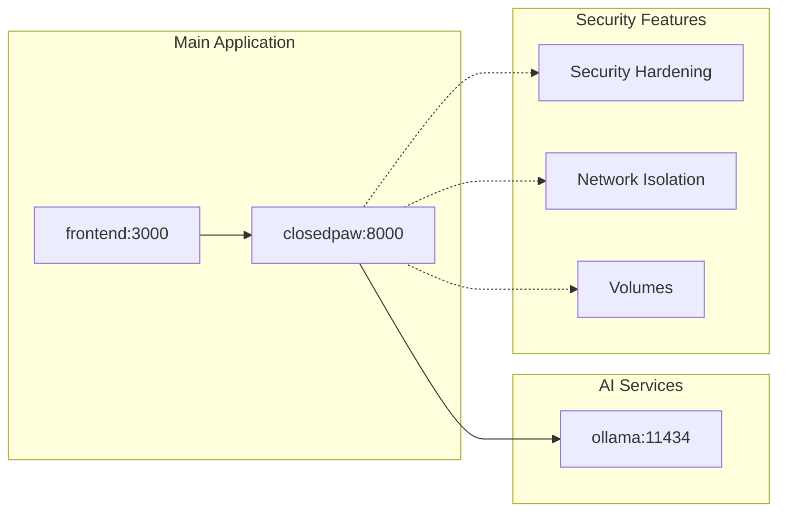
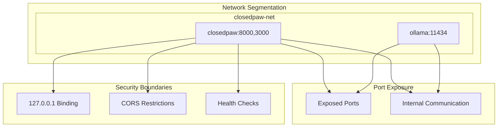
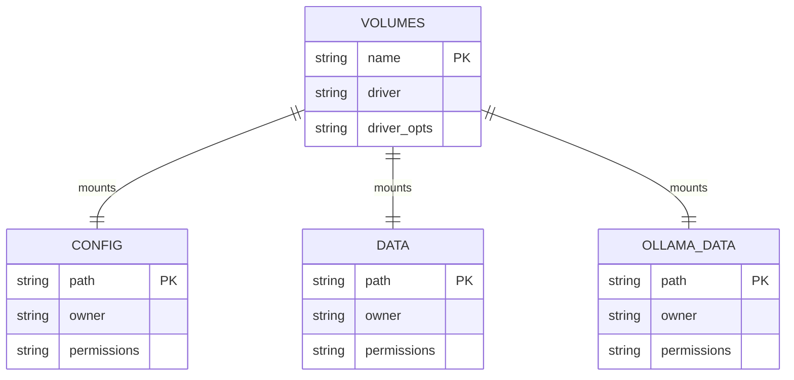
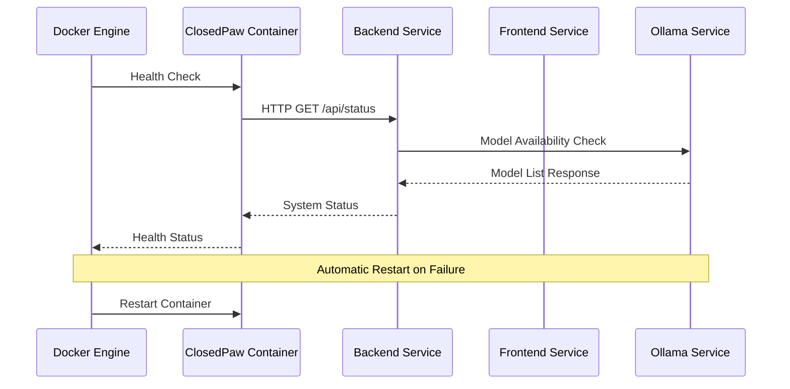

# Containerization Infrastructure

<cite>
**Referenced Files in This Document**
- [Dockerfile](file://Dockerfile)
- [docker-compose.yml](file://docker-compose.yml)
- [.dockerignore](file://.dockerignore)
- [docker/entrypoint.sh](file://docker/entrypoint.sh)
- [backend/app/main.py](file://backend/app/main.py)
- [backend/requirements.txt](file://backend/requirements.txt)
- [frontend/package.json](file://frontend/package.json)
- [frontend/next.config.js](file://frontend/next.config.js)
- [backend/app/core/security.py](file://backend/app/core/security.py)
- [backend/app/core/providers.py](file://backend/app/core/providers.py)
- [README.md](file://README.md)
</cite>

## Table of Contents
1. [Introduction](#introduction)
2. [Containerization Architecture](#containerization-architecture)
3. [Multi-Stage Docker Build](#multi-stage-docker-build)
4. [Service Composition](#service-composition)
5. [Security Hardening](#security-hardening)
6. [Networking Configuration](#networking-configuration)
7. [Volume Management](#volume-management)
8. [Health Monitoring](#health-monitoring)
9. [Production Deployment](#production-deployment)
10. [Troubleshooting Guide](#troubleshooting-guide)
11. [Conclusion](#conclusion)

## Introduction

ClosedPaw implements a comprehensive containerization infrastructure that combines modern Docker practices with advanced security hardening. The system consists of a multi-service architecture featuring a FastAPI backend, Next.js frontend, and Ollama local AI services, all orchestrated through a sophisticated containerization strategy designed for zero-trust security principles.

The containerization approach emphasizes production-readiness with security-first design, implementing defense-in-depth strategies through container isolation, non-root execution, health monitoring, and comprehensive volume management for persistent data storage.

## Containerization Architecture

The ClosedPaw containerization infrastructure follows a microservices architecture pattern with clear separation of concerns and robust security boundaries.

**Diagram sources**
- [docker-compose.yml](file://docker-compose.yml#L1-L77)
- [Dockerfile](file://Dockerfile#L1-L95)

The architecture implements a zero-trust security model where each container operates with minimal privileges and clear network boundaries. The system separates concerns through distinct containers for the main application, AI inference engine, and supporting services.

**Section sources**
- [docker-compose.yml](file://docker-compose.yml#L1-L77)
- [Dockerfile](file://Dockerfile#L1-L95)

## Multi-Stage Docker Build

The Dockerfile implements a sophisticated three-stage build process designed for optimal security and performance characteristics.

### Stage 1: Backend Builder
The first stage focuses on building and installing Python dependencies in a controlled environment with minimal attack surface.

**Diagram sources**
- [Dockerfile](file://Dockerfile#L5-L34)

### Stage 2: Frontend Builder
The frontend build process utilizes Next.js for server-side rendering and static optimization, ensuring optimal performance for the web interface.

### Stage 3: Production Image
The final production stage creates a hardened container with security best practices implemented from the ground up.

**Section sources**
- [Dockerfile](file://Dockerfile#L1-L95)
- [backend/requirements.txt](file://backend/requirements.txt#L1-L34)

## Service Composition

The docker-compose configuration orchestrates multiple interconnected services with clear dependency relationships and security boundaries.

**Diagram sources**
- [docker-compose.yml](file://docker-compose.yml#L3-L26)

### Main Application Service
The closedpaw service serves as the central orchestrator, exposing both the FastAPI backend (port 8000) and Next.js frontend (port 3000) within a single container for simplified deployment.

### Ollama AI Service
The Ollama service provides local AI inference capabilities with GPU acceleration support for enhanced performance.

### Security Enhancements
The compose configuration implements multiple security layers including privilege restrictions, network isolation, and resource limitations.

**Section sources**
- [docker-compose.yml](file://docker-compose.yml#L1-L77)

## Security Hardening

The containerization infrastructure implements comprehensive security measures at multiple layers to ensure zero-trust operation.

### Non-Root Execution
All services operate under dedicated non-root users with restricted privileges, minimizing potential impact from security vulnerabilities.

### Filesystem Hardening
The production image implements read-only filesystem policies for application code while maintaining writable directories for configuration and data persistence.

### Network Security
Strict network isolation ensures services communicate only through designated ports and internal networks, preventing unauthorized external access.

### Resource Constraints
GPU access is provisioned through NVIDIA runtime capabilities, enabling hardware-accelerated AI inference while maintaining container isolation.

**Section sources**
- [Dockerfile](file://Dockerfile#L40-L86)
- [docker-compose.yml](file://docker-compose.yml#L27-L52)

## Networking Configuration

The container networking strategy implements strict isolation while enabling necessary inter-service communication.

**Diagram sources**
- [docker-compose.yml](file://docker-compose.yml#L13-L26)
- [backend/app/main.py](file://backend/app/main.py#L80-L87)

The network configuration enforces localhost-only binding for security, with explicit port mappings for external access while maintaining internal service communication through the bridge network.

**Section sources**
- [docker-compose.yml](file://docker-compose.yml#L66-L72)
- [backend/app/main.py](file://backend/app/main.py#L80-L87)

## Volume Management

Persistent storage is managed through named volumes to ensure data persistence across container restarts while maintaining security boundaries.

**Diagram sources**
- [docker-compose.yml](file://docker-compose.yml#L73-L77)

The volume strategy separates configuration data, application data, and AI model storage into distinct persistent volumes, each with appropriate ownership and permission controls.

**Section sources**
- [docker-compose.yml](file://docker-compose.yml#L19-L21)
- [docker-compose.yml](file://docker-compose.yml#L73-L77)

## Health Monitoring

Comprehensive health monitoring ensures system reliability and automatic recovery from failures.

**Diagram sources**
- [Dockerfile](file://Dockerfile#L78-L80)
- [docker-compose.yml](file://docker-compose.yml#L53-L58)

The health monitoring system implements layered checks from container-level to service-level, ensuring comprehensive system observability and automatic recovery mechanisms.

**Section sources**
- [Dockerfile](file://Dockerfile#L78-L80)
- [docker-compose.yml](file://docker-compose.yml#L53-L58)

## Production Deployment

The production deployment strategy emphasizes security, performance, and maintainability through standardized containerization practices.

### Environment Configuration
The system uses environment variables for flexible configuration while maintaining security through non-root execution and restricted filesystem access.

### GPU Acceleration
NVIDIA runtime capabilities enable hardware-accelerated AI inference while maintaining container isolation and security boundaries.

### Resource Management
CPU and memory limits ensure predictable performance while preventing resource exhaustion attacks.

**Section sources**
- [docker-compose.yml](file://docker-compose.yml#L16-L31)
- [docker-compose.yml](file://docker-compose.yml#L46-L52)

## Troubleshooting Guide

Common containerization issues and their resolution strategies:

### Container Startup Failures
- Verify Docker daemon is running and has sufficient resources
- Check container logs for initialization errors
- Ensure required environment variables are properly configured

### Port Conflicts
- Verify ports 3000, 8000, and 11434 are available on the host system
- Check for conflicting applications using these ports
- Review firewall configuration for port accessibility

### Volume Mount Issues
- Verify volume permissions and ownership
- Check disk space availability for persistent volumes
- Ensure proper volume cleanup during container removal

### Health Check Failures
- Monitor service dependencies (Ollama availability)
- Check network connectivity between containers
- Verify application configuration and database connectivity

**Section sources**
- [docker-compose.yml](file://docker-compose.yml#L12-L24)
- [Dockerfile](file://Dockerfile#L78-L80)

## Conclusion

The ClosedPaw containerization infrastructure demonstrates enterprise-grade containerization practices with strong emphasis on security, performance, and maintainability. The multi-stage build process, comprehensive security hardening, and robust orchestration provide a solid foundation for production deployment while maintaining the system's zero-trust security principles.

The architecture successfully balances security requirements with operational simplicity, providing clear separation of concerns, comprehensive monitoring, and automated recovery mechanisms essential for production environments.